# AA-Hackathon Enterprise Assistant — Master Specification

**Organization:** Aligned Automation
**Platform:** Enterprise AI Assistant
**Version:** 1.0 — Specification Framework
**Last Updated:** 2026-06-07
**Status:** Active Development

---

## Platform Identity

The **AA-Hackathon Enterprise Assistant** is an enterprise-grade AI platform built by **Aligned Automation**. It is not a chatbot. It is a multi-agent, domain-aware, retrieval-augmented AI system that serves as a unified self-service interface for employees across HR, IT, Administration, PMO, and Finance domains.

The platform is designed to replace fragmented, manual, and email-driven workflows with a single intelligent interface that can answer policy questions, generate documents, route escalations, track attendance, analyze organizational data, and support onboarding — all through a secure, authenticated session backed by Azure Active Directory.

---

## Vision

> Build an enterprise AI platform — not a chatbot — that gives every employee instant, accurate, and context-aware access to organizational knowledge and services.

The platform serves four primary organizational domains:

| Domain | Scope |
|--------|-------|
| Human Resources | Policy, attendance, payroll, leave, document requests |
| Information Technology | IT access, assets, support, onboarding setup |
| Administration | Facilities, procurement, vendor management |
| Organization | Org charts, team structure, PMO, finance visibility |

---

## Problem Statement

Employees at Aligned Automation currently lack a unified self-service interface for:

- HR policy lookup (leave, payroll, benefits, grievances)
- IT access provisioning and support ticket routing
- Administrative document generation (Experience Letter, NOC, Offer Letter, etc.)
- Attendance and allocation tracking
- Onboarding guidance across 8 structured steps
- Organizational knowledge retrieval from SharePoint and Zoho People

The result is high email volume to HR/IT, delayed responses, inconsistent policy interpretation, and poor employee experience. This platform resolves all of the above.

---

## Technology Stack

| Layer | Technology |
|-------|-----------|
| Frontend | React 18, Vite, Redux Toolkit, MSAL (Microsoft Authentication Library) |
| Backend | FastAPI, Python 3.11, LangChain |
| LLM Runtime | Ollama (gpt-oss) at ml01.alignedautomation.com:11434 |
| Embeddings | HuggingFace all-MiniLM-L6-v2, 384 dimensions |
| Vector Store | PostgreSQL + pgvector (primary), FAISS (fallback) |
| Database | PostgreSQL — conversations, messages, feedback, escalations, audit, documents |
| Identity | Azure Active Directory, Microsoft Graph API, MSAL SSO |
| Document Ingestion | SharePoint ingestion pipeline (500-token chunks, 50-token overlap) |
| HR Data | Zoho People DB (read-only integration) |
| Web Search | Tavily API (used in parallel retrieval) |
| Deployment | Docker (containerized services) |

---

## Platform Architecture Overview

The platform is structured around a **3-tier routing architecture** supervised by the **MasterAgent** (`supervisor_agent.py`), which dispatches queries across 13 specialized domain agents.

### 3-Tier Routing

```
Tier 1 — Regex Fast-Path
  Fast pattern matching for deterministic queries (greetings, simple lookups)

Tier 2 — LLM Classification
  Language model-based intent classification for ambiguous queries

Tier 3 — Keyword Fallback
  Keyword scoring fallback when LLM classification confidence is low
```

### 13 Agents

| Agent | Role |
|-------|------|
| MasterAgent | Supervisor, routing, session management |
| HRAgent | HR policy, leave, payroll, benefits |
| ITAgent | IT access, assets, support tickets |
| AdminAgent | Facilities, procurement, admin requests |
| PMOAgent | Project management office queries |
| FinanceAgent | Finance visibility and reporting |
| OrgAgent | Org structure, hierarchy, team queries |
| EmployeeAgent | Employee profile and personal data |
| AttendanceAgent | Attendance tracking and reporting |
| DocumentAgent | Document generation (11 document types) |
| EmailAgent | Email drafting and dispatch via Microsoft Graph |
| EscalationAgent | Escalation routing and tracking |
| QuickAgent | Fast responses for simple, deterministic queries |
| FunnyAgent | Tone modulation for non-serious interactions |

### BaseDeepAgent

All domain agents extend `BaseDeepAgent`, which implements:

- Parallel async retrieval across pgvector, FAISS, memory store, and Tavily
- Adaptive retry with a similarity threshold of 0.10
- Single LLM call per query (cost efficiency)
- HTML-formatted output for rich frontend rendering

---

## Documentation Structure

This repository contains the complete specification framework for the AA-Hackathon Enterprise Assistant. All documents are organized under `knowledge/docs/`.

```mermaid
graph TD
    README["README.md — Master Specification"] --> F["00-foundation/"]
    README --> G["01-governance/"]
    README --> O["02-ontology/"]
    README --> S["03-skills/"]
    README --> A["04-agents/"]
    README --> D["05-data/"]
    README --> I["06-integrations/"]
    README --> U["07-ux/"]
    README --> SEC["08-security/"]
    README --> DP["09-deployment/"]
    README --> R["10-reference/"]

    F --> F1["platform-overview.md"]
    F --> F2["vision-and-goals.md"]
    F --> F3["tech-stack.md"]

    G --> G1["governance-model.md"]
    G --> G2["roles-and-permissions.md"]

    O --> O1["ontology-model.md"]
    O --> O2["domain-taxonomy.md"]

    S --> S1["skills-framework.md"]
    S --> S2["skill-catalog.md"]

    A --> A1["agent-framework.md"]
    A --> A2["master-agent.md"]
    A --> A3["domain-agents.md"]
    A --> A4["base-deep-agent.md"]

    D --> D1["data-architecture.md"]
    D --> D2["database-schema.md"]
    D --> D3["vector-store.md"]

    I --> I1["sharepoint-ingestion.md"]
    I --> I2["zoho-people.md"]
    I --> I3["microsoft-graph.md"]
    I --> I4["azure-ad-sso.md"]

    U --> U1["frontend-modules.md"]
    U --> U2["onboarding-flow.md"]
    U --> U3["analytics-dashboard.md"]

    SEC --> SEC1["guardrails.md"]
    SEC --> SEC2["pii-handling.md"]
    SEC --> SEC3["audit-logging.md"]

    DP --> DP1["docker-deployment.md"]
    DP --> DP2["environment-config.md"]

    R --> R1["api-reference.md"]
    R --> R2["document-types.md"]
    R --> R3["roadmap.md"]
```



### Section Index

| Section | Path | Description |
|---------|------|-------------|
| 00 — Foundation | `00-foundation/` | Platform overview, vision, goals, and technology stack decisions |
| 01 — Governance | `01-governance/` | Governance model, roles, permissions, change management |
| 02 — Ontology | `02-ontology/` | Domain taxonomy, entity model, knowledge graph structure |
| 03 — Skills | `03-skills/` | Skills framework, skill catalog, invocation patterns |
| 04 — Agents | `04-agents/` | Agent framework, MasterAgent, domain agents, BaseDeepAgent |
| 05 — Data | `05-data/` | Data architecture, PostgreSQL schema, pgvector, FAISS |
| 06 — Integrations | `06-integrations/` | SharePoint, Zoho People, Microsoft Graph, Azure AD |
| 07 — UX | `07-ux/` | Frontend modules, onboarding flow, analytics dashboard |
| 08 — Security | `08-security/` | Guardrails, PII handling, audit logging |
| 09 — Deployment | `09-deployment/` | Docker deployment, environment configuration |
| 10 — Reference | `10-reference/` | API reference, document types, roadmap |

---

## Specification Philosophy

> **Specification First. Implementation Second.**

Every feature in this platform is defined in this specification before code is written. The specification serves as:

1. **The source of truth** — for behavior, constraints, and design decisions
2. **The contract** — between product, engineering, and stakeholders
3. **The onboarding guide** — for any new contributor joining the project
4. **The audit trail** — for governance and compliance reviews

Specifications are written in plain Markdown. They are version-controlled alongside the codebase. They are reviewed before implementation begins and updated when implementation diverges.

This is not documentation-after-the-fact. It is specification-driven development.

---

## Current Implementation Status

The following features are implemented and operational as of the current build:

### Core Platform
- [x] MasterAgent with 3-tier routing (regex fast-path, LLM classification, keyword fallback)
- [x] BaseDeepAgent with parallel async retrieval across 4 sources
- [x] Adaptive retry with similarity threshold enforcement (0.10)
- [x] Single LLM call per query architecture
- [x] HTML output formatting for all agent responses

### Authentication and Identity
- [x] Azure Active Directory SSO via MSAL
- [x] Microsoft Graph API integration for user profile and email
- [x] Session management with authenticated user context

### Domain Agents (13 total)
- [x] HRAgent — policy, leave, payroll, benefits
- [x] ITAgent — access, assets, support
- [x] AdminAgent — facilities, procurement
- [x] PMOAgent — project management office
- [x] FinanceAgent — finance visibility
- [x] OrgAgent — org structure, hierarchy
- [x] EmployeeAgent — personal profile
- [x] AttendanceAgent — attendance tracking
- [x] DocumentAgent — document generation (11 types)
- [x] EmailAgent — email drafting and dispatch
- [x] EscalationAgent — escalation routing
- [x] QuickAgent — fast deterministic responses
- [x] FunnyAgent — tone modulation

### Document Generation (11 Types)
- [x] Loan Proof
- [x] Experience Letter
- [x] Offer Letter
- [x] Relieving Letter
- [x] NOC (No Objection Certificate)
- [x] Bonafide Certificate
- [x] Promotion Letter
- [x] Address Proof
- [x] Internship Certificate
- [x] Confirmation Letter
- [x] ID Card

### Data and Retrieval
- [x] PostgreSQL + pgvector for semantic retrieval (384-dim vectors)
- [x] FAISS fallback vector store
- [x] SharePoint document ingestion (500-token chunks, 50 overlap)
- [x] Zoho People DB read-only integration
- [x] Memory client with MarkdownStore, DBTool, ComplexityClassifier, Enrichment
- [x] Tavily web search in parallel retrieval pipeline

### Frontend Modules
- [x] ChatWindow — primary conversation interface
- [x] EscalationDrawer — escalation creation and tracking
- [x] FormsDrawer — Microsoft Forms integration
- [x] EmailAgentPage — email drafting interface
- [x] DocumentsPage — document request and download
- [x] AllocationBoard — resource allocation visualization
- [x] PersonalNotes — user note-taking
- [x] LoginPage — MSAL authentication
- [x] Analytics Dashboard (9 components)
- [x] Onboarding Guidance (8-step flow)
- [x] COO Analytics module

### Onboarding Flow (8 Steps)
- [x] Step 1 — Welcome
- [x] Step 2 — Profile Setup
- [x] Step 3 — Team Introduction
- [x] Step 4 — IT Access Provisioning
- [x] Step 5 — Document Collection
- [x] Step 6 — Policy Acknowledgment
- [x] Step 7 — Induction Completion
- [x] Step 8 — All Set (completion state)

### API Endpoints
- [x] POST /api/chat — synchronous chat
- [x] POST /api/chat/stream — SSE streaming chat
- [x] CRUD /api/conversations — conversation management
- [x] CRUD /api/messages — message management
- [x] POST /api/feedback — feedback submission
- [x] CRUD /api/escalations — escalation management
- [x] GET /api/profile — user profile
- [x] GET /api/attendance — attendance data
- [x] CRUD /api/documents — document requests
- [x] POST /api/email-agent/from-chat — email from chat context
- [x] POST /api/ms-forms/create — Microsoft Forms creation
- [x] GET /api/analytics/overview — analytics overview
- [x] GET /api/health — health check

### Guardrails
- [x] Tier 1 Static Guardrails — jailbreak detection, harm filtering, security threat blocking
- [x] Tier 2 LLM Guardrails — distress detection (empathetic redirect), scope violation detection

### Analytics Dashboard (9 Components)
- [x] ActiveUsersAreaChart
- [x] DailyLineChart
- [x] DateRangeFilter
- [x] OverviewCards
- [x] PeakHoursBarChart
- [x] QueryPieChart
- [x] RecentActivities
- [x] SuccessFailedChart
- [x] TabsBarChart
- [x] TopQueriesTable

---

## Governance Model

The platform operates under a structured governance model that separates concerns across three layers:

**Platform Governance** — Decisions about the platform's scope, agent behavior, domain coverage, and LLM configuration. Owned by the platform team.

**Data Governance** — Decisions about what data is ingested, how it is chunked, what metadata is stored, and how PII is handled. Governed by HR and IT stakeholders.

**Access Governance** — Decisions about who can access what through the platform, mapped to Azure AD roles and enforced at the API layer.

All governance decisions are documented in `01-governance/governance-model.md` before implementation.

---

## Ontology Model

The platform uses a domain ontology to classify all queries, entities, and responses. The ontology defines:

- **5 Primary Domains** — HR, IT, Admin, PMO, Finance
- **Domain Entities** — Employee, Department, Policy, Document, Request, Ticket, Asset, Project
- **Relationships** — Employee belongs-to Department, Request is-for Document, Ticket routes-to Agent
- **Intent Taxonomy** — Lookup, Generate, Escalate, Track, Report, Navigate

The ontology is used by the MasterAgent's classification layer to route queries to the correct domain agent and to enforce scope boundaries.

Full ontology specification is in `02-ontology/ontology-model.md`.

---

## Skills Framework

Skills are discrete, reusable capabilities that agents can invoke. They are defined independently of agents, allowing the same skill to be used by multiple agents.

**Skill Categories:**

| Category | Examples |
|----------|---------|
| Retrieval | pgvector search, FAISS search, memory lookup, Tavily search |
| Generation | Document generation, email drafting, form creation |
| Integration | Zoho People lookup, SharePoint sync, Microsoft Graph call |
| Analytics | Attendance summary, usage metrics, allocation report |
| Communication | Escalation creation, notification dispatch |

Skills follow a strict interface: each skill has an input schema, output schema, retry policy, and error contract. Skills are composed inside agents — not hardcoded.

Full skills specification is in `03-skills/skills-framework.md`.

---

## Agent Framework

All agents in the platform inherit from `BaseDeepAgent` and are registered with the `MasterAgent`. The framework enforces:

- **Parallel retrieval** — all retrieval sources queried simultaneously
- **Adaptive retry** — if similarity score below 0.10, retry with query reformulation
- **Single LLM call** — one generation call per query, no chained prompts
- **HTML output** — all responses formatted in HTML for frontend rendering
- **Scope enforcement** — agents reject out-of-domain queries and redirect to MasterAgent

The MasterAgent maintains session state, routes queries using the 3-tier system, and manages the escalation lifecycle.

Full agent framework specification is in `04-agents/agent-framework.md`.

---

## Data Architecture

### Database Schema (PostgreSQL)

| Table | Purpose |
|-------|---------|
| conversations | Session and conversation metadata |
| messages | Individual message records with role and content |
| feedback | User feedback on agent responses |
| escalations | Escalation records with status and assignment |
| audit_logs | Full audit trail of all platform actions |
| documents | Document request records |
| document_chunks | Chunked document text with 384-dim pgvector embeddings |
| pii_redactions | PII redaction records for compliance |
| pii_events | PII detection events for audit |

### Vector Store

- **Primary:** PostgreSQL + pgvector, 384-dimensional vectors, cosine similarity
- **Fallback:** FAISS in-memory index
- **Embedding Model:** HuggingFace all-MiniLM-L6-v2
- **Chunk Strategy:** 500 tokens per chunk, 50 token overlap
- **Ingestion Source:** SharePoint via `jobs/sharepoint_ingestion`

Full data architecture specification is in `05-data/data-architecture.md`.

---

## Roadmap Summary

### Current State (v1.0)
- 13 agents operational
- 11 document types supported
- 8-step onboarding flow complete
- Analytics dashboard with 9 components
- pgvector + FAISS retrieval operational
- Azure AD SSO and Microsoft Graph integration live
- SharePoint and Zoho People integrations operational

### Phase 1 — Reliability and Coverage
- Expand SharePoint document coverage to all HR and IT policy documents
- Improve MasterAgent routing accuracy with fine-tuned classification
- Add confidence scoring to all agent responses
- Implement feedback loop from user ratings to retrieval improvement
- Extend PII detection to cover all 11 document types

### Phase 2 — Self-Service Expansion
- Add Finance agent capabilities for expense and budget queries
- Integrate with ticketing systems (IT helpdesk) for real-time ticket status
- Enable multi-turn form completion via conversational flows
- Expand onboarding flow to cover 15+ steps with conditional branching
- Add manager-level analytics views

### Phase 3 — Enterprise Scale
- Multi-tenant support for multiple Aligned Automation entities
- Fine-tuned domain-specific LLM for HR and IT queries
- Real-time SharePoint sync (current: batch ingestion)
- Automated escalation SLA tracking and alerting
- Full audit and compliance reporting for HR governance

---

## Contribution Guidelines

All contributions to this specification and codebase must follow these guidelines:

### Specification Changes
1. Open a specification PR with the proposed change to the relevant section under `knowledge/docs/`
2. Tag the domain owner (HR, IT, Admin, PMO, or Finance) for review
3. Get approval from at least one platform team member
4. Merge specification PR before opening implementation PR

### Implementation Changes
1. Reference the specification section your implementation addresses
2. Ensure all new agents extend `BaseDeepAgent`
3. Ensure all new API endpoints are documented in `10-reference/api-reference.md`
4. Ensure all new document types are added to `10-reference/document-types.md`
5. Run the full test suite before submitting PR

### Branch Strategy
- `main` — production-ready specification and code
- `dev-*` — active development branches
- All PRs target `main` via reviewed merge

### Commit Convention
Use descriptive commit messages in the format:
```
<scope>: <description>

scope = agent | frontend | api | spec | data | integration | security
```

---

## Quick Reference

### Key File Locations

| Component | Path |
|-----------|------|
| MasterAgent | `supervisor_agent.py` |
| BaseDeepAgent | `base_deep_agent.py` |
| SharePoint Ingestion | `jobs/sharepoint_ingestion/` |
| Frontend Entry | `src/main.jsx` |
| ChatWindow | `src/components/ChatWindow/` |
| Analytics | `src/components/analytics/` |
| Onboarding | `src/components/onboarding-guidance/` |
| API Routes | `api/routes/` |
| DB Schema | `db/schema.sql` |

### Environment Variables (Key)

| Variable | Purpose |
|----------|---------|
| OLLAMA_BASE_URL | LLM runtime endpoint (ml01.alignedautomation.com:11434) |
| OLLAMA_MODEL | Model name (gpt-oss) |
| DATABASE_URL | PostgreSQL connection string |
| AZURE_CLIENT_ID | Azure AD application client ID |
| AZURE_TENANT_ID | Azure AD tenant ID |
| SHAREPOINT_SITE_URL | SharePoint site for document ingestion |
| ZOHO_DB_URL | Zoho People database connection |
| TAVILY_API_KEY | Tavily web search API key |

---

## Contact and Ownership

**Platform Owner:** Aligned Automation Engineering Team
**Primary Contact:** Sidhharth.Mandre@alignedautomation.com
**Repository:** aa-hackathon
**Branch Strategy:** feature branches → dev → main

---

*This document is the master specification for the AA-Hackathon Enterprise Assistant. It is the authoritative reference for all platform decisions. When in doubt, consult this document first.*
