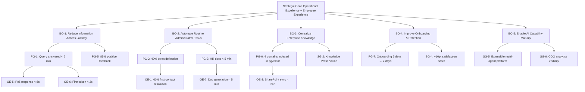

# Business Objectives — AA-Hackathon Enterprise Assistant

**Organization:** Aligned Automation
**Platform:** AA-Hackathon Enterprise Assistant
**Document Version:** 1.0
**Date:** 2026-06-07

---

## 1. Business Objectives Overview

Aligned Automation is deploying a single, conversational AI assistant to serve every employee across HR, IT, Admin, PMO, Finance, and Organizational Knowledge domains — the original domain set this business case was built around. The platform has since grown additional feature areas beyond this original scope (parking request management, org-wide communications, skills analytics, a no-code form/workflow builder, COO analytics, and AI tool license tracking; see `README.md` for the current inventory). The platform replaces a fragmented landscape of intranet portals, email chains, and help-desk tickets with one natural-language interface that resolves queries instantly, generates documents on demand, and escalates unresolved issues with full context.

The core business objective is **to reduce the time employees spend searching for information and performing routine administrative tasks**, freeing that time for higher-value work and improving measurable satisfaction with internal services.

The assistant operates within Aligned Automation's security perimeter: authentication via Azure AD and data stored in on-premises PostgreSQL (hackathon.alignedautomation.com). Inference is served by a configurable LLM layer — Anthropic Claude and Groq are supported cloud providers, with a self-hosted Ollama instance (ml01.alignedautomation.com) as the default/fallback when neither cloud provider is enabled. "No employee data leaves the organizational boundary" is accurate only in the Ollama-only configuration; if that guarantee is a business requirement, it must be enforced by deployment policy rather than assumed from the platform's default settings.

---

## 2. Primary Business Goals (Quantified)

| # | Goal | Baseline | Target | Timeframe |
|---|------|----------|--------|-----------|
| PG-1 | Reduce average time-to-answer for HR, IT, and Admin queries | 24 hours (ticket/email) | Under 2 minutes (self-service) | 6 months post-launch |
| PG-2 | Deflect first-contact support tickets | 0% deflection | 40% deflection rate | 6 months post-launch |
| PG-3 | Reduce HR document turnaround time | 2–3 business days | Same session (< 5 minutes) | At launch |
| PG-4 | Increase employee self-service adoption | < 20% of queries self-served | 70% of eligible queries self-served | 12 months post-launch |
| PG-5 | Achieve assistant response accuracy (user thumbs-up rate) | N/A (new system) | 85% positive feedback rate | 3 months post-launch |
| PG-6 | Centralize knowledge across 4 domains into one retrieval layer | 0 domains indexed | 4 domains (HR, IT, Admin, Org) | At launch |
| PG-7 | Reduce onboarding time for new hires | 5 days average | 2 days with guided 8-step flow | At launch |

---

## 3. Secondary Business Goals

**SG-1 — Operational Cost Reduction**
By deflecting routine queries from HR generalists, IT help-desk staff, and Admin coordinators, the platform reduces the operational overhead of first-line support. Target: redeploy approximately 15% of first-line HR and IT support capacity to strategic work within 12 months.

**SG-2 — Knowledge Preservation**
Policy documents, process guides, and organizational knowledge ingested from SharePoint are made reliably searchable. This mitigates knowledge loss from staff turnover and ensures consistent answers regardless of which employee asks the question.

**SG-3 — Audit and Compliance Readiness**
All interactions are logged in the audit_logs table. Escalations, document generation events, and PII access are tracked via pii_events and pii_redactions. This creates an auditable trail for compliance reviews without additional manual effort.

**SG-4 — Employee Experience Improvement**
Reduce frustration caused by slow internal service responses. Target a 10-point increase in internal service satisfaction score (measured via quarterly survey) within 12 months.

**SG-5 — AI Capability Maturity**
Establish a production-grade, multi-agent RAG platform that Aligned Automation can extend to new domains (PMO, Finance, external client portals) without rebuilding core infrastructure.

**SG-6 — Data-Driven HR and IT Operations**
The COO Dashboard provides leadership with real-time, backend-driven visibility into query volumes, peak hours, domain distribution, and failure rates — enabling resource planning decisions grounded in actual demand data. Note: the separate, general-purpose chatbot usage-analytics dashboard (distinct from the COO Dashboard) currently renders mock/hardcoded data rather than live figures, so it does not yet contribute real operational visibility — this is worth tracking as an implementation gap rather than treating both dashboards as equally live today.

---

## 4. Domain-Specific Objectives

### 4.1 HR Domain
- Provide instant, accurate answers to leave policy, benefits, payroll, and compliance queries sourced from SharePoint-synced policy documents.
- Automate generation of 12 HR document types (Loan Proof, Employment Verification, Experience Letter, Offer Letter, Relieving Letter, NOC Certificate, Bonafide Certificate, Promotion Letter, Address Proof, Internship Certificate, Confirmation Letter, ID Card Request) without HR staff manual drafting.
- Surface relevant Zoho People data (attendance, allocation) in response to employee self-service queries.
- Guide new hires through the structured 8-step onboarding flow (Welcome → Profile → Team → IT Access → Documents → Policy → Induction → All Set).

### 4.2 IT Domain
- Resolve tier-1 IT queries (VPN, password resets, software access, hardware requests) via retrieval from the IT knowledge base without requiring a human agent.
- Triage unresolved issues through the escalation workflow with structured form data so IT engineers receive complete context on first contact.
- Reduce mean time to resolve (MTTR) for routine IT issues by enabling self-service resolution of the top 20 recurring query categories.

### 4.3 Admin Domain
- Answer facilities, travel, parking, and office administration queries from indexed Admin policy documents.
- Enable employees to submit and track administrative requests (travel approvals, facility bookings) through the escalation form interface.
- Reduce Admin coordinator time spent on repetitive information requests by at least 30% within 6 months.

### 4.4 Organizational Knowledge Domain
- Make Aligned Automation's mission, values, organizational structure, and culture accessible to all employees through natural-language queries.
- Ensure new hires can discover org-level information without relying on ad-hoc manager conversations.
- Support PMO and Finance domain queries through dedicated agents (PMOAgent, FinanceAgent) covering projects, milestones, risk, expenses, TDS, and tax documents.

---

## 5. Operational Efficiency Targets

| Target | Metric | Goal |
|--------|--------|------|
| OE-1 | First-contact resolution rate (chat only) | 60% of queries fully resolved without escalation |
| OE-2 | Escalation form completion rate | 90% of escalations include complete structured data |
| OE-3 | SharePoint knowledge sync latency | Policy changes reflected in assistant within 24 hours of SharePoint update |
| OE-4 | System availability | 99.5% uptime during business hours (08:00–20:00 IST) |
| OE-5 | Mean response time (P95) | Under 8 seconds end-to-end for non-streaming queries |
| OE-6 | Streaming first-token latency (P95) | Under 2 seconds for SSE stream start |
| OE-7 | Document generation time | Under 5 minutes per document from query to downloadable PDF |
| OE-8 | pgvector retrieval latency | Under 300 ms for top-k chunk retrieval (k=3, 768-dim cosine) |

---

## 6. Employee Experience Goals

**EX-1 — Single Interface**
Employees use one chat interface for all internal service needs. No context switching between portals, email, and ticketing systems for routine queries.

**EX-2 — Consistent Answers**
RAG retrieval from a centralized, version-controlled knowledge base ensures all employees receive the same accurate answer regardless of who they ask or when.

**EX-3 — Personality and Tone**
The assistant is designed to be professional, empathetic, and approachable. Distress signals trigger empathetic LLM responses (Guardrails Tier 2). Casual queries are handled by QuickAgent and FunnyAgent to maintain a human conversational feel.

**EX-4 — Privacy by Design**
PII detection and redaction (pii_controller.py, pii_service.py) protects employee data within the chat interface. Employees can trust the system with sensitive HR queries.

**EX-5 — Accessibility of Onboarding**
The 8-step guided onboarding flow ensures new hires can orient themselves to tools, team, policies, and documents on day one without manager dependency.

**EX-6 — Feedback Loop**
Every assistant response includes a feedback mechanism (thumbs up/neutral/down + optional comment). This creates a continuous improvement cycle directly tied to employee experience.

---

## 7. AI Platform Business Case

### Problem Statement
Aligned Automation employees currently navigate multiple disconnected systems (SharePoint intranet, email to HR/IT/Admin, Zoho People portal, ticketing systems) to get answers to routine workplace questions. This fragmentation causes:
- Delays of 24+ hours for simple policy questions answered by HR email
- Inconsistent answers as policy documents are updated in SharePoint but not communicated
- High volume of repetitive tier-1 tickets consuming IT and HR staff time
- Poor onboarding experiences for new hires who lack a single guide

### Solution
A multi-agent AI assistant deployed on Aligned Automation's internal infrastructure. Thirteen specialized agents (MasterAgent supervisor plus 12 domain agents) are orchestrated behind a single chat interface. Knowledge is ingested from SharePoint via a hash-based sync job, embedded into pgvector, and retrieved at query time with cosine similarity search. Authentication and authorization are handled by Azure AD/MSAL with RBAC role enforcement at the frontend.

### Investment Justification
- Infrastructure cost is bounded in the default configuration: self-hosted Ollama on ml01, PostgreSQL on existing hackathon.alignedautomation.com, containerized deployment via Docker Compose.
- No per-query API cost to external LLM providers when Ollama (gpt-oss, served internally) is the active provider. Note the LLM layer is configurable — if Claude or Groq is enabled instead, per-query cloud API costs apply and should be factored into the cost model.
- Development investment is a one-time cost amortized across all domain queries for the life of the platform.
- Marginal cost of adding a new document type or domain agent is low (new agent class + SharePoint ingestion configuration).

---

## 8. ROI Model

### Cost Components (Estimated Annual)
| Component | Estimated Cost |
|-----------|---------------|
| Infrastructure (server, storage, PostgreSQL) | Absorbed by existing hackathon.alignedautomation.com infra |
| LLM inference (Ollama self-hosted on ml01 server, the default configuration) | Existing ML infrastructure, no incremental per-query cost. If Claude or Groq is configured instead, per-query cloud API costs apply and are not reflected in this model. |
| Engineering maintenance (0.5 FTE equivalent) | Allocated from existing engineering team |
| SharePoint sync operational overhead | Automated job, near-zero manual effort |

### Benefit Components (Estimated Annual)
| Benefit | Calculation Basis | Estimated Value |
|---------|-------------------|-----------------|
| HR generalist time saved (policy queries) | 40% deflection x estimated 500 HR queries/month x 20 min avg handle time | ~67 hours/month freed |
| IT help-desk first-contact deflection | 40% deflection x estimated 800 IT tickets/month x 30 min avg handle time | ~160 hours/month freed |
| HR document generation automation | 12 doc types x estimated 50 requests/month x 45 min avg manual drafting | ~37.5 hours/month freed |
| New hire onboarding acceleration | 3-day reduction x estimated 10 new hires/month x fully-loaded daily cost | Quantified at hire volume |

### Payback Period
Based on conservative deflection estimates, the platform is projected to recover its one-time development investment within 6–9 months of production launch through measurable headcount-hour savings in HR and IT first-line support.

---

## 9. Objectives Hierarchy

---

## 10. Key Results / OKRs

### Objective 1: Make internal information instantly accessible
- KR-1.1: 85% of chat sessions resolve without escalation by month 6
- KR-1.2: P95 end-to-end response time under 8 seconds by month 3
- KR-1.3: pgvector knowledge base covers HR, IT, Admin, and Org domains at launch

### Objective 2: Automate administrative document generation
- KR-2.1: All 12 HR document types available for self-service generation at launch
- KR-2.2: Document generation requests fulfilled in under 5 minutes (P90) by month 1
- KR-2.3: Zero manual HR drafting required for supported document types by month 3

### Objective 3: Reduce first-line support burden
- KR-3.1: 40% reduction in first-contact HR and IT tickets by month 6
- KR-3.2: Escalation form completion rate above 90% (structured data on every escalation) by month 2
- KR-3.3: IT self-service resolution of top 20 recurring query types by month 4

### Objective 4: Deliver measurable employee experience improvement
- KR-4.1: 70% of eligible queries handled via self-service by month 12
- KR-4.2: Internal service satisfaction score increases by 10 points within 12 months (measured quarterly)
- KR-4.3: New hire onboarding completion via guided 8-step flow reaches 80% adoption by month 3

### Objective 5: Establish a production AI platform for future expansion
- KR-5.1: Platform supports addition of a new domain agent in under 5 engineering days
- KR-5.2: COO analytics dashboard provides real-time usage metrics to leadership by month 1
- KR-5.3: All interactions audited in audit_logs with zero compliance gaps by month 1

---

## 11. Dependencies

| Dependency | Type | Owner | Risk if Unavailable |
|------------|------|--------|---------------------|
| Azure AD tenant and MSAL configuration | Hard | IT / Azure Admin | Authentication fails; platform unusable |
| Configured LLM provider (Ollama at ml01.alignedautomation.com:11434 by default; Claude or Groq if enabled) | Hard | ML Infrastructure | LLM generation unavailable; fast-path regex responses only |
| PostgreSQL + pgvector at hackathon.alignedautomation.com | Hard | DB Admin | RAG retrieval fails; no conversation persistence |
| SharePoint ingestion job (jobs/sharepoint_ingestion/) | Hard | Engineering | Knowledge base goes stale; answers degrade over time |
| Zoho People read-only PostgreSQL connection | Soft | HR Systems | EmployeeAgent and AttendanceAgent responses unavailable |
| Microsoft Graph API credentials | Soft | IT / Azure Admin | MS Forms creation and user profile enrichment unavailable |
| HuggingFace model (nomic-embed-text-v1.5, 768-dim) | Hard | ML Infrastructure | Embedding generation fails; pgvector ingestion and retrieval blocked |
| Tavily API key (optional) | Soft | Engineering | Web search augmentation disabled; no impact on core RAG |

---

## 12. Risks to Objectives

| Risk ID | Risk Description | Likelihood | Impact | Mitigation |
|---------|-----------------|------------|--------|------------|
| R-01 | LLM hallucination on sensitive HR/IT policy queries | Medium | High | Similarity threshold filtering (0.10 floor), source citation in responses, user feedback loop for rapid detection |
| R-02 | SharePoint document ingestion lag causes stale knowledge base | Medium | High | Hash-based change detection runs on schedule; 24-hour SLA target; admin alert on sync failure |
| R-03 | Ollama self-hosted model unavailability (ml01 downtime) — applies when Ollama is the configured provider; a cloud-provider configuration (Claude/Groq) shifts this risk to the respective vendor's availability | Low | Critical | Fast-path regex routing continues without LLM; escalation to IT on Ollama service failure |
| R-04 | Low employee adoption due to change resistance | Medium | High | Guided onboarding flow, manager communication plan, per-message thumbs-up/down feedback to demonstrate responsiveness (note: the separate in-app suggestion/bug-report form currently saves only to browser localStorage and does not reach any team, so it should not be relied on as a responsiveness channel until it is wired to the backend) |
| R-05 | PII exposure via unredacted content in chat logs | Low | Critical | pii_controller.py and pii_service.py enforce redaction at write time; pii_events audit table captures all detections |
| R-06 | Scope creep into unsupported domains without knowledge base | High | Medium | MasterAgent guardrails redirect out-of-scope queries; DOMAIN_KEYWORDS scoring limits routing to indexed domains |
| R-07 | Azure AD token expiry causing mid-session authentication failures | Low | Medium | MSAL token refresh handled client-side; 30-second API timeout with 3-retry policy in apiConfig.js |
| R-08 | pgvector retrieval quality degrades as chunk volume grows | Low | Medium | Similarity threshold review at 6 months; index maintenance on document_chunks table; chunk size (1000 characters, 200-character overlap) tuned at ingest |
| R-09 | HR document generation produces legally inaccurate content | Medium | High | DocumentAgent uses structured templates with HR-approved field mapping; generated documents flagged for HR review before issuance |
| R-10 | Analytics data insufficient to demonstrate ROI to leadership | Low | Medium | Audit_logs and feedback tables capture all interactions from day one; COO Dashboard aggregates metrics automatically |
