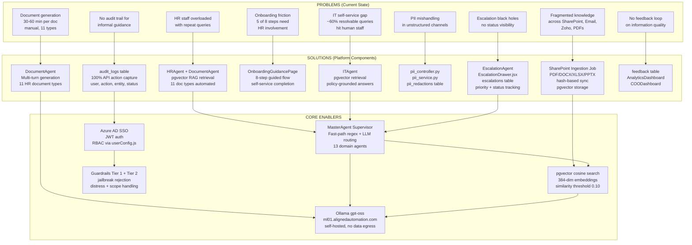

# Problem Statement: AA-Hackathon Enterprise Assistant

**Document Type:** Specification  
**Organization:** Aligned Automation  
**Domain:** alignedautomation.com  
**Version:** 1.0  
**Date:** 2026-06-07  
**Status:** Approved

---

## 1. Executive Summary

Aligned Automation operates as a technology-first organization whose workforce relies on timely, accurate access to HR policies, IT support, administrative procedures, project information, and organizational knowledge. Prior to the AA-Hackathon Enterprise Assistant, this information was distributed across SharePoint sites, email threads, PDF handbooks, Zoho People records, and tribal knowledge held by individual department members. Employees spent measurable hours each week locating information that should be immediately accessible, and support staff in HR, IT, and Administration absorbed repetitive inquiry load that consumed capacity better directed at strategic work.

The AA-Hackathon Enterprise Assistant is a single conversational AI platform that unifies access to all organizational knowledge domains through a natural-language interface. Built on FastAPI, PostgreSQL with pgvector, LangChain, and a self-hosted Ollama LLM (gpt-oss at ml01.alignedautomation.com), the system routes employee queries through a supervisor agent to thirteen specialized domain agents, retrieves semantically relevant content from a pgvector knowledge base populated by SharePoint ingestion, and returns grounded, cited responses within seconds. This document specifies the problem the platform is designed to solve, the scope of the solution, the constraints under which it operates, and the criteria by which its success is measured.

---

## 2. Business Context

### 2.1 Organizational Profile

Aligned Automation is a mid-to-large technology services organization operating under a domain of alignedautomation.com. The workforce spans multiple functional departments including Human Resources, Information Technology, Administration, Project Management Office, Finance, and senior leadership. Employees range from new joinees in structured onboarding to tenured staff requiring self-service access to policies and records.

### 2.2 Information Landscape Before the Platform

Organizational knowledge resided in the following fragmented locations:

- **SharePoint document libraries:** HR policies, IT runbooks, admin guides, onboarding packs (PDF, DOCX, XLSX, PPTX formats)
- **Zoho People:** Employee directory, attendance records, leave balances, project allocation data — accessible only through the Zoho UI or direct database queries by authorized personnel
- **Email chains and Teams messages:** Informal policy clarifications, announcements, one-off IT fixes
- **HR team direct inquiries:** Leave calculation, document requests, policy interpretation, new joiner queries
- **IT helpdesk tickets:** Password resets, VPN configuration, access provisioning, software requests
- **Admin verbal channels:** Parking, travel booking, facility booking, pantry/office supply requests

### 2.3 Strategic Drivers

The platform was initiated by three strategic pressures:

1. **Scalability constraint:** HR and IT support capacity did not scale linearly with headcount growth. Repetitive queries consumed 30–50% of support staff time based on internal estimates.
2. **Knowledge accessibility gap:** New employees completing onboarding lacked a single authoritative source for policy and process questions, leading to inconsistent guidance.
3. **Self-service mandate:** Leadership established a directive to reduce human-in-the-loop dependencies for informational queries while preserving escalation paths for complex or sensitive matters.

---

## 3. Problem Statement

### 3.1 Primary Problem

Employees at Aligned Automation cannot efficiently self-serve for informational and transactional needs across HR, IT, Administration, Finance, PMO, and Organizational domains. The cost of this inefficiency manifests as:

- **Lost employee productivity:** An employee requiring HR policy clarification may wait hours or days for an email response, or spend 20–40 minutes searching SharePoint documents without locating the precise answer.
- **Support staff bottleneck:** HR receives an estimated 15–25 repeat queries per week on topics including leave policy, payroll cycles, tax forms, and document requests that a self-service system can answer in under 10 seconds.
- **Onboarding friction:** New joinees completing the 8-step onboarding process (Welcome through AllSet) lack a persistent, interactive guide. Onboarding completion rates and time-to-productivity are degraded by information scatter.
- **Knowledge attrition:** When subject-matter experts leave or change roles, their knowledge is not captured in retrievable form. The pgvector knowledge base and SharePoint ingestion pipeline directly address this gap.
- **Escalation misrouting:** Without an intelligent triage layer, employee requests reach the wrong team, adding handoff latency before resolution.

### 3.2 Quantified Pain Points

| Pain Point | Estimated Impact |
|---|---|
| Average time to locate HR policy answer (manual) | 20–45 minutes |
| Average time to locate HR policy answer (target, via assistant) | Under 10 seconds |
| Repeat HR queries absorbed per week (pre-platform) | 15–25 |
| IT password/access queries resolvable by self-service | ~60% of total IT tickets |
| Onboarding steps requiring synchronous HR involvement | 5 of 8 steps |
| Documents generatable manually vs. automated | 11 document types requiring HR staff time |
| Employee lookup queries routed through HR instead of directory | Significant fraction of weekly directory queries |

### 3.3 Secondary Problems

- **No audit trail for informal guidance:** Policy interpretations given via email or chat are not logged, creating compliance exposure. The platform's `audit_logs` table captures every query, response, and escalation action with user, action, entity, and status.
- **PII mishandling risk:** Unstructured communication channels carry employee personal data without systematic detection or redaction. The platform implements a `pii_controller.py` and `pii_service.py` with `pii_redactions` and `pii_events` tables.
- **No feedback loop on information quality:** HR and IT have no mechanism to know which policy answers employees find inadequate. The `feedback` table (rating INT[-1,0,1], comment TEXT) and AnalyticsDashboard close this loop.
- **Escalation black holes:** Employee-submitted escalations via email have no status visibility. The `escalations` table with priority and status fields, surfaced through EscalationDrawer.jsx, provides tracking.

---

## 4. Current State (Pre-Platform)

### 4.1 Manual Processes

**HR Domain:**
- Leave policy queries answered by HR staff via email, response time 2–24 hours.
- HR document generation (experience letters, offer letters, relieving letters, NOC certificates, bonafide certificates, promotion letters, address proof, internship certificates, confirmation letters, ID card requests, loan proof) performed manually by HR staff using Word templates, requiring 30–60 minutes per document.
- Benefits and payroll queries handled via inbox triage.

**IT Domain:**
- Password resets and VPN configuration guided through email or phone, requiring IT staff availability.
- Access provisioning requests tracked in ad hoc spreadsheets or ticketing systems not integrated with the employee directory.
- Software installation and configuration queries answered reactively.

**Administration Domain:**
- Travel booking requests submitted via email to admin team.
- Facility and parking queries handled verbally or through team chat.
- Office supply and pantry requests informal.

**PMO Domain:**
- Project allocation information held in Zoho People and internal PMO tools, not queryable by employees without direct system access.
- Milestone and risk status communicated through periodic meetings or email updates.

**Finance Domain:**
- TDS, tax, and Form 16 queries directed to Finance team, high volume around tax season.
- Expense policy clarifications handled via email.

### 4.2 Fragmented Systems

| System | Data Held | Access Model |
|---|---|---|
| SharePoint | HR policies, IT runbooks, admin guides, org documents | Manual search, no semantic retrieval |
| Zoho People | Employee directory, attendance, leave, allocation | UI-only or raw DB for authorized users |
| Email/Teams | Policy clarifications, IT fixes, announcements | No search, ephemeral, no audit |
| PDF handbooks | Onboarding guides, policy documents | Static, version drift, no interactive query |
| IT ticketing | Incident records | Separate from employee self-service |

### 4.3 Absence of Integration

No single interface connected SharePoint content, Zoho People structured data, and real-time LLM reasoning. Employees navigated between four or more separate systems to answer a single compound question such as "What is my remaining leave balance and what is the policy for carrying it over to next year?"

---

## 5. Desired Future State

### 5.1 Unified Conversational Interface

A single chat interface (ChatWindow.jsx) where employees type natural-language questions and receive grounded, cited answers within seconds, with SSE streaming for perceived responsiveness. The interface supports conversation history, message threading, and feedback submission on every response.

### 5.2 Intelligent Multi-Domain Routing

A supervisor agent (MasterAgent in supervisor_agent.py) applies fast-path regex detection for high-confidence intents (escalations, forms, email, greetings, attendance, employee lookup, documents) without LLM invocation, reducing latency and compute cost. When intent is ambiguous, the supervisor calls the Ollama LLM (gpt-oss) for classification with a timeout fallback to keyword scoring via DOMAIN_KEYWORDS. Queries are dispatched to the appropriate domain agent from a set of thirteen agents covering HR, IT, Admin, PMO, Finance, Org, Employee, Attendance, Document, Email, Escalation, Quick, and Funny domains.

### 5.3 Semantically Retrieved, Grounded Answers

Domain agents (HRAgent, ITAgent, AdminAgent, PMOAgent, FinanceAgent, OrgAgent) extend base_deep_agent.py, which executes a parallel retrieval pipeline: pgvector cosine similarity search on 384-dimensional embeddings stored in the `document_chunks` table, FAISS local fallback, user memory from MarkdownStore, and optional Tavily web search. The similarity threshold is set at 0.10 to include weak matches, returning the top 3 chunks with scores. LLM generation uses retrieved context plus a domain-specific personality prompt.

### 5.4 Structured Self-Service Transactions

Beyond informational queries, the platform enables transactional self-service:
- **HR Document Generation:** 11 document types generatable through DocumentAgent via a multi-turn conversation flow, resulting in ready-to-use documents without HR staff involvement.
- **Escalation Submission:** Employees submit structured escalations through EscalationDrawer.jsx; all escalations are persisted in the `escalations` table with type, subject, priority, and status, and are trackable.
- **Email Drafting:** EmailAgent assists employees in drafting and refining professional emails via Ollama, accessible through EmailAgentPage.jsx.
- **Microsoft Forms Creation:** FormsDrawer.jsx enables creation of Microsoft Forms via Graph API without leaving the assistant.
- **Attendance Queries:** AttendanceAgent connects to Zoho People read-only PostgreSQL to return clock-in/out records and monthly summaries.
- **Employee Directory:** EmployeeAgent answers directory and self-service queries directly from Zoho People structured data.

### 5.5 Governed, Audited, and Safe

- Every action is logged in `audit_logs` with user, action, entity type, entity ID, status, and timestamp.
- Guardrails in agents/guardrails.py apply two-tier checks: Tier 1 (jailbreak, harmful content, security threats) returns static rejections; Tier 2 (distress signals, scope violations) invokes LLM for empathetic or redirect responses.
- PII detection and redaction are applied systematically via pii_controller.py and pii_service.py, with events stored in `pii_redactions` and `pii_events`.
- Azure AD JWT authentication (python-jose) governs all API access; MSAL browser integration enforces SSO on the frontend.

### 5.6 Observable and Continuously Improving

- AnalyticsDashboard.jsx provides real-time usage analytics: active users, daily query volume, peak hours, query type distribution, success/failure rates, top queries, and recent activities.
- COODashboard.jsx surfaces leadership-level metrics.
- The feedback loop (rating INT[-1,0,1] per message) feeds into content quality improvement and SharePoint ingestion prioritization.

---

## 6. Scope Definition

### 6.1 In Scope

| Area | Coverage |
|---|---|
| HR | Leave, benefits, payroll, HR policies, document generation (11 types), onboarding guidance |
| IT | Technical support, VPN, passwords, software access, provisioning guidance |
| Administration | Travel, facilities, parking, office supplies, admin procedures |
| PMO | Project queries, milestone status, risk information, project allocation |
| Finance | Expenses, TDS, tax, Form 16, finance policies |
| Organization | Company info, culture, mission, org structure |
| Employee Self-Service | Directory lookup, attendance records, personal profile |
| Escalations | Structured submission, tracking, priority assignment |
| Document Generation | 11 HR document types via multi-turn conversation |
| Email Drafting | Drafting and refinement via Ollama |
| Microsoft Forms | Creation via Graph API |
| Analytics | Usage, adoption, query patterns, feedback analysis |
| Onboarding | 8-step guided flow (Welcome, Profile, Team, ITAccess, Documents, Policy, Induction, AllSet) |
| Security | Azure AD SSO, JWT, PII detection, guardrails, audit logging |
| Knowledge Ingestion | SharePoint sync (PDF, DOCX, XLSX, PPTX), hash-based change detection, chunking, embedding, pgvector storage |

### 6.2 Out of Scope

- Direct write operations to Zoho People (read-only integration)
- Payroll processing or payslip generation
- Performance review workflows
- Real-time calendar management (Microsoft Graph Calendar integration is optional)
- External customer-facing deployment
- Multi-tenant architecture (single-tenant: alignedautomation.com)

---

## 7. Constraints and Assumptions

### 7.1 Technical Constraints

- **LLM:** Self-hosted Ollama at ml01.alignedautomation.com:11434, model gpt-oss. No external LLM API calls for core generation. Temperature 0.1, num_predict 800 tokens, context window 2048 tokens. Latency and throughput are bounded by this single GPU host.
- **Embedding Dimension:** 384 (all-MiniLM-L6-v2 / nomic-embed-text). All document_chunks vectors are 384-dimensional; schema changes require re-embedding the entire corpus.
- **Database:** PostgreSQL 16 + pgvector at hackathon.alignedautomation.com:5432, database `squadrons`. Connection pool min=1, max=8 (ThreadedConnectionPool). Peak concurrent load is bounded by this pool.
- **Zoho Integration:** Read-only access to Zoho People PostgreSQL replica. No write operations.
- **SharePoint Ingestion:** Batch job, not real-time. Knowledge freshness depends on ingestion job schedule. Hash-based change detection prevents redundant re-processing but introduces a lag between document update and retrieval availability.
- **Context Window:** At 2048 tokens, the LLM context constrains the volume of retrieved chunks and conversation history that can be included in a single generation call. The retrieval pipeline returns top 3 chunks to remain within this budget.

### 7.2 Organizational Constraints

- **Authentication:** All users must authenticate via Azure AD (tenant configured via AZURE_TENANT_ID, AZURE_CLIENT_ID). Guest or unauthenticated access is not supported.
- **Data Residency:** All persistent data (conversations, messages, feedback, escalations, document chunks, audit logs) resides in the PostgreSQL instance at hackathon.alignedautomation.com. No employee data transits to external LLM providers.
- **RBAC:** User roles and permissions are defined in userConfig.js. Feature access (e.g., COO analytics dashboard) is role-gated.

### 7.3 Assumptions

- SharePoint is the authoritative source for policy and procedural documents. Documents ingested from SharePoint are treated as ground truth for RAG retrieval.
- The Zoho People read replica is consistent with the production Zoho database within a reasonable replication lag.
- Employees have valid Azure AD accounts and can authenticate via MSAL browser flow.
- The Ollama host (ml01.alignedautomation.com) is available with sufficient GPU capacity to serve concurrent inference requests. The supervisor agent's fast-path routing reduces LLM invocations for common intents, lowering this dependency.
- Tavily web search is optional; the platform degrades gracefully to pgvector + FAISS retrieval if the Tavily API key is absent.

---

## 8. Success Criteria

### 8.1 Functional Criteria

| Criterion | Measure |
|---|---|
| Query routing accuracy | Supervisor routes query to correct domain agent in >= 90% of test cases across all 13 agent types |
| Retrieval relevance | pgvector search returns at least one relevant chunk (similarity >= 0.10) for >= 85% of domain queries with content in the knowledge base |
| HR document generation | All 11 document types generatable end-to-end through DocumentAgent multi-turn flow without error |
| Escalation submission | Escalations persisted to `escalations` table with correct type, priority, status in 100% of submissions |
| Attendance queries | AttendanceAgent returns correct clock-in/out and monthly summary data from Zoho People for authenticated user |
| Onboarding completion | All 8 onboarding steps render and function correctly for new joinees |
| PII detection | pii_controller identifies and redacts PII categories in >= 95% of synthetic test cases |
| Audit coverage | 100% of API calls to /api/chat, /api/escalations, /api/documents/generate result in an `audit_logs` entry |

### 8.2 Performance Criteria

| Criterion | Target |
|---|---|
| Chat response latency (non-streaming, p95) | Under 5 seconds for queries with pgvector retrieval |
| Streaming first-token latency (p95) | Under 2 seconds |
| API availability | 99.5% uptime during business hours |
| Concurrent users supported | 20 simultaneous active chat sessions without degradation |
| SharePoint ingestion cycle | New/changed documents reflected in knowledge base within 1 ingestion cycle |

### 8.3 Adoption and Quality Criteria

| Criterion | Target |
|---|---|
| Employee adoption (active users / total headcount) | >= 40% within 60 days of production launch |
| Positive feedback ratio (rating = 1 / total rated messages) | >= 70% |
| HR self-service deflection | >= 50% reduction in repeat informational queries to HR staff within 90 days |
| IT self-service deflection | >= 40% reduction in password/access/VPN queries to IT staff |
| Escalation resolution visibility | 100% of escalations have queryable status through the assistant |

---

## 9. Stakeholder Impact

### 9.1 Employees (Primary Users)

**Current pain:** Fragmented information access, hours lost to policy searches, waiting on HR/IT responses for routine questions.  
**Future state:** Instant natural-language answers with source citations, self-service document generation, attendance and leave information on demand, structured escalation with tracking.  
**Impact:** Estimated 2–5 hours per employee per month recovered from information-seeking overhead.

### 9.2 HR Team

**Current pain:** 15–25 repeat informational queries per week, manual document generation consuming 30–60 minutes per document across 11 types, onboarding coordination across 5 of 8 steps.  
**Future state:** Informational query deflection to the assistant, document generation automated end-to-end, onboarding self-guided through 8-step flow.  
**Impact:** HR staff capacity redirected from transactional to strategic work. Estimated 10–20 hours per week recovered for a typical HR team of 3–5 staff.

### 9.3 IT Team

**Current pain:** Repetitive password reset, VPN, and access queries consuming Level 1 support capacity.  
**Future state:** ITAgent handles ~60% of resolvable IT queries through self-service guidance. True incidents requiring hands-on IT involvement are escalated through EscalationDrawer with structured context.  
**Impact:** IT staff capacity shifted from L1 triage to L2/L3 engineering work.

### 9.4 Administration Team

**Current pain:** Ad hoc travel, facility, and parking queries arriving through informal channels with no logging.  
**Future state:** AdminAgent handles administrative queries with policy grounding; complex requests escalate with full context.  
**Impact:** Reduced interruption load; better-documented employee requests.

### 9.5 Finance Team

**Current pain:** High-volume TDS, tax, and Form 16 queries during tax season; expense policy clarifications throughout the year.  
**Future state:** FinanceAgent resolves policy queries from ingested Finance documents; employees receive accurate, cited answers without Finance staff involvement.  
**Impact:** Significant seasonal query deflection; Finance staff available for analysis rather than routine query answering.

### 9.6 PMO and Project Managers

**Current pain:** Allocation and milestone status queries require direct system access or meetings.  
**Future state:** PMOAgent and AllocationBoard.jsx surface project and allocation information to authorized users in conversational and visual form.  
**Impact:** Reduced status-check meeting overhead; improved allocation visibility for employees.

### 9.7 Leadership / COO

**Current pain:** No unified view of organizational knowledge utilization, support load, or self-service effectiveness.  
**Future state:** COODashboard.jsx and AnalyticsDashboard.jsx provide real-time metrics on usage, query types, success rates, active users, and top queries.  
**Impact:** Data-driven decisions on knowledge base investment, staffing, and policy communication.

---

## 10. Problem-to-Solution Mapping

---

## 11. Risks

### 11.1 Technical Risks

| Risk | Likelihood | Impact | Mitigation |
|---|---|---|---|
| Ollama host (ml01) unavailability degrades all LLM-dependent features | Medium | High | Fast-path regex routing in MasterAgent handles high-frequency intents without LLM; FAISS local fallback for retrieval. Monitor host availability. |
| pgvector knowledge base staleness if SharePoint ingestion job fails | Medium | Medium | Hash-based change detection with re-runnable idempotent ingestion. Alerting on job failure. |
| Context window (2048 tokens) overflow on long conversations | Medium | Medium | Top-3 chunk retrieval limit; memory summarization via MarkdownStore; conversation history truncation. |
| Connection pool exhaustion (max=8) under concurrent load | Low | High | Pool monitoring; scale max connections with load testing results; queue requests rather than fail. |
| Embedding model drift if all-MiniLM-L6-v2 is updated | Low | High | Pin embedding model version; re-embed corpus on intentional upgrade only. |
| FAISS fallback returning lower-quality results than pgvector | Medium | Low | FAISS used only when pgvector returns zero results; similarity threshold applied consistently. |

### 11.2 Organizational Risks

| Risk | Likelihood | Impact | Mitigation |
|---|---|---|---|
| Low employee adoption due to change resistance | Medium | High | Onboarding guidance (8-step flow), quick links, internal communications, champion users in each department. |
| HR/IT staff not updating SharePoint documents, causing stale answers | Medium | High | COO analytics visibility; feedback loop flagging low-rated responses; SharePoint ingestion on scheduled cadence with change detection. |
| Over-reliance on assistant for guidance that requires human judgment | Low | High | Guardrails Tier 2 scope-violation handling; escalation path always available; disclaimer on sensitive topics. |
| Zoho People replica lag causing stale attendance/employee data | Low | Medium | Acceptable for informational queries; real-time Zoho UI remains authoritative for payroll-critical data. |
| PII exposure if guardrails fail for edge-case inputs | Low | High | Two-tier guardrails with pii_controller; audit logs for post-incident forensics; regular red-team testing. |

### 11.3 Compliance Risks

| Risk | Likelihood | Impact | Mitigation |
|---|---|---|---|
| Audit log gaps during system outage | Low | Medium | Async audit logging with retry; log to local buffer if database unreachable. |
| Unauthorized access to employee directory via EmployeeAgent | Low | High | Azure AD JWT required on all API routes; RBAC role checks in userConfig.js; audit_logs captures all directory queries. |

---

## 12. Recommendations

### 12.1 Immediate (Pre-Production)

1. **Load test the Ollama host** with 20 concurrent inference requests representing realistic query distribution. Establish baseline p95 latency and identify throughput ceiling before launch.
2. **Run first full SharePoint ingestion** and validate document chunk coverage across all HR, IT, Admin, Finance, PMO, and Org document categories. Identify coverage gaps and escalate missing documents to document owners.
3. **Execute PII red-team test suite** against the chat interface covering employee names, employee IDs, bank details, and health information to validate pii_controller detection rates meet the >= 95% threshold.
4. **Validate all 11 HR document types** end-to-end through DocumentAgent with realistic employee data, confirming output formatting, field population, and delivery mechanism.
5. **Confirm RBAC gatekeeping** on COODashboard.jsx and AnalyticsDashboard.jsx using test accounts at each permission level defined in userConfig.js.

### 12.2 Near-Term (First 30 Days Post-Launch)

6. **Establish SharePoint ingestion schedule** aligned with document update cadence (recommended: daily for policy documents, weekly for reference materials) using the hash-based change detection to minimize processing overhead.
7. **Monitor feedback ratings weekly.** Responses with rating = -1 should trigger review of the corresponding pgvector chunks and potential document updates in SharePoint.
8. **Set alert threshold on connection pool utilization.** If the ThreadedConnectionPool (max=8) sustains > 80% utilization during business hours, evaluate pool expansion or query optimization.
9. **Communicate escalation workflow to HR and IT leads.** Ensure escalations submitted through EscalationDrawer.jsx are mapped to the appropriate human owner and response SLA.

### 12.3 Medium-Term (30–90 Days Post-Launch)

10. **Expand embedding corpus** based on analytics data showing high-frequency queries returning low-similarity results (below 0.10 threshold). These indicate knowledge gaps in SharePoint that should be addressed by document owners.
11. **Evaluate context window expansion.** If Ollama gpt-oss model supports higher num_ctx, increase from 2048 to allow more conversation history and retrieved context per call, improving multi-turn conversation quality.
12. **Instrument adoption metrics against success criteria.** At day 60, compare active users / total headcount against the 40% target and HR/IT query deflection against the 50%/40% targets respectively. Report findings to leadership via COODashboard.
13. **Introduce A/B testing for routing.** Use the AnalyticsDashboard's query type distribution to identify domains where LLM routing is invoked most frequently, and invest in additional fast-path regex rules to reduce LLM routing latency for those intents.
14. **Review and expand guardrails** based on any Tier 1 or Tier 2 trigger logs from the first 90 days of production traffic. Refine distress-signal detection and scope-violation patterns with real observed inputs.

---

*This specification is grounded in the implemented architecture of the AA-Hackathon Enterprise Assistant. All agent names, table schemas, API routes, configuration parameters, and integration endpoints referenced reflect the actual system as built.*
