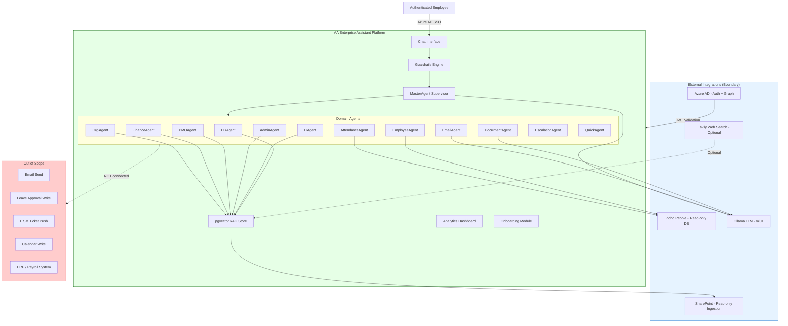

# Scope and Boundary Specification
## AA-Hackathon Enterprise Assistant — Aligned Automation

**Document ID:** 00-FOUNDATION-002
**Status:** Active
**Owner:** Platform Engineering
**Last Updated:** 2026-06-07
**Domain:** alignedautomation.com

---

## 1. In-Scope Capabilities

The following capabilities are implemented and active in the current platform release.

### 1.1 Conversational AI Interface
- Single-pane conversational assistant accessible to all authenticated Aligned Automation employees
- Streaming Server-Sent Events (SSE) responses via `POST /api/chat/stream`
- Multi-turn conversation management with persistent session history stored in PostgreSQL
- User feedback collection (thumbs up / thumbs down / neutral) per message
- Dark and light theme support; configurable typography and navigation via `chatConfig.js`

### 1.2 Domain Question Answering (RAG-backed)
- **HR:** Leave policies, benefit summaries, payroll FAQs, HR policy documents retrieved from pgvector
- **IT:** VPN setup, password resets, access provisioning, technical support via ITAgent
- **Admin:** Travel booking guidance, facilities, parking, office operations via AdminAgent
- **PMO:** Project status, milestone tracking, risk queries via PMOAgent
- **Finance:** Expense reporting, TDS guidance, tax forms, Form 16 queries via FinanceAgent
- **Org:** Company culture, mission, structure, org-chart information via OrgAgent

### 1.3 Employee Directory and Self-Service
- Employee lookup by name, role, or department (read-only Zoho People database)
- Self-service profile view via `GET /api/profile`
- Attendance records: clock-in/out history and monthly summary via AttendanceAgent

### 1.4 HR Document Generation
- 11 document types generated on-demand: Loan Proof, Employment Verification, Experience Letter, Offer Letter, Relieving Letter, NOC Certificate, Bonafide Certificate, Promotion Letter, Address Proof, Internship Certificate, Confirmation Letter, ID Card Request
- Multi-turn guided collection of required fields via DocumentAgent
- Document management and listing via DocumentsPage and `GET /api/documents`

### 1.5 Email Drafting
- Structured email composition and refinement using Ollama LLM via EmailAgent
- Initiated from chat context (`POST /api/email-agent/from-chat`) or standalone EmailAgentPage

### 1.6 Escalation Management
- Structured escalation ticket creation with priority, subject, and form data via EscalationAgent
- Escalation tracking via `GET /api/escalations`
- EscalationDrawer UI component for inline form submission

### 1.7 Microsoft Forms Integration
- Dynamic creation of Microsoft Forms via Graph API (`POST /api/ms-forms/create`)
- FormsDrawer UI for form configuration and submission

### 1.8 Employee Onboarding Guidance
- 8-step guided onboarding workflow: Welcome, Profile, Team, ITAccess, Documents, Policy, Induction, AllSet
- Delivered via OnboardingGuidancePage

### 1.9 Analytics
- Usage analytics dashboard for platform operators: active users, daily queries, peak hours, query category distribution, top queries, success/failure rates
- COO-level metrics dashboard (COODashboard)
- All data served from `GET /api/analytics/overview`

### 1.10 Knowledge Ingestion (Operational Job)
- SharePoint document ingestion: PDF, DOCX, XLSX, PPTX — hash-based change detection, TextExtractor, chunking (500 tokens, 50 overlap), HuggingFace embedding, pgvector storage
- Optional SharePoint site page and list scraping (controlled by feature flags)

### 1.11 Guardrails and PII
- Tier 1 static rejection: jailbreak, harmful content, security threats
- Tier 2 LLM-assisted handling: employee distress signals (empathetic response), scope violations (redirect)
- PII detection and redaction tracked in `pii_redactions` and `pii_events` tables

---

## 2. Out-of-Scope

The following capabilities are explicitly excluded from this platform.

| Excluded Capability | Reason |
|---|---|
| Direct write access to Zoho People | Integration is read-only by design; HR systems of record remain in Zoho |
| Payroll transaction execution | Payroll processing stays in the authoritative payroll system; AI provides guidance only |
| IT ticket creation in ITSM systems (Jira, ServiceNow) | Escalations create internal records only; no outbound ticket push implemented |
| Email delivery / sending | EmailAgent drafts emails; it does not send them |
| Calendar scheduling and meeting booking | No Graph API calendar write scope implemented |
| File creation or upload to SharePoint | Ingestion is one-way (SharePoint to platform); no write-back |
| Real-time financial data or live stock/forex feeds | Finance domain covers policy and forms only |
| External customer-facing interactions | Platform is internal employees only |
| Medical, legal, or compliance advice | Domain agents provide documented policy summaries; no regulated professional advice |
| Biometric or physical access control | Out of IT domain scope |
| Direct database mutation by end users | All user-facing writes go through defined API endpoints with audit logging |
| Third-party SaaS integrations beyond listed stack | Only Azure AD, Zoho, SharePoint, Graph API, Ollama, Tavily are integrated |
| Mobile native application | Web application only (React 18 + Vite); no iOS/Android native app |

---

## 3. Domain Boundaries

Each domain agent owns a distinct slice of enterprise knowledge and intent space.

### 3.1 HR Domain (HRAgent)
**Starts at:** Leave requests, benefit plan details, payroll policy, HR policy documents, employee lifecycle policies
**Ends at:** Actual leave approval (system of record is Zoho People), payroll disbursement, legal counsel
**Data source:** pgvector chunks from SharePoint HR documents
**Routing triggers:** Keywords — leave, benefit, payroll, policy, PTO, sick, maternity, salary

### 3.2 IT Domain (ITAgent)
**Starts at:** VPN access guidance, password reset procedures, software access requests, hardware support FAQs, IT policy
**Ends at:** Live infrastructure changes, actual account provisioning, network configuration
**Data source:** pgvector chunks from SharePoint IT documents
**Routing triggers:** Keywords — VPN, password, access, laptop, software, ticket, IT, support, install

### 3.3 Admin Domain (AdminAgent)
**Starts at:** Travel booking procedures, facilities inquiries, parking policies, office operational queries
**Ends at:** Actual booking transactions, facility reservations, vendor payments
**Data source:** pgvector chunks from SharePoint Admin documents
**Routing triggers:** Keywords — travel, hotel, parking, office, facility, meeting room, supplies

### 3.4 PMO Domain (PMOAgent)
**Starts at:** Project status queries, milestone summaries, risk register information, resource allocation visibility
**Ends at:** Project plan edits, milestone sign-offs, budget approval
**Data source:** pgvector chunks from SharePoint PMO documents; AllocationBoard reads Zoho allocation
**Routing triggers:** Keywords — project, milestone, risk, deadline, allocation, sprint, delivery

### 3.5 Finance Domain (FinanceAgent)
**Starts at:** Expense reporting guidance, TDS calculations, Form 16 queries, reimbursement policy
**Ends at:** Actual payment processing, tax filing, ERP transactions
**Data source:** pgvector chunks from SharePoint Finance documents
**Routing triggers:** Keywords — expense, TDS, tax, Form 16, reimbursement, invoice, budget

### 3.6 Org Domain (OrgAgent)
**Starts at:** Company culture, mission, values, leadership information, org structure
**Ends at:** Official corporate announcements, board decisions, investor relations
**Data source:** pgvector only (no structured DB)
**Routing triggers:** Keywords — company, culture, mission, vision, leadership, Aligned Automation

### 3.7 Employee Domain (EmployeeAgent)
**Starts at:** Directory lookup, role, department, reporting structure
**Ends at:** HR record edits, performance data, compensation details
**Data source:** Zoho People PostgreSQL read-only replica
**Routing triggers:** Fast-path regex — employee name lookup, "who is", "find employee"

### 3.8 Attendance Domain (AttendanceAgent)
**Starts at:** Clock-in/out records, monthly attendance summaries
**Ends at:** Attendance approval, regularization, payroll integration
**Data source:** Zoho People PostgreSQL read-only replica
**Routing triggers:** Fast-path regex — attendance, clock-in, clock-out, present, absent

### 3.9 Document Domain (DocumentAgent)
**Starts at:** Request and generation of 11 HR document types
**Ends at:** Digital signing, official HR approval, archival in document management systems
**Data source:** Template-driven generation via LLM; no retrieval required
**Routing triggers:** Fast-path regex — "generate letter", "employment verification", "experience letter"

### 3.10 Escalation, Email, Quick, Funny Domains
- EscalationAgent: internal escalation record creation only; no outbound ITSM push
- EmailAgent: draft composition only; no send capability
- QuickAgent: conversational responses with no retrieval; greetings and simple factual queries
- FunnyAgent: jokes and casual chat; no enterprise data access

---

## 4. Integration Boundaries

### 4.1 SharePoint (Read-Only Ingestion)
- **Direction:** SharePoint to platform (one-way)
- **Protocol:** Microsoft Graph API with Azure AD service principal credentials
- **Scope:** Document libraries — PDF, DOCX, XLSX, PPTX files; optionally site pages and lists
- **Not in scope:** Write-back, real-time sync (ingestion is a scheduled job), SharePoint permissions mirroring
- **Credentials:** SHAREPOINT_CLIENT_ID, SHAREPOINT_CLIENT_SECRET, SHAREPOINT_TENANT_NAME

### 4.2 Zoho People (Read-Only Database)
- **Direction:** Platform reads Zoho PostgreSQL replica (no Zoho API calls)
- **Data accessed:** Employee records, attendance records, allocation records
- **Not in scope:** Zoho API write endpoints, leave approvals, payroll data, performance reviews
- **Credentials:** ZOHO_DB_HOST, ZOHO_DB_PORT, ZOHO_DB_NAME, ZOHO_DB_USER, ZOHO_DB_PWD

### 4.3 Azure AD / Microsoft Identity (Authentication and Graph)
- **Authentication:** MSAL browser-side SSO; backend JWT validation via python-jose
- **Graph API scopes:** openid, profile, email, User.Read — read profile only
- **Extended Graph uses:** Microsoft Forms creation; optional Planner and Calendar (read)
- **Not in scope:** Graph write to mailbox, calendar write, Teams messaging, SharePoint write
- **Credentials:** AZURE_TENANT_ID, AZURE_CLIENT_ID

### 4.4 Ollama / LLM (Self-Hosted)
- **Endpoint:** http://ml01.alignedautomation.com:11434
- **Model:** gpt-oss (custom model)
- **Uses:** Intent classification, answer generation, email drafting, document generation, guardrail Tier 2
- **Not in scope:** External LLM APIs (OpenAI, Anthropic direct), model fine-tuning, model management
- **Parameters:** temperature 0.1, num_predict 800, num_ctx 2048

### 4.5 Tavily (Optional Web Search)
- **Condition:** Only active when TAVILY_API_KEY environment variable is present
- **Use:** Supplemental web search results injected into RAG context in BaseDeepAgent
- **Not in scope:** Unrestricted public internet search surfaced directly to users without context filtering

---

## 5. Data Boundaries

### 5.1 Data Accessed
| Data Category | Source | Tables / Endpoints |
|---|---|---|
| Conversation history | Platform PostgreSQL | conversations, messages |
| User feedback | Platform PostgreSQL | feedback |
| Escalation records | Platform PostgreSQL | escalations |
| Audit trail | Platform PostgreSQL | audit_logs |
| Knowledge chunks | Platform PostgreSQL (pgvector) | documents, document_chunks |
| PII events | Platform PostgreSQL | pii_redactions, pii_events |
| Employee directory | Zoho PostgreSQL (read-only) | employees table |
| Attendance records | Zoho PostgreSQL (read-only) | attendance, allocation |
| User profile | Microsoft Graph API | /me endpoint |

### 5.2 Data Not Accessed
- Payroll transaction records or compensation history
- Performance review scores or appraisal data
- Active Directory group membership beyond profile scope
- SharePoint document permissions or access control lists
- Financial ERP or accounting system data
- Email mailbox content
- External customer or partner data

### 5.3 Data Retention and Deletion
- All platform tables implement soft-delete via `is_deleted` boolean column
- No hard-delete mechanism exposed at the API layer
- Conversation and message data is user-associated via `user_id` (UUID from Azure AD token)
- Audit logs are append-only; no update or delete endpoint exists for `audit_logs`

### 5.4 Embedding Data Boundaries
- Embeddings are 384-dimensional vectors (all-MiniLM-L6-v2)
- Stored in `document_chunks.embedding` column (pgvector vector[384])
- Cosine similarity threshold: 0.10 (permissive; top 3 returned)
- FAISS index used as local fallback if pgvector unavailable

---

## 6. User Boundaries (RBAC)

Roles and permissions are defined in `frontend/src/config/userConfig.js`.

| Role | Capabilities |
|---|---|
| Employee (default) | Chat, conversation history, document generation, email drafting, escalation submission, attendance view (own), employee directory lookup, onboarding |
| Manager | All Employee capabilities; may view team allocation on AllocationBoard |
| HR Admin | All Employee capabilities; access to HR document generation for others; escalation review |
| IT Admin | All Employee capabilities; IT-specific escalation management |
| Platform Operator | All capabilities; access to AnalyticsDashboard and usage metrics |
| COO / Executive | All Employee capabilities; access to COODashboard with aggregated metrics |

**Authentication boundary:** All API calls require a valid Azure AD JWT. The backend validates token signature, expiry, tenant, and audience. Unauthenticated requests receive HTTP 401.

**Authorization boundary:** Role claims are derived from the Azure AD token. Role-gated UI sections are hidden client-side; API endpoints enforce role checks server-side.

---

## 7. AI Boundary

### 7.1 What the AI Can Answer
- Questions grounded in ingested SharePoint documents (HR, IT, Admin, PMO, Finance, Org)
- Employee directory and attendance lookups (from Zoho read replica)
- Guidance on procedures, policies, and processes documented in the knowledge base
- Email drafts and HR document generation from structured templates
- General conversational responses for greetings and casual queries

### 7.2 What the AI Cannot Answer
- Questions requiring real-time data not in the knowledge base (live project dashboards, live financial data)
- Medical, legal, tax, or regulated professional advice — responses explicitly redirect to qualified professionals
- Confidential personal compensation, performance, or disciplinary records
- Anything requiring action in an external system (sending email, approving leave, creating IT tickets)
- Questions outside enterprise scope — the LLM routing and guardrails redirect or decline
- Responses beyond 800 predicted tokens per turn (num_predict limit)

### 7.3 Hallucination Mitigation
- Similarity threshold 0.10 filters irrelevant chunks; only top 3 highest-scored chunks are used
- Adaptive retry: if pgvector returns no results, query is simplified and retried before falling back to FAISS
- System prompt instructs LLM to state uncertainty rather than fabricate
- Tier 1 guardrails statically reject harmful or adversarial inputs before LLM processing

### 7.4 AI Routing Boundary (Supervisor Agent)
- Fast-path regex (no LLM cost) handles: escalations, forms, email, greetings, attendance, employee lookup, document generation
- LLM-based routing used only when fast-path does not match; timeout fallback to keyword scoring
- DOMAIN_KEYWORDS dict scoring used as final fallback — no LLM call required

---

## 8. Future Scope

The following items are identified for future platform phases and are not currently implemented.

| Future Capability | Target Phase | Dependency |
|---|---|---|
| Leave request submission (write to Zoho) | Phase 2 | Zoho People API write credentials |
| IT ticket push to ServiceNow / Jira | Phase 2 | ITSM API integration |
| Email send via Graph API (Mail.Send scope) | Phase 2 | Azure AD consent for Mail.Send |
| Calendar scheduling and meeting creation | Phase 2 | Graph API Calendar.ReadWrite scope |
| Fine-tuned domain models per agent | Phase 3 | Labeled domain datasets, GPU training |
| Real-time SharePoint change notifications (webhooks) | Phase 2 | SharePoint webhook subscription |
| Mobile native application (iOS / Android) | Phase 3 | Mobile engineering team |
| Multi-language support | Phase 3 | Embedding model swap, LLM prompt localization |
| Performance and appraisal data access | Phase 3 | HR data classification approval |
| Proactive notifications and alerts | Phase 2 | Scheduler service, notification channel config |
| Agent memory persistence across sessions (long-term) | Phase 2 | MarkdownStore promotion to DB-backed store |
| Integration with Planner / Project for live PMO data | Phase 2 | Graph API Planner read scope |

---

## 9. Scope Boundary Map

---

## 10. Boundary Decision Log

| Decision ID | Decision | Rationale | Date |
|---|---|---|---|
| BD-001 | Zoho People integration is read-only database connection | Zoho is the system of record; write access requires HR governance approval and data integrity controls not yet implemented | 2026-06-07 |
| BD-002 | EmailAgent drafts but does not send | Mail.Send Graph scope introduces significant security and compliance risk; deferred to Phase 2 with explicit approval workflow | 2026-06-07 |
| BD-003 | Similarity threshold set at 0.10 (permissive) | Initial knowledge base has variable document quality; permissive threshold ensures users receive best available answer rather than "no results" | 2026-06-07 |
| BD-004 | Tavily web search is optional (feature-flag by env var) | Public internet content may contradict internal policy; made opt-in to prevent uncontrolled knowledge injection | 2026-06-07 |
| BD-005 | Fast-path regex routing for high-frequency intents | Eliminates LLM cost and latency for deterministic intents (attendance, greetings, document requests); LLM routing reserved for ambiguous queries | 2026-06-07 |
| BD-006 | num_ctx capped at 2048, num_predict at 800 | Hardware constraint on ml01; context window and response length are traded off to support concurrent users | 2026-06-07 |
| BD-007 | Soft-delete only across all platform tables | Regulatory and audit requirements; data destruction requires separate governance-approved process | 2026-06-07 |
| BD-008 | SharePoint ingestion is batch job, not real-time | Webhook subscription to SharePoint requires additional Azure app registration permissions; deferred to Phase 2 | 2026-06-07 |

---

## 11. Risks at Boundaries

| Risk ID | Boundary | Risk Description | Likelihood | Impact | Mitigation |
|---|---|---|---|---|---|
| R-001 | AI / Knowledge | LLM generates plausible but incorrect answer when knowledge base lacks relevant chunks | Medium | High | Similarity threshold + adaptive retry + system prompt uncertainty instruction |
| R-002 | Zoho / Data | Zoho read replica lag causes stale employee or attendance data | Low | Medium | Display data-as-of timestamp; document known lag to users |
| R-003 | SharePoint / Ingestion | Outdated documents remain in pgvector after SharePoint deletion if ingestion job fails | Medium | Medium | Hash-based change detection flags DELETED; monitor ingestion job logs |
| R-004 | Ollama / LLM | ml01 Ollama server unavailable causes all LLM-backed agents to fail | Low | High | Fast-path regex routes cover high-frequency intents without LLM; health check endpoint monitors status |
| R-005 | Azure AD / Auth | Token expiry not handled gracefully causes silent auth failures in long sessions | Low | Medium | MSAL browser handles token refresh; backend validates on every request |
| R-006 | Guardrails / Scope | Adversarial prompts bypass Tier 1 static rules via indirect jailbreak | Low | High | Tier 2 LLM-assisted scope violation check; ongoing red-team testing |
| R-007 | PII / Data | PII present in user queries stored in messages table before redaction | Medium | High | pii_controller intercepts and redacts before persistence; pii_events audit trail |
| R-008 | RBAC / Authorization | Client-side role gate bypassed by direct API call | Low | High | Server-side role enforcement on all gated API endpoints; JWT claims authoritative |

---

## 12. Governance at Boundaries

### 12.1 Knowledge Boundary Governance
- All SharePoint documents ingested must reside in approved document libraries defined in ingestion job configuration
- New document sources require Platform Engineering review before adding to ingestion scope
- Document hash tracking ensures only changed or new content is re-embedded; no silent content drift

### 12.2 Data Access Governance
- Zoho People credentials stored as environment variables; rotation policy owned by HR IT team
- Azure AD service principal for SharePoint has minimum required permissions (Sites.Read.All, Files.Read.All)
- All user-data-accessing API calls are recorded in `audit_logs` with user_id, action, entity_type, status, and timestamp

### 12.3 AI Output Governance
- Tier 1 guardrail rejections are logged; patterns reviewed monthly by Platform Engineering
- Tier 2 escalations (distress signals) are flagged for HR review within 24 hours
- Document generation produces templated output only; no free-form content in regulated document fields

### 12.4 Integration Change Governance
- Any new external integration (new SaaS, new Graph scope, new database) requires a Boundary Decision Log entry (Section 10) before implementation
- Scope expansions that include write access to any external system require written approval from the system owner and security review
- All integration credentials managed via environment variables; no hardcoded credentials in source code

### 12.5 RBAC Governance
- Role assignments are sourced from Azure AD token claims; platform does not maintain its own role database
- Role permission matrix in `userConfig.js` is reviewed at each major release
- Privilege escalation requests (e.g., granting operator or COO role) require HR and platform admin dual approval

---

*This document defines the authoritative scope and boundary specification for the AA-Hackathon Enterprise Assistant platform. All implementation decisions that affect system boundaries must be recorded in Section 10 before deployment.*
