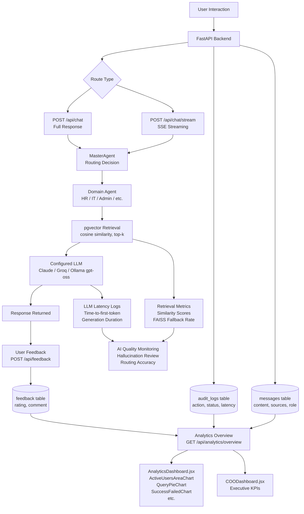

# Success Metrics — AA-Hackathon Enterprise Assistant

**Document ID:** 00-foundation/success-metrics  
**Organization:** Aligned Automation  
**Platform:** AA-Hackathon Enterprise Assistant  
**Last Updated:** 2026-06-07  
**Status:** Active

---

## 1. Metrics Framework Overview

The AA-Hackathon Enterprise Assistant success metrics framework is structured across four measurement layers: platform-level KPIs, domain-specific KPIs, user experience metrics, and AI quality and operational metrics. Together, these layers provide a complete view of system health, user value delivery, and AI model performance.

### Guiding Principles

- **Outcome over activity.** Metrics measure whether users accomplish their goals, not merely whether the system returned a response.
- **Domain accountability.** Each domain agent (HR, IT, Admin, Org, PMO, Finance) owns its own KPI set and is accountable to its domain stakeholders.
- **Closed-loop measurement.** Every metric that influences product decisions must have a defined collection mechanism, owner, cadence, and alert threshold.
- **Privacy compliance.** Metric collection must not re-identify individuals. PII fields are excluded from all analytics aggregations in compliance with the platform's PII controller (`pii_controller.py`, `pii_service.py`).

### Measurement Layers

| Layer | Scope | Primary Consumer |
|---|---|---|
| Platform KPIs | Entire assistant | Leadership, COO Dashboard |
| Domain KPIs | Per agent (HR, IT, Admin, etc.) | Domain team leads |
| User Experience | Per session, per user cohort | Product, UX |
| AI Quality | Per message, per retrieval | AI/ML engineering |
| Operational | Infrastructure, APIs | Platform engineering |

---

## 2. Platform-Level KPIs

These KPIs represent the health and adoption of the assistant as a unified product.

### Adoption

| KPI | Definition | Target |
|---|---|---|
| Monthly Active Users (MAU) | Unique authenticated users with at least one conversation per calendar month | Baseline + 20% QoQ growth |
| Daily Active Users (DAU) | Unique authenticated users with at least one message per calendar day | DAU/MAU ratio >= 0.30 |
| Session Start Rate | Percentage of logged-in users who initiate a conversation in a given period | >= 60% of authenticated users |
| New User Onboarding Completion | Percentage of new users who complete all 8 onboarding steps (WelcomeStep through AllSetStep) | >= 75% |

### Engagement

| KPI | Definition | Target |
|---|---|---|
| Average Messages per Session | Total messages divided by total conversation sessions | >= 3.5 |
| Conversation Return Rate | Users who return within 7 days of a first conversation | >= 50% |
| Escalation Conversion Rate | Escalations submitted as a fraction of escalation-intent queries | >= 80% |
| Document Generation Volume | Total HR documents generated per week (12 supported types) | Tracked; no minimum threshold |

### Self-Service Rate

| KPI | Definition | Target |
|---|---|---|
| Query Resolution Without Human Escalation | Fraction of queries that do not result in an escalation ticket | >= 85% |
| HR Ticket Deflection | HR queries resolved by HRAgent without a human ticket | >= 70% |
| IT Ticket Deflection | IT queries resolved by ITAgent without a human ticket | >= 65% |

---

## 3. Domain-Level KPIs

### 3.1 HR Domain (HRAgent)

Topics: leave, benefits, payroll, policies — retrieved via pgvector.

| KPI | Definition | Target |
|---|---|---|
| Policy Query Accuracy | Fraction of HR policy responses rated positive (rating = 1) in feedback | >= 85% |
| Leave Query Resolution Rate | Leave-related queries answered without escalation | >= 90% |
| Document Generation Success | Successfully generated HR documents / total requested | >= 95% |
| Supported Doc Types Coverage | Percentage of 12 document types with at least one successful generation per month | 100% (all 12 types functional) |

### 3.2 IT Domain (ITAgent)

Topics: technical support, VPN, passwords, access — retrieved via pgvector.

| KPI | Definition | Target |
|---|---|---|
| IT Query Deflection Rate | IT queries resolved without escalation | >= 65% |
| Password/Access Response Accuracy | User-rated accuracy on access-related responses | >= 80% |
| Mean Time to IT Response | Latency from query submission to first token for IT queries | <= 4 seconds |

### 3.3 Admin Domain (AdminAgent)

Topics: travel, facilities, parking, office — retrieved via pgvector.

| KPI | Definition | Target |
|---|---|---|
| Admin Query Satisfaction | Positive feedback rate for admin queries | >= 80% |
| Facilities Information Freshness | Percentage of admin responses backed by documents ingested within 30 days | >= 70% |

### 3.4 Org Domain (OrgAgent)

Topics: company info, culture, mission — pgvector only, no web search.

| KPI | Definition | Target |
|---|---|---|
| Culture Query Coverage | Org queries that return at least one pgvector chunk | >= 90% |
| Org Response Satisfaction | Positive feedback rate | >= 80% |

### 3.5 PMO Domain (PMOAgent)

Topics: projects, milestones, risk.

| KPI | Definition | Target |
|---|---|---|
| Project Allocation Accuracy | Allocation board data freshness vs Zoho People DB | Sync lag <= 15 minutes |
| PMO Query Resolution Rate | PMO queries answered without escalation | >= 75% |

### 3.6 Finance Domain (FinanceAgent)

Topics: expenses, TDS, tax, Form 16.

| KPI | Definition | Target |
|---|---|---|
| Finance Query Accuracy | Positive feedback rate for finance responses | >= 85% |
| Sensitive Topic Guardrail Activation | Rate at which Tier 1 guardrails intercept finance queries | <= 2% (false positive control) |

---

## 4. User Experience Metrics

These metrics reflect perceived usability and satisfaction, collected through explicit feedback (thumbs ratings, comments) and implicit signals (session length, abandonment).

### Feedback Signals

The `feedback` table stores: `rating` (INT in {-1, 0, 1}), `comment` (TEXT), `message_id`, `user_id`.

| Metric | Formula | Target |
|---|---|---|
| Net Satisfaction Score (NSS) | (Positive ratings - Negative ratings) / Total ratings x 100 | >= 60 |
| Positive Feedback Rate | Ratings with value = 1 / Total ratings | >= 75% |
| Negative Feedback Rate | Ratings with value = -1 / Total ratings | <= 10% |
| Comment Submission Rate | Messages with a written comment / Total rated messages | Tracked; no minimum |

### Interaction Quality

| Metric | Definition | Target |
|---|---|---|
| Session Abandonment Rate | Sessions with exactly 1 message and no follow-up within 2 minutes | <= 20% |
| Follow-up Query Rate | Sessions where user sends a clarifying message after the first response | Tracked |
| Streaming Response Perceived Latency | Time from POST /api/chat/stream to first SSE chunk delivery | <= 2 seconds |

### Onboarding Experience

| Metric | Definition | Target |
|---|---|---|
| Step Completion Rate | Fraction of users completing each of the 8 onboarding steps | Each step >= 80% |
| Drop-off Step | Onboarding step with highest abandonment rate | Identified and actioned per quarter |
| Time to Onboarding Completion | Median time from WelcomeStep to AllSetStep | <= 10 minutes |

---

## 5. AI Quality Metrics

### Accuracy

| Metric | Definition | Measurement Method | Target |
|---|---|---|---|
| Response Accuracy Rate | User-rated positive responses / total rated responses | Feedback table aggregation | >= 80% |
| Retrieval Precision | Fraction of retrieved pgvector chunks that are relevant (human-sampled) | Quarterly human eval sample (n=100) | >= 75% |
| Hallucination Rate | Fraction of sampled responses containing factually incorrect statements not present in retrieved context | Monthly expert review sample (n=50) | <= 5% |
| Guardrail False Positive Rate | Fraction of legitimate queries blocked by Tier 1 or Tier 2 guardrails | Monthly review of blocked query logs | <= 3% |

### Retrieval Quality

| Metric | Definition | Target |
|---|---|---|
| Mean Cosine Similarity Score | Average similarity score of returned pgvector chunks (threshold: 0.10) | >= 0.35 |
| Zero-Result Rate | Fraction of queries where pgvector returns no chunks above threshold | <= 8% |
| FAISS Fallback Rate | Fraction of queries that fall back to FAISS local store | <= 15% |
| Adaptive Retry Trigger Rate | Fraction of queries that require query simplification retry | <= 20% |
| Top-3 Chunk Relevance | Average relevance of top 3 returned chunks (human-sampled) | >= 70% rated relevant |

### Routing Quality (MasterAgent)

In the current build, routing is two-tier — regex fast-paths, then keyword scoring against `DOMAIN_KEYWORDS` — not three-tier. A `_route_llm()` method for LLM-based classification exists in `supervisor_agent.py` but is not called from the live routing path, so the LLM-routing metrics below are not currently collectible; they are included as targets to activate if/when that path is wired in.

| Metric | Definition | Target |
|---|---|---|
| Fast-Path Routing Accuracy | Fraction of fast-path (regex) routed queries correctly handled by the routed agent | >= 90% |
| Keyword Fallback Rate | Fraction of queries handled by keyword fallback routing | <= 15% |
| LLM Routing Accuracy *(not yet live — dormant code path)* | Fraction of LLM-classified queries correctly handled by the routed agent, once `_route_llm()` is activated | >= 85% |
| Routing Latency (LLM path) *(not yet live — dormant code path)* | Time taken for an LLM intent-classification call, once activated | <= 1.5 seconds |

### Latency

| Metric | Definition | Target |
|---|---|---|
| End-to-End Response Time (full) | POST /api/chat — time to complete response | <= 8 seconds (p95) |
| Time to First Token (streaming) | POST /api/chat/stream — time to first SSE event | <= 2 seconds (p95) |
| pgvector Query Latency | Time for cosine similarity SQL query execution | <= 500 ms (p95) |
| Embedding Generation Latency | Time to embed query with nomic-embed-text-v1.5 (768-dim) | <= 200 ms (p95) |
| LLM Generation Latency | Generation time from the configured LLM provider (Ollama/gpt-oss by default, 800-token limit, 2048 context; figures will differ if Claude or Groq is the active provider) | <= 6 seconds (p95) |

---

## 6. Operational Metrics

### Availability

| Metric | Definition | Target |
|---|---|---|
| Platform Uptime | Percentage of time all API endpoints are responsive | >= 99.5% (monthly) |
| API Health Check Success Rate | GET /api/health returning 200 / total checks | >= 99.9% |
| Database Availability | PostgreSQL 16 + pgvector connection pool (min=1, max=8) operational | >= 99.9% |
| LLM Provider Availability | Configured LLM provider responsive — Ollama at ml01.alignedautomation.com:11434 when Ollama is active; Anthropic/Groq API reachability when a cloud provider is configured | >= 99.0% |

### Throughput

| Metric | Definition | Target |
|---|---|---|
| Requests per Minute (RPM) | Total API requests across all endpoints per minute | Capacity baseline established in load testing |
| Concurrent Sessions | Simultaneous active SSE streaming connections | Support >= 50 concurrent without degradation |
| SharePoint Ingestion Rate | Documents processed per ingestion job run | >= 95% of changed documents processed per run |
| Connection Pool Utilization | Active connections / max pool size (8) | <= 80% sustained average |

### Error Rates

| Metric | Definition | Target |
|---|---|---|
| API Error Rate (5xx) | 5xx responses / total API responses | <= 0.5% |
| API Error Rate (4xx) | 4xx responses / total API responses | <= 2% (excluding intentional auth rejections) |
| LLM Call Failure Rate | Failed generation calls to the configured LLM provider / total LLM calls | <= 1% |
| Routing Timeout Rate *(not yet live — dormant code path)* | Queries that would fall back due to an LLM routing-classification timeout, once `_route_llm()` is activated; currently no such timeout occurs because that path is never invoked | <= 5% |
| Document Generation Failure Rate | Failed document generation / total requests | <= 2% |

### SharePoint Ingestion Health

| Metric | Definition | Target |
|---|---|---|
| NEW Document Detection Rate | New documents correctly identified by hash-based change detection | >= 99% |
| CHANGED Document Reprocessing Rate | Modified documents correctly re-chunked and re-embedded | >= 99% |
| DELETED Document Cleanup Rate | Deleted documents correctly marked is_deleted in document_chunks | >= 99% |
| Chunking Consistency | Chunks produced at 1000-character size, 200-character overlap within tolerance | >= 98% compliant |

---

## 7. Analytics Implementation

The platform's COO dashboard (`coo-analytics/COODashboard.jsx`) is backed by `GET /api/analytics/overview` and real underlying tables today. The general usage-analytics dashboard (`modules/analytics/`, `AnalyticsDashboard.jsx`) is designed against the same set of components and data sources described below, but as of this writing its frontend (`analyticsApi.js`) returns hardcoded mock constants and is not wired to `GET /api/analytics/overview` or any other backend endpoint. The component/tracking descriptions below represent the intended (and, for COODashboard, already-live) design — treat any specific numbers currently shown in `AnalyticsDashboard.jsx` as illustrative, not real, until that wiring is completed.

### Dashboard Components and What They Track

| Component | Tracks |
|---|---|
| `ActiveUsersAreaChart` | DAU and MAU trends over time; area chart visualization |
| `DailyLineChart` | Daily message volume and session counts; line chart |
| `DateRangeFilter` | Date window selector applied across all analytics components |
| `OverviewCards` | Headline KPIs: total users, total messages, active sessions, escalations |
| `PeakHoursBarChart` | Message volume by hour of day; identifies peak usage windows |
| `QueryPieChart` | Distribution of queries by domain agent (HR, IT, Admin, Org, PMO, Finance) |
| `RecentActivities` | Live feed of recent audit log events from `audit_logs` table |
| `SuccessFailedChart` | Success vs. failure rate for API responses; maps to operational error metrics |
| `TabsBarChart` | Multi-tab bar chart comparing metrics across domains or time periods |
| `TopQueriesTable` | Most frequent query patterns (anonymized); maps to guardrail and routing analytics |

### Data Sources for Analytics

- `conversations` table: session counts, user counts
- `messages` table: message volume, role distribution, content (anonymized)
- `feedback` table: ratings (-1, 0, 1), satisfaction metrics
- `escalations` table: escalation volume, type, priority, status distribution
- `audit_logs` table: action types, entity types, status codes
- API response logs: latency, status codes, error rates

---

## 8. Measurement Methodology

### Feedback Collection

Explicit feedback is collected via the `feedback` table. Each message can receive one rating from the submitting user. The feedback API (`POST /api/feedback`, `GET /api/feedback`) provides the data aggregation layer.

### Sampling Strategy for AI Quality

- **Hallucination review:** 50 randomly sampled responses per month evaluated by a domain expert (HR lead for HR queries, IT lead for IT queries, etc.).
- **Retrieval precision:** 100 randomly sampled retrieval results per quarter evaluated by a panel. Chunk is marked relevant if it directly supports a correct answer.
- **Routing accuracy:** 200 randomly sampled routed queries per month compared against ground-truth agent labels (labeled by a human reviewer).

### Implicit Signal Collection

Session abandonment, follow-up rates, and time-to-completion are derived from `messages.created_at` timestamps and `conversations` table metadata, calculated in the analytics overview endpoint.

### Baseline Establishment

All targets marked "Baseline established in load testing" require a 30-day initial observation period before threshold enforcement. Baselines are reviewed quarterly and adjusted based on growth.

---

## 9. Metrics Collection Flow



---

## 10. Reporting Cadence

| Report | Frequency | Audience | Delivery |
|---|---|---|---|
| Platform Health Snapshot | Daily | Platform engineering | Automated dashboard alert |
| AI Quality Report | Weekly | AI/ML engineering, Product | Email digest + dashboard |
| Domain KPI Review | Bi-weekly | HR, IT, Admin domain leads | Exported PDF via jsPDF |
| Executive Summary | Monthly | COO, Leadership | COO Dashboard + PDF export |
| Quarterly Metrics Review | Quarterly | All stakeholders | Formal review meeting with slide deck |
| Hallucination Review Report | Monthly | AI/ML engineering | Internal document |
| Retrieval Precision Audit | Quarterly | AI/ML engineering, Domain leads | Internal document |
| Onboarding Funnel Analysis | Monthly | Product, UX | AnalyticsDashboard |

---

## 11. Metric Ownership

| Metric Category | Primary Owner | Secondary Owner |
|---|---|---|
| Platform KPIs (MAU, DAU, adoption) | Product Manager | COO |
| HR Domain KPIs | HR Team Lead | Platform engineering |
| IT Domain KPIs | IT Team Lead | Platform engineering |
| Admin Domain KPIs | Admin/Facilities Lead | Platform engineering |
| Org / PMO / Finance KPIs | Respective domain leads | Platform engineering |
| AI Quality Metrics (accuracy, hallucination) | AI/ML Engineering Lead | Domain leads (review) |
| Operational Metrics (uptime, error rate) | Platform Engineering Lead | DevOps |
| User Experience Metrics | UX / Product | AI/ML Engineering |
| Analytics Dashboard Maintenance | Frontend Engineering | Platform Engineering |
| Feedback Data Quality | Product Manager | AI/ML Engineering |

---

## 12. Thresholds and Alerts

### Critical Alerts (Immediate Response Required)

| Metric | Threshold | Action |
|---|---|---|
| API Uptime | < 99.0% in any 1-hour window | Page on-call engineer; incident declared |
| API 5xx Error Rate | > 2% in any 15-minute window | Page on-call engineer |
| LLM Provider Availability (configured provider — Ollama by default) | Unavailable for > 5 minutes | Page on-call; activate fallback QuickAgent mode |
| Database Connection Pool | Utilization > 95% sustained for > 5 minutes | Page on-call; investigate connection leak |
| pgvector Query Latency p95 | > 2 seconds | Alert platform engineering |

### Warning Alerts (Next-Business-Day Response)

| Metric | Threshold | Action |
|---|---|---|
| Hallucination Rate | > 5% in monthly sample | AI/ML review within 5 business days |
| Negative Feedback Rate | > 15% in any 7-day window | Product + domain lead review |
| Zero-Result Retrieval Rate | > 12% in any 7-day window | Trigger SharePoint re-ingestion review |
| FAISS Fallback Rate | > 25% in any 24-hour window | Investigate pgvector health |
| Routing Timeout Rate *(not yet live — see Section 5)* | > 8% in any 24-hour window | Applicable only once LLM-based routing is activated; not currently measurable |
| Guardrail False Positive Rate | > 5% | Guardrail tuning review |
| Document Generation Failure Rate | > 5% in any week | DocumentAgent debugging sprint |
| Onboarding Step Drop-off | Any step < 70% completion | UX review and remediation |

### Informational Thresholds (Weekly Review)

| Metric | Threshold | Action |
|---|---|---|
| Keyword Fallback Routing Rate | > 20% | Consider adding fast-path regex rules for the affected intents, or activating the currently-dormant `_route_llm()` classification path |
| Adaptive Retry Rate | > 25% | Review document ingestion quality |
| Session Abandonment Rate | > 30% | UX investigation |
| NSS Score | < 50 | Product review |

---

## Appendix: Metric Computation Reference

### Net Satisfaction Score (NSS)

```
NSS = ((Count(rating=1) - Count(rating=-1)) / Count(rating != 0)) * 100
```

Source table: `feedback`  
Granularity: per domain, per week, per user cohort

### Self-Service Rate

```
Self-Service Rate = 1 - (Escalations Created / Total Queries Handled)
```

Source tables: `escalations`, `messages`

### Zero-Result Rate

```
Zero-Result Rate = Queries with 0 chunks above similarity 0.10 / Total RAG queries
```

Source: rag/retriever.py similarity threshold enforcement + application logs

### FAISS Fallback Rate

```
FAISS Fallback Rate = Queries routed to FAISS / Total queries reaching base_deep_agent.py
```

Source: application logs from `base_deep_agent.py` parallel retrieval logic
