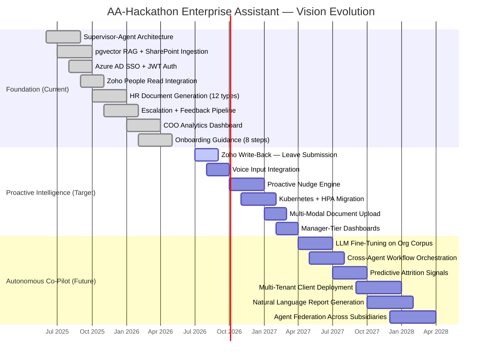

# AA-Hackathon Enterprise Assistant — Platform Vision

**Document ID:** 00-FOUND-001  
**Version:** 1.0  
**Date:** 2026-06-07  
**Organization:** Aligned Automation  
**Classification:** Internal — Strategic

---

## 1. Platform Vision Statement

The AA-Hackathon Enterprise Assistant is Aligned Automation's strategic investment in unified conversational AI — a single, trusted, enterprise-grade interface through which every employee can access HR services, IT support, administrative workflows, project intelligence, and organizational knowledge without navigating fragmented portals, ticketing systems, or siloed knowledge bases.

**Vision:** By 2028, every Aligned Automation employee will interact with a context-aware AI assistant that understands their role, tenure, team, and current workload — resolving 80% of internal service requests autonomously, escalating the remaining 20% with rich context pre-populated, and continuously learning from each interaction to improve organizational efficiency.

The platform is not a chatbot. It is an enterprise intelligence layer — a single conversational surface that connects people to processes, policies, and institutional knowledge at the moment of need.

---

## 2. Strategic Objectives

### SO-01: Eliminate Friction in Employee Self-Service
Reduce average time-to-resolution for employee queries from multi-day ticket queues to sub-60-second conversational answers. HR, IT, and Admin teams currently spend significant bandwidth on repetitive, low-complexity queries that a well-trained AI can resolve independently.

### SO-02: Consolidate the Internal Service Ecosystem
Replace the fragmented landscape of SharePoint searches, Zoho People portals, email threads, and ticketing tools with a single natural-language interface. The assistant acts as a universal entry point that routes, resolves, escalates, or drafts — depending on the complexity and sensitivity of the request.

### SO-03: Capture and Surface Institutional Knowledge
Transform undocumented tribal knowledge embedded in email chains, Slack threads, and individual expertise into retrievable, vector-indexed, policy-compliant knowledge artifacts accessible to all employees, regardless of tenure or seniority.

### SO-04: Enable Data-Driven HR and Operations Decisions
Feed analytics back to HR leadership, IT managers, and the COO through structured dashboards that reveal query volume, failure rates, peak usage, escalation patterns, and knowledge gaps — turning assistant interactions into organizational intelligence.

### SO-05: Ensure Security, Privacy, and Compliance by Design
Operate under Zero Trust principles with Azure AD SSO, JWT validation on every API call, PII detection and redaction at the ingestion and generation layers, and full audit logging — meeting the compliance posture required for a regulated professional services organization.

---

## 3. North Star Principles

**NSP-1 — One Conversation, Full Enterprise Context**  
An employee should never need to switch tools. One conversation window handles HR leave requests, IT password resets, travel approvals, document generation, and project status — because the assistant knows which domain the user needs and routes accordingly.

**NSP-2 — Precision Over Volume**  
The assistant favors accurate, grounded responses over verbose hallucinations. Every answer is anchored in retrieved policy documents, structured database records, or verified organizational data. When the assistant does not know, it says so and escalates.

**NSP-3 — Privacy as Infrastructure**  
PII is treated as a first-class architectural concern, not an afterthought. Detection, redaction, and audit trail capabilities are embedded at the data ingestion layer, the query processing layer, and the response generation layer.

**NSP-4 — Self-Hosted Intelligence, Enterprise Control (configuration-dependent)**  
The platform's LLM layer is built to run on Aligned Automation's own infrastructure (ml01.alignedautomation.com via Ollama), and this is the default/fallback provider in the shipped code. However, the code also supports Anthropic Claude and Groq as configurable cloud LLM providers (selected by priority via environment flags), so self-hosted-only inference is not an architectural guarantee today — it is the outcome of a specific deployment configuration. Where "no employee query, document content, or organizational data leaves the organization's controlled compute boundary" is a hard requirement, it must be enforced through deployment policy and configuration lockdown (disabling the cloud-provider flags), not assumed from the architecture alone.

**NSP-5 — Progressive Autonomy with Human Oversight**  
The assistant earns increased autonomy as confidence and accuracy metrics improve. High-risk actions (document issuance, escalations, form submissions) always require explicit confirmation or route through a human-in-the-loop approval step.

**NSP-6 — Observable, Auditable, Explainable**  
Every routing decision, retrieval result, and LLM generation is logged. The platform provides traceability from user query to final response, including which documents contributed to the answer and what confidence threshold was applied.

---

## 4. Guiding Architecture Principles

**GAP-1 — Supervisor-Agent Hierarchy**  
A MasterAgent supervisor coordinates all domain agents. Fast-path regex detection handles well-defined intents (greetings, escalations, attendance) at zero LLM cost. Ambiguous intents currently fall back to keyword scoring against a domain-keyword dictionary — a live LLM-based classification method exists in the codebase but is not wired into the routing path today, so routing in the current build is a two-tier system (regex, then keywords), not a three-tier one. Activating LLM-based routing for ambiguous queries remains a near-term improvement, not a shipped capability.

**GAP-2 — Retrieval-Augmented Generation as the Default**  
No agent answers from parametric LLM memory alone. All domain agents (HR, IT, Admin, PMO, Finance, Org) retrieve from pgvector-indexed document chunks before invoking the LLM for generation. This grounds answers in current, organization-specific content.

**GAP-3 — Polyglot Data Access, Unified Interface**  
The assistant reads from heterogeneous data sources — pgvector for unstructured knowledge, Zoho People PostgreSQL for employee and attendance records, Microsoft Graph for user profiles and Forms, and SharePoint for document ingestion. The user sees one consistent interface regardless of which backend served the answer.

**GAP-4 — Stateless API, Stateful Conversation**  
Backend API endpoints are stateless and horizontally scalable. Conversation state (history, user context, preferences) is persisted in PostgreSQL and loaded per-request. SSE streaming is used for real-time response delivery without maintaining persistent server-side connections.

**GAP-5 — Defense in Depth at the AI Layer**  
Guardrails operate at two tiers: generic (jailbreak, harm, security threats) handled with static rejection before any LLM call, and organizational (distress signals, scope violations) handled with empathetic or redirecting LLM responses. Neither tier allows bypassing authentication or PII controls.

**GAP-6 — Embedding Stability and Reproducibility**  
All vector embeddings use the same fixed model (sentence-transformers/nomic-embed-text-v1.5, 768 dimensions). Model version pinning prevents silent embedding drift that would corrupt retrieval quality without visible errors.

---

## 5. Platform Evolution

### Current State (2025-2026) — Conversational Self-Service
- 13 domain agents behind a supervisor router (regex fast-paths plus keyword-scoring fallback; see GAP-1)
- pgvector RAG over SharePoint-ingested documents
- Azure AD SSO with JWT validation
- Zoho People read integration (employees, attendance)
- Escalation and HR document generation (12 document types)
- Configurable LLM provider (Anthropic Claude or Groq, or self-hosted Ollama/gpt-oss at ml01.alignedautomation.com as the default/fallback)
- Single-tenant deployment, Docker Compose infrastructure

### Target State (2026-2027) — Proactive Enterprise Intelligence
- Agent-initiated proactive nudges (expiring leaves, pending approvals, document renewals)
- Multi-modal input: document upload, image-based query, voice
- Structured workflow orchestration: multi-step approval chains with state tracking
- Expanded Zoho write-back: leave submission, attendance correction via assistant
- Role-aware personalization: responses calibrated to seniority, department, and project context
- Kubernetes-based deployment for horizontal scaling under load spikes

### Future State (2027-2028) — Autonomous Organizational Co-Pilot
- Predictive analytics: attrition risk signals, project overload indicators surfaced to managers
- Natural-language report generation: "Show me this quarter's IT escalation trends" produces a formatted report
- Cross-tenant federation for Aligned Automation subsidiaries or client deployments
- LLM fine-tuning on organization-specific conversation history and policy corpus
- Agent-to-agent orchestration: complex workflows spanning HR + Finance + IT resolved through coordinated agent chains without human handoff

---

## 6. Value Proposition by Stakeholder

### Individual Contributors (ICs)
- Instant answers to leave balances, payroll queries, IT access requests — without opening a ticket or waiting for a reply
- HR document generation (experience letters, NOC certificates, address proofs) available 24/7 through a two-sentence request
- Onboarding experience compressed from 2-day orientation chaos to an 8-step guided assistant flow

### HR Team
- Reduction in repetitive query volume allows focus on strategic HR work
- Document generation pipeline eliminates manual drafting for standard letter types
- Escalation tracking provides visibility into unresolved cases without inbox triage

### IT Operations
- Self-service password reset, VPN guidance, and software access queries resolved without L1 ticket creation
- Structured escalations arrive with pre-populated context (user, issue type, priority) rather than vague email requests
- Audit logs provide a complete trail of who asked what and what action was taken

### Admin and Facilities
- Travel requests, parking queries, and facility bookings handled conversationally
- Reduced administrative overhead from repetitive policy clarification questions

### COO and Executive Leadership
- COO Dashboard provides real-time operational metrics: active users, query success rates, escalation volumes, peak usage windows
- Knowledge gap analysis reveals which topics produce low-confidence answers, directing content investment
- Platform demonstrates AI adoption velocity and organizational efficiency improvements to stakeholders

### Platform and Engineering Team
- Clean supervisor-agent architecture allows addition of new domain agents without modifying the routing core
- pgvector + FAISS fallback provides a resilient retrieval layer that degrades gracefully
- Full observability (audit logs, analytics API, health endpoint) supports SRE practices

---

## 7. Innovation Roadmap Overview

| Quarter | Initiative | Impact |
|---------|-----------|--------|
| Q3 2026 | Zoho write-back: leave submission via chat | Eliminates portal round-trip for most common HR action |
| Q3 2026 | Voice input via browser Web Speech API | Expands accessibility for non-keyboard-centric users |
| Q4 2026 | Proactive nudges: expiring documents, pending approvals | Shifts assistant from reactive to proactive |
| Q4 2026 | Kubernetes migration + horizontal pod autoscaling | Enables concurrent load handling across teams |
| Q1 2027 | Multi-modal: document image upload with OCR pipeline | Allows employees to photograph physical docs for processing |
| Q1 2027 | Manager-tier dashboards with team-level analytics | HR and department heads gain team query insights |
| Q2 2027 | Fine-tuned LLM on organization corpus | Improves domain accuracy, reduces hallucination rate |
| Q2 2027 | Cross-agent workflow chains (HR + Finance + IT) | Complex multi-department requests resolved in a single conversation |
| Q3 2027 | Predictive attrition and burnout signals | HR receives early warning on at-risk employees |
| Q4 2027 | Client-facing deployment option with tenant isolation | Platform becomes an Aligned Automation product offering |

---

## 8. AI Platform Philosophy

### Grounded Generation, Not Freeform Generation
The platform treats LLM generation as the final step in a retrieval pipeline, not the first. The LLM's role is to synthesize, explain, and communicate — not to invent facts. Every response is grounded in documents, database records, or structured knowledge before the LLM composes the final answer.

### Self-Hosted First, Cloud as Exception (aspirational — configuration required)
The platform's design intent is that organizational data should not leave Aligned Automation's compute boundary for LLM inference, with the Ollama deployment at ml01.alignedautomation.com (running the gpt-oss model) as the default/fallback path. As shipped, however, the code already supports switching the active provider to Anthropic Claude or Groq via environment configuration — cloud LLM APIs are not merely "evaluated for specific non-sensitive tasks," they are a fully implemented, selectable path for the same employee-facing generation used by Ollama. Enforcing "self-hosted first" as a hard guarantee therefore requires deliberate deployment policy (locking the cloud-provider flags off), not just relying on the default configuration.

### Confidence-Aware Responses
The retrieval layer surfaces similarity scores alongside retrieved chunks. The assistant is designed to acknowledge uncertainty when similarity scores fall below threshold (0.10) or when no relevant chunks are found — routing to escalation rather than fabricating an answer.

### Graceful Degradation Under Failure
Every component in the pipeline has a fallback: pgvector failure falls back to FAISS, LLM routing failure falls back to keyword scoring, Zoho database unavailability falls back to a graceful "service temporarily unavailable" message. The assistant never fails silently.

### Human-in-the-Loop for Consequential Actions
Document generation, formal escalations, and Microsoft Forms creation require explicit user confirmation. The assistant does not submit forms, issue documents, or send emails autonomously without a clear user action. This preserves trust and prevents costly automation errors.

### Continuous Learning Through Feedback
Every message can receive a rating (-1, 0, 1) with optional comment, stored in the feedback table. This structured signal is the primary input for identifying retrieval failures, generation quality issues, and knowledge gaps — feeding a closed-loop improvement cycle.

---

## 9. Vision Evolution Timeline

---

## 10. Success Metrics at Vision Level

### Resolution Metrics
| Metric | Baseline (2025) | Target (2026) | Vision (2028) |
|--------|----------------|---------------|---------------|
| Autonomous resolution rate | — | 60% | 80% |
| Average time-to-resolution (self-service) | 2 days (ticket) | 60 seconds | 15 seconds |
| Escalation pre-population accuracy | — | 85% | 95% |
| HR document generation cycle time | 1-3 days | Instant | Instant |

### Quality Metrics
| Metric | Target |
|--------|--------|
| Retrieval relevance score (avg cosine sim) | > 0.60 |
| User feedback positive rate | > 80% |
| Hallucination-free response rate (audited sample) | > 95% |
| PII containment — no PII in responses | 100% |

### Adoption Metrics
| Metric | Target (2026) | Vision (2028) |
|--------|---------------|---------------|
| Monthly active users | 70% of headcount | 95% of headcount |
| Queries per active user per week | 5 | 15 |
| Departments with > 50% adoption | 4 of 6 | 6 of 6 |

### Operational Metrics
| Metric | Target |
|--------|--------|
| API p95 response latency | < 3 seconds |
| SSE streaming first-token latency | < 1.5 seconds |
| System availability (monthly) | > 99.5% |
| SharePoint ingestion freshness lag | < 24 hours |
| Audit log completeness | 100% of user actions |

---

## 11. Anti-Patterns to Avoid

**AP-01 — LLM as Oracle**  
The LLM must not be used as the source of truth for policy, headcount, attendance, or financial data. All factual claims must be retrieved from authoritative sources (pgvector, Zoho, SharePoint). Treating the model's parametric memory as ground truth produces confident, uncorrectable hallucinations.

**AP-02 — Siloed Agent Development**  
Adding new domain agents without registering their intent signatures in the supervisor's fast-path and keyword fallback dictionaries creates routing black holes. Every new agent must be accompanied by a supervisor routing update.

**AP-03 — Unbounded Context Windows**  
Setting num_ctx to excessively large values to avoid context management creates latency spikes, resource contention on ml01, and unpredictable response quality. Context must be managed through chunk selection and memory summarization, not by expanding the window indefinitely.

**AP-04 — Schema Drift Without Migration Tracking**  
The pgvector schema (document_chunks, embedding vector[768]) must not be altered without a corresponding embedding model change and re-indexing job. Mismatched embedding dimensions cause silent retrieval failures — chunks are stored but never retrieved because cosine distance comparisons are undefined.

**AP-05 — Bypassing Guardrails for Development Speed**  
Disabling or short-circuiting the two-tier guardrail system (guardrails.py) for development convenience creates security exposure in production. Guardrails must be active in all environments including staging.

**AP-06 — Anonymous Analytics**  
Aggregating analytics without user_id linkage prevents effective debugging of individual failure cases and blocks manager-tier personalization features. All analytics events must retain user_id (hashed or pseudonymized per data policy) for traceability.

**AP-07 — Monolithic Document Chunks**  
Ingesting documents as single large chunks degrades retrieval precision because a chunk may match a query on one sentence but dilute relevance with irrelevant paragraphs. The 1000-character / 200-character-overlap chunking strategy must be maintained during ingestion.

**AP-08 — Soft Deletes Without Reindexing**  
Marking documents as is_deleted=true in the documents table without removing their associated document_chunks from the vector index allows soft-deleted content to continue surfacing in retrieval. The SharePoint ingestion job must purge vector entries when documents are marked deleted.

---

## 12. Recommended Next Innovations

### RNI-01: Retrieval Quality Feedback Loop
Instrument retrieval quality by logging which chunks were retrieved, their similarity scores, and the subsequent user feedback rating. Build a weekly analysis job that identifies low-score retrievals correlated with negative feedback — surfacing specific documents or knowledge areas that require content improvement or re-chunking.

### RNI-02: Conversational Memory Summarization
Implement a memory compaction mechanism that summarizes conversation history older than the last 10 turns into a structured user context record. This prevents context window exhaustion in long-running conversations while preserving user preferences, previously stated facts, and interaction patterns across sessions.

### RNI-03: Zoho People Write-Back via Supervised Actions
Extend the EmployeeAgent and AttendanceAgent to submit leave requests and attendance corrections back to Zoho People through the Zoho API. Every write action must route through a confirmation step that presents the structured payload to the user for explicit approval before submission.

### RNI-04: Intent Confidence Telemetry
Surface the supervisor's routing confidence scores (LLM intent classification probability, keyword score deltas) as structured telemetry. Build a routing accuracy dashboard that identifies query categories where the supervisor consistently mis-routes, enabling targeted fast-path rule additions or LLM prompt refinements.

### RNI-05: Knowledge Gap Detection
Implement an automated weekly job that identifies queries where pgvector retrieval returned no chunks above the 0.10 threshold (the "no-knowledge" signal). Cluster these queries by semantic similarity and present a prioritized list of knowledge gaps to the HR and IT content owners for document authoring assignments.

### RNI-06: Role-Contextual Response Calibration
Leverage Azure AD group membership (returned from Microsoft Graph User.Read scope) to calibrate response depth and authority level. A manager asking about leave policy receives a response that includes team-level leave management guidance; an IC receives individual entitlement details. Role context is injected into the LLM system prompt without requiring the user to specify their role.

### RNI-07: Async Document Processing Pipeline
Replace synchronous SharePoint ingestion with an event-driven pipeline where document change events trigger async ingestion workers via a message queue (e.g., Azure Service Bus). This decouples ingestion from the main API process, supports parallel processing of large document batches, and provides per-document ingestion status tracking.

### RNI-08: Multi-Language Support
Extend the embedding and generation pipeline to support Hindi, Tamil, and other languages spoken by Aligned Automation employees. Use a multilingual embedding model (e.g., paraphrase-multilingual-nomic-embed-text-v1.5-L12-v2, 768-dim compatible) as a drop-in replacement for the current nomic-embed-text-v1.5 model to preserve vector dimension compatibility with the existing pgvector schema.

---

*This document is the authoritative vision reference for the AA-Hackathon Enterprise Assistant platform. All architectural decisions, feature prioritization, and technical trade-offs should be evaluated against the North Star Principles and Strategic Objectives defined herein.*

*Maintained by: Platform Engineering, Aligned Automation*  
*Next review: 2026-09-07*
