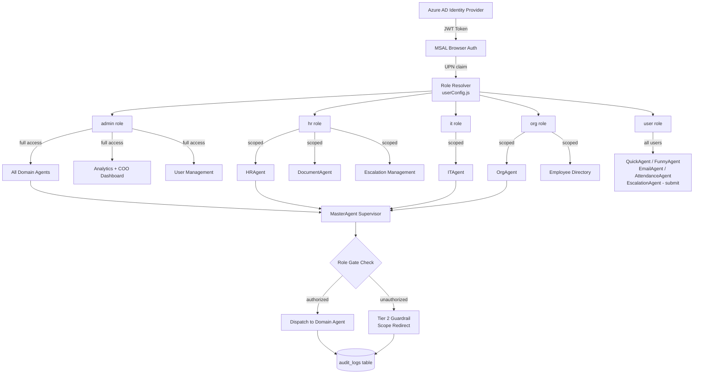

# Access Control — AA-Hackathon Enterprise Assistant

**Document ID:** GOV-002
**Owner:** Platform Engineering, Aligned Automation
**Last Updated:** 2026-06-07
**Status:** Active

---

## 1. Access Control Philosophy

The AA-Hackathon Enterprise Assistant enforces a layered, defense-in-depth access control model built on three principles:

**Least Privilege.** Every user receives the minimum permissions required to perform their job function. Agents, dashboards, and data access are scoped by role, not granted universally.

**Identity as the Perimeter.** Azure Active Directory (Azure AD) is the authoritative identity provider. No internal resource is accessible without a valid Azure AD JWT. The network perimeter is secondary; identity verification is primary.

**Auditability by Default.** Every authenticated action — agent invocations, document generation, escalation creation, form submissions — is written to the `audit_logs` table. Access control decisions are logged alongside the identity making the request, enabling post-hoc forensics without additional tooling.

These principles are enforced at three layers:
- **Frontend (React/MSAL):** Navigation guards and component-level gating based on role retrieved at login.
- **Backend (FastAPI middleware):** JWT validation on every request; role claims extracted from the Azure AD token and checked against endpoint ACLs.
- **Agent layer (supervisor_agent.py):** Domain agent routing respects role before dispatching; privileged agent types are only reachable by authorized roles.

---

## 2. Role Definitions

Roles are defined in `apps/web-ui/src/config/userConfig.js` (frontend) and enforced by backend JWT middleware. All roles are resolved from the user's Azure AD UPN (email address).

| Role Constant | Role Value | Description |
|---|---|---|
| `ROLES.ADMIN` | `admin` | Platform administrators with full system access. Can manage users, access all agents, and view all analytics. |
| `ROLES.HR` | `hr` | Human Resources staff. Access scoped to HR domain agent, HR document generation, and leave/policy knowledge. |
| `ROLES.IT` | `it` | IT support and infrastructure staff. Access scoped to IT domain agent, VPN, password reset, and access request workflows. |
| `ROLES.ORG` | `org` | Organizational management layer. Access to org/culture/mission knowledge base and org-level information. |
| `ROLES.USER` | `user` | Default role assigned to all authenticated employees not explicitly assigned a higher role. Limited to general conversational chat and self-service queries only. |

### Allocation Board Roles (PMO Layer)

The Allocation Board uses a separate role hierarchy sourced from the backend PMO data:

| Allocation Role | Description |
|---|---|
| `executive` | C-suite and VP-level; full PMO analytics access |
| `business_lead` | Business unit leads; PMO analytics access |
| `functional_lead` | Functional managers; PMO analytics access |
| `team_lead` | Team leads; allocation view only |
| `employee` | Individual contributors; self-view only |

---

## 3. Permission Matrix

The table below maps each application capability to the roles permitted to exercise it. A check mark indicates permission is granted; a dash indicates access is denied.

| Capability | `user` | `org` | `it` | `hr` | `admin` |
|---|:---:|:---:|:---:|:---:|:---:|
| Login via Azure AD SSO | Yes | Yes | Yes | Yes | Yes |
| General conversational chat (QuickAgent, FunnyAgent) | Yes | Yes | Yes | Yes | Yes |
| Self-service attendance queries (AttendanceAgent) | Yes | Yes | Yes | Yes | Yes |
| Employee directory lookup (EmployeeAgent — self) | Yes | Yes | Yes | Yes | Yes |
| Employee directory lookup (EmployeeAgent — others) | No | Yes | No | Yes | Yes |
| HR domain queries (HRAgent) | No | No | No | Yes | Yes |
| IT domain queries (ITAgent) | No | No | Yes | No | Yes |
| Admin/facilities queries (AdminAgent) | No | No | No | No | Yes |
| Org/culture queries (OrgAgent) | No | Yes | No | No | Yes |
| PMO queries (PMOAgent) | No | No | No | No | Yes |
| Finance queries (FinanceAgent) | No | No | No | No | Yes |
| Email drafting (EmailAgent) | Yes | Yes | Yes | Yes | Yes |
| Escalation submission (EscalationAgent) | Yes | Yes | Yes | Yes | Yes |
| Escalation management (view all) | No | No | No | Yes | Yes |
| HR document generation (DocumentAgent) | No | No | No | Yes | Yes |
| Microsoft Forms creation | No | No | No | Yes | Yes |
| Analytics Dashboard | No | No | No | No | Yes |
| COO Dashboard | No | No | No | No | Yes (admin/executive) |
| User management (add/remove/role change) | No | No | No | No | Yes |
| Admin panel access | No | No | No | No | Yes |
| SharePoint ingestion job management | No | No | No | No | Yes |

---

## 4. Azure AD Group Mappings

The application uses Azure AD UPN-based authorization, with the `authorizedUsers` map in `userConfig.js` acting as the explicit allowlist. Users not present in the map receive the default `user` role rather than being denied access outright, enabling all Aligned Automation employees to authenticate.

### Recommended Azure AD Group Structure

The following Azure AD security groups are recommended for operational management. Membership changes in these groups should trigger a corresponding update to the application's authorized users configuration:

| Azure AD Group | Maps To Role | Notes |
|---|---|---|
| `AA-EA-Admins` | `admin` | Platform administrators; restricted membership |
| `AA-EA-HR` | `hr` | Human Resources department members |
| `AA-EA-IT` | `it` | IT department members |
| `AA-EA-OrgManagement` | `org` | Organizational management layer |
| `AA-AllEmployees` | `user` | All Aligned Automation employees (default) |

### MSAL Configuration

The frontend uses `@azure/msal-browser` (v5.9.0) with the following OIDC scopes:

```
openid, profile, email, User.Read
```

Optional Graph API scopes (admin-consented):
- `Tasks.Read` — Microsoft Planner integration
- `Calendars.ReadBasic` — Calendar integration

Token claims used for identity resolution:
- `preferred_username` / UPN: primary identity key for role lookup
- `name`: display name in chat interface
- `oid`: Azure AD Object ID stored in `audit_logs.user_id`

Tokens are stored in `sessionStorage` (not `localStorage`) to prevent cross-tab token leakage.

---

## 5. Agent-Level Access Control

The MasterAgent (supervisor_agent.py) enforces agent-level access before routing queries. The permission check occurs in the supervisor's routing phase, prior to LLM-based classification, ensuring no privilege escalation through prompt manipulation.

| Agent | Accessible Roles | Trigger Mechanism |
|---|---|---|
| QuickAgent | All roles | Fast-path: greeting patterns, simple queries |
| FunnyAgent | All roles | Fast-path: joke/casual intent detection |
| AttendanceAgent | All roles | Fast-path: attendance/clock keywords |
| EmployeeAgent (self) | All roles | Fast-path: self-lookup patterns |
| EmployeeAgent (others) | `org`, `hr`, `admin` | Role check before directory queries |
| EmailAgent | All roles | Fast-path: email composition patterns |
| EscalationAgent | All roles | Fast-path: escalation form patterns |
| HRAgent | `hr`, `admin` | LLM routing + keyword fallback |
| ITAgent | `it`, `admin` | LLM routing + keyword fallback |
| AdminAgent | `admin` | LLM routing + keyword fallback |
| OrgAgent | `org`, `admin` | LLM routing + keyword fallback |
| PMOAgent | `admin`, `executive`, `business_lead` | LLM routing; PMO keywords |
| FinanceAgent | `admin` | LLM routing; finance keywords |
| DocumentAgent | `hr`, `admin` | Fast-path: document generation patterns |

**Enforcement note:** The supervisor applies a role gate before dispatching. If a `user`-role account attempts to trigger `HRAgent` through keyword manipulation, the supervisor intercepts and returns a scope-redirect message generated by the Tier 2 guardrail (OrgScopeViolation handler in `agents/guardrails.py`).

---

## 6. Dashboard Access Control

### Analytics Dashboard (`analytics/AnalyticsDashboard.jsx`)

The Analytics Dashboard exposes platform-wide usage metrics including active users, daily query volumes, peak hours, query categories, and success/failure rates.

**Access:** Restricted to `admin` role only.

Components rendered: ActiveUsersAreaChart, DailyLineChart, DateRangeFilter, OverviewCards, PeakHoursBarChart, QueryPieChart, RecentActivities, SuccessFailedChart, TabsBarChart, TopQueriesTable.

Backend endpoint: `GET /api/analytics/overview` — validates JWT role claim before returning aggregate data.

### COO Dashboard (`coo-analytics/COODashboard.jsx`)

The COO Dashboard exposes executive-level organizational metrics.

**Access:** `admin` role and Allocation Board roles `executive`, `business_lead`, `functional_lead` (as defined in `ANALYTICS_ROLES`).

Access check logic:
```javascript
export const ANALYTICS_ROLES = [
  ALLOCATION_ROLES.EXECUTIVE,
  ALLOCATION_ROLES.BUSINESS_LEAD,
  ALLOCATION_ROLES.FUNCTIONAL_LEAD,
];
```

Both dashboards use Azure AD token-derived role for frontend routing guards and enforce the same check server-side on API responses.

---

## 7. Document Access Control

The DocumentAgent supports generation of 11 HR document types. Access is restricted to prevent unauthorized generation of legally binding organizational documents.

### Document Generation Access

| Document Type | Minimum Role | Notes |
|---|---|---|
| Employment Verification Letter | `hr` | Generates on behalf of requester |
| Experience Letter | `hr` | |
| Offer Letter | `hr` | |
| Relieving Letter | `hr` | |
| Promotion Letter | `hr` | |
| Confirmation Letter | `hr` | |
| NOC Certificate | `hr` | |
| Bonafide Certificate | `hr` | |
| Address Proof Letter | `hr` | |
| Internship Certificate | `hr` | |
| ID Card Request | `hr`, `admin` | Requires admin co-authorization |

### Document Repository Access (`DocumentsPage.jsx`)

- **View document list:** All authenticated users can view the document listing page.
- **Download documents:** All authenticated users can download documents surfaced by the RAG system via chat.
- **Upload / ingest documents:** `admin` only, via SharePoint ingestion job.
- **Delete documents:** `admin` only; soft-delete sets `is_deleted = true` in the `documents` table.

Document-level access in the knowledge base (`document_chunks` table) is not row-level security filtered at the pgvector query layer. All authenticated users receive search results from the full corpus. Sensitive HR policy documents that require role-level filtering must be maintained in separate SharePoint libraries with ingestion restricted to appropriate roles.

---

## 8. Escalation Access Control

Escalations are managed through the `escalations` table and the EscalationDrawer UI component.

| Capability | `user` | `org` | `it` | `hr` | `admin` |
|---|:---:|:---:|:---:|:---:|:---:|
| Submit new escalation | Yes | Yes | Yes | Yes | Yes |
| View own escalations | Yes | Yes | Yes | Yes | Yes |
| View all escalations | No | No | No | Yes | Yes |
| Update escalation status | No | No | No | Yes | Yes |
| Close / resolve escalation | No | No | No | Yes | Yes |
| Delete escalation (soft) | No | No | No | No | Yes |

Escalation `form_data` is stored as JSONB and may contain sensitive employee information. The `GET /api/escalations` endpoint filters results by `user_id` for non-HR/admin roles, ensuring employees can only retrieve their own submissions.

---

## 9. Onboarding Access Control

The 8-step Onboarding Guidance module (`onboarding-guidance/OnboardingGuidancePage.jsx`) is available to all authenticated users, as it is designed for new employee self-service.

| Onboarding Step | Available Roles | Notes |
|---|---|---|
| WelcomeStep | All | Entry point for all users |
| ProfileStep | All | Reads from Microsoft Graph `User.Read` |
| TeamStep | All | Reads org chart data from EmployeeAgent |
| ITAccessStep | All | Guides user through IT setup requests |
| DocumentsStep | All | Links to personal HR documents |
| PolicyStep | All | Links to policy documents via HRAgent |
| InductionStep | All | Org culture content via OrgAgent |
| AllSetStep | All | Completion acknowledgement |

**Note:** While all authenticated users can navigate the onboarding flow, the underlying agent calls made during onboarding (e.g., policy lookups via HRAgent, IT setup via ITAgent) are still subject to agent-level access control. For the onboarding flow, temporary read-only access to HRAgent and ITAgent for onboarding-context queries is granted regardless of role, scoped to the onboarding session only.

---

## 10. RBAC Model



---

## 11. Access Review Process

### Quarterly Access Review

Access reviews are conducted quarterly by the Platform Engineering team in coordination with HR and department managers.

**Review scope:**
1. All users in the `authorizedUsers` map are validated against current employee roster from Zoho People.
2. Role assignments are compared against current job titles and department memberships.
3. Users who have left the organization are removed immediately (off-boarding trigger); quarterly review catches any gaps.
4. Admin role holders are reviewed individually with manager approval for each.

**Review procedure:**
1. Export current authorized users list from `userConfig.js` and backend role configuration.
2. Cross-reference against Zoho People active employee list.
3. Flag: departed employees, employees who changed departments, role mismatches.
4. Submit changes via pull request to the configuration repository.
5. After deployment, verify changes in `audit_logs` by confirming no activity from removed accounts.

### Off-boarding Procedure

When an employee departs Aligned Automation:

1. Azure AD account is disabled (IT responsibility, within 24 hours of departure).
2. Disabled Azure AD account immediately invalidates all MSAL sessions (token refresh fails at `https://login.microsoftonline.com/{tenant_id}`).
3. Remove user entry from `authorizedUsers` map in `userConfig.js` and redeploy frontend.
4. Soft-delete or anonymize user data per data retention policy.
5. Confirm no pending escalations or open documents requiring the user's name.

### Access Change Requests

Role elevation requests (e.g., `user` to `hr`) require:
- Written approval from the requesting employee's department head.
- HR confirmation that the role change matches job function.
- Admin execution via the admin panel or configuration update.
- Audit log entry created for the role change event.

---

## 12. Privileged Access Management

### Admin Role Controls

The `admin` role is the highest privilege level. The following controls apply:

**Membership limits:** The admin role should be restricted to platform engineers and explicitly named functional owners. As of this writing, the admin users are individually listed by email in `userConfig.js`; no wildcard or domain-wide admin grants are permitted.

**Admin actions subject to audit:** All actions taken by admin-role users are captured in `audit_logs` with `entity_type`, `entity_id`, `action`, and `status` fields. Admin audit logs are reviewed during quarterly access reviews and on-demand during incident investigations.

**No shared admin accounts:** Each admin user must have an individual Azure AD identity. Shared or service accounts must not be granted the admin role.

**Break-glass procedure:** If Azure AD authentication is unavailable, no break-glass bypass exists in the current implementation. Recovery requires restoring Azure AD service or using direct database access with separate database credentials managed by the infrastructure team.

### Service Account Access

The following service integrations use non-human identities:

| Service | Credential Type | Scope | Storage |
|---|---|---|---|
| SharePoint Ingestion | Azure AD App Registration | SharePoint read, Graph API | Environment variables |
| Microsoft Graph (server-side) | Azure AD App Registration | User.Read, Sites.Read.All | Environment variables (`AZURE_CLIENT_ID`, `AZURE_TENANT_ID`) |
| Ollama LLM | No auth (internal network) | LLM inference only | `OLLAMA_BASE_URL` env var |
| PostgreSQL | Username/password | `squadrons` database | `SQL_*` env vars |
| Zoho People DB | Username/password | Read-only replica | `ZOHO_DB_*` env vars |

Service account credentials are never stored in source code or frontend bundles. All secrets are injected via environment variables at container runtime (Docker Compose `.env` file or orchestration secrets manager).

---

## 13. Future: Attribute-Based Access Control (ABAC)

The current RBAC model assigns permissions based solely on role. As the platform matures, attribute-based access control extensions are planned to enable finer-grained access decisions using contextual attributes.

### Planned ABAC Attributes

| Attribute Category | Example Attributes | Intended Use |
|---|---|---|
| User attributes | department, job level, tenure, location | Scope HR document generation to user's own department |
| Resource attributes | document classification (public/internal/confidential/restricted), document owner, creation date | Prevent cross-department access to confidential HR documents |
| Environment attributes | time of day, device compliance state, network location | Conditional access for sensitive operations outside business hours |
| Action attributes | read vs. generate vs. delete | Separate viewing from writing permissions on documents |

### ABAC Implementation Approach

1. **Phase 1 — Department scoping:** Extend `authorizedUsers` to include department attribute alongside role. HRAgent and DocumentAgent route queries scoped to the user's own department only.
2. **Phase 2 — Document classification:** Add `classification` field to the `documents` table. pgvector retrieval filters on classification level permitted for the requesting role.
3. **Phase 3 — Dynamic policy engine:** Integrate an Open Policy Agent (OPA) sidecar. Policy bundles define ABAC rules evaluated at the API middleware layer. Role claims from Azure AD are augmented with department and level claims from Microsoft Graph.
4. **Phase 4 — Row-level security:** Enable PostgreSQL RLS policies on `document_chunks` and `messages` tables, enforcing data isolation at the database layer independent of application logic.

ABAC implementation requires Azure AD group-based claim enrichment, Graph API consent for extended profile attributes (`Department`, `JobTitle`, `OfficeLocation`), and backend middleware refactoring to pass attribute context through the agent invocation chain.

---

*This document is maintained by the Platform Engineering team at Aligned Automation. For access change requests or policy questions, contact the IT helpdesk or submit an escalation via the Enterprise Assistant.*
