# AI Governance Specification
# AA-Hackathon Enterprise Assistant — Aligned Automation
# Document Version: 1.0 | Classification: Internal — Restricted
# Owner: AI Platform Team | Effective Date: 2026-06-07

---

## Table of Contents

1. [AI Governance Overview and Mandate](#1-ai-governance-overview-and-mandate)
2. [Governance Model](#2-governance-model)
3. [Model Governance](#3-model-governance)
4. [Prompt Governance](#4-prompt-governance)
5. [Output Governance](#5-output-governance)
6. [Data Governance for AI](#6-data-governance-for-ai)
7. [Bias and Fairness Controls](#7-bias-and-fairness-controls)
8. [Human-in-the-Loop Requirements](#8-human-in-the-loop-requirements)
9. [Incident Management](#9-incident-management)
10. [Audit and Logging Requirements](#10-audit-and-logging-requirements)
11. [Compliance Requirements](#11-compliance-requirements)
12. [AI Governance Lifecycle](#12-ai-governance-lifecycle)
13. [Policy Violation Response](#13-policy-violation-response)
14. [Future Governance Enhancements](#14-future-governance-enhancements)

---

## 1. AI Governance Overview and Mandate

### 1.1 Purpose

This document defines the AI Governance framework for the AA-Hackathon Enterprise Assistant deployed at Aligned Automation. It establishes binding policies, roles, controls, and processes that govern how artificial intelligence capabilities are designed, deployed, monitored, and retired within the organization's enterprise environment.

This framework applies to all AI components of the platform, including:

- The platform's LLM (provider selected by priority — Anthropic Claude, then Groq, then self-hosted Ollama at ml01.alignedautomation.com as the default/fallback — via env flags in `agents/working/config.py`)
- All domain agents operating under the MasterAgent supervisor
- The pgvector-backed RAG retrieval system
- Embedding pipelines using sentence-transformers/nomic-embed-text-v1.5
- Any integrations that invoke, relay, or transform AI-generated content

### 1.2 Mandate

Aligned Automation is committed to deploying AI systems that are transparent, accountable, and safe. The organization acknowledges that AI systems operating on employee data, HR records, escalation workflows, and organizational knowledge carry elevated responsibility. This mandate requires that:

- No AI-generated output affecting an employee's rights, compensation, or employment status is delivered without human review
- All AI interactions are logged with sufficient fidelity to reconstruct events for audit purposes
- The AI system operates strictly within its defined organizational scope
- Employees are always informed when they are interacting with an AI system
- Mechanisms exist for employees to escalate, contest, or report AI outputs

### 1.3 Scope

This governance framework covers the full lifecycle from ingestion through generation and user delivery:

| Lifecycle Phase | Components in Scope |
|---|---|
| Data Ingestion | SharePoint sync, Zoho People read, document chunking |
| Knowledge Storage | pgvector (document_chunks), FAISS fallback |
| Retrieval | RAG pipeline (rag/retriever.py), similarity threshold 0.10 |
| Generation | Ollama gpt-oss, LangChain-Ollama, all agent prompts |
| Delivery | FastAPI endpoints, SSE streaming, frontend rendering |
| Feedback | feedback table, rating [-1, 0, 1], user comments |
| Escalation | escalations table, EscalationAgent workflows |

---

## 2. Governance Model

### 2.1 Roles and Responsibilities

| Role | Title | Responsibilities |
|---|---|---|
| AI Governance Owner | Head of Technology / CTO | Final authority on AI policy; approves model changes; escalation endpoint |
| AI Platform Lead | Platform Engineering Lead | Day-to-day governance execution; owns agent configuration; reviews prompt changes |
| Data Steward | HR Director / Admin Head | Approves documents ingested into the knowledge base; classifies HR-sensitive content |
| Security Officer | IT Security Lead | Reviews PII controls; approves guardrail configurations; incident response lead |
| Domain Owners | HR, IT, Admin, PMO, Finance Leads | Validate agent responses for their domain; approve domain-specific prompts |
| End User Representatives | Employee delegates (per department) | Participate in fairness reviews; report anomalies; represent user interests |
| Compliance Officer | Legal / Compliance | Ensures adherence to labor law, data protection, and internal policies |

### 2.2 Decision Rights

The following matrix defines who can authorize changes to AI system components:

| Change Type | Can Propose | Must Approve | Must Be Notified |
|---|---|---|---|
| New domain agent | Platform Lead | AI Governance Owner | Security Officer, Compliance Officer |
| Prompt modification | Domain Owner | Platform Lead | AI Governance Owner |
| Model upgrade or swap | Platform Lead | AI Governance Owner + Security Officer | All Domain Owners, Compliance |
| New document type in RAG | Data Steward | Domain Owner | Platform Lead |
| Guardrail modification | Security Officer | AI Governance Owner | Compliance Officer |
| New external integration | Platform Lead | AI Governance Owner + Security Officer | Data Steward, Compliance |
| Similarity threshold change | Platform Lead | AI Governance Owner | Security Officer |

### 2.3 Governance Cadence

| Meeting | Frequency | Attendees | Purpose |
|---|---|---|---|
| AI Operations Review | Weekly | Platform Lead, Domain Owners | Incident review, performance, escalations |
| AI Governance Board | Monthly | All roles above | Policy review, model changes, compliance |
| AI Audit Review | Quarterly | Compliance, Security, AI Governance Owner | Full audit log review, external findings |
| Model Performance Review | Quarterly | Platform Lead, Domain Owners | Output quality, bias checks, model health |

---

## 3. Model Governance

### 3.1 Model Identity and Registration

The LLM provider is selected at startup by priority — Anthropic Claude (`claude-sonnet-4-6` default) first, then Groq (`llama3-70b-8192` default), then self-hosted Ollama as the default/fallback — via the `USE_Claude_API_Key` / `USE_Groq_API_Key` / `Use_Ollama_LLM` environment flags in `agents/working/config.py`. The Ollama configuration, when active, is registered as follows:

| Attribute | Value |
|---|---|
| Model ID | gpt-oss (Ollama fallback); claude-sonnet-4-6 (Claude) or llama3-70b-8192 (Groq) when those providers are configured |
| Hosting | Self-hosted via Ollama at ml01.alignedautomation.com:11434 when Ollama is the active provider; Claude and Groq are external hosted APIs when configured |
| Temperature | 0.1 (low creativity, high determinism) |
| Max tokens (num_predict) | 800 |
| Context window (num_ctx) | 2048 tokens |
| Embedding model | sentence-transformers/nomic-embed-text-v1.5 (768-dim) |
| Embedding fallback | nomic-embed-text via Ollama |

Any statement elsewhere in this document that treats the self-hosted Ollama model as the platform's exclusive or guaranteed LLM should be read in this light: Ollama is the default/fallback provider, not a hard architectural constraint.

Every registered model must have a corresponding entry in the internal model registry (maintained outside the application codebase) that records: model source, version, intended use, known limitations, and approval date.

### 3.2 Model Change Control

Any change to the serving model — including version upgrades, parameter adjustments, or model replacement — must follow a formal change control process:

1. Platform Lead submits a Model Change Request documenting the proposed change, rationale, and risk assessment.
2. Security Officer reviews for new attack surfaces or PII risks introduced by the change.
3. AI Governance Owner approves or rejects with documented reasoning.
4. The change is deployed to a staging environment and evaluated against a minimum set of 50 reference queries spanning all domain agents.
5. Evaluation results are recorded before production deployment.
6. Post-deployment, a 72-hour enhanced monitoring window applies during which output anomaly rates are tracked hourly.

### 3.3 Model Retirement

When a model version is retired:

- All dependent prompt templates referencing model-specific behavior are reviewed.
- Audit logs referencing that model version are archived and retained for 7 years.
- The model registry entry is closed with retirement date and reason.

### 3.4 Inference Parameter Governance

The temperature setting of 0.1 and context window of 2048 are governance decisions, not just engineering defaults. Changes to inference parameters require the same approval as model changes because they materially affect output determinism and scope. Parameters are version-controlled in the application configuration and changes are audited.

---

## 4. Prompt Governance

### 4.1 Prompt Classification

All prompts used by domain agents are classified by sensitivity:

| Class | Description | Examples | Review Cycle |
|---|---|---|---|
| Class A — System | Top-level system role definitions and supervisor routing | MasterAgent system prompt | Quarterly + on any model change |
| Class B — Domain | Domain agent task framing, retrieval integration | HRAgent, ITAgent base prompts | Quarterly |
| Class C — Task | Specific task prompts (document generation, email drafting) | DocumentAgent templates | On each new document type |
| Class D — Guardrail | Rejection and redirection messages | Tier 1 and Tier 2 guardrail text | On any guardrail policy change |

### 4.2 Prompt Review Process

Before any prompt is deployed to production:

1. The authoring Domain Owner drafts the prompt and submits it for review with a description of intended behavior.
2. The Platform Lead performs a technical review: injection risk, scope boundary, tone consistency, and context contamination potential.
3. The Security Officer reviews for PII leakage vectors and adversarial input handling.
4. Approved prompts are committed to the source-controlled prompt library with metadata (author, reviewer, version, effective date).
5. Rejected prompts are documented with rejection reason and returned to the author for revision.

### 4.3 Prompt Injection Controls

The system implements multiple layers of defense against prompt injection:

- Tier 1 Guardrails in agents/guardrails.py intercept jailbreak patterns before any prompt reaches the LLM.
- User input is never directly concatenated into system prompt sections; it is always placed in a designated user-turn slot.
- Fast-path regex detection in supervisor_agent.py handles sensitive intent categories (escalations, forms, greetings) without LLM involvement, eliminating injection surface for those paths.
- Retrieved RAG context is wrapped in explicit delimiter markup to prevent it from being interpreted as instructions.

### 4.4 Prompt Version Control

All prompt templates are stored in the application source repository. The commit history serves as the prompt version record. Each prompt file must contain a header comment block with:

- Purpose
- Target agent
- Approved by (name and date)
- Last modified

---

## 5. Output Governance

### 5.1 Output Validation Layers

AI outputs pass through the following validation layers before reaching the user:

| Layer | Mechanism | Location |
|---|---|---|
| Guardrail pre-filter | Tier 1 and Tier 2 checks before LLM call | agents/guardrails.py |
| Similarity threshold | RAG results below 0.10 similarity are excluded | rag/retriever.py |
| Top-K cap | Maximum 3 chunks returned per retrieval call | base_deep_agent.py |
| Source attribution | Returned sources (sources JSONB in messages table) accompany every grounded response | API response |
| Feedback loop | User rating [-1, 0, 1] on every message enables flagging | feedback table |

### 5.2 High-Sensitivity Output Categories

The following output categories require additional controls:

| Output Category | Agent | Control Required |
|---|---|---|
| HR document generation (offer, experience, relieving letters) | DocumentAgent | Manager or HR approval before document is finalized |
| Escalation creation | EscalationAgent | Confirmation step in UI before submission; audit log entry |
| Payroll and tax information | HRAgent, FinanceAgent | Disclaimer appended; user directed to authoritative source |
| Employee directory data | EmployeeAgent | RBAC enforcement; Zoho read-only; no bulk export via chat |
| Email drafting | EmailAgent | User must explicitly send; no auto-send capability |
| PMO allocation data | PMOAgent | Read-only presentation; no write-back |

### 5.3 Disclaimers and Transparency

All AI-generated responses must be:

- Labeled as AI-generated in the UI (ChatWindow.jsx must render an AI indicator on all assistant messages).
- Accompanied by source citations when the response is grounded in retrieved documents.
- Clear about uncertainty: agents must not assert facts as definitive when similarity scores are low.

Employees are informed at login (LoginPage.jsx) and within the onboarding flow (OnboardingGuidancePage.jsx, PolicyStep) that the assistant is an AI system.

### 5.4 Output Retention

Messages are stored in the messages table with role, content, and sources JSONB. Messages are soft-deleted (is_deleted flag) and are not purged from the database. This ensures outputs are available for audit and dispute resolution. Hard deletion requires explicit Data Steward and Compliance Officer authorization.

---

## 6. Data Governance for AI

### 6.1 Data Sources and Classification

| Data Source | Classification | AI Use |
|---|---|---|
| SharePoint documents (PDF, DOCX, XLSX, PPTX) | Internal — Organizational | RAG knowledge base via document_chunks table |
| Zoho People employee records | Confidential — PII | EmployeeAgent directory; AttendanceAgent; read-only |
| Zoho attendance records | Confidential — PII | AttendanceAgent; displayed only to the owning employee or authorized manager |
| User chat messages | Confidential — PII | Stored in messages table; used for session context; not used for model training |
| User feedback | Internal | Aggregated for quality analysis; not linked to identity in analytics |
| Escalation form data | Confidential | Stored in escalations.form_data JSONB; viewable by HR and the submitting employee |
| Audit logs | Internal — Restricted | Retained for compliance; not used as AI training data |

### 6.2 PII Handling

The platform implements dedicated PII controls:

- pii_controller.py and pii_service.py govern PII detection and redaction.
- PII events are recorded in the pii_events table.
- PII redactions are recorded in the pii_redactions table.
- PII detected in user input is redacted before being stored in the messages table where technically feasible.
- The EmployeeAgent accesses Zoho People data through a read-only PostgreSQL connection (ZOHO_DB_USER credentials are read-only by policy).

### 6.3 Data Used to Train or Fine-Tune Models

The self-hosted gpt-oss model on Ollama is not retrained using organizational data. The platform uses retrieval-augmented generation exclusively; no fine-tuning on employee or organizational data occurs. Any future proposal to fine-tune on organizational data must go through the full model change control process and requires Compliance Officer and AI Governance Owner approval.

### 6.4 Knowledge Base Ingestion Controls

Documents are ingested into the knowledge base via the SharePoint ingestion job (jobs/sharepoint_ingestion/). Governance controls on this pipeline:

- Hash-based change detection ensures stale or superseded documents are flagged (CHANGED/DELETED states).
- The Data Steward must authorize which SharePoint libraries are in scope for ingestion.
- Documents are tagged with source metadata (tags JSONB in documents table) to support access-aware retrieval in future iterations.
- The ingestion job logs every file processed, with status, to enable audit of what entered the knowledge base and when.

### 6.5 Data Residency

All data — including vectors, messages, and employee records — resides on infrastructure within the organization's controlled environment:

- PostgreSQL at hackathon.alignedautomation.com (port 5432, database: squadrons)
- Ollama inference at ml01.alignedautomation.com (no data leaves this host when Ollama is the active provider)
- This data-residency guarantee holds only when Ollama is the configured LLM provider. The platform also supports Anthropic Claude and Groq as higher-priority providers (selected via env flags in `agents/working/config.py`); when either is active, query and context data is sent to that external API. This is a configuration choice, not a hard architectural constraint.

Tavily web search, if enabled, sends only the query string to Tavily's API. Queries containing PII must not be forwarded to Tavily; this is enforced by the PII redaction layer before Tavily is invoked.

---

## 7. Bias and Fairness Controls

### 7.1 Risk Areas

The following bias risk areas are identified for this deployment:

| Risk Area | Description | Likelihood | Impact |
|---|---|---|---|
| Policy application bias | HR policy retrieval may favor more recently indexed documents | Medium | Medium |
| Employee lookup bias | Directory responses may inadvertently surface or suppress employees based on name similarity in retrieval | Low | High |
| Escalation routing bias | Escalation priority suggestions from EscalationAgent could encode patterns that disadvantage certain request types | Low | High |
| Language and terminology bias | Responses may favor formal English, disadvantaging employees who use colloquial or regional terminology | Medium | Medium |
| Document generation bias | Template-based documents may use gendered or role-stereotyped language | Low | High |

### 7.2 Bias Controls in Place

- Low temperature (0.1) reduces creative variation, limiting the model's ability to embellish or editorialize in ways that introduce new bias.
- RAG grounding anchors responses to organization-approved documents rather than the model's parametric knowledge, reducing exposure to training data bias.
- Document templates for DocumentAgent are maintained by HR and subject to HR policy review, providing a human check on template language.
- The feedback system (rating [-1, 0, 1]) allows employees to flag responses that feel unfair or inappropriate, creating a signal for bias detection.

### 7.3 Bias Review Process

At each quarterly Model Performance Review, the Platform Lead and Domain Owners review a random sample of 100 interactions per domain agent. The review checks for:

- Differential response quality across departments, employee levels, or request types
- Language tone consistency
- Whether escalation suggestions skew toward or against any identifiable group

Findings are documented and remediation actions are tracked through to closure.

### 7.4 Fairness Commitments

The organization commits that the AI system will not be used to:

- Evaluate employee performance
- Recommend hiring, termination, or promotion decisions
- Score or rank employees in any way

These use cases are explicitly out of scope for all domain agents, and any prompt or query attempting to invoke these functions will be rejected by the Tier 2 organizational guardrail in agents/guardrails.py.

---

## 8. Human-in-the-Loop Requirements

### 8.1 Mandatory Human Review Gates

The following actions require human confirmation or approval before they are executed or finalized:

| Action | AI Role | Human Gate | Who Reviews |
|---|---|---|---|
| HR document finalization | DocumentAgent generates draft | Manager or HR approves before document is issued | HR Team |
| Escalation submission | EscalationAgent collects form data | Employee must confirm in EscalationDrawer.jsx before submitting | Employee (self), HR on receipt |
| Email sending | EmailAgent drafts email | Employee must explicitly trigger send action | Employee (self) |
| Microsoft Forms creation | AI creates form structure | Employee reviews and confirms in FormsDrawer.jsx | Employee (self) |
| Escalation priority override | EscalationAgent suggests priority | HR or Admin Lead can override priority on the escalations record | HR / Admin Lead |

### 8.2 Override and Correction Mechanism

Employees and managers can:

- Rate any AI response using the thumbs-up/thumbs-down feedback mechanism (stored in the feedback table).
- Submit a free-text comment alongside the rating explaining what was incorrect.
- Request escalation to a human (IT, HR, or Admin) at any point in the conversation; the EscalationAgent facilitates this.
- Contact the Platform Lead directly for systemic issues that feedback alone cannot address.

### 8.3 Supervisor Fallback

The MasterAgent (supervisor_agent.py) routes in two live tiers: regex fast-paths, then keyword scoring (DOMAIN_KEYWORDS) as the catch-all. A `_route_llm()` method for LLM-based intent classification exists in the same file but is never called in the current build — it is dead code, not an active timeout-triggered fallback path. This does not degrade safety controls; guardrails apply regardless of routing path.

### 8.4 Escalation as a Human-in-the-Loop Pathway

The EscalationAgent is itself a human-in-the-loop pathway. When the AI cannot resolve a request, when a user is in distress, or when a query falls outside the AI's scope, the system routes to EscalationAgent and creates a formal escalation record in the escalations table. This record is then handled by human HR, IT, or Admin staff.

---

## 9. Incident Management

### 9.1 Incident Categories

| Category | Definition | Examples |
|---|---|---|
| AI Hallucination | AI generates factually incorrect information that is presented as authoritative | Incorrect leave balance, wrong policy citation |
| Scope Violation | AI responds to queries explicitly outside its defined scope | Attempting to advise on external legal matters |
| PII Exposure | AI response includes personal information of one employee visible to another | Returning another employee's salary or contact details |
| Guardrail Bypass | User successfully extracts a harmful or policy-violating response | Jailbreak succeeds, harmful content delivered |
| System Failure | AI infrastructure fails in a way that affects availability or data integrity | Ollama endpoint down, pgvector connection failure |
| Bias Incident | A response is found to have treated an employee unfairly based on identity | Differential policy explanation by department |

### 9.2 Incident Severity Levels

| Severity | Criteria | Response Time | Incident Commander |
|---|---|---|---|
| P1 — Critical | PII exposure, guardrail bypass, data integrity breach | 1 hour | Security Officer + AI Governance Owner |
| P2 — High | Hallucination on HR-sensitive topic (pay, benefits, employment status) | 4 hours | Platform Lead + Domain Owner |
| P3 — Medium | Scope violation, persistent low-quality responses in a domain | 24 hours | Platform Lead |
| P4 — Low | Single isolated hallucination, formatting or tone issue | Next sprint | Domain Owner |

### 9.3 Incident Response Process

1. Detection: Detected via user feedback (feedback table rating of -1), automated anomaly monitoring, or direct report to the Platform Lead.
2. Triage: Incident Commander assesses severity within the response time window.
3. Containment: For P1 and P2, the affected agent or endpoint may be temporarily disabled via feature flag. The MasterAgent can route affected intent categories to QuickAgent with a static fallback message.
4. Investigation: Audit logs (audit_logs table) and message history are reviewed to reconstruct the incident. The pii_events and pii_redactions tables are checked for P1 PII incidents.
5. Root Cause Analysis: Documented within 5 business days of resolution.
6. Remediation: Prompt update, guardrail enhancement, RAG document correction, or model rollback as appropriate.
7. Post-Incident Review: Shared with the AI Governance Board at the next monthly meeting.
8. Closure: Incident record closed with all fields complete and remediation verified.

### 9.4 Hallucination Management

Because the model operates with retrieval augmentation, hallucination risk is materially reduced compared to a pure generative setup. However, the following controls specifically target hallucination:

- Similarity threshold of 0.10 means only weakly-relevant chunks are included; the agent is expected to acknowledge low confidence.
- Source citations in the API response and stored in messages.sources JSONB enable users to verify claims.
- Feedback rating allows immediate flagging.
- Domain Owners perform monthly spot-checks of 10 responses per domain for factual accuracy.

---

## 10. Audit and Logging Requirements

### 10.1 Audit Log Schema

The audit_logs table captures governance-relevant events:

```
audit_logs (
  id          UUID PRIMARY KEY,
  user_id     UUID,           -- Azure AD user performing the action
  action      TEXT,           -- action identifier (see 10.2)
  entity_type TEXT,           -- entity acted upon
  entity_id   UUID,           -- ID of the specific entity
  status      TEXT,           -- SUCCESS, FAILURE, BLOCKED
  created_at  TIMESTAMPTZ     -- UTC timestamp
)
```

### 10.2 Mandatory Audit Events

The following events must be recorded in audit_logs at every occurrence:

| Event | action Value | entity_type | Notes |
|---|---|---|---|
| User chat message sent | CHAT_MESSAGE_SENT | message | Includes agent routing decision |
| Guardrail triggered (Tier 1) | GUARDRAIL_TIER1_BLOCK | message | Static block; no LLM call made |
| Guardrail triggered (Tier 2) | GUARDRAIL_TIER2_REDIRECT | message | LLM empathetic or scope redirect |
| Escalation created | ESCALATION_CREATED | escalation | Includes escalation_type, priority |
| Escalation status changed | ESCALATION_UPDATED | escalation | Previous and new status |
| Document generated | DOCUMENT_GENERATED | document | document_type, user_id |
| Feedback submitted | FEEDBACK_SUBMITTED | feedback | rating value logged |
| SharePoint ingestion run | INGESTION_RUN | document | Files processed, statuses |
| User login | USER_LOGIN | session | Azure AD token validated |
| PII event detected | PII_EVENT_DETECTED | pii_event | References pii_events table |
| Admin configuration change | CONFIG_CHANGED | config | Actor, field changed, old/new value |

### 10.3 Audit Log Retention

- Audit logs are retained for a minimum of 7 years.
- Logs are stored in the PostgreSQL database on hackathon.alignedautomation.com.
- Logs are not soft-deleted; the is_deleted pattern used for conversations and messages does not apply to audit_logs.
- Quarterly, audit logs are exported and archived to a separate backup location designated by the Security Officer.

### 10.4 Log Integrity

- Audit log records are append-only. No application-layer code path permits UPDATE or DELETE on the audit_logs table.
- Database-level permissions must restrict write access to the audit_logs table to the application service account, and restrict DELETE and UPDATE to a dedicated auditor role only.
- Log tampering is a P1 security incident.

### 10.5 Analytics and Reporting

The COO Dashboard (coo-analytics/COODashboard.jsx) and Analytics Dashboard (analytics/AnalyticsDashboard.jsx) surface aggregated metrics derived from audit_logs and messages. These dashboards do not expose individual user interactions; they present aggregate counts, query distribution, peak usage hours, and success/failure rates. Access to these dashboards is governed by the RBAC roles defined in userConfig.js.

---

## 11. Compliance Requirements

### 11.1 Applicable Standards and Regulations

| Requirement | Source | How Addressed |
|---|---|---|
| Employee data privacy | Internal HR data policy | PII controls, read-only Zoho access, data residency |
| Data residency | Organization IT policy | All processing on-premises; no external LLM API calls |
| Access control | Azure AD / MSAL | JWT authentication on all API routes; RBAC in userConfig.js |
| Audit trail | Internal compliance | audit_logs table with 7-year retention |
| Right to explanation | HR fairness policy | Source citations in every grounded response; feedback mechanism |
| Incident notification | Internal HR and IT policy | P1 incidents notified to AI Governance Owner within 1 hour |
| Vendor risk | IT procurement policy | Ollama self-hosted (default/fallback provider); Claude/Groq external APIs when configured as the active provider; SharePoint via Azure AD app credentials; Zoho read-only |

### 11.2 Authentication and Authorization Compliance

- All API endpoints are protected by Azure AD JWT validation (python-jose).
- MSAL Browser (version 5.9.0) handles frontend token acquisition.
- Token scopes are limited to: openid, profile, email, User.Read.
- The EmployeeAgent and AttendanceAgent enforce that employees can only access their own records unless the requesting user holds an authorized manager or HR RBAC role.

### 11.3 Third-Party Dependency Compliance

| Dependency | Purpose | Risk Control |
|---|---|---|
| Ollama (gpt-oss) | LLM inference (default/fallback provider) | Self-hosted; no data egress; model change control process |
| Anthropic Claude / Groq | LLM inference (higher-priority providers when configured via env flags) | External hosted API; query and context data leaves the network when active; subject to model change control process |
| HuggingFace Transformers | Embedding | Model downloaded and pinned at deployment; no runtime phone-home |
| FAISS | Local vector fallback | Fully local; in-process; no network calls |
| Tavily | Optional web search | Query-only data sent; PII redaction applied before query forwarded; disabled if no API key |
| Microsoft Graph API | User profiles, Forms | Azure AD app credentials; least-privilege permissions |
| Zoho People DB | Employee/attendance data | Read-only PostgreSQL credentials; no write-back |

---

## 12. AI Governance Lifecycle

The following diagram represents the full AI governance lifecycle from knowledge ingestion through user interaction, audit, and continuous improvement:

```mermaid
flowchart TD
    subgraph INGEST["Knowledge Ingestion"]
        SP[SharePoint Documents] --> HASH[Hash-based Change Detection]
        HASH --> CHUNK[TextChunker\n1000 characters / 50 overlap]
        CHUNK --> EMBED[HuggingFace Embedder\nnomic-embed-text-v1.5 768-dim]
        EMBED --> PG[(pgvector\ndocument_chunks)]
        DS[Data Steward Approval] -.->|Authorizes source libraries| SP
    end

    subgraph QUERY["User Interaction"]
        USER[Employee via Azure AD SSO] --> GUARD{Guardrails\nTier 1 and Tier 2}
        GUARD -->|Blocked| REJECT[Static Rejection or LLM Redirect]
        GUARD -->|Passed| MASTER[MasterAgent\nsupervisor_agent.py]
        MASTER -->|Fast-path regex| QUICK[QuickAgent / EscalationAgent]
        MASTER -->|Keyword-scoring fallback\nno live LLM routing tier| DOMAIN[Domain Agent\nHR / IT / Admin / PMO / Finance / Org]
        DOMAIN --> RAG[RAG Retrieval\nSimilarity >= 0.10\nTop 3 chunks]
        RAG --> PG
        DOMAIN --> GEN[Configured LLM\nClaude / Groq / Ollama gpt-oss\nTemp 0.1 / 800 tokens]
        GEN --> RESPONSE[AI Response + Source Citations]
        RESPONSE --> USER
    end

    subgraph FEEDBACK["Feedback and Oversight"]
        USER -->|Rating -1, 0, 1| FB[(feedback table)]
        RESPONSE -->|Stored with sources JSONB| MSG[(messages table)]
        FB --> MONITOR[Domain Owner\nMonthly Spot-check]
        MONITOR -->|Anomaly found| INCIDENT[Incident Management]
    end

    subgraph AUDIT["Audit and Compliance"]
        GUARD --> AUDITLOG[(audit_logs table)]
        MASTER --> AUDITLOG
        DOMAIN --> AUDITLOG
        GEN --> AUDITLOG
        AUDITLOG --> QUARTERLY[Quarterly Audit Review\nCompliance + Security]
        QUARTERLY --> REPORT[AI Governance Board Report]
    end

    subgraph GOVERN["Continuous Improvement"]
        INCIDENT --> RCA[Root Cause Analysis]
        REPORT --> POLICY[Policy or Prompt Update]
        MONITOR --> BIAS[Quarterly Bias Review]
        RCA --> POLICY
        BIAS --> POLICY
        POLICY -->|Approved via change control| MASTER
        POLICY -->|Document update| INGEST
    end
```



---

## 13. Policy Violation Response

### 13.1 Types of Policy Violations

| Violation Type | Description |
|---|---|
| Unauthorized scope expansion | Agent responds to queries explicitly outside its mandate |
| Guardrail circumvention attempt | User attempts prompt injection, jailbreak, or social engineering |
| Data access violation | Agent returns data the requesting user is not authorized to see |
| Unapproved prompt deployment | A prompt is deployed without completing the review process |
| Audit log suppression | Code change that reduces audit log coverage |
| Model change without approval | A model or parameter change deployed without governance sign-off |

### 13.2 Response Matrix

| Violation Type | Immediate Action | Investigation Owner | Escalation |
|---|---|---|---|
| Unauthorized scope expansion | Log and review; guardrail update if systemic | Platform Lead | AI Governance Owner if repeated |
| Guardrail circumvention attempt | Log attempt; assess if bypass succeeded; treat as P1 if bypass succeeded | Security Officer | AI Governance Owner |
| Data access violation | Suspend affected endpoint; assess data exposed; notify impacted employee | Security Officer + Data Steward | AI Governance Owner + HR Director |
| Unapproved prompt deployment | Revert prompt immediately; review how approval was bypassed | Platform Lead | AI Governance Owner |
| Audit log suppression | Revert code change immediately; review author intent | Security Officer | AI Governance Owner + Compliance |
| Model change without approval | Roll back model; full P1 incident treatment | AI Governance Owner | All governance roles |

### 13.3 Repeat Violation Handling

If the same violation type recurs within a 90-day window:

- A formal Corrective Action Plan is documented and assigned an owner.
- The AI Governance Board reviews the CAP at the next monthly meeting.
- Controls are strengthened to prevent recurrence (technical, process, or training intervention).
- If the violation involves a human actor (e.g., unapproved prompt deployment), the matter is referred to HR per the organization's disciplinary process.

### 13.4 Employee-Reported Violations

Employees who believe the AI system has acted against them unfairly or has violated their data privacy may:

1. Submit a rating of -1 with a descriptive comment via the feedback mechanism.
2. Contact HR directly; HR will engage the AI Platform Lead for investigation.
3. Submit a formal escalation via the EscalationAgent selecting the appropriate escalation type.

All employee-reported violations are treated as P3 or higher and are logged in the audit_logs table under the action POLICY_VIOLATION_REPORTED.

---

## 14. Future Governance Enhancements

### 14.1 Near-Term (Next 2 Quarters)

| Enhancement | Description | Priority |
|---|---|---|
| Automated output quality scoring | Integrate an LLM-as-judge layer that scores responses for factual consistency with retrieved sources before delivery | High |
| Real-time bias monitoring | Automated detection of differential response patterns across department or seniority attributes in aggregated analytics | High |
| Prompt hash verification | Cryptographic hash of deployed prompt templates compared to approved hashes at startup; alert on mismatch | Medium |
| PII redaction in retrieval | Extend PII redaction to document_chunks so PII in ingested documents is masked before being returned in RAG responses | High |
| Escalation SLA tracking | Track time-to-resolution on escalations table and surface SLA breach alerts in COO Dashboard | Medium |

### 14.2 Medium-Term (3-6 Quarters)

| Enhancement | Description | Priority |
|---|---|---|
| Formal model card | Publish an internal model card for gpt-oss documenting training provenance, known limitations, and intended use boundaries | High |
| Red-team exercise | Quarterly structured red-team sessions by Security Officer and external participants to probe guardrail coverage | High |
| Role-aware retrieval | Extend RAG retrieval to filter document_chunks by the requesting user's RBAC role, preventing retrieval of content above the user's access tier | Medium |
| Differential privacy for analytics | Apply differential privacy techniques to analytics aggregation to prevent re-identification of individuals from COO and Analytics dashboards | Medium |
| Explainability layer | Surface which specific document chunks drove a response (chunk-level attribution) rather than document-level source citation | Low |

### 14.3 Long-Term (7+ Quarters)

| Enhancement | Description |
|---|---|
| External AI audit | Engage an independent third party to audit the governance framework and AI system controls annually |
| AI ethics committee | Establish a formal cross-functional ethics committee including employee representatives with a charter to review AI use cases before deployment |
| Federated governance | As the platform expands to additional business units or geographies, extend governance controls to cover federated deployments with local Data Stewards |
| Continuous evaluation pipeline | Automated regression testing suite that runs after every model or prompt change using a curated golden-answer test set |
| Policy-as-code | Express governance policies (guardrail rules, access controls, audit requirements) as machine-readable policy definitions that are enforced at the infrastructure layer |

### 14.4 Governance Maturity Roadmap

| Maturity Level | Criteria | Current State |
|---|---|---|
| Level 1 — Initial | Basic access controls, manual incident response | Achieved |
| Level 2 — Managed | Documented policies, change control, audit logging | Achieved |
| Level 3 — Defined | Standardized processes, bias reviews, formal roles | In Progress |
| Level 4 — Quantitatively Managed | Automated monitoring, quality metrics, SLA tracking | Planned (Near-Term) |
| Level 5 — Optimizing | Continuous improvement loop, external audit, policy-as-code | Planned (Long-Term) |

---

## Document Control

| Field | Value |
|---|---|
| Document ID | GOV-AI-001 |
| Version | 1.0 |
| Status | Approved |
| Effective Date | 2026-06-07 |
| Review Date | 2026-09-07 (quarterly) |
| Owner | AI Platform Lead |
| Approver | AI Governance Owner / Head of Technology |
| Classification | Internal — Restricted |
| Location | knowledge/docs/01-governance/ai-governance.md |

Changes to this document require AI Governance Owner approval and must follow the change control process defined in Section 2.2. All previous versions are retained in the git commit history of this repository.
