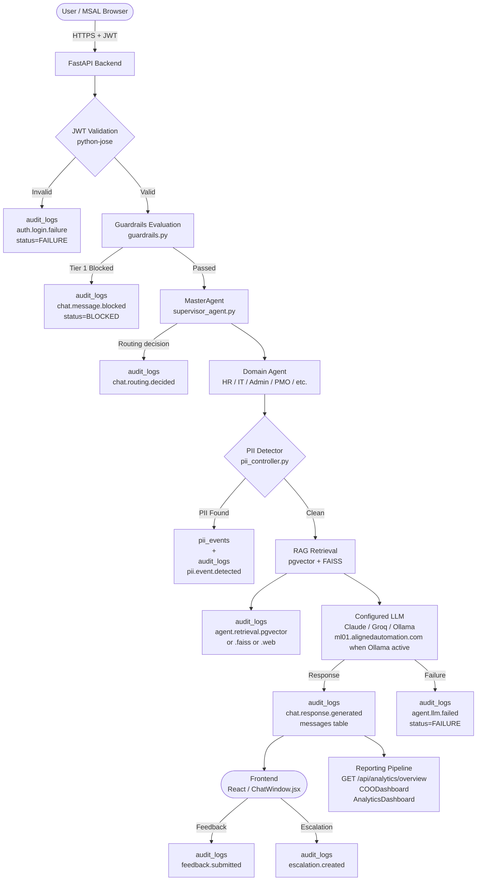

# Audit Framework Specification
# AA-Hackathon Enterprise Assistant — Aligned Automation
# Document Version: 1.0 | Classification: Internal — Restricted
# Owner: Platform Engineering Team | Effective Date: 2026-06-07

---

## Table of Contents

1. [Audit Framework Overview](#1-audit-framework-overview)
2. [Audit Log Schema](#2-audit-log-schema)
3. [Events That Must Be Audited](#3-events-that-must-be-audited)
4. [AI Interaction Audit Requirements](#4-ai-interaction-audit-requirements)
5. [Data Access Audit Requirements](#5-data-access-audit-requirements)
6. [Authentication Event Audit](#6-authentication-event-audit)
7. [PII Event Audit](#7-pii-event-audit)
8. [Escalation Audit](#8-escalation-audit)
9. [Feedback Audit](#9-feedback-audit)
10. [Audit Log Retention Policy](#10-audit-log-retention-policy)
11. [Audit Reporting Requirements](#11-audit-reporting-requirements)
12. [Audit Event Flow](#12-audit-event-flow)
13. [Compliance Alignment](#13-compliance-alignment)
14. [Future Audit Enhancements](#14-future-audit-enhancements)

---

## 1. Audit Framework Overview

### 1.1 Purpose

This document defines the audit framework for the AA-Hackathon Enterprise Assistant platform operated by Aligned Automation. It specifies which events must be recorded, the structure of audit records, retention obligations, reporting cadence, and alignment with GDPR and SOC2 requirements.

The audit framework serves four primary objectives:

- **Accountability**: Attribute every system action to an authenticated user or automated process, with sufficient detail to reconstruct what occurred and why.
- **Detectability**: Provide the data necessary to detect anomalous behavior, unauthorized access, policy violations, and AI misuse in near-real time.
- **Compliance**: Satisfy the evidentiary requirements of GDPR data-subject requests, SOC2 trust-service criteria, and internal HR policy audits.
- **Forensics**: Enable post-incident reconstruction of event sequences with timestamps, actor identities, and affected entity identifiers.

### 1.2 Scope

This framework applies to all layers of the platform:

- Backend API (FastAPI + Uvicorn, Python 3.11)
- All domain agents (HR, IT, Admin, PMO, Finance, Org, Employee, Attendance, Document, Email, Escalation, Quick, Funny)
- MasterAgent supervisor routing decisions
- RAG retrieval pipeline (pgvector + FAISS)
- SharePoint ingestion job
- Frontend interactions that trigger server-side state changes
- Azure AD authentication and token validation
- Zoho People database queries
- PII detection and redaction subsystem

### 1.3 Guiding Principles

- All audit records are append-only and must not be modified after creation.
- Audit writes must not block the primary request path; writes are asynchronous but guaranteed (at-least-once).
- Audit records must never contain raw PII content; references to pii_redactions and pii_events tables are used instead.
- Every audit record must carry a traceable user_id or a designated system actor identifier.

---

## 2. Audit Log Schema

### 2.1 Primary Table: audit_logs

The `audit_logs` table is the central ledger for all platform audit events. It resides in the `squadrons` PostgreSQL 16 database at `hackathon.alignedautomation.com:5432`.

```sql
CREATE TABLE audit_logs (
    id          UUID PRIMARY KEY DEFAULT gen_random_uuid(),
    user_id     UUID NOT NULL,          -- Azure AD object ID of the acting user
                                        -- or system actor sentinel UUID
    action      TEXT NOT NULL,          -- verb describing the event (see Section 3)
    entity_type TEXT NOT NULL,          -- logical resource class (see Section 3)
    entity_id   UUID,                   -- FK to the affected row; NULL for system events
    status      TEXT NOT NULL,          -- SUCCESS | FAILURE | PARTIAL | BLOCKED
    created_at  TIMESTAMPTZ NOT NULL DEFAULT now()
);

CREATE INDEX idx_audit_user_id     ON audit_logs (user_id);
CREATE INDEX idx_audit_action      ON audit_logs (action);
CREATE INDEX idx_audit_entity_type ON audit_logs (entity_type);
CREATE INDEX idx_audit_created_at  ON audit_logs (created_at DESC);
```

### 2.2 Column Definitions

| Column | Type | Nullable | Description |
|---|---|---|---|
| id | UUID | No | Unique audit record identifier |
| user_id | UUID | No | Azure AD object ID of the authenticated user; system events use a dedicated sentinel UUID |
| action | TEXT | No | Lowercase dot-notation verb: `chat.message.sent`, `auth.login.success` |
| entity_type | TEXT | No | Logical class of the affected resource: `conversation`, `message`, `document`, `escalation`, `feedback`, `user`, `chunk`, `pii_event` |
| entity_id | UUID | Yes | Primary key of the affected row; NULL when the event does not relate to a single row |
| status | TEXT | No | Outcome: `SUCCESS`, `FAILURE`, `PARTIAL`, `BLOCKED` |
| created_at | TIMESTAMPTZ | No | UTC timestamp of the event; set by the database default |

### 2.3 System Actor Sentinel

Automated processes (SharePoint ingestion job, scheduled embedding runs, guardrails evaluation) must record audit events using the sentinel UUID `00000000-0000-0000-0000-000000000001` as `user_id`. This sentinel must be documented in the platform secrets registry and must never correspond to an actual user account.

---

## 3. Events That Must Be Audited

All events below are mandatory. The `action` field uses dot-notation: `<domain>.<noun>.<verb>`.

### 3.1 Chat and Messaging Events

| Action | entity_type | Trigger |
|---|---|---|
| `chat.message.sent` | `message` | User submits a query via POST /api/chat or POST /api/chat/stream |
| `chat.message.streamed` | `message` | SSE stream initiated for a message |
| `chat.message.blocked` | `message` | Guardrails Tier 1 or Tier 2 blocked the message before agent processing |
| `chat.response.generated` | `message` | Agent produces and returns a response |
| `chat.response.failed` | `message` | Agent or LLM call fails to produce a response |
| `chat.routing.decided` | `conversation` | MasterAgent assigns a domain agent to handle the request |
| `chat.routing.fallback` | `conversation` | Routing fell back to keyword scoring after regex fast-paths found no match (there is no live LLM routing tier to time out — an `_route_llm()` method exists in code but is never called) |

### 3.2 Conversation Management Events

| Action | entity_type | Trigger |
|---|---|---|
| `conversation.created` | `conversation` | New conversation record inserted |
| `conversation.retrieved` | `conversation` | User fetches conversation history |
| `conversation.updated` | `conversation` | Title or metadata updated |
| `conversation.deleted` | `conversation` | Soft-delete applied (is_deleted = true) |

### 3.3 Document Events

| Action | entity_type | Trigger |
|---|---|---|
| `document.ingested` | `document` | SharePoint file processed and stored |
| `document.chunk.created` | `chunk` | Embedding stored in document_chunks |
| `document.chunk.deleted` | `chunk` | Chunk soft-deleted |
| `document.generated` | `document` | HR document generated via DocumentAgent |
| `document.retrieved` | `document` | Document listing fetched via GET /api/documents |
| `document.deleted` | `document` | Document soft-deleted |

### 3.4 Agent Routing and Processing Events

| Action | entity_type | Trigger |
|---|---|---|
| `agent.invoked` | `message` | A domain agent begins processing a request |
| `agent.retrieval.pgvector` | `message` | pgvector similarity search executed |
| `agent.retrieval.faiss` | `message` | FAISS fallback search executed |
| `agent.retrieval.web` | `message` | Tavily web search executed |
| `agent.llm.called` | `message` | LLM inference call initiated against the configured provider (Claude, Groq, or Ollama — selected by priority via env flags) |
| `agent.llm.failed` | `message` | LLM call timed out or returned an error |

---

## 4. AI Interaction Audit Requirements

### 4.1 Mandatory Fields for AI Interaction Records

Every `chat.message.sent` and `chat.response.generated` audit record must be supplemented in the `messages` table with the following metadata stored in the `sources` JSONB column:

- `agent_name`: the domain agent that handled the request (e.g., `HRAgent`, `ITAgent`)
- `routing_method`: one of `regex_fast_path`, `keyword_fallback` (a third value, `llm_routing`, is defined for the dead-code `_route_llm()` path but is never produced in the current build)
- `retrieval_sources`: array of source types used (`pgvector`, `faiss`, `web`, `memory`)
- `llm_model`: model identifier (`gpt-oss` when Ollama is the active provider; `claude-sonnet-4-6` or `llama3-70b-8192` when Claude or Groq is configured as the higher-priority provider)
- `llm_latency_ms`: elapsed time for the LLM call in milliseconds
- `guardrail_tier`: `none`, `tier1`, or `tier2` if a guardrail was evaluated
- `guardrail_outcome`: `passed`, `blocked`, or `redirected`

### 4.2 Token and Context Tracking

Each AI call must record the following in the audit supplemental data:

- Prompt token count (estimated from `num_ctx` = 2048 context window)
- Number of RAG chunks injected into context (top 3 at similarity >= 0.10)
- Whether user memory context was included

### 4.3 Guardrails Audit

When a guardrail evaluation is triggered:

- The `chat.message.blocked` action must be written to `audit_logs` with `status = BLOCKED`.
- The guardrail tier and rule category (jailbreak, harmful content, distress signal, scope violation) must be recorded.
- No raw user message content is stored in `audit_logs`; only the message UUID is referenced via `entity_id`.

### 4.4 MasterAgent Routing Audit

The MasterAgent supervisor must emit a `chat.routing.decided` audit entry for every request, recording:

- The selected domain agent
- The routing method used (regex fast-path or keyword-scoring fallback — the current build has no live LLM classification tier)

---

## 5. Data Access Audit Requirements

### 5.1 RAG Retrieval Logging

Every execution of the pgvector similarity search must produce an `agent.retrieval.pgvector` audit entry containing:

- The querying agent name
- Number of chunks returned
- Highest and lowest similarity scores in the returned set
- Whether the adaptive retry path was triggered (query simplification)

### 5.2 Zoho People Access Logging

Queries against the read-only Zoho People PostgreSQL database (employees, attendance, allocation tables) must produce an `agent.retrieval.zoho` audit entry containing:

- The querying agent (EmployeeAgent or AttendanceAgent)
- The query type (employee_lookup, attendance_summary, allocation_fetch)
- Number of rows returned
- No PII field values in the audit record; use row count only

### 5.3 SharePoint Access Logging

The SharePoint ingestion job must emit audit events for:

- Each file evaluated: `document.ingested` (NEW), `document.updated` (CHANGED), `document.skipped` (unchanged by hash), `document.deleted` (removed from SharePoint)
- Each embedding batch written to pgvector

### 5.4 Microsoft Graph API Access

Every call to the Microsoft Graph API must produce an audit entry recording the endpoint called, the HTTP method, and the status code returned. User profile fetches (GET /api/profile) must be audited with `entity_type = user`.

---

## 6. Authentication Event Audit

### 6.1 Required Authentication Events

| Action | Status Values | Trigger |
|---|---|---|
| `auth.login.success` | SUCCESS | Azure AD JWT validated successfully |
| `auth.login.failure` | FAILURE | JWT validation failed (invalid, expired, wrong tenant) |
| `auth.token.refreshed` | SUCCESS / FAILURE | MSAL token refresh attempted |
| `auth.session.expired` | FAILURE | Request rejected due to expired session |
| `auth.unauthorized` | BLOCKED | Request attempted without a valid token |

### 6.2 JWT Validation Details

The backend uses `python-jose` for Azure AD JWT validation. The following must be confirmed and recorded on each `auth.login.success` event (stored in the corresponding user session context, not in the audit record body):

- Azure tenant ID matches `AZURE_TENANT_ID`
- Token audience matches `AZURE_CLIENT_ID`
- Token is within its validity window

### 6.3 MSAL Frontend Events

Frontend Azure MSAL Browser 5.9.0 authentication events (login redirect, token acquisition, logout) are surfaced to the backend on the first authenticated API call. The backend must emit the corresponding audit record at that point.

### 6.4 Access Scope Audit

All requests must be validated against the configured MSAL scopes: `openid`, `profile`, `email`, `User.Read`. Any request presenting a token without the required scopes must be audited as `auth.unauthorized` with `status = BLOCKED`.

---

## 7. PII Event Audit

### 7.1 PII Tables

The platform maintains two dedicated PII tables:

```sql
-- pii_redactions: stores sanitized versions of content where PII was detected
-- pii_events: stores metadata about each PII detection occurrence

CREATE TABLE pii_events (
    id              UUID PRIMARY KEY DEFAULT gen_random_uuid(),
    user_id         UUID NOT NULL,
    message_id      UUID,
    pii_type        TEXT NOT NULL,   -- EMAIL, PHONE, AADHAAR, PAN, NAME, ADDRESS
    detection_method TEXT NOT NULL, -- regex, ner_model
    action_taken    TEXT NOT NULL,  -- redacted, flagged, blocked
    created_at      TIMESTAMPTZ NOT NULL DEFAULT now()
);
```

### 7.2 PII Detection Audit Requirements

Every PII detection event produced by `pii_controller.py` and `pii_service.py` must:

- Insert a record into `pii_events` with the PII type and action taken
- Insert a corresponding record into `audit_logs` with `action = pii.event.detected`, `entity_type = pii_event`, and `entity_id` pointing to the `pii_events` row
- Never store the actual PII value in either `audit_logs` or `pii_events`

### 7.3 PII Redaction Audit

When content is redacted before storage in the `messages` table:

- The original content must not be persisted anywhere
- A `pii.content.redacted` audit event must be emitted referencing the message UUID
- The `messages.content` column stores only the redacted version

### 7.4 PII Report Access Audit

Any access to `pii_events` or `pii_redactions` tables by an administrator must produce a `pii.report.accessed` audit entry.

---

## 8. Escalation Audit

### 8.1 Escalations Table Reference

```sql
-- escalations table fields relevant to audit:
-- id UUID, user_id UUID, escalation_type TEXT, subject TEXT,
-- priority TEXT, status TEXT, form_data JSONB,
-- created_at TIMESTAMPTZ, updated_at TIMESTAMPTZ, is_deleted BOOLEAN
```

### 8.2 Required Escalation Audit Events

| Action | Trigger |
|---|---|
| `escalation.created` | New escalation submitted via EscalationAgent or POST /api/escalations |
| `escalation.status.updated` | Status field changes (open → in_progress → resolved → closed) |
| `escalation.retrieved` | Escalation record fetched by user or admin |
| `escalation.deleted` | Soft-delete applied |
| `escalation.form.submitted` | form_data JSONB payload captured from EscalationDrawer |

### 8.3 Priority and Type Tracking

The `audit_logs` record for escalation events must capture the `escalation_type` and `priority` values as supplemental context. These values must not contain sensitive content; the full `form_data` remains only in the `escalations` table and is not replicated to `audit_logs`.

### 8.4 Escalation SLA Monitoring

Audit records for `escalation.created` and `escalation.status.updated` provide the data required to compute SLA adherence (time from creation to first status change, time to resolution). Audit reporting queries must include escalation SLA metrics (see Section 11).

---

## 9. Feedback Audit

### 9.1 Feedback Table Reference

```sql
-- feedback table fields relevant to audit:
-- id UUID, message_id UUID, user_id UUID,
-- rating INT CHECK (rating IN (-1, 0, 1)),
-- comment TEXT, created_at TIMESTAMPTZ, is_deleted BOOLEAN
```

### 9.2 Required Feedback Audit Events

| Action | Trigger |
|---|---|
| `feedback.submitted` | User submits a thumbs-up (+1), neutral (0), or thumbs-down (-1) rating |
| `feedback.updated` | Existing feedback record modified |
| `feedback.retrieved` | Feedback report accessed by an admin |
| `feedback.deleted` | Soft-delete applied |

### 9.3 Feedback Integrity

Feedback records must be audited even when the `comment` field is NULL. The rating value (-1, 0, 1) must be included as supplemental context in the audit record to enable quality tracking without requiring a join to the `feedback` table in standard reports.

### 9.4 Feedback-Driven Quality Signals

The audit framework captures feedback events so that quality-monitoring dashboards (COODashboard, AnalyticsDashboard) can surface response quality trends. Negative feedback events (`rating = -1`) must be flagged in the audit reporting pipeline for human review within 24 hours.

---

## 10. Audit Log Retention Policy

### 10.1 Retention Tiers

| Event Category | Retention Period | Rationale |
|---|---|---|
| Authentication events | 12 months | SOC2 CC6 access control evidence |
| AI interaction events | 12 months | AI governance accountability |
| PII detection events | 24 months | GDPR Article 30 processing records |
| Escalation events | 36 months | HR legal hold requirements |
| Feedback events | 12 months | Quality improvement baseline |
| Document ingestion events | 24 months | Data lineage traceability |
| General data access events | 12 months | Security incident investigation |

### 10.2 Archival Process

Records exceeding their hot-storage retention period must be archived to cold storage (compressed JSONL format) before deletion from the `audit_logs` table. Archival must itself be audited with a `audit.archive.completed` event.

### 10.3 Deletion Prohibition

Audit records must never be hard-deleted from the `audit_logs` table during their retention period. After the retention period expires, batch deletion is performed by a scheduled job that records a `audit.records.purged` system audit event with a count of deleted records and the date range covered.

### 10.4 Legal Hold

When an HR escalation or security incident triggers a legal hold, all audit records associated with the affected `user_id` or `entity_id` range must be flagged and exempted from scheduled purge jobs until the hold is lifted by the Legal or Compliance team.

---

## 11. Audit Reporting Requirements

### 11.1 Standard Reports

The following reports must be available to authorized roles (Admin, Compliance, COO) via the analytics API:

| Report | Frequency | Audience | Data Source |
|---|---|---|---|
| Daily Active Users | Daily | Admin, COO | audit_logs (auth.login.success, chat.message.sent) |
| AI Interaction Volume | Daily / Weekly | Admin, AI Platform | audit_logs (chat.message.sent, chat.response.generated) |
| Guardrail Trigger Summary | Weekly | AI Governance | audit_logs (chat.message.blocked) |
| PII Detection Report | Monthly | Compliance, DPO | pii_events joined to audit_logs |
| Escalation SLA Report | Weekly | HR Admin, COO | audit_logs (escalation.created, escalation.status.updated) |
| Failed Authentication Summary | Daily | IT Security | audit_logs (auth.login.failure, auth.unauthorized) |
| Document Ingestion Status | Weekly | Admin | audit_logs (document.ingested, document.deleted) |
| Feedback Quality Trends | Weekly | AI Platform, COO | audit_logs (feedback.submitted) + feedback.rating |
| Agent Routing Distribution | Weekly | AI Platform | audit_logs (chat.routing.decided) |

### 11.2 API Endpoints for Audit Data

The analytics overview endpoint `GET /api/analytics/overview` must draw on audit_logs for:

- Total message count, unique user count, active conversation count
- Per-agent request distribution
- Guardrail trigger counts by tier
- Negative feedback rate (rating = -1 / total feedback)

### 11.3 COO Dashboard Metrics

The `COODashboard` must expose the following audit-derived metrics:

- Week-over-week AI interaction growth
- Mean response latency trend (sourced from `llm_latency_ms` in message metadata)
- Escalation resolution rate and average time-to-resolution
- PII detection incident count per month

### 11.4 Anomaly Detection Thresholds

The reporting pipeline must flag the following conditions for immediate review:

- More than 50 `auth.login.failure` events from the same IP within 10 minutes
- More than 10 `chat.message.blocked` (Tier 1 jailbreak) events from the same user_id within one hour
- Any `pii.content.redacted` event outside of business hours (outside 06:00–22:00 IST)
- Any admin-role access to `pii_events` without a corresponding escalation or audit-request record

---

## 12. Audit Event Flow

The following diagram describes the end-to-end flow of an audit event from user action to stored record.



---

## 13. Compliance Alignment

### 13.1 GDPR Considerations

The audit framework is designed to support the following GDPR obligations applicable to Aligned Automation's EU-accessible employee data:

| GDPR Article | Obligation | Platform Implementation |
|---|---|---|
| Article 5(1)(f) | Integrity and confidentiality | Audit logs are append-only; PII never stored in audit records |
| Article 13/14 | Transparency | Employees informed that interactions are logged via platform privacy notice |
| Article 17 | Right to erasure | Soft-delete on conversations and messages; audit records retained per legal basis in Article 17(3) |
| Article 30 | Records of processing activities | pii_events and audit_logs satisfy Article 30 record-keeping requirements |
| Article 32 | Security of processing | audit_logs indexed and access-controlled; accessed only by authorized roles |
| Article 33 | Breach notification | Failed auth and PII anomaly thresholds (Section 11.4) support 72-hour breach notification |

The Data Protection Officer (DPO) role must have read-only access to `pii_events` and to audit log reports. Any DPO access must itself be audited as `pii.report.accessed`.

### 13.2 SOC2 Trust Service Criteria Alignment

| SOC2 Criterion | Requirement | Audit Framework Support |
|---|---|---|
| CC6.1 — Logical access | Restrict access to authorized users | auth.login.* events; JWT validation audit trail |
| CC6.2 — Access provisioning | Control user registration | Azure AD–managed; audit records on first login |
| CC6.3 — Access removal | Revoke access promptly | Token expiry audited; auth.session.expired events |
| CC7.2 — System monitoring | Monitor for anomalies | Anomaly thresholds defined in Section 11.4 |
| CC7.3 — Incident response | Evaluate and respond to incidents | Audit logs provide forensic reconstruction capability |
| CC9.2 — Vendor risk | Monitor third-party components | SharePoint, Zoho, Tavily, Ollama access all audited |
| A1.2 — Availability monitoring | Track system availability | agent.llm.failed and auth.login.failure rates |

### 13.3 Internal HR Policy Compliance

Escalation records retained for 36 months satisfy Aligned Automation's internal HR records policy. Feedback and AI interaction records support quality assurance obligations under the AI Governance framework (see `01-governance/ai-governance.md`).

### 13.4 Cross-Document Alignment

This audit framework is the authoritative specification for the `audit_logs` table. The following documents reference and depend on this framework:

- `01-governance/ai-governance.md` — Section 10 (Audit and Logging Requirements)
- `06-data/` — data governance and schema specifications
- `08-operations/` — operational runbooks for audit log maintenance

---

## 14. Future Audit Enhancements

### 14.1 Real-Time Audit Stream

Current implementation: audit writes are synchronous database inserts within the request lifecycle. Future enhancement: publish audit events to a message queue (e.g., Azure Service Bus or Kafka) to decouple audit persistence from the request path, enabling:

- Sub-millisecond audit write latency impact on API responses
- Real-time SIEM integration without database polling
- At-least-once delivery guarantees even during database maintenance windows

### 14.2 Structured Audit Event Schema (CloudEvents)

Migrate audit action strings from free-text dot-notation to a versioned CloudEvents 1.0 envelope. This enables:

- Schema validation at write time
- Forward-compatible event consumers
- Integration with Azure Event Grid for compliance dashboard streaming

### 14.3 Immutable Audit Storage

Evaluate append-only storage backends (e.g., Azure Immutable Blob Storage, Amazon QLDB) for long-retention audit records to provide cryptographic tamper evidence, replacing the current policy-based append-only guarantee.

### 14.4 Automated Compliance Reports

Build a scheduled reporting job that generates GDPR Article 30 records-of-processing reports and SOC2 evidence packages from `audit_logs` and `pii_events` on a monthly cadence, reducing manual compliance effort during audits.

### 14.5 Per-Agent Audit Dashboards

Extend the AnalyticsDashboard to include per-agent audit panels showing request volume, failure rates, retrieval source distribution, and guardrail trigger frequency for each of the 13 domain agents. This data is already captured in `audit_logs`; only the frontend visualization layer is required.

### 14.6 Audit Log Integrity Verification

Introduce a periodic hash-chain verification job that computes a rolling hash over sequential `audit_logs` rows ordered by `created_at` and stores checkpoint hashes in a separate integrity table. This detects unauthorized row deletions or modifications without requiring immutable storage.

### 14.7 Fine-Grained RBAC on Audit Access

Current access control allows any admin-role user to query audit reports. Future enhancement: introduce audit-specific RBAC roles (AuditViewer, ComplianceOfficer, SecurityAnalyst) with scoped access to event categories, preventing cross-functional data exposure during routine operations.

---

*Document maintained by the Platform Engineering Team at Aligned Automation. Review cycle: quarterly or upon any change to the audit_logs schema, PII subsystem, or authentication configuration. Next scheduled review: 2026-09-07.*
