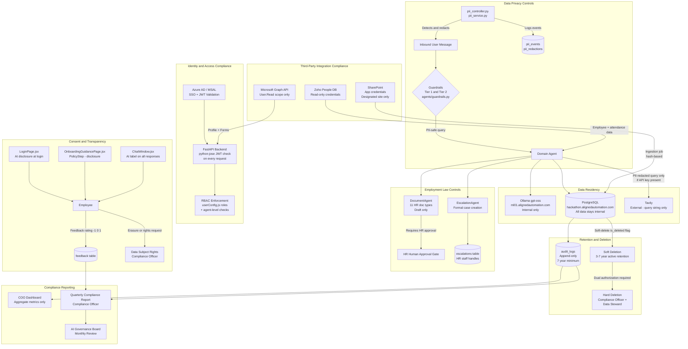

# Compliance Specification
# AA-Hackathon Enterprise Assistant — Aligned Automation
# Document Version: 1.0 | Classification: Internal — Restricted
# Owner: Compliance Officer | Effective Date: 2026-06-07

---

## Table of Contents

1. [Compliance Overview](#1-compliance-overview)
2. [Data Privacy Compliance](#2-data-privacy-compliance)
3. [AI Ethics Compliance](#3-ai-ethics-compliance)
4. [Employment Law Compliance](#4-employment-law-compliance)
5. [IT Security Compliance](#5-it-security-compliance)
6. [Data Residency Requirements](#6-data-residency-requirements)
7. [Retention and Deletion Requirements](#7-retention-and-deletion-requirements)
8. [Consent Management](#8-consent-management)
9. [Third-Party Integration Compliance](#9-third-party-integration-compliance)
10. [Compliance Framework Diagram](#10-compliance-framework-diagram)
11. [Compliance Testing Requirements](#11-compliance-testing-requirements)
12. [Compliance Reporting](#12-compliance-reporting)
13. [Regulatory Change Management](#13-regulatory-change-management)

---

## 1. Compliance Overview

### 1.1 Purpose

This document defines the compliance framework for the AA-Hackathon Enterprise Assistant deployed at Aligned Automation. It establishes the binding requirements, controls, and verification processes that ensure the platform operates within the boundaries of applicable data protection principles, employment law obligations, IT security standards, and organizational policy.

The compliance framework is a companion document to the AI Governance Specification (GOV-AI-001). While the governance document defines how the AI system is controlled and overseen, this document defines what the system must comply with — the external and internal obligations that constrain its design, data handling, integrations, and outputs.

### 1.2 Scope

This compliance specification applies to all components of the Enterprise Assistant platform:

| Component | Compliance Scope |
|---|---|
| FastAPI backend (Python 3.11) | API security, authentication, PII handling |
| PostgreSQL 16 + pgvector | Data residency, retention, encryption at rest |
| Ollama LLM (gpt-oss) | AI ethics, data privacy, no external data egress |
| React 18 frontend (Vite 5.4.0) | Consent presentation, MSAL authentication, RBAC enforcement |
| SharePoint ingestion job | Document classification, hash-based change detection |
| Zoho People integration | Employee data privacy, read-only access, PII controls |
| Azure AD / Microsoft Graph API | Identity compliance, least-privilege permissions |
| Tavily web search (optional) | PII redaction before query forwarding |

### 1.3 Compliance Owners

| Domain | Compliance Owner | Escalation |
|---|---|---|
| Data Privacy | Compliance Officer | AI Governance Owner |
| AI Ethics | AI Platform Lead | AI Governance Owner |
| Employment Law | HR Director | Head of Technology |
| IT Security | IT Security Lead | AI Governance Owner |
| Third-Party Integrations | IT Security Lead | AI Governance Owner |
| Regulatory Change | Compliance Officer | AI Governance Owner |

### 1.4 Compliance Hierarchy

Compliance obligations are prioritized in the following order when conflicts arise:

1. Applicable statutory and regulatory obligations (labor law, data protection legislation applicable in the organization's jurisdiction)
2. Organizational HR and data policy
3. This compliance specification
4. Individual agent and module-level controls

No lower-tier control may override a higher-tier obligation. Any conflict identified between organizational policy and this specification must be escalated to the Compliance Officer and AI Governance Owner for resolution.

---

## 2. Data Privacy Compliance

### 2.1 Principles

The platform is designed and operated in alignment with the following data privacy principles, consistent with internationally recognized standards (including GDPR concepts applicable to organizations handling employee personal data regardless of jurisdiction):

| Principle | How Applied |
|---|---|
| Lawfulness and transparency | Employees are informed at login and during onboarding (PolicyStep) that their interactions are processed by an AI system |
| Purpose limitation | Employee data from Zoho People is used solely for self-service directory and attendance queries; it is not used for analytics, profiling, or AI training |
| Data minimization | The platform retrieves only the data necessary to answer a specific query; no bulk employee data is loaded into context |
| Accuracy | SharePoint ingestion uses hash-based change detection to ensure stale documents are flagged; HR is responsible for maintaining source document accuracy |
| Storage limitation | Defined retention periods are enforced per section 7; soft-deletion is the standard mechanism; hard deletion requires dual authorization |
| Integrity and confidentiality | Data in transit uses TLS; data at rest in PostgreSQL is protected by infrastructure-level controls; PII detection and redaction controls are applied |
| Accountability | The Compliance Officer owns this document; audit_logs table provides an append-only record of all significant platform actions |

### 2.2 Personal Data Categories Processed

| Data Category | Source | Legal Basis | Retention |
|---|---|---|---|
| Employee identity (name, email, employee ID) | Azure AD, Zoho People | Employment contract / legitimate interest | Duration of employment + 7 years |
| Attendance records (clock-in/out, monthly summary) | Zoho People DB (read-only) | Employment contract | Duration of employment + 7 years |
| Chat messages and conversation history | User-generated via chat interface | Legitimate interest (service provision) | 3 years active; 7 years archived |
| Escalation form data (subject, details, priority) | EscalationAgent / EscalationDrawer.jsx | Legitimate interest (HR case management) | Duration of employment + 7 years |
| Feedback ratings and comments | User-submitted via feedback mechanism | Legitimate interest (service improvement) | 3 years |
| Audit log entries | System-generated | Legal obligation / legitimate interest | 7 years minimum |
| PII events and redactions | System-generated by pii_controller.py | Legal obligation | 7 years minimum |
| Document generation requests (document type, recipient) | DocumentAgent | Employment contract | Duration of employment + 7 years |

### 2.3 PII Detection and Redaction Controls

The platform implements a multi-layer PII control architecture:

- **pii_controller.py** orchestrates PII detection across the message processing pipeline.
- **pii_service.py** implements pattern-based and model-assisted PII identification (names, email addresses, national IDs, phone numbers, financial identifiers).
- Detected PII in user-submitted messages is flagged in the **pii_events** table before persistence.
- Redacted versions of content are recorded in the **pii_redactions** table.
- PII detected in query strings intended for Tavily web search is redacted before the query is forwarded to the external service.
- The EmployeeAgent enforces that an employee can only retrieve their own records via the Zoho People read-only PostgreSQL connection; manager-level access requires the appropriate RBAC role as defined in userConfig.js.

### 2.4 Data Subject Rights

Employees have the following rights with respect to their personal data processed by the platform:

| Right | Mechanism | Owner |
|---|---|---|
| Right of access | Employee can view their own conversation history via the chat interface | Platform (self-service) |
| Right to erasure | Employee submits erasure request to HR; HR Director + Compliance Officer authorize hard deletion of messages, escalations, and feedback records | Compliance Officer |
| Right to explanation | Source citations accompany every grounded AI response; employees can request explanation of how a response was produced | Platform Lead + HR |
| Right to object | Employee can opt out of AI-assisted responses via escalation to human staff at any time | EscalationAgent / HR |
| Right to rectification | Employees can report inaccurate information via the feedback mechanism or direct escalation | Domain Owner + HR |

All data subject rights requests must be logged in the audit_logs table under action DSR_REQUEST and tracked to closure by the Compliance Officer.

### 2.5 GDPR-Aligned Considerations

While the organization's specific jurisdictional obligations vary, the platform is designed to satisfy GDPR-equivalent standards as a baseline:

- No personal data is transferred to external LLM providers; gpt-oss runs entirely on the self-hosted Ollama instance at ml01.alignedautomation.com.
- Pseudonymization is applied in analytics aggregations: the COO Dashboard and Analytics Dashboard present aggregate counts and do not expose individual user interactions.
- A Data Protection Impact Assessment (DPIA) equivalent review is required before any new integration that processes employee personal data is added to the platform.
- Breach notification: if a data breach involving employee personal data is detected, the Compliance Officer and AI Governance Owner are notified within 24 hours and remediation begins within 72 hours.

---

## 3. AI Ethics Compliance

### 3.1 Ethical Use Boundaries

The platform is subject to the following hard ethical constraints. These are non-negotiable and cannot be overridden by configuration, prompt change, or user request:

| Prohibited Use | Enforcement Mechanism |
|---|---|
| Employee performance evaluation or scoring | Tier 2 guardrail in agents/guardrails.py rejects in-scope queries; no agent prompt permits this |
| Hiring, promotion, or termination recommendations | Explicitly out of scope for all domain agents; Tier 2 guardrail redirects |
| Discriminatory filtering of employee data | EmployeeAgent returns directory data without ranking or scoring employees |
| Covert AI operation | Employees are informed at login and in the onboarding PolicyStep that the assistant is an AI system |
| Auto-execution of consequential actions | Email sending, escalation submission, and document finalization all require explicit user confirmation |
| Training on employee data | The self-hosted gpt-oss model is not retrained using organizational or employee data |

### 3.2 Transparency Requirements

- Every AI-generated response in the ChatWindow.jsx must display a visual indicator identifying it as AI-generated.
- Responses grounded in retrieved documents must include source citations (sourced from messages.sources JSONB).
- When the system cannot confidently answer a query (low similarity scores or empty retrieval), the agent must acknowledge uncertainty rather than fabricating an answer.
- The EscalationAgent must clearly inform users when they are being routed to a human-handled process.

### 3.3 Fairness Monitoring

The platform conducts quarterly bias reviews as defined in the AI Governance Specification (GOV-AI-001, Section 7). Compliance obligations specific to fairness include:

- No AI output may treat an employee differently on the basis of protected characteristics (gender, age, religion, disability, nationality, or any characteristic protected under applicable employment law).
- The feedback mechanism (rating [-1, 0, 1] plus comment) provides an ongoing fairness signal. Patterns of negative feedback correlated with specific query types or user groups are investigated by the Platform Lead.
- Document templates maintained by DocumentAgent (11 HR document types) are reviewed by HR for gendered or exclusionary language on a semi-annual basis.

### 3.4 Human Oversight Obligation

The platform does not operate autonomously on consequential HR decisions. The following human oversight gates are mandatory:

| Action | Human Gate Required |
|---|---|
| HR document issuance (offer, experience, relieving, promotion letters) | HR team approval before document is finalized and issued |
| Escalation submission | Employee explicit confirmation in EscalationDrawer.jsx |
| Email dispatch | Employee explicit send action in EmailAgentPage.jsx |
| Microsoft Forms creation | Employee review and confirmation in FormsDrawer.jsx |

The EscalationAgent provides a pathway to human staff whenever the AI cannot resolve a request, the user is in distress, or the query falls outside scope.

---

## 4. Employment Law Compliance

### 4.1 Applicable Domain

The HR, Finance, and Org agents interact with employment law-sensitive content: leave entitlements, payroll, benefits, tax deductions, and employment documentation. The following controls ensure these interactions remain compliant.

### 4.2 Leave and Attendance Compliance

| Requirement | Control |
|---|---|
| Accurate leave balance information | HRAgent retrieves leave policy from pgvector-indexed SharePoint documents; balances are sourced from Zoho People read-only DB |
| No unauthorized modification of attendance records | AttendanceAgent is read-only; clock-in/out data is presented, not modified, by the platform |
| Confidentiality of attendance data | AttendanceAgent enforces that employees can only view their own attendance unless the requesting user holds an authorized HR or manager RBAC role |
| Compliance with statutory leave entitlements | HR is responsible for maintaining accurate leave policy documents in SharePoint; the ingestion pipeline ensures the knowledge base reflects current policy |

### 4.3 Payroll and Benefits Compliance

| Requirement | Control |
|---|---|
| Payroll information confidentiality | Payroll data is not stored in the platform database; HRAgent retrieves general policy information only; individual salary data is not accessible via chat |
| Tax information accuracy | FinanceAgent responses on TDS, tax, and Form 16 carry an explicit disclaimer directing employees to the authoritative payroll system or HR |
| Benefits eligibility accuracy | HRAgent retrieves benefits information from SharePoint-indexed policy documents; HR is responsible for document accuracy |
| No AI determination of payroll outcomes | The platform does not calculate, approve, or modify payroll; all such actions require human HR or Finance team intervention |

### 4.4 Employment Documentation Compliance

The DocumentAgent generates 11 HR document types. Compliance requirements for each:

| Document Type | Compliance Requirement |
|---|---|
| Offer Letter | HR approval required before issuance; template must reflect current compensation and role as confirmed by HR |
| Experience Letter | HR approval required; must accurately reflect dates of service from Zoho People records |
| Relieving Letter | HR approval required; must confirm last working date and clearance status |
| Promotion Letter | HR and manager approval required; compensation details must be confirmed by HR |
| Internship Certificate | HR approval required; must reflect actual internship period |
| Confirmation Letter | HR approval required; must align with probation completion records |
| NOC Certificate | HR approval required; must not conflict with active employment obligations |
| Bonafide Certificate | HR approval required |
| Address Proof | HR approval required; must reflect current address from employee records |
| Loan Proof / Employment Verification | HR approval required; must accurately state employment status |
| ID Card Request | Admin approval required |

All generated documents are AI-assisted drafts only. No document is issued without the human approval gate specified above.

### 4.5 Grievance and Escalation Compliance

The EscalationAgent facilitates formal grievance and support escalations. The platform ensures:

- All escalations are recorded in the escalations table with escalation_type, subject, priority, status, and form_data JSONB.
- Escalation records are retained for the duration of employment plus 7 years (see Section 7).
- Employees are not compelled to use the AI assistant to submit grievances; direct HR contact remains available at all times.
- The platform does not use escalation data for performance evaluation or any purpose outside case resolution.

---

## 5. IT Security Compliance

### 5.1 Authentication and Authorization

| Control | Implementation |
|---|---|
| Identity verification | Azure AD SSO via MSAL Browser 5.9.0; JWT tokens validated on every API request using python-jose |
| Least-privilege access | Token scopes limited to openid, profile, email, User.Read; no write scopes granted |
| Role-based access control | RBAC roles and permissions defined in userConfig.js; enforced at the API layer and in agent logic |
| Session management | Azure AD token expiry governs session lifetime; MSAL handles token refresh |
| API route protection | All routes (POST /api/chat, GET /api/conversations, etc.) require a valid Azure AD JWT |

### 5.2 Data in Transit

- All communication between the React frontend and the FastAPI backend must occur over TLS (HTTPS).
- Communication between the backend and the Ollama inference server (ml01.alignedautomation.com:11434) must occur over an internal network segment; this endpoint must not be exposed to the public internet.
- Communication between the backend and the PostgreSQL database (hackathon.alignedautomation.com:5432) must occur over the internal network; SSL mode must be enabled on the PostgreSQL connection.
- Communication between the backend and the Zoho People read-only PostgreSQL instance must use SSL.

### 5.3 Data at Rest

- The PostgreSQL 16 database on hackathon.alignedautomation.com must have filesystem-level encryption enabled on the host.
- The pgvector extension stores 384-dimensional embeddings in the document_chunks table; these vectors do not contain raw PII but are subject to the same access controls as the documents they represent.
- Database credentials (SQL_HOST, SQL_PORT, SQL_DB, ZOHO_DB_*) must be stored as environment variables and never committed to the application source repository.

### 5.4 Vulnerability Management

| Requirement | Cadence | Owner |
|---|---|---|
| Python dependency audit (pip audit or equivalent) | Monthly | IT Security Lead |
| Node.js dependency audit (npm audit) | Monthly | IT Security Lead |
| Docker image base layer update | Quarterly or on CVE disclosure | Platform Lead |
| PostgreSQL version patching | Per vendor advisory | IT Infrastructure |
| Ollama host OS patching | Monthly | IT Infrastructure |
| Penetration testing of API endpoints | Annually | IT Security Lead (external engagement) |

### 5.5 Secrets Management

| Secret | Storage Requirement |
|---|---|
| AZURE_TENANT_ID, AZURE_CLIENT_ID | Environment variable; not in source code |
| SHAREPOINT_CLIENT_SECRET | Environment variable; not in source code; rotated annually |
| SQL_HOST, SQL_PORT, SQL_DB credentials | Environment variable; not in source code |
| ZOHO_DB_USER, ZOHO_DB_PWD | Environment variable; read-only credentials; rotated annually |
| OLLAMA_BASE_URL | Environment variable; internal network URL only |
| Tavily API key (if present) | Environment variable; not in source code |

Secret rotation is the responsibility of the IT Security Lead. Rotation events must be logged in the audit_logs table under action SECRET_ROTATED.

### 5.6 Container and Infrastructure Security

- Docker and Docker Compose are used for deployment. Container images must be sourced from trusted registries and pinned to specific digest versions.
- The pgvector/pgvector:pg16 image must be updated when security patches are released.
- The Ollama container and the ml01.alignedautomation.com host must be isolated from direct internet access; outbound connections from the inference host require IT Security approval.
- The connection pool (ThreadedConnectionPool, min=1, max=8) is bounded; pool exhaustion handling must not expose error details containing connection strings to end users.

---

## 6. Data Residency Requirements

### 6.1 Residency Commitments

All personal data, organizational knowledge, and AI-generated content processed by the Enterprise Assistant must remain within Aligned Automation's controlled infrastructure. No personal data may be processed by external cloud AI providers.

| Data Type | Permitted Storage Location | Prohibited Locations |
|---|---|---|
| Employee personal data (Zoho People) | Internal PostgreSQL (ZOHO_DB_HOST) | Any external cloud service |
| Chat messages and conversation history | hackathon.alignedautomation.com (PostgreSQL, database: squadrons) | Any external cloud service |
| Document embeddings (pgvector) | hackathon.alignedautomation.com | Any external cloud service |
| LLM inference (query + context) | ml01.alignedautomation.com (Ollama, self-hosted) | OpenAI, Anthropic, Google, or any external LLM API |
| Audit logs | hackathon.alignedautomation.com | Any external cloud service |
| FAISS local vector store | Application host filesystem | Any external cloud service |

### 6.2 Tavily Web Search Exception

Tavily web search, when enabled via API key, sends the query string to the Tavily API. This constitutes a controlled external data transfer subject to the following constraints:

- Only the sanitized query string is transmitted; no employee identity, conversation context, or organizational document content is included.
- PII redaction (pii_controller.py) must be applied to the query before forwarding to Tavily.
- If PII redaction cannot be confirmed, the Tavily call must be suppressed and the response generated from internal sources only.
- The Tavily API key must be treated as a secret per Section 5.5.
- Use of Tavily is disabled by default; explicit configuration is required to enable it.

### 6.3 Azure AD and Microsoft Graph Exception

Azure AD authentication and Microsoft Graph API calls (user profile retrieval, Forms creation) involve data exchange with Microsoft's cloud services. This is permitted subject to:

- The organization's existing Microsoft enterprise agreement governs data processing terms.
- Token scopes are limited to the minimum required (openid, profile, email, User.Read).
- Graph API calls retrieve data to serve the requesting user's own session; aggregate or bulk employee data is not retrieved via Graph.
- The SharePoint application credentials (SHAREPOINT_CLIENT_ID, SHAREPOINT_CLIENT_SECRET) are scoped to read-only document access on the designated SharePoint site path only.

### 6.4 Residency Verification

The IT Security Lead verifies data residency compliance quarterly by reviewing:

- Network egress logs from the ml01.alignedautomation.com host to confirm no LLM inference traffic exits to external providers.
- Application configuration to confirm OLLAMA_BASE_URL points to the internal host.
- Tavily integration status (enabled/disabled) and redaction pipeline test results.

---

## 7. Retention and Deletion Requirements

### 7.1 Retention Schedule

| Data Entity | Table | Active Retention | Archive Retention | Total |
|---|---|---|---|---|
| Conversations | conversations | 3 years (active use) | 4 years (archived) | 7 years |
| Messages | messages | 3 years (active use) | 4 years (archived) | 7 years |
| Feedback | feedback | 3 years | — | 3 years |
| Escalations | escalations | Duration of employment + active status | 7 years from closure | 7 years min |
| Audit logs | audit_logs | Indefinite (append-only) | 7 years minimum | 7 years min |
| Documents (metadata) | documents | While document is active in SharePoint | 7 years post-deletion | 7 years min |
| Document chunks | document_chunks | While source document is active | Deleted when document is hard-deleted | — |
| PII events | pii_events | 7 years | — | 7 years |
| PII redactions | pii_redactions | 7 years | — | 7 years |
| Employee data (Zoho) | Zoho People DB (read-only access) | Duration of employment | 7 years post-termination | Managed by Zoho admin |

### 7.2 Deletion Mechanisms

**Soft Deletion (Standard):** Records in conversations, messages, feedback, escalations, and documents tables use the is_deleted boolean flag. Soft-deleted records are excluded from application queries but remain in the database and are visible in audit and compliance reviews.

**Hard Deletion (Restricted):** Permanent removal of a record requires:
1. Written request from the Compliance Officer (for data subject rights requests) or the AI Governance Owner (for operational reasons).
2. Confirmation from the Data Steward (for document records) or HR Director (for employee-related records).
3. The deletion event must be logged in audit_logs under action HARD_DELETE_EXECUTED before the record is removed.
4. Hard deletion of audit_logs records is prohibited except under explicit legal instruction received in writing.

**Document Chunk Cleanup:** When a source document is marked DELETED by the SharePoint ingestion job (hash-based detection), the corresponding document_chunks records are soft-deleted. Hard deletion of orphaned chunks occurs quarterly during the database maintenance window, authorized by the Platform Lead.

### 7.3 Data Minimization on Retrieval

The RAG retrieval pipeline (rag/retriever.py) enforces data minimization at query time:

- A maximum of 3 chunks (top_k=3) are returned per retrieval call.
- Only chunks with similarity score >= 0.10 are included.
- Retrieved chunks are used solely for context in the current query and are not persisted to the messages table (only the final AI response and source metadata are persisted).

---

## 8. Consent Management

### 8.1 Employee Consent Basis

The platform processes employee personal data under the legal basis of legitimate interest (service provision for employment-related self-service) and employment contract. Explicit consent is not the primary legal basis; however, transparency is provided through mandatory disclosure.

### 8.2 Disclosure Mechanisms

Employees are informed of AI system use at the following touchpoints:

| Touchpoint | Location | Content |
|---|---|---|
| Login screen | LoginPage.jsx | Statement that the Enterprise Assistant is an AI system operated by Aligned Automation |
| Onboarding flow — PolicyStep | OnboardingGuidancePage.jsx (step 6 of 8) | Explanation of how the AI assistant works, what data it processes, and how to escalate to humans |
| Chat interface | ChatWindow.jsx | AI-generated label on all assistant messages |
| Document generation | DocumentsPage.jsx | Statement that documents are AI-assisted drafts requiring HR approval |
| Escalation form | EscalationDrawer.jsx | Confirmation that the escalation will be handled by human HR or Admin staff |

### 8.3 Opt-Out Right

Employees are not compelled to use the AI assistant. All functions served by the assistant (HR queries, IT support, admin requests, document requests) remain available through direct human contact with the relevant department. The EscalationAgent facilitates transfer to human staff at any point in the conversation.

Employees who wish to have their historical conversation data deleted may submit a data subject erasure request per Section 2.4.

### 8.4 Analytics Data Consent

The Analytics Dashboard and COO Dashboard display aggregated, pseudonymized metrics derived from platform usage. Individual user interactions are not exposed in these dashboards. No additional consent is required for this aggregated use, as it falls within the legitimate interest of monitoring and improving an organizational service.

### 8.5 Consent Records

All onboarding completions (AllSetStep reached in OnboardingGuidancePage.jsx) are recorded as evidence that the employee has been presented with the disclosure. This record is maintained in the audit_logs table under action ONBOARDING_COMPLETED.

---

## 9. Third-Party Integration Compliance

### 9.1 Integration Inventory

| Integration | Purpose | Data Shared | Access Model | Risk Tier |
|---|---|---|---|---|
| Azure AD / MSAL | SSO, JWT authentication | User identity tokens | Read-only, scoped tokens | Low |
| Microsoft Graph API | User profile, Forms creation | User profile (name, email), form definitions | App credentials, least-privilege | Low |
| SharePoint | Document ingestion | Document content (PDF, DOCX, XLSX, PPTX) | App credentials, designated site path only | Medium |
| Zoho People DB | Employee directory, attendance | Employee records, attendance logs | Read-only PostgreSQL credentials | High |
| Ollama (ml01.alignedautomation.com) | LLM inference | Query + context (no raw PII after redaction) | Internal network only | Low |
| HuggingFace Transformers | Embedding model | Model weights downloaded at deployment only | No runtime egress | Low |
| FAISS | Local vector fallback | Document embeddings | In-process, no network | Low |
| Tavily | Optional web search | Sanitized query string | API key, PII-redacted queries only | Medium |

### 9.2 SharePoint Integration Compliance

- Access is granted via Azure AD app credentials (SHAREPOINT_CLIENT_ID, SHAREPOINT_CLIENT_SECRET) scoped to the designated SHAREPOINT_SITE_PATH only.
- The ingestion job processes PDF, DOCX, XLSX, and PPTX files; no execution of document macros or scripts occurs.
- Hash-based change detection (NEW / CHANGED / DELETED) ensures the knowledge base reflects current approved documents.
- The Data Steward must authorize which SharePoint libraries are included in the ingestion scope; unauthorized libraries must not be ingested.
- SHAREPOINT_CLIENT_SECRET must be rotated annually and immediately upon any suspected compromise.

### 9.3 Zoho People Integration Compliance

- The integration uses read-only PostgreSQL credentials (ZOHO_DB_USER, ZOHO_DB_PWD) against the Zoho People read-only replica.
- No write operations are performed against Zoho People data.
- The platform does not cache Zoho employee records in its own database; data is retrieved at query time and returned to the requesting user only.
- EmployeeAgent and AttendanceAgent enforce RBAC: employees may access only their own records; manager and HR roles may access records within their authorized scope as defined in userConfig.js.
- The Zoho database connection is isolated to the EmployeeAgent and AttendanceAgent; no other agent or component has credentials or access.
- ZOHO_DB_PWD must be rotated annually.

### 9.4 Azure AD and Microsoft Graph Compliance

- Authentication token scopes are limited to openid, profile, email, User.Read; no write scopes (Mail.Send, Calendars.ReadWrite, etc.) are granted to the platform application.
- JWT tokens are validated on every API request; expired or invalid tokens result in 401 responses without processing the request body.
- The Azure AD tenant ID (AZURE_TENANT_ID) and client ID (AZURE_CLIENT_ID) must be managed as environment variables and reviewed annually as part of the IT Security audit.
- Microsoft Graph calls for Microsoft Forms creation (POST /api/ms-forms/create) are made on behalf of the requesting user's delegated token; forms are created in the user's own context, not under a shared service account.

### 9.5 Vendor Risk Assessment

Any new third-party integration that introduces data processing of employee personal data or organizational content must complete a Vendor Risk Assessment before implementation:

1. The Platform Lead proposes the integration with a description of data flows and access model.
2. The IT Security Lead assesses security risk: credential model, data egress, encryption in transit.
3. The Compliance Officer assesses privacy risk: personal data categories, retention, legal basis.
4. The AI Governance Owner approves or rejects.
5. Approved integrations are added to the Integration Inventory in this section and the AI Governance Specification (GOV-AI-001, Section 11.3).

---

## 10. Compliance Framework Diagram

The following diagram illustrates how compliance controls are distributed across the platform architecture:

---

## 11. Compliance Testing Requirements

### 11.1 Testing Cadence

| Test Type | Frequency | Owner | Scope |
|---|---|---|---|
| Authentication bypass test | Quarterly | IT Security Lead | All API routes must reject unauthenticated and invalid-token requests |
| RBAC enforcement test | Quarterly | IT Security Lead | Employee-level user must not access other employees' data via EmployeeAgent or AttendanceAgent |
| PII redaction verification | Monthly | Platform Lead | Controlled PII inputs must be detected and redacted before storage and before Tavily forwarding |
| Data residency verification | Quarterly | IT Security Lead | No LLM inference traffic must leave the internal network |
| Secret rotation verification | Annually (and on rotation) | IT Security Lead | All secrets in Section 5.5 are rotated and old credentials are revoked |
| Document hard-deletion test | Annually | Compliance Officer | Hard deletion process results in confirmed removal from database and audit log entry |
| Guardrail coverage test | Quarterly | Platform Lead | Tier 1 and Tier 2 guardrails block defined prohibited categories |
| Consent disclosure audit | Semi-annually | Compliance Officer | LoginPage.jsx, OnboardingGuidancePage.jsx PolicyStep, and ChatWindow.jsx display required disclosures |
| Retention period audit | Annually | Compliance Officer | Records beyond their retention period are identified and scheduled for deletion per Section 7 |
| Third-party credential scope audit | Annually | IT Security Lead | Azure AD, SharePoint, Zoho, and Graph API credentials are scoped to minimum required permissions |

### 11.2 Authentication and Authorization Tests

The following test cases must be executed and pass before each production release:

| Test Case | Expected Result |
|---|---|
| POST /api/chat with no Authorization header | 401 Unauthorized; request body not processed |
| POST /api/chat with expired JWT | 401 Unauthorized |
| POST /api/chat with valid JWT, wrong tenant | 401 Unauthorized |
| GET /api/conversations/{id}/messages where conversation belongs to different user | 403 Forbidden |
| EmployeeAgent query for another employee's attendance (non-manager role) | Response returns only requesting user's own data or access denied |
| POST /api/escalations with valid JWT | 201 Created; escalation_created audit log entry present |
| GET /api/analytics/overview with non-admin role | 403 Forbidden if role lacks analytics permission |

### 11.3 PII Compliance Tests

| Test Case | Expected Result |
|---|---|
| Message containing a national ID number submitted to chat | PII event recorded in pii_events; redacted version stored in messages |
| Query containing email address forwarded to Tavily (if enabled) | Email address is redacted from Tavily query string |
| EmployeeAgent response includes employee contact details | Only the requesting employee's own contact details are returned |
| Feedback comment containing salary figure | Salary figure detected and flagged in pii_events |

### 11.4 Retention and Deletion Tests

| Test Case | Expected Result |
|---|---|
| Soft-delete a conversation | Record marked is_deleted=true; excluded from GET /api/conversations response; visible in admin audit query |
| Attempt hard deletion without dual authorization | Operation rejected; attempt logged in audit_logs |
| Hard deletion executed with dual authorization | Record removed from database; HARD_DELETE_EXECUTED entry in audit_logs |
| Document marked DELETED by ingestion job | document_chunks records soft-deleted; document excluded from RAG retrieval |

---

## 12. Compliance Reporting

### 12.1 Report Types and Schedule

| Report | Frequency | Audience | Content |
|---|---|---|---|
| Compliance Status Summary | Monthly | AI Governance Board | Open compliance items, test results, incidents, regulatory changes |
| Data Subject Rights Log | Quarterly | Compliance Officer, HR Director | All DSR_REQUEST audit log entries, status, resolution |
| PII Incident Report | Quarterly | Compliance Officer, IT Security Lead | pii_events counts, redaction success rates, any PII-related incidents |
| Audit Log Integrity Report | Quarterly | IT Security Lead, Compliance Officer | Row counts, gaps, append-only verification |
| Third-Party Integration Review | Annually | AI Governance Owner, Compliance Officer | Credential rotation status, scope audit results, vendor risk reassessment |
| Full Compliance Audit | Annually | AI Governance Owner, all compliance stakeholders | All sections of this specification verified; test results attached |

### 12.2 Metrics Tracked

The following metrics are collected and reported in the Compliance Status Summary:

| Metric | Source | Target |
|---|---|---|
| Guardrail trigger rate (Tier 1 + Tier 2) | audit_logs (GUARDRAIL_TIER1_BLOCK, GUARDRAIL_TIER2_REDIRECT) | Monitored; significant increase triggers investigation |
| PII event detection count | pii_events table | Monitored; sudden increase triggers investigation |
| Escalation volume and resolution rate | escalations table | Resolution within SLA >90% |
| Negative feedback rate (rating = -1) | feedback table | <5% of total rated interactions |
| Authentication failure rate | audit_logs (USER_LOGIN with status=FAILURE) | <1% of login attempts; spike triggers security review |
| Data subject rights requests | audit_logs (DSR_REQUEST) | All closed within 30 days |
| Secret rotation compliance | IT Security Lead records | 100% rotated within schedule |
| Open compliance findings | Compliance Officer tracking log | Zero P1/P2 findings open beyond response time |

### 12.3 Reporting to AI Governance Board

The Compliance Officer presents a Compliance Status Summary at each monthly AI Governance Board meeting. The summary includes:

1. Status of all open compliance findings from the prior month.
2. Results of any compliance tests conducted in the period.
3. Any regulatory or policy changes identified (see Section 13).
4. Data subject rights requests received and status.
5. PII incident summary.
6. Recommended actions or policy updates.

---

## 13. Regulatory Change Management

### 13.1 Monitoring Sources

The Compliance Officer is responsible for monitoring the following sources for regulatory and legal changes relevant to the platform:

| Source | Relevance | Monitoring Cadence |
|---|---|---|
| National and state labor law updates | Employment law compliance (Section 4) | Monthly |
| Data protection authority guidance and enforcement decisions | Data privacy compliance (Section 2) | Monthly |
| AI governance regulatory developments (e.g., EU AI Act, national AI policy) | AI ethics compliance (Section 3) | Quarterly |
| Microsoft Azure / Azure AD service changes | Authentication and Graph API compliance | On Microsoft release advisory |
| Zoho People API and data model changes | Zoho integration compliance | On Zoho release advisory |
| Tavily terms of service and data processing changes | Third-party compliance (Section 9) | Annually and on vendor notification |

### 13.2 Change Impact Assessment Process

When a regulatory or policy change is identified:

1. The Compliance Officer documents the change in the Regulatory Change Register (maintained outside this specification, owned by Compliance Officer).
2. The Compliance Officer performs an initial impact assessment: which sections of this specification are affected, which platform components require change.
3. The impact assessment is reviewed by the IT Security Lead (for technical changes) and the AI Platform Lead (for agent or pipeline changes) within 10 business days.
4. If the change requires a platform update, a change request is raised through the standard AI Governance change control process (GOV-AI-001, Section 2.2).
5. The compliance specification is updated to reflect the change before the regulatory effective date.
6. All affected staff are notified by the Compliance Officer of the change and its implications.

### 13.3 Regulatory Change Register

The Regulatory Change Register must contain for each identified change:

| Field | Description |
|---|---|
| Change ID | Unique identifier |
| Source | Regulation, authority, or vendor |
| Date identified | Date the change was first noted |
| Effective date | Date the change takes effect |
| Description | Summary of the regulatory or policy change |
| Impact assessment | Which platform components and specification sections are affected |
| Required action | What must change in the platform or documentation |
| Owner | Responsible person for the remediation |
| Status | Open / In Progress / Closed |
| Closure date | Date the required action was completed and verified |

### 13.4 Emergency Regulatory Response

If a regulatory change takes effect with less than 30 days' notice and requires a material platform change:

- The Compliance Officer immediately notifies the AI Governance Owner and Platform Lead.
- An emergency compliance review is convened within 48 hours.
- If the platform cannot be updated before the effective date, the affected capability must be suspended until compliance is achieved. Suspension decisions are made by the AI Governance Owner.
- Emergency changes bypass the standard 30-day review cycle but still require AI Governance Owner approval and are logged in audit_logs under action EMERGENCY_COMPLIANCE_CHANGE.

### 13.5 AI-Specific Regulatory Considerations

The platform is designed with awareness that AI-specific regulation is an evolving landscape. The following principles apply to AI regulatory changes:

- Any regulation that restricts the use of AI in employment decisions will be assessed against the prohibited use boundaries in Section 3.1; those boundaries may need to be extended.
- Any regulation introducing mandatory AI transparency disclosures will be assessed against the disclosure mechanisms in Section 8.2; additional disclosures will be implemented within the required timeframe.
- Any regulation introducing data localization requirements stricter than current data residency controls (Section 6) will require an immediate impact assessment.
- The organization will not deploy capabilities that conflict with applicable AI regulation even if technically feasible within the current platform.

---

## Document Control

| Field | Value |
|---|---|
| Document ID | GOV-COMP-001 |
| Version | 1.0 |
| Status | Approved |
| Effective Date | 2026-06-07 |
| Review Date | 2026-09-07 (quarterly) |
| Owner | Compliance Officer |
| Approver | AI Governance Owner / Head of Technology |
| Classification | Internal — Restricted |
| Location | knowledge/docs/01-governance/compliance.md |
| Related Documents | GOV-AI-001 (AI Governance Specification) |

Changes to this document require Compliance Officer and AI Governance Owner approval and must follow the change control process defined in GOV-AI-001 Section 2.2. All previous versions are retained in the git commit history of this repository.
