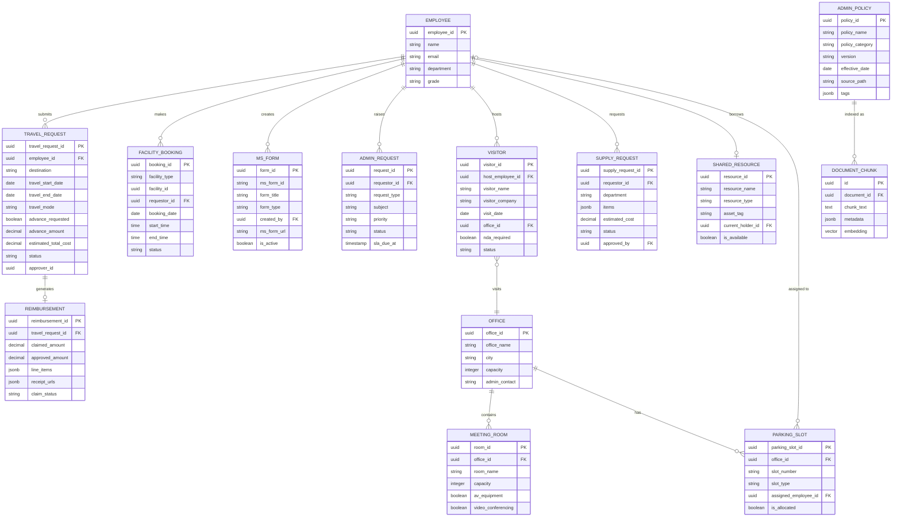

# Admin Domain Ontology

**Document ID:** 02-ONTO-003  
**Version:** 1.0  
**Date:** 2026-06-07  
**Organization:** Aligned Automation  
**Classification:** Internal — Technical Reference

---

## 1. Admin Domain Overview

The Admin domain covers all administrative services that support the physical and operational infrastructure of Aligned Automation. It handles employee-facing workflows for travel, facilities, office resources, visitor access, and general administrative requests. The domain is served by the `AdminAgent` (`admin_agent.py`), which inherits from `BaseDeepAgent` and performs pgvector-based retrieval over the "Admin Documents" and "Admin Policies" knowledge partitions ingested from SharePoint.

### Domain Boundaries

The Admin domain is responsible for:
- **Travel and expense logistics**: booking support, advance requests, reimbursement guidance
- **Facility operations**: meeting room booking, parking allocation, office access
- **Microsoft Forms creation**: structured request forms generated via Graph API
- **Policy knowledge delivery**: admin policies retrieved from SharePoint and surfaced via RAG
- **General administrative requests**: office supplies, visitor management, ad-hoc coordination

The Admin domain does not own:
- Payroll or compensation (HR domain)
- IT infrastructure or software access (IT domain)
- Financial reporting or TDS processing (Finance domain)
- Project planning or milestone tracking (PMO domain)

### Escalation Contact

All unresolved or sensitive admin matters escalate to the Admin Team at `admin@alignedautomation.com`.

---

## 2. Travel Request Entity

A Travel Request represents an employee's intent to undertake work-related travel and the associated logistics and reimbursement lifecycle.

### Attributes

| Attribute | Type | Description |
|-----------|------|-------------|
| `travel_request_id` | UUID | Unique identifier for the travel request |
| `employee_id` | UUID | Requestor employee identifier (from Zoho People) |
| `destination` | STRING | City and country of travel destination |
| `travel_start_date` | DATE | Departure date |
| `travel_end_date` | DATE | Return date |
| `purpose` | TEXT | Business justification for the trip |
| `travel_mode` | ENUM | `flight`, `train`, `cab`, `personal_vehicle` |
| `accommodation_required` | BOOLEAN | Whether hotel booking is needed |
| `advance_requested` | BOOLEAN | Whether a travel advance is requested |
| `advance_amount` | DECIMAL | Amount requested as advance (INR) |
| `estimated_total_cost` | DECIMAL | Total estimated travel cost (INR) |
| `status` | ENUM | `draft`, `submitted`, `approved`, `rejected`, `reimbursed` |
| `approver_id` | UUID | Manager or admin approver |
| `submitted_at` | TIMESTAMP | Time of formal submission |
| `approved_at` | TIMESTAMP | Time of approval decision |
| `reimbursement_amount` | DECIMAL | Actual reimbursed amount post-travel |
| `reimbursement_date` | DATE | Date of reimbursement processing |
| `receipts_submitted` | BOOLEAN | Whether supporting receipts have been uploaded |
| `notes` | TEXT | Additional travel notes or special requirements |

### Travel Reimbursement Sub-Entity

After travel, the employee files a reimbursement claim linked to the originating Travel Request.

| Attribute | Type | Description |
|-----------|------|-------------|
| `reimbursement_id` | UUID | Unique reimbursement claim identifier |
| `travel_request_id` | UUID | FK to parent Travel Request |
| `claimed_amount` | DECIMAL | Total claimed amount with receipts |
| `approved_amount` | DECIMAL | Finance-approved reimbursement amount |
| `line_items` | JSONB | Itemized expense breakdown (transport, hotel, meals, misc) |
| `receipt_urls` | JSONB | Links to uploaded receipt documents in SharePoint |
| `claim_status` | ENUM | `pending`, `under_review`, `approved`, `rejected`, `paid` |
| `finance_notes` | TEXT | Finance team annotation on the claim |

### Assistant Interactions

The AdminAgent handles travel-related queries including:
- Explaining the travel request and reimbursement process
- Retrieving travel policy limits (daily allowances, hotel caps, class of travel by grade)
- Guiding employees on the advance request process
- Generating draft escalations when approval is delayed beyond SLA

---

## 3. Facility Entity

The Facility entity represents physical spaces and infrastructure managed by the Admin team that employees can reserve or access.

### Office Entity

| Attribute | Type | Description |
|-----------|------|-------------|
| `office_id` | UUID | Unique office identifier |
| `office_name` | STRING | Office display name (e.g., "Bangalore HQ", "Pune Branch") |
| `address` | TEXT | Full postal address |
| `city` | STRING | City of the office |
| `capacity` | INTEGER | Total seating capacity |
| `floors` | INTEGER | Number of floors occupied |
| `admin_contact` | STRING | Primary admin contact email for the office |
| `amenities` | JSONB | List of available amenities (cafeteria, gym, crèche, etc.) |
| `access_hours` | STRING | Standard operating hours (e.g., "08:00–21:00 IST") |
| `emergency_contact` | STRING | On-site security or emergency number |

### Meeting Room Entity

| Attribute | Type | Description |
|-----------|------|-------------|
| `room_id` | UUID | Unique room identifier |
| `office_id` | UUID | FK to parent Office |
| `room_name` | STRING | Room display name |
| `floor` | STRING | Floor number or label |
| `capacity` | INTEGER | Maximum seating capacity |
| `av_equipment` | BOOLEAN | Whether AV/projector is available |
| `video_conferencing` | BOOLEAN | Whether VC system (Teams/Zoom) is installed |
| `whiteboard` | BOOLEAN | Whether a whiteboard is present |
| `booking_system` | STRING | Booking platform (e.g., Microsoft Outlook, internal portal) |
| `is_available` | BOOLEAN | Current availability status |

### Parking Entity

| Attribute | Type | Description |
|-----------|------|-------------|
| `parking_slot_id` | UUID | Unique parking slot identifier |
| `office_id` | UUID | FK to parent Office |
| `slot_number` | STRING | Physical slot identifier |
| `slot_type` | ENUM | `two_wheeler`, `four_wheeler`, `accessible`, `reserved` |
| `assigned_employee_id` | UUID | Employee holding permanent allocation (nullable) |
| `is_allocated` | BOOLEAN | Whether slot is currently assigned |
| `allocation_start_date` | DATE | Date permanent allocation took effect |
| `allocation_end_date` | DATE | Date allocation expires (nullable for permanent) |

### Facility Booking Request Entity

| Attribute | Type | Description |
|-----------|------|-------------|
| `booking_id` | UUID | Unique booking identifier |
| `facility_type` | ENUM | `meeting_room`, `parking`, `hot_desk`, `conference_hall` |
| `facility_id` | UUID | FK to the specific facility (room, slot, etc.) |
| `requestor_id` | UUID | Employee making the request |
| `booking_date` | DATE | Date of the booking |
| `start_time` | TIME | Booking start time |
| `end_time` | TIME | Booking end time |
| `attendees` | INTEGER | Number of attendees (for rooms) |
| `purpose` | TEXT | Brief description of use |
| `status` | ENUM | `pending`, `confirmed`, `cancelled` |
| `confirmed_by` | UUID | Admin who confirmed the booking (nullable) |

---

## 4. Form Entity

The Form entity represents Microsoft Forms created via the Microsoft Graph API for structured employee request collection. The FormsDrawer frontend component drives form creation; the backend calls the `/api/ms-forms/create` endpoint.

### Form Entity Attributes

| Attribute | Type | Description |
|-----------|------|-------------|
| `form_id` | UUID | Internal form identifier |
| `ms_form_id` | STRING | Microsoft Forms external identifier returned by Graph API |
| `form_title` | STRING | Human-readable form title |
| `form_type` | ENUM | `travel_request`, `visitor_pass`, `supply_request`, `admin_request`, `parking_request`, `general` |
| `created_by` | UUID | Employee who initiated form creation |
| `created_at` | TIMESTAMP | Form creation timestamp |
| `ms_form_url` | STRING | Public URL for the Microsoft Form |
| `form_questions` | JSONB | Structured question definitions sent to Graph API |
| `response_destination` | STRING | SharePoint list or email where responses are collected |
| `is_active` | BOOLEAN | Whether the form is accepting responses |
| `expiry_date` | DATE | Date after which form is closed (nullable) |

### Microsoft Graph API Integration

Form creation follows this integration path:

1. User requests a form via the assistant or FormsDrawer UI
2. `AdminAgent` (or direct API call) POSTs to `/api/ms-forms/create`
3. Backend authenticates via Azure AD app credentials using the configured tenant/client IDs
4. Graph API call: `POST https://graph.microsoft.com/v1.0/me/drive/root/children` (or equivalent Forms endpoint)
5. Form metadata and URL returned and persisted internally
6. User receives shareable link to the created form

### Supported Form Types

| Form Type | Purpose |
|-----------|---------|
| Travel Request Form | Structured travel itinerary and advance request collection |
| Visitor Pass Request | Pre-registration of external visitors |
| Office Supply Request | Consumables and equipment request from departments |
| Parking Allocation Request | New or change-of-slot parking requests |
| Admin General Request | Catch-all for admin tasks not covered by specific types |
| Facility Booking Request | Formal room or conference hall reservation |

---

## 5. Admin Policy Entity

Admin Policies are authoritative documents ingested from SharePoint and indexed in pgvector. The AdminAgent retrieves these via cosine similarity search when employees ask policy questions.

### Policy Entity Attributes

| Attribute | Type | Description |
|-----------|------|-------------|
| `policy_id` | UUID | Internal policy document identifier (maps to `documents.id`) |
| `policy_name` | STRING | Human-readable policy title |
| `policy_category` | ENUM | `travel`, `facilities`, `procurement`, `visitor`, `parking`, `general_admin` |
| `version` | STRING | Policy version number (e.g., "v2.1") |
| `effective_date` | DATE | Date from which the policy is enforceable |
| `review_date` | DATE | Scheduled next review date |
| `owner_team` | STRING | Team responsible for maintaining the policy |
| `source_path` | STRING | SharePoint document path used during ingestion |
| `tags` | JSONB | Searchable tags (e.g., `["travel", "reimbursement", "per_diem"]`) |
| `chunk_count` | INTEGER | Number of pgvector chunks generated from this document |
| `last_indexed_at` | TIMESTAMP | Timestamp of most recent ingestion/re-indexing |

### Key Admin Policy Areas

- **Travel Policy**: Grade-wise travel class entitlements, daily allowance rates by city tier, hotel category limits, advance eligibility criteria, reimbursement submission deadlines
- **Facilities Policy**: Meeting room booking rules, cancellation windows, AV equipment request process, after-hours access procedure
- **Procurement Policy**: Office supply ordering thresholds, vendor approval process, purchase order requirements, petty cash limits
- **Visitor Management Policy**: Visitor pre-registration requirements, escort rules, NDA requirements for external visitors, visitor badge issuance
- **Parking Policy**: Allocation priority criteria, waitlist management, temporary visitor parking, bike and four-wheeler slot ratios
- **General Admin Policy**: Admin request SLA commitments, escalation paths, admin team working hours and holiday schedule

---

## 6. Request Entity

The Request entity is the general-purpose administrative request record covering admin tasks that do not fit into specific sub-entities (travel, facility booking, or form generation).

### Request Entity Attributes

| Attribute | Type | Description |
|-----------|------|-------------|
| `request_id` | UUID | Unique request identifier |
| `requestor_id` | UUID | Employee submitting the request |
| `request_type` | ENUM | `office_supply`, `access_card`, `id_card`, `admin_misc`, `vendor_invoice`, `event_support` |
| `subject` | STRING | Brief request title |
| `description` | TEXT | Full description of the request |
| `priority` | ENUM | `low`, `medium`, `high`, `urgent` |
| `status` | ENUM | `open`, `in_progress`, `on_hold`, `resolved`, `cancelled` |
| `assigned_to` | UUID | Admin team member handling the request (nullable) |
| `created_at` | TIMESTAMP | Request creation time |
| `updated_at` | TIMESTAMP | Last status update time |
| `resolved_at` | TIMESTAMP | Time of resolution (nullable) |
| `resolution_notes` | TEXT | Admin team notes on how the request was resolved |
| `attachments` | JSONB | URLs to supporting documents or images |
| `escalation_id` | UUID | FK to escalations table if escalated (nullable) |
| `sla_due_at` | TIMESTAMP | SLA deadline for resolution based on priority |

### Request SLA Targets

| Priority | Target Resolution Time |
|----------|----------------------|
| Urgent | 4 business hours |
| High | 1 business day |
| Medium | 3 business days |
| Low | 5 business days |

---

## 7. Admin Document Management

Admin documents are managed through the SharePoint ingestion pipeline and surfaced via pgvector retrieval in the AdminAgent.

### Document Ingestion Flow

1. Admin team uploads or updates documents in the designated SharePoint admin library
2. The SharePoint ingestion job (`jobs/sharepoint_ingestion/`) polls for changes using hash-based detection (NEW / CHANGED / DELETED)
3. Changed documents are extracted (PDF, DOCX, XLSX, PPTX supported), chunked at 500 tokens with 50-token overlap, embedded with `sentence-transformers/all-MiniLM-L6-v2` (384-dim), and upserted into `document_chunks` with pgvector
4. The `documents` table records the document metadata including `source_path`, `tags`, and `hash`
5. Soft-deleted documents (SharePoint removal) trigger `is_deleted=true` in both `documents` and `document_chunks` tables, with vector entries purged to prevent stale retrieval

### Admin Document Categories in SharePoint

| Category | Description |
|----------|-------------|
| Admin Policies | Official policy documents governing admin operations |
| Admin Documents | Operational templates, forms templates, procedure guides |
| Travel Guidelines | Grade-wise allowance tables, approved hotel lists, booking procedures |
| Facility Guides | Office floor plans, room booking instructions, parking maps |
| Vendor Information | Empanelled vendor lists, procurement contacts, approved suppliers |
| Event Protocols | Event request procedures, AV setup guides, catering SOPs |

### Retrieval Configuration

- **Knowledge partitions**: `Admin Documents` and `Admin Policies` folders (configured in `AdminAgent._DATA_FOLDERS`)
- **Similarity threshold**: 0.10 (weak matches included, top 3 chunks selected)
- **Embedding model**: `sentence-transformers/all-MiniLM-L6-v2` (384-dimensional vectors)
- **Distance metric**: Cosine distance via pgvector (`embedding <=> query_vec::vector`)
- **Adaptive retry**: If pgvector returns no results, the query is simplified and retried once before falling back to FAISS

---

## 8. Visitor Management

The Visitor Management capability allows employees to pre-register external visitors, track active visitor sessions, and comply with the organization's visitor access policy.

### Visitor Entity

| Attribute | Type | Description |
|-----------|------|-------------|
| `visitor_id` | UUID | Unique visitor record identifier |
| `host_employee_id` | UUID | Employee sponsoring the visitor |
| `visitor_name` | STRING | Full name of the visitor |
| `visitor_company` | STRING | Visitor's employer or organization |
| `visitor_email` | STRING | Visitor's email for pre-registration confirmation |
| `visitor_phone` | STRING | Contact number |
| `visit_purpose` | TEXT | Reason for the visit |
| `visit_date` | DATE | Scheduled visit date |
| `expected_arrival` | TIME | Expected arrival time |
| `expected_departure` | TIME | Expected departure time |
| `office_id` | UUID | FK to Office being visited |
| `areas_to_access` | JSONB | Specific floors or zones the visitor may access |
| `nda_required` | BOOLEAN | Whether an NDA must be signed before entry |
| `nda_signed` | BOOLEAN | Whether NDA has been executed |
| `badge_number` | STRING | Physical visitor badge number assigned at reception |
| `actual_arrival` | TIMESTAMP | Actual check-in time recorded by reception |
| `actual_departure` | TIMESTAMP | Actual check-out time recorded by reception |
| `status` | ENUM | `pre_registered`, `checked_in`, `checked_out`, `cancelled`, `no_show` |
| `escort_required` | BOOLEAN | Whether a staff escort is mandatory throughout the visit |
| `admin_notes` | TEXT | Additional admin notes on the visit |

### Visitor Registration Process

1. Host employee requests visitor pre-registration via assistant or a Visitor Pass Request Microsoft Form
2. AdminAgent creates a Visitor entity and optionally triggers a visitor pass form via Graph API
3. Reception team receives pre-registration notification
4. Visitor arrives, shows identification, receives badge
5. Actual arrival and departure times are logged; badge is collected on exit
6. Visitor record is retained for audit purposes per data retention policy

---

## 9. Office Supplies and Resources

The Admin domain tracks consumable supplies and shared resources requested by departments.

### Supply Request Entity

| Attribute | Type | Description |
|-----------|------|-------------|
| `supply_request_id` | UUID | Unique supply request identifier |
| `requestor_id` | UUID | Requesting employee |
| `department` | STRING | Requesting department |
| `items` | JSONB | List of items with quantity and unit (e.g., `[{"item": "A4 Ream", "qty": 5, "unit": "pack"}]`) |
| `estimated_cost` | DECIMAL | Estimated procurement cost (INR) |
| `urgency` | ENUM | `routine`, `urgent` |
| `justification` | TEXT | Business justification for the request |
| `status` | ENUM | `submitted`, `approved`, `ordered`, `delivered`, `rejected` |
| `approved_by` | UUID | Admin approver |
| `vendor_id` | UUID | FK to selected vendor (nullable until ordering stage) |
| `purchase_order_number` | STRING | PO number once order is raised (nullable) |
| `delivered_at` | TIMESTAMP | Actual delivery timestamp (nullable) |
| `delivery_notes` | TEXT | Notes from admin on delivery or partial fulfillment |

### Shared Resource Entity

Shared resources are physical assets that employees borrow temporarily (projectors, laptops for events, cameras, etc.).

| Attribute | Type | Description |
|-----------|------|-------------|
| `resource_id` | UUID | Unique resource identifier |
| `resource_name` | STRING | Asset description |
| `resource_type` | ENUM | `projector`, `laptop`, `camera`, `extension_cord`, `other` |
| `asset_tag` | STRING | Physical asset tag number |
| `current_holder_id` | UUID | Employee currently in possession (nullable if available) |
| `checkout_date` | DATE | Date asset was checked out |
| `expected_return_date` | DATE | Date employee is expected to return the asset |
| `actual_return_date` | DATE | Actual return date (nullable until returned) |
| `condition_on_checkout` | ENUM | `excellent`, `good`, `fair` |
| `condition_on_return` | ENUM | `excellent`, `good`, `fair`, `damaged` (nullable until returned) |
| `is_available` | BOOLEAN | Current availability status |

---

## 10. Data Sources

### SharePoint (Primary Knowledge Source)
- **Content**: Admin policies, travel guidelines, facility guides, vendor lists, event protocols
- **Ingestion**: SharePoint ingestion job polls via Microsoft Graph API using Azure AD app credentials (`SHAREPOINT_CLIENT_ID`, `SHAREPOINT_CLIENT_SECRET`, `SHAREPOINT_TENANT_NAME`, `SHAREPOINT_SITE_PATH`)
- **Change detection**: SHA-256 hash comparison (`hash VARCHAR UNIQUE` in `documents` table); unchanged files skipped
- **File formats**: PDF, DOCX, XLSX, PPTX
- **Storage**: pgvector `document_chunks` table with 384-dim embeddings

### Microsoft Forms via Graph API
- **Purpose**: Structured admin request collection (travel, visitor, supply, parking)
- **Endpoint**: `/api/ms-forms/create` backed by Microsoft Graph API
- **Authentication**: Azure AD app credentials (`AZURE_TENANT_ID`, `AZURE_CLIENT_ID`)
- **Output**: Shareable Microsoft Forms URL returned to requesting employee

### PostgreSQL — Main Application Database
- **Host**: `hackathon.alignedautomation.com:5432`
- **Database**: `squadrons`
- **Relevant tables**: `escalations` (admin escalations), `documents`, `document_chunks`, `audit_logs`
- **Connection pool**: ThreadedConnectionPool (min=1, max=8), RealDictCursor

### Zoho People — Employee Context
- **Purpose**: Employee identity resolution (employee_id, department, grade) for entitlement-based responses
- **Access**: Read-only PostgreSQL connection to Zoho DB (`ZOHO_DB_HOST`, `ZOHO_DB_PORT`, `ZOHO_DB_NAME`)
- **Usage**: AdminAgent may query employee grade to apply correct travel entitlements from policy documents

### Ollama LLM (Self-Hosted)
- **Endpoint**: `http://ml01.alignedautomation.com:11434`
- **Model**: `gpt-oss`
- **Role**: Final response generation after retrieval context is assembled
- **Parameters**: temperature=0.1, num_predict=800, num_ctx=2048

---

## 11. Admin Domain Model — Entity Relationship Diagram

---

## 12. Admin Agent Capabilities

The `AdminAgent` is a `BaseDeepAgent` subclass that handles all admin-domain queries through the following pipeline:

### Routing

The MasterAgent supervisor routes queries to AdminAgent via:
- **Fast-path regex**: Patterns matching "travel", "reimbursement", "parking", "meeting room", "visitor", "supplies", "facilities", "office", "booking"
- **Keyword scoring**: `DOMAIN_KEYWORDS` dict scoring for the admin domain
- **LLM intent classification**: Fallback routing when regex and keyword scoring yield low confidence

### Retrieval Pipeline (from BaseDeepAgent)

1. **Parallel async retrieval**:
   - pgvector search over `Admin Documents` and `Admin Policies` partitions
   - FAISS local fallback if pgvector is unavailable
   - User memory context from MarkdownStore and MemoryClient
   - Tavily web search (if API key is configured)
2. **Adaptive retry**: Query is simplified and retried if pgvector returns no results above threshold
3. **Similarity threshold**: 0.10 (top 3 chunks selected)
4. **Context assembly**: Memory + pgvector chunks + FAISS chunks + optional web results
5. **Generation**: Single LLM call using `ADMIN_PERSONALITY` system prompt plus assembled context

### Current Capabilities

| Capability | Mechanism |
|-----------|-----------|
| Travel policy Q&A | pgvector retrieval over travel policy documents |
| Reimbursement process guidance | pgvector retrieval over admin policy documents |
| Facility booking guidance | pgvector retrieval plus escalation for booking actions |
| Parking policy and allocation queries | pgvector retrieval over admin documents |
| Microsoft Forms creation | `/api/ms-forms/create` endpoint via FormsDrawer |
| Admin request escalation | EscalationAgent handoff via MasterAgent |
| Office information queries | pgvector retrieval over admin documents |
| Visitor management guidance | pgvector retrieval over visitor policy documents |
| Office supplies request guidance | pgvector retrieval plus optional form creation |
| Fallback escalation | Escalation to `admin@alignedautomation.com` when confidence is low |

### Personality Configuration

AdminAgent uses the `ADMIN_PERSONALITY` system prompt defined in `agents/personalities.py`. The personality instructs the LLM to:
- Respond with clarity and professionalism appropriate for operational requests
- Ground responses in retrieved policy documents rather than assumptions
- Provide step-by-step process guidance when explaining procedures
- Acknowledge when a request requires human admin team involvement
- Direct employees to the correct contact (`admin@alignedautomation.com`) for actions requiring admin team action

### Guardrail Behavior

AdminAgent responses pass through the two-tier guardrail system (`agents/guardrails.py`):
- **Tier 1 (Generic)**: Jailbreak or harmful content prompts are rejected before the agent is invoked
- **Tier 2 (Organizational)**: Distress signals trigger an empathetic LLM response; queries requesting sensitive facility data (security camera access, employee location tracking) are redirected

---

## 13. Future Admin Domain Extensions

### EXT-ADMIN-01: Real-Time Facility Availability via Graph API
Integrate Microsoft Graph Calendar API to surface real-time meeting room availability directly in the assistant. Employees can ask "Is Conference Room B free at 2 PM tomorrow?" and receive a live availability response without leaving the chat.

**Dependencies**: Microsoft Graph `Calendars.Read` scope, room mailbox identifiers in Azure AD

### EXT-ADMIN-02: Travel Booking Deep Link Integration
Integrate with the organization's approved travel booking platform (e.g., MakeMyTrip for Business, Yatra Corporate) to generate pre-filled booking links from assistant-collected itinerary details. The assistant becomes a booking concierge rather than a policy guide.

**Dependencies**: Travel booking vendor API credentials, travel entitlement data from Zoho People grade field

### EXT-ADMIN-03: Visitor Pre-Registration Automation
Automate visitor badge pre-registration by integrating with the physical access control system. When a visitor is pre-registered via the assistant, a temporary digital access token is generated and emailed to the visitor, reducing reception desk burden.

**Dependencies**: Physical access control system API, visitor email delivery service

### EXT-ADMIN-04: Parking Waitlist Management
Build a waitlist queue for parking allocation requests. When a slot becomes available (employee resigns, allocation ends), the next employee on the waitlist is automatically notified and a new allocation is initiated via the assistant.

**Dependencies**: Parking slot availability tracking, employee notification service via Microsoft Graph Mail.Send scope

### EXT-ADMIN-05: Procurement Approval Workflow
Implement a multi-step approval chain for office supply requests exceeding the petty cash limit. The assistant drafts the supply request, routes it to the department head for approval, then forwards to Finance for PO creation — all tracked within the admin request entity.

**Dependencies**: Zoho People or internal org hierarchy for manager lookup, Finance domain integration

### EXT-ADMIN-06: Proactive Policy Expiry Alerts
Implement a scheduled job that identifies admin policies with `review_date` within the next 30 days and notifies the policy owner team. The assistant can surface these alerts in the COO Dashboard and respond to "Which admin policies are due for review?" queries against structured data.

**Dependencies**: Scheduled job infrastructure, document metadata review date field, COO Dashboard integration

### EXT-ADMIN-07: Zoho Write-Back for Admin Requests
Allow employees to submit formal admin requests (travel, parking, visitor) directly through the assistant, with structured data written back to the admin request management system rather than relying on email or SharePoint forms. Requires explicit user confirmation before submission.

**Dependencies**: Admin request management system API, Zoho People or internal ITSM write access

### EXT-ADMIN-08: Multi-Office Facility Intelligence
Extend the Facility entity to support multi-office scenarios where employees visiting another city office can query availability and book rooms or visitor passes at the destination office. Room inventory and booking calendar data would be synchronized via Graph API across all office Room Lists.

**Dependencies**: Microsoft 365 Room List configuration per office, multi-timezone support in booking logic

---

*This document defines the authoritative ontology for the Admin domain within the AA-Hackathon Enterprise Assistant platform at Aligned Automation.*

*Maintained by: Platform Engineering, Aligned Automation*  
*Contact for admin domain queries: admin@alignedautomation.com*  
*Next review: 2026-09-07*
