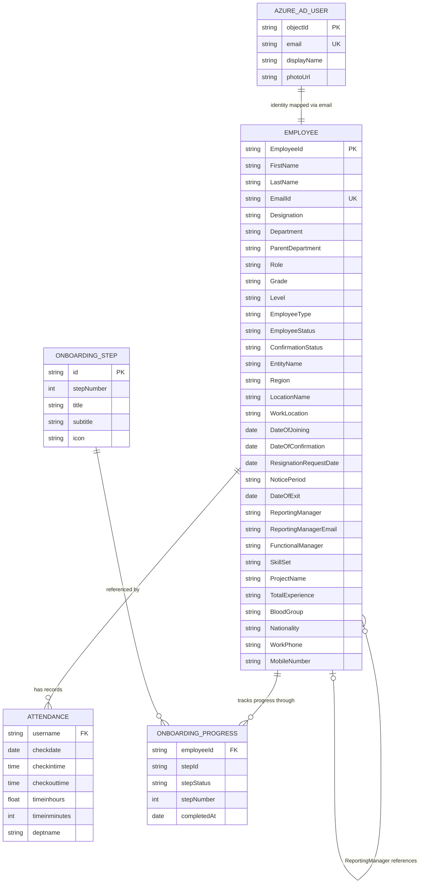

# Employee Domain Ontology

**Platform:** AA-Hackathon Enterprise Assistant  
**Organization:** Aligned Automation  
**Document Version:** 1.0  
**Last Updated:** 2026-06-07  
**Status:** Authoritative

---

## 1. Employee Domain Overview

The Employee Domain is the central human-resource data layer of the AA-Hackathon Enterprise
Assistant. It represents every person who has a current or historical employment relationship with
Aligned Automation and governs how identity, organizational placement, contact information, and
lifecycle state are modeled, stored, and surfaced to the conversational AI.

The domain is served by two agents:

| Agent | Responsibility |
|---|---|
| `EmployeeAgent` | Directory look-ups, self-service profile queries, headcount, org-structure, field-level retrieval |
| `AttendanceAgent` | Clock-in/clock-out records, working-hours calculation, monthly summaries |

Both agents operate in read-only mode against a mirrored PostgreSQL replica of Zoho People.
No writes to the HR system of record are performed through the assistant.

The MasterAgent (supervisor) routes queries to these agents via fast-path regex detection before
any LLM call is attempted, making employee and attendance lookups low-latency operations.

---

## 2. Employee Entity — Attribute Reference

All attributes are sourced from the database view `people.vb_employees` in the Zoho People
replica. Column names are exact as defined in `apps/api-gateway/app/agents/employee/config.py`.

### 2.1 Identity Attributes

| Attribute (Column) | Type | Display Label | Notes |
|---|---|---|---|
| `EmployeeId` | VARCHAR | Employee ID | Zoho People internal identifier |
| `FirstName` | VARCHAR | First Name | Used in all search and display paths |
| `LastName` | VARCHAR | Last Name | Default sort key (LastName, FirstName) |
| `EmailId` | VARCHAR | Work Email | Primary lookup key; used for self-service JWT resolution |
| `PersonalEmailId` | VARCHAR | Personal Email | Hidden in detail card (PII-protected) |
| `Gender` | VARCHAR | Gender | |
| `DateOfBirth` | DATE | Date of Birth | Hidden in detail card (PII-protected) |
| `Age` | INTEGER | Age | Computed or stored by Zoho |
| `Nationality` | VARCHAR | Nationality | Displayed in detail card |
| `BloodGroup` | VARCHAR | Blood Group | Displayed in detail card |
| `MaritalStatus` | VARCHAR | Marital Status | |
| `Photo` | TEXT | Photo URL | Hidden in detail card (PII-protected) |
| `AboutMe` | TEXT | About Me | Self-description field |

### 2.2 Contact Attributes

| Attribute (Column) | Type | Display Label | Notes |
|---|---|---|---|
| `WorkPhone` | VARCHAR | Work Phone | Included in summary and detail views |
| `MobileNumber` | VARCHAR | Mobile Number | Included in summary and detail views |
| `PresentAddress` | TEXT | Present Address | |
| `PermanentAddress` | TEXT | Permanent Address | |
| `LanguagesKnown` | VARCHAR | Languages Known | |

### 2.3 Employment Attributes

| Attribute (Column) | Type | Display Label | Notes |
|---|---|---|---|
| `Designation` | VARCHAR | Designation / Title | Primary role title; full-text searchable |
| `Role` | VARCHAR | Role | Functional role label |
| `Grade` | VARCHAR | Grade | Compensation/band grade |
| `Level` | VARCHAR | Level | Seniority level |
| `EmployeeType` | VARCHAR | Employee Type | Full-time, contractor, intern, etc. |
| `EmployeeStatus` | VARCHAR | Status | Active / Inactive / Onboarding / Offboarding |
| `ConfirmationStatus` | VARCHAR | Confirmation Status | Probation state |
| `Department` | VARCHAR | Department | Primary department; full-text searchable |
| `ParentDepartment` | VARCHAR | Parent Department | Organizational group |
| `EntityName` | VARCHAR | Entity | Legal entity name |
| `Region` | VARCHAR | Region | Geographic region (e.g., Asia-Pacific) |
| `LocationName` | VARCHAR | Location | Office location city/name |
| `WorkLocation` | VARCHAR | Work Location | Specific building/site |
| `SourceOfHire` | VARCHAR | Source of Hire | Recruitment channel |

### 2.4 Manager Hierarchy Attributes

| Attribute (Column) | Type | Display Label | Notes |
|---|---|---|---|
| `ReportingManager` | VARCHAR | Reporting Manager | Direct line manager name |
| `ReportingManagerEmail` | VARCHAR | Manager Email | Used for manager-to-employee look-ups |
| `FunctionalManager` | VARCHAR | Functional Manager | Matrix / functional reporting line |

### 2.5 Skills and Project Attributes

| Attribute (Column) | Type | Display Label | Notes |
|---|---|---|---|
| `SkillSet` | TEXT | Skills | Comma-separated or free-text; ILIKE searchable |
| `ProjectName` | VARCHAR | Project | Current project assignment |
| `PreviousExperience` | VARCHAR | Previous Experience | Years/months at prior employers |
| `Experience` | VARCHAR | Experience | Calculated experience at Aligned Automation |
| `TotalExperience` | VARCHAR | Total Experience | Combined experience (prior + current) |

### 2.6 Lifecycle Date Attributes

| Attribute (Column) | Type | Display Label | Notes |
|---|---|---|---|
| `DateOfJoining` | DATE | Date of Joining | Effective start date |
| `DateOfConfirmation` | DATE | Date of Confirmation | End of probation |
| `ResignationRequestDate` | DATE | Resignation Date | Date resignation was submitted |
| `NoticePeriod` | VARCHAR | Notice Period | Contractual notice duration |
| `DateOfExit` | DATE | Date of Exit | Last working day |

### 2.7 Sensitive / Regulatory Attributes (Hidden from Assistant Responses)

The following columns are defined in `HIDDEN_DETAIL_COLUMNS` and are never rendered in any
assistant response, even when a full employee record is fetched:

| Column | Reason Hidden |
|---|---|
| `Aadhar` | Statutory government ID — PII |
| `PAN` | Tax ID — PII / financial |
| `UAN` | Universal Account Number — PII / financial |
| `PassportNumber` | Travel document — PII |
| `PassportExpiryDate` | Travel document — PII |
| `PersonalEmailId` | Personal contact — PII |
| `Photo` | Biometric representation — PII |
| `DependentEmergencyDetails` | Third-party PII |
| `InsuranceDetails` | Financial / health — PII |
| Internal audit columns | `AddedBy`, `AddedTime`, `ModifiedBy`, `ModifiedTime` |

---

## 3. Employee Lifecycle States

The `EmployeeStatus` column drives lifecycle state. The assistant interprets these states in
directory queries and headcount calculations.

| State | Meaning | Visible in Directory |
|---|---|---|
| `Active` | Currently employed, all systems access enabled | Yes |
| `Inactive` | Employment ended; historical record retained | Conditionally (HR role) |
| `Onboarding` | Hired, joining formalities in progress; AURA onboarding wizard active | Yes |
| `Offboarding` | Notice period active, exit formalities in progress | Yes |

State transitions:

```
Offer Accepted
      |
      v
  Onboarding  -->  Active  -->  Offboarding  -->  Inactive
                     ^
                     |
               Rehire / Return
```

The `DateOfConfirmation` marks the transition from probation to confirmed status within the
`Active` state. `ConfirmationStatus` reflects whether confirmation has been granted.

---

## 4. Employee Self-Service Capabilities

The `EmployeeAgent` resolves first-person ("my") queries by matching the caller's Azure AD JWT
email (`EmailId`) to the Zoho People view and returns the caller's own profile record.

Self-service intent is detected by `_SELF_RE` — a compiled regex that matches patterns including:

- `my designation`, `my department`, `my manager`, `my grade`, `my level`
- `my mobile`, `my work phone`, `my email`, `my location`
- `my skill`, `my project`, `my blood group`, `my date of joining`
- `my nationality`, `my experience`, `my contact`
- `who am I`, `about me`, `tell me about myself`
- `my employee detail`, `my HR profile`, `my personal info`

Self-service queries are also triggered when the caller's full display name (from JWT) appears
verbatim in the query text — this allows queries like "What is Prashant Dikonda's designation"
from the matching user to resolve as a self-lookup without re-routing to a third-party search.

Self-service always returns the full detail card (all non-hidden fields), never the abbreviated
summary line format used for multi-result lists.

---

## 5. Profile Management

Employee profile data is read-only within the assistant. The system of record is Zoho People.
Profile display uses two rendering formats:

### 5.1 Summary Line (multi-result context)

Rendered when a query returns more than one employee. Shows:
- Full name (bold)
- Designation, Department, Email, Work Phone, Mobile, Location, Reports To, Status

### 5.2 Detail Card (single-result context)

Rendered for self-service queries or when exactly one employee matches. Shows all non-hidden
attributes in a prioritized order:
1. Designation, Department, Parent Department, Role, Grade, Level, Employee Type, Status
2. Work Email, Work Phone, Mobile, Work Location, Location, Region, Entity
3. Reporting Manager, Manager Email, Functional Manager
4. Project, Skills, Total Experience, Date of Joining, Nationality

The `GET /api/profile` API endpoint fetches the authenticated user's profile from Zoho People
and is also consumed by the Onboarding Guidance page to pre-populate the employee's name,
photo, department, and manager details.

---

## 6. Directory Services

The EmployeeAgent supports the following directory query patterns via SQL against
`people.vb_employees`:

| Intent | Trigger Pattern | SQL Strategy | Limit |
|---|---|---|---|
| Name lookup | "find / who is / info about [name]" | ILIKE on FirstName, LastName, EmailId | 10 |
| Department listing | "employees in [dept]" | ILIKE on Department | 50 |
| Skill search | "employees with skill [X]" | ILIKE on SkillSet | 30 |
| Project search | "working on project [X]" | ILIKE on ProjectName | 30 |
| Role/designation | "designation is [X]" | ILIKE on Designation | 20 |
| Location search | "employees in [city]" | ILIKE on LocationName or WorkLocation | 30 |
| Headcount | "how many / count / total employees" | COUNT(*) | — |
| Headcount by dept | "how many in [dept]" | COUNT(*) WHERE Department ILIKE | — |
| Field retrieval | "mobile of [name]", "[name]'s email" | Single-field SELECT | 5 |
| General fallback | keyword scoring | ILIKE across 5 key columns | 10 |

Full-text search uses case-insensitive ILIKE (`%term%`) pattern matching across `SEARCH_COLUMNS`:
FirstName, LastName, EmailId, Designation, Department, ReportingManager, Role, LocationName,
EntityName, ProjectName.

---

## 7. Manager-Subordinate Relationship

The assistant supports two organizational relationship queries:

### 7.1 Subordinate lookup (who reports to a manager)

Pattern: "reports to [name]", "team of [name]", "manager of [name]"

Executed as: `WHERE ReportingManager ILIKE %name%`

Returns: first name, last name, email, designation, department, reporting manager — up to 20 rows.

### 7.2 Manager identification (who is my / someone's manager)

Resolved via the `ReportingManager` and `ReportingManagerEmail` columns on the employee record.
`FunctionalManager` captures the secondary (matrix) reporting relationship.

The assistant does not resolve multi-level hierarchy chains (grandparent manager) in a single
query; it returns the immediate manager only. Org-chart traversal is planned as a future extension.

---

## 8. Attendance Entity

Attendance records are stored in the `attendance` table in the Aura PostgreSQL database
(not the Zoho People replica). The `AttendanceAgent` reads this table directly.

### 8.1 Attendance Schema

| Column | Type | Description |
|---|---|---|
| `username` | VARCHAR | Employee display name (matched via ILIKE) |
| `checkdate` | DATE/TIMESTAMP | The calendar date of the attendance record |
| `checkintime` | TIME | Clock-in timestamp |
| `checkouttime` | TIME | Clock-out timestamp |
| `timeinhours` | NUMERIC | Computed hours present |
| `timeinminutes` | INTEGER | Computed minutes present |
| `deptname` | VARCHAR | Department name at time of record |

### 8.2 Duration Classification

The `AttendanceAgent` computes duration from `checkintime` and `checkouttime` at render time:

| Duration | Classification | Badge Color |
|---|---|---|
| >= 8 hours | Full day | Green (#16a34a) |
| 6–8 hours | Partial / half day | Amber (#d97706) |
| < 6 hours | Short attendance | Red (#dc2626) |

### 8.3 Deduplication

Multiple records for the same `(username, checkdate)` pair are merged:
- Earliest `checkintime` wins
- Latest `checkouttime` wins
- The merged record is used for duration calculation

### 8.4 Supported Time Range Filters

The agent parses natural language date references:

| Phrase | Resolved Range |
|---|---|
| "today" | Current date |
| "yesterday" | Current date minus 1 day |
| "this week" | Monday of current week onwards |
| "last week" | Full previous Mon-Sun week |
| "this month / current month" | 1st of current month onwards |
| "last month" | Full previous calendar month |
| "[Month name]" / "[Month] [Year]" | Full named calendar month |

### 8.5 Query Resolution Order

The `AttendanceAgent` resolves the target employee in this order:

1. First-person pronoun (`my`, `me`, `I`) — maps to the caller's Zoho People name via `GET /api/profile`
2. Email address in query — resolved to name via `people.vb_employees`
3. Name extracted from natural language (before the attendance keyword)
4. Pattern-matched name after `attendance of / for [name]`
5. Default: caller's own attendance record when no target is identified

---

## 9. Onboarding Entity

The Onboarding Guidance module represents a new employee's structured first-week experience.
It is a frontend wizard (`OnboardingGuidancePage.jsx`) with 8 sequential steps.

### 9.1 Onboarding Step Definitions

| Step | ID | Title | Subtitle | Description |
|---|---|---|---|---|
| 1 | `welcome` | Welcome | Get started | Introduction to Aligned Automation, AURA assistant, and first-day checklist |
| 2 | `profile` | Your Profile | Personal and bank details | Review and verify personal info from Zoho People; bank account form upload |
| 3 | `it-access` | IT and Access | Tools and credentials | Microsoft 365 email, VPN (Cisco AnyConnect), SSO (Okta), device allocation, 2FA / YubiKey, Slack |
| 4 | `policy` | Policy and Compliance | Review and sign | Employee Handbook, Mutual NDA, Information Security Policy, Data Privacy Policy, AI Tool Usage Policy |
| 5 | `induction` | Induction | Videos and audio | Self-paced video modules: Our Story, Agile Delivery, Diversity and Inclusion, Code of Conduct |
| 6 | `team` | Team and Resources | Meet your team | Pod members, reporting manager, buddy, links to Jira, GitHub, Figma, Notion, Linear, Slack |
| 7 | `documents` | Documents | Upload and verify | Government ID Proof, Address Proof, Education Certificate, Experience Certificate, Bank Account Form, Passport Photo |
| 8 | `all-set` | All Set | Wrap up | Completion confirmation, outstanding items summary, day-one guidance |

### 9.2 Onboarding Progress Model

Progress is tracked client-side via the `completed` array in `OnboardingGuidancePage.jsx`.
A step transitions from pending to completed when the user clicks "Next" from that step.
Overall progress percentage: `(completed.length / 8) * 100`.

The AI assistant is embedded in the onboarding page as a floating chat button (FAB). When
opened, the chat context is pre-seeded with the current step name so the assistant can provide
step-specific guidance without the user having to re-explain their context.

### 9.3 Required Documents (Documents Step)

| Document | Required | 
|---|---|
| Government ID Proof | Yes |
| Address Proof | Yes |
| Education Certificate | Yes |
| Experience Certificate | Yes |
| Bank Account Form | Yes |
| Passport Photo | No |

### 9.4 IT Access Provisioning Checklist (IT and Access Step)

| Tool / System | Status Model |
|---|---|
| Microsoft 365 Email and Calendar | completed / action-needed / in-progress |
| VPN (Cisco AnyConnect) | completed / action-needed / in-progress |
| Single Sign-On (Okta) | completed / action-needed / in-progress |
| Device Allocation (Laptop) | completed / action-needed / in-progress |
| Security and 2FA (YubiKey) | completed / action-needed / in-progress |
| Slack | completed / action-needed / in-progress |

---

## 10. Data Sources

### 10.1 Zoho People PostgreSQL Replica

- **Host:** configured via `ZOHO_DB_HOST` environment variable
- **Schema:** `people`
- **Primary view:** `people.vb_employees`
- **Access mode:** Read-only, direct psycopg2 connection per query
- **Connection timeout:** 10 seconds (configurable via `ZOHO_DB_CONNECT_TIMEOUT`)
- **Authentication:** Dedicated service account credentials (`ZOHO_DB_USER` / `ZOHO_DB_PWD`)
- **Connection pooling:** Per-call connection (no persistent pool for Zoho DB)

The `people.vb_employees` view is a flattened, de-normalized representation of the Zoho People
employee master, exposing all HR attributes in a single queryable surface.

### 10.2 Aura PostgreSQL (Attendance Table)

- **Host:** `hackathon.alignedautomation.com` (`SQL_HOST`)
- **Port:** 5432
- **Database:** `squadrons` (`SQL_DB`)
- **Table:** `attendance`
- **Access mode:** Read-only for AttendanceAgent

Attendance records are not present in Zoho People's replica. They are written to the Aura
application database by a separate Zoho People sync or time-tracking integration.

### 10.3 Azure Active Directory (Microsoft Graph API)

- **Purpose:** Authenticated user identity resolution for self-service queries
- **Attributes consumed:** email (JWT claim `preferred_username`), display name, profile photo
- **Used by:** MasterAgent (JWT decode), OnboardingGuidancePage (profile pre-population)
- **Scopes:** `openid`, `profile`, `email`, `User.Read`
- **Library:** `azure-msal-browser` (frontend), `python-jose` (backend JWT validation)

Azure AD is the source of truth for authentication. Zoho People is the source of truth for
employment attributes. The two are linked via the employee's organizational email address.

---

## 11. Employee Domain Model



---

## 12. Security Classification per Attribute

| Attribute Category | Attributes | Classification | Handling |
|---|---|---|---|
| Public identity | FirstName, LastName, Designation, Department, EmailId | Internal — Unrestricted | Shown in directory, summary cards, search results |
| Organizational | Role, Grade, Level, EmployeeType, EmployeeStatus, Region, LocationName, WorkLocation, EntityName | Internal — Unrestricted | Shown in directory and detail views |
| Contact (work) | WorkPhone, MobileNumber | Internal — Unrestricted | Shown in summary and detail views; returned in field queries |
| Managerial | ReportingManager, ReportingManagerEmail, FunctionalManager | Internal — Unrestricted | Shown in detail views; used for manager hierarchy queries |
| Professional | SkillSet, ProjectName, TotalExperience, DateOfJoining | Internal — Unrestricted | Shown in detail views; used in skill and project searches |
| Personal contact | PersonalEmailId, PresentAddress, PermanentAddress | Confidential — PII | Hidden in all assistant responses |
| Government ID | Aadhar, PAN, UAN, PassportNumber, PassportExpiryDate | Restricted — PII / Regulatory | Blocked by HIDDEN_DETAIL_COLUMNS; never surfaced |
| Biometric | Photo, DateOfBirth, BloodGroup (where sensitive) | Confidential — PII | Photo hidden; BloodGroup shown only in detail card |
| Financial | InsuranceDetails | Restricted — Financial PII | Hidden in all assistant responses |
| Audit metadata | AddedBy, AddedTime, ModifiedBy, ModifiedTime | Internal — System | Hidden in all assistant responses |
| Attendance | checkintime, checkouttime, timeinhours | Internal — Unrestricted | Accessible to any employee query; no access restriction enforced in code |

The `pii_controller.py` and `pii_service.py` modules provide additional runtime PII detection
and redaction for any content flowing through the LLM generation path. The hidden-column
enforcement in the EmployeeAgent operates at the SQL projection and rendering layer, before
content reaches the LLM.

---

## 13. Future Employee Domain Extensions

The following extensions are identified as likely next phases based on the current codebase
structure and organizational requirements:

| Extension | Description | Dependency |
|---|---|---|
| Multi-level org chart traversal | Walk the `ReportingManager` chain upward to find skip-level managers, department heads, and the full reporting path for any employee | Recursive SQL CTE or in-memory graph traversal after fetching the full active employee set |
| Manager-initiated team view | Allow managers to query aggregate metrics for their direct reports (headcount, skill coverage, project allocation) with RBAC gating | RBAC role integration from `userConfig.js` into EmployeeAgent routing |
| Absence and leave balance | Expose approved leave, leave balance, and leave history alongside attendance records | Integration with Zoho People leave management API or a leave-balance table in the Aura DB |
| Peer and team graph | Resolve pod members, buddy assignments, and cross-functional collaborators for onboarding and project context | People graph table or annotation layer on top of `vb_employees` |
| Employee lifecycle event webhooks | Push notifications to AURA when Zoho People fires employee state changes (new hire, confirmation, resignation, exit) | Zoho People webhook subscription and an inbound FastAPI endpoint |
| Semantic skill matching | Use the 384-dimensional pgvector embeddings to match skill queries semantically rather than via ILIKE pattern matching | Embed `SkillSet` values at ingestion time and store in `document_chunks` with `source = 'employee_skill'` tag |
| Profile write-back | Allow employees to update subset of profile fields (emergency contact, personal email, bank details) through the assistant with audit trail | Write path to Zoho People API with MFA confirmation and audit logging to `audit_logs` table |
| Onboarding progress persistence | Persist the 8-step onboarding wizard state server-side so it survives browser refresh and can be tracked by HR | New `onboarding_progress` table in `squadrons` DB with `(user_id, step_id, completed_at)` schema |
| Departure and alumni tracking | Maintain a queryable record of former employees for experience letter generation and reference checks, separate from active directory | Soft-delete flag already present on `EmployeeStatus = Inactive`; needs dedicated query path and HR-role gating |
| Integration with MS Teams presence | Surface real-time availability status alongside directory results | Microsoft Graph Presence API with caching |
