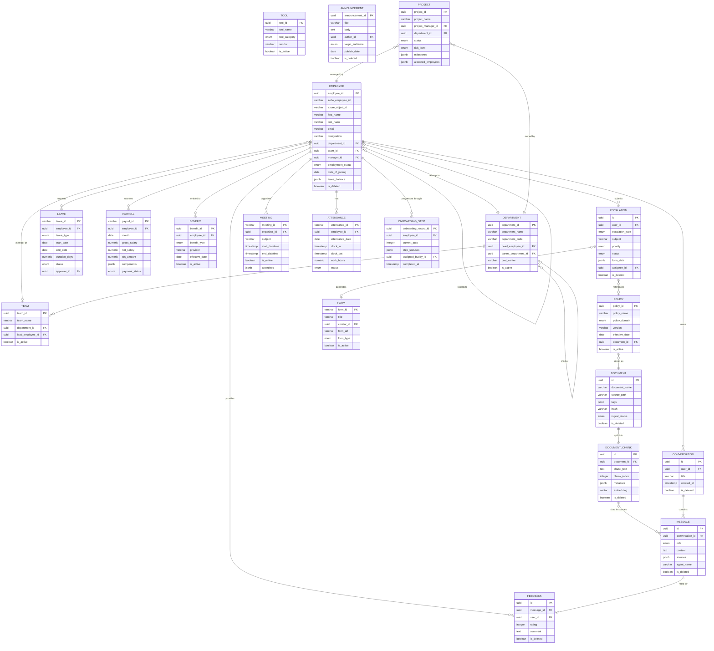

# Enterprise Ontology — AA-Hackathon Enterprise Assistant

**Organization:** Aligned Automation
**Document Type:** Enterprise Knowledge Ontology
**Scope:** AA-Hackathon Enterprise Assistant Platform
**Classification:** Internal — Restricted
**Last Updated:** 2026-06-07
**Version:** 1.0

---

## 1. Ontology Overview and Purpose

### 1.1 What This Document Is

This document defines the formal enterprise ontology for the AA-Hackathon Enterprise Assistant platform at Aligned Automation. An ontology, in the knowledge engineering sense, is a structured specification of the concepts, entities, attributes, and relationships that constitute the domain of discourse for the system. It is the shared semantic foundation on which all agents, retrieval pipelines, data models, and integrations operate.

This ontology covers every named concept that the Enterprise Assistant reasons about: organizational structure, HR processes, IT operations, administrative functions, PMO activities, finance workflows, and the internal platform entities (conversations, documents, feedback) that the system itself produces and manages.

### 1.2 Why This Ontology Exists

The Enterprise Assistant routes queries across 13 domain agents. Without a shared vocabulary, agents can disagree about what an "employee" is, whether a "ticket" differs from an "escalation," or how "documents" relate to "document chunks." The ontology resolves this by:

- Providing a single authoritative definition of every entity the platform touches.
- Specifying the canonical attribute names and data types so that agent prompts, database queries, and API responses all speak the same language.
- Documenting inter-entity relationships so the routing supervisor (MasterAgent) can reason about intent with a correct world model.
- Serving as the ground truth for PII tagging, data classification, and governance decisions.
- Supporting RAG (Retrieval-Augmented Generation) by describing how document chunks map to domain concepts.

### 1.3 Scope

This ontology covers:

- **Organizational entities:** Employee, Department, Team, Manager.
- **HR domain entities:** Leave, Payroll, Benefit, Policy, Attendance, OnboardingStep.
- **IT domain entities:** Ticket/Escalation, Tool.
- **Admin and PMO entities:** Meeting, Announcement, Project, Form.
- **Platform data entities:** Document, DocumentChunk, Conversation, Message, Feedback.

It does not cover infrastructure internals (Kubernetes namespaces, Docker volumes) or external third-party data schemas beyond what the platform ingests.

### 1.4 Primary Consumers

| Consumer | How They Use This Ontology |
|---|---|
| MasterAgent / Supervisor | Entity-type detection for fast-path regex routing |
| Domain Agents (HR, IT, Admin, PMO, Finance, Org) | Attribute-level grounding for LLM prompts |
| RAG Retriever | Chunk metadata tagging by entity type |
| Frontend (React) | Field labels, form validation, display logic |
| Database Schema | Table column naming and type conventions |
| Security / Compliance | PII classification, data access controls |

---

## 2. Ontological Principles

### 2.1 Single Source of Truth

Each entity is defined exactly once in this document. Where the same concept appears in multiple systems (for example, "Employee" exists in both Zoho People and Azure AD), this ontology defines the canonical merged view and specifies which system is authoritative for each attribute.

### 2.2 Authority Hierarchy

When attribute values conflict across systems, the following authority hierarchy applies:

1. **Zoho People** — authoritative for HR attributes: employment dates, leave balances, department, designation, manager.
2. **Azure Active Directory** — authoritative for identity attributes: email, display name, account status, group membership.
3. **Platform Database (PostgreSQL `squadrons`)** — authoritative for platform-generated data: conversations, messages, feedback, escalations, documents.
4. **SharePoint** — authoritative for document content (policy text, templates).
5. **LLM-generated content** — never authoritative for factual attributes; always derived, never stored as ground truth.

### 2.3 Soft Delete Convention

All platform tables use `is_deleted BOOLEAN DEFAULT FALSE`. Entities are never physically removed from the database. Queries must always filter `WHERE is_deleted = FALSE` unless explicitly auditing deleted records.

### 2.4 UUID Identity

All platform entities use UUID v4 as primary keys. Zoho People uses its own integer/string identifiers; a mapping table or attribute (`zoho_id`) bridges the two spaces.

### 2.5 PII Sensitivity Classification

Every attribute in the entity catalog carries one of four PII sensitivity levels:

| Level | Label | Description |
|---|---|---|
| 0 | Public | No personal information; safe to display to any authenticated user |
| 1 | Internal | Organizational data visible to authorized colleagues |
| 2 | Confidential | Personally identifiable; visible only to the employee and authorized HR/IT roles |
| 3 | Restricted | Highly sensitive (salary, health, legal); visible only to HR admin and the individual |

### 2.6 Temporal Modeling

Entities with time-bound validity (Leave, Payroll, OnboardingStep) carry explicit `start_date` / `end_date` or `effective_date` attributes. Historical records are retained; current state is determined by the most recent record where the validity window covers today's date.

### 2.7 Relationship Cardinality Notation

Throughout this document, cardinality is written as `(min..max)` on each side of a relationship:
- `0..*` — zero or many
- `1..*` — one or many
- `0..1` — optional one
- `1..1` — exactly one

---

## 3. Entity Catalog

---

### 3.1 Employee

**Description:**
An Employee is any individual who has an active, former, or pending employment relationship with Aligned Automation. Employees are the central entity of the ontology — nearly every other entity relates back to an Employee as subject, actor, or owner. The platform merges identity data from Azure AD with HR data from Zoho People to produce a unified employee profile.

**Attributes:**

| Attribute | Data Type | PII Level | Authority | Description |
|---|---|---|---|---|
| employee_id | UUID | 1 | Platform | Platform-internal UUID |
| zoho_employee_id | VARCHAR | 1 | Zoho People | Zoho's own employee record ID |
| azure_object_id | VARCHAR | 1 | Azure AD | Azure AD object ID (used for JWT validation) |
| first_name | VARCHAR | 2 | Zoho / Azure AD | Legal first name |
| last_name | VARCHAR | 2 | Zoho / Azure AD | Legal last name |
| display_name | VARCHAR | 1 | Azure AD | Name shown in the UI |
| email | VARCHAR | 2 | Azure AD | Corporate email (domain: alignedautomation.com) |
| phone | VARCHAR | 2 | Zoho People | Mobile / work phone |
| designation | VARCHAR | 1 | Zoho People | Job title |
| department_id | UUID / FK | 1 | Zoho People | FK to Department |
| team_id | UUID / FK | 1 | Zoho People | FK to Team |
| manager_id | UUID / FK | 1 | Zoho People | FK to Employee (reporting manager) |
| employment_type | ENUM | 1 | Zoho People | Full-time, Part-time, Contract, Intern |
| employment_status | ENUM | 1 | Zoho People | Active, On Leave, Resigned, Terminated |
| date_of_joining | DATE | 2 | Zoho People | Official joining date |
| date_of_leaving | DATE | 2 | Zoho People | Exit date (null if active) |
| probation_end_date | DATE | 2 | Zoho People | End of probationary period |
| date_of_birth | DATE | 3 | Zoho People | Used for age-based benefits |
| gender | ENUM | 2 | Zoho People | Used for leave entitlement (maternity/paternity) |
| nationality | VARCHAR | 2 | Zoho People | |
| pan_number | VARCHAR | 3 | Zoho People | Tax identification (India) |
| aadhaar_last4 | VARCHAR | 3 | Zoho People | Last 4 digits only; full number never stored |
| bank_account_number | VARCHAR | 3 | Zoho People | For payroll |
| ifsc_code | VARCHAR | 3 | Zoho People | Bank routing |
| location | VARCHAR | 1 | Zoho People | Office location / city |
| work_mode | ENUM | 1 | Zoho People | WFO, WFH, Hybrid |
| profile_photo_url | VARCHAR | 1 | Azure AD | |
| leave_balance | JSONB | 2 | Zoho People | Map of leave_type → days_remaining |
| cost_center | VARCHAR | 1 | Zoho People | Finance cost center code |
| is_deleted | BOOLEAN | 0 | Platform | Soft delete flag |
| created_at | TIMESTAMP | 0 | Platform | |
| updated_at | TIMESTAMP | 0 | Platform | |

**Relationships:**
- belongs to `1..1` Department
- belongs to `0..1` Team
- reports to `0..1` Manager (Employee)
- has `0..*` Leave records
- has `0..1` active Payroll record
- has `0..*` Benefits
- has `0..*` Conversations
- has `0..*` Escalations
- has `0..*` Attendance records
- has `0..1` OnboardingStep progression record
- has `0..*` Feedback records

**Ownership:** HR — People Operations team
**Data Sources:** Zoho People (`vb_employees` table), Azure AD (Microsoft Graph `/me`)
**Security Classification:** Confidential (PII Level 2). Salary and tax attributes are Restricted (Level 3).

---

### 3.2 Department

**Description:**
A Department is a formal organizational unit that groups employees by function. Departments own HR policies, have budget allocations, and are the primary routing dimension for Admin and HR queries.

**Attributes:**

| Attribute | Data Type | PII Level | Description |
|---|---|---|---|
| department_id | UUID | 0 | Platform UUID |
| zoho_department_id | VARCHAR | 0 | Zoho identifier |
| department_name | VARCHAR | 0 | E.g., Engineering, People Operations |
| department_code | VARCHAR | 0 | Short code (ENG, HR, FIN, etc.) |
| head_employee_id | UUID / FK | 1 | Department head (FK to Employee) |
| parent_department_id | UUID / FK | 0 | For nested org structures |
| cost_center | VARCHAR | 0 | Finance cost center |
| location | VARCHAR | 0 | Primary office location |
| is_active | BOOLEAN | 0 | |
| created_at | TIMESTAMP | 0 | |

**Relationships:**
- has `1..*` Employees
- has `0..1` parent Department (hierarchical)
- has `0..*` child Departments
- has `0..1` head (Employee)
- has `0..*` applicable Policies

**Ownership:** HR / People Operations
**Data Sources:** Zoho People (`vb_departments`)
**Security Classification:** Internal (Level 1)

---

### 3.3 Team

**Description:**
A Team is a sub-unit within a Department, typically project-aligned or functional. Teams are relevant to PMO allocation and to the Onboarding flow (TeamStep).

**Attributes:**

| Attribute | Data Type | PII Level | Description |
|---|---|---|---|
| team_id | UUID | 0 | |
| team_name | VARCHAR | 0 | |
| department_id | UUID / FK | 0 | Parent department |
| lead_employee_id | UUID / FK | 1 | Team tech/functional lead |
| slack_channel | VARCHAR | 0 | Associated communication channel |
| is_active | BOOLEAN | 0 | |
| created_at | TIMESTAMP | 0 | |

**Relationships:**
- belongs to `1..1` Department
- has `1..*` Employees
- has `0..1` lead (Employee)
- associated with `0..*` Projects

**Ownership:** Engineering Managers / HR
**Data Sources:** Zoho People, Platform configuration
**Security Classification:** Internal (Level 1)

---

### 3.4 Manager

**Description:**
Manager is a role-based projection of the Employee entity. Any employee with direct reports is a Manager. This is not a separate table; it is modeled as a self-referential relationship on Employee (`manager_id` FK). The Manager entity is materialized as a view for reporting and routing purposes.

**Key Attributes (inherited from Employee):**
- `employee_id` — the manager's UUID
- `department_id` — department they manage
- `designation` — their job title
- `direct_reports` — list of Employee IDs who report to this manager (derived)
- `approval_limit` — budget approval authority (if stored in Zoho)

**Relationships:**
- is a specialization of Employee
- manages `1..*` Employees (direct reports)
- approves `0..*` Leave requests
- approves `0..*` Escalations of type manager-approval

**Ownership:** HR / Org hierarchy
**Data Sources:** Zoho People (`manager_id` column on `vb_employees`)
**Security Classification:** Internal (Level 1)

---

### 3.5 Leave

**Description:**
A Leave record represents a formally requested and tracked absence by an Employee. The system supports six leave types defined by Aligned Automation's HR policy. Leave data is read from Zoho People and surfaced through the HRAgent. The assistant can answer balance queries and explain policy but does not write leave requests back to Zoho (read-only integration).

**Leave Types:**
- `annual` — Annual / Earned leave (accrued)
- `sick` — Medical leave
- `casual` — Short casual absences
- `maternity` — Extended maternity leave (gender-gated)
- `paternity` — Paternity leave (gender-gated)
- `compensatory` — Comp-off for overtime / weekend work

**Attributes:**

| Attribute | Data Type | PII Level | Description |
|---|---|---|---|
| leave_id | VARCHAR | 2 | Zoho leave record ID |
| employee_id | UUID / FK | 2 | FK to Employee |
| leave_type | ENUM | 2 | See leave types above |
| start_date | DATE | 2 | First day of absence |
| end_date | DATE | 2 | Last day of absence |
| duration_days | NUMERIC | 2 | Including half-day support |
| status | ENUM | 2 | Pending, Approved, Rejected, Cancelled |
| approver_id | UUID / FK | 1 | FK to Employee (manager) |
| reason | TEXT | 2 | Employee-provided reason |
| comments | TEXT | 2 | Manager comments |
| applied_on | TIMESTAMP | 2 | When the request was submitted |

**Relationships:**
- belongs to `1..1` Employee
- approved by `0..1` Manager (Employee)

**Ownership:** HR — People Operations
**Data Sources:** Zoho People (leave module)
**Security Classification:** Confidential (Level 2). Medical/health-related leave reasons are Restricted (Level 3).

---

### 3.6 Payroll

**Description:**
A Payroll record represents the monthly compensation calculation for an employee, including all salary components, statutory deductions, and net pay. Payroll data is among the most sensitive in the platform and is only surfaced to the requesting employee (self-service) or HR admin roles.

**Salary Components:**
- Basic, HRA, Special Allowance, Transport Allowance, Medical Allowance
- Variable Pay / Performance Bonus
- Employer PF contribution, Employer ESI contribution

**Deductions:**
- Employee PF (12% of Basic), Employee ESI, Professional Tax
- TDS (Tax Deducted at Source) — per Income Tax Act
- Any loan EMI deductions

**Attributes:**

| Attribute | Data Type | PII Level | Description |
|---|---|---|---|
| payroll_id | VARCHAR | 3 | Zoho Payroll record ID |
| employee_id | UUID / FK | 3 | FK to Employee |
| month | DATE | 3 | Pay period (first day of month) |
| gross_salary | NUMERIC | 3 | Total before deductions |
| net_salary | NUMERIC | 3 | Take-home after all deductions |
| tds_amount | NUMERIC | 3 | Tax deducted this month |
| pf_employee | NUMERIC | 3 | Employee PF contribution |
| pf_employer | NUMERIC | 3 | Employer PF contribution |
| esi_employee | NUMERIC | 3 | Employee ESI |
| esi_employer | NUMERIC | 3 | Employer ESI |
| professional_tax | NUMERIC | 3 | State professional tax |
| other_deductions | NUMERIC | 3 | Loans, advances |
| components | JSONB | 3 | Full component breakdown |
| payment_date | DATE | 3 | Date salary was credited |
| payment_status | ENUM | 3 | Paid, Pending, Hold |
| form16_url | VARCHAR | 3 | Secure URL to annual Form 16 PDF |
| annual_tds_total | NUMERIC | 3 | Running year-to-date TDS |

**Relationships:**
- belongs to `1..1` Employee
- produces `0..1` Form 16 (annual, generated by FinanceAgent)

**Ownership:** Finance / Payroll team; HR for compliance
**Data Sources:** Zoho People (payroll module)
**Security Classification:** Restricted (Level 3). Only the employee and authorized HR/Finance roles may access.

---

### 3.7 Benefit

**Description:**
A Benefit represents a non-cash compensation element or welfare entitlement provided by Aligned Automation to an employee. Benefits include statutory benefits (mandated by Indian labor law) and voluntary benefits (company-provided).

**Benefit Types:**
- `health_insurance` — Group medical insurance (employee + dependents)
- `gratuity` — Statutory gratuity under Payment of Gratuity Act (5-year eligibility)
- `provident_fund` — EPF under Employees' Provident Funds Act
- `esi` — Employee State Insurance (salary-threshold gated)
- `leave_travel_allowance` — LTA
- `meal_vouchers` — Optional
- `laptop_device` — IT hardware benefit

**Attributes:**

| Attribute | Data Type | PII Level | Description |
|---|---|---|---|
| benefit_id | UUID | 2 | Platform UUID |
| employee_id | UUID / FK | 2 | FK to Employee |
| benefit_type | ENUM | 1 | See benefit types |
| provider | VARCHAR | 1 | Insurer or fund name |
| policy_number | VARCHAR | 2 | Insurance policy number |
| coverage_amount | NUMERIC | 3 | Sum insured or fund corpus |
| effective_date | DATE | 2 | When benefit started |
| expiry_date | DATE | 2 | When benefit lapses |
| is_active | BOOLEAN | 1 | |
| dependents | JSONB | 3 | Names/DOBs of covered dependents |

**Relationships:**
- belongs to `1..1` Employee
- governed by `1..1` Policy (HR benefits policy)

**Ownership:** HR — Benefits administration
**Data Sources:** Zoho People (benefits module), Finance (payroll deduction records)
**Security Classification:** Confidential to Restricted (Level 2–3 depending on benefit type)

---

### 3.8 Policy

**Description:**
A Policy is a formally adopted organizational rule, guideline, or procedure that governs employee or operational behavior. Policies are ingested into the platform via SharePoint and made searchable through the RAG pipeline. The HRAgent, ITAgent, and AdminAgent all retrieve Policy documents to answer user questions.

**Policy Domains:**
- `hr_policy` — Leave, code of conduct, POSH, performance review
- `it_policy` — Acceptable use, information security, BYOD, password policy
- `admin_policy` — Travel reimbursement, facilities, parking, visitor management
- `finance_policy` — Expense policy, procurement, approval limits
- `pmo_policy` — Project governance, risk management, milestone reporting
- `compliance_policy` — Data privacy, ISO, audit requirements

**Attributes:**

| Attribute | Data Type | PII Level | Description |
|---|---|---|---|
| policy_id | UUID | 0 | Platform UUID (maps to document_id) |
| policy_name | VARCHAR | 0 | Human-readable title |
| policy_domain | ENUM | 0 | See domains above |
| version | VARCHAR | 0 | Semantic version e.g. 2.1 |
| effective_date | DATE | 0 | When policy came into force |
| review_date | DATE | 0 | Next scheduled review |
| owner_department | VARCHAR | 0 | Department responsible |
| approver | VARCHAR | 0 | Name/role of final approver |
| document_id | UUID / FK | 0 | FK to Document (source file) |
| is_active | BOOLEAN | 0 | Whether current version is active |
| tags | JSONB | 0 | Searchable tags for RAG routing |

**Relationships:**
- stored as `1..1` Document (in SharePoint / documents table)
- decomposed into `1..*` DocumentChunks (by RAG pipeline)
- applies to `1..*` Departments (all, or specific)
- governs `0..*` Benefits
- referenced by `0..*` Escalations

**Ownership:** Department heads; final approval by HR Director / CTO (domain dependent)
**Data Sources:** SharePoint (authoritative source), ingested to `documents` + `document_chunks` tables
**Security Classification:** Internal (Level 1). Most policies are accessible to all employees. Disciplinary policies may be Confidential.

---

### 3.9 Ticket / Escalation

**Description:**
An Escalation (called "ticket" in user-facing language) is a formal request submitted by an employee for resolution of an issue, approval of an exception, or fulfillment of a service request. Escalations are created through the EscalationAgent and stored in the `escalations` table. They flow to the appropriate team (HR, IT, Admin, Finance) based on `escalation_type`.

**Escalation Types:**
- `hr` — Leave disputes, policy clarification requests, POSH complaints
- `it` — Access requests, hardware issues, software licensing, VPN problems
- `admin` — Travel booking, facilities requests, parking, visitor passes
- `finance` — Expense reimbursement disputes, salary discrepancies
- `general` — Cross-department or unclassified issues

**Priority Levels:** `low`, `medium`, `high`, `critical`
**Status Values:** `open`, `in_progress`, `pending_info`, `resolved`, `closed`, `cancelled`

**Attributes:**

| Attribute | Data Type | PII Level | Description |
|---|---|---|---|
| id | UUID | 1 | Primary key (from `escalations` table) |
| user_id | UUID / FK | 2 | FK to Employee (requester) |
| escalation_type | ENUM | 1 | See escalation types |
| subject | VARCHAR | 2 | Brief description |
| priority | ENUM | 1 | low / medium / high / critical |
| status | ENUM | 1 | See status values |
| form_data | JSONB | 2 | Structured form fields from EscalationDrawer |
| assignee_id | UUID / FK | 1 | FK to Employee (resolver) |
| resolution_notes | TEXT | 2 | Resolution summary |
| created_at | TIMESTAMP | 1 | |
| updated_at | TIMESTAMP | 1 | |
| is_deleted | BOOLEAN | 0 | Soft delete |

**Relationships:**
- created by `1..1` Employee
- assigned to `0..1` Employee (resolver)
- may reference `0..1` Policy (the policy in question)
- may generate `0..1` Form (Microsoft Forms for structured input)
- tracked in `0..*` audit_logs entries

**Ownership:** The receiving department (HR, IT, Admin, Finance)
**Data Sources:** Platform database (`escalations` table)
**Security Classification:** Confidential (Level 2). POSH-related escalations are Restricted (Level 3).

---

### 3.10 Tool

**Description:**
A Tool is a software application, SaaS service, or hardware device that an employee uses to perform their work. The ITAgent handles queries about tool access, provisioning, and troubleshooting. Tool records describe what software is available and who has access.

**Tool Categories:**
- `productivity` — Microsoft 365, Outlook, Teams
- `development` — GitHub, VS Code, Jira, Confluence
- `hr_system` — Zoho People, Zoho Payroll
- `communication` — Teams, Slack
- `security` — VPN (OpenVPN / Cisco), antivirus, password manager
- `cloud` — Azure subscriptions, AWS accounts
- `hardware` — Laptops, monitors, peripherals

**Attributes:**

| Attribute | Data Type | PII Level | Description |
|---|---|---|---|
| tool_id | UUID | 0 | |
| tool_name | VARCHAR | 0 | Display name |
| tool_category | ENUM | 0 | See categories |
| vendor | VARCHAR | 0 | Software vendor |
| license_type | VARCHAR | 0 | Per-seat, site license, open source |
| provisioning_process | TEXT | 0 | How to request access (plain text) |
| support_contact | VARCHAR | 0 | IT support email / ticket queue |
| documentation_url | VARCHAR | 0 | Link to user guide |
| is_active | BOOLEAN | 0 | Whether tool is currently in use |

**Relationships:**
- provisioned to `0..*` Employees
- documented by `0..*` Documents (user guides, security policies)
- associated with `0..*` Escalations (access requests, issues)

**Ownership:** IT department
**Data Sources:** IT asset register (ingested to Platform KB via SharePoint)
**Security Classification:** Internal (Level 1)

---

### 3.11 Meeting

**Description:**
A Meeting is a scheduled calendar event involving one or more Employees. Meeting data is sourced from Microsoft Calendar via the Microsoft Graph API. The assistant can surface upcoming meetings and create calendar invites if the integration is enabled, but currently Graph Calendar integration is read-oriented.

**Attributes:**

| Attribute | Data Type | PII Level | Description |
|---|---|---|---|
| meeting_id | VARCHAR | 1 | Microsoft Graph event ID |
| organizer_id | UUID / FK | 1 | FK to Employee |
| subject | VARCHAR | 1 | Meeting title |
| start_datetime | TIMESTAMP | 1 | Start time with timezone |
| end_datetime | TIMESTAMP | 1 | End time with timezone |
| location | VARCHAR | 1 | Room name or Teams URL |
| is_online | BOOLEAN | 0 | Teams / virtual meeting flag |
| attendees | JSONB | 1 | List of attendee emails + response status |
| body | TEXT | 1 | Meeting agenda / description |
| recurrence | JSONB | 0 | Recurrence rule if recurring |
| is_cancelled | BOOLEAN | 0 | |

**Relationships:**
- organized by `1..1` Employee
- has `1..*` attendee Employees
- may be associated with `0..1` Project (PMO review meetings)

**Ownership:** Meeting organizer; surfaced via Microsoft Graph
**Data Sources:** Microsoft Calendar (Graph API)
**Security Classification:** Internal (Level 1)

---

### 3.12 Attendance

**Description:**
An Attendance record captures the clock-in / clock-out events and derived daily work-hours for an employee. The AttendanceAgent handles queries such as "what time did I clock in today?" and "show me my attendance this month." Data is read from the Zoho People PostgreSQL database (read-only connection).

**Attributes:**

| Attribute | Data Type | PII Level | Description |
|---|---|---|---|
| attendance_id | VARCHAR | 2 | Zoho attendance record ID |
| employee_id | UUID / FK | 2 | FK to Employee |
| attendance_date | DATE | 2 | The date of the record |
| clock_in | TIMESTAMP | 2 | First check-in time |
| clock_out | TIMESTAMP | 2 | Last check-out time |
| work_hours | NUMERIC | 2 | Calculated work hours (decimal) |
| status | ENUM | 2 | Present, Absent, Half-Day, Holiday, Weekend |
| shift | VARCHAR | 1 | Shift name if applicable |
| is_regularized | BOOLEAN | 2 | Whether HR manually adjusted |
| regularization_reason | TEXT | 2 | Reason for adjustment |
| source | ENUM | 1 | Biometric, Mobile, Manual |

**Relationships:**
- belongs to `1..1` Employee
- may result in `0..1` Leave record (for absent days)

**Ownership:** HR — Attendance management
**Data Sources:** Zoho People attendance module (read-only PostgreSQL)
**Security Classification:** Confidential (Level 2)

---

### 3.13 Announcement

**Description:**
An Announcement is an organization-wide or department-targeted communication broadcast through the platform. Announcements may be ingested from SharePoint news pages or created directly by HR / Admin administrators. The OrgAgent and QuickAgent can surface announcement content.

**Attributes:**

| Attribute | Data Type | PII Level | Description |
|---|---|---|---|
| announcement_id | UUID | 0 | |
| title | VARCHAR | 0 | Headline |
| body | TEXT | 0 | Full announcement text |
| author_id | UUID / FK | 1 | FK to Employee (author) |
| target_audience | ENUM | 0 | All, Department, Team, Role |
| target_ids | JSONB | 0 | List of department/team IDs if targeted |
| publish_date | DATE | 0 | When to display |
| expiry_date | DATE | 0 | When to stop displaying |
| category | ENUM | 0 | Event, Policy Update, Org Change, IT Notice |
| is_pinned | BOOLEAN | 0 | Priority display flag |
| source_url | VARCHAR | 0 | SharePoint page URL if sourced externally |
| is_deleted | BOOLEAN | 0 | |
| created_at | TIMESTAMP | 0 | |

**Relationships:**
- authored by `1..1` Employee
- may be backed by `0..1` Document (formal notice PDF)
- may reference `0..1` Policy (if announcing a policy update)

**Ownership:** HR / Admin / Communications team
**Data Sources:** SharePoint news pages (ingested); Platform database
**Security Classification:** Internal (Level 1) for most. Org-change announcements may be Confidential until published.

---

### 3.14 Document

**Description:**
A Document is any file ingested into the platform's knowledge base. Documents are the primary knowledge source for all RAG-enabled domain agents. They are ingested from SharePoint via the `sharepoint_ingestion` job, stored in the `documents` table, and split into DocumentChunks for vector search.

**Supported Formats:** PDF, DOCX, XLSX, PPTX

**Attributes:**

| Attribute | Data Type | PII Level | Description |
|---|---|---|---|
| id | UUID | 0 | Primary key (from `documents` table) |
| document_name | VARCHAR | 0 | Human-readable file name |
| source_path | VARCHAR | 0 | SharePoint relative path or local path |
| tags | JSONB | 0 | Domain tags (hr, it, admin, pmo, finance, org) |
| hash | VARCHAR | 0 | SHA-256 content hash for change detection |
| file_type | VARCHAR | 0 | pdf, docx, xlsx, pptx |
| file_size_bytes | BIGINT | 0 | |
| sharepoint_item_id | VARCHAR | 0 | Graph API item ID |
| sharepoint_site_id | VARCHAR | 0 | Site identifier |
| last_modified | TIMESTAMP | 0 | Source system last modified |
| ingest_status | ENUM | 0 | Pending, Ingested, Failed, Deleted |
| chunk_count | INTEGER | 0 | Number of chunks generated |
| is_deleted | BOOLEAN | 0 | Soft delete |
| created_at | TIMESTAMP | 0 | First ingested |

**Relationships:**
- decomposed into `1..*` DocumentChunks
- may represent `0..1` Policy
- may represent `0..1` Announcement
- may be a template for `0..*` DocumentAgent outputs (generated HR documents)

**Ownership:** The department that owns the SharePoint library where the source file resides
**Data Sources:** SharePoint (primary), local FAISS fallback
**Security Classification:** Internal (Level 1) for most. HR documents with employee data are Confidential (Level 2).

---

### 3.15 DocumentChunk

**Description:**
A DocumentChunk is a semantically coherent text segment produced by splitting a Document for vector storage. Each chunk is embedded using the `all-MiniLM-L6-v2` model (384-dimensional dense vectors) and stored in PostgreSQL with the `pgvector` extension. DocumentChunks are the atomic units retrieved during RAG.

**Chunking Parameters:**
- Chunk size: 500 tokens
- Chunk overlap: 50 tokens
- Similarity threshold: 0.10 (weak matches included)
- Top-K returned: 3 per query (configurable)

**Attributes:**

| Attribute | Data Type | PII Level | Description |
|---|---|---|---|
| id | UUID | 0 | Primary key (from `document_chunks` table) |
| document_id | UUID / FK | 0 | FK to Document |
| chunk_text | TEXT | 0 | Raw text content of the chunk |
| chunk_index | INTEGER | 0 | Position within the document |
| metadata | JSONB | 0 | Page number, section heading, source URL, tags |
| embedding | VECTOR(384) | 0 | HuggingFace dense embedding |
| similarity_score | FLOAT | 0 | Computed at query time (cosine similarity) |
| is_deleted | BOOLEAN | 0 | Soft delete |
| created_at | TIMESTAMP | 0 | |

**Similarity Search Query:**
```sql
SELECT chunk_text, metadata, document_name, source_path,
       tags->>'source_url',
       1 - (embedding <=> $1::vector) AS similarity
FROM document_chunks dc
JOIN documents d ON dc.document_id = d.id
WHERE dc.is_deleted = FALSE AND d.is_deleted = FALSE
ORDER BY embedding <=> $1::vector
LIMIT $2;
```

**Relationships:**
- belongs to `1..1` Document
- retrieved by `0..*` Messages (as cited sources in `sources` JSONB)

**Ownership:** Inherits from parent Document
**Data Sources:** Generated by the SharePoint ingestion pipeline
**Security Classification:** Inherits from parent Document

---

### 3.16 Conversation

**Description:**
A Conversation represents a named session of interaction between an Employee and the Enterprise Assistant. Conversations provide continuity of context across multiple messages and are the unit of history management. Each conversation belongs to one employee and contains an ordered sequence of messages.

**Attributes:**

| Attribute | Data Type | PII Level | Description |
|---|---|---|---|
| id | UUID | 1 | Primary key (from `conversations` table) |
| user_id | UUID / FK | 2 | FK to Employee |
| title | VARCHAR | 1 | Auto-generated or user-set title |
| created_at | TIMESTAMP | 1 | |
| updated_at | TIMESTAMP | 1 | Last message time |
| is_deleted | BOOLEAN | 0 | Soft delete |

**Relationships:**
- belongs to `1..1` Employee
- contains `1..*` Messages

**Ownership:** The employee who created the conversation
**Data Sources:** Platform database (`conversations` table)
**Security Classification:** Confidential (Level 2). Conversation content may contain sensitive HR or personal queries.

---

### 3.17 Message

**Description:**
A Message is a single turn in a Conversation — either a user input or an assistant response. Messages are the atomic interaction units. The `role` field distinguishes user messages from assistant messages. The `sources` JSONB field records which DocumentChunks (RAG retrievals) were used to generate the response, supporting citation and auditability.

**Attributes:**

| Attribute | Data Type | PII Level | Description |
|---|---|---|---|
| id | UUID | 1 | Primary key (from `messages` table) |
| conversation_id | UUID / FK | 1 | FK to Conversation |
| role | ENUM | 1 | `user` or `assistant` |
| content | TEXT | 2 | Message text |
| sources | JSONB | 1 | Array of `{document_name, chunk_text, similarity, source_url}` |
| agent_name | VARCHAR | 1 | Which domain agent generated the response |
| routing_path | JSONB | 1 | Supervisor routing decision trace |
| tokens_used | INTEGER | 0 | LLM token count for the generation |
| latency_ms | INTEGER | 0 | End-to-end response latency |
| created_at | TIMESTAMP | 1 | |
| is_deleted | BOOLEAN | 0 | Soft delete |

**Relationships:**
- belongs to `1..1` Conversation
- may have `0..1` Feedback (user rating of this message)
- references `0..*` DocumentChunks (via `sources` JSONB)
- generated by `1..1` domain Agent

**Ownership:** The conversation owner (Employee)
**Data Sources:** Platform database (`messages` table)
**Security Classification:** Confidential (Level 2)

---

### 3.18 Feedback

**Description:**
A Feedback record captures an employee's rating of a specific assistant Message. The three-point scale (`-1`, `0`, `1`) maps to thumbs-down, neutral, and thumbs-up. Optional free-text comments allow qualitative signal collection. Feedback is used for model evaluation, agent quality monitoring, and analytics dashboards.

**Rating Scale:**
- `-1` — Negative (thumbs down, unhelpful)
- `0` — Neutral (no rating or mixed)
- `1` — Positive (thumbs up, helpful)

**Attributes:**

| Attribute | Data Type | PII Level | Description |
|---|---|---|---|
| id | UUID | 1 | Primary key (from `feedback` table) |
| message_id | UUID / FK | 1 | FK to Message |
| user_id | UUID / FK | 2 | FK to Employee (rater) |
| rating | INTEGER | 1 | -1, 0, or 1 |
| comment | TEXT | 2 | Optional free-text comment |
| created_at | TIMESTAMP | 1 | |
| is_deleted | BOOLEAN | 0 | Soft delete |

**Relationships:**
- belongs to `1..1` Message
- submitted by `1..1` Employee

**Ownership:** Platform analytics; accessible to COO dashboard and HR admins
**Data Sources:** Platform database (`feedback` table)
**Security Classification:** Internal aggregate data is Level 0; individual comments are Level 2.

---

### 3.19 Form

**Description:**
A Form is a structured data-collection artifact created via the Microsoft Forms integration (Graph API). The FormsAgent can generate new Forms on behalf of employees. Forms are used for surveys, incident reports, onboarding checklists, and approval workflows.

**Attributes:**

| Attribute | Data Type | PII Level | Description |
|---|---|---|---|
| form_id | VARCHAR | 1 | Microsoft Forms ID |
| title | VARCHAR | 1 | Form name |
| description | TEXT | 1 | Purpose description |
| creator_id | UUID / FK | 1 | FK to Employee |
| form_url | VARCHAR | 1 | Shareable link |
| response_count | INTEGER | 0 | Number of submissions |
| is_active | BOOLEAN | 0 | |
| created_at | TIMESTAMP | 1 | |
| form_type | ENUM | 1 | Survey, Quiz, Approval, Incident, Onboarding |

**Relationships:**
- created by `1..1` Employee
- may be linked from `0..1` Escalation (for structured data collection)
- may be part of `0..1` OnboardingStep

**Ownership:** The creator employee; IT/HR for official forms
**Data Sources:** Microsoft Forms (Graph API)
**Security Classification:** Internal (Level 1). Response data may be Confidential (Level 2).

---

### 3.20 Project

**Description:**
A Project represents a client engagement, internal initiative, or product development effort tracked by the PMO. Projects are the primary entity managed by the PMOAgent. Employee allocation to projects is tracked through the Zoho People allocation module and surfaced in the AllocationBoard frontend component.

**Attributes:**

| Attribute | Data Type | PII Level | Description |
|---|---|---|---|
| project_id | UUID | 0 | |
| project_name | VARCHAR | 0 | |
| project_code | VARCHAR | 0 | Short alphanumeric code |
| project_manager_id | UUID / FK | 1 | FK to Employee |
| client_name | VARCHAR | 1 | Client organization |
| status | ENUM | 0 | Planning, Active, On Hold, Completed, Cancelled |
| start_date | DATE | 0 | |
| end_date | DATE | 0 | Planned end date |
| actual_end_date | DATE | 0 | Actual end date (if completed) |
| budget | NUMERIC | 1 | Total approved budget |
| risk_level | ENUM | 0 | Low, Medium, High, Critical |
| milestones | JSONB | 0 | Array of milestone objects |
| allocated_employees | JSONB | 1 | Employee IDs and allocation percentages |
| department_id | UUID / FK | 0 | Owning department |

**Relationships:**
- managed by `1..1` Employee (project manager)
- has `1..*` allocated Employees (via allocation records)
- belongs to `1..1` Department
- associated with `0..*` Teams
- has `0..*` Escalations (project risk tickets)

**Ownership:** PMO / Project Manager
**Data Sources:** Zoho People (allocation), Project tracking system (ingested to Platform KB)
**Security Classification:** Internal (Level 1). Budget and client details are Confidential (Level 2).

---

### 3.21 OnboardingStep

**Description:**
An OnboardingStep represents one stage in the 8-step onboarding workflow presented to new employees in the `OnboardingGuidancePage`. The platform tracks which steps a new employee has completed and guides them through the process. Each step may involve tasks, document reviews, form submissions, or IT provisioning actions.

**The 8 Steps:**

| Step Index | Step Name | Description |
|---|---|---|
| 1 | WelcomeStep | Introduction to Aligned Automation and the assistant |
| 2 | ProfileStep | Complete employee profile in Zoho People |
| 3 | TeamStep | Introduction to team members and manager |
| 4 | ITAccessStep | Request and confirm IT tool access (email, VPN, GitHub) |
| 5 | DocumentsStep | Review and acknowledge HR policy documents |
| 6 | PolicyStep | Confirm understanding of key policies (Code of Conduct, POSH, IT) |
| 7 | InductionStep | Complete induction training and orientation sessions |
| 8 | AllSetStep | Onboarding complete; access all features |

**Attributes:**

| Attribute | Data Type | PII Level | Description |
|---|---|---|---|
| onboarding_record_id | UUID | 2 | Platform UUID for this employee's onboarding |
| employee_id | UUID / FK | 2 | FK to Employee |
| current_step | INTEGER | 2 | 1–8 index of current step |
| step_statuses | JSONB | 2 | Map of step_name → {status, completed_at} |
| started_at | TIMESTAMP | 2 | When onboarding process began |
| completed_at | TIMESTAMP | 2 | When AllSetStep was reached |
| assigned_buddy_id | UUID / FK | 1 | FK to Employee (onboarding buddy) |
| hr_coordinator_id | UUID / FK | 1 | FK to Employee (HR point of contact) |

**Relationships:**
- belongs to `1..1` Employee (new joiner)
- has `0..1` assigned buddy (Employee)
- has `0..1` HR coordinator (Employee)
- involves `0..*` Documents (policy documents to acknowledge)
- involves `0..*` Forms (checklists, quizzes)
- involves `0..*` Tools (IT access provisioning via ITAccessStep)

**Ownership:** HR — People Operations (new hire management)
**Data Sources:** Platform database; Zoho People for profile completion signals
**Security Classification:** Confidential (Level 2)

---

## 4. Relationship Model

This section describes the key cross-entity relationships that the MasterAgent supervisor and domain agents traverse when reasoning about user queries.

### 4.1 Organizational Hierarchy

```
Employee --[reports to]--> Manager (Employee)
Employee --[belongs to]--> Team
Team --[belongs to]--> Department
Department --[has head]--> Employee
Department --[child of]--> Department (recursive)
```

### 4.2 HR Lifecycle Chain

```
Employee --[has]--> Attendance (daily)
Employee --[requests]--> Leave
Employee --[receives]--> Payroll (monthly)
Employee --[entitled to]--> Benefit
Employee --[governed by]--> Policy (via Department)
Employee --[progresses through]--> OnboardingStep (new joiners)
```

### 4.3 Knowledge and Retrieval Chain

```
SharePoint File --> Document --> DocumentChunks (embedded) --> RAG Query
Policy --> Document (stored as file)
Announcement --> Document (optional backing file)
DocumentChunk --[cited in]--> Message.sources
```

### 4.4 Interaction Chain

```
Employee --> Conversation --> Messages (ordered)
Message --[rated by]--> Feedback
Message --[generated by]--> Domain Agent
Domain Agent --[retrieves]--> DocumentChunks
```

### 4.5 Escalation and Resolution Chain

```
Employee --[submits]--> Escalation
Escalation --[assigned to]--> Employee (resolver)
Escalation --[may generate]--> Form (for structured info collection)
Escalation --[references]--> Policy (disputed or clarified)
Escalation --[logged in]--> audit_logs
```

### 4.6 PMO Chain

```
Project --[managed by]--> Employee (PM)
Project --[allocates]--> Employee (team members)
Project --[belongs to]--> Department
Employee allocation --[tracked in]--> Zoho People
Project --[surfaced by]--> PMOAgent
```

---

## 5. Mermaid Entity-Relationship Diagram



---

## 6. Data Classification Matrix

| Entity | Overall Level | PII Fields | Sensitive Fields | Access Roles |
|---|---|---|---|---|
| Employee | Confidential (2) | name, email, phone, DOB | PAN, bank account, salary | Self, HR Admin, Manager (limited) |
| Department | Internal (1) | head name | — | All employees |
| Team | Internal (1) | lead name | — | All employees |
| Manager (projection) | Internal (1) | name, email | — | All employees |
| Leave | Confidential (2) | employee name, reason | Medical reason | Self, HR Admin, Reporting Manager |
| Payroll | Restricted (3) | all fields | salary, TDS, account | Self, HR/Finance Admin only |
| Benefit | Confidential–Restricted (2–3) | employee name, dependents | Coverage amount, health data | Self, HR Benefits Admin |
| Policy | Internal (1) | — | — | All employees |
| Escalation | Confidential (2) | subject, form_data | POSH escalation content | Self, Assigned Resolver, HR Admin |
| Tool | Internal (1) | — | — | All employees |
| Meeting | Internal (1) | organizer, attendees | — | Attendees, Organizer |
| Attendance | Confidential (2) | clock times, work hours | — | Self, HR Admin, Manager |
| Announcement | Internal (1) | author | — | Target audience |
| Document | Internal (1) | — | HR docs with names | Domain owners, All employees (public docs) |
| DocumentChunk | Internal (1) | — | Inherits from Document | All (via RAG) |
| Conversation | Confidential (2) | user queries | Health/legal queries | Self, Platform Admins only |
| Message | Confidential (2) | query content | — | Self, Platform Admins only |
| Feedback | Internal–Confidential (1–2) | — | Comment text | Self, Analytics Admins |
| Form | Internal (1) | creator | — | Creator, recipients |
| Project | Internal–Confidential (1–2) | PM name, client | Budget | PM, Department Head, PMO Admin |
| OnboardingStep | Confidential (2) | employee, step status | — | Self, HR Admin, Buddy |

---

## 7. Ontology Governance

### 7.1 Ownership and Stewardship

| Entity Group | Data Owner | Data Steward | Review Frequency |
|---|---|---|---|
| Employee, Department, Team, Manager | HR Director | HR Systems Admin | Quarterly |
| Leave, Attendance | HR Operations Lead | HR Systems Admin | Bi-annual |
| Payroll, Benefit | Finance Director | Payroll Admin | Annual (or regulatory change) |
| Policy | Department Heads | HR Compliance Lead | Annual or on-change |
| Escalation | Respective Department Head | Platform Admin | Quarterly |
| Tool | IT Director | IT Admin | Quarterly |
| Meeting | Individual employees | IT (Graph integration) | On-change |
| Document, DocumentChunk | Department Content Owners | Platform Knowledge Admin | On-change |
| Conversation, Message, Feedback | Platform Admin | CTO / COO | Quarterly |
| Form | Creator / HR IT | IT Admin | Quarterly |
| Project | PMO Director | Project Managers | Monthly |
| OnboardingStep | HR Operations | HR Systems Admin | On-change |

### 7.2 Change Management

All changes to this ontology must follow the Change Management process:

1. **Propose:** Submit a change request to the Platform Knowledge Admin (email: platform-admin@alignedautomation.com) describing the entity, attribute, or relationship to be added, modified, or deprecated.
2. **Review:** The Data Owner for the affected entity domain reviews and approves or rejects within 10 business days.
3. **Impact Assess:** Platform Admin assesses downstream impacts on agents, RAG chunking, database schema, and API contracts.
4. **Implement:** Changes are applied to this document, the database schema (migration scripts), and relevant agent prompt templates simultaneously.
5. **Communicate:** All agent developers and frontend engineers are notified via the #platform-changes channel.

### 7.3 Versioning

This ontology document follows semantic versioning:
- **Major version** (e.g., 1.x → 2.0): Breaking changes — entity removal, relationship restructure, PII reclassification.
- **Minor version** (e.g., 1.0 → 1.1): Additive changes — new entity, new attribute, new relationship.
- **Patch version** (e.g., 1.0.0 → 1.0.1): Documentation clarifications, no schema or behavior changes.

### 7.4 Alignment with Platform Components

This ontology is the source of truth for the following platform components and must be kept synchronized:

| Platform Component | Alignment Requirement |
|---|---|
| `supervisor_agent.py` | Fast-path regex patterns must reflect canonical entity names from this ontology |
| `base_deep_agent.py` | Retrieval pipeline similarity thresholds and top-K must match documented values |
| `rag/retriever.py` | SQL query column names must match `documents` and `document_chunks` schema |
| `database/schema.sql` | Table columns must match attributes documented here |
| `agents/guardrails.py` | PII detection patterns must cover all Level 2–3 attributes listed in Section 6 |
| `userConfig.js` | RBAC role permissions must enforce access rules in Section 6 Data Classification Matrix |
| SharePoint ingestion job | Document tags in `documents.tags` must use domain codes defined in Policy entity |

### 7.5 Ontology Review Checklist

At each scheduled review, the following questions must be answered:

- [ ] Have any new entity types been introduced by agents or new integrations?
- [ ] Have any attribute data types changed in Zoho People or Azure AD source systems?
- [ ] Have any new leave types, benefit types, or escalation types been defined by HR?
- [ ] Has the PII classification of any attribute changed due to regulatory requirements?
- [ ] Are there new relationships between entities that agents are implicitly exploiting but are undocumented?
- [ ] Does the Mermaid ERD accurately reflect the current `squadrons` database schema?
- [ ] Have any entities been deprecated but not removed from agent routing logic?

---

*Document maintained by: Platform Knowledge Admin — Aligned Automation*
*Review contact: platform-admin@alignedautomation.com*
*Next scheduled review: 2026-09-07*
