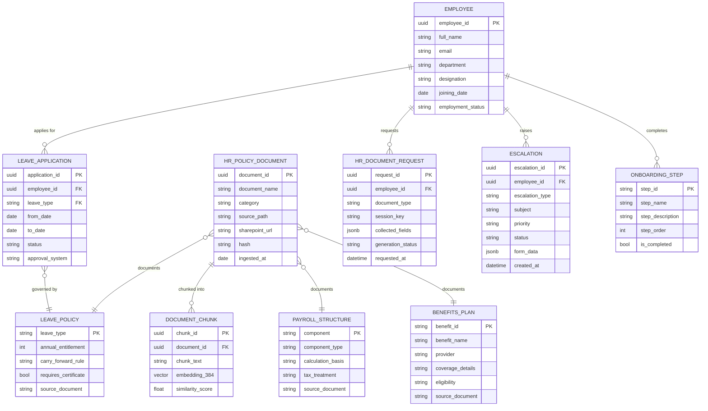
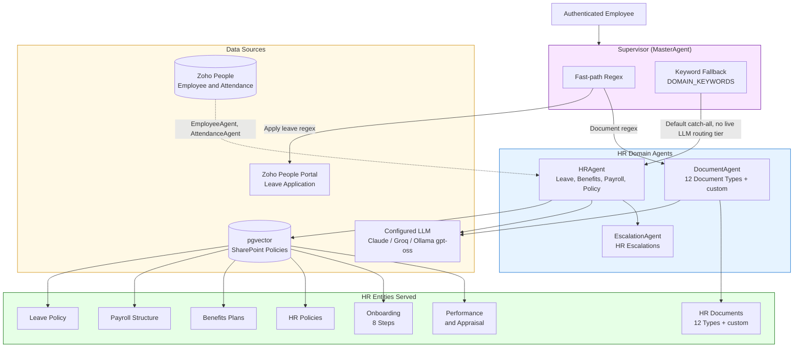

# HR Domain Ontology
## AA-Hackathon Enterprise Assistant — Aligned Automation

**Document ID:** 02-ONTO-001  
**Version:** 1.0  
**Date:** 2026-06-07  
**Organization:** Aligned Automation  
**Classification:** Internal — Technical Specification  
**Owner:** Platform Engineering  

---

## 1. HR Domain Overview

The HR domain is the largest and most frequently accessed domain within the AA-Hackathon Enterprise Assistant. It serves as both a specialized domain agent and the default catch-all agent when the supervisor cannot confidently route a query to another domain.

The HR domain covers the full employee lifecycle at Aligned Automation: from onboarding through active employment (leave, payroll, benefits, policy) to offboarding (resignation, full-and-final settlement, experience letters). It is served by two dedicated agents — **HRAgent** for conversational Q&A and policy retrieval, and **DocumentAgent** for structured document generation — with HRAgent additionally functioning as the graceful fallback for any query that does not match a more specific agent.

### Domain Scope

| Capability | In Scope | Out of Scope |
|---|---|---|
| Leave policy Q&A | Yes | Actual leave approval in Zoho |
| Payroll structure and components | Yes | Payroll disbursement or transactions |
| Benefits plan information | Yes | Insurance claim processing |
| HR policy retrieval | Yes | Legal or regulated professional advice |
| HR document generation | Yes | Digital signing or archival |
| Onboarding guidance | Yes | Physical access provisioning |
| Appraisal process guidance | Yes | Appraisal score entry or modification |
| Escalation to HR team | Yes | Binding HR decisions |

### Routing Authority

The supervisor routes to HRAgent when any of the following match:

- **Fast-path regex:** Apply-leave pattern, document generation triggers
- **Keyword scoring (DOMAIN_KEYWORDS):** leave, benefit, payroll, policy, PTO, sick, maternity, salary, appraisal, grievance, POSH, onboarding, offboarding, resignation, notice, increment
- **Fallback:** Any query that does not match IT, Admin, PMO, Finance, Org, Employee, or Attendance domains

HR contact for escalation: **hr@alignedautomation.com**

---

## 2. Leave Entity

### Leave Types

The HR domain recognizes the following leave types, all documented in ingested SharePoint HR policy documents:

| Leave Type | Code | Key Characteristics |
|---|---|---|
| Annual Leave | AL | Accrued over calendar year; carry-forward rules apply |
| Casual Leave | CL | Short-notice leave; typically 6 days per year |
| Sick Leave | SL | Medical absence; 6 days per year; certificate may be required |
| Maternity Leave | ML | Statutory entitlement; duration per Maternity Benefit Act |
| Paternity Leave | PL | Short-duration leave at birth or adoption of child |
| Parental Leave | PRL | Extended leave for childcare responsibilities |
| Compensatory Off | COMP | Earned by working on designated holidays or weekends |
| Loss of Pay | LOP | Applied when all paid leave is exhausted |
| Work From Home | WFH | Not a leave type; governed by separate WFH policy |

### Leave Balances

Leave balance data resides in the Zoho People system of record. The platform accesses a read-only replica of Zoho PostgreSQL for employee data but does not currently expose individual leave balances through the AssistantAgent query path (balance queries are redirected to the HROne/Zoho People portal).

**System of record:** Zoho People (HROne portal)  
**Portal URL:** https://people.zoho.com/alignedautomationservices/  
**Read access:** Zoho PostgreSQL read-only replica (employee and attendance tables)

### Leave Application Workflow

The platform does not submit leave on behalf of the employee. Leave application is handled entirely within Zoho People. The supervisor fast-path detects apply-leave intent via `_APPLY_LEAVE_RE` regex and returns a direct portal link without invoking the LLM:

```
Apply Leave -> Zoho People portal deep link
https://people.zoho.com/alignedautomationservices/zp#leavetracker/mydata/applyleave
```

The HRAgent answers policy questions about leave types, entitlements, accrual rules, carry-forward limits, and notice requirements — all grounded in pgvector-retrieved policy chunks.

### Leave Approval Chain

Leave approval is a Zoho People workflow and is outside the platform boundary. The assistant can explain the approval chain (employee submits, manager approves, HR ratifies for extended leaves) from policy documents but cannot trigger or track approvals.

---

## 3. Payroll Entity

### Salary Structure

The HRAgent retrieves salary structure information from SharePoint-ingested HR policy and payroll policy documents. The assistant explains components, not individual compensation figures.

**Standard salary components documented in knowledge base:**

| Component | Type | Notes |
|---|---|---|
| Basic Salary | Fixed | Percentage of CTC; base for PF calculation |
| House Rent Allowance (HRA) | Fixed | Percentage of basic; exempt conditions apply |
| Special Allowance | Fixed | Balancing component of CTC structure |
| Medical Allowance | Fixed | Standard statutory amount |
| Transport Allowance | Fixed | Statutory limit applies |
| Performance Bonus | Variable | Discretionary; linked to appraisal rating |
| Leave Travel Allowance (LTA) | Variable | Claimable on actual travel |

### TDS and Tax Deductions

The FinanceAgent (not HRAgent) handles TDS, Form 16, and tax computation queries. HRAgent redirects these queries. However, HRAgent may answer general questions about salary slip components, understanding deduction breakdowns, and the difference between CTC and in-hand salary when grounded in retrieved policy documents.

**TDS routing:** FinanceAgent handles TDS guidance, Form 16 queries, reimbursement policy, and investment declaration processes.

### Payroll Cycle

Information about payroll processing dates, salary credit timelines, and payslip access through HROne is answered by HRAgent from policy documents. Actual payroll transactions remain in the payroll system of record and are not accessible through the platform.

### Form 16

Form 16 queries are routed to FinanceAgent. HRAgent may explain what Form 16 is and where to obtain it, but detailed TDS computation guidance belongs to the Finance domain.

---

## 4. Benefits Entity

### Group Health Insurance (GHI)

The HR domain documents information about Aligned Automation's Group Health Insurance plan, ingested from SharePoint HR documents. The assistant answers questions about coverage scope, sum insured, dependent eligibility, and the claims process as documented in policy.

**Key attributes documented:**
- Provider and policy details (from SharePoint policy documents)
- Coverage for employee, spouse, children, parents (as per plan)
- Cashless hospitalization network
- Claim reimbursement procedure
- Enrollment and mid-year addition procedures

**Integration:** Practo and IL TakeCare are referenced in the HR personality as benefit platforms. The assistant can explain how to access these platforms.

### Provident Fund (PF / EPF)

The assistant explains PF contribution rules (12% of basic salary for employee and employer), UAN registration, PF withdrawal eligibility, and the process for PF transfers. This information is grounded in statutory rules documented in HR policy documents ingested from SharePoint.

**Key attributes:**
- Employee contribution: 12% of basic salary
- Employer contribution: 12% (split between EPF and EPS)
- UAN: Universal Account Number, portable across employers
- Withdrawal: Eligibility after 5 years of continuous service for tax-free withdrawal

### Gratuity

Gratuity eligibility, calculation formula (15/26 of last drawn basic salary per year of service), and payment conditions (minimum 5 years of continuous service) are documented in HR policy and retrievable by HRAgent.

### National Pension System (NPS)

NPS enrollment, tier structure (Tier I mandatory, Tier II voluntary), and tax benefit documentation (Section 80CCD) are covered in policy documents available to HRAgent.

### Other Benefits

- Certification and training reimbursement programs
- Employee referral program
- Employee Assistance Programs (as documented in SharePoint)

---

## 5. HR Policy Entity

### Policy Document Corpus

HR policy documents are the primary knowledge source for HRAgent. All policy documents are ingested from SharePoint document libraries through the scheduled SharePoint ingestion job.

**Ingestion pipeline:**
1. SharePoint document library sync (PDF, DOCX) via Microsoft Graph API
2. Hash-based change detection (NEW / CHANGED / DELETED)
3. TextExtractor extracts plain text
4. TextChunker splits into 1000-character chunks with 200-character overlap
5. HuggingFace nomic-embed-text-v1.5 encodes to 768-dimensional vectors
6. Vectors stored in `document_chunks.embedding` (pgvector vector[768])
7. Retrieval at query time: cosine similarity, threshold 0.10, top 3 chunks

**SharePoint data folders mapped to HRAgent:**
- `HR Policies` (defined in `HRAgent._DATA_FOLDERS`)
- `HR Document`

### Active Policy Categories

| Policy Category | Key Topics |
|---|---|
| Leave Policy | All leave types, entitlements, application procedures |
| POSH Policy | Prevention of Sexual Harassment at Workplace |
| Grievance Policy | Grievance redressal process and escalation paths |
| WFH Policy | Work-from-home eligibility, guidelines, equipment |
| Code of Conduct | Office behavior, ethics, conflict of interest |
| Separation Policy | Resignation, notice period, full-and-final settlement |
| Onboarding Policy | New hire procedures, probation period, confirmation |
| Benefits Policy | GHI, PF, gratuity, NPS details |
| Performance Policy | Appraisal cycle, rating scale, promotion criteria |

### Policy Retrieval Behavior

HRAgent grounds every answer in retrieved policy chunks. When no relevant chunks are found (cosine similarity below 0.10 across all candidates), the agent states uncertainty and provides the HR contact rather than generating an answer from LLM parametric memory.

**Adaptive retry:** If pgvector returns no results, the query is simplified (stopwords removed, rephrased) and retried before falling back to FAISS local index.

---

## 6. HR Document Entity

### DocumentAgent Capabilities

The DocumentAgent generates professional HR documents through a multi-turn conversational workflow. It is a separate agent from HRAgent and is triggered by the supervisor's fast-path regex for document generation intents.

**Session management:** One active document session per user, keyed by user email or user ID. Session state is maintained in-memory with a 30-minute timeout. Sessions survive between turns but expire after inactivity.

### Supported Document Types (12 Types, plus custom)

| Document Key | Document Name | Primary Purpose |
|---|---|---|
| `loan_proof` | Loan Proof / Employment Verification Letter | Bank loan applications, financial proofs |
| `experience_letter` | Experience Letter | Post-separation proof of employment duration and role |
| `employment_verification` | Employment Verification Letter | Background verification by third parties |
| `offer_letter` | Offer Letter | Formal employment offer to new hires |
| `relieving_letter` | Relieving Letter | Formal separation confirmation and clearance |
| `address_proof` | Address Proof Letter | Residential address certification |
| `bonafide` | Bonafide Certificate | Visa applications, bank account opening, general proof |
| `internship_certificate` | Internship Completion Certificate | Intern completion record |
| `promotion_letter` | Promotion Letter | Formal promotion and revised compensation notification |
| `noc` | No Objection Certificate (NOC) | Higher studies, part-time work, travel clearance |
| `confirmation_letter` | Employee Confirmation Letter | Probation completion and permanent employment confirmation |
| `id_card_request` | ID Card Request Letter | Lost, damaged, or new joining ID card requests |
| `custom` | Custom Document | Free-text mode for document types not covered above |

### Required Fields Per Document Type

Each document type has a defined set of required fields that the DocumentAgent collects through multi-turn conversation before generating. Example for `loan_proof`:

| Field | Label |
|---|---|
| employee_name | Employee Full Name |
| employee_id | Employee ID |
| department | Department |
| designation | Designation / Job Title |
| salary | Monthly/Annual Salary |
| joining_date | Date of Joining |
| purpose | Purpose of Letter |
| company_name | Company Name |
| signatory_name | Authorized Signatory Name and Designation |

### Document Generation Pipeline

```
User request -> Keyword/LLM doc-type detection
           -> Session created or resumed
           -> Fields extracted from user message (LLM extraction)
           -> Missing fields prompted conversationally
           -> All fields collected -> LLM generates document
           -> Fallback: deterministic template if LLM returns empty
           -> Document wrapped and returned as markdown
```

**Generation model:** Configured LLM provider — Anthropic Claude, Groq, or Ollama gpt-oss at ml01.alignedautomation.com:11434 (default/fallback), selected by priority via env flags (max_tokens: 2048)  
**Format:** Markdown suitable for PDF conversion via jsPDF (frontend)  
**Fallback:** `_template_document()` — deterministic template, never returns empty  
**Reference format:** `REF/{year}/{4-digit-number}` auto-generated  
**Output format:** Formal letter with company name, document title, reference, date, salutation, subject, body, and signature block

### Document Generation Constraints

- Document Agent does not access pgvector or Zoho; it is template-driven with LLM-composed body text
- Generated documents are not stored in the platform database or submitted to any system
- Users are responsible for printing, distributing, or submitting the generated document
- Digital signing and formal HR approval remain out of platform scope
- Cancel/reset patterns (`cancel`, `stop`, `quit`, `abort`, `never mind`) terminate active sessions

---

## 7. Onboarding Process

### 8-Step Onboarding Workflow

The OnboardingGuidancePage provides a structured 8-step guided experience for new hires. This is a frontend module distinct from the conversational HRAgent.

| Step | Name | Purpose |
|---|---|---|
| 1 | WelcomeStep | Platform introduction, orientation to the assistant |
| 2 | ProfileStep | User profile setup, confirmation of Azure AD profile |
| 3 | TeamStep | Introduction to team structure and reporting manager |
| 4 | ITAccessStep | IT access provisioning guidance (VPN, laptop, email) |
| 5 | DocumentsStep | Key HR documents to review and acknowledge |
| 6 | PolicyStep | HR policy overview (leave, WFH, POSH, code of conduct) |
| 7 | InductionStep | Company culture, mission, values, and org structure |
| 8 | AllSetStep | Onboarding completion confirmation |

### HR Notes and Checklists

HRAgent can answer questions about onboarding procedures from SharePoint-ingested onboarding guides. This includes probation period duration, confirmation timeline, first-day checklist, and HR documentation requirements for new joiners.

### Probation and Confirmation

HRAgent retrieves and explains the probation period (typically 3-6 months as documented in policy), the performance criteria for confirmation, and the confirmation letter process. The DocumentAgent generates the Confirmation Letter once all required fields are provided.

### Training and Induction

Training program information, mandatory induction sessions, and learning management system (LMS) access are covered in HR policy documents. HRAgent retrieves these details from the pgvector knowledge base.

---

## 8. Performance Management

### Appraisal Cycle

HRAgent answers questions about the appraisal process, rating scale, timeline, self-assessment procedure, and manager review process — all grounded in performance management policy documents from SharePoint.

**Key appraisal concepts documented:**
- Appraisal cycle frequency (annual or semi-annual)
- Rating scale and descriptors
- Self-assessment submission deadline
- Manager review and calibration process
- Final rating communication timeline
- Linkage between rating and increment/bonus

### Promotion Process

HRAgent explains the promotion eligibility criteria, nomination process, and approval chain. The DocumentAgent generates the formal **Promotion Letter** once the relevant employee data is collected.

**Promotion Letter required fields:** employee_name, employee_id, current_designation, new_designation, department, effective_date, new_salary, company_name, signatory_name.

### Increment Letters

Increment-related queries may use the `promotion_letter` document type (aliased as `increment letter`, `appraisal letter`) or be answered conversationally by HRAgent from policy context.

### Performance Improvement Plans (PIP)

HRAgent can explain the PIP process, triggers, duration, and support mechanisms from HR policy documents. PIP-related queries that require HR intervention are escalated through the EscalationAgent to the HR team.

---

## 9. Employee Support Patterns

### Common Query Patterns and Agent Behavior

| User Query Pattern | Fast-Path? | Routing | Response Type |
|---|---|---|---|
| "How many leaves do I have?" | No | HRAgent | Policy explanation + Zoho portal redirect |
| "Apply for leave" | Yes (regex) | Supervisor (no LLM) | Zoho portal direct link |
| "What is the WFH policy?" | No | HRAgent | pgvector retrieval + LLM generation |
| "Generate experience letter" | Yes (regex) | DocumentAgent | Multi-turn field collection |
| "What benefits does the company offer?" | No | HRAgent | pgvector retrieval + LLM generation |
| "My payslip shows wrong deduction" | No | HRAgent | Policy context + HR escalation |
| "How does the PF contribution work?" | No | HRAgent | pgvector retrieval + LLM generation |
| "I need to resign" | No | HRAgent | Separation policy + process steps |
| "What is the notice period?" | No | HRAgent | pgvector retrieval + LLM generation |
| "POSH policy" | No | HRAgent | pgvector retrieval + LLM generation |

### Escalation Patterns

When HRAgent cannot resolve a query (no relevant knowledge chunks, sensitive matter, or actionable HR request), it routes to EscalationAgent. Common escalation triggers in the HR domain:

- Payroll dispute or discrepancy requiring HR review
- Harassment or POSH-related concerns
- Separation-related full-and-final settlement disputes
- Leave regularization or attendance correction
- HR process complaints or grievance filings

**EscalationAgent creates an internal escalation record** with priority, subject, and form_data (JSONB) stored in the `escalations` table. HR team is notified through internal channels; no outbound ITSM push is implemented.

### Distress Signal Handling

The Tier 2 organizational guardrail in `guardrails.py` detects employee distress signals embedded in HR-domain queries (e.g., expressions of extreme workplace stress, mental health concerns). These are intercepted before reaching HRAgent and receive an empathetic LLM-generated response with appropriate support resources.

---

## 10. Data Sources

### SharePoint (Primary Knowledge Source)

All HR policy documents are ingested from SharePoint document libraries into the platform's pgvector store. This is the authoritative knowledge source for HRAgent.

| Attribute | Value |
|---|---|
| Integration type | Read-only ingestion via Microsoft Graph API |
| Ingestion schedule | Scheduled batch job |
| Change detection | SHA-256 hash per file; NEW / CHANGED / DELETED states |
| File formats | PDF, DOCX (primary), XLSX, PPTX |
| Chunking | 1000 characters, 200-character overlap |
| Embedding model | sentence-transformers/nomic-embed-text-v1.5 (768 dimensions) |
| Vector store | pgvector (document_chunks table, cosine distance) |
| Fallback | FAISS local index |
| Similarity threshold | 0.10 (permissive; returns top 3 chunks) |
| Data folders | HR Policies, HR Document (mapped in HRAgent._DATA_FOLDERS) |

### Zoho People (Employee and Attendance Data)

Zoho People is the HR system of record. The platform accesses a read-only PostgreSQL replica.

| Attribute | Value |
|---|---|
| Integration type | Read-only PostgreSQL connection |
| Access model | ThreadedConnectionPool (min=1, max=8), RealDictCursor |
| Data available | Employee directory, attendance records, allocation |
| Data not available | Leave balances, payroll transactions, performance data |
| Credentials | ZOHO_DB_HOST, ZOHO_DB_PORT, ZOHO_DB_NAME, ZOHO_DB_USER, ZOHO_DB_PWD |
| Agents using Zoho | EmployeeAgent, AttendanceAgent (not HRAgent directly) |

### Platform PostgreSQL (Conversation and Document State)

| Table | HR-Relevant Content |
|---|---|
| conversations | HR conversation sessions |
| messages | HR query and response history |
| feedback | Per-message rating for HR responses |
| escalations | HR escalation tickets with form_data JSONB |
| audit_logs | All HR agent actions with user_id and entity_type |
| documents | Ingested HR policy document metadata |
| document_chunks | Chunked and embedded HR policy content |

---

## 11. HR Domain Model



---

## 12. HR Agent Capabilities Mapped to Entities

| Entity | HRAgent Capability | DocumentAgent Capability | Data Source |
|---|---|---|---|
| Leave Policy | Explain leave types, entitlements, accrual rules, carryforward | — | pgvector (SharePoint) |
| Leave Application | Explain application process, redirect to Zoho portal | — | Zoho People portal (redirect) |
| Payroll Structure | Explain CTC components, HRA, allowances, deductions | — | pgvector (SharePoint) |
| TDS / Form 16 | Redirect to FinanceAgent | — | FinanceAgent |
| Benefits | Explain GHI, PF, gratuity, NPS coverage and processes | — | pgvector (SharePoint) |
| HR Policy | Retrieve and explain POSH, WFH, conduct, grievance, separation policy | — | pgvector (SharePoint) |
| Onboarding | Explain probation, confirmation, induction, documentation checklist | Confirmation Letter generation | pgvector (SharePoint) |
| Performance | Explain appraisal cycle, ratings, self-assessment process | Promotion Letter generation | pgvector (SharePoint) |
| HR Documents | Explain when and why documents are needed | Generate all 12 document types (plus custom) | LLM template generation |
| Escalation | Detect need, route to EscalationAgent | — | Platform PostgreSQL (escalations) |
| Employee Directory | Redirect to EmployeeAgent | — | Zoho People PostgreSQL |
| Attendance | Redirect to AttendanceAgent | — | Zoho People PostgreSQL |

### Supervisor Routing Signal Strength

| Signal Type | HR Keywords / Patterns |
|---|---|
| Fast-path regex (no LLM) | Apply leave, generate letter, employment verification, experience letter |
| Keyword fallback scoring (`DOMAIN_KEYWORDS`) | leave policy, benefit, payroll structure, POSH, grievance, appraisal, WFH, leave, sick, maternity, salary, PF, gratuity, increment, notice period, resignation |
| Catch-all fallback | Any unrouted query that does not match other domains |

Note: an LLM-based intent classification method (`_route_llm()`) exists in `supervisor_agent.py` but is never invoked in the current build — routing to HRAgent runs on the two live tiers above, not a three-tier design.

---

## 13. Future HR Domain Extensions

### FHR-01: Zoho Leave Submission Write-Back (Phase 2)
Enable the assistant to submit leave applications directly to Zoho People through the Zoho API. Every submission must go through a confirmation step where the structured leave request payload is presented to the user for explicit approval. This eliminates the current portal redirect and allows end-to-end leave application within the chat interface.

**Dependency:** Zoho People API write credentials and HR governance approval for AI-initiated write operations.

### FHR-02: Leave Balance Retrieval
Surface real-time leave balances from Zoho People directly in chat responses. Currently, balance queries redirect users to the HROne portal. A direct balance query API (or Zoho API integration) would allow the assistant to respond with the current balance inline.

**Dependency:** Zoho People API (balance endpoint) or Zoho PostgreSQL schema mapping for leave balance tables.

### FHR-03: Payslip Access Integration
Allow employees to retrieve their payslip PDF for a given month through the assistant. Requires integration with the payroll system or HROne payslip download endpoint.

**Dependency:** Payroll system API or HROne integration credentials.

### FHR-04: Appraisal Data Access
Expose appraisal history (ratings per cycle, promotion history) from Zoho or the HR system. This requires HR data classification approval given the sensitive nature of performance data.

**Dependency:** HR data governance approval, Zoho Performance module access.

### FHR-05: Proactive HR Nudges
Implement an agent-initiated notification system that proactively reminds employees about upcoming events: leave balance expiry, pending appraisal self-assessment submissions, probation end dates, document renewals. Delivered via the frontend notification layer or email drafts.

**Dependency:** Scheduler service (Phase 2), notification channel configuration.

### FHR-06: POSH and Grievance Structured Reporting
Build a structured POSH complaint or grievance submission workflow within the EscalationAgent, with mandatory fields, confidentiality assurances, and direct routing to the POSH committee or HR grievance cell — separate from standard escalation tickets.

**Dependency:** HR policy approval for AI-mediated POSH intake, defined escalation routing rules.

### FHR-07: HR Policy Knowledge Gap Detection
Implement a weekly automated job that clusters queries where pgvector retrieval returned no chunks above threshold. Present the clustered gap list to HR content owners for targeted policy document authoring. This directly improves HRAgent retrieval quality over time.

**Dependency:** Analytics pipeline enhancement, HR content owner engagement.

### FHR-08: Manager-Tier HR Visibility
Extend HRAgent responses with role-contextual information for managers (Azure AD group membership from Microsoft Graph User.Read scope). A manager asking about leave policy receives team-level leave management guidance in addition to individual entitlement information. Role context is injected into the LLM system prompt at query time.

**Dependency:** Azure AD group membership retrieval (already within User.Read scope), role-context injection in BaseDeepAgent.

### FHR-09: Multi-Language HR Policy Support
Extend the embedding pipeline to support multilingual queries for Hindi and Tamil-speaking employees. Use a multilingual embedding model (paraphrase-multilingual-nomic-embed-text-v1.5-L12-v2, 768-dim compatible) as a drop-in replacement to preserve the existing pgvector schema.

**Dependency:** Embedding model swap, LLM prompt localization for HR responses.

### FHR-10: Digital Document Signing Integration
Integrate with a document signing service (DocuSign or Adobe Sign) to route generated HR documents (offer letters, confirmation letters, promotion letters) through a digital signature workflow without leaving the platform.

**Dependency:** Digital signature provider API integration, HR approval for AI-assisted document routing.

---

## Appendix: HR Domain Entity Relationships Summary



---

*This document is the authoritative HR domain ontology for the AA-Hackathon Enterprise Assistant platform. Updates must be synchronized with HRAgent personality definitions in `personalities.py`, DocumentAgent type catalogue in `document_agent.py`, and supervisor routing rules in `supervisor_agent.py`.*

*Maintained by: Platform Engineering, Aligned Automation*  
*Next review: 2026-09-07*
