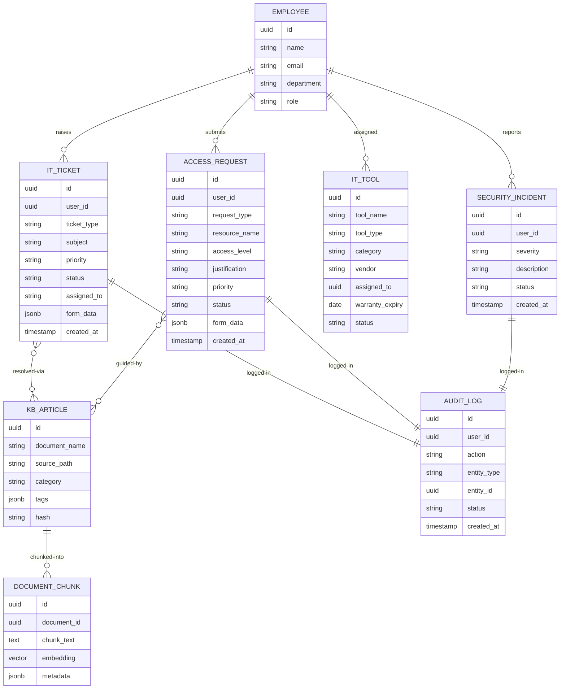

# IT Domain Ontology

**Document:** 02-ontology/it-domain.md
**Organization:** Aligned Automation
**Platform:** AA-Hackathon Enterprise Assistant
**Domain Owner:** IT Department
**Last Updated:** 2026-06-07

---

## 1. IT Domain Overview

The IT domain covers all technology-related requests, issues, and services that employees at Aligned Automation require to perform their work. Within the AA-Hackathon Enterprise Assistant platform, the IT domain is served by the **ITAgent** (`agents/it_agent.py`), which handles queries routed from the MasterAgent supervisor.

The IT domain spans five core capability areas:

- **Access and Identity** — VPN, system logins, Active Directory, SSO, software licenses
- **Hardware and Peripherals** — laptops, monitors, keyboards, phones, and peripherals
- **Network and Connectivity** — VPN, Wi-Fi, proxy, DNS, firewall
- **Security and Compliance** — incident reporting, endpoint protection, data handling
- **Service and Support** — helpdesk tickets, knowledge base lookup, troubleshooting

All IT-domain knowledge is sourced from SharePoint-ingested documents stored as 768-dimensional pgvector embeddings in the `document_chunks` table. Escalations requiring human intervention are persisted in the `escalations` table and routed through the EscalationAgent.

### Domain Boundary Conditions

| Query Type | Handled By |
|---|---|
| VPN setup, password reset, software install | ITAgent (pgvector retrieval) |
| Hardware request, new laptop order | ITAgent + EscalationAgent (if form needed) |
| Security incident report | ITAgent fast-path + EscalationAgent |
| Employee directory lookups | EmployeeAgent (Zoho DB) |
| Office facilities, parking | AdminAgent |
| Finance system access | FinanceAgent cross-domain |

---

## 2. Access Request Entity

Access requests represent employee requests to gain or modify access to systems, applications, networks, or data resources.

### Entity Definition

```
AccessRequest {
  id:               UUID (maps to escalations.id)
  user_id:          UUID (requesting employee)
  request_type:     ENUM [vpn, software, system, email_group, share_drive, admin_rights]
  resource_name:    STRING (e.g., "Jira", "AWS Console", "Finance System")
  justification:    TEXT
  approver_id:      UUID (manager or IT lead)
  priority:         ENUM [low, medium, high]
  status:           ENUM [pending, approved, rejected, provisioned]
  form_data:        JSONB (structured request details)
  created_at:       TIMESTAMP
  updated_at:       TIMESTAMP
  is_deleted:       BOOLEAN
}
```

### Mapped Database Table

Access requests are stored in the `escalations` table with `escalation_type = 'it_access'`. The `form_data` JSONB column stores structured fields:

```json
{
  "resource": "string",
  "access_level": "read | write | admin",
  "business_justification": "string",
  "duration": "permanent | temporary",
  "temporary_until": "ISO date string or null"
}
```

### Common Access Request Types

| Type | Resource Examples | Approver |
|---|---|---|
| VPN | Cisco AnyConnect, GlobalProtect | IT Lead |
| Software License | Microsoft 365, Jira, Figma | Manager + IT |
| System Access | ERP, Finance, HR systems | System Owner |
| Shared Drive | SharePoint libraries, network drives | Department Head |
| Admin Rights | Local admin, elevated privileges | IT Security |
| Email Group | Distribution lists, shared mailboxes | IT + HR |

---

## 3. IT Tool Entity

IT tools represent hardware assets, software products, and licensed services managed by the IT department.

### Entity Definition

```
ITTool {
  id:               UUID
  tool_name:        STRING
  tool_type:        ENUM [hardware, software, saas, infrastructure]
  category:         ENUM [laptop, peripheral, license, server, network_device]
  vendor:           STRING
  assigned_to:      UUID (employee, references Zoho employees)
  license_key:      STRING (encrypted, optional)
  purchase_date:    DATE
  warranty_expiry:  DATE
  status:           ENUM [active, decommissioned, in_repair, available]
  location:         STRING (office, remote, data-centre)
  tags:             JSONB
}
```

### Hardware Categories

| Category | Examples | Management |
|---|---|---|
| Laptops | Dell Latitude, MacBook Pro | Asset register |
| Monitors | External displays, docking stations | Asset register |
| Peripherals | Keyboards, mice, headsets, webcams | Inventory |
| Mobile Devices | Company phones, tablets | MDM |
| Networking | Switches, APs, routers | IT infrastructure |

### Software License Categories

| Category | Tools in Use at Aligned Automation |
|---|---|
| Productivity | Microsoft 365 (Word, Excel, Teams, Outlook) |
| Development | VS Code, JetBrains IDEs, Git, Docker |
| Project Management | Jira, Confluence |
| Design | Figma, Adobe Creative Cloud |
| HR / Payroll | Zoho People |
| Security | Endpoint protection, password manager |
| AI / ML | Configured LLM provider — Anthropic Claude, Groq, or self-hosted Ollama at ml01.alignedautomation.com (default/fallback) |

---

## 4. IT Ticket Entity

IT tickets capture support requests, incidents, and change requests that require IT intervention.

### Entity Definition

```
ITTicket {
  id:               UUID (maps to escalations.id)
  user_id:          UUID (reporter)
  ticket_type:      ENUM [incident, service_request, change_request, access_request]
  subject:          STRING
  description:      TEXT
  priority:         ENUM [critical, high, medium, low]
  status:           ENUM [open, in_progress, on_hold, resolved, closed]
  assigned_to:      STRING (IT agent name or queue)
  resolution_notes: TEXT
  form_data:        JSONB
  created_at:       TIMESTAMP
  updated_at:       TIMESTAMP
  is_deleted:       BOOLEAN
}
```

### Mapping to escalations Table

All IT tickets are stored in the `escalations` table:

| escalations Column | IT Ticket Meaning |
|---|---|
| `escalation_type` | `'it_incident'` or `'it_service_request'` |
| `subject` | Short ticket title |
| `priority` | critical / high / medium / low |
| `status` | open / in_progress / resolved / closed |
| `form_data` | Structured ticket fields (JSONB) |

### Ticket Priority SLA Targets

| Priority | Response Time | Resolution Target |
|---|---|---|
| Critical | 15 minutes | 4 hours |
| High | 1 hour | 8 hours |
| Medium | 4 hours | 2 business days |
| Low | 1 business day | 5 business days |

---

## 5. Knowledge Base Entity

The IT knowledge base consists of policy documents, SOPs, guides, and FAQs ingested from SharePoint and stored as vector embeddings.

### Entity Definition

```
KBArticle {
  id:              UUID (maps to documents.id)
  document_name:   STRING
  source_path:     STRING (SharePoint path)
  category:        STRING (e.g., "VPN Setup", "Password Policy")
  tags:            JSONB
  hash:            VARCHAR (change detection)
  chunks: [
    {
      id:          UUID (document_chunks.id)
      chunk_text:  TEXT (500 token segments, 50 token overlap)
      embedding:   vector[768] (nomic-embed-text / nomic-embed-text-v1.5)
      metadata:    JSONB
    }
  ]
}
```

### Knowledge Base Categories

| Category | Example Documents |
|---|---|
| Access and Identity | VPN Setup Guide, SSO Configuration, Password Policy |
| Hardware Guides | Laptop Setup SOP, Peripheral Request Process |
| Network | Wi-Fi Configuration, Proxy Settings, DNS Guide |
| Security | Acceptable Use Policy, Incident Reporting Procedure |
| Software | Microsoft 365 Guide, Jira Onboarding, Approved Software List |
| Troubleshooting | Common Issues FAQ, Remote Desktop Guide |

### Retrieval Configuration

- Embedding model: `sentence-transformers/nomic-embed-text-v1.5` (768 dimensions)
- Similarity metric: cosine distance via pgvector (`<=>` operator)
- Minimum similarity threshold: 0.10
- Top-K results returned: 3
- Chunk size: 1000 characters, overlap: 200 characters
- Adaptive retry: query simplified and retried if pgvector returns no results

---

## 6. Troubleshooting Patterns

The ITAgent resolves common issues using pgvector retrieval against the knowledge base before escalating to human IT staff.

### Common Issue Categories

| Issue | ITAgent Handling | Escalation Trigger |
|---|---|---|
| Password reset | KB retrieval + self-service link | If SSO locked |
| VPN not connecting | KB retrieval (step-by-step guide) | If persistent failure |
| Laptop won't start | KB retrieval (hardware checklist) | If hardware fault suspected |
| Software install blocked | KB retrieval (approved software list) | If unlisted software needed |
| Slow network / Wi-Fi | KB retrieval (troubleshooting steps) | If building-level outage |
| Email not syncing | KB retrieval (Outlook/Exchange guide) | If mailbox corruption |
| MFA / 2FA issues | KB retrieval (MFA enrolment guide) | If account locked |
| Printer not working | KB retrieval (driver/network setup) | If shared printer failure |
| Remote desktop access | KB retrieval (RDP/AnyDesk guide) | If firewall change needed |
| Application crash | KB retrieval (known issues + fixes) | If new bug reported |

### Resolution Workflow

```
User Query
    |
    v
ITAgent receives query (from MasterAgent routing)
    |
    v
Fast-path check (regex): Is this an escalation trigger?
    |-- Yes --> EscalationAgent
    |-- No  --> pgvector similarity search (document_chunks)
                    |
                    v
             Top-3 KB chunks retrieved (threshold 0.10)
                    |
                    v
             LLM generation: personality + context + query
             (configured provider: Claude / Groq / Ollama gpt-oss, temp=0.1, 800 tokens)
                    |
                    v
             Response streamed via SSE to frontend
                    |
                    v
             User confirms resolved or requests escalation
```

---

## 7. Password and Account Management

### Supported Operations

| Operation | Self-Service | ITAgent Guided | IT Escalation |
|---|---|---|---|
| Active Directory password reset | Yes (Azure AD SSPR) | Guide link | If SSPR fails |
| Account unlock | Via Azure AD portal | Step-by-step | If admin unlock needed |
| MFA enrolment | Yes (Authenticator app) | Enrolment guide | If device lost |
| MFA device replacement | Partial (trusted device) | Guide + ticket | IT action required |
| SSO setup for new app | No | KB guide | IT provisioning |
| Service account creation | No | Request form | IT + approver |

### Password Policy (from KB)

- Minimum length: 12 characters
- Complexity: uppercase, lowercase, number, symbol required
- Expiry: 90 days
- History: last 10 passwords not reusable
- Lockout: 5 failed attempts triggers 15-minute lockout
- MFA: mandatory for all staff via Microsoft Authenticator

### Account Lifecycle

```
New Hire Onboarding
    --> Azure AD account creation (IT)
    --> MFA enrolment (employee, guided by OnboardingGuidance)
    --> License assignment (Microsoft 365, Jira, etc.)
    --> VPN provisioning (if required by role)

Offboarding
    --> Account disabled on last day (HR-triggered IT ticket)
    --> Licenses reclaimed within 30 days
    --> Data backup before deletion (90-day retention)
```

---

## 8. Network and VPN

### Network Topology (Conceptual)

| Segment | Purpose | Access |
|---|---|---|
| Corporate LAN | Office internal network | On-site employees |
| VPN Tunnel | Secure remote access | Remote employees |
| DMZ | Public-facing services | Controlled |
| Data Centre VLAN | Servers, DB, ML infra | IT staff only |
| Guest Wi-Fi | Visitor internet | Isolated from corporate |

### VPN Configuration

- **Product:** Cisco AnyConnect or GlobalProtect (policy document in KB)
- **Authentication:** Azure AD SSO + MFA
- **Split tunnelling:** Configured per role (developers get broader access)
- **Ollama ML server:** `ml01.alignedautomation.com:11434` — accessible from VPN only
- **Database host:** `hackathon.alignedautomation.com:5432` — VPN-gated

### VPN Troubleshooting Topics (ITAgent KB)

1. Installation and initial setup
2. Certificate errors and trust store
3. Authentication failures (MFA loop)
4. Slow VPN performance (split-tunnel guidance)
5. VPN client upgrade procedure
6. macOS / Windows specific issues

---

## 9. Hardware Management

### Hardware Request Lifecycle

```
Employee submits hardware request via ITAgent
    |
    v
ITAgent: KB retrieval (request process guide)
    |
    v
EscalationAgent: creates escalation record (escalation_type='hardware_request')
    |
    v
IT reviews and approves (manual step)
    |
    v
Asset assigned (recorded in asset management system)
    |
    v
Employee notified via Teams / email
```

### Asset Categories and Attributes

| Asset Type | Key Attributes | Typical Lifecycle |
|---|---|---|
| Laptop | Model, serial, RAM, storage, OS, assigned_to | 3-4 years |
| Monitor | Size, resolution, port type, location | 5 years |
| Headset / Webcam | Model, assigned_to | 3 years |
| Mobile Phone | IMEI, carrier, MDM enrolled | 2-3 years |
| Docking Station | Port config, location | 4 years |
| Network Equipment | IP, firmware version, location | 5-7 years |

### Hardware Issue Resolution

| Issue | ITAgent Action |
|---|---|
| Laptop slow / freezing | KB: performance tuning guide |
| Screen/display problems | KB: display driver, monitor settings |
| Keyboard/mouse not working | KB: driver reinstall, USB troubleshooting |
| Hardware fault suspected | Creates IT ticket via EscalationAgent |
| Replacement needed | Escalation form (priority based on urgency) |

---

## 10. Security Incidents

### Incident Classification

| Severity | Examples | Response |
|---|---|---|
| P1 - Critical | Ransomware, data breach, credential compromise | Immediate IT + Management escalation |
| P2 - High | Phishing success, malware detected, unauthorised access | IT Security response within 1 hour |
| P3 - Medium | Suspicious email, policy violation, lost device | IT review within 4 hours |
| P4 - Low | Spam, weak password alert, minor policy query | ITAgent KB guidance |

### Security Incident Workflow

```
User reports security incident to ITAgent
    |
    v
ITAgent: fast-path detection (regex: "breach", "hacked", "ransomware", "phishing")
    |
    v
EscalationAgent: creates high-priority escalation
    (escalation_type='security_incident', priority='critical' or 'high')
    |
    v
Audit log entry created (audit_logs table)
    |
    v
IT Security team notified
    |
    v
PII controller engaged if personal data at risk
    (pii_controller.py, pii_service.py)
```

### Guardrails Integration

The ITAgent operates within the platform's guardrail layers:

- **Tier 1 (Generic):** Blocks jailbreak attempts disguised as IT requests
- **Tier 2 (Organisational):** Detects distress signals from users reporting incidents; provides empathetic response before escalation
- **PII Tracking:** `pii_controller.py` flags any PII mentioned in IT queries (e.g., passwords accidentally typed in chat); entries written to `pii_redactions` and `pii_events` tables

### Acceptable Use Policy (from KB)

Key rules surfaced by ITAgent on request:

1. Company devices must not be used for personal commercial activity
2. Unapproved software installation is prohibited
3. Sensitive data must not be stored on personal cloud drives
4. Security incidents must be reported within 1 hour of discovery
5. VPN must be active when accessing internal systems remotely

---

## 11. Data Sources

### Primary Data Sources

| Source | Content | Integration Method |
|---|---|---|
| SharePoint IT Library | VPN guides, password policy, hardware SOPs, security policies, troubleshooting FAQs | SharePoint ingestion job (Phase 1 file sync) |
| pgvector (document_chunks) | 768-dim embeddings of all ingested IT documents | Cosine similarity retrieval in ITAgent |
| escalations table (PostgreSQL) | IT tickets, access requests, security incidents, hardware requests | Direct DB read/write via ITAgent and EscalationAgent |
| audit_logs table | IT action audit trail | Written on every escalation and sensitive action |
| Azure AD / Microsoft Graph | User identity, group membership, license info | Graph API (read-only for context) |

### SharePoint Ingestion Details

- **Sync schedule:** Configured via SharePoint ingestion job (`jobs/sharepoint_ingestion/`)
- **Supported formats:** PDF, DOCX, XLSX, PPTX
- **Change detection:** SHA-256 hash comparison (NEW / CHANGED / DELETED)
- **Chunking:** 1000 characters per chunk, 200 character overlap
- **Embedding:** HuggingFace `nomic-embed-text-v1.5` → 768-dim vector stored in `document_chunks.embedding`
- **Tags:** Source URL and document category stored in `documents.tags` JSONB and `document_chunks.metadata` JSONB

### Retrieval SQL Pattern

```sql
SELECT
    dc.chunk_text,
    dc.metadata,
    d.document_name,
    d.source_path,
    d.tags->>'source_url' AS source_url,
    1 - (dc.embedding <=> :query_vector::vector) AS similarity
FROM document_chunks dc
JOIN documents d ON dc.document_id = d.id
WHERE d.is_deleted = FALSE
  AND dc.is_deleted = FALSE
  AND d.tags @> '{"domain": "it"}'
ORDER BY similarity DESC
LIMIT :top_k;
```

---

## 12. IT Domain Model (Mermaid Diagram)



---

## 13. IT Agent Capabilities

### ITAgent (`agents/it_agent.py`)

The ITAgent is a domain agent that inherits from `BaseDeepAgent` (`base_deep_agent.py`) and handles all IT-domain queries routed by the MasterAgent supervisor.

### Routing Triggers

The MasterAgent routes queries to ITAgent based on two live tiers:

- **Fast-path regex:** Keywords such as `vpn`, `password`, `laptop`, `software install`, `network`, `printer`, `access request`, `antivirus`, `wi-fi`, `reset`, `locked out`
- **DOMAIN_KEYWORDS scoring:** Keyword-dict scoring used as the catch-all when no regex matches

An LLM-based intent classification method (`_route_llm()`) exists in `supervisor_agent.py` but is never invoked in the current build — it is not a live routing tier.

### Retrieval Pipeline

1. **Conditional retrieval chain** (not a parallel `asyncio.gather` across sources):
   - pgvector similarity search on `document_chunks` (IT-tagged documents) is tried first
   - Only if pgvector returns zero results does the agent fall back to the local, per-domain FAISS/keyword knowledge base
   - User memory context (MarkdownStore) is included when available
   - Optional Tavily web search (if `TAVILY_API_KEY` present) may supplement the result
2. **Adaptive retry:** Query simplified and retried once against pgvector if it returns no results above threshold (0.10), before falling back to FAISS
3. **Context assembly:** Memory + pgvector chunks (or FAISS chunks on fallback) + optional web results combined
4. **LLM generation:** Single call to the configured provider (Anthropic Claude, Groq, or Ollama `gpt-oss` as the default/fallback, selected by priority via env flags; temperature=0.1, 800 tokens max, 2048 context window)
5. **Response delivery:** SSE streaming via `POST /api/chat/stream`

### Supported User Intents

| Intent | Example Query | ITAgent Action |
|---|---|---|
| VPN setup | "How do I connect to VPN?" | KB retrieval + step-by-step guide |
| Password reset | "I forgot my password" | KB retrieval + Azure AD SSPR link |
| Software request | "I need Figma installed" | KB retrieval + escalation form |
| Hardware request | "My laptop battery is dead" | KB retrieval + IT ticket creation |
| Access request | "I need access to the Finance system" | KB retrieval + access form |
| Network issue | "Wi-Fi is very slow" | KB retrieval + troubleshooting steps |
| Security query | "I received a phishing email" | KB retrieval + security incident escalation |
| Policy query | "What software can I install?" | KB retrieval (Acceptable Use Policy) |
| Account locked | "My account is locked" | KB retrieval + self-service unlock guide |
| MFA setup | "How do I set up Authenticator?" | KB retrieval + enrolment guide |

### Response Characteristics

- **Tone:** Professional, clear, step-oriented
- **Format:** Numbered steps for procedures, bullet lists for options
- **Citations:** Source document names and SharePoint paths included in response metadata (`messages.sources` JSONB)
- **Escalation handoff:** Smooth handoff to EscalationAgent when ITAgent cannot self-serve the request

---

## 14. Future IT Domain Extensions

### Planned Enhancements

| Enhancement | Description | Priority |
|---|---|---|
| Asset Management Integration | Connect to a CMDB or asset register for real-time asset status queries | High |
| Automated Ticket Creation | ITAgent creates Jira/ServiceNow tickets directly via API, not just escalation records | High |
| Patch Management Queries | Agent answers questions about pending OS/software patches on a user's device | Medium |
| MDM Integration | Query device health, compliance status, and installed apps via Intune/Jamf API | Medium |
| Network Monitoring | Agent surfaces network status alerts (outages, degraded performance) in real time | Medium |
| Automated Account Provisioning | ITAgent triggers Azure AD account actions (password reset, MFA reset) via Graph API | High |
| Software Licence Utilisation | Agent answers "how many Jira licences are used?" via licence management API | Low |
| IT Knowledge Base Auto-Update | Trigger SharePoint re-ingestion when a KB article is updated (webhook-driven) | Medium |
| Proactive Alerts | Notify employees via chat when their password is expiring or device needs update | Medium |
| IT Spend Analytics | Surface IT cost per team, licence cost breakdowns via FinanceAgent cross-domain | Low |

### Integration Candidates

| System | Integration Type | Data Exchanged |
|---|---|---|
| Microsoft Intune | REST API (read) | Device compliance, patch status |
| Jira Service Management | REST API (read/write) | Ticket creation, status updates |
| ServiceNow | REST API (read/write) | ITSM ticket management |
| Azure AD Graph API | REST API (read/write) | Account, group, licence management |
| PRTG / Zabbix | REST API (read) | Network and server monitoring |
| CMDB (any) | REST API or DB | Asset lifecycle data |

### Ontology Gaps (Current State)

1. **No real-time asset data:** IT tools are conceptual entities only; no live CMDB connected
2. **No ticket status tracking:** Escalations created but not updated from external ticketing system
3. **No patch/compliance data:** Device health not surfaced by ITAgent today
4. **No licence usage data:** Licence counts not queryable by employees
5. **Limited network topology knowledge:** Network queries rely on static KB documents only

---

*End of IT Domain Ontology — 02-ontology/it-domain.md*
