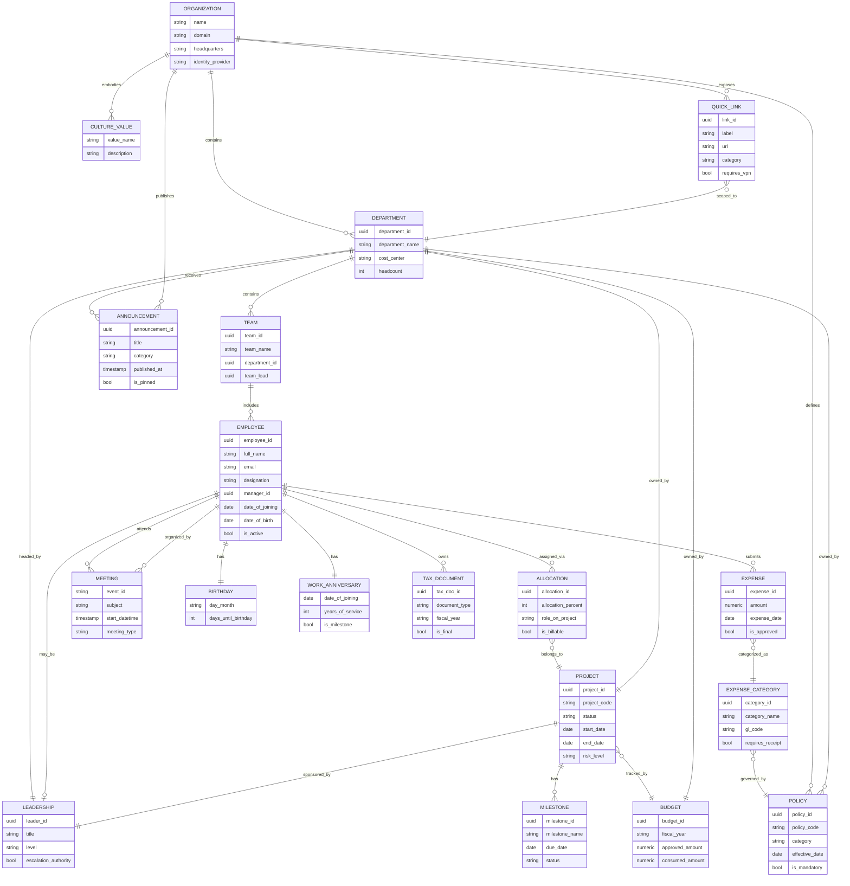

# AA-Hackathon Enterprise Assistant — Organization Domain Ontology

**Document ID:** 02-ONT-002  
**Version:** 1.0  
**Date:** 2026-06-07  
**Organization:** Aligned Automation  
**Classification:** Internal — Technical Reference

---

## 1. Organization Domain Overview

The Organization Domain is the foundational ontological layer of the AA-Hackathon Enterprise Assistant. It models all entities related to Aligned Automation's corporate structure, personnel hierarchy, culture, projects, finance, meetings, and external tooling — providing the semantic substrate on which every domain agent operates.

Unlike functional domains (HR, IT, Admin) that describe service workflows, the Organization Domain describes *what Aligned Automation is*: its structure, its people, its projects, its values, and its operational cadence. Agents across all domains draw on this shared ontology to contextualize responses, resolve entity references, and personalize answers to the requesting employee's position within the organization.

### Scope

The Organization Domain covers:

- Corporate hierarchy from organization down to individual contributor
- Departmental and team structure, including cross-functional project teams
- Company-wide announcements and internal communications
- Organization-wide policy artifacts (non-domain-specific)
- Cultural values, leadership principles, and mission anchors
- Leadership entity registry (executives, department heads, team leads)
- PMO project universe (projects, milestones, roles, allocations)
- Finance entities (expense categories, budget owners, cost centers)
- Meeting and calendar entities (Microsoft Calendar integration)
- Employee lifecycle events (birthdays, work anniversaries)
- Quick links (external portals, tool shortcuts)

### Primary Data Sources

| Source | Type | Access Pattern |
|--------|------|----------------|
| SharePoint | Document corpus | Ingested via jobs/sharepoint_ingestion/, pgvector indexed |
| Zoho People | PostgreSQL read-only | Direct query via EmployeeAgent, AttendanceAgent |
| Microsoft Graph API | REST | User profiles, calendar events, Forms |
| pgvector (squadrons DB) | Vector store | Semantic retrieval via all domain agents |
| Markdown Knowledge Base | File store | MarkdownStore, user preferences, org facts |

### Serving Agents

The Organization Domain is primarily served by:

- **OrgAgent** (org_agent.py): company info, mission, culture, structure — pgvector only
- **PMOAgent** (pmo_agent.py): projects, milestones, risk, allocation — pgvector retrieval
- **FinanceAgent** (finance_agent.py): expenses, TDS, tax, Form 16 — pgvector retrieval
- **EmployeeAgent** (employee_agent.py): employee directory, self-service lookups — Zoho People DB
- **AttendanceAgent** (attendance_agent.py): clock-in/out, monthly summary — Zoho People DB
- **QuickAgent** (quick_agent.py): greetings, general company questions — fast conversational path

---

## 2. Organization Entity

The Organization entity represents Aligned Automation as a legal and operational unit. It is the root node of the corporate hierarchy from which all departments, teams, roles, and employees descend.

### Organization Attributes

| Attribute | Value / Description |
|-----------|---------------------|
| name | Aligned Automation |
| domain | alignedautomation.com |
| industry | Professional Services / Intelligent Automation |
| headquarters | India |
| identity provider | Azure Active Directory (tenant-scoped) |
| LLM provider | Configurable by priority — Anthropic Claude, then Groq, then self-hosted Ollama at ml01.alignedautomation.com as the default/fallback (env flags in `agents/working/config.py`) |
| HR system | Zoho People |
| document repository | SharePoint |
| internal assistant | AA-Hackathon Enterprise Assistant |

### Hierarchy Model

```
Organization (Aligned Automation)
├── Department
│   ├── Team
│   │   ├── Role
│   │   │   └── Employee
│   │   └── Project Team (cross-functional)
│   └── Department Head (Leadership Entity)
└── Executive Leadership
    ├── COO
    └── Functional Heads
```

### Department Entity

Each department is an organizational unit with a defined function, head count, and leadership owner.

| Attribute | Description |
|-----------|-------------|
| department_id | Unique identifier (sourced from Zoho People or Azure AD group) |
| department_name | Human-readable label (e.g., Engineering, HR, Finance, IT) |
| department_head | Reference to Leadership Entity |
| cost_center | Budget tracking unit for Finance Entity linkage |
| headcount | Active employee count (derived from Zoho People query) |
| primary_location | Office / remote / hybrid designation |
| parent_department | Optional parent (for sub-department structures) |

### Team Entity

Teams are sub-units within departments, often aligned to a product area, client account, or service function.

| Attribute | Description |
|-----------|-------------|
| team_id | Unique identifier |
| team_name | Label (e.g., Platform Engineering, Recruitment Ops) |
| department_id | Foreign key to Department |
| team_lead | Reference to Employee Entity (team lead role) |
| project_ids | List of active Project IDs assigned to this team |
| slack_channel | Optional team communication channel reference |

### Employee Entity

The Employee Entity is the atomic node of the organizational hierarchy. It aggregates identity, role, and profile data from multiple sources.

| Attribute | Source |
|-----------|--------|
| employee_id | Zoho People |
| full_name | Zoho People / Azure AD |
| email | Azure AD (alignedautomation.com domain) |
| department | Zoho People |
| designation | Zoho People |
| manager_id | Zoho People (org chart linkage) |
| date_of_joining | Zoho People |
| date_of_birth | Zoho People (birthday tracking) |
| work_anniversary | Derived from date_of_joining |
| azure_object_id | Azure AD (JWT sub claim) |
| is_active | Boolean — Zoho People employment status |
| allocation_ids | PMO allocation records |

---

## 3. Announcement Entity

Announcements represent time-bound, organization-wide or department-scoped communications issued by HR, leadership, or Admin teams.

### Announcement Attributes

| Attribute | Type | Description |
|-----------|------|-------------|
| announcement_id | UUID | Unique identifier |
| title | TEXT | Subject line of the announcement |
| body | TEXT | Full announcement content |
| category | ENUM | HR, IT, Admin, Leadership, Compliance, Event |
| audience | ENUM | All-Company, Department, Team, Role-Based |
| department_id | UUID (nullable) | Scope limiter for department-specific announcements |
| published_at | TIMESTAMP | When the announcement was made visible |
| expires_at | TIMESTAMP (nullable) | Optional expiry — announcement becomes stale after this date |
| author_id | UUID | Employee who authored the announcement |
| is_pinned | BOOLEAN | Whether the announcement appears in top-of-feed position |
| source | TEXT | SharePoint page URL or internal system reference |
| tags | JSONB | Searchable keyword tags |

### Retrieval Behavior

Announcements are ingested from SharePoint pages and site lists during the scheduled ingestion job. The scraping pipeline (controlled by SCRAPE_PAGES_ENABLED / SCRAPE_LISTS_ENABLED) extracts announcement content, applies chunking (1000 characters, 50 overlap), and stores embeddings in the document_chunks table. OrgAgent and QuickAgent retrieve announcement content via pgvector similarity search when employees ask about recent company news, policy updates, or upcoming events.

---

## 4. Policy Entity

The Policy Entity represents formal, documented rules, guidelines, and procedures that govern employee behavior, entitlements, or operational standards across the organization. Unlike domain-specific policies (leave policy → HR, VPN policy → IT), Organization Domain policies are cross-cutting or company-wide in applicability.

### Policy Attributes

| Attribute | Type | Description |
|-----------|------|-------------|
| policy_id | UUID | Unique identifier |
| policy_name | TEXT | Formal policy title |
| policy_code | VARCHAR | Short reference code (e.g., AA-POL-001) |
| category | ENUM | Code of Conduct, Data Privacy, Information Security, Travel, Remote Work, Compensation |
| version | VARCHAR | Version string (e.g., v2.1) |
| effective_date | DATE | Date policy became active |
| supersedes | UUID (nullable) | Prior policy version it replaces |
| owner_department | TEXT | Department responsible for maintaining the policy |
| owner_contact | UUID | Leadership Entity or HR contact responsible |
| document_path | TEXT | SharePoint path or source URL |
| is_mandatory | BOOLEAN | Whether all employees must acknowledge |
| acknowledgment_deadline | DATE (nullable) | When acknowledgment is due |
| tags | JSONB | Category tags for retrieval filtering |

### Policy Retrieval Pipeline

Policy documents are ingested via the SharePoint ingestion job, chunked, embedded, and stored in document_chunks. Tags include policy category and applicability scope. Retrieval agents (OrgAgent, HRAgent) filter by tags when the query contains scope signals (e.g., "remote work policy" routes to OrgAgent with tag filter = "remote-work").

---

## 5. Culture and Values

The Culture entity captures Aligned Automation's stated organizational values, leadership principles, and behavioral expectations. This entity exists primarily as a knowledge artifact — it is retrieved and surfaced by OrgAgent when employees ask about company mission, culture, or expected conduct.

### Culture Attributes

| Attribute | Description |
|-----------|-------------|
| value_name | Named organizational value (e.g., "Integrity", "Innovation", "Ownership") |
| description | Narrative definition of what the value means in practice |
| behavioral_indicators | Concrete behaviors that exemplify the value |
| anti-patterns | Behaviors explicitly inconsistent with the value |
| source_document | SharePoint document or intranet page defining the value |

### Mission Statement

The organizational mission and vision are stored as fixed knowledge artifacts in the pgvector index (sourced from SharePoint). OrgAgent retrieves these when queries include signals such as: "what does Aligned Automation do", "company mission", "our values", "culture at AA", "what is AA about".

### Cultural Knowledge Retrieval

Cultural content is embedded with the same nomic-embed-text-v1.5 model (768 dimensions) as all other documents. Because cultural statements tend to be high-level and abstract, the similarity threshold (0.10) is sufficiently permissive to surface relevant chunks even when employee phrasing diverges from formal document language. OrgAgent applies no domain-specific tag filtering for culture queries — it performs an open retrieval across the full knowledge corpus with a culture-aware system prompt.

---

## 6. Leadership Entity

The Leadership Entity models Aligned Automation's formal authority structure: executives, department heads, and team leads who appear in org charts, escalation paths, and approval workflows.

### Leadership Attributes

| Attribute | Type | Description |
|-----------|------|-------------|
| leader_id | UUID | Unique identifier — maps to employee_id in Zoho People |
| full_name | TEXT | Leader's full name |
| title | TEXT | Formal title (e.g., Chief Operating Officer, VP Engineering) |
| level | ENUM | C-Suite, VP, Director, Manager, Team Lead |
| department_id | UUID | Primary department affiliation |
| reports_to | UUID (nullable) | Parent leader in the hierarchy |
| direct_reports | UUID[] | Employee IDs of direct reports |
| email | TEXT | Azure AD email |
| calendar_id | TEXT | Microsoft Graph calendar identifier for meeting scheduling |
| escalation_authority | BOOLEAN | Whether this leader appears in escalation routing paths |
| decision_domains | TEXT[] | Areas of organizational authority (e.g., hiring, budget, IT procurement) |

### Leadership Hierarchy

The leadership hierarchy is constructed by traversing manager_id relationships in the Zoho People employees table. The EmployeeAgent resolves "who is my manager" and "who heads the IT department" by querying this hierarchy. Escalation routing in the EscalationAgent uses leadership entity references to populate approval chains and notification targets.

---

## 7. Project Entity (PMO Allocation Board)

The Project Entity is managed by the PMO domain and represents active, planned, or completed initiatives at Aligned Automation. The AllocationBoard.jsx frontend component provides a visual interface; the PMOAgent handles conversational queries about project status, team allocation, and milestones.

### Project Attributes

| Attribute | Type | Description |
|-----------|------|-------------|
| project_id | UUID | Unique identifier |
| project_name | TEXT | Human-readable project name |
| project_code | VARCHAR | Short identifier (e.g., AA-PRJ-042) |
| status | ENUM | Active, On Hold, Completed, Cancelled, Planning |
| start_date | DATE | Project commencement date |
| end_date | DATE (nullable) | Target or actual completion date |
| project_manager | UUID | Employee ID of the PM |
| sponsor | UUID | Leadership Entity ID of the executive sponsor |
| department_id | UUID | Owning department |
| client | TEXT (nullable) | External client name if applicable |
| budget | NUMERIC | Approved project budget |
| cost_center | TEXT | Finance Entity linkage |
| risk_level | ENUM | Low, Medium, High, Critical |
| tags | JSONB | Technology stack, domain, client tags |

### Milestone Entity

| Attribute | Type | Description |
|-----------|------|-------------|
| milestone_id | UUID | Unique identifier |
| project_id | UUID | Foreign key to Project |
| milestone_name | TEXT | Milestone label |
| due_date | DATE | Target completion date |
| completion_date | DATE (nullable) | Actual completion |
| status | ENUM | Pending, In Progress, Completed, At Risk, Missed |
| owner_id | UUID | Responsible employee |

### Allocation Entity

Allocations represent the assignment of employees to projects at a defined percentage of capacity.

| Attribute | Type | Description |
|-----------|------|-------------|
| allocation_id | UUID | Unique identifier |
| employee_id | UUID | Zoho People employee ID |
| project_id | UUID | Project reference |
| allocation_percent | INTEGER | Percentage of working time (0–100) |
| start_date | DATE | Allocation start |
| end_date | DATE (nullable) | Allocation end — null means ongoing |
| role_on_project | TEXT | Functional role (e.g., Developer, QA Lead, Analyst) |
| is_billable | BOOLEAN | Whether allocation is client-billable |

### PMO Retrieval

The PMOAgent retrieves project and allocation information from pgvector-indexed documents (project briefs, status reports, milestone trackers ingested from SharePoint) and from the Zoho People allocation table via direct DB query. The AllocationBoard.jsx frontend calls the PMO-related API endpoints to render Gantt-style views; conversational queries are served through /api/chat.

---

## 8. Finance Entity

The Finance Entity covers expense management, budget tracking, tax documents, and financial integrations. FinanceAgent handles conversational queries related to reimbursements, TDS certificates, Form 16, and travel expense policies.

### Expense Category Entity

| Attribute | Type | Description |
|-----------|------|-------------|
| category_id | UUID | Unique identifier |
| category_name | TEXT | Label (e.g., Travel, Accommodation, Meals, Software License) |
| gl_code | VARCHAR | General ledger account code |
| requires_receipt | BOOLEAN | Whether a receipt is mandatory for reimbursement |
| approval_required_above | NUMERIC | Auto-approve below this threshold; escalate above |
| tax_deductible | BOOLEAN | Whether expense is tax-deductible |
| policy_reference | UUID | Links to Policy Entity defining limits |

### Budget Entity

| Attribute | Type | Description |
|-----------|------|-------------|
| budget_id | UUID | Unique identifier |
| budget_name | TEXT | Budget label |
| cost_center | TEXT | Department or project cost center code |
| fiscal_year | VARCHAR | Budget year (e.g., FY2026) |
| approved_amount | NUMERIC | Total approved budget |
| consumed_amount | NUMERIC | Year-to-date spend |
| remaining_amount | NUMERIC | Derived: approved - consumed |
| owner_id | UUID | Leadership Entity responsible for budget |
| budget_type | ENUM | Department, Project, Discretionary |

### Tax Document Entity

| Attribute | Type | Description |
|-----------|------|-------------|
| tax_doc_id | UUID | Unique identifier |
| employee_id | UUID | Zoho People employee reference |
| document_type | ENUM | Form 16, TDS Certificate, Investment Declaration |
| fiscal_year | VARCHAR | Applicable tax year |
| issued_date | DATE | When the document was generated |
| document_path | TEXT | SharePoint path or secure download URL |
| is_final | BOOLEAN | Whether the document is the final revision |

### Finance Retrieval

FinanceAgent retrieves expense policies and reimbursement guidelines from pgvector. Structured tax document queries (e.g., "Download my Form 16") are resolved via EmployeeAgent-style direct DB lookup on employee records cross-referenced with document metadata. Budget information is surfaced to manager-level users only, enforced by RBAC roles defined in userConfig.js.

---

## 9. Meeting Entity (Microsoft Calendar Integration)

The Meeting Entity models calendar events, scheduled calls, and recurring team ceremonies. Integration with Microsoft Calendar is provided through the Microsoft Graph API using the User.Read scope obtained during Azure AD authentication.

### Meeting Attributes

| Attribute | Type | Description |
|-----------|------|-------------|
| event_id | TEXT | Microsoft Graph event identifier |
| subject | TEXT | Meeting title |
| organizer_id | UUID | Employee who created the meeting |
| attendees | UUID[] | List of invited employees |
| start_datetime | TIMESTAMP | Meeting start (UTC) |
| end_datetime | TIMESTAMP | Meeting end (UTC) |
| location | TEXT | Physical room, online link, or hybrid |
| is_online | BOOLEAN | Whether a Teams/Zoom link is attached |
| recurrence | TEXT (nullable) | Recurrence rule (daily, weekly, monthly) |
| meeting_type | ENUM | 1:1, Team Standup, Department Review, Client Call, Town Hall, Board |
| body | TEXT | Meeting description or agenda |
| response_status | ENUM | Accepted, Tentative, Declined, No Response |
| calendar_id | TEXT | Microsoft Graph calendar the event belongs to |

### Calendar Integration Behavior

The Microsoft Graph API is called using the access token obtained from Azure MSAL Browser during the frontend login flow. Scopes include openid, profile, email, and User.Read. Calendar read access may be extended via Calendars.Read scope in future releases. Currently, the assistant surfaces meeting information when employees ask about their schedule through conversational queries. Meeting data is not persisted in the local PostgreSQL database — it is fetched on-demand from Microsoft Graph to ensure freshness.

---

## 10. Birthday and Work Anniversary Tracking

Birthday and work anniversary events are derived from the Employee Entity using date_of_birth and date_of_joining fields from the Zoho People database. These events are surfaced proactively in the chat interface and on the COO Dashboard.

### Birthday Entity

| Attribute | Derivation |
|-----------|------------|
| employee_id | Zoho People |
| full_name | Zoho People |
| date_of_birth | Zoho People (day-month only — year not surfaced for privacy) |
| birthday_this_year | Derived: current year + month/day from date_of_birth |
| days_until_birthday | Derived: birthday_this_year - today |
| department | Zoho People |

### Work Anniversary Entity

| Attribute | Derivation |
|-----------|------------|
| employee_id | Zoho People |
| full_name | Zoho People |
| date_of_joining | Zoho People |
| years_of_service | Derived: floor((today - date_of_joining) / 365.25) |
| anniversary_this_year | Derived: current year + month/day from date_of_joining |
| days_until_anniversary | Derived: anniversary_this_year - today |
| milestone | Derived: 1, 3, 5, 10 years flagged as milestone anniversaries |

### Surfacing Logic

The AttendanceAgent and EmployeeAgent can answer queries such as "whose birthday is this week?" or "who is celebrating a work anniversary today?" by running a date-range query against the Zoho People employees table. The COODashboard.jsx surfaces upcoming birthdays and anniversaries for manager visibility. No full date of birth (including year) is exposed in any conversational response — only name, department, and month/day are surfaced, consistent with the PII minimization policy.

---

## 11. Quick Links Entity

Quick Links are pre-configured shortcuts to external tools, internal portals, and frequently used resources. They appear in the frontend navigation (quickLinksConfig.js) and are surfaced conversationally when employees ask about tool access.

### Quick Link Attributes

| Attribute | Type | Description |
|-----------|------|-------------|
| link_id | UUID | Unique identifier |
| label | TEXT | Display name (e.g., "Zoho People Portal", "SharePoint HR Hub") |
| url | TEXT | Full URL to the external resource |
| category | ENUM | HR, IT, Finance, Admin, PMO, Engineering, General |
| requires_vpn | BOOLEAN | Whether VPN is required to access the resource |
| sso_enabled | BOOLEAN | Whether Azure AD SSO handles authentication |
| audience | ENUM | All-Company, Department, Role-Based |
| department_id | UUID (nullable) | Scope limiter for department-specific links |
| icon | TEXT (nullable) | Icon identifier for frontend rendering |
| description | TEXT | One-line description of what the tool provides |
| is_pinned | BOOLEAN | Whether the link appears in the top quick-links bar |
| last_verified | DATE | When the URL was last confirmed to be active |

### Configured Quick Link Categories

| Category | Example Links |
|----------|---------------|
| HR | Zoho People portal, leave request form, payslip portal |
| IT | Helpdesk ticketing, VPN client download, Azure AD self-service |
| Finance | Expense submission portal, TDS certificate download |
| PMO | Project tracker, allocation board, milestone dashboard |
| Admin | Travel booking portal, facility request form |
| General | Company intranet, SharePoint HR Hub, employee handbook |

Quick links are statically configured in quickLinksConfig.js and enriched with metadata from the SharePoint knowledge base. The QuickAgent responds to queries like "how do I access the expense portal?" by surfacing the relevant quick link with its VPN and SSO requirements.

---

## 12. Data Sources

### SharePoint

SharePoint is the primary document repository for organizational knowledge content. The SharePoint ingestion job (jobs/sharepoint_ingestion/) performs scheduled synchronization of HR documents, policy files, announcements, project briefs, and cultural content.

- **Supported formats:** PDF, DOCX, XLSX, PPTX
- **Change detection:** SHA-256 hash comparison (NEW / CHANGED / DELETED states)
- **Processing pipeline:** TextExtractor → TextChunker (1000 characters, 50 overlap) → HuggingFace embedder (nomic-embed-text-v1.5, 768 dimensions) → pgvector upsert
- **Authentication:** Azure AD application credentials (SHAREPOINT_CLIENT_ID, SHAREPOINT_CLIENT_SECRET)
- **Site scope:** Controlled by SHAREPOINT_SITE_PATH environment variable
- **Optional web scraping:** SharePoint site pages (SCRAPE_PAGES_ENABLED) and list items (SCRAPE_LISTS_ENABLED)

### Zoho People

Zoho People is the authoritative HR system of record. The assistant reads employee, attendance, and allocation data through a read-only PostgreSQL connection to the Zoho People database.

- **Connection:** ZOHO_DB_HOST, ZOHO_DB_PORT, ZOHO_DB_NAME, ZOHO_DB_USER, ZOHO_DB_PWD
- **Access mode:** Read-only; no write-back currently implemented
- **Key tables:** employees, attendance, allocation
- **Connection pool:** ThreadedConnectionPool (min=1, max=8), RealDictCursor
- **Serving agents:** EmployeeAgent (directory, org chart), AttendanceAgent (clock-in/out, summaries)

### Microsoft Graph API

Microsoft Graph provides user identity, calendar, and Forms data sourced from Azure AD and Microsoft 365.

- **Authentication:** Azure MSAL Browser (frontend) + server-side token exchange
- **Scopes in use:** openid, profile, email, User.Read
- **Data served:** User profile (name, department, photo, job title), calendar events, optional Planner/Calendar integration
- **Forms creation:** POST to Microsoft Graph Forms API via /api/ms-forms/create
- **Tenant config:** AZURE_TENANT_ID, AZURE_CLIENT_ID

### pgvector (squadrons Database)

pgvector is the internal vector store that indexes all document chunks from SharePoint ingestion. Semantic similarity search against this store is the primary retrieval mechanism for all domain agents.

- **Host:** hackathon.alignedautomation.com:5432
- **Database:** squadrons
- **Extension:** pgvector (pg16)
- **Vector dimension:** 768
- **Distance metric:** cosine (<=> operator)
- **Similarity threshold:** 0.10 (permissive — includes weak matches, keeps top 3)
- **Key tables:** documents, document_chunks (embedding vector[768])

---

## 13. Organization Domain Model — Mermaid Diagram



---

## 14. Future Organization Domain Extensions

### FDE-01: Organizational Chart API Endpoint

Expose a dedicated /api/org-chart endpoint that returns the full reporting hierarchy as a JSON tree, derived from manager_id traversal in the Zoho People employees table. The frontend AllocationBoard.jsx and a new OrgChartPage.jsx component can render this as an interactive tree diagram. The OrgAgent can use this endpoint to answer "show me the reporting chain from X to the COO" in a single structured call rather than chained employee lookups.

### FDE-02: Policy Acknowledgment Tracking

Extend the Policy Entity with an acknowledgment table that records employee_id, policy_id, acknowledged_at, and version. Integrate with the onboarding flow (PolicyStep in the 8-step OnboardingGuidancePage) to auto-mark policy acknowledgment upon completion of the policy review step. Surface acknowledgment completion rates on the COO Dashboard and generate compliance reports for HR leadership.

### FDE-03: Project Health Score

Introduce a computed Project Health Score (0–100) derived from milestone completion rate, risk level, allocation vs. capacity ratio, and budget consumption. PMOAgent surfaces this score when managers query project status, replacing qualitative status labels with a quantitative signal. The COO Dashboard visualizes project health as a heatmap across the project portfolio.

### FDE-04: Proactive Anniversary and Birthday Nudges

Implement a scheduled nudge engine that queries upcoming birthdays (within 7 days) and work anniversaries (within 30 days) from Zoho People on a daily schedule. Push notifications to managers via the PushNotification mechanism and surface personalized messages in the assistant interface on the employee's actual birthday or anniversary date. Milestone anniversaries (1, 3, 5, 10 years) receive elevated recognition messaging.

### FDE-05: Culture Pulse Integration

Integrate periodic culture pulse survey results (NPS-style scores collected via Microsoft Forms) with the Culture Entity. Store aggregated scores with timestamps in the database. The OrgAgent surfaces recent culture pulse results when leadership asks about employee sentiment, and the COO Dashboard renders culture score trends over time. Individual responses are never surfaced — only aggregates at department or organization level.

### FDE-06: Meeting Intelligence

Extend Microsoft Graph integration to Calendars.Read scope and implement a MeetingAgent that can answer: "How many meetings do I have this week?", "Find a free slot for a 1-hour call with [name]", and "What is the agenda for my next meeting?". Meeting summaries, if provided in event bodies, are indexed in pgvector to enable queries like "remind me what was decided in last week's department review."

### FDE-07: External Client Entity

Extend the Project Entity with a formal Client Entity that captures client name, primary contact, engagement type (T&M, Fixed Price, Retainer), and contract renewal date. PMOAgent uses Client Entity data to answer delivery-team queries about client context. Client data is access-controlled — visible only to employees allocated to that project or leadership with decision_domains including "client management."

### FDE-08: Headcount Planning and Role Taxonomy

Introduce a formal Role Taxonomy entity that enumerates all approved designations, grade levels, and career ladders at Aligned Automation. Link Employee Entity designations to taxonomy entries. This enables the assistant to answer grade-relative queries ("what is the next level after Senior Engineer?") and supports HR headcount planning workflows where approved-but-unfilled roles appear as open positions in the org chart.

### FDE-09: Document Retention and Archival Policy Enforcement

Extend the Policy Entity with retention_period_months and archival_action attributes. Integrate with the SharePoint ingestion job to flag documents that have exceeded their retention window (based on document created_at and retention_period_months). Route flagged documents to a human review queue surfaced on the HR Admin interface, preventing stale policy documents from continuing to appear in RAG retrieval after their validity has lapsed.

### FDE-10: Multi-Language Organization Knowledge

Index organizational knowledge (mission statement, values, key policies, leadership profiles) in multiple languages by embedding translated versions using the multilingual-capable paraphrase-multilingual-nomic-embed-text-v1.5-L12-v2 model (768 dimensions — compatible with the existing pgvector schema). Tag multilingual chunks with a language field in metadata JSONB. OrgAgent detects query language and retrieves language-matched chunks first, falling back to English chunks when no language match is found. This serves Aligned Automation employees whose primary working language is not English without requiring separate knowledge bases per language.

---

*This document defines the authoritative ontological model for the Organization Domain within the AA-Hackathon Enterprise Assistant. All agents, APIs, and frontend components that reference organizational structure, culture, projects, finance, meetings, or personnel should align their data contracts with the entities and attributes defined herein.*

*Maintained by: Platform Engineering, Aligned Automation*  
*Next review: 2026-09-07*
