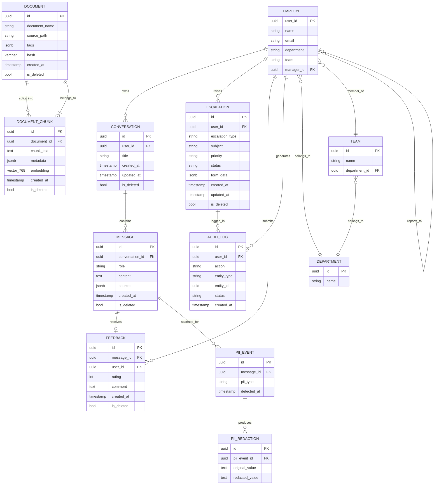

# Relationship Model

**Platform:** AA-Hackathon Enterprise Assistant
**Organization:** Aligned Automation
**Document Type:** Ontology — Entity Relationship Specification
**Date:** 2026-06-07

---

## 1. Relationship Model Overview

This document defines the canonical relationship model for the AA-Hackathon Enterprise Assistant. It specifies how every persistent entity relates to every other entity across the HR, IT, Admin, PMO, Finance, and Org domains. All relationships described here are enforced at the database layer (PostgreSQL 16) and reflected in the application layer through agent ownership and retrieval pipelines.

The platform stores all conversational and operational data in the `squadrons` PostgreSQL database hosted at `hackathon.alignedautomation.com:5432`. Organizational source-of-truth data (employees, attendance, allocation) lives in the read-only Zoho People PostgreSQL database. Document knowledge lives in the `documents` and `document_chunks` tables with pgvector embeddings. Relationships span both databases and are reconciled at runtime by the supervisor agent and domain agents.

### Relationship Taxonomy

| Relationship Class | Description |
|---|---|
| Structural | Org-chart and reporting-line relationships (Employee, Department, Team, Manager) |
| Operational | Transactional relationships produced by day-to-day actions (Conversations, Escalations, Documents, Attendance) |
| Knowledge | Relationships between unstructured knowledge assets (Documents, Chunks, Embeddings, Policies) |
| Behavioral | Relationships produced by system usage (Feedback, Audit Logs, PII Events) |
| Agent-Owned | Associations between domain agents and the entities they own and service |

---

## 2. Core Entity Relationships: Employee, Department, Team, Manager

The organizational graph is sourced from the Zoho People PostgreSQL database and is read-only from the platform's perspective.

### Entities

- **Employee** — any person with an active Azure AD account and a Zoho People record. Identified by `user_id` (UUID derived from Azure AD Object ID).
- **Department** — a named organizational unit (e.g., Engineering, Finance, HR). Each department belongs to exactly one organization.
- **Team** — a sub-unit within a department. An employee belongs to one team at a time.
- **Manager** — a role held by an Employee. A Manager is an Employee who has at least one direct report.

### Relationships

| From | Relationship | To | Cardinality |
|---|---|---|---|
| Employee | belongs_to | Department | Many-to-One |
| Employee | member_of | Team | Many-to-One |
| Employee | reports_to | Manager (Employee) | Many-to-One |
| Manager | manages | Employee | One-to-Many |
| Team | belongs_to | Department | Many-to-One |
| Department | contains | Team | One-to-Many |
| Department | contains | Employee | One-to-Many |

### Notes

- Self-referential: the `Manager` entity is the same type as `Employee`. The reporting chain is expressed as a recursive relationship on the employee table in Zoho People.
- An employee may have exactly one direct manager at any point in time.
- A department head is an Employee with `is_department_head = true` in the Zoho record.
- The `EmployeeAgent` resolves these relationships at query time via direct SQL against the Zoho read-only DB. The `OrgAgent` uses pgvector retrieval over org-chart documents for higher-level org questions.

---

## 3. Employee-Document Relationships

Employees interact with documents in two distinct modes: as consumers of knowledge (retrieval) and as requesters of generated HR documents.

### Knowledge Documents (SharePoint-Sourced)

| From | Relationship | To | Cardinality |
|---|---|---|---|
| Employee | queries | Document | Many-to-Many (via chat) |
| Document | retrieved_for | Employee | Many-to-Many |
| Document | tagged_with | Domain (HR/IT/Admin/Org/PMO/Finance) | Many-to-Many |

Knowledge documents are ingested from SharePoint by the `sharepoint_ingestion` job. They are stored in the `documents` table with `tags JSONB` carrying domain and source metadata. Retrieval is mediated by domain agents using pgvector cosine similarity search.

### Generated HR Documents

The `DocumentAgent` supports 12 HR document types, plus a free-text custom mode, that an employee requests and receives as generated artifacts.

| From | Relationship | To | Cardinality |
|---|---|---|---|
| Employee | requests | GeneratedDocument | One-to-Many |
| GeneratedDocument | produced_by | DocumentAgent | Many-to-One |
| GeneratedDocument | associated_with | Conversation | Many-to-One |

**Supported HR Document Types:**
1. Loan Proof
2. Employment Verification Letter
3. Experience Letter
4. Offer Letter
5. Relieving Letter
6. NOC Certificate
7. Bonafide Certificate
8. Promotion Letter
9. Address Proof
10. Internship Certificate
11. Confirmation Letter
12. ID Card Request

(plus a free-text `custom` mode)

Document generation is a multi-turn interaction. The `DocumentAgent` maintains state across turns within a single `Conversation` to collect required fields before generating the final artifact.

---

## 4. Employee-Conversation Relationships

Every chat session is a `Conversation` owned by one `Employee`. Each `Conversation` contains an ordered sequence of `Messages`.

| From | Relationship | To | Cardinality |
|---|---|---|---|
| Employee | owns | Conversation | One-to-Many |
| Conversation | contains | Message | One-to-Many |
| Message | sent_by | Role (user/assistant) | Many-to-One |
| Message | carries | Source (JSONB) | One-to-Many |
| Message | routed_through | Agent | Many-to-One |

### Schema References

- `conversations.user_id` — foreign key to the employee's Azure AD UUID.
- `conversations.is_deleted` — soft delete flag; deleted conversations are excluded from retrieval but retained for audit.
- `messages.sources JSONB` — array of source chunks that informed the assistant response, including `document_name`, `source_path`, `source_url`, and `similarity` score.
- `messages.role` — one of `user` or `assistant`.

### Memory Relationships

The `MemoryClient` aggregates conversation history and user preferences from:
- Recent `messages` rows for the current `user_id`
- File-based `MarkdownStore` entries for preferences
- Structured `DBTool` context from Zoho and escalation data

This means `Employee` has an implicit relationship to a `MemoryContext` object that is reconstructed per-request by the memory subsystem.

---

## 5. Employee-Escalation Relationships

An escalation is a formal request for human intervention, created when the assistant cannot resolve a query autonomously or when the employee explicitly initiates one.

| From | Relationship | To | Cardinality |
|---|---|---|---|
| Employee | raises | Escalation | One-to-Many |
| Escalation | handled_by | EscalationAgent | Many-to-One |
| Escalation | logged_in | AuditLog | One-to-Many |
| Escalation | transitions_through | EscalationStatus | Many-to-One |

### Escalation Attributes

- `escalation_type` — category of the escalation (HR, IT, Admin, Finance, etc.)
- `priority` — urgency level assigned at creation
- `status` — lifecycle state: `open`, `in_progress`, `resolved`, `closed`
- `form_data JSONB` — structured fields collected by `EscalationAgent` during the multi-turn form interaction

### Status Transitions

`open` → `in_progress` → `resolved` → `closed`

An escalation may be reopened, moving from `resolved` back to `in_progress`.

---

## 6. Employee-Attendance Relationships

Attendance data is read directly from the Zoho People database. The `AttendanceAgent` provides clock-in/clock-out actions and monthly summaries.

| From | Relationship | To | Cardinality |
|---|---|---|---|
| Employee | has | AttendanceRecord | One-to-Many |
| AttendanceRecord | belongs_to | Employee | Many-to-One |
| AttendanceRecord | covers | AttendancePeriod (day/month) | Many-to-One |

### Data Flow

1. The `AttendanceAgent` receives a query from the `MasterAgent` (fast-path regex detection, or keyword-scoring fallback if no regex matches).
2. It queries the Zoho People PostgreSQL database directly with the employee's `user_id`.
3. It returns clock-in/clock-out records, absences, and monthly summaries.
4. No attendance data is written to the `squadrons` database. All writes go directly to Zoho People via its API.

---

## 7. Employee-Feedback Relationships

After each assistant message, the employee may submit a thumbs-up, thumbs-down, or neutral rating with an optional comment.

| From | Relationship | To | Cardinality |
|---|---|---|---|
| Employee | submits | Feedback | One-to-Many |
| Feedback | rates | Message | One-to-One |
| Message | receives | Feedback | Zero-or-One-to-One |
| Feedback | contributes_to | AnalyticsDashboard | Many-to-One |

### Schema Reference

- `feedback.rating` — integer: `-1` (negative), `0` (neutral), `1` (positive).
- `feedback.message_id` — foreign key to the `messages` table.
- `feedback.user_id` — foreign key to the employee's Azure AD UUID.
- `feedback.is_deleted` — soft delete flag.

Feedback data is aggregated by the analytics API (`GET /api/analytics/overview`) and displayed in the `AnalyticsDashboard` and `COODashboard` front-end components.

---

## 8. Document-Chunk Relationships

Every knowledge document ingested from SharePoint is split into overlapping text chunks. Each chunk receives a 768-dimensional embedding vector stored in pgvector.

| From | Relationship | To | Cardinality |
|---|---|---|---|
| Document | splits_into | DocumentChunk | One-to-Many |
| DocumentChunk | belongs_to | Document | Many-to-One |
| DocumentChunk | has | Embedding (vector[768]) | One-to-One |
| DocumentChunk | retrieved_by | DomainAgent | Many-to-Many |

### Chunking Parameters

- Chunk size: 1000 characters
- Overlap: 200 characters
- Embedder: `sentence-transformers/nomic-embed-text-v1.5` (HuggingFace)
- Embedding dimension: 768
- Distance metric: cosine (`<=>` pgvector operator)
- Similarity threshold for retrieval: 0.10 (inclusive)
- Top-k returned per query: 3

### Retrieval SQL Pattern

```sql
SELECT
    dc.chunk_text,
    dc.metadata,
    d.document_name,
    d.source_path,
    d.tags->>'source_url',
    1 - (dc.embedding <=> $1::vector) AS similarity
FROM document_chunks dc
JOIN documents d ON dc.document_id = d.id
WHERE dc.is_deleted = false AND d.is_deleted = false
ORDER BY dc.embedding <=> $1::vector
LIMIT $2;
```

### Change Detection

The `sharepoint_ingestion` job uses a SHA hash stored in `documents.hash` (VARCHAR UNIQUE). When a document is re-synced, the job computes the file hash and compares it to the stored value. If unchanged, no re-embedding occurs. Status transitions: `NEW`, `CHANGED`, `DELETED`.

---

## 9. Policy-Domain Relationships

Policies are a subset of knowledge documents tagged with a specific domain. The `tags JSONB` field on the `documents` table carries domain assignment.

| From | Relationship | To | Cardinality |
|---|---|---|---|
| Policy | belongs_to | Domain | Many-to-One |
| Domain | contains | Policy | One-to-Many |
| Domain | served_by | DomainAgent | One-to-One |
| DomainAgent | retrieves | Policy | Many-to-Many (via pgvector) |

### Domain Assignments

| Domain | Owning Agent | Example Policies |
|---|---|---|
| HR | HRAgent | Leave policy, benefits, payroll, appraisal |
| IT | ITAgent | VPN access, password policy, device management |
| Admin | AdminAgent | Travel reimbursement, parking, facilities |
| PMO | PMOAgent | Project governance, milestone reporting, risk |
| Finance | FinanceAgent | Expense claims, TDS, Form 16, tax |
| Org | OrgAgent | Company mission, values, culture, org structure |

Policies without a domain tag fall through to the `QuickAgent` or are returned with a lower-confidence flag.

---

## 10. Agent-Entity Relationships

Each domain agent owns a specific set of entities and is the authoritative handler for queries about those entities.

| Agent | Primary Entities Owned | Data Sources |
|---|---|---|
| MasterAgent (Supervisor) | Routing rules, intent classification | None (orchestrator only) |
| HRAgent | HR Policies, Leave, Benefits, Payroll | pgvector (document_chunks) |
| ITAgent | IT Policies, VPN, Passwords, Access | pgvector (document_chunks) |
| AdminAgent | Travel, Facilities, Parking | pgvector (document_chunks) |
| PMOAgent | Projects, Milestones, Risk | pgvector (document_chunks) |
| FinanceAgent | Expenses, TDS, Tax, Form 16 | pgvector (document_chunks) |
| OrgAgent | Company Info, Culture, Mission | pgvector (document_chunks) |
| EmployeeAgent | Employee Directory, Self-Service | Zoho People DB (direct SQL) |
| AttendanceAgent | Clock-in/out, Monthly Summary | Zoho People DB (direct SQL) |
| DocumentAgent | Generated HR Documents (12 types + custom) | LLM generation + template |
| EmailAgent | Email Drafts, Refinement | Configured LLM (Claude / Groq / Ollama) |
| EscalationAgent | Escalation Forms, Tracking | squadrons.escalations table |
| QuickAgent | Conversational Replies | No retrieval |
| FunnyAgent | Jokes, Casual Chat | No retrieval |

### Routing Hierarchy

```
MasterAgent
├── Fast-path regex (no LLM cost)
│   ├── Escalation trigger → EscalationAgent
│   ├── Form request → FormsDrawer / EscalationAgent
│   ├── Email intent → EmailAgent
│   ├── Greeting → QuickAgent
│   ├── Attendance → AttendanceAgent
│   ├── Employee lookup → EmployeeAgent
│   └── Document generation → DocumentAgent
└── Keyword fallback (DOMAIN_KEYWORDS scoring)
    └── Best-score domain agent, defaulting to QuickAgent if no domain scores above zero
```

Note: an LLM-based routing method (`_route_llm()`) exists in `supervisor_agent.py` but is never invoked in the current build — it is not a live tier in the routing hierarchy above.

---

## 11. Cross-Domain Relationships

Several workflows require coordination across more than one domain agent.

| Scenario | Agents Involved | Coordination Pattern |
|---|---|---|
| New employee onboarding | HRAgent, ITAgent, AdminAgent, OrgAgent | Sequential steps via OnboardingGuidancePage (8 steps) |
| Expense claim with escalation | FinanceAgent → EscalationAgent | Finance query unresolved → escalation handoff |
| Project staffing query | PMOAgent + EmployeeAgent | PMO retrieves project; Employee resolves names |
| Document request with policy check | DocumentAgent + HRAgent | DocAgent generates letter; HRAgent validates policy |
| Email from chat context | Any domain agent → EmailAgent | Chat message forwarded to EmailAgent via `/api/email-agent/from-chat` |
| Analytics aggregation | All agents (via messages table) | AnalyticsDashboard queries `messages` and `feedback` tables |

### PII Cross-Cutting Relationship

The `pii_controller` and `pii_service` modules intersect all agent-entity relationships. Any message content passing through the pipeline is scanned for PII before storage. PII events are logged in the `pii_events` table, and redactions are stored in `pii_redactions`. This creates a cross-cutting relationship:

`Message` → (PII scan) → `PIIEvent` → `PIIRedaction`

---

## 12. Mermaid Diagram: Full Relationship Map



---

## 13. Cardinality Rules

The following cardinality rules are enforced by database constraints and application logic.

| Relationship | Minimum | Maximum | Enforcement |
|---|---|---|---|
| Employee → Conversations | 0 | Unlimited | No constraint; soft delete only |
| Employee → Manager | 0 | 1 | Zoho People data model |
| Employee → Department | 1 | 1 | Zoho People; required field |
| Employee → Team | 0 | 1 | Zoho People; nullable |
| Conversation → Messages | 1 | Unlimited | Application enforces at least one message on creation |
| Message → Feedback | 0 | 1 | `feedback.message_id` is unique; one rating per message per user |
| Employee → Feedback (per message) | 0 | 1 | `(message_id, user_id)` composite uniqueness |
| Document → DocumentChunks | 1 | Unlimited | Ingestion job enforces at least one chunk |
| DocumentChunk → Embedding | 1 | 1 | Every chunk must have a 768-dim vector |
| Escalation → AuditLogs | 0 | Unlimited | Every status change produces an audit log entry |
| Employee → Escalations | 0 | Unlimited | No limit enforced |
| Document → DomainTags | 1 | Many | At least one domain tag required post-ingestion |

---

## 14. Integrity Constraints

### Database-Level Constraints

| Table | Constraint | Detail |
|---|---|---|
| `documents` | `UNIQUE (hash)` | Prevents duplicate document ingestion; hash is SHA of file content |
| `feedback` | `rating IN (-1, 0, 1)` | Only valid rating values accepted |
| `messages` | `role IN ('user', 'assistant')` | Only two valid roles |
| `document_chunks` | `embedding vector(768)` | Fixed-dimension enforced by pgvector type |
| All tables | `id UUID DEFAULT gen_random_uuid()` | UUIDs generated at DB level |
| All tables | `is_deleted BOOLEAN DEFAULT false` | Soft delete pattern; no hard deletes |
| `conversations` | `user_id NOT NULL` | Every conversation must be owned by an employee |
| `escalations` | `user_id NOT NULL` | Every escalation must be linked to an employee |
| `feedback` | `message_id NOT NULL` | Feedback must reference a message |

### Application-Level Constraints

| Rule | Enforced By |
|---|---|
| JWT token required on all API calls except `/api/health` | Azure AD JWT middleware (python-jose) |
| Agent routing resolves via regex fast-paths, then keyword scoring if no regex matches | `supervisor_agent.py` routing logic |
| Similarity threshold 0.10: chunks below this score are excluded | `base_deep_agent.py` retrieval pipeline |
| Maximum 3 chunks returned per pgvector query | `rag/retriever.py` top_k=3 |
| PII must be scanned before message is written to `messages` table | `pii_controller.py` pre-write hook |
| Soft delete only: `is_deleted = true` instead of `DELETE` | All CRUD endpoints |
| Connection pool bounded at 8 connections | `ThreadedConnectionPool(min=1, max=8)` |
| LLM token budget: 800 tokens output, 2048 context | Configured provider's `num_predict`, `num_ctx` config (Claude/Groq/Ollama, selected by priority via env flags) |
| Embedding dimension must match 768 at query and storage time | `EMBEDDING_DIMENSION=768` env var check |

### Referential Integrity

All foreign keys in the `squadrons` database are defined with `ON DELETE RESTRICT` semantics enforced at the application layer (soft delete prevents FK violations). The Zoho People database is read-only; no writes or FK constraints are managed by the platform.

### Cross-Database Integrity

The `user_id` UUID that appears in `conversations`, `messages`, `feedback`, `escalations`, and `audit_logs` is derived from the Azure AD Object ID of the authenticated user. This same identifier is used to look up the employee record in Zoho People. There is no formal FK constraint across databases; referential integrity is maintained by the Azure AD authentication middleware ensuring the token's `oid` claim matches a valid Zoho People employee record before any write is permitted.
