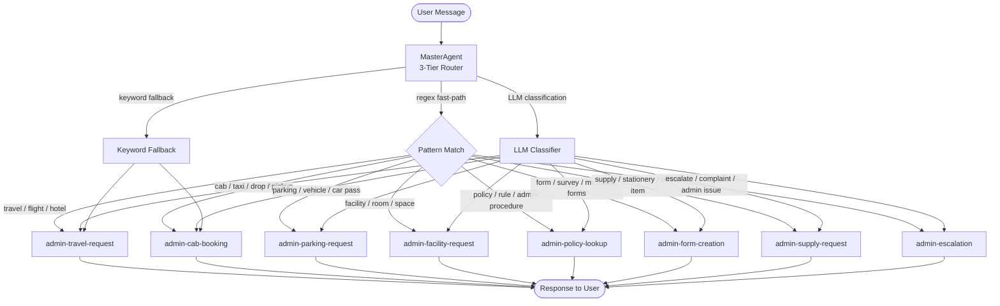

# Admin Skills Specification
## AA-Hackathon Enterprise AI Platform — Aligned Automation

This document defines the full specification for all Admin-domain skills handled by the Admin Agent. These skills cover travel logistics, cab bookings, parking, facility management, policy lookups, form creation via Microsoft Forms (Graph API), supply requests, and administrative escalations.

---

## Admin Skill Routing Diagram



---

## Skill 1: admin-travel-request

### Purpose
Handles employee travel requests for business trips, including flight bookings, hotel accommodations, per diem calculations, travel insurance, and travel approval workflows. Coordinates with the Admin team and Travel Management Company (TMC) integration.

### Intent Phrases
- "I need to travel to [city] for [purpose]"
- "Book a flight to [destination] for [date]"
- "I have a business trip to [location]"
- "Need hotel accommodation in [city]"
- "What is the per diem rate for [city]?"
- "Submit a travel request for [employee]"
- "Travel approval needed for conference trip"
- "International travel request for [destination]"

### Inputs
| Field | Type | Required | Description |
|-------|------|----------|-------------|
| destination | string | Yes | City or country of travel |
| travel_purpose | string | Yes | Reason for business travel |
| departure_date | date | Yes | Outbound travel date |
| return_date | date | Yes | Return travel date |
| requester_id | UUID | Yes | Employee ID from session |
| accommodation_needed | boolean | No | Whether hotel is required |
| flight_class | enum | No | economy / business (per policy) |
| estimated_budget | number | No | Approximate trip cost |
| manager_approval | boolean | No | Whether pre-approved by manager |

### Outputs
- Travel request ID for tracking
- Manager approval workflow trigger
- Per diem rate information for destination
- Preferred hotel and flight vendor list
- Travel policy reminders
- Email notification to admin@alignedautomation.com
- Calendar hold created for travel dates

### Agent
**Admin Agent** — Collects travel details, validates against travel policy, triggers approval workflow, and coordinates with Admin team for bookings.

### SLA
| Request Type | Submission Lead Time | Processing Time |
|--------------|---------------------|-----------------|
| Domestic travel | 3 business days before | 1 business day |
| International travel | 10 business days before | 3 business days |
| Same-day emergency travel | Immediate escalation | 2 hours |

### Travel Policy Summary
- Economy class for flights under 4 hours; Business class eligible for flights over 8 hours
- Hotel budget cap: INR 5,000/night domestic; $150/night international
- Per diem rates vary by city tier (Tier 1 / Tier 2 / International)
- Travel insurance mandatory for all international travel
- All travel requires manager approval before booking confirmation

### Fallback Behavior
1. If destination or dates not provided, prompt conversationally
2. If manager approval missing, trigger approval request automatically
3. Escalate to admin@alignedautomation.com for complex travel needs
4. Provide self-service travel portal link for direct booking options

### Examples

**Example 1 — Domestic Business Trip**
```
User: I need to travel to Bangalore next Monday for a client meeting, returning Wednesday
Agent: Travel request initiated!
       - Destination: Bangalore (domestic)
       - Departure: Monday, Return: Wednesday
       - Per diem rate: INR 1,200/day (Tier 1 city)
       - Recommended hotel: Marriott Whitefield or similar (~INR 4,500/night)
       Travel Request ID: TRV-2024-0234
       Sending manager approval request to your reporting manager now.
       Admin team will confirm bookings within 1 business day of approval.
```

**Example 2 — International Conference Travel**
```
User: I need to attend AWS re:Invent in Las Vegas in December
Agent: International travel request logged!
       - Destination: Las Vegas, USA
       - Purpose: AWS re:Invent conference
       - Lead time required: 10+ business days before travel
       Travel Request ID: TRV-2024-0235
       Please note: International travel requires CISO approval in addition to manager approval for
       employees handling sensitive data. Travel insurance will be arranged automatically.
       Budget estimate request sent to Finance team.
```

**Example 3 — Emergency Same-Day Travel**
```
User: I need to fly to Mumbai today - urgent client crisis
Agent: Emergency travel request flagged as URGENT.
       Escalating directly to Admin team: admin@alignedautomation.com
       Escalation ID: ESC-2024-0345 (High priority)
       Admin team will call you within 30 minutes to coordinate.
       In parallel, I've sent a heads-up to your manager for approval.
```

---

## Skill 2: admin-cab-booking

### Purpose
Facilitates cab (taxi/pickup/drop) booking for employees for office commutes, airport transfers, client visits, and late-night office drops. Integrates with the company's approved cab vendor network.

### Intent Phrases
- "Book a cab for me to the airport"
- "I need a pickup from home to office"
- "Late-night drop needed after overtime"
- "Schedule a cab for [employee] to [location]"
- "Office cab for client visit"
- "I need cab booking for tomorrow"
- "Cancel my cab booking [ID]"
- "What is the cab policy for late-night travel?"

### Inputs
| Field | Type | Required | Description |
|-------|------|----------|-------------|
| pickup_location | string | Yes | Starting point for the ride |
| drop_location | string | Yes | Destination |
| pickup_datetime | datetime | Yes | Date and time of pickup |
| requester_id | UUID | Yes | Employee ID from session |
| purpose | enum | Yes | office-commute / airport / client-visit / late-night / other |
| passenger_count | integer | No | Number of passengers |
| vehicle_type | enum | No | sedan / SUV / tempo-traveller |
| special_requirements | string | No | Accessibility needs, luggage etc. |

### Outputs
- Cab booking confirmation with vendor details
- Driver name and contact number (sent 1 hour before pickup)
- Booking reference number
- Cancel/modify option link
- Email to admin@alignedautomation.com for approval if required
- Cost estimate for the trip

### Agent
**Admin Agent** — Processes booking, validates against cab policy (late-night eligibility, client-visit approval), creates booking with vendor, and sends confirmation.

### Cab Policy Rules
- Late-night drops (after 9 PM): Eligible for all employees working late
- Airport pickups/drops: Require manager pre-approval (email confirmation)
- Client visit cabs: Require project code for billing
- Advance booking required: Minimum 2 hours for standard bookings
- Emergency bookings: Available with 30-minute notice (limited vendors)
- Monthly cab expense cap per employee: INR 10,000 (domestic commute)

### SLA
| Booking Type | Notice Required | Confirmation Time |
|--------------|----------------|-------------------|
| Standard commute | 2 hours prior | 30 minutes |
| Airport transfer | 12 hours prior | 1 hour |
| Client visit | 4 hours prior | 1 hour |
| Emergency/late-night | 30 minutes | 15 minutes |

### Fallback Behavior
1. If vendor is unavailable, offer alternative vendor or Ola/Uber voucher
2. If policy eligibility unclear, escalate to Admin team
3. Log booking attempt for capacity planning analytics

### Examples

**Example 1 — Late-Night Drop**
```
User: I'll be working late tonight and need a cab drop home at 11 PM
Agent: Late-night drop booking created!
       - Pickup: Aligned Automation Office, Floor 5
       - Drop: [Your registered home address from profile]
       - Time: 11:00 PM tonight
       Booking ID: CAB-2024-1156
       Driver details will be sent to your phone 1 hour before pickup.
       This booking is covered under our late-night drop policy.
```

**Example 2 — Airport Transfer**
```
User: I need a cab to Chennai airport tomorrow at 5 AM for my Bangalore flight
Agent: Airport transfer request noted. Since this requires early morning pickup,
       I've flagged this as urgent to ensure vendor availability.
       - Pickup: 5:00 AM from your home address
       - Drop: Chennai International Airport (domestic terminal)
       Booking ID: CAB-2024-1157
       Manager approval notification sent (airport policy requirement).
       Driver confirmation: tonight by 10 PM.
```

**Example 3 — Client Visit Cab**
```
User: Need a cab for client visit to Infosys campus tomorrow 10 AM, 3 people
Agent: Client visit cab arranged for 3 passengers.
       - Pickup: Aligned Automation Office
       - Drop: Infosys Campus, [City]
       - Vehicle: SUV (for 3 passengers)
       Booking ID: CAB-2024-1158
       Please provide project code for billing: [Awaiting input]
       Confirmation once project code received.
```

---

## Skill 3: admin-parking-request

### Purpose
Manages parking slot allocation for employees, visitor parking, vehicle registration, parking passes, and temporary parking permissions at Aligned Automation office premises.

### Intent Phrases
- "I need a parking slot"
- "Register my vehicle for parking"
- "Request visitor parking for [guest name]"
- "My parking pass has expired"
- "Is parking available for my car?"
- "Request temporary parking permission"
- "Parking allocation for two-wheeler"
- "EV charging spot availability"

### Inputs
| Field | Type | Required | Description |
|-------|------|----------|-------------|
| vehicle_number | string | Yes | Registration plate number |
| vehicle_type | enum | Yes | two-wheeler / four-wheeler / EV |
| parking_type | enum | Yes | permanent / temporary / visitor |
| start_date | date | Yes | When parking is needed from |
| end_date | date | No | For temporary passes |
| requester_id | UUID | Yes | Employee ID from session |
| visitor_name | string | No | If requesting visitor parking |
| floor_preference | string | No | Basement / Ground / Level 2 |

### Outputs
- Parking slot allocation confirmation
- Parking pass (digital / physical)
- Vehicle registration confirmation
- Slot number and location map
- Admin notification for manual slot assignment if required
- Visitor parking pass with time-limited QR code

### Agent
**Admin Agent** — Checks slot availability, assigns appropriate slot, registers vehicle, issues digital pass, and notifies security desk.

### Parking Policy
- Permanent slots: Based on seniority and role (apply via Admin team)
- Temporary slots: Up to 30 days, renewable
- Visitor parking: Valid for specific visit duration, max 8 hours
- EV charging slots: 4 available on Level 1 (first-come basis with advance booking)
- Two-wheelers: Dedicated section, no allocation required — register vehicle only
- Waiting list: If no slots available, employee added to waitlist automatically

### SLA
| Request Type | Processing Time |
|--------------|-----------------|
| Visitor parking | Immediate (same-day) |
| Temporary slot | 1 business day |
| Permanent slot | 5 business days (subject to availability) |
| EV slot booking | Immediate (if available) |

### Examples

**Example 1 — New Employee Parking**
```
User: I just joined and need parking for my car (MH12AB1234)
Agent: Welcome! I've registered your vehicle MH12AB1234.
       Parking type: Four-wheeler
       Current availability: 3 slots available in Basement Level B2
       Temporary slot assigned: B2-045 (valid 30 days)
       For permanent allocation, you've been added to the priority waitlist.
       Admin team will process your permanent slot within 5 business days.
       Parking Pass ID: PKG-2024-0789
```

**Example 2 — Visitor Parking**
```
User: I have a client visiting tomorrow for a meeting at 2 PM
Agent: Visitor parking arranged for tomorrow!
       - Visitor: [Client name if provided]
       - Valid: 2:00 PM - 6:00 PM (4-hour window)
       Visitor Parking Pass: VIS-2024-0456
       QR code will be sent to your email to forward to your client.
       Security desk notified. Client should use Gate 2 (visitor entrance).
```

**Example 3 — EV Charging Slot**
```
User: Need EV charging slot for my Tesla tomorrow
Agent: EV Charging Slot availability for tomorrow:
       Available slots: Level 1, EV-02 and EV-04
       I've booked EV-02 for your vehicle. Please register your plate number first.
       Booking ID: EV-2024-0234
       Charging slot hours: 8 AM - 6 PM. Please vacate promptly when done.
       Security will assist with any charging port issues.
```

---

## Skill 4: admin-facility-request

### Purpose
Handles requests for facility services including meeting room bookings, office maintenance, housekeeping, pantry restocking, workstation setup, ergonomic assessments, and office infrastructure issues.

### Intent Phrases
- "Book a meeting room for [time]"
- "The AC in my area is not working"
- "Pantry needs restocking"
- "I need a new desk / workstation setup"
- "Conference room booking for [count] people"
- "Office maintenance request"
- "The projector in Room 3 is broken"
- "Need ergonomic chair assessment"

### Inputs
| Field | Type | Required | Description |
|-------|------|----------|-------------|
| facility_type | enum | Yes | meeting-room / maintenance / housekeeping / pantry / workstation / ergonomic / infrastructure |
| description | string | Yes | Detailed request description |
| location | string | Yes | Floor, room, or area |
| requester_id | UUID | Yes | Employee ID from session |
| date_time | datetime | No | For bookings / scheduled requests |
| attendee_count | integer | No | For meeting room bookings |
| urgency | enum | No | normal / urgent |

### Outputs
- Facility request ticket with reference ID
- Meeting room booking confirmation with room details
- Maintenance work order for Admin/Facilities team
- Email to admin@alignedautomation.com
- Estimated resolution time
- Follow-up survey link after resolution

### Agent
**Admin Agent** — Routes to appropriate facility sub-handler (booking system vs. maintenance ticketing vs. procurement).

### SLA
| Request Type | Response Time | Resolution |
|--------------|---------------|------------|
| Meeting room booking | Immediate | Immediate |
| Urgent maintenance (AC/power) | 1 hour | 4 hours |
| Non-urgent maintenance | 1 business day | 3 business days |
| Workstation setup | 2 business days | 5 business days |
| Ergonomic assessment | 3 business days | On assessment date |

### Examples

**Example 1 — Meeting Room Booking**
```
User: Book a meeting room for 10 people tomorrow at 2 PM for 2 hours
Agent: Meeting room search for 10 people, tomorrow 2:00 PM - 4:00 PM:
       Available: Boardroom A (capacity: 12) — Floor 3
       Available: Conference Suite B (capacity: 15) — Floor 5
       Booking Boardroom A for you.
       Room Booking ID: ROOM-2024-0678
       Calendar invite sent to your email. Room includes: projector, whiteboard, video conferencing.
```

**Example 2 — Maintenance Issue**
```
User: The AC in the Marketing bay on Floor 2 is not cooling properly, it's very hot
Agent: Urgent facility request raised!
       - Issue: AC malfunction — Floor 2, Marketing bay
       - Priority: Urgent (affecting multiple employees)
       Maintenance Ticket: FAC-2024-0456
       Facilities team dispatched within 1 hour.
       As interim measure: portable fans can be collected from Admin desk (Floor 1).
```

**Example 3 — Ergonomic Assessment**
```
User: I've been having back pain and think I need an ergonomic chair
Agent: Ergonomic assessment request logged!
       - Assessment includes: chair adjustment, desk height, monitor position
       - Assigned assessor: Facilities Team (certified ergonomics)
       Ticket: FAC-2024-0457
       Assessment will be scheduled within 3 business days.
       In the meantime, here are quick ergonomic tips: [guide link]
```

---

## Skill 5: admin-policy-lookup

### Purpose
Answers employee questions about administrative policies, office rules, HR procedures, leave policies, expense policies, code of conduct, and other corporate governance documents using the RAG knowledge base.

### Intent Phrases
- "What is the leave policy?"
- "What are the office timings?"
- "What is the expense reimbursement process?"
- "Dress code policy"
- "What is the work-from-home policy?"
- "How do I claim travel expenses?"
- "What is the notice period policy?"
- "Company code of conduct"

### Inputs
| Field | Type | Required | Description |
|-------|------|----------|-------------|
| policy_topic | string | Yes | Topic of policy inquiry |
| context | string | No | Specific scenario for policy application |
| requester_id | UUID | Yes | Employee ID (for role-specific policy) |

### Outputs
- Policy excerpt from RAG knowledge base (384-dim HuggingFace embeddings)
- Plain-language summary of relevant policy
- Document reference and version number
- Link to full policy document
- Escalation to HR/Admin for policy clarification if needed

### Agent
**Admin Agent** → **Document Agent** (RAG retrieval). Embedding lookup via pgvector primary / FAISS fallback.

### SLA
Real-time response target < 3 seconds for RAG retrieval.

### Fallback Behavior
1. If policy not found, provide general guidance and direct to admin@alignedautomation.com
2. Log as knowledge gap for knowledge base team
3. Suggest relevant policy categories to explore

### Examples

**Example 1 — WFH Policy**
```
User: What is the work from home policy?
Agent: Our Work From Home Policy (v3.1) states:
       - Employees are eligible for up to 2 WFH days per week (approved roles)
       - WFH requires manager approval and must be logged in the HR portal
       - Core hours (10 AM - 4 PM) must be maintained regardless of location
       - WFH eligibility criteria: min. 6 months tenure, satisfactory performance rating
       Full policy: [HR Portal > Policies > WFH Policy]
       For exceptions, contact hr@alignedautomation.com.
```

**Example 2 — Expense Reimbursement**
```
User: How do I claim my travel expenses?
Agent: Expense Reimbursement Process (Finance Policy v2.4):
       1. Submit expenses within 30 days of incurring them
       2. Use the Zoho Expense portal (link on company intranet)
       3. Upload original receipts for all amounts above INR 500
       4. Manager approval required for expenses over INR 5,000
       5. Reimbursement processed within 7 business days of approval
       Categories requiring pre-approval: flights, hotels, client entertainment
```

**Example 3 — Leave Policy**
```
User: How many casual leaves do I get per year?
Agent: Leave Entitlement (HR Leave Policy v4.2):
       - Casual Leave: 12 days per calendar year (accrued monthly)
       - Sick Leave: 12 days per calendar year (non-encashable)
       - Earned Leave: 15 days per year (encashable, carry-forward allowed)
       - Maternity Leave: 26 weeks (per Maternity Benefit Act)
       - Paternity Leave: 5 days
       Apply leaves via HR portal. Casual leave requires 1-day advance notice.
       For leave balance: HR Portal > My Leave > Leave Balance.
```

---

## Skill 6: admin-form-creation

### Purpose
Creates Microsoft Forms via the Microsoft Graph API for surveys, feedback collection, event registration, policy acknowledgments, and other data collection needs. Renders the created form in the FormsDrawer.jsx component. Admin and Manager roles can create forms; other employees can fill forms.

### Intent Phrases
- "Create a form for employee feedback"
- "I need a survey for [purpose]"
- "Create a Microsoft Form for event registration"
- "Make a feedback form for the town hall"
- "Create a policy acknowledgment form"
- "I need a questionnaire for [project]"
- "Build a form for new joiner feedback"
- "Create an exit interview form"

### Inputs
| Field | Type | Required | Description |
|-------|------|----------|-------------|
| form_title | string | Yes | Title of the form |
| form_purpose | string | Yes | Description of what the form collects |
| questions | array | Yes | List of questions with types |
| target_audience | string | No | Who should fill the form |
| deadline | date | No | Form response deadline |
| is_anonymous | boolean | No | Whether responses are anonymous |
| requester_id | UUID | Yes | Must be Admin or Manager role |
| department | string | No | Department scope of form |

### Question Types Supported
| Type | Description |
|------|-------------|
| text | Short text input |
| paragraph | Long text / paragraph input |
| choice | Multiple choice (single select) |
| checkbox | Multiple choice (multi-select) |
| rating | Rating scale (1-5 or 1-10) |
| date | Date picker |
| ranking | Drag-to-rank options |
| likert | Likert scale (Strongly Disagree to Strongly Agree) |

### API Integration

**Endpoint**: `POST /api/ms-forms/create`

**Request Body**:
```json
{
  "form_title": "Employee Satisfaction Survey Q4 2024",
  "description": "Quarterly employee satisfaction survey",
  "questions": [
    {
      "type": "rating",
      "text": "How satisfied are you with your work environment?",
      "scale": 10,
      "required": true
    },
    {
      "type": "choice",
      "text": "Which area needs most improvement?",
      "options": ["Communication", "Tools", "Work-Life Balance", "Growth Opportunities"],
      "required": true
    },
    {
      "type": "paragraph",
      "text": "Any additional feedback?",
      "required": false
    }
  ],
  "settings": {
    "anonymous": true,
    "deadline": "2024-12-31",
    "allow_multiple_responses": false
  },
  "created_by": "user_uuid",
  "department": "Engineering"
}
```

**Response**:
```json
{
  "form_id": "ms-form-uuid",
  "form_url": "https://forms.office.com/r/[form_id]",
  "share_link": "https://forms.office.com/share/[token]",
  "embed_code": "<iframe src='...'></iframe>",
  "created_at": "2024-12-01T10:00:00Z",
  "status": "active"
}
```

### FormsDrawer.jsx Integration
The created form is rendered inside `FormsDrawer.jsx` as a side panel:
- Drawer opens from the right side of the screen
- Embeds the Microsoft Form via iframe
- Displays form title, deadline, and description
- Admin can preview, share link, and track responses
- Response count displayed in drawer header (live update)
- Export responses button (CSV download via Graph API)

### Microsoft Graph API Permissions Required
- `Forms.ReadWrite.All` — Create and manage forms
- `Forms.Read.All` — Read form responses
- `User.Read` — Identify form creator

### Outputs
- Microsoft Form created and available at forms.office.com
- Form URL and shareable link returned
- FormsDrawer.jsx opens with embedded form preview
- Share link sent to target audience (optional email)
- Form registered in Admin's form management dashboard

### Agent
**Admin Agent** — Validates role permissions (Admin/Manager only), collects form requirements conversationally, calls Microsoft Graph API, renders in FormsDrawer.

### SLA
| Action | Time |
|--------|------|
| Form creation | < 10 seconds (API call) |
| Form availability | Immediate after creation |
| Response export | On-demand (< 30 seconds) |

### Role-Based Access
| Role | Permissions |
|------|------------|
| Admin | Create, edit, delete, view all forms |
| Manager | Create forms for their team, view team responses |
| Employee | Fill forms assigned to them, view own responses |
| HR | Create HR-specific forms, view anonymized responses |

### Fallback Behavior
1. If Microsoft Graph API unavailable, notify user and log for retry
2. If user lacks permission (not Admin/Manager), explain and suggest contacting Admin
3. Provide alternative: Admin team creates form manually on request

### Examples

**Example 1 — Employee Satisfaction Survey**
```
User (Admin): Create an anonymous satisfaction survey for the engineering team
Agent: Building the form! Let me ask a few quick questions:
       1. Specific topics to cover? (work environment, tools, management, growth)
       2. Rating scale preference? (1-5 or 1-10)
       3. Response deadline?
User: Cover all topics, 1-10 scale, deadline end of this month
Agent: Form created successfully!
       Title: Engineering Team Satisfaction Survey - December 2024
       Form URL: https://forms.office.com/r/XyZ123
       Anonymous: Yes | Deadline: Dec 31, 2024
       Form is now visible in your Forms Drawer. Share link copied to clipboard.
       Sent invitation to all Engineering team members.
```

**Example 2 — Event Registration Form**
```
User (Manager): I need a registration form for our team offsite on Dec 15
Agent: Event registration form created!
       - Title: Team Offsite Registration - Dec 15, 2024
       - Fields: Name, Dietary Requirements, T-shirt Size, Transport Needed
       - Deadline: Dec 10, 2024
       Form URL: https://forms.office.com/r/aBc456
       [FormsDrawer opens with form preview]
       Share this link with your team. Responses dashboard available in Admin panel.
```

**Example 3 — Policy Acknowledgment**
```
User (Admin): Create a form for employees to acknowledge the updated IT security policy
Agent: Policy acknowledgment form ready!
       - Title: IT Security Policy Acknowledgment - 2024 Update
       - Fields: Employee Name (auto-filled), Date, Signature checkbox,
                 "I have read and understood the policy" confirmation
       - Not anonymous (requires employee identification)
       Form ID: ms-form-it-policy-ack-2024
       Deadline: December 15, 2024
       I've sent this to all employees via email notification.
       Track acknowledgments in real-time via Forms Drawer.
```

---

## Skill 7: admin-supply-request

### Purpose
Processes requests for office supplies, stationery, equipment, pantry items, printed materials, and other consumables needed for day-to-day operations.

### Intent Phrases
- "I need [office supply]"
- "Order [stationery item] for the team"
- "Pantry is running out of [item]"
- "Request business cards"
- "Need a whiteboard marker set"
- "Order notebooks for the team"
- "Toner for the printer is empty"
- "Request branded merchandise for event"

### Inputs
| Field | Type | Required | Description |
|-------|------|----------|-------------|
| item_name | string | Yes | Name of the supply item |
| quantity | integer | Yes | Number of units required |
| urgency | enum | No | normal / urgent |
| department | string | Yes | Requesting department |
| requester_id | UUID | Yes | Employee ID from session |
| delivery_location | string | No | Where to deliver (floor/desk) |
| business_justification | string | No | For high-value items |

### Outputs
- Supply request ticket with reference ID
- Estimated delivery date
- Approval workflow triggered for items above budget threshold (INR 2,000)
- Admin team notification
- Delivery confirmation alert when fulfilled

### Agent
**Admin Agent** — Validates supply type and quantity, checks stock availability, creates request, triggers approval if needed, coordinates with procurement.

### SLA
| Item Type | Delivery Estimate |
|-----------|-------------------|
| Standard stationery (in-stock) | Same day to 1 business day |
| Special order items | 3-5 business days |
| Bulk orders | 5-10 business days |
| Urgent low-stock (pantry) | 4 hours |

### Fallback Behavior
1. Check in-stock inventory before creating order
2. If item unavailable, suggest alternatives
3. For urgent needs, escalate to Admin team directly

### Examples

**Example 1 — Standard Stationery**
```
User: We need 10 notebooks and 5 pen sets for the Sales team
Agent: Supply request submitted!
       - 10 Spiral Notebooks (A4)
       - 5 Premium Pen Sets
       - Department: Sales
       Supply Ticket: SUP-2024-0345
       In stock — delivery to your floor within 1 business day.
       Admin team will drop to Sales bay, Floor 2.
```

**Example 2 — Pantry Restock**
```
User: The coffee in the 3rd floor pantry is completely finished
Agent: Urgent pantry restock request raised!
       Ticket: SUP-2024-0346 (Urgent)
       Admin team notified — coffee restocking within 4 hours.
       If you need coffee immediately, Floor 5 pantry is fully stocked.
```

**Example 3 — Branded Merchandise**
```
User: We need 50 branded notebooks for an upcoming client event next week
Agent: Branded merchandise request created!
       - Quantity: 50 branded notebooks
       - Timeline: Needed by [event date]
       Supply Ticket: SUP-2024-0347
       This requires manager approval (value above INR 2,000 threshold).
       Approval request sent to your manager.
       Note: Branded items take 5-7 business days. Urgent flag set given the event timeline.
```

---

## Skill 8: admin-escalation

### Purpose
Creates formal administrative escalations for unresolved admin requests, complaints about admin services, SLA breaches, facility emergencies, and issues requiring senior management attention.

### Intent Phrases
- "My admin request hasn't been resolved"
- "Escalate this to Admin management"
- "I have a complaint about admin services"
- "This facility issue is affecting the whole team"
- "Admin SLA has been breached"
- "I need to report a serious facility issue"
- "Complaint about [service/vendor]"
- "Escalate admin issue [reference]"

### Inputs
| Field | Type | Required | Description |
|-------|------|----------|-------------|
| original_request_id | string | No | Original Admin request reference |
| issue_description | string | Yes | Nature of the complaint or unresolved issue |
| business_impact | string | Yes | Impact on employees or operations |
| priority | enum | Yes | low / medium / high / critical |
| requester_id | UUID | Yes | Employee ID from session |
| affected_employees | integer | No | Number of employees impacted |

### Outputs
- Escalation record in escalations table (type: Admin)
- Email to admin@alignedautomation.com
- Management notification (for high/critical escalations)
- Escalation ID for tracking
- Expected response timeline based on priority

### Data Model
```sql
INSERT INTO escalations (
    id,              -- UUID generated
    user_id,         -- From session context
    escalation_type, -- 'Admin'
    subject,         -- Derived from issue description
    priority,        -- low / medium / high / critical
    status,          -- 'open' (initial state)
    form_data        -- JSONB: {original_request_id, business_impact, affected_employees, category}
)
```

### SLA
| Priority | Response Time | Resolution |
|----------|---------------|------------|
| Critical (safety/emergency) | Immediate | 1 hour |
| High (major disruption) | 30 minutes | 4 hours |
| Medium (service issue) | 2 hours | 1 business day |
| Low (minor complaint) | 1 business day | 3 business days |

### Fallback Behavior
All escalations get minimum Low priority. Safety or facility emergencies automatically trigger Critical escalation with management notification.

### Examples

**Example 1 — SLA Breach**
```
User: My parking request from 3 days ago hasn't been processed
Agent: Apologies for the delay! I've raised an escalation.
       ESC-2024-0678 (Medium priority)
       Admin manager notified. Your parking request will be resolved within 4 hours.
       Original Request: PKG-2024-0789 — now flagged as priority.
```

**Example 2 — Facility Emergency**
```
User: There's water leaking from the ceiling in the server room on Floor 4
Agent: CRITICAL FACILITY EMERGENCY ESCALATED!
       ESC-2024-0679 (Critical — Facility Safety Risk)
       Admin Director + Facilities Manager + IT team notified IMMEDIATELY.
       Please evacuate the server room area immediately.
       Facilities emergency team dispatched. DO NOT touch electrical equipment near the leak.
```

**Example 3 — Vendor Complaint**
```
User: The cab vendor has been unreliable for 3 weeks, several employees stranded
Agent: Service quality escalation raised against cab vendor.
       ESC-2024-0680 (High priority — Vendor Performance)
       Admin management notified. Vendor review meeting being scheduled.
       Immediate action: Alternative vendor activated for next 2 weeks.
       Affected employees: please use the backup vendor code BACKUP2024 for Ola bookings.
```

---

## Admin Agent Configuration Summary

| Property | Value |
|----------|-------|
| Agent Class | AdminAgent |
| Email Default | admin@alignedautomation.com |
| Routing Method | 3-tier (regex → LLM → keyword) |
| Escalation Integration | escalations table (type='Admin') |
| Knowledge Base | Admin policies, procedures, FAQs |
| Forms Integration | Microsoft Graph API (POST /api/ms-forms/create) |
| FormsDrawer Component | FormsDrawer.jsx (right-side panel) |
| Embedding Model | HuggingFace 384-dim |
| Vector Store | pgvector (primary) / FAISS (fallback) |
| LLM | Ollama (gpt-oss) |
| Cab Policy | Vendor-integrated booking system |
| Travel Policy | TMC integration + approval workflow |
| Supply Approval Threshold | INR 2,000 (manager approval required) |
