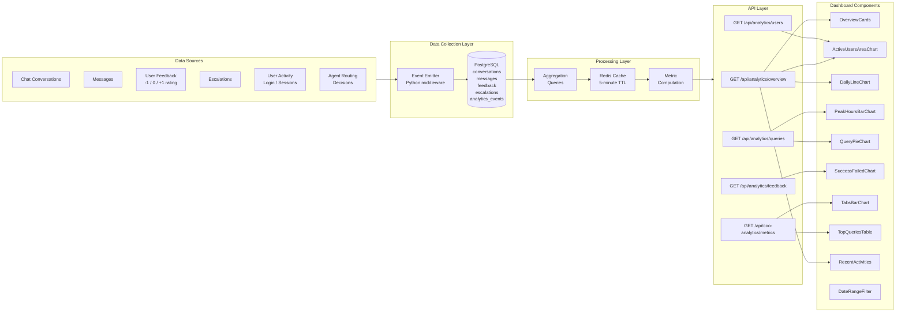

# Analytics Skills Specification
## AA-Hackathon Enterprise AI Platform — Aligned Automation

This document defines the full specification for the analytics platform including data collection, dashboard components, and all analytics-related skills available to various user roles.

---

## Analytics Data Flow Diagram



---

## Data Collection

### Core Data Tables

#### conversations
```sql
CREATE TABLE conversations (
    id              UUID PRIMARY KEY DEFAULT gen_random_uuid(),
    user_id         UUID NOT NULL REFERENCES users(id),
    title           TEXT,
    created_at      TIMESTAMPTZ DEFAULT NOW(),
    updated_at      TIMESTAMPTZ DEFAULT NOW(),
    deleted_at      TIMESTAMPTZ,
    message_count   INTEGER DEFAULT 0,
    last_agent      VARCHAR(50)  -- Which agent handled last message
);
```

#### messages
```sql
CREATE TABLE messages (
    id              UUID PRIMARY KEY DEFAULT gen_random_uuid(),
    conversation_id UUID NOT NULL REFERENCES conversations(id),
    user_id         UUID NOT NULL REFERENCES users(id),
    role            VARCHAR(20) CHECK (role IN ('user', 'assistant', 'system')),
    content         TEXT NOT NULL,
    agent_type      VARCHAR(50),      -- Which agent produced this message
    routing_method  VARCHAR(30),      -- regex / llm / keyword (MasterAgent tier used)
    created_at      TIMESTAMPTZ DEFAULT NOW(),
    processing_ms   INTEGER,          -- Response time in milliseconds
    token_count     INTEGER,          -- Approximate token usage
    model_used      VARCHAR(100)      -- LLM model identifier
);
```

#### feedback
```sql
CREATE TABLE feedback (
    id              UUID PRIMARY KEY DEFAULT gen_random_uuid(),
    message_id      UUID NOT NULL REFERENCES messages(id),
    user_id         UUID NOT NULL REFERENCES users(id),
    rating          SMALLINT NOT NULL CHECK (rating IN (-1, 0, 1)),
    -- -1 = thumbs down (negative)
    --  0 = neutral / no rating
    --  1 = thumbs up (positive)
    comment         TEXT,
    created_at      TIMESTAMPTZ DEFAULT NOW()
);

-- Rating values:
-- +1 (positive): User explicitly clicked thumbs up
--  0 (neutral):  No feedback provided for this message
-- -1 (negative): User explicitly clicked thumbs down
```

#### analytics_events
```sql
CREATE TABLE analytics_events (
    id              UUID PRIMARY KEY DEFAULT gen_random_uuid(),
    user_id         UUID REFERENCES users(id),
    event_type      VARCHAR(100) NOT NULL,
    -- event types: page_view, agent_routed, escalation_created,
    --              skill_invoked, feedback_given, login, logout,
    --              form_created, document_downloaded, conversation_created
    event_data      JSONB,
    session_id      UUID,
    ip_address      INET,
    user_agent      TEXT,
    created_at      TIMESTAMPTZ DEFAULT NOW()
);

CREATE INDEX idx_analytics_events_type ON analytics_events(event_type);
CREATE INDEX idx_analytics_events_created ON analytics_events(created_at DESC);
CREATE INDEX idx_analytics_events_user ON analytics_events(user_id);
```

### Computed Metrics

| Metric Name | Description | Calculation |
|-------------|-------------|-------------|
| total_conversations | Total chat sessions | COUNT(conversations) |
| total_messages | Total messages exchanged | COUNT(messages) |
| active_users_daily | Unique users per day | COUNT(DISTINCT user_id) per day |
| active_users_weekly | Unique users in 7 days | COUNT(DISTINCT user_id) over 7d |
| active_users_monthly | Unique users in 30 days | COUNT(DISTINCT user_id) over 30d |
| avg_response_time_ms | Average agent response latency | AVG(processing_ms) |
| feedback_positive_rate | % of positive feedback | COUNT(rating=1) / COUNT(rating!=0) |
| feedback_negative_rate | % of negative feedback | COUNT(rating=-1) / COUNT(rating!=0) |
| success_rate | Non-negative message rate | 1 - negative_rate |
| top_agent | Most frequently used agent | MODE(agent_type) |
| peak_hour | Highest message volume hour | MAX(COUNT per hour) |
| escalation_rate | Escalations per conversation | COUNT(escalations) / COUNT(conversations) |
| avg_messages_per_conversation | Conversation depth | AVG(message_count) |
| routing_efficiency | % resolved via regex fast-path | COUNT(regex) / COUNT(total) |

---

## Dashboard Components

### 1. OverviewCards

**Purpose**: Summary statistics displayed as 4 KPI cards at the top of the analytics dashboard.

**Component**: `OverviewCards.jsx`

**Data Source**: `GET /api/analytics/overview`

**Cards Displayed**:
| Card | Metric | Icon | Color |
|------|--------|------|-------|
| Total Conversations | conversation count for selected period | MessageSquare | Blue |
| Active Users | unique users for selected period | Users | Green |
| Avg Response Time | average ms across all messages | Clock | Purple |
| Success Rate | positive + neutral feedback rate | CheckCircle | Teal |

**Props**:
```typescript
interface OverviewCardsProps {
  dateRange: { from: Date; to: Date };
  department?: string;
  data: {
    total_conversations: number;
    conversation_delta_pct: number;   // % change vs previous period
    active_users: number;
    user_delta_pct: number;
    avg_response_time_ms: number;
    response_time_delta_pct: number;
    success_rate: number;
    success_rate_delta_pct: number;
  };
}
```

**Behavior**: Each card shows current value + trend arrow (up/down) + percentage change vs. previous equivalent period. Trend arrows: green for positive metrics (more conversations, higher success rate), red for negative (slower response time, lower success rate).

---

### 2. ActiveUsersAreaChart

**Purpose**: Visualizes daily active user counts over time as an area chart, showing user engagement trends.

**Component**: `ActiveUsersAreaChart.jsx`

**Data Source**: `GET /api/analytics/users?granularity=daily&date_from={}&date_to={}`

**Chart Properties**:
- Chart library: Recharts (AreaChart)
- X-axis: Date labels (formatted per granularity)
- Y-axis: Unique user count
- Area fill: Gradient blue (#3B82F6 → transparent)
- Tooltip: Date + active user count + change from previous day
- Granularity options: hourly / daily / weekly / monthly

**Response Data**:
```json
{
  "data_points": [
    {"date": "2024-11-01", "active_users": 45, "new_users": 3, "returning_users": 42},
    {"date": "2024-11-02", "active_users": 62, "new_users": 5, "returning_users": 57}
  ],
  "total_unique_users": 128,
  "peak_day": {"date": "2024-11-15", "count": 89}
}
```

**Interactions**: Click on data point to drill down into that day's user activity. Hover for detailed tooltip. Brush component for zooming into date range.

---

### 3. DailyLineChart

**Purpose**: Shows daily message volume (total messages sent per day) plotted as a multi-line chart, with separate lines for user messages and assistant responses.

**Component**: `DailyLineChart.jsx`

**Data Source**: `GET /api/analytics/overview?granularity=daily`

**Chart Properties**:
- Chart library: Recharts (LineChart)
- Lines: "User Messages" (solid blue), "Assistant Responses" (dashed green)
- X-axis: Date
- Y-axis: Message count
- Reference line: 7-day rolling average
- Dots shown on data points for clarity

**Response Data**:
```json
{
  "daily_data": [
    {
      "date": "2024-11-01",
      "user_messages": 234,
      "assistant_messages": 234,
      "total_messages": 468,
      "conversations_started": 45
    }
  ],
  "rolling_7d_avg": 410
}
```

---

### 4. PeakHoursBarChart

**Purpose**: Displays message volume distribution across hours of the day (0-23) to identify peak usage hours. Used for infrastructure capacity planning.

**Component**: `PeakHoursBarChart.jsx`

**Data Source**: `GET /api/analytics/queries?breakdown=hourly`

**Chart Properties**:
- Chart library: Recharts (BarChart)
- X-axis: Hour of day (0 = 12 AM, 9 = 9 AM, 17 = 5 PM)
- Y-axis: Message count
- Bar color: Gradient from light (off-peak) to dark (peak hours)
- Highlight: Top 3 peak hours shown in accent color
- Tooltip: Hour range + message count + % of daily total

**Response Data**:
```json
{
  "hourly_distribution": [
    {"hour": 0, "message_count": 12, "pct_of_daily": 0.02},
    {"hour": 9, "message_count": 145, "pct_of_daily": 0.19},
    {"hour": 10, "message_count": 187, "pct_of_daily": 0.24},
    {"hour": 17, "message_count": 98, "pct_of_daily": 0.13}
  ],
  "peak_hour": 10,
  "avg_messages_per_hour": 32
}
```

---

### 5. QueryPieChart

**Purpose**: Shows the distribution of queries across agent types (HR, IT, Admin, PMO, Finance, etc.) as a pie or donut chart.

**Component**: `QueryPieChart.jsx`

**Data Source**: `GET /api/analytics/queries?breakdown=agent_type`

**Chart Properties**:
- Chart library: Recharts (PieChart)
- Type: Donut chart (inner radius 40%)
- Legend: Right-side legend with agent name + percentage
- Colors: Each agent type has a fixed color (HR=purple, IT=blue, Admin=green, Finance=yellow, PMO=orange, Other=gray)
- Tooltip: Agent name + count + percentage + trend vs previous period
- Center label: Total query count

**Response Data**:
```json
{
  "total_queries": 1847,
  "by_agent": [
    {"agent": "HR", "count": 456, "pct": 24.7, "trend": +3.2},
    {"agent": "IT", "count": 389, "pct": 21.1, "trend": -1.5},
    {"agent": "Admin", "count": 312, "pct": 16.9, "trend": +0.8},
    {"agent": "PMO", "count": 245, "pct": 13.3, "trend": +5.1},
    {"agent": "Finance", "count": 178, "pct": 9.6, "trend": -2.1},
    {"agent": "Quick", "count": 134, "pct": 7.3, "trend": +0.0},
    {"agent": "Other", "count": 133, "pct": 7.2, "trend": -1.4}
  ]
}
```

---

### 6. SuccessFailedChart

**Purpose**: Displays the ratio of successful (positive feedback) vs. failed (negative feedback) vs. neutral (no feedback) message interactions over time.

**Component**: `SuccessFailedChart.jsx`

**Data Source**: `GET /api/analytics/feedback?granularity=daily`

**Chart Properties**:
- Chart library: Recharts (BarChart, stacked)
- Stacked bars: Success (green, rating=+1), Neutral (gray, rating=0), Failed (red, rating=-1)
- X-axis: Date
- Y-axis: Count or percentage (toggle)
- Summary stats above chart: Overall success rate, total rated messages
- Threshold line: Target success rate (e.g., 85%)

**Response Data**:
```json
{
  "daily_feedback": [
    {
      "date": "2024-11-01",
      "positive": 145,
      "neutral": 78,
      "negative": 12,
      "total_rated": 235,
      "success_rate": 0.617
    }
  ],
  "summary": {
    "overall_success_rate": 0.634,
    "total_positive": 4521,
    "total_negative": 892,
    "total_neutral": 1823,
    "most_negative_agent": "IT",
    "most_positive_agent": "HR"
  }
}
```

---

### 7. TabsBarChart

**Purpose**: A tabbed bar chart component that switches between different breakdowns (by department, by agent, by role, by feature) to provide flexible data exploration. Used primarily in the COO analytics view.

**Component**: `TabsBarChart.jsx`

**Data Source**: `GET /api/coo-analytics/metrics?breakdown={tab}`

**Tab Options**:
| Tab | Breakdown | Description |
|-----|-----------|-------------|
| Department | Messages per department | Engineering, Marketing, Sales, HR, Finance |
| Agent Type | Queries per agent | HR, IT, Admin, PMO, Finance agents |
| User Role | Usage by role | Employee, Manager, Admin, HR, IT |
| Feature | Feature adoption | Email Agent, Onboarding, Forms, Allocation |
| Time | Trend by period | Daily, Weekly, Monthly toggle |

**Chart Properties**:
- Chart library: Recharts (BarChart)
- Horizontal or vertical bar orientation (toggle)
- Sortable: By value (descending) or alphabetically
- Color: Single accent color per tab, gradient fill
- Tooltip: Name + count + percentage + trend

**COO-Specific Metrics** (tab "Executive"):
- Platform ROI estimate (hours saved × average hourly rate)
- Adoption rate by department (% of employees using the platform)
- Top use cases driving the most value
- Escalation reduction rate (trend of escalations over time)
- Training completion rate via onboarding

---

### 8. TopQueriesTable

**Purpose**: Displays the most frequently asked questions and queries, grouped by intent category, with trend indicators and sample queries for each category.

**Component**: `TopQueriesTable.jsx`

**Data Source**: `GET /api/coo-analytics/metrics?type=top_queries`

**Table Columns**:
| Column | Description |
|--------|-------------|
| Rank | Position (1-20) |
| Query Category | Intent cluster name |
| Sample Query | Most representative query text |
| Count | Total occurrences in selected period |
| Agent | Which agent handles this category |
| Success Rate | % of queries rated positively |
| Trend | Up/Down vs. previous period |

**Response Data**:
```json
{
  "top_queries": [
    {
      "rank": 1,
      "category": "Leave Application",
      "sample_query": "How do I apply for casual leave?",
      "count": 234,
      "agent": "HR",
      "success_rate": 0.91,
      "trend": "up",
      "trend_pct": 12.5
    },
    {
      "rank": 2,
      "category": "VPN Troubleshooting",
      "sample_query": "VPN not connecting on Windows",
      "count": 187,
      "agent": "IT",
      "success_rate": 0.76,
      "trend": "down",
      "trend_pct": -5.2
    }
  ],
  "total_unique_categories": 48,
  "period": {"from": "2024-11-01", "to": "2024-11-30"}
}
```

**Interactions**: Click on row to expand and see all sample queries in that category. Sort by any column. Export to CSV for further analysis.

---

### 9. RecentActivities

**Purpose**: Shows a live feed of recent platform activity including new conversations, escalations created, forms created, and feedback events.

**Component**: `RecentActivities.jsx`

**Data Source**: `GET /api/analytics/overview?include=recent_activities&limit=20`

**Activity Types Shown**:
| Icon | Activity | Example |
|------|----------|---------|
| MessageSquare | New conversation | "Priya Sharma started a conversation with HR Agent" |
| AlertTriangle | Escalation created | "IT escalation (High) created by Rahul Mehta" |
| ThumbsUp | Positive feedback | "Feedback: thumbs up on HR Agent response" |
| ThumbsDown | Negative feedback | "Feedback: thumbs down on IT Agent response" |
| FileText | Form created | "Admin created 'Q4 Survey' via MS Forms" |
| UserPlus | New user | "New employee Ananya Kumar completed onboarding" |
| Download | Document downloaded | "Policy document downloaded by 5 users" |

**Display**:
- Reverse-chronological order (newest first)
- Relative timestamps (e.g., "2 minutes ago", "1 hour ago")
- Auto-refresh every 30 seconds
- Maximum 20 items displayed
- "View All" link to full activity log page

---

### 10. DateRangeFilter

**Purpose**: Allows users to filter all dashboard components by a custom date range or select from preset options. Controls all other chart and table components.

**Component**: `DateRangeFilter.jsx`

**Preset Options**:
| Label | Range |
|-------|-------|
| Today | Current day |
| Yesterday | Previous day |
| Last 7 Days | Rolling 7 days |
| Last 30 Days | Rolling 30 days |
| Last 90 Days | Rolling 90 days |
| This Month | First of current month to today |
| Last Month | Entire previous month |
| Custom | Calendar date picker (from/to) |

**Props**:
```typescript
interface DateRangeFilterProps {
  onChange: (range: { from: Date; to: Date }) => void;
  defaultRange?: 'today' | '7d' | '30d' | '90d' | 'this-month' | 'last-month';
  maxRangeDays?: number;  // Restrict maximum custom range
  showComparison?: boolean;  // Toggle vs. previous period comparison
}
```

**Behavior**: When date range changes, all dashboard components that depend on the date range re-fetch their data and update simultaneously. A loading skeleton is shown during data fetch. The selected range is persisted to localStorage for session continuity.

---

## Analytics Skills

### Skill 1: analytics-overview

**Purpose**: Retrieves the high-level analytics overview including KPI cards, message volume trends, and active user data. Available to Admin, HR, IT Manager, and COO roles.

**API Endpoint**: `GET /api/analytics/overview`

**Query Parameters**:
| Parameter | Type | Default | Description |
|-----------|------|---------|-------------|
| date_from | ISO date | 30 days ago | Start of analysis period |
| date_to | ISO date | today | End of analysis period |
| department | string | all | Filter by department |
| granularity | enum | daily | hourly / daily / weekly / monthly |
| include | string | all | Comma-separated components to include |

**Full Response Schema**:
```json
{
  "period": {"from": "2024-11-01", "to": "2024-11-30"},
  "kpis": {
    "total_conversations": 1247,
    "total_conversations_delta_pct": 12.3,
    "active_users": 89,
    "active_users_delta_pct": 5.6,
    "avg_response_time_ms": 1843,
    "response_time_delta_pct": -8.2,
    "success_rate": 0.847,
    "success_rate_delta_pct": 2.1
  },
  "daily_trend": [
    {"date": "2024-11-01", "conversations": 42, "messages": 187, "active_users": 31}
  ],
  "recent_activities": [...],
  "top_agent": "HR",
  "peak_hour": 10,
  "total_escalations": 47,
  "escalation_rate": 0.038
}
```

**Role-Based Visibility**:
| Data Field | Employee | Manager | Admin | COO |
|-----------|----------|---------|-------|-----|
| Own conversations | Yes | Yes | Yes | Yes |
| Team conversations | No | Yes | Yes | Yes |
| All conversations | No | No | Yes | Yes |
| User breakdown | No | Team only | Yes | Yes |
| Department filter | No | Own dept | All | All |

**Intent Phrases**:
- "Show me the analytics dashboard"
- "How many active users do we have?"
- "What is the platform usage this month?"
- "Analytics overview for [department]"

**Examples**:
```
User (Admin): How is the platform performing this week?
Agent: Analytics Overview — Last 7 Days (Nov 25 - Dec 1, 2024):
       Conversations: 312 (+8.4% vs previous week)
       Active Users: 67 (+12.1%)
       Avg Response Time: 1.2s (-15% improvement)
       Success Rate: 87.3% (+2.1%)
       Top Agent: HR (28% of queries)
       Peak Hours: 10 AM - 11 AM (Mon-Fri)
       [Analytics dashboard opened with DateRangeFilter set to Last 7 Days]
```

---

### Skill 2: coo-analytics

**Purpose**: Provides COO-level executive analytics with organizational overview, department-wise adoption, ROI estimates, and strategic metrics. Restricted to COO role only.

**API Endpoint**: `GET /api/coo-analytics/metrics`

**Access Control**: `role = 'COO'` (enforced at API and agent level)

**Query Parameters**:
| Parameter | Type | Description |
|-----------|------|-------------|
| date_from | ISO date | Start period |
| date_to | ISO date | End period |
| breakdown | enum | department / agent / role / feature / executive |
| type | enum | top_queries / adoption / roi / escalations |

**COO-Specific Metrics**:
```json
{
  "executive_summary": {
    "total_platform_users": 234,
    "adoption_rate": 0.78,
    "estimated_hours_saved": 412,
    "estimated_cost_savings_inr": 824000,
    "escalation_reduction_pct": 23.5,
    "avg_query_resolution_time_min": 1.8,
    "manual_process_equivalent_hrs": 987
  },
  "department_adoption": [
    {"department": "Engineering", "users": 45, "total_employees": 52, "adoption_rate": 0.87},
    {"department": "Marketing", "users": 18, "total_employees": 25, "adoption_rate": 0.72},
    {"department": "Sales", "users": 32, "total_employees": 40, "adoption_rate": 0.80},
    {"department": "HR", "users": 12, "total_employees": 15, "adoption_rate": 0.80},
    {"department": "Finance", "users": 11, "total_employees": 18, "adoption_rate": 0.61}
  ],
  "top_value_use_cases": [
    {"use_case": "HR Policy Queries", "queries": 456, "hours_saved": 91.2},
    {"use_case": "IT Troubleshooting", "queries": 389, "hours_saved": 77.8},
    {"use_case": "Leave Applications", "queries": 312, "hours_saved": 62.4}
  ]
}
```

**ROI Calculation Logic**:
```python
# Estimated time saved per query type (manually researching = avg 15 min)
TIME_SAVED_PER_QUERY_MIN = 12  # AI handles in ~2 min vs 14 min manual
HOURLY_RATE_INR = 2000         # Average employee cost per hour

hours_saved = (total_queries * TIME_SAVED_PER_QUERY_MIN) / 60
cost_savings_inr = hours_saved * HOURLY_RATE_INR
```

**Intent Phrases**:
- "Show me the executive dashboard" (COO only)
- "What is the platform ROI?" (COO only)
- "Department adoption rates" (COO only)
- "Platform impact report"

**Examples**:
```
User (COO): What's our platform ROI for November?
Agent: [Verifying COO role... confirmed]
COO Analytics — November 2024:
Platform Adoption: 78% of employees (182/234)
Estimated Hours Saved: 412 hours this month
Estimated Cost Savings: INR 8,24,000 (at INR 2,000/hr)
Escalation Reduction: 23.5% fewer IT/HR escalations vs October
Top Value: HR Policy queries saved the most time (91 hours)
Lowest Adoption: Finance dept (61%) — recommend targeted training
[Full executive dashboard opened with all TabsBarChart breakdowns]
```

---

### Skill 3: feedback-analytics

**Purpose**: Provides detailed analysis of user feedback (thumbs up/down ratings) to identify high-performing and underperforming agent responses. Available to Admin and HR roles.

**API Endpoint**: `GET /api/analytics/feedback`

**Query Parameters**:
| Parameter | Type | Description |
|-----------|------|-------------|
| date_from | ISO date | Start period |
| date_to | ISO date | End period |
| agent | string | Filter by agent type |
| rating | integer | Filter: -1, 0, or 1 |
| granularity | enum | daily / weekly / monthly |

**Response**:
```json
{
  "summary": {
    "total_rated": 2156,
    "positive": 1624,
    "neutral": 301,
    "negative": 231,
    "success_rate": 0.875,
    "rating_coverage": 0.61
  },
  "by_agent": [
    {
      "agent": "HR",
      "positive": 345,
      "negative": 21,
      "success_rate": 0.942,
      "common_negative_topics": ["Leave balance accuracy", "Policy outdated"]
    }
  ],
  "negative_feedback_samples": [
    {
      "message_id": "uuid",
      "agent": "IT",
      "query": "VPN not working on Mac",
      "response_snippet": "...",
      "rating": -1,
      "comment": "Steps didn't work for my macOS version"
    }
  ]
}
```

**Intent Phrases**:
- "What feedback are users giving?"
- "Show negative feedback for IT Agent"
- "Which agent has the highest success rate?"
- "What queries are getting thumbs down?"

**Examples**:
```
User (Admin): Show me recent negative feedback
Agent: Feedback Analysis — Last 30 Days:
       Overall Success Rate: 87.5% (1,624 thumbs up / 231 thumbs down)
       Most negative agent: IT (18 negative, mainly VPN + Mac issues)
       Top issues causing thumbs down:
       1. VPN troubleshooting steps not working on macOS (8 cases)
       2. Leave balance not matching HR system (5 cases)
       3. Software install ticket not created correctly (4 cases)
       Recommendation: Update IT knowledge base with macOS-specific VPN guide.
```

---

### Skill 4: query-analytics

**Purpose**: Analyzes query patterns, routing efficiency, peak usage, and topic distribution across all AI agent interactions.

**API Endpoint**: `GET /api/analytics/queries`

**Query Parameters**:
| Parameter | Type | Description |
|-----------|------|-------------|
| date_from | ISO date | Start period |
| date_to | ISO date | End period |
| breakdown | enum | agent_type / hourly / daily / routing_method |
| agent | string | Filter to specific agent |
| top_n | integer | Top N query categories (default 20) |

**Response**:
```json
{
  "total_queries": 4521,
  "by_routing_method": {
    "regex_fast_path": {"count": 2134, "pct": 47.2},
    "llm_classification": {"count": 1876, "pct": 41.5},
    "keyword_fallback": {"count": 511, "pct": 11.3}
  },
  "avg_routing_time_ms": {
    "regex": 12,
    "llm": 445,
    "keyword": 28
  },
  "unresolved_queries": {
    "count": 89,
    "pct": 1.97,
    "sample_queries": ["What is the offboarding process?", "How do I expense a client dinner?"]
  },
  "top_query_categories": [...],
  "peak_hours": [10, 11, 14, 15]
}
```

**Intent Phrases**:
- "What types of queries are most common?"
- "Show query routing efficiency"
- "What questions can't the AI answer?"
- "Peak usage hours for the platform"

---

### Skill 5: user-analytics

**Purpose**: Tracks user engagement metrics including daily/weekly active users, new user onboarding completion, power users, and usage patterns by department and role.

**API Endpoint**: `GET /api/analytics/users`

**Query Parameters**:
| Parameter | Type | Description |
|-----------|------|-------------|
| date_from | ISO date | Start period |
| date_to | ISO date | End period |
| granularity | enum | daily / weekly / monthly |
| department | string | Filter by department |

**Response**:
```json
{
  "active_users": {
    "today": 67,
    "last_7_days": 128,
    "last_30_days": 189
  },
  "new_users": {
    "last_7_days": 8,
    "last_30_days": 23,
    "onboarding_completion_rate": 0.87
  },
  "power_users": [
    {"user_id": "uuid", "name": "Anonymized", "query_count": 234, "department": "Engineering"}
  ],
  "by_department": [
    {"department": "Engineering", "active_users": 45, "avg_queries_per_user": 12.4}
  ],
  "retention": {
    "day_1": 0.92,
    "day_7": 0.78,
    "day_30": 0.65
  },
  "churn_risk": {
    "users_inactive_14d": 23,
    "departments_declining": ["Finance"]
  }
}
```

**Intent Phrases**:
- "How many users are active today?"
- "Show user engagement trends"
- "Which departments have low usage?"
- "New user onboarding completion rate"

---

## Analytics Configuration

| Property | Value |
|----------|-------|
| Dashboard Route | /analytics |
| COO Dashboard Route | /coo-analytics |
| Data Refresh Interval | 5 minutes (cached via Redis) |
| Real-time Activities | 30 seconds poll |
| Feedback Scale | -1 / 0 / 1 (thumbs down / none / thumbs up) |
| Default Date Range | Last 30 days |
| Max Custom Date Range | 365 days |
| Time Zone | IST (Asia/Kolkata) |
| Export Formats | CSV, PDF |
| Chart Library | Recharts |
| COO Role Restriction | Enforced at API middleware level |
