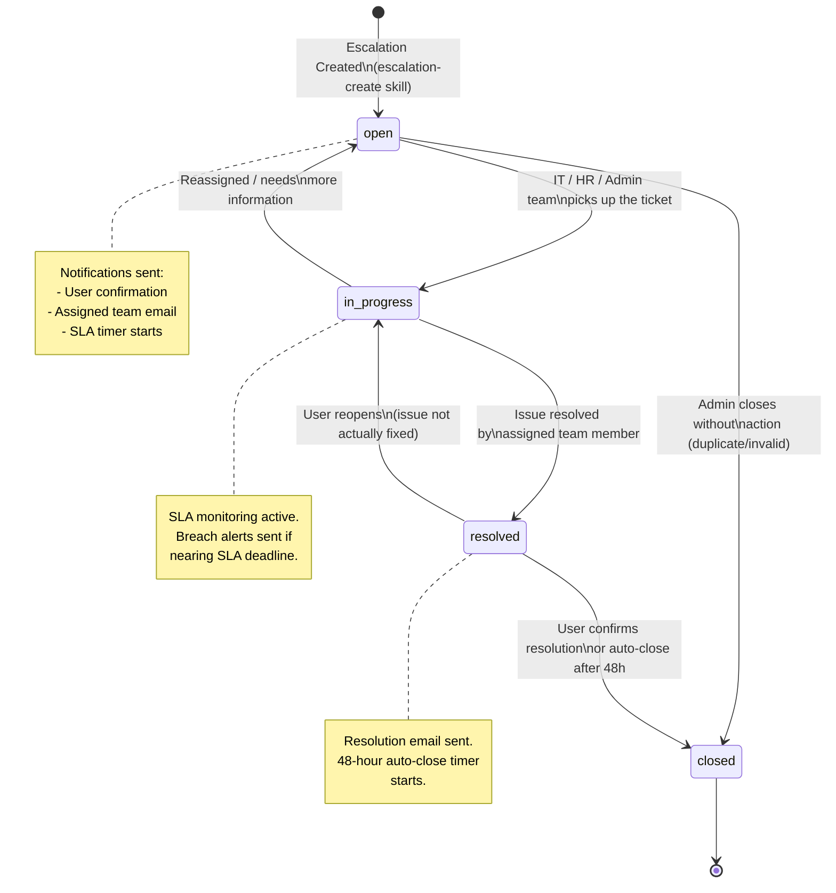

# Escalation Skills Specification
## AA-Hackathon Enterprise AI Platform — Aligned Automation

This document defines the full specification for the escalation system including the data model, escalation types, priority SLAs, status lifecycle, and all escalation-related skills.

---

## Escalation Status Lifecycle



---

## Escalation Data Model

### Table: `escalations`

```sql
CREATE TABLE escalations (
    id              UUID PRIMARY KEY DEFAULT gen_random_uuid(),
    user_id         UUID NOT NULL REFERENCES users(id) ON DELETE CASCADE,
    escalation_type VARCHAR(50) NOT NULL
                    CHECK (escalation_type IN ('HR', 'IT', 'Admin', 'Finance', 'Legal', 'Facility', 'Other')),
    subject         TEXT NOT NULL,
    priority        VARCHAR(20) NOT NULL DEFAULT 'medium'
                    CHECK (priority IN ('low', 'medium', 'high', 'critical')),
    status          VARCHAR(30) NOT NULL DEFAULT 'open'
                    CHECK (status IN ('open', 'in-progress', 'resolved', 'closed')),
    form_data       JSONB,
    assigned_to     UUID REFERENCES users(id) ON DELETE SET NULL,
    created_at      TIMESTAMPTZ NOT NULL DEFAULT NOW(),
    updated_at      TIMESTAMPTZ NOT NULL DEFAULT NOW(),
    resolved_at     TIMESTAMPTZ,
    closed_at       TIMESTAMPTZ,
    sla_deadline    TIMESTAMPTZ,
    sla_breached    BOOLEAN DEFAULT FALSE,
    resolution_note TEXT,
    conversation_id UUID REFERENCES conversations(id) ON DELETE SET NULL
);

-- Indexes for performance
CREATE INDEX idx_escalations_user_id ON escalations(user_id);
CREATE INDEX idx_escalations_status ON escalations(status);
CREATE INDEX idx_escalations_priority ON escalations(priority);
CREATE INDEX idx_escalations_type ON escalations(escalation_type);
CREATE INDEX idx_escalations_created_at ON escalations(created_at DESC);
CREATE INDEX idx_escalations_sla_deadline ON escalations(sla_deadline)
    WHERE status NOT IN ('resolved', 'closed');

-- Auto-update updated_at timestamp
CREATE OR REPLACE FUNCTION update_escalations_updated_at()
RETURNS TRIGGER AS $$
BEGIN
    NEW.updated_at = NOW();
    RETURN NEW;
END;
$$ LANGUAGE plpgsql;

CREATE TRIGGER escalations_updated_at
    BEFORE UPDATE ON escalations
    FOR EACH ROW EXECUTE FUNCTION update_escalations_updated_at();
```

### form_data JSONB Schema (by escalation_type)

**HR Escalation form_data**:
```json
{
  "category": "grievance | performance | policy | harassment | compensation | other",
  "incident_date": "ISO date string",
  "involved_parties": ["employee_id_1", "employee_id_2"],
  "description": "Detailed description",
  "evidence_references": ["doc_id_1"],
  "confidential": true,
  "hr_notes": "Internal HR notes"
}
```

**IT Escalation form_data**:
```json
{
  "original_ticket_id": "IT-2024-XXXX",
  "system_affected": "System or application name",
  "business_impact": "Description of operational impact",
  "time_elapsed_hours": 4,
  "users_affected": 1,
  "workaround_available": false,
  "vendor_involved": false
}
```

**Admin Escalation form_data**:
```json
{
  "original_request_id": "ADMIN-REQ-XXXX",
  "category": "travel | cab | parking | facility | supply | vendor | other",
  "business_impact": "Description of impact",
  "affected_employees": 5,
  "vendor_name": "Vendor if applicable",
  "sla_breach_evidence": "Details of SLA breach"
}
```

**Finance Escalation form_data**:
```json
{
  "amount": 50000,
  "currency": "INR",
  "category": "expense | invoice | reimbursement | budget | audit | other",
  "document_reference": "invoice_id or expense_id",
  "approval_chain": ["manager_id", "finance_head_id"],
  "urgency_reason": "Why urgent"
}
```

**Facility Escalation form_data**:
```json
{
  "location": "Floor 3, West Wing",
  "facility_type": "electrical | plumbing | hvac | safety | security | cleaning | other",
  "safety_risk": true,
  "affected_area_sqft": 200,
  "vendor_dispatched": false,
  "photos": ["photo_url_1", "photo_url_2"]
}
```

---

## Escalation Types

### HR Escalations
- **Trigger conditions**: Grievances, policy disputes, performance issues, harassment reports, compensation disputes, attendance disputes
- **Default email**: hr@alignedautomation.com
- **Escalation owner**: HR Business Partner → HR Director
- **Confidentiality**: All HR escalations are treated as confidential by default
- **Regulatory compliance**: Some HR escalations (harassment, discrimination) trigger mandatory legal review

### IT Escalations
- **Trigger conditions**: Unresolved IT tickets beyond SLA, security incidents, system outages, data breaches, vendor failures
- **Default email**: it.support@alignedautomation.com
- **Escalation owner**: IT Support Lead → IT Manager → CTO
- **Auto-trigger**: All security incidents automatically create IT escalation

### Admin Escalations
- **Trigger conditions**: Unresolved admin requests, facility emergencies, vendor complaints, SLA breaches
- **Default email**: admin@alignedautomation.com
- **Escalation owner**: Admin Coordinator → Admin Manager → COO

### Finance Escalations
- **Trigger conditions**: Overdue reimbursements, budget overruns, invoice disputes, audit findings, procurement exceptions
- **Default email**: finance@alignedautomation.com
- **Escalation owner**: Finance Analyst → Finance Manager → CFO

### Legal Escalations
- **Trigger conditions**: Contract disputes, regulatory violations, IP issues, employee legal matters
- **Default email**: legal@alignedautomation.com
- **Escalation owner**: Legal Counsel → Chief Legal Officer
- **Confidentiality**: Attorney-client privilege applies

### Facility Escalations
- **Trigger conditions**: Safety hazards, infrastructure failures, security breaches, environmental issues
- **Default email**: admin@alignedautomation.com (facilities sub-team)
- **Escalation owner**: Facilities Coordinator → Facilities Manager → Admin Director
- **Emergency protocol**: Physical safety risks trigger immediate escalation regardless of priority classification

### Other Escalations
- **Trigger conditions**: Cross-departmental issues, policy gaps, vendor management, audit-related
- **Default email**: management@alignedautomation.com
- **Escalation owner**: Determined by subject matter

---

## Priority SLA Matrix

| Priority | Description | Response SLA | Resolution SLA | Notification Recipients |
|----------|-------------|-------------|-----------------|------------------------|
| **critical** | Business-critical, safety risk, data breach, complete system outage, potential legal violation | Immediate (< 15 min) | 2 hours | Requester + Assigned Team + Manager + Director/C-Suite |
| **high** | Significant operational impact, multiple users affected, time-sensitive, SLA already breached | < 30 minutes | 4 hours | Requester + Assigned Team + Manager |
| **medium** | Moderate impact, single user/department affected, business continuity possible | < 2 hours | 1 business day | Requester + Assigned Team |
| **low** | Minor inconvenience, no immediate operational impact, routine requests | < 4 hours | 3 business days | Requester + Assigned Team |

### SLA Calculation Rules
- Business hours: Monday to Friday, 9:00 AM to 6:00 PM IST
- Critical escalations: 24/7 SLA (no business hours exclusion)
- High escalations: Extended hours SLA (7:00 AM to 9:00 PM IST on weekdays)
- Medium/Low escalations: Business hours only
- Public holidays: Added to SLA deadline automatically
- SLA breach: Automated alert sent when 80% of SLA time has elapsed
- SLA breach logged: `sla_breached = TRUE` set on table row

### Priority Auto-Escalation
If a `medium` escalation is not picked up within 4 hours (in-progress status), it auto-escalates to `high`.
If a `high` escalation is not resolved within 8 hours, it auto-escalates to `critical` with management notification.

---

## Skill 1: escalation-create

### Purpose
Creates a new escalation record in the escalations table, sends notifications to relevant teams, and provides the user with a tracking reference.

### Intent Phrases
- "Escalate this issue"
- "I need to raise a formal complaint"
- "Create an escalation for [issue]"
- "This needs management attention"
- "My request hasn't been resolved — escalate"
- "Raise a critical issue about [topic]"
- "Formal escalation needed"

### API Endpoint
`POST /api/escalations`

**Request**:
```json
{
  "user_id": "uuid",
  "escalation_type": "IT",
  "subject": "Production database unreachable for 3 hours",
  "priority": "critical",
  "form_data": {
    "original_ticket_id": "IT-2024-0901",
    "system_affected": "Production PostgreSQL",
    "business_impact": "All transactions blocked, revenue impact",
    "time_elapsed_hours": 3,
    "users_affected": 120,
    "workaround_available": false
  },
  "conversation_id": "conv-uuid"
}
```

**Response**:
```json
{
  "id": "esc-uuid",
  "subject": "Production database unreachable for 3 hours",
  "priority": "critical",
  "status": "open",
  "sla_deadline": "2024-12-01T14:00:00Z",
  "created_at": "2024-12-01T12:00:00Z",
  "tracking_url": "/escalations/esc-uuid"
}
```

### Inputs
| Field | Type | Required | Description |
|-------|------|----------|-------------|
| escalation_type | enum | Yes | HR / IT / Admin / Finance / Legal / Facility / Other |
| subject | string | Yes | Brief description (max 200 chars) |
| priority | enum | Yes | low / medium / high / critical |
| description | string | Yes | Full description of the issue |
| original_request_id | string | No | Reference to existing ticket |
| form_data | JSONB | No | Type-specific additional data |

### Outputs
- Escalation ID (UUID)
- SLA deadline
- Email notification sent to relevant team email
- Management notification (for high/critical)
- Confirmation message to user with tracking reference
- Status visible in EscalationDrawer.jsx

### Agent
**Escalation Agent** — Validates inputs, determines appropriate escalation_type if not specified, sets SLA deadline, creates record, triggers notifications.

### Notification Logic
```python
def send_escalation_notifications(escalation):
    # Always notify assigned team
    send_email(get_team_email(escalation.escalation_type), escalation)
    
    # Notify user
    send_email(escalation.user.email, "Escalation Created Confirmation")
    
    # High/Critical: also notify manager
    if escalation.priority in ['high', 'critical']:
        send_email(escalation.user.manager.email, "Escalation Alert")
    
    # Critical: also notify director/C-suite
    if escalation.priority == 'critical':
        send_email(get_director_email(escalation.escalation_type), "CRITICAL Escalation")
        send_email('management@alignedautomation.com', "CRITICAL Escalation Alert")
```

### Examples

**Example 1 — User Creates IT Escalation**
```
User: My VPN issue has been open for 6 hours with no response from IT
Agent: Creating IT escalation now.
       Escalation ESC-2024-0234 created (High priority — SLA breached).
       IT manager notified. Expected response within 30 minutes.
       SLA deadline: 4 hours from now.
       Track your escalation in the Escalation drawer or at [tracking link].
```

**Example 2 — HR Grievance Escalation**
```
User: I need to formally escalate a workplace grievance
Agent: I understand. This will be treated as confidential.
       [Collects: description, incident date, involved parties (if comfortable sharing)]
       HR Escalation ESC-2024-0235 created (Medium priority).
       HR Business Partner will contact you privately within 2 hours.
       This conversation is encrypted and accessible only to HR.
```

**Example 3 — Critical Facility Emergency**
```
User: There is a gas leak on Floor 4!
Agent: CRITICAL SAFETY ESCALATION CREATED IMMEDIATELY.
       ESC-2024-0236 (Critical — Safety Emergency)
       ⚠️ PLEASE EVACUATE FLOOR 4 NOW AND ALERT COLLEAGUES.
       Facilities Director + Building Security + Management notified.
       Emergency services: Call 112 if required.
       Escalation response: within 15 minutes.
```

---

## Skill 2: escalation-track

### Purpose
Allows users to check the current status, timeline, and updates of their submitted escalations by providing the escalation ID or via session context.

### Intent Phrases
- "What is the status of my escalation?"
- "Track escalation [ID]"
- "Has my escalation been resolved?"
- "When will my issue be fixed?"
- "Update on ESC-2024-XXXX"
- "Who is handling my escalation?"
- "Check my escalation status"

### API Endpoint
`GET /api/escalations/{escalation_id}`

**Response**:
```json
{
  "id": "esc-uuid",
  "subject": "VPN not working for 6 hours",
  "escalation_type": "IT",
  "priority": "high",
  "status": "in-progress",
  "assigned_to": {
    "name": "IT Support Lead",
    "email": "it.support@alignedautomation.com"
  },
  "created_at": "2024-12-01T09:00:00Z",
  "updated_at": "2024-12-01T10:30:00Z",
  "sla_deadline": "2024-12-01T13:00:00Z",
  "sla_breached": false,
  "resolution_note": null,
  "timeline": [
    {"timestamp": "2024-12-01T09:00:00Z", "event": "Escalation created", "by": "User"},
    {"timestamp": "2024-12-01T09:15:00Z", "event": "Notification sent to IT team", "by": "System"},
    {"timestamp": "2024-12-01T10:30:00Z", "event": "Picked up by IT Support Lead", "by": "IT Support Lead"}
  ]
}
```

### Outputs
- Current status of escalation
- Assigned team member name
- SLA deadline and time remaining
- Event timeline
- Resolution note (if resolved)
- Option to update escalation or add more information

### Agent
**Escalation Agent** — Retrieves escalation by ID (from user input or session context), formats status update for conversational response.

### Access Control
- Users can only view their own escalations
- HR/Admin/IT roles can view escalations in their domain
- Admin view: see all escalations (escalation-admin-view skill)

### Examples

**Example 1 — Status Check**
```
User: What's the status of my escalation ESC-2024-0234?
Agent: Escalation ESC-2024-0234 — VPN Issue (High Priority)
       Status: In Progress ✓
       Assigned to: Suresh Kumar (IT Support Lead)
       Created: Today 9:00 AM | SLA Deadline: Today 1:00 PM (2.5 hours remaining)
       Last update: Suresh picked up your ticket at 10:30 AM
       No breach risk currently. You'll receive an email when resolved.
```

**Example 2 — Resolved Escalation**
```
User: Is my HR escalation resolved?
Agent: Escalation ESC-2024-0235 — HR Grievance (Medium Priority)
       Status: Resolved ✓
       Resolution: HR team meeting conducted on Dec 1. Action plan documented.
       Resolved by: Anita Sharma (HR Business Partner) at 3:45 PM
       Resolution note: "Discussion conducted, corrective measures agreed upon with both parties."
       This will auto-close in 48 hours unless you reopen it.
       Were you satisfied with the resolution? (yes/no)
```

**Example 3 — SLA Breach Warning**
```
User: Any update on my escalation?
Agent: ⚠️ SLA Alert: Escalation ESC-2024-0236 (Medium Priority)
       Status: Open (not yet picked up)
       SLA Deadline: Passed 45 minutes ago — SLA BREACHED
       I've auto-escalated this to High priority and notified the IT Manager.
       Expected pickup within 30 minutes.
       Apologies for the delay. Updated Escalation ID: ESC-2024-0236-E1
```

---

## Skill 3: escalation-list

### Purpose
Lists all escalations created by the current user (or by team for managers), with filtering by status, type, and priority. Displays in EscalationDrawer.jsx.

### Intent Phrases
- "Show my escalations"
- "List all my open issues"
- "What escalations do I have?"
- "Show unresolved escalations"
- "My escalation history"
- "Show all IT escalations for my team" (manager)

### API Endpoint
`GET /api/escalations?user_id={uuid}&status={status}&type={type}&priority={priority}&page={n}&limit={n}`

**Response**:
```json
{
  "total": 5,
  "page": 1,
  "limit": 10,
  "escalations": [
    {
      "id": "esc-uuid-1",
      "subject": "VPN not working",
      "escalation_type": "IT",
      "priority": "high",
      "status": "in-progress",
      "created_at": "2024-12-01T09:00:00Z",
      "sla_deadline": "2024-12-01T13:00:00Z"
    }
  ]
}
```

### Filters
| Parameter | Options | Default |
|-----------|---------|---------|
| status | open / in-progress / resolved / closed / all | all |
| escalation_type | HR / IT / Admin / Finance / Legal / Facility / Other / all | all |
| priority | low / medium / high / critical / all | all |
| date_from | ISO date | 30 days ago |
| date_to | ISO date | today |
| page | integer | 1 |
| limit | integer (max 50) | 10 |

### EscalationDrawer.jsx Display
The escalation list is rendered in the EscalationDrawer.jsx component:
- Drawer slides in from the right side of the screen
- Grouped by status (Open → In Progress → Resolved → Closed)
- Color-coded by priority (red=critical, orange=high, yellow=medium, blue=low)
- Each escalation card shows: subject, type badge, priority badge, SLA countdown timer
- Click on card to expand details or view full timeline
- Filter bar at top with quick-filter chips
- "Create New Escalation" button in drawer header

### Examples

**Example 1 — View Open Escalations**
```
User: Show my open escalations
Agent: You have 2 open escalations:
       1. ESC-2024-0234 | IT | VPN Issue | HIGH | In Progress | SLA: 2.5hr remaining
       2. ESC-2024-0238 | Admin | Parking Request Pending | LOW | Open | SLA: 2 days remaining
       [Escalation Drawer opened with filtered list]
```

**Example 2 — Manager Team View**
```
User (Manager): Show all open IT escalations for my team
Agent: Open IT escalations for your team (Engineering):
       [Checking role: Manager confirmed]
       3 open IT escalations for Engineering team:
       1. ESC-2024-0242 | Priya Sharma | VPN Access | HIGH | 1hr remaining
       2. ESC-2024-0245 | Rahul Mehta | Software Install | MEDIUM | 6hr remaining
       3. ESC-2024-0248 | Arun Kumar | Laptop Hardware | LOW | 2 days remaining
```

---

## Skill 4: escalation-routing

### Purpose
Automatically determines the correct escalation type, priority, and routing target based on the nature of the user's issue. Used internally by other agents when they detect an issue requiring escalation.

### Routing Logic

```python
def route_escalation(user_message: str, context: dict) -> EscalationRoute:
    """
    3-tier routing for escalation classification.
    Returns: {type, priority, team_email, manager_notify, director_notify}
    """
    
    # Tier 1: Regex fast-path for obvious escalations
    if re.search(r'security|breach|hack|malware|ransomware|data leak', user_message, re.I):
        return EscalationRoute(type='IT', priority='critical',
                               team_email='it.support@alignedautomation.com',
                               manager_notify=True, director_notify=True)
    
    if re.search(r'harassment|discrimination|abuse|hostile|threat', user_message, re.I):
        return EscalationRoute(type='HR', priority='critical',
                               team_email='hr@alignedautomation.com',
                               manager_notify=False,  # HR handles directly
                               director_notify=True)
    
    if re.search(r'gas leak|fire|flood|injury|unsafe|evacuate', user_message, re.I):
        return EscalationRoute(type='Facility', priority='critical',
                               team_email='admin@alignedautomation.com',
                               manager_notify=True, director_notify=True)
    
    # Tier 2: LLM classification for nuanced cases
    llm_classification = classify_with_llm(user_message, context)
    return map_llm_result_to_route(llm_classification)
    
    # Tier 3: Keyword fallback
    # Department keywords → HR, IT keywords → IT, etc.
```

### Routing Rules

| Trigger Keywords | Type | Default Priority |
|-----------------|------|-----------------|
| security, breach, hack, malware | IT | critical |
| harassment, discrimination | HR | critical |
| gas leak, fire, injury | Facility | critical |
| vpn, password, access, software | IT | medium |
| leave, salary, performance review | HR | medium |
| travel, cab, parking, supply | Admin | low |
| invoice, expense, budget | Finance | medium |
| contract, legal, compliance | Legal | high |

### Auto-Priority Escalation Rules
- Issue open > 24h with no response → auto-upgrade priority by 1 level
- Multiple users affected → auto-set minimum priority to `high`
- Revenue-impacting issues → auto-set minimum priority to `high`
- Safety/health risks → always `critical` regardless of context

### Examples

**Internal Routing Example (Agent → Escalation Agent)**
```python
# IT Agent detecting SLA breach
if ticket_age_hours > sla_hours and ticket.status == 'open':
    escalation_route = escalation_routing(
        user_message=ticket.description,
        context={'sla_breached': True, 'original_ticket': ticket.id}
    )
    create_escalation(escalation_route)
```

---

## Skill 5: escalation-admin-view

### Purpose
Provides Admin, HR Director, IT Manager, and COO/CTO with a full view of all escalations across the organization, with analytics, bulk actions, and assignment management. Restricted to admin roles only.

### Intent Phrases
- "Show all escalations" (admin role)
- "View escalation dashboard"
- "Show critical escalations"
- "Assign escalation to team member"
- "Bulk close resolved escalations"
- "Escalation SLA report"
- "How many escalations are open today?"

### API Endpoints

**List All Escalations (Admin)**:
`GET /api/escalations/admin?status={status}&type={type}&priority={priority}&assigned_to={uuid}&date_from={date}&date_to={date}&page={n}`

**Update Escalation**:
`PATCH /api/escalations/{id}`
```json
{
  "status": "in-progress",
  "assigned_to": "uuid",
  "resolution_note": "Issue resolved by applying hotfix XYZ"
}
```

**Bulk Update**:
`POST /api/escalations/bulk-update`
```json
{
  "escalation_ids": ["uuid1", "uuid2"],
  "action": "close",
  "note": "Batch closed - resolved in system maintenance window"
}
```

**Analytics Summary**:
`GET /api/escalations/analytics?date_from={date}&date_to={date}`
```json
{
  "total": 47,
  "by_status": {"open": 8, "in-progress": 12, "resolved": 20, "closed": 7},
  "by_priority": {"critical": 2, "high": 8, "medium": 22, "low": 15},
  "by_type": {"IT": 18, "HR": 9, "Admin": 12, "Finance": 5, "Other": 3},
  "sla_breach_rate": 0.12,
  "avg_resolution_hours": 6.4,
  "open_critical_count": 2
}
```

### Access Control
| Role | Access Level |
|------|-------------|
| Super Admin | All escalations, all actions |
| HR Director | All HR escalations, read-only other types |
| IT Manager | All IT escalations, read-only other types |
| Admin Manager | All Admin and Facility escalations |
| Finance Manager | All Finance escalations |
| COO | All escalations (read-only dashboard) |
| Regular Employee | Own escalations only |

### Dashboard Features (EscalationDrawer.jsx Admin Mode)
- Total open count with color-coded priority breakdown
- SLA breach rate with trend indicator
- Average resolution time by type
- Escalation volume heatmap by day/hour
- Assignee workload distribution
- Top recurring issue categories
- Export to CSV / PDF report
- Real-time refresh (WebSocket updates)

### Examples

**Example 1 — Admin Dashboard View**
```
User (Admin): Show me today's escalation summary
Agent: Escalation Dashboard — Today (Dec 1, 2024)
       Total Open: 8 | In Progress: 12 | Resolved Today: 5
       ⚠️ Critical (open): 2 — IT: Production DB down, Finance: Payroll system error
       High Priority: 6 (4 within SLA, 2 at risk)
       SLA Breach Rate Today: 8% (1 breach out of 12 resolved)
       Average Resolution Time: 5.2 hours
       [Full dashboard opened in Escalation Drawer]
```

**Example 2 — Assign Escalation**
```
User (IT Manager): Assign ESC-2024-0234 to Suresh Kumar
Agent: Escalation ESC-2024-0234 assigned to Suresh Kumar.
       Status changed: open → in-progress
       Suresh notified via email. SLA deadline: 2:00 PM today (3 hours remaining).
       Suresh's current workload: 3 active escalations.
```

**Example 3 — SLA Breach Report**
```
User (COO): How many escalations breached SLA this month?
Agent: November 2024 SLA Breach Report:
       Total escalations: 124 | SLA Breaches: 15 (12.1%)
       By type: IT=8 breaches, Admin=4 breaches, HR=3 breaches
       Most common reason: Under-staffed during week of Nov 18 (holiday)
       Recommended action: Review staffing for holiday periods.
       Full report available for download in Escalation Drawer.
```

---

## Notification Templates

### Escalation Created (User Confirmation)
```
Subject: Escalation Created — [TYPE] [PRIORITY] — ESC-2024-XXXX

Your escalation has been logged:
- Escalation ID: ESC-2024-XXXX
- Type: [IT / HR / Admin / Finance / Legal / Facility]
- Priority: [critical / high / medium / low]
- Subject: [Subject]
- SLA Deadline: [Calculated deadline]

You will receive updates as your escalation progresses.
Track status: [tracking_url]

Aligned Automation AI Platform
```

### Escalation Team Notification
```
Subject: [PRIORITY] Escalation Assigned — ESC-2024-XXXX

A new [PRIORITY] escalation has been submitted:
- Employee: [Name] ([Department])
- Subject: [Subject]
- Details: [Description]
- SLA Deadline: [Deadline]
- Conversation ID: [conv_id]

Please pick up this escalation and update status promptly.
Action required by: [SLA Deadline]

Aligned Automation AI Platform
```

### SLA Breach Alert
```
Subject: ⚠️ SLA BREACH — ESC-2024-XXXX — [TYPE] [PRIORITY]

ATTENTION: The following escalation has exceeded its SLA:
- Escalation: ESC-2024-XXXX
- Priority: [PRIORITY]
- SLA Deadline: [Deadline]
- Time Overdue: [Minutes/Hours overdue]
- Current Status: [Status]
- Current Assignee: [Name or Unassigned]

Immediate action required. Auto-escalated to next priority level.
```

---

## Integration Points

| System | Integration | Purpose |
|--------|-------------|---------|
| Email (SMTP) | it.support@, hr@, admin@, finance@, management@ | Team notifications |
| EscalationDrawer.jsx | Frontend component | Render escalation list and details |
| Analytics pipeline | PostgreSQL query | SLA metrics, breach rates, volume |
| Conversation system | FK: conversation_id | Link escalation to originating chat |
| MasterAgent | Escalation routing | Auto-create escalations from other agents |
| pgvector/FAISS | RAG lookup | Similar past escalations for faster resolution |
