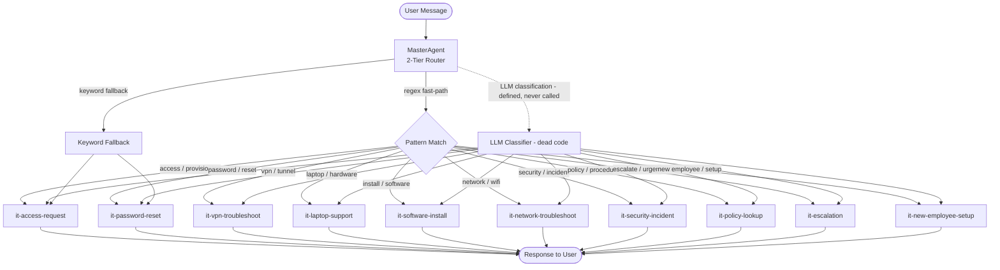

# IT Skills Specification
## AA-Hackathon Enterprise AI Platform — Aligned Automation

This document defines the full specification for all IT-domain skills handled by the IT Agent. These skills cover access provisioning, password management, VPN, hardware support, software installation, network troubleshooting, security incidents, policy lookups, and onboarding setup.

---

## IT Skill Routing Diagram



---

## Skill 1: it-access-request

### Purpose
Handles requests for new system access, role-based permissions, application provisioning, and access revocation. Guides users through the access request workflow and submits tickets to the IT team.

### Intent Phrases
- "I need access to [system/application]"
- "Can you provision my account for [tool]?"
- "I don't have access to [platform]"
- "Request access to [resource]"
- "My team needs access to [environment]"
- "Grant permission for [user] to [system]"
- "I need VPN credentials / Jira / Confluence / AWS / Azure access"

### Inputs
| Field | Type | Required | Description |
|-------|------|----------|-------------|
| system_name | string | Yes | Name of the system or application |
| access_type | enum | Yes | read / write / admin / view-only |
| requester_id | UUID | Yes | Employee ID from session |
| business_justification | string | Yes | Reason for access need |
| manager_approval | boolean | No | Whether manager pre-approved |
| target_user | string | No | If requesting on behalf of someone |
| urgency | enum | No | normal / urgent / critical |

### Outputs
- Confirmation message with ticket reference number
- Expected SLA timeline
- Email notification to it.support@alignedautomation.com
- Ticket entry in IT ticketing system
- Status tracking link

### Agent
**IT Agent** — Routes to the access provisioning sub-handler. Collects required fields via conversational form if not provided upfront. Creates escalation record if access is classified as privileged.

### SLA
| Priority | Response Time | Resolution Time |
|----------|---------------|-----------------|
| Critical | Immediate | 2 hours |
| High (privileged access) | 2 hours | 4 hours |
| Normal | 4 hours | 1 business day |
| Low | 1 business day | 3 business days |

### Fallback Behavior
If the IT Agent cannot determine the system or access type, it:
1. Prompts user for the specific system name
2. Lists common systems: Jira, Confluence, AWS, Azure, GitHub, Slack, Zoho
3. Directs to it.support@alignedautomation.com if ambiguous
4. Logs an unresolved intent for analytics

### Examples

**Example 1 — New Application Access**
```
User: I need access to Confluence
Agent: Sure! To set up your Confluence access, I need a bit more information.
       - What level of access do you need? (read / write / admin)
       - Can you provide a brief business justification?
User: Write access, I'm joining the documentation team
Agent: Got it! I've submitted your Confluence write access request.
       Ticket ID: IT-2024-0847
       Expected resolution: 1 business day
       Notification sent to it.support@alignedautomation.com
```

**Example 2 — Urgent Privileged Access**
```
User: I urgently need admin access to our production AWS environment
Agent: This is a privileged access request. I'm flagging it as High priority.
       I'll need your manager's approval reference before proceeding.
       Please provide the approval email or manager name.
User: My manager is Rajesh Kumar, he approved via email
Agent: Thank you. Escalation created (ESC-2024-0234).
       SLA: 4-hour resolution. IT team has been notified immediately.
```

**Example 3 — Access on Behalf of New Employee**
```
User: Can you set up Jira and Slack access for our new joiner Priya Sharma?
Agent: I'll create provisioning requests for Priya Sharma.
       - Jira: IT-2024-0848 (1 business day)
       - Slack: IT-2024-0849 (same day, automated)
       HR onboarding integration triggered for employee record.
```

---

## Skill 2: it-password-reset

### Purpose
Assists employees with password reset requests for corporate accounts, AD (Active Directory), SSO-connected applications, and specific software tools. Guides through self-service reset or escalates to IT for manual intervention.

### Intent Phrases
- "I forgot my password"
- "Reset my password for [system]"
- "My account is locked out"
- "Can't log in to [application]"
- "Password expired notification"
- "I need to change my password"
- "Account lockout / unlock my account"

### Inputs
| Field | Type | Required | Description |
|-------|------|----------|-------------|
| system_name | string | Yes | Which system password to reset |
| employee_id | UUID | Yes | From session context |
| account_email | string | Yes | Email associated with the account |
| lockout_reason | string | No | Why account is locked (too many attempts etc.) |
| urgency | enum | No | normal / urgent |

### Outputs
- Self-service password reset link (where applicable)
- IT ticket for manual reset with reference ID
- Instructions for AD password reset via corporate portal
- Email to it.support@alignedautomation.com for locked accounts
- Estimated wait time

### Agent
**IT Agent** — Self-service path triggered first; manual escalation path triggered if self-service fails or is not available for that system.

### SLA
| Type | Response Time |
|------|---------------|
| Self-service reset | Immediate (automated) |
| AD/Corporate reset | 30 minutes |
| Application-specific reset | 1-2 hours |
| Emergency (production access) | 15 minutes |

### Fallback Behavior
1. Provide self-service portal link if available
2. If no self-service, create IT ticket with urgent flag
3. Offer to escalate to IT support chat directly
4. Log to analytics as password issue category

### Examples

**Example 1 — Standard Password Reset**
```
User: I forgot my email password
Agent: I can help with that! Your corporate email is managed via Active Directory.
       Here's your self-service reset link: https://passwordreset.alignedautomation.com
       Use your employee ID to verify identity. Reset usually takes 2 minutes.
```

**Example 2 — Locked Account**
```
User: My Jira account is locked after too many login attempts
Agent: Account lockouts in Jira require IT intervention. I've created ticket IT-2024-0901.
       Expected unlock time: 30 minutes during business hours.
       An IT technician will also verify the attempts were legitimate.
```

**Example 3 — Off-hours Emergency**
```
User: I can't access the production server - password expired and team is waiting
Agent: This is flagged as URGENT. I've sent an emergency alert to it.support@alignedautomation.com
       with high priority flag. On-call IT engineer will respond within 15 minutes.
       Escalation ID: ESC-2024-0456
```

---

## Skill 3: it-vpn-troubleshoot

### Purpose
Assists employees experiencing VPN connectivity issues. Covers connection failures, authentication errors, slow VPN performance, split-tunneling questions, and VPN client installation.

### Intent Phrases
- "VPN is not connecting"
- "I can't connect to the office VPN"
- "VPN keeps disconnecting"
- "VPN is slow / lagging"
- "How do I install the VPN client?"
- "VPN authentication failed"
- "I'm working remotely and can't access internal resources"

### Inputs
| Field | Type | Required | Description |
|-------|------|----------|-------------|
| os_type | enum | Yes | Windows / macOS / Linux |
| vpn_client | string | No | FortiClient / Cisco AnyConnect / GlobalProtect |
| error_message | string | No | Exact error shown |
| location | string | No | Remote location / ISP |
| is_connected_but_slow | boolean | No | Performance issue vs connection issue |

### Outputs
- Step-by-step troubleshooting guide tailored to OS and error
- VPN client download link
- IT ticket if issue cannot be self-resolved
- Escalation to network team if infrastructure problem suspected

### Agent
**IT Agent** — Provides guided troubleshooting steps. If issue persists after steps, escalates to network team sub-handler.

### SLA
| Issue Type | Resolution Target |
|------------|-------------------|
| Self-service resolution | Immediate |
| IT-assisted VPN fix | 1 hour |
| Infrastructure-level VPN issue | 4 hours |

### Fallback Behavior
1. Provide generic VPN troubleshooting checklist
2. Collect diagnostic info (OS, error message, location)
3. Create IT ticket with all diagnostic context
4. Route to network-troubleshoot skill if infrastructure suspected

### Examples

**Example 1 — Connection Refused**
```
User: My VPN won't connect, getting "connection refused" error on Windows
Agent: Let's troubleshoot your VPN on Windows.
       Step 1: Open FortiClient and check server address is vpn.alignedautomation.com
       Step 2: Ensure Windows Firewall isn't blocking the VPN client
       Step 3: Try disconnecting WiFi and reconnecting before launching VPN
       Did any of these help? If not, I'll create an IT ticket for you.
```

**Example 2 — VPN Installation**
```
User: I'm a new employee and need to install the VPN
Agent: Welcome! Here's how to get started with our VPN:
       Download FortiClient from: [internal portal link]
       Installation guide: [link to IT documentation]
       VPN Server: vpn.alignedautomation.com
       Use your corporate email and AD password to authenticate.
```

**Example 3 — Slow VPN Performance**
```
User: VPN is connected but everything is super slow
Agent: Slow VPN can be caused by several factors. Let's check:
       1. Are you on WiFi or wired connection? WiFi on 2.4GHz is often congested.
       2. Try enabling split-tunneling if available in your FortiClient settings.
       3. Close bandwidth-heavy applications (video calls, large downloads).
       If still slow after 10 minutes, I'll escalate to our network team.
```

---

## Skill 4: it-laptop-support

### Purpose
Handles hardware issues related to employee laptops, desktops, monitors, keyboards, docking stations, and peripherals. Covers diagnostics, repair requests, hardware replacements, and equipment procurement.

### Intent Phrases
- "My laptop is not working"
- "Screen is broken / cracked"
- "Keyboard not responding"
- "My computer keeps crashing / BSOD"
- "Need a new monitor / docking station"
- "Battery not charging"
- "Laptop running very slow"
- "Request hardware replacement"

### Inputs
| Field | Type | Required | Description |
|-------|------|----------|-------------|
| device_type | enum | Yes | laptop / desktop / monitor / peripheral |
| issue_description | string | Yes | Detailed description of the problem |
| asset_tag | string | No | IT asset tag number on device |
| urgency | enum | No | normal / urgent / critical |
| os_version | string | No | OS and version |
| recent_changes | string | No | Recent updates or incidents |

### Outputs
- Diagnostic checklist to try before IT visit
- IT hardware ticket with asset details
- Pickup/delivery schedule for physical repair
- Loaner device provision confirmation
- Procurement request for new equipment

### Agent
**IT Agent** — Collects device info, runs through diagnostic flow, creates hardware ticket, optionally triggers loaner device request.

### SLA
| Priority | Response | Resolution |
|----------|----------|------------|
| Critical (complete failure) | 1 hour | Same day loaner |
| High (partially functional) | 4 hours | 2 business days |
| Normal | 1 business day | 5 business days |
| Procurement request | 2 business days | Per procurement policy |

### Fallback Behavior
1. Provide self-diagnostic steps
2. Create IT hardware ticket
3. Offer loaner device if primary device is unusable
4. Escalate to hardware vendor if under warranty

### Examples

**Example 1 — BSOD Crash**
```
User: My laptop keeps getting a blue screen error every hour
Agent: That sounds like it could be a driver or memory issue. Let me help.
       Please note: Does the BSOD show a specific error code? (e.g., MEMORY_MANAGEMENT)
       Quick steps to try: Update Windows, run memory diagnostics (mdsched.exe)
       I've also created ticket IT-HW-2024-0112. An IT tech will contact you within 4 hours.
```

**Example 2 — Broken Screen**
```
User: I dropped my laptop and the screen has a crack
Agent: Sorry to hear that! For physical damage:
       - Ticket IT-HW-2024-0113 created (High priority - physical damage)
       - A loaner laptop will be arranged within same business day
       - Please bring your damaged laptop to IT desk at Floor 2 or I can schedule a pickup.
       Asset tag: Please check the sticker on the bottom of your laptop.
```

**Example 3 — Equipment Request**
```
User: I need a second monitor for my desk
Agent: Monitor request noted! I've submitted a procurement request.
       - Ticket: IT-PROC-2024-0034
       - Standard monitor: 24" 1080p FHD
       - Expected delivery: 3-5 business days
       Your manager will receive an approval notification. Once approved, IT will deliver.
```

---

## Skill 5: it-software-install

### Purpose
Handles requests for software installation, license provisioning, software removal, and version upgrades. Covers approved software catalogue, security scan requirements, and license compliance.

### Intent Phrases
- "I need [software] installed"
- "Can you install [tool] on my machine?"
- "I need a license for [application]"
- "Update my [software] to latest version"
- "Remove / uninstall [software]"
- "Is [software] approved for use?"

### Inputs
| Field | Type | Required | Description |
|-------|------|----------|-------------|
| software_name | string | Yes | Name and version of software |
| business_justification | string | Yes | Why this software is needed |
| employee_id | UUID | Yes | Requester ID |
| device_asset_tag | string | No | Target device identifier |
| license_type | enum | No | individual / team / enterprise |

### Outputs
- Approval status from IT software catalogue
- Installation ticket with technician assignment
- License procurement ticket if new license needed
- Security compliance notification
- Estimated installation timeframe

### Agent
**IT Agent** — Checks internal approved software list, creates appropriate ticket type (installation vs. procurement vs. compliance review).

### SLA
| Type | Timeline |
|------|----------|
| Approved software from catalogue | Same day to 1 business day |
| New software requiring approval | 3-5 business days |
| Enterprise license procurement | 5-10 business days |

### Fallback Behavior
1. Check approved software catalogue
2. If not approved, initiate software approval request workflow
3. Escalate to IT security for any software requiring security review
4. Provide alternative approved software suggestions

### Examples

**Example 1 — Catalogue Software**
```
User: Can you install Postman on my laptop?
Agent: Postman is in our approved software catalogue! 
       Installation ticket IT-SW-2024-0087 created.
       An IT technician will deploy it remotely within 1 business day.
       You'll receive a notification when it's ready.
```

**Example 2 — New Software Request**
```
User: I need Figma Pro for my design work
Agent: Figma is approved but requires a Pro license allocation. 
       I've initiated a license request IT-LIC-2024-0023.
       Your manager will receive approval request. Timeline: 3-5 business days.
       In the meantime, Figma free tier is available at figma.com.
```

**Example 3 — Security Review Required**
```
User: Can I install a remote access tool called AnyDesk?
Agent: AnyDesk requires IT Security review before installation.
       I've created a security review request: IT-SEC-2024-0045.
       Timeline: 5 business days for review.
       Note: Unauthorized remote access tools may violate our security policy.
       Approved alternative: our corporate VPN for remote access needs.
```

---

## Skill 6: it-network-troubleshoot

### Purpose
Assists employees with network connectivity issues including WiFi problems, slow internet, inability to access internal resources, proxy issues, DNS failures, and firewall blocks.

### Intent Phrases
- "Internet is not working"
- "WiFi keeps dropping"
- "Can't access [internal resource]"
- "Website blocked / firewall issue"
- "Network is very slow"
- "DNS not resolving"
- "Can't reach internal servers"

### Inputs
| Field | Type | Required | Description |
|-------|------|----------|-------------|
| issue_type | enum | Yes | wifi / wired / internal-resource / internet / firewall |
| location | string | Yes | Office floor/room or remote |
| affected_resources | string | No | Specific sites or servers affected |
| os_type | enum | No | Windows / macOS / Linux |
| error_message | string | No | Browser or OS error message |

### Outputs
- Guided troubleshooting steps
- IT network ticket with diagnostic details
- Escalation to network infrastructure team
- Firewall exception request (if applicable)

### Agent
**IT Agent** — Initial troubleshooting with auto-escalation to network team if infrastructure issue suspected.

### SLA
| Issue | Resolution Target |
|-------|-------------------|
| Single user connectivity | 1 hour |
| Multiple users / floor outage | 30 minutes (critical) |
| Firewall exception request | 2 business days |
| DNS/Proxy configuration | 1 hour |

### Fallback Behavior
1. Run through standard network diagnostic steps
2. If multiple users affected, immediately escalate to network team
3. Create IT ticket with all diagnostic context collected

### Examples

**Example 1 — WiFi Dropping**
```
User: WiFi keeps dropping in the conference room on Floor 3
Agent: Intermittent WiFi in specific locations is often an access point issue.
       I've flagged this to our network team: IT-NET-2024-0056.
       Quick fix: Try connecting to the 5GHz band (AlignedAuto-5G) instead of 2.4GHz.
       If others in that room experience the same, it's likely an AP issue we'll escalate immediately.
```

**Example 2 — Internal Resource Access**
```
User: I can't access our internal HR portal from my home network via VPN
Agent: This could be a VPN routing issue. Please check:
       1. Confirm VPN is connected (green icon in FortiClient)
       2. Try accessing http://hr.internal.alignedautomation.com directly
       3. Run: ping hr.internal.alignedautomation.com
       If step 2 fails but VPN is connected, I'll escalate to IT-NET-2024-0057 for routing review.
```

**Example 3 — Firewall Block**
```
User: The website I need for my research is being blocked by the firewall
Agent: I can submit a firewall exception request for you.
       - URL to allow: [provided by user]
       - Business justification: [provided by user]
       Ticket: IT-FW-2024-0034. IT Security will review within 2 business days.
       If urgent, please note that in your justification.
```

---

## Skill 7: it-security-incident

### Purpose
Handles security incident reporting including phishing emails, malware alerts, suspicious activity, data breaches, lost/stolen devices, and unauthorized access attempts. Triggers immediate escalation protocols.

### Intent Phrases
- "I received a phishing email"
- "I think I clicked a malicious link"
- "My computer has a virus"
- "Suspicious login attempt on my account"
- "I lost my laptop"
- "Someone accessed my account without permission"
- "I think there's been a data breach"

### Inputs
| Field | Type | Required | Description |
|-------|------|----------|-------------|
| incident_type | enum | Yes | phishing / malware / unauthorized-access / lost-device / data-breach / suspicious-activity |
| description | string | Yes | Detailed incident description |
| when_occurred | datetime | Yes | When the incident was first noticed |
| data_involved | string | No | Types of data potentially compromised |
| systems_affected | string | No | Affected systems or accounts |

### Outputs
- Immediate security escalation (critical priority)
- Incident Report ID
- Guidance on immediate containment steps
- IT Security team notification
- Management notification for high-severity incidents
- Evidence preservation instructions

### Agent
**IT Agent** → **Escalation Agent** (automatic escalation for all security incidents)

### SLA
| Severity | Response Time | Escalation |
|----------|---------------|------------|
| Critical (breach/lost device) | Immediate | CISO + Management |
| High (malware/ransomware) | 15 minutes | IT Security + Manager |
| Medium (phishing clicked) | 1 hour | IT Security |
| Low (suspicious email) | 4 hours | IT Security queue |

### Fallback Behavior
All security incidents are treated as at least Medium priority. No security report goes unescalated. System creates escalation record automatically.

### Examples

**Example 1 — Phishing Email**
```
User: I got a suspicious email asking for my corporate password
Agent: IMPORTANT: Do NOT click any links or provide credentials.
       Steps to take immediately:
       1. Do not reply to the email
       2. Forward it to security@alignedautomation.com as an attachment
       3. Do not delete it yet - we need it as evidence
       Security incident logged: SEC-2024-0089 (Medium priority)
       IT Security will review within 1 hour.
```

**Example 2 — Malware Alert**
```
User: My antivirus is showing a virus warning and my files look encrypted
Agent: THIS IS A CRITICAL SECURITY INCIDENT - POSSIBLE RANSOMWARE.
       IMMEDIATE ACTIONS:
       1. DISCONNECT from all networks (unplug Ethernet, turn off WiFi)
       2. Do NOT restart your computer
       3. Do NOT try to open any files
       I am escalating this RIGHT NOW to our Security team.
       CRITICAL Incident: SEC-2024-0090 — IT Security + Management notified immediately.
```

**Example 3 — Lost Laptop**
```
User: I left my laptop on the train this morning
Agent: I understand — let's act quickly to protect company data.
       Immediate actions I'm triggering:
       1. Remote device lock initiated (if enrolled in MDM)
       2. Remote wipe scheduled (pending your confirmation)
       3. Account passwords flagged for forced reset
       Incident: SEC-2024-0091 (High priority - Lost Device)
       Please also file a police report and share the reference number with IT.
```

---

## Skill 8: it-policy-lookup

### Purpose
Answers questions about IT policies, acceptable use policies, security policies, BYOD policies, data retention policies, and IT compliance requirements by querying the knowledge base.

### Intent Phrases
- "What is the IT policy for [topic]?"
- "Can I use my personal phone for work email?"
- "What software can I install without approval?"
- "What is the password policy?"
- "How long do we retain data?"
- "Is [activity] allowed under IT policy?"
- "What are the acceptable use guidelines?"

### Inputs
| Field | Type | Required | Description |
|-------|------|----------|-------------|
| policy_topic | string | Yes | Topic or policy name to look up |
| context | string | No | Specific scenario to evaluate against policy |

### Outputs
- Relevant policy excerpt from knowledge base (RAG retrieval)
- Plain-language summary
- Links to full policy documents
- Relevant contact for policy clarification

### Agent
**IT Agent** → **Document Agent** (RAG retrieval from policy documents using 768-dim embeddings; pgvector is queried first, with the local FAISS knowledge base consulted only as a fallback when pgvector returns zero results)

### SLA
Response within conversation (real-time RAG lookup, target < 3 seconds).

### Fallback Behavior
1. If policy not found in knowledge base, provide general guidance
2. Direct to IT department for specific clarification
3. Log as knowledge gap for knowledge base improvement

### Examples

**Example 1 — BYOD Policy**
```
User: Can I use my personal iPhone to access work email?
Agent: According to our BYOD Policy (v2.3), personal devices may be used to access 
       corporate email provided:
       - MDM enrollment is completed via our self-service portal
       - Device is protected with a 6-digit PIN or biometric
       - Corporate data cannot be backed up to personal cloud storage
       Full policy: [IT Policy Portal > BYOD Policy]
```

**Example 2 — Password Requirements**
```
User: What are the password requirements for my corporate account?
Agent: Our Password Policy requires:
       - Minimum 12 characters
       - At least 1 uppercase, 1 lowercase, 1 number, 1 special character
       - Passwords expire every 90 days
       - Cannot reuse last 5 passwords
       - MFA required for all remote access
```

**Example 3 — Personal Software**
```
User: Can I install Chrome extensions on my work browser?
Agent: Per our Acceptable Use Policy, browser extensions require IT approval if they:
       - Request access to all website data
       - Send data to external servers
       - Modify network settings
       Pre-approved extensions list is available on the IT portal.
       Submit an extension approval request via: it-software-install skill.
```

---

## Skill 9: it-escalation

### Purpose
Creates formal IT escalation tickets for unresolved issues, complex problems requiring senior IT staff, vendor escalations, and SLA breaches. Integrates with the Escalations table and notifies it.support@alignedautomation.com.

### Intent Phrases
- "My IT issue hasn't been resolved"
- "I need to escalate this to IT management"
- "This is urgent and IT hasn't responded"
- "SLA has been breached"
- "Need senior IT engineer to look at this"
- "Vendor needs to be involved"
- "Escalate my ticket [ID]"

### Inputs
| Field | Type | Required | Description |
|-------|------|----------|-------------|
| original_ticket_id | string | No | Original IT ticket reference |
| issue_description | string | Yes | Nature of the unresolved issue |
| time_elapsed | string | No | How long issue has been open |
| business_impact | string | Yes | Impact of issue on work |
| priority | enum | Yes | low / medium / high / critical |
| requester_id | UUID | Yes | From session |

### Outputs
- Escalation record in escalations table (type: IT)
- Email to it.support@alignedautomation.com with escalation details
- Escalation ID for tracking
- Management notification (for critical/high priority)
- ETA for escalation response

### Data Model
```sql
INSERT INTO escalations (
    id,              -- UUID generated
    user_id,         -- From session context
    escalation_type, -- 'IT'
    subject,         -- Derived from issue description
    priority,        -- low / medium / high / critical
    status,          -- 'open' (initial state)
    form_data        -- JSONB: {original_ticket, business_impact, time_elapsed}
)
```

### SLA
| Priority | First Response | Resolution |
|----------|---------------|------------|
| Critical | Immediate | 2 hours |
| High | 30 minutes | 4 hours |
| Medium | 2 hours | 1 business day |
| Low | 4 hours | 3 business days |

### Examples

**Example 1 — SLA Breach**
```
User: My password reset ticket IT-2024-0901 has been open for 3 hours with no response
Agent: I'm escalating this now. SLA for password resets is 30 minutes.
       Escalation ESC-2024-0567 created (High priority).
       IT manager notified. Expected response within 30 minutes.
       Apologies for the delay - we'll investigate the SLA breach.
```

**Example 2 — Business-Critical Issue**
```
User: Our entire sales team can't access CRM since morning, business is impacted
Agent: This is a Critical escalation — multiple users affected, business-critical system.
       ESC-2024-0568 created (Critical priority).
       IT Director and on-call engineer notified immediately.
       Expected response: within 30 minutes.
       Workaround: Sales team can access CRM via mobile app temporarily.
```

---

## Skill 10: it-new-employee-setup

### Purpose
Orchestrates complete IT setup for new employees including device provisioning, account creation, software installation, access provisioning, and IT orientation. Typically triggered by HR onboarding flow at ITAccessStep.

### Intent Phrases
- "Set up IT for new employee [name]"
- "New joiner IT setup"
- "Provision accounts for [employee]"
- "I'm a new employee and need IT setup"
- "ITAccessStep triggered for onboarding"
- "Complete IT onboarding checklist"

### Inputs
| Field | Type | Required | Description |
|-------|------|----------|-------------|
| employee_name | string | Yes | Full name of new employee |
| employee_id | UUID | Yes | New employee's ID |
| department | string | Yes | Department they are joining |
| start_date | date | Yes | First day of employment |
| role | string | Yes | Job title |
| manager_id | UUID | Yes | Reporting manager's ID |
| office_location | string | Yes | Primary work location |
| remote_work | boolean | No | Whether employee works remotely |

### Outputs
- Complete IT setup checklist with status indicators
- Device provisioning request
- Account creation for: Email, Slack, Jira, Confluence, HR portal
- VPN credentials delivery schedule
- IT orientation meeting invitation
- Welcome email to new employee with IT information

### Onboarding IT Checklist
```
IT Setup Checklist for [Employee Name]
--------------------------------------
[ ] Corporate email account created
[ ] Active Directory account provisioned
[ ] Laptop configured and delivered
[ ] VPN access set up
[ ] Slack workspace access granted
[ ] Jira/Confluence account created
[ ] HR portal access enabled
[ ] Security training assigned
[ ] IT orientation scheduled
[ ] Equipment inventory logged
```

### Agent
**IT Agent** coordinates with HR Agent for onboarding step synchronization.

### SLA
All new employee IT setup must be completed before or on the employee's start date. Initiation must occur at least 3 business days before start date.

### Examples

**Example 1 — Standard Onboarding**
```
User (HR): Set up IT for Priya Sharma starting Monday in Engineering
Agent: IT setup initiated for Priya Sharma (Engineering, starting Monday).
       Progress:
       ✓ Email: priya.sharma@alignedautomation.com created
       ✓ AD account: provisioned
       ⏳ Laptop: MacBook Pro 14" - delivery scheduled for Friday
       ⏳ Jira/Confluence: provisioning in progress
       ✓ Slack: invited to #engineering and #general
       IT orientation booked: Monday 10am with IT team
```

**Example 2 — Remote Employee Setup**
```
User (HR): New remote employee Rahul Mehta joining Finance next Tuesday
Agent: Remote IT setup initiated for Rahul Mehta (Finance).
       Special arrangements for remote:
       - Laptop courier scheduled to home address (Friday delivery)
       - VPN credentials email scheduled for Monday morning
       - Remote IT orientation via Teams: Monday 11am
       - Home office equipment checklist sent to Rahul's personal email
```

**Example 3 — New Employee Self-Service**
```
User: Hi, I'm starting tomorrow and haven't received my IT setup yet
Agent: Welcome! Let me check your onboarding status.
       Please share your employee ID or the email HR used to contact you.
       [After verification]
       Found your record: IT setup is 80% complete.
       Pending: VPN credentials (sending now), Jira access (30 min).
       Your laptop should be at reception. Show your ID to collect it.
```

---

## IT Agent Configuration Summary

| Property | Value |
|----------|-------|
| Agent Class | ITAgent |
| Email Default | it.support@alignedautomation.com |
| Routing Method | 2-tier live (regex fast-paths → keyword scoring); an `_route_llm()` LLM classifier is defined in `supervisor_agent.py` but is never called |
| Escalation Integration | escalations table (type='IT') |
| Knowledge Base | IT policies, procedures, FAQs |
| Embedding Model | HuggingFace 768-dim |
| Vector Store | pgvector (primary) / FAISS (fallback) |
| LLM | Configurable: Anthropic Claude → Groq → Ollama (`gpt-oss`), selected by priority via environment flags; Ollama is the default/fallback, not the exclusive provider |
| Ticket System | Internal IT ticketing API |
| SLA Monitoring | Automated via analytics pipeline |
