# Onboarding Skills Specification
## AA-Hackathon Enterprise AI Platform — Aligned Automation

This document defines the full specification for the 8-step employee onboarding flow, including all components, hooks, APIs, step-specific actions, checklists, timelines, and examples.

---

## Onboarding Flow Diagram

```mermaid
flowchart LR
    START([New Employee\nJoins]) --> STEP1[Step 1\nWelcome]
    STEP1 -->|Proceed| STEP2[Step 2\nProfile]
    STEP2 -->|Proceed| STEP3[Step 3\nTeam]
    STEP3 -->|Proceed| STEP4[Step 4\nIT Access]
    STEP4 -->|Proceed| STEP5[Step 5\nDocuments]
    STEP5 -->|Proceed| STEP6[Step 6\nPolicy]
    STEP6 -->|Proceed| STEP7[Step 7\nInduction]
    STEP7 -->|Proceed| STEP8[Step 8\nAll Set!]
    STEP8 --> COMPLETE([Onboarding\nComplete])

    STEP1 -->|Skip| STEP2
    STEP2 -->|Back| STEP1
    STEP3 -->|Back| STEP2
    STEP4 -->|Back| STEP3
    STEP5 -->|Back| STEP4
    STEP6 -->|Back| STEP5
    STEP7 -->|Back| STEP6
    STEP8 -->|Back| STEP7

    STEP4 -.->|Trigger| IT_AGENT[IT Agent\nit-new-employee-setup]
    STEP5 -.->|Load| DOC_AGENT[Document Agent\nDocument fetching]
    STEP6 -.->|Load| RAG[RAG Knowledge Base\nPolicy retrieval]
    STEP7 -.->|Schedule| HR_AGENT[HR Agent\nInduction scheduling]

    style STEP1 fill:#6366f1,color:#fff
    style STEP2 fill:#3b82f6,color:#fff
    style STEP3 fill:#0ea5e9,color:#fff
    style STEP4 fill:#10b981,color:#fff
    style STEP5 fill:#f59e0b,color:#fff
    style STEP6 fill:#ef4444,color:#fff
    style STEP7 fill:#8b5cf6,color:#fff
    style STEP8 fill:#22c55e,color:#fff
    style COMPLETE fill:#22c55e,color:#fff
```



---

## State Management: useOnboardingState.js

The `useOnboardingState.js` hook manages all onboarding state across the 8 steps.

```javascript
// src/hooks/useOnboardingState.js

import { useState, useEffect, useCallback } from 'react';
import { onboardingApi } from '../api/onboardingApi';

const ONBOARDING_STEPS = [
  'welcome',      // Step 1
  'profile',      // Step 2
  'team',         // Step 3
  'it-access',    // Step 4
  'documents',    // Step 5
  'policy',       // Step 6
  'induction',    // Step 7
  'all-set'       // Step 8
];

export const useOnboardingState = (employeeId) => {
  const [currentStep, setCurrentStep] = useState(0);
  const [completedSteps, setCompletedSteps] = useState(new Set());
  const [skippedSteps, setSkippedSteps] = useState(new Set());
  const [stepData, setStepData] = useState({});
  const [isLoading, setIsLoading] = useState(false);
  const [error, setError] = useState(null);
  const [onboardingStatus, setOnboardingStatus] = useState('in-progress');
  // onboardingStatus: 'not-started' | 'in-progress' | 'completed'

  // Load saved onboarding progress from API on mount
  useEffect(() => {
    const loadProgress = async () => {
      setIsLoading(true);
      try {
        const progress = await onboardingApi.getProgress(employeeId);
        setCurrentStep(progress.current_step_index);
        setCompletedSteps(new Set(progress.completed_steps));
        setSkippedSteps(new Set(progress.skipped_steps));
        setStepData(progress.step_data);
        setOnboardingStatus(progress.status);
      } catch (err) {
        setError(err.message);
      } finally {
        setIsLoading(false);
      }
    };
    if (employeeId) loadProgress();
  }, [employeeId]);

  const goToStep = useCallback((stepIndex) => {
    setCurrentStep(Math.max(0, Math.min(stepIndex, ONBOARDING_STEPS.length - 1)));
  }, []);

  const completeStep = useCallback(async (stepIndex, data = {}) => {
    setCompletedSteps(prev => new Set([...prev, ONBOARDING_STEPS[stepIndex]]));
    setStepData(prev => ({ ...prev, [ONBOARDING_STEPS[stepIndex]]: data }));
    
    // Persist to API
    await onboardingApi.markStepComplete(employeeId, ONBOARDING_STEPS[stepIndex], data);
    
    // Auto-advance to next step
    if (stepIndex < ONBOARDING_STEPS.length - 1) {
      setCurrentStep(stepIndex + 1);
    } else {
      setOnboardingStatus('completed');
      await onboardingApi.completeOnboarding(employeeId);
    }
  }, [employeeId]);

  const skipStep = useCallback(async (stepIndex) => {
    setSkippedSteps(prev => new Set([...prev, ONBOARDING_STEPS[stepIndex]]));
    await onboardingApi.skipStep(employeeId, ONBOARDING_STEPS[stepIndex]);
    if (stepIndex < ONBOARDING_STEPS.length - 1) {
      setCurrentStep(stepIndex + 1);
    }
  }, [employeeId]);

  const isStepComplete = (stepIndex) => completedSteps.has(ONBOARDING_STEPS[stepIndex]);
  const isStepSkipped = (stepIndex) => skippedSteps.has(ONBOARDING_STEPS[stepIndex]);
  const overallProgress = Math.round((completedSteps.size / ONBOARDING_STEPS.length) * 100);

  return {
    currentStep,
    completedSteps,
    skippedSteps,
    stepData,
    isLoading,
    error,
    onboardingStatus,
    overallProgress,
    goToStep,
    completeStep,
    skipStep,
    isStepComplete,
    isStepSkipped,
    ONBOARDING_STEPS
  };
};
```

---

## API Module: onboardingApi.js

```javascript
// src/api/onboardingApi.js

const BASE_URL = '/api/onboarding';

export const onboardingApi = {
  getProgress: (employeeId) =>
    fetch(`${BASE_URL}/progress/${employeeId}`).then(r => r.json()),

  markStepComplete: (employeeId, step, data) =>
    fetch(`${BASE_URL}/step/complete`, {
      method: 'POST',
      headers: {'Content-Type': 'application/json'},
      body: JSON.stringify({ employee_id: employeeId, step, data })
    }).then(r => r.json()),

  skipStep: (employeeId, step) =>
    fetch(`${BASE_URL}/step/skip`, {
      method: 'POST',
      headers: {'Content-Type': 'application/json'},
      body: JSON.stringify({ employee_id: employeeId, step })
    }).then(r => r.json()),

  completeOnboarding: (employeeId) =>
    fetch(`${BASE_URL}/complete`, {
      method: 'POST',
      headers: {'Content-Type': 'application/json'},
      body: JSON.stringify({ employee_id: employeeId })
    }).then(r => r.json()),

  getChecklistItems: (employeeId, step) =>
    fetch(`${BASE_URL}/checklist/${employeeId}/${step}`).then(r => r.json()),

  uploadDocument: (employeeId, documentType, file) => {
    const form = new FormData();
    form.append('file', file);
    form.append('employee_id', employeeId);
    form.append('document_type', documentType);
    return fetch(`${BASE_URL}/documents/upload`, { method: 'POST', body: form }).then(r => r.json());
  },

  acknowledgePolicy: (employeeId, policyId) =>
    fetch(`${BASE_URL}/policy/acknowledge`, {
      method: 'POST',
      headers: {'Content-Type': 'application/json'},
      body: JSON.stringify({ employee_id: employeeId, policy_id: policyId })
    }).then(r => r.json()),

  scheduleInduction: (employeeId, sessionId) =>
    fetch(`${BASE_URL}/induction/schedule`, {
      method: 'POST',
      headers: {'Content-Type': 'application/json'},
      body: JSON.stringify({ employee_id: employeeId, session_id: sessionId })
    }).then(r => r.json())
};
```

---

## Shared Components

### WelcomeHeader
Displays the personalized welcome banner at the top of the onboarding flow.

```jsx
// Props:
// - employeeName: string
// - role: string
// - department: string
// - startDate: Date
// - progressPct: number (0-100)

<WelcomeHeader
  employeeName="Priya Sharma"
  role="Senior Engineer"
  department="Engineering"
  startDate={new Date('2024-12-01')}
  progressPct={37.5}
/>
```
Displays: Avatar/initials circle, name, role, department, start date badge, and a progress bar showing overall onboarding completion.

### OnboardingSteps
Progress indicator showing all 8 steps with completion status.

```jsx
// Renders horizontal stepper (desktop) or vertical stepper (mobile)
// Each step shows: step number, icon, label, status (complete/current/pending/skipped)
```

### StepNavigator
Back / Next / Skip buttons at the bottom of each step with validation logic.

### ChecklistPanel
Renders a checklist of items for the current step with toggle checkboxes.

```jsx
// Props:
// - items: Array<{id, label, required, completed, skippable}>
// - onToggle: (itemId: string) => void
// - title: string
```

### DocumentPanel
File upload and document preview panel used in the Documents step.

```jsx
// Props:
// - documents: Array<{type, label, required, uploaded, fileUrl}>
// - onUpload: (type: string, file: File) => void
// - onDownload: (docId: string) => void
```

### TimelinePanel
Shows the onboarding timeline with dates and milestones.

```jsx
// Displays: start date, probation period, confirmation date, key milestones
```

### TrainingGrid
Grid of assigned training modules and courses for the Induction step.

```jsx
// Props:
// - modules: Array<{id, title, duration_min, category, status, url}>
// - onMarkComplete: (moduleId: string) => void
```

### HRNotes
Private notes panel visible only to HR team members when reviewing an employee's onboarding progress.

### StatusBadge
Color-coded badge showing step status.
| Status | Color | Label |
|--------|-------|-------|
| complete | Green | Done |
| current | Blue | In Progress |
| pending | Gray | Pending |
| skipped | Yellow | Skipped |
| blocked | Red | Action Required |

---

## Step 1: WelcomeStep

### Purpose
Orients the new employee to the platform, introduces the AI assistant, explains what the onboarding process covers, and sets expectations for their first days at Aligned Automation.

### Component
`WelcomeStep.jsx`

### Actions
- Display personalized welcome message with employee's name, role, and department
- Show 8-step onboarding overview with estimated time per step
- Introduce the AI assistant and its capabilities
- Display first-day logistics (office location, reporting manager, buddy assignment)
- Show "Start Onboarding" button to begin Step 2

### Checklist Items
```
WelcomeStep Checklist:
[✓] Read welcome message (auto-completed)
[ ] Meet your onboarding buddy: [Buddy Name]
[ ] Add company calendar to your email (link provided)
[ ] Download Aligned Automation mobile app
[ ] Watch 3-minute platform introduction video
```

### Content Displayed
- Personalized greeting: "Welcome to Aligned Automation, [Name]!"
- Role and department confirmation
- Reporting manager: [Manager Name]
- Office location and floor details
- Onboarding buddy: [Buddy Name, Contact]
- Estimated onboarding completion time: 45-60 minutes
- Link to platform introduction video

### Timeline Milestones
| Day | Milestone |
|-----|-----------|
| Day 1 | Complete onboarding Steps 1-4 |
| Day 1-2 | IT setup complete, all systems accessible |
| Day 3 | Meet key team members |
| Week 1 | Complete all 8 onboarding steps |
| Week 2 | Shadow team in daily work |
| Month 1 | First performance check-in |
| Month 3 | Probation mid-point review |
| Month 6 | Probation confirmation |

### Examples

**Example 1 — First Login**
```
User opens platform for first time:
WelcomeStep displays:
"Welcome to Aligned Automation, Priya! 🎉
You're joining our Engineering team as Senior Engineer, reporting to Rajesh Kumar.
We're thrilled to have you!

Your onboarding has 8 quick steps — let's get you fully set up.
Estimated time: 45 minutes | You can pause and resume anytime.

Your onboarding buddy: Ananya Kumar (ananya.kumar@alignedautomation.com)
Office: Floor 3, Engineering Bay | Start time: 9:30 AM

Ready? Let's begin! → [Start Onboarding]"
```

**Example 2 — Returning to Resume**
```
User logs back in on Day 2:
"Welcome back, Priya! You're making great progress.
Completed: 3 of 8 steps (37.5%)
Up next: Step 4 — IT Access Setup
Estimated remaining time: 25 minutes
[Continue Onboarding]"
```

---

## Step 2: ProfileStep

### Purpose
Collects and verifies the employee's professional profile information, contact details, emergency contacts, and preferences to create a complete employee profile in the system.

### Component
`ProfileStep.jsx`

### Actions
- Display pre-filled profile data from HR system
- Allow employee to review and update:
  - Display name / preferred name
  - Personal email (secondary)
  - Phone number
  - Emergency contact details
  - Office location / seating preference
  - Profile photo upload
  - LinkedIn URL (optional)
  - Skills and expertise tags
  - Languages spoken
- Save profile via `PATCH /api/employees/{id}/profile`
- Validate all required fields before allowing step completion

### Checklist Items
```
ProfileStep Checklist:
[ ] Verify your name and display name
[ ] Add your phone number
[ ] Add emergency contact (required)
[ ] Upload a profile photo
[ ] Review your department and reporting manager
[ ] Add your skills/expertise (optional)
[ ] Set office seating preference (optional)
```

### Profile Fields
| Field | Required | Pre-filled | Editable |
|-------|----------|------------|---------|
| Full name | Yes | Yes (from HR) | No |
| Display name | No | Yes | Yes |
| Employee ID | Yes | Yes | No |
| Corporate email | Yes | Yes | No |
| Personal email | No | No | Yes |
| Phone number | Yes | Maybe | Yes |
| Department | Yes | Yes | No |
| Designation | Yes | Yes | No |
| Reporting manager | Yes | Yes | No |
| Office location | Yes | Yes | Yes |
| Emergency contact name | Yes | No | Yes |
| Emergency contact phone | Yes | No | Yes |
| Emergency contact relation | Yes | No | Yes |
| Profile photo | No | No | Yes |
| LinkedIn URL | No | No | Yes |
| Skills tags | No | No | Yes |

### Examples

**Example 1 — Profile Review**
```
ProfileStep displays pre-filled data:
"Review your profile information, Priya.
Most details have been imported from HR records.
Please verify and fill in the missing information.

Required: Emergency contact details are missing.
[Fill in Emergency Contact →]"
```

**Example 2 — Photo Upload**
```
User uploads profile photo:
"Profile photo uploaded successfully!
Your photo will appear in the company directory,
chat messages, and your team's allocation board.
[Change Photo] [Continue →]"
```

---

## Step 3: TeamStep

### Purpose
Introduces the employee to their immediate team, key stakeholders, and the broader organization. Provides an org chart view and suggested introductions.

### Component
`TeamStep.jsx`

### Actions
- Display immediate team members with photos and roles
- Show org chart (manager → peers → direct reports if applicable)
- Suggest "Introduce yourself" email templates to key contacts
- List upcoming team meetings/standups to join
- Show team communication channels (Slack groups, Teams channels)
- Recommend 1-on-1 meetings to schedule in first week

### Checklist Items
```
TeamStep Checklist:
[ ] Review your team org chart
[ ] Note your team's Slack channel: #engineering
[ ] Schedule 1:1 with your manager in Week 1
[ ] Schedule coffee chat with 2 team members
[ ] Join team standup: Daily 10 AM on Teams
[ ] Send self-introduction email to team
```

### Team Information Displayed
- Immediate team: Photos, names, roles, contact info
- Reporting manager: Name, photo, calendar link (book a meeting)
- HR Business Partner for department
- IT point of contact for Engineering
- PMO contact (if applicable)
- Department Slack channel and Teams group

### Introduction Email Template
```
Subject: Hello from [Name] — New [Role] in [Department]

Hi Team,

I'm [Name], and I'm excited to be joining the [Department] team as your new [Role]!

A little about me: [2-3 sentences about background and interests]

I look forward to meeting everyone and contributing to our great work here.
Please feel free to reach out — I'd love to connect!

Best,
[Name]
[Email] | [Phone]
```

### Examples

**Example 1 — Team Introduction**
```
TeamStep shows:
"Your Engineering Team (15 members)

Your Manager: Rajesh Kumar
- Book a 1:1: [Calendar link]
- Email: rajesh.kumar@alignedautomation.com

Your Peers (direct colleagues):
- Ananya Kumar (Frontend Lead) — your onboarding buddy
- Suresh Patel (Backend Engineer)
- Kiran Mehta (QA Lead)
[View full team org chart →]

Suggested this week:
→ Team standup: Daily 10 AM (Teams — link in calendar)
→ Send introduction email: [Draft prepared, click to review]"
```

---

## Step 4: ITAccessStep

### Purpose
Orchestrates the complete IT setup for the new employee by triggering the `it-new-employee-setup` skill. Tracks the status of each IT provisioning task and guides the employee through accessing their new accounts.

### Component
`ITAccessStep.jsx`

### Trigger
This step triggers the **IT Agent's `it-new-employee-setup` skill** automatically when the employee reaches Step 4, passing all necessary employee data collected in prior steps.

### Actions
- Automatically trigger `it-new-employee-setup` skill via API call
- Display real-time IT setup checklist with live status updates
- Provide access instructions for each provisioned system
- Guide employee through first login for each system
- Handle MFA/2FA setup instructions
- Allow employee to report IT issues directly from this step
- Connect employee to IT team chat if any setup fails

### IT Setup Checklist (auto-populated by IT Agent)
```
IT Access Setup — Priya Sharma
================================
[✓] Corporate email created: priya.sharma@alignedautomation.com
[✓] Active Directory account provisioned
[✓] Microsoft 365 license assigned
[⏳] Laptop configuration: MacBook Pro 14" (ready by EOD today)
[⏳] Jira account: provisioning in progress (30 min)
[✓] Confluence account: created
[✓] Slack: invited to #engineering, #general, #random
[⏳] VPN credentials: email scheduled for this afternoon
[✓] HR portal access: enabled
[✓] Zoom/Teams: account created
[ ] Security training: assigned (complete in Step 7)
[ ] IT orientation: scheduled for tomorrow 10 AM
```

### Status Polling
The ITAccessStep polls `GET /api/it/onboarding-status/{employee_id}` every 60 seconds to update checklist item statuses in real-time.

### System Access Instructions

**Corporate Email**:
```
Access your email at: https://outlook.office365.com
Username: priya.sharma@alignedautomation.com
Password: Temporary password in separate email to personal inbox
Action required: Change password on first login
```

**Jira**:
```
Access at: https://alignedautomation.atlassian.net
Login: Use corporate email (SSO)
Your projects: [Engineering - Client Portal]
```

**Slack**:
```
Join at: https://alignedautomation.slack.com
Use corporate email to sign in
Channels to join: #engineering, #general, #random, #team-standups
```

### Checklist Items
```
ITAccessStep Checklist:
[ ] Receive temporary email password (check personal inbox)
[ ] Change corporate email password on first login
[ ] Set up MFA on corporate account
[ ] Log in to Jira with SSO
[ ] Log in to Confluence
[ ] Join Slack workspace and key channels
[ ] Install VPN client (FortiClient)
[ ] Configure VPN with provided credentials
[ ] Log in to HR portal
[ ] Complete device setup when laptop arrives
```

### Timeline
| Task | Expected Completion |
|------|-------------------|
| Email account | Day 1 morning |
| AD + Microsoft 365 | Day 1 morning |
| Jira / Confluence | Day 1 within 2 hours |
| Slack | Day 1 immediate |
| VPN credentials | Day 1 afternoon |
| Laptop delivery | Day 1 EOD (if office) or 3 days (if remote) |
| IT orientation | Day 2 morning |

### Examples

**Example 1 — IT Setup Triggered**
```
Employee reaches Step 4:
"Setting up your IT access! This usually takes about 30 minutes.
Our IT team has been notified and is provisioning your accounts.

Live Setup Status:
✓ Email: priya.sharma@alignedautomation.com — Ready!
✓ Slack: Invited to #engineering
⏳ Jira: Provisioning... (estimated 25 min)
⏳ VPN: Credentials being prepared

Check your personal email for your temporary corporate email password.
First action: Log in to Outlook and change your password!"
```

**Example 2 — IT Setup Delay**
```
Employee reports issue:
"My Jira access still isn't working after 2 hours"
Agent: "I'm following up with IT immediately.
IT Ticket IT-2024-0901 flagged as urgent.
IT tech Suresh will contact you within 30 minutes.
In the meantime, Confluence access is ready — you can start there."
```

---

## Step 5: DocumentsStep

### Purpose
Manages the collection and submission of all required documents from the new employee, including identity verification, educational certificates, previous employment documents, and policy acknowledgments.

### Component
`DocumentsStep.jsx`

### Actions
- Display required document list categorized by type
- Allow file uploads (PDF, JPG, PNG) via DocumentPanel component
- Validate file size (max 10MB per file) and format
- Track document review status (uploaded / under-review / approved / rejected)
- Send documents securely to HR team for verification
- Allow re-upload if documents are rejected with reason

### Required Documents List
| Document | Category | Required | Format |
|----------|----------|----------|--------|
| Government ID (Aadhaar/Passport) | Identity | Yes | PDF/JPG |
| PAN Card | Tax/Identity | Yes | PDF/JPG |
| Educational Certificates (Highest) | Qualifications | Yes | PDF |
| Previous Employment Certificate | Experience | If applicable | PDF |
| Offer Letter Signed Copy | Employment | Yes | PDF |
| Bank Account Details (Cancelled cheque) | Finance | Yes | PDF/JPG |
| Passport-size Photos (2) | HR Records | Yes | JPG/PNG |
| Emergency Contact Form | HR Records | Yes | PDF |
| Non-Disclosure Agreement | Legal | Yes | PDF (signed) |
| Background Check Consent Form | HR/Legal | Yes | PDF (signed) |

### Document Status States
| Status | Description | Action Required |
|--------|-------------|----------------|
| not-uploaded | Document not yet submitted | Upload document |
| uploaded | Submitted, pending HR review | Wait for review |
| under-review | HR team is reviewing | No action |
| approved | Document verified and accepted | Complete |
| rejected | Document rejected — see reason | Re-upload with corrections |

### Checklist Items
```
DocumentsStep Checklist:
[ ] Upload Government ID (Aadhaar or Passport)
[ ] Upload PAN Card
[ ] Upload highest educational certificate
[ ] Upload previous employment certificate (if applicable)
[ ] Upload signed offer letter
[ ] Upload bank account proof (cancelled cheque)
[ ] Upload 2 passport-size photos
[ ] Sign and upload NDA
[ ] Sign and upload background check consent
[ ] Confirm all documents are accurate and genuine
```

### Timeline
| Action | Timeline |
|--------|----------|
| Document upload deadline | Before end of Day 3 |
| HR initial review | Within 1 business day |
| Full verification (background check) | 2-5 business days |
| HR confirmation email | Within 5 business days |

### Examples

**Example 1 — Document Upload**
```
DocumentsStep displays:
"Please upload the following required documents, Priya.
All documents are stored securely and accessible only to HR.

9 of 10 documents completed! ✅
Pending: Background Check Consent Form
[Download Form] → [Sign] → [Upload]

Documents Under Review: 8 documents submitted for HR review.
Expected review completion: December 3, 2024 (2 business days)"
```

**Example 2 — Document Rejected**
```
HR rejects a document:
"⚠️ Document Update Required
Your educational certificate was not accepted.
Reason: Please upload the degree certificate (not mark sheets).
[Re-upload Educational Certificate]"
```

---

## Step 6: PolicyStep

### Purpose
Guides the employee through reviewing and acknowledging key company policies they are required to read as part of their onboarding. Uses RAG knowledge base to make policies easily searchable and understandable.

### Component
`PolicyStep.jsx`

### Actions
- Display required policy list with read/acknowledge toggles
- Provide RAG-powered Q&A for each policy ("Ask a question about this policy")
- Track acknowledgment with timestamp and employee ID
- Send acknowledgment records to HR system
- Generate acknowledgment certificates for critical policies
- Flag incomplete acknowledgments as blockers for step completion

### Required Policies for Acknowledgment
| Policy | Category | Acknowledgment Required | Source |
|--------|----------|------------------------|--------|
| Code of Conduct | HR | Yes (signature) | HR portal |
| IT Security Policy | IT | Yes (digital sign) | IT portal |
| Data Privacy & GDPR Policy | Legal | Yes | Legal docs |
| Work From Home Policy | HR | Yes | HR portal |
| Social Media Policy | HR | Yes | HR portal |
| Anti-Harassment & POSH Policy | HR | Yes (mandatory) | HR/Legal |
| BYOD Policy | IT | Yes | IT portal |
| Expense & Reimbursement Policy | Finance | Yes | Finance docs |
| Leave Policy | HR | Yes | HR portal |
| Acceptable Use Policy | IT | Yes | IT portal |

### Policy RAG Integration
Each policy is indexed in the RAG knowledge base (384-dim HuggingFace embeddings + pgvector).

Employee can ask: "What does the IT security policy say about personal device usage?"
→ RAG retrieves relevant section and provides plain-language answer.
→ Source reference shown with exact policy clause number.

### Checklist Items
```
PolicyStep Checklist:
[ ] Read and acknowledge Code of Conduct
[ ] Read and acknowledge IT Security Policy
[ ] Read and acknowledge Data Privacy Policy
[ ] Read and acknowledge WFH Policy
[ ] Read and acknowledge Social Media Policy
[ ] Read and acknowledge POSH/Anti-Harassment Policy (mandatory)
[ ] Read and acknowledge BYOD Policy
[ ] Read and acknowledge Expense Policy
[ ] Read and acknowledge Leave Policy
[ ] Read and acknowledge Acceptable Use Policy
```

### Acknowledgment Record
```python
# Stored in policy_acknowledgments table
INSERT INTO policy_acknowledgments (
    id,           -- UUID
    employee_id,  -- References employee
    policy_id,    -- Which policy
    policy_version, -- Version acknowledged
    acknowledged_at, -- Timestamp
    ip_address,   -- For audit trail
    digital_signature -- Checkbox/signature confirmation
)
```

### Timeline
All policies must be acknowledged within the employee's first 3 working days.

### Examples

**Example 1 — Policy Acknowledgment**
```
PolicyStep displays:
"Please review and acknowledge the following company policies.
8 of 10 policies acknowledged ✅

Pending (required):
⚠️ POSH/Anti-Harassment Policy — MANDATORY
   [Read Policy (PDF)] [Ask AI about this policy] [Acknowledge ✓]

⚠️ Data Privacy Policy — Required before system access
   [Read Policy (PDF)] [Ask AI about this policy] [Acknowledge ✓]"

User asks: "Can I use WhatsApp for work communication?"
AI answers: "Per the Social Media and Communication Policy (Section 3.2):
WhatsApp is permitted for informal team communication but should NOT be used
to share confidential data, client information, or internal documents.
For official business communication, use corporate email or Microsoft Teams."
```

**Example 2 — POSH Policy Q&A**
```
User: "What should I do if I witness harassment?"
AI (RAG): "Under our POSH Policy (Section 6, Bystander Obligations):
If you witness harassment, you should:
1. Report to your HR Business Partner or use the anonymous reporting portal
2. Do not retaliate against anyone involved
3. Maintain confidentiality
4. Cooperate with any investigation if requested
The company guarantees confidentiality and non-retaliation for all reporters.
HR contact for reporting: hr@alignedautomation.com"
```

---

## Step 7: InductionStep

### Purpose
Provides structured induction content including company culture, values, organizational history, business overview, and role-specific training. Assigns mandatory training modules and schedules induction sessions with HR and department heads.

### Component
`InductionStep.jsx`

### Actions
- Display induction schedule and assigned training modules
- Allow employee to view/watch induction content (videos, presentations)
- Track training module completion via TrainingGrid component
- Schedule induction sessions (HR-led orientation, department induction) via HR Agent
- Assign role-specific training modules
- Issue training completion certificates for completed modules
- Flag mandatory modules that must be completed before Day 10

### Induction Content Modules

**Mandatory for All Employees**:
| Module | Duration | Format | Deadline |
|--------|----------|--------|---------|
| Company Overview & History | 20 min | Video | Day 3 |
| Mission, Vision & Values | 15 min | Interactive | Day 3 |
| Organizational Structure | 10 min | Presentation | Day 3 |
| Information Security Awareness | 45 min | E-learning | Day 5 |
| POSH Awareness Training | 30 min | E-learning | Day 5 |
| Data Privacy & GDPR | 25 min | E-learning | Day 5 |
| Workplace Safety | 20 min | Video | Day 7 |
| Platform Tutorial | 15 min | Interactive | Day 2 |

**Role-Specific (Engineering)**:
| Module | Duration | Format | Deadline |
|--------|----------|--------|---------|
| Engineering Processes & SDLC | 60 min | Video | Week 2 |
| Code Review Standards | 30 min | Documentation | Week 2 |
| Deployment & CI/CD Workflow | 45 min | Hands-on | Week 2 |
| Architecture Overview | 60 min | Presentation | Week 2 |
| On-call Rotation Intro | 20 min | Documentation | Week 3 |

### Induction Sessions (Live)
```
Scheduled Induction Sessions:
[ ] Day 1 PM: IT Orientation (IT Team) — 30 min — Teams
[ ] Day 2 AM: HR Orientation (HR Team) — 60 min — Conference Room B
[ ] Day 3: Meet Department Head — 45 min — Rajesh Kumar's office
[ ] Week 1 End: Team Retrospective/Welcome — 1 hour — All team
[ ] Month 1: Onboarding Feedback Session — 30 min — HR Team
```

### TrainingGrid.jsx Display
- Module cards in a grid layout (3 columns on desktop, 1 on mobile)
- Each card: Module title, duration, category badge, completion status, launch button
- Progress bar at top: "X of Y modules completed"
- Filter by category / mandatory status
- Sort by deadline

### Checklist Items
```
InductionStep Checklist:
[ ] Complete Company Overview video (20 min)
[ ] Complete Mission & Values module (15 min)
[ ] Complete Information Security training (45 min) — MANDATORY
[ ] Complete POSH Awareness training (30 min) — MANDATORY
[ ] Complete Data Privacy training (25 min) — MANDATORY
[ ] Attend IT Orientation (Day 1 PM)
[ ] Attend HR Orientation (Day 2 AM)
[ ] Meet with Department Head (Day 3)
[ ] Complete Platform Tutorial (15 min)
[ ] Schedule role-specific training modules for Week 2
```

### HR Agent Integration
The Induction step integrates with the HR Agent to:
- Schedule HR orientation sessions
- Send calendar invites for all induction sessions
- Notify department head of new joiner's schedule
- Assign buddy for first-week shadowing

### Timeline
| Milestone | When |
|-----------|------|
| Complete mandatory training | By Day 5 |
| Attend all live induction sessions | By Day 5 |
| Role-specific training | By end of Week 2 |
| Training completion certificates | Auto-issued on completion |
| Month 1 feedback session | Day 30 |

### Examples

**Example 1 — Training Progress**
```
InductionStep shows:
"Induction Progress — Week 1:
✅ 5 of 13 modules completed (38%)

Mandatory modules due by Day 5:
✓ Company Overview (complete)
✓ Mission & Values (complete)
⚠️ Information Security — DUE TOMORROW [Start Now]
⚠️ POSH Awareness — DUE TOMORROW [Start Now]
⏳ Data Privacy — Due Day 5 [Start]

Upcoming Live Sessions:
📅 Tomorrow 10 AM — IT Orientation (Teams) [Add to Calendar]"
```

**Example 2 — Schedule Induction**
```
User: Schedule my HR orientation
HR Agent: HR Orientation scheduled!
          Date: Tuesday, December 3, 2024 at 10:00 AM
          Location: Conference Room B, Floor 3
          Host: Anita Sharma (HR Business Partner)
          Duration: 60 minutes
          Calendar invite sent to priya.sharma@alignedautomation.com
          Please bring: Any pending document queries
```

---

## Step 8: AllSetStep

### Purpose
Confirms successful completion of the onboarding process, celebrates the achievement, provides a summary of what was accomplished, and sets the employee up with resources for continued success.

### Component
`AllSetStep.jsx`

### Actions
- Validate all required checklist items are complete across all 7 prior steps
- Display completion celebration (animated confetti, congratulations message)
- Show onboarding completion summary (all completed steps, documents, policies acknowledged)
- Issue digital onboarding completion certificate
- Trigger notifications to HR, IT, and Manager that onboarding is complete
- Show "What's Next" guide for the employee's first month
- Update employee status in HR system from "onboarding" to "active"
- Enable full platform access (previously restricted features unlocked)

### Completion Summary
```
Onboarding Complete Summary:
==============================
Steps Completed: 8/8 ✅
Documents Submitted: 10/10 ✅
Policies Acknowledged: 10/10 ✅
Training Completed: 8/8 mandatory modules ✅
IT Setup: All systems provisioned ✅
Induction Sessions: 3/3 attended ✅

Time to Complete: 4 days 2 hours
Date Completed: December 4, 2024
```

### "What's Next" Guide
| Timeline | Activity |
|----------|----------|
| Week 1-2 | Shadow team in daily work, attend all standups |
| Week 2 | Complete role-specific training modules |
| Month 1 | First 1:1 performance check-in with manager |
| Month 3 | Probation mid-point review |
| Month 6 | Probation confirmation |
| Day 30 | Onboarding feedback survey |

### Notifications Triggered
```python
# On AllSetStep completion:
notify_hr(employee_id, "Onboarding complete")
notify_manager(employee_id, "Onboarding complete — employee ready")
notify_it(employee_id, "Onboarding complete — full access enabled")
update_employee_status(employee_id, status="active")
generate_completion_certificate(employee_id)
schedule_month1_checkin(employee_id, manager_id)
send_feedback_survey(employee_id, delay_days=30)
```

### Completion Certificate
A digital certificate is generated using jsPDF:
```
ONBOARDING COMPLETION CERTIFICATE
----------------------------------
This certifies that Priya Sharma
Employee ID: AA-2024-0234
Role: Senior Engineer — Engineering

Has successfully completed the
Aligned Automation Employee Onboarding Program

Completed: December 4, 2024
Duration: 4 days
Modules Completed: 13
Policies Acknowledged: 10

[Digital Signature — HR Head]        [Company Seal]
Certificate ID: CERT-OB-2024-0234
```

### Checklist Items (Final Verification)
```
AllSetStep — Final Verification:
[ ] All 7 previous steps complete (auto-checked)
[ ] All mandatory documents submitted
[ ] All policies acknowledged
[ ] Mandatory training modules complete
[ ] Corporate email set up and accessible
[ ] VPN configured and tested
[ ] All required system access obtained
[ ] Met with manager and onboarding buddy
[ ] Submitted onboarding completion acknowledgment
```

### Examples

**Example 1 — Successful Completion**
```
AllSetStep displays:
"🎉 Congratulations, Priya! You're All Set!

You've successfully completed your onboarding at Aligned Automation!
[Confetti animation plays]

Onboarding Summary:
✅ 8 steps completed | ✅ 10 documents submitted | ✅ 10 policies acknowledged
✅ 8 training modules | ✅ All IT systems set up | ✅ All inductions attended

Completion Time: 4 days — impressive!

Your digital certificate has been sent to priya.sharma@alignedautomation.com
Your manager, Rajesh Kumar, has been notified that you're all set!

What's Next:
Week 1: Join the team standup daily at 10 AM
Week 2: Complete your role-specific Engineering training
Month 1: 1:1 check-in with Rajesh scheduled for January 1

We're so glad to have you on the team! 🚀"
```

**Example 2 — Incomplete Steps Blocked**
```
Employee tries to complete All Set step with pending items:
"Almost there, Priya! Just a couple of things remaining:
⚠️ POSH Awareness Training not completed (mandatory — due yesterday)
⚠️ Data Privacy Policy not acknowledged

Please complete these to finalize your onboarding.
[Go to Step 7 — Complete POSH Training]
[Go to Step 6 — Acknowledge Data Privacy Policy]

Note: These are mandatory compliance requirements.
Contact hr@alignedautomation.com if you need an extension."
```

**Example 3 — Remote Employee Completion**
```
AllSetStep for remote employee Rahul Mehta:
"🎉 Welcome aboard, Rahul! All Set — Remote Edition!

Remote Setup Confirmed:
✅ Laptop delivered to home address on Dec 3
✅ VPN configured and tested (confirmed working)
✅ All cloud tools accessible from home
✅ Virtual onboarding sessions attended
✅ Remote work policy acknowledged

Remote Work Reminders:
• Log your WFH days in the HR portal
• Core hours: 10 AM - 4 PM IST
• Team standup: Daily 10 AM (Teams)
• Your manager: rajesh.kumar@alignedautomation.com

You're officially part of the Aligned Automation Engineering team! 🚀"
```

---

## Onboarding Configuration Summary

| Property | Value |
|----------|-------|
| Total Steps | 8 |
| Hook | useOnboardingState.js |
| API Module | onboardingApi.js |
| State Persistence | PostgreSQL (via onboardingApi) |
| Step Save | Auto-save on completion, manual save on each field |
| Resumability | Full resume from any step |
| Estimated Time | 45-60 minutes total |
| Required Completion | All mandatory items (skippable items excluded) |
| Certificate | jsPDF generated on AllSet completion |
| HR Notifications | On each step completion + final completion |
| IT Integration | Step 4 triggers it-new-employee-setup |
| RAG Integration | Step 6 (policy Q&A) |
| LLM | Ollama (gpt-oss) for conversational assistance |
| Mobile Support | All 8 steps responsive (vertical stepper on mobile) |
| Completion Tracking | analytics_events table (step_complete events) |
