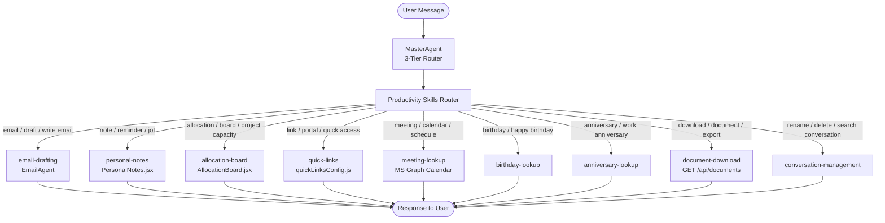

# Productivity Skills Specification
## AA-Hackathon Enterprise AI Platform — Aligned Automation

This document defines the full specification for all productivity-related skills in the platform, covering email drafting, personal notes, the allocation board, quick links, meeting and people lookups, document downloads, and conversation management.

---

## Productivity Skills Overview

The productivity cluster provides employees with AI-assisted tools for daily work tasks beyond Q&A and escalation. These skills integrate with Microsoft Graph API, Zoho, jsPDF, and internal platform APIs.



---

## Skill 1: email-drafting

### Purpose
Assists users in composing professional email drafts using the Email Agent. The platform generates draft emails based on user intent and context but does NOT send emails directly. Output is a formatted TO / SUBJECT / BODY that the user reviews and sends manually from their email client.

### Email Agent Architecture
The Email Agent (EmailAgent) is a dedicated agent accessed via `EmailAgentPage.jsx`. It can be invoked directly via the email page or triggered from any chat conversation using the email-drafting skill.

### Intent Phrases
- "Draft an email to [person] about [topic]"
- "Write an email requesting [something]"
- "Help me compose an email to [recipient]"
- "Create an email for [purpose]"
- "Write a professional email to my manager about [subject]"
- "Draft a follow-up email for [meeting/project]"
- "Compose an email informing the team about [update]"

### API Endpoint
`POST /api/email-agent/from-chat`

**Request**:
```json
{
  "user_id": "uuid",
  "conversation_id": "uuid",
  "intent": "Draft a professional email requesting approval for my travel to Bangalore next Monday",
  "context": {
    "recipient_hint": "manager",
    "topic": "travel approval",
    "tone": "professional",
    "urgency": "normal"
  }
}
```

**Response**:
```json
{
  "draft": {
    "to": "manager.name@alignedautomation.com",
    "cc": [],
    "subject": "Travel Approval Request — Bangalore Client Visit, Monday Dec 4",
    "body": "Dear [Manager Name],\n\nI hope this message finds you well.\n\nI am writing to request your approval for a business trip to Bangalore on Monday, December 4, 2024, in connection with the [Client Name] client visit.\n\nTrip Details:\n- Destination: Bangalore\n- Travel Date: Monday, December 4, 2024\n- Return: Tuesday, December 5, 2024\n- Purpose: Client meeting — project status review\n- Estimated Budget: INR 8,000 (travel + accommodation)\n\nPlease let me know if you need any additional information or if there are any concerns regarding this request.\n\nThank you for your time and consideration.\n\nBest regards,\n[Your Name]\n[Your Designation]\nAligned Automation"
  },
  "alternatives": [
    {"tone": "concise", "subject": "Travel Request: Bangalore, Dec 4"},
    {"tone": "formal", "subject": "Request for Approval: Business Travel to Bangalore — December 4, 2024"}
  ],
  "email_defaults_used": {
    "IT": "it.support@alignedautomation.com",
    "HR": "hr@alignedautomation.com",
    "Admin": "admin@alignedautomation.com",
    "Management": "management@alignedautomation.com"
  }
}
```

### Output Format
All email drafts are returned as:
```
TO: [recipient email or placeholder]
CC: [cc recipients if applicable]
SUBJECT: [Subject line]
BODY:
[Full email body with proper greeting, paragraphs, and signature]
```

### Email Default Recipients
| Context | Email Address |
|---------|--------------|
| IT issues | it.support@alignedautomation.com |
| HR matters | hr@alignedautomation.com |
| Admin requests | admin@alignedautomation.com |
| Management / escalation | management@alignedautomation.com |
| Finance | finance@alignedautomation.com |
| Legal | legal@alignedautomation.com |

### Tone Options
| Tone | Description | Use Case |
|------|-------------|----------|
| professional | Formal business language | External clients, senior management |
| concise | Short, to-the-point | Internal team updates |
| formal | Highly structured | Legal, compliance, official matters |
| friendly | Warm, approachable | Team announcements, celebrations |
| urgent | Direct, action-oriented | Time-sensitive requests |

### Inputs
| Field | Type | Required | Description |
|-------|------|----------|-------------|
| intent | string | Yes | What the email should accomplish |
| recipient | string | No | Name, role, or email of recipient |
| topic | string | No | Subject matter |
| tone | enum | No | professional / concise / formal / friendly / urgent |
| key_points | list | No | Specific points to include |
| deadline | date | No | If email is time-sensitive |

### Outputs
- Formatted email draft with TO / SUBJECT / BODY
- 2-3 alternative tone variants
- Copy-to-clipboard button in EmailAgentPage.jsx
- "Open in Outlook" deeplink (if MS Graph integration active)

### EmailAgentPage.jsx Features
- Dedicated email drafting interface at route `/email-agent`
- Conversation history sidebar showing all past draft sessions
- Real-time draft preview panel
- Tone selector (dropdown)
- Length control (brief / standard / detailed)
- Key points input (bullet list assistant)
- "Regenerate" button for alternative drafts
- Copy button for each field (TO, SUBJECT, BODY)
- Integration notice: "This is a draft only — please send from your email client"

### SLA
Email drafts generated in < 5 seconds (LLM generation via Ollama gpt-oss).

### Fallback Behavior
1. If recipient is unclear, prompt user to specify or use department default
2. If intent is ambiguous, ask 1-2 clarifying questions
3. If LLM unavailable, provide template-based draft

### Examples

**Example 1 — IT Issue Email**
```
User: Draft an email to IT about my VPN not working
Agent: Email Draft Ready!
TO: it.support@alignedautomation.com
SUBJECT: VPN Connectivity Issue — Assistance Required

Dear IT Support Team,

I am experiencing VPN connectivity issues on my [OS] device. Despite multiple attempts,
I am unable to establish a stable VPN connection.

Error encountered: [Please add specific error message]
Device: [Your laptop model]
Time first noticed: [Today/specific time]

I would appreciate your prompt assistance as this is affecting my ability to access
internal resources while working remotely.

Thank you,
[Your Name]
[Department] | Aligned Automation
```

**Example 2 — Manager Escalation**
```
User: Write an urgent email to my manager that our team needs more resources for the project
Agent: Email Draft — Urgent Tone:
TO: [Manager's Email]
SUBJECT: URGENT: Resource Allocation Request — [Project Name]

Dear [Manager Name],

I wanted to bring to your attention an urgent resource constraint affecting our team's
ability to deliver [Project Name] on schedule.

Current Situation:
- Team capacity: [X] engineers
- Required capacity: [Y] engineers for current sprint
- Risk: Timeline delay of approximately [Z] weeks without additional resources

I would appreciate a quick discussion at your earliest convenience to explore options
including temporary staff augmentation or scope adjustment.

Please let me know your availability for a brief call today or tomorrow.

Best regards,
[Your Name]
```

**Example 3 — Team Announcement**
```
User: Draft a friendly email announcing our team offsite on Dec 15
Agent: Friendly Announcement Email:
TO: [Team Distribution List]
SUBJECT: 🎉 Team Offsite — December 15! Details Inside

Hi Team,

Exciting news! We've planned a team offsite on December 15, 2024, and we cannot wait!

Event Details:
📅 Date: Saturday, December 15, 2024
📍 Venue: [Venue Name, City]
🕙 Time: 10:00 AM onwards

The day will include team activities, lunch, and plenty of fun.
Please complete the registration form by December 10 to confirm your attendance.

Looking forward to seeing everyone there!

Cheers,
[Your Name]
```

---

## Skill 2: personal-notes

### Purpose
Provides a personal note-taking space within the platform where employees can jot down reminders, action items, meeting notes, and personal tasks. Notes are private to the individual user and stored securely.

### Component: `PersonalNotes.jsx`

**Route**: Accessible via sidebar icon or `/notes` route. Notes panel can also be opened as a floating drawer from anywhere in the app.

### Intent Phrases
- "Add a note: [content]"
- "Remind me to [task]"
- "Save this note: [content]"
- "What are my notes?"
- "Show my reminders"
- "Delete note [title]"
- "Search my notes for [keyword]"

### API Endpoints

**Create Note**:
`POST /api/notes`
```json
{
  "user_id": "uuid",
  "title": "Meeting with Rajesh - Action Items",
  "content": "1. Send project status report by Friday\n2. Schedule follow-up call\n3. Review Q4 budget",
  "tags": ["meeting", "project", "action-item"],
  "pinned": false,
  "reminder_at": "2024-12-05T09:00:00Z"
}
```

**List Notes**:
`GET /api/notes?user_id={uuid}&search={q}&tag={tag}&pinned={bool}&page={n}`

**Update Note**:
`PATCH /api/notes/{id}`

**Delete Note**:
`DELETE /api/notes/{id}`

### Note Features
| Feature | Description |
|---------|-------------|
| Rich text | Markdown-formatted content |
| Tags | Custom tags for organization |
| Pin | Pin important notes to top |
| Reminder | Optional date/time reminder |
| Search | Full-text search across all notes |
| Archive | Archive old notes without deleting |
| Color coding | 6 color options for visual organization |

### PersonalNotes.jsx UI Elements
- **Notes list**: Left panel, scrollable, sorted by updated_at
- **Note editor**: Right panel, markdown-capable text editor
- **Search bar**: Real-time search across title and content
- **Tag filter**: Click tags to filter notes
- **Pin toggle**: Star icon to pin/unpin
- **Reminder bell**: Set reminder date/time
- **Color picker**: 6 pastel color options
- **Archive button**: Move to archive section
- **Delete button**: Permanent delete with confirmation

### Data Privacy
- Notes are completely private to the individual user
- No admin or manager can view another user's notes
- Notes are encrypted at rest in PostgreSQL
- Notes deleted by user are purged within 30 days

### Examples

**Example 1 — Add a Quick Note**
```
User: Add a note: Call Rahul tomorrow about project timeline
Agent: Note saved!
       Title: Call Rahul — Project Timeline
       Reminder: Set for tomorrow 9:00 AM
       [Note appears in PersonalNotes panel]
       Would you like to add any details or set a specific time?
```

**Example 2 — Meeting Notes**
```
User: Save meeting notes: discussed Q4 targets, agreed on 15% growth goal, next meeting Jan 5
Agent: Meeting notes saved!
       Title: Q4 Target Discussion — Meeting Notes
       Tags: #meeting #q4 #targets
       [Note saved with timestamp]
       Reminder for January 5 meeting set as follow-up.
```

**Example 3 — Search Notes**
```
User: Find my notes about the Bangalore project
Agent: Found 3 notes matching "Bangalore":
       1. "Bangalore Client Visit - Action Items" (Dec 1)
       2. "Bangalore Trip Budget Notes" (Nov 28)
       3. "Bangalore Project Status" (Nov 20)
       [PersonalNotes panel opened with filtered results]
```

---

## Skill 3: allocation-board

### Purpose
Displays the team resource allocation board showing employee project assignments, capacity utilization, availability, and allocation percentages sourced from Zoho People/Projects. Primarily used by PMO roles and managers.

### Component: `AllocationBoard.jsx`

**Route**: `/allocation-board`

### Intent Phrases
- "Show the allocation board"
- "What is [employee]'s current allocation?"
- "Who is available for a new project?"
- "Show team capacity this sprint"
- "Allocation for [project name]"
- "Who has bandwidth in the engineering team?"
- "Show over-allocated employees"

### Zoho Integration
Allocation data is sourced from **Zoho Projects** via API:
```
GET /api/zoho/allocation?team={team}&date_from={date}&date_to={date}
```

**Authentication**: Zoho OAuth 2.0 token (stored in backend secrets, not exposed to frontend)

**Zoho Response Mapped to Internal Format**:
```json
{
  "team": "Engineering",
  "period": {"from": "2024-12-01", "to": "2024-12-31"},
  "employees": [
    {
      "employee_id": "uuid",
      "name": "Priya Sharma",
      "role": "Senior Engineer",
      "department": "Engineering",
      "total_capacity_pct": 100,
      "allocated_pct": 85,
      "available_pct": 15,
      "projects": [
        {
          "project_id": "proj-001",
          "project_name": "Client Portal v2",
          "allocation_pct": 60,
          "from": "2024-11-01",
          "to": "2024-12-31"
        },
        {
          "project_id": "proj-002",
          "project_name": "Internal Dashboard",
          "allocation_pct": 25,
          "from": "2024-12-01",
          "to": "2024-12-15"
        }
      ],
      "status": "normal"  // normal / at-risk / over-allocated / available
    }
  ],
  "summary": {
    "total_employees": 15,
    "fully_allocated": 4,
    "over_allocated": 2,
    "available": 9
  }
}
```

### AllocationBoard.jsx UI Elements

**View Modes**:
| Mode | Description |
|------|-------------|
| Timeline View | Gantt-style chart showing project blocks per employee |
| Table View | Grid with employees as rows, metrics as columns |
| Heatmap View | Color-coded capacity grid (green=available, red=over-allocated) |

**Filters**:
- Department / Team filter
- Date range picker (week / month / quarter)
- Status filter (all / available / at-risk / over-allocated)
- Project filter (show employees on specific project)

**Color Coding**:
| Color | Allocation Status | Range |
|-------|-----------------|-------|
| Green | Available | 0-69% |
| Yellow | Normal / At-risk | 70-89% |
| Orange | High allocation | 90-100% |
| Red | Over-allocated | > 100% |

**Actions (PMO role only)**:
- Drag-to-reassign allocation percentages
- "Find available resource" button
- Export allocation report (CSV)
- Add note to employee allocation record

### Access Control
| Role | Access |
|------|--------|
| PMO | Full allocation board, all teams, edit mode |
| Manager | Team board only (own team), read mode |
| Employee | Own allocation only |
| Admin | All teams, read-only |
| COO | All teams, read-only with summary metrics |

### SLA
Allocation data refreshes from Zoho every 15 minutes. Manual refresh button available.

### Examples

**Example 1 — Team Availability**
```
User (PMO): Who has bandwidth in Engineering for a new project this month?
Agent: Engineering Team Allocation — December 2024:
       Available (< 70% allocated):
       - Ananya Kumar: 45% allocated (55% available)
       - Kiran Patel: 62% allocated (38% available)
       - Rohan Gupta: 55% allocated (45% available)
       [AllocationBoard.jsx opened in Table View, filtered to "Available" status]
       3 engineers have capacity for a new project this month.
```

**Example 2 — Over-Allocation Alert**
```
User (Manager): Show me if anyone on my team is over-allocated
Agent: ⚠️ 2 team members are over-allocated in Engineering:
       - Priya Sharma: 110% allocated (Client Portal 60% + Dashboard 25% + Support 25%)
       - Suresh Kumar: 105% allocated
       Recommendation: Reallocate one project or extend timelines.
       [AllocationBoard.jsx opened with "Over-Allocated" filter]
```

**Example 3 — Project Allocation**
```
User: Show allocation for the Client Portal project
Agent: Client Portal v2 — Team Allocation:
       Total Team: 5 engineers
       - Priya Sharma (60% — Tech Lead)
       - Rahul Mehta (80% — Backend)
       - Ananya Kumar (70% — Frontend)
       - Kiran Patel (50% — QA)
       - Rohan Gupta (40% — DevOps)
       Project Status: On track. All members within capacity.
```

---

## Skill 4: quick-links

### Purpose
Provides fast access to frequently used internal tools, portals, and resources via a configurable quick links panel. Links are configured in `quickLinksConfig.js` and can be personalized or role-specific.

### Configuration: `quickLinksConfig.js`

```javascript
// src/config/quickLinksConfig.js

export const QUICK_LINKS = [
  {
    id: 'hr-portal',
    label: 'HR Portal',
    url: 'https://hr.alignedautomation.com',
    icon: 'Users',
    category: 'HR',
    roles: ['all'],
    description: 'Leave applications, payslips, policies'
  },
  {
    id: 'jira',
    label: 'Jira',
    url: 'https://alignedautomation.atlassian.net',
    icon: 'LayoutGrid',
    category: 'Engineering',
    roles: ['all'],
    description: 'Project tracking and bug management'
  },
  {
    id: 'confluence',
    label: 'Confluence',
    url: 'https://alignedautomation.atlassian.net/wiki',
    icon: 'BookOpen',
    category: 'Engineering',
    roles: ['all'],
    description: 'Team documentation and knowledge base'
  },
  {
    id: 'zoho-expense',
    label: 'Zoho Expense',
    url: 'https://expense.zoho.com',
    icon: 'Receipt',
    category: 'Finance',
    roles: ['all'],
    description: 'Submit and track expense claims'
  },
  {
    id: 'allocation-board',
    label: 'Allocation Board',
    url: '/allocation-board',
    icon: 'BarChart2',
    category: 'PMO',
    roles: ['PMO', 'Manager', 'Admin', 'COO'],
    description: 'Team resource allocation and capacity'
  },
  {
    id: 'analytics',
    label: 'Analytics',
    url: '/analytics',
    icon: 'TrendingUp',
    category: 'Admin',
    roles: ['Admin', 'HR', 'IT', 'COO'],
    description: 'Platform usage analytics dashboard'
  },
  {
    id: 'it-portal',
    label: 'IT Support Portal',
    url: 'https://it.alignedautomation.com',
    icon: 'Monitor',
    category: 'IT',
    roles: ['all'],
    description: 'IT tickets, software catalogue, asset management'
  },
  {
    id: 'password-reset',
    label: 'Password Reset',
    url: 'https://passwordreset.alignedautomation.com',
    icon: 'Key',
    category: 'IT',
    roles: ['all'],
    description: 'Self-service password reset portal'
  },
  {
    id: 'ms-teams',
    label: 'Microsoft Teams',
    url: 'https://teams.microsoft.com',
    icon: 'Video',
    category: 'Communication',
    roles: ['all'],
    description: 'Video calls and team messaging'
  },
  {
    id: 'sharepoint',
    label: 'SharePoint',
    url: 'https://alignedautomation.sharepoint.com',
    icon: 'Folder',
    category: 'Documents',
    roles: ['all'],
    description: 'Shared documents and file repository'
  }
];

export const QUICK_LINK_CATEGORIES = [
  'HR', 'IT', 'Finance', 'Engineering', 'PMO', 'Admin', 'Communication', 'Documents'
];
```

### Intent Phrases
- "Open [portal name]"
- "Go to Jira"
- "Link to HR portal"
- "Open IT support"
- "Quick link for [tool]"
- "Where do I access [system]?"

### Outputs
- Direct link rendered as clickable card
- Opens in new tab
- Category-organized grid in quick links panel
- Personalized recently used links (last 5)

### Personalization
- Recently used links promoted to top
- Role-based filtering hides irrelevant links
- User can bookmark personal favorites
- Admin can add/edit/remove links via admin panel

### Examples

**Example 1 — Direct Navigation**
```
User: Open Jira
Agent: Opening Jira for you!
       [Jira link card displayed — click to open https://alignedautomation.atlassian.net]
       Recently accessed: 3 days ago
```

**Example 2 — Finding a Tool**
```
User: Where do I submit my expense claim?
Agent: You can submit expense claims on Zoho Expense:
       [Zoho Expense quick link card]
       https://expense.zoho.com
       Note: Receipts required for expenses over INR 500. Submit within 30 days.
```

---

## Skill 5: meeting-lookup

### Purpose
Retrieves the user's upcoming meetings, meeting details, attendee lists, and schedule via Microsoft Graph Calendar API. Allows users to check their calendar without leaving the platform.

### Microsoft Graph Integration
`GET https://graph.microsoft.com/v1.0/me/calendarview?startDateTime={from}&endDateTime={to}`

**Authentication**: MS Graph OAuth 2.0 (delegated, user consent)

**Scopes Required**: `Calendars.Read`, `User.Read`

### Intent Phrases
- "What meetings do I have today?"
- "Show my schedule for tomorrow"
- "When is my next meeting?"
- "Who is in the [meeting name] call?"
- "What time is the [project] standup?"
- "Do I have any meetings this afternoon?"
- "Check my calendar for this week"

### Inputs
| Field | Type | Default | Description |
|-------|------|---------|-------------|
| period | enum | today | today / tomorrow / this-week / next-week / custom |
| date_from | datetime | now | Custom range start |
| date_to | datetime | now+7d | Custom range end |

### Outputs
Meeting list with:
- Meeting title
- Date and time (IST)
- Duration
- Location (physical room or Teams/Zoom link)
- Organizer
- Attendees count and names
- Acceptance status (accepted/tentative/declined/not-responded)
- Meeting link (click to join Teams/Zoom)

### Examples

**Example 1 — Today's Schedule**
```
User: What meetings do I have today?
Agent: Your schedule for today (Dec 1, 2024):
       📅 10:00 AM - 11:00 AM: Sprint Planning (Recurring)
          Room: Boardroom A | 8 attendees | Teams link available
          Status: Accepted ✓
       📅 2:00 PM - 2:30 PM: 1:1 with Manager (Rajesh Kumar)
          Teams call | 2 attendees | Accepted ✓
       📅 4:00 PM - 5:00 PM: Client Demo — Infosys
          Teams link | 5 attendees | Tentative ⚠️
       3 meetings today. Next meeting in 45 minutes.
```

**Example 2 — Next Meeting**
```
User: When is my next meeting?
Agent: Your next meeting is in 23 minutes:
       10:00 AM — Sprint Planning
       Teams link: [click to join]
       Attendees: 8 (Engineering team)
       Would you like me to send a quick "joining soon" message to the organizer?
```

---

## Skill 6: birthday-lookup

### Purpose
Identifies upcoming employee birthdays within the organization and assists in sending birthday wishes or organizing celebrations.

### Intent Phrases
- "Whose birthday is today?"
- "Upcoming birthdays this week"
- "Is it [employee]'s birthday?"
- "Birthday list for this month"
- "Help me wish [employee] happy birthday"

### API Endpoint
`GET /api/people/birthdays?period={today|this-week|this-month}&department={dept}`

**Response**:
```json
{
  "birthdays": [
    {
      "employee_id": "uuid",
      "name": "Priya Sharma",
      "department": "Engineering",
      "birthday": "12-01",
      "is_today": true,
      "avatar_url": "https://..."
    }
  ]
}
```

### Privacy Controls
- Birthday month and day are shared across the organization
- Birth year is never displayed (privacy)
- Employees can opt out of birthday visibility in profile settings

### Examples

**Example 1 — Today's Birthdays**
```
User: Whose birthday is today?
Agent: 🎂 Birthday Alert!
       Today is Priya Sharma's birthday! (Engineering Team)
       Would you like me to draft a birthday message for you?
User: Yes, draft a birthday message
Agent: Birthday Message Draft:
       "Happy Birthday, Priya! 🎉 Wishing you a wonderful day filled with joy.
        Thank you for your amazing contributions to the Engineering team.
        Hope this year brings you great success and happiness! — [Your Name]"
```

**Example 2 — This Month's Birthdays**
```
User: Show birthdays for December
Agent: December Birthdays 🎂:
       Dec 1 — Priya Sharma (Engineering)
       Dec 8 — Rahul Mehta (Sales)
       Dec 15 — Ananya Kumar (Marketing)
       Dec 22 — Kiran Patel (Finance)
       Dec 29 — Rohan Gupta (HR)
       5 birthdays this month. Would you like to set reminders?
```

---

## Skill 7: anniversary-lookup

### Purpose
Identifies work anniversaries of employees (joining anniversary) and assists in recognizing team members for their tenure milestones.

### Intent Phrases
- "Who has a work anniversary this week?"
- "Is [employee] celebrating a work anniversary?"
- "Show work anniversaries this month"
- "Who is completing [X] years at Aligned Automation?"
- "Draft a work anniversary message for [employee]"

### API Endpoint
`GET /api/people/anniversaries?period={today|this-week|this-month}&milestone_years={n}`

**Response**:
```json
{
  "anniversaries": [
    {
      "employee_id": "uuid",
      "name": "Suresh Kumar",
      "department": "IT",
      "joining_date": "2020-12-01",
      "years_completed": 4,
      "milestone": true,
      "milestone_type": "4-year"
    }
  ]
}
```

### Milestone Thresholds
Special recognition at: 1 year, 2 years, 3 years, 5 years, 10 years

### Examples

**Example 1 — Anniversary Notification**
```
User: Any work anniversaries today?
Agent: 🎉 Work Anniversary Today!
       Suresh Kumar is completing 4 years at Aligned Automation today!
       Department: IT | Joined: December 1, 2020
       Would you like to send a recognition message or nominate them for a milestone award?
```

**Example 2 — Draft Anniversary Message**
```
User: Draft a message for Suresh's 4-year anniversary
Agent: Work Anniversary Message:
       "Congratulations, Suresh! 🎊 Today marks 4 incredible years of your journey at
        Aligned Automation. Your dedication and expertise in IT have been invaluable to our team.
        Here's to many more years of great work and achievements together!
        Thank you for being such an important part of our Aligned Automation family. — [Your Name]"
```

---

## Skill 8: document-download

### Purpose
Allows users to search for, preview, and download company documents including policies, forms, templates, and reports. Generates PDF documents on-demand using jsPDF where applicable.

### API Endpoint
`GET /api/documents/{id}/download`

**Query Parameters**:
| Parameter | Type | Description |
|-----------|------|-------------|
| format | enum | pdf / docx / xlsx / original |
| include_watermark | boolean | Add "CONFIDENTIAL" watermark |

**List Documents**:
`GET /api/documents?category={cat}&search={q}&page={n}`

**Response (List)**:
```json
{
  "documents": [
    {
      "id": "doc-uuid",
      "title": "IT Security Policy v3.0",
      "category": "IT Policy",
      "version": "3.0",
      "last_updated": "2024-10-15",
      "file_size_kb": 245,
      "format": "pdf",
      "restricted": false,
      "download_url": "/api/documents/doc-uuid/download"
    }
  ],
  "total": 47,
  "categories": ["HR Policy", "IT Policy", "Finance", "Templates", "Forms", "Onboarding"]
}
```

### jsPDF Usage
For dynamically generated documents (e.g., payslips, reports, certificates):

```javascript
// Example: Generate leave balance report
import { jsPDF } from 'jspdf';

const generateLeaveReport = (userData) => {
  const doc = new jsPDF();
  doc.setFontSize(18);
  doc.text('Leave Balance Report', 20, 20);
  doc.setFontSize(12);
  doc.text(`Employee: ${userData.name}`, 20, 40);
  doc.text(`Department: ${userData.department}`, 20, 50);
  doc.text(`Casual Leave: ${userData.casual_leave} days remaining`, 20, 70);
  doc.text(`Sick Leave: ${userData.sick_leave} days remaining`, 20, 80);
  doc.text(`Earned Leave: ${userData.earned_leave} days remaining`, 20, 90);
  doc.text(`Generated: ${new Date().toLocaleDateString('en-IN')}`, 20, 110);
  doc.save(`leave-balance-${userData.employee_id}.pdf`);
};
```

### Intent Phrases
- "Download [document name]"
- "Get the IT security policy"
- "I need the leave application form"
- "Download my payslip for [month]"
- "Find the [topic] policy document"
- "Get the onboarding checklist"
- "Download the expense claim template"

### Document Categories
| Category | Examples |
|----------|---------|
| HR Policy | Leave policy, WFH policy, Code of conduct |
| IT Policy | IT security policy, BYOD policy, Acceptable use |
| Finance | Expense policy, Reimbursement process |
| Templates | Email templates, Meeting agenda templates |
| Forms | Travel request form, Leave form, Expense form |
| Onboarding | New joiner checklist, IT setup guide, Policy acknowledgments |
| Certificates | Experience letter template, Training completion |

### Access Control
| Document Type | Access |
|--------------|--------|
| Public policies | All employees |
| Department-specific | Own department + Admin |
| Confidential | Restricted roles only |
| Personal documents (payslip, etc.) | Own records only |

### Examples

**Example 1 — Policy Download**
```
User: Download the WFH policy
Agent: Found: Work From Home Policy v3.1 (HR Policy)
       Last updated: October 15, 2024 | 3 pages | PDF
       [Download button]
       Also available: WFH Request Form
       RAG summary: You may work from home up to 2 days/week with manager approval.
```

**Example 2 — Form Download**
```
User: I need the travel request form
Agent: Here's the Travel Request Form:
       Travel Request Form v2.0 | Updated: November 1, 2024
       [Download PDF] [Download DOCX]
       Alternatively, you can submit your travel request directly via the Admin skill!
       Just say "I need to travel to [destination]" and I'll handle it conversationally.
```

**Example 3 — Dynamic PDF Generation**
```
User: Download my leave balance
Agent: Generating your leave balance report...
       [jsPDF generates personalized PDF]
       Leave Balance Report — Priya Sharma (Dec 1, 2024):
       Casual Leave: 8 days remaining
       Sick Leave: 10 days remaining
       Earned Leave: 12 days remaining
       [Download PDF] generated successfully!
```

---

## Skill 9: conversation-management

### Purpose
Allows users to manage their chat conversations including renaming, deleting, searching, and archiving conversation history.

### Intent Phrases
- "Rename this conversation to [name]"
- "Delete this conversation"
- "Search my conversations for [topic]"
- "Show my recent conversations"
- "Archive old conversations"
- "Clear conversation history"
- "Find the conversation where I asked about [topic]"

### API Endpoints

**List Conversations**:
`GET /api/conversations?user_id={uuid}&search={q}&page={n}&limit={n}`

**Rename Conversation**:
`PATCH /api/conversations/{id}`
```json
{"title": "VPN Troubleshooting - Dec 2024"}
```

**Delete Conversation**:
`DELETE /api/conversations/{id}`
- Soft delete: sets `deleted_at` timestamp
- Hard delete: removed after 30-day retention window

**Search Conversations**:
`GET /api/conversations/search?q={query}&user_id={uuid}`
- Full-text search across conversation titles and message content
- Returns conversation + matching message snippet

### Conversation Sidebar Features
The conversation sidebar (left panel) includes:
- List of all non-deleted conversations, sorted by `updated_at` desc
- Hover: Shows rename (pencil) and delete (trash) icons
- Click conversation: Loads that conversation in the chat pane
- New conversation button: Creates fresh conversation
- Search bar at top: Real-time search
- Group by date: Today / Yesterday / Past 7 Days / Older

### Examples

**Example 1 — Rename Conversation**
```
User: Rename this conversation to "IT Setup Questions"
Agent: Done! This conversation is now titled "IT Setup Questions".
       It will appear under this name in your conversation history.
```

**Example 2 — Find Past Conversation**
```
User: Find the conversation where I asked about travel policy
Agent: Found 2 conversations mentioning travel policy:
       1. "Admin Questions" — Nov 28, 2024 (matching message: "What is the travel request process?")
       2. "Bangalore Trip Planning" — Nov 20, 2024 (matching message: "travel policy per diem")
       [Click to load either conversation]
```

**Example 3 — Delete Old Conversations**
```
User: Delete all conversations older than 3 months
Agent: Found 8 conversations older than September 1, 2024.
       Are you sure you want to delete all 8? They will be permanently removed after 30 days.
       [Confirm / Cancel]
User: Confirm
Agent: 8 old conversations moved to trash. They will be permanently deleted on January 1, 2025.
       Undo available for 7 days.
```

---

## Productivity Skills Configuration Summary

| Skill | Component | API Endpoint | Integration |
|-------|-----------|-------------|-------------|
| email-drafting | EmailAgentPage.jsx | POST /api/email-agent/from-chat | Ollama LLM |
| personal-notes | PersonalNotes.jsx | /api/notes | PostgreSQL |
| allocation-board | AllocationBoard.jsx | /api/zoho/allocation | Zoho Projects |
| quick-links | quickLinksConfig.js | Static config | Internal URLs |
| meeting-lookup | — | MS Graph Calendar | Microsoft 365 |
| birthday-lookup | — | /api/people/birthdays | HR database |
| anniversary-lookup | — | /api/people/anniversaries | HR database |
| document-download | — | GET /api/documents/{id}/download | jsPDF + S3/SharePoint |
| conversation-management | Chat sidebar | /api/conversations | PostgreSQL |

### Email Default Routing Table
| Department | Default Email |
|------------|--------------|
| IT | it.support@alignedautomation.com |
| HR | hr@alignedautomation.com |
| Admin | admin@alignedautomation.com |
| Management | management@alignedautomation.com |
| Finance | finance@alignedautomation.com |
| Legal | legal@alignedautomation.com |
