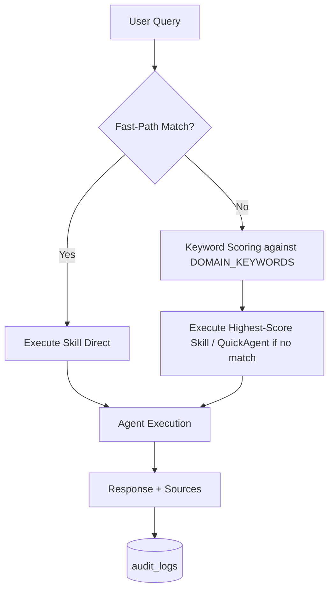
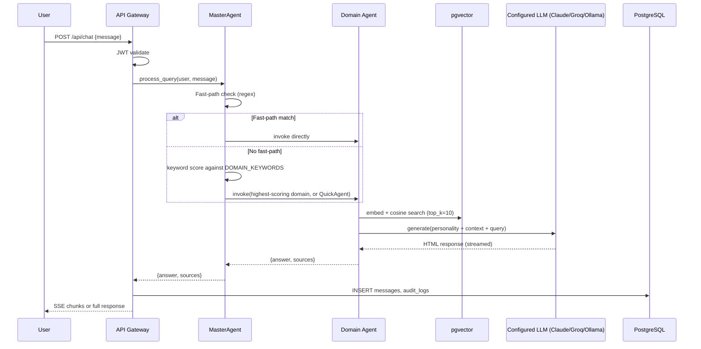

# Skills Framework — AA-Hackathon Enterprise AI Platform

## 1. Purpose

This document defines the Enterprise Skills Framework for the AA-Hackathon Enterprise AI Platform. A **Skill** is a discrete, named, invocable capability that delivers measurable business value through a defined input/output contract, an owning agent, declared permissions, and a fallback strategy.

Skills are the atomic unit of platform capability. Every feature exposed to users must be implemented as a registered Skill.

---

## 2. Business Context

The platform serves Aligned Automation employees across five domains: HR, IT, Admin, Organization, and Productivity. (The platform's actual feature surface is broader than this — it also includes parking request management, org communications, skills analytics, a no-code form/workflow builder, COO analytics, and AI tool license tracking; those are covered in their own specs rather than in this skills catalog.) Each domain exposes multiple skills. Skills are discovered by the MasterAgent routing engine and executed by domain agents backed by pgvector RAG, Zoho People DB, Microsoft Graph API, and a configurable LLM (Anthropic Claude → Groq → Ollama, in priority order — Ollama is the default/fallback, not the exclusive provider).

---

## 3. Architecture Principles

- **Stateless by Default:** Skills are stateless unless explicitly session-bound (e.g., DocumentAgent multi-turn)
- **Single Responsibility:** Each skill has one owning agent and one business purpose
- **Declared Contract:** Every skill declares inputs, outputs, permissions, and SLAs
- **Fallback Required:** Every skill defines what happens when the primary execution path fails
- **Auditable:** Every skill invocation is logged to `audit_logs`
- **Permission-Enforced:** Skills declare minimum RBAC role required

---

## 4. Skill Specification Template

Every skill registered on the platform must document all fields below.

| Field | Type | Description |
|-------|------|-------------|
| **Skill ID** | string | Unique kebab-case identifier: `{domain}-{verb}-{noun}` |
| **Skill Name** | string | Human-readable display name |
| **Business Purpose** | string | Why this skill exists — the problem it solves |
| **Domain** | enum | `HR \| IT \| Admin \| Org \| PMO \| Finance \| Productivity \| Escalation \| Analytics` |
| **Version** | semver | `1.0.0` — increment on breaking changes |
| **Status** | enum | `active \| beta \| deprecated \| planned` |
| **Intent Phrases** | string[] | 5+ example user utterances that trigger this skill |
| **Trigger Type** | enum | `regex-fastpath \| llm-routing \| keyword-routing \| explicit-api` |
| **Minimum Role** | enum | `employee \| manager \| hr_admin \| it_admin \| coo \| super_admin` |
| **Inputs** | object[] | Parameters: name, type, required, source (user/context/system), description |
| **Outputs** | object | Response structure: format (HTML/JSON/SSE), fields, examples |
| **Owning Agent** | string | Agent class responsible for executing this skill |
| **Dependencies** | string[] | External systems: `pgvector \| FAISS \| ZohoDB \| GraphAPI \| Claude/Groq/Ollama \| Tavily \| EscalationsDB` |
| **Tools Used** | string[] | Internal tools invoked during execution |
| **Prompt Reference** | string | Reference to personality/prompt in `personalities.py` |
| **Retrieval Strategy** | string | How context is fetched (pgvector query, Zoho query, static, etc.) |
| **Latency SLA** | ms | Maximum acceptable end-to-end response time |
| **Streaming** | bool | Whether response is streamed via SSE |
| **Fallback Strategy** | string | Ordered fallback steps when primary path fails |
| **Error Handling** | object | Error codes and user-facing messages |
| **Examples** | object[] | 3+ input→output examples |
| **Audit Events** | string[] | Events emitted to `audit_logs` |

---

## 5. Skill Catalog — Summary Table

| Skill ID | Name | Domain | Agent | Status | Trigger |
|----------|------|--------|-------|--------|---------|
| hr-leave-inquiry | Leave Balance & Types | HR | HRAgent | active | keyword |
| hr-leave-apply-guide | Leave Application Guide | HR | HRAgent | active | regex-fastpath |
| hr-payroll-inquiry | Payroll Inquiry | HR | HRAgent | active | keyword |
| hr-tax-inquiry | Tax & TDS Inquiry | HR | HRAgent/FinanceAgent | active | keyword |
| hr-benefit-inquiry | Benefits Inquiry | HR | HRAgent | active | keyword |
| hr-policy-lookup | HR Policy Search | HR | HRAgent | active | keyword |
| hr-document-generate | HR Document Generation | HR | DocumentAgent | active | regex-fastpath |
| hr-onboarding-guide | Onboarding Guidance | HR | OnboardingService | active | explicit-api |
| hr-escalation | HR Escalation | HR | EscalationAgent | active | regex-fastpath |
| it-access-request | IT Access Request | IT | ITAgent | active | keyword |
| it-password-reset | Password Reset | IT | ITAgent | active | keyword |
| it-vpn-troubleshoot | VPN Troubleshooting | IT | ITAgent | active | keyword |
| it-laptop-support | Laptop Support | IT | ITAgent | active | keyword |
| it-software-install | Software Installation | IT | ITAgent | active | keyword |
| it-network-troubleshoot | Network Troubleshooting | IT | ITAgent | active | keyword |
| it-security-incident | Security Incident Report | IT | ITAgent+EscalationAgent | active | keyword |
| it-policy-lookup | IT Policy Search | IT | ITAgent | active | keyword |
| it-escalation | IT Escalation | IT | EscalationAgent | active | regex-fastpath |
| admin-travel-request | Travel Request | Admin | AdminAgent | active | keyword |
| admin-cab-booking | Cab Booking | Admin | AdminAgent | active | keyword |
| admin-parking-request | Parking Request | Admin | AdminAgent | active | keyword |
| admin-facility-request | Facility Booking | Admin | AdminAgent | active | keyword |
| admin-policy-lookup | Admin Policy Search | Admin | AdminAgent | active | keyword |
| admin-form-creation | Microsoft Forms Creation | Admin | FormsAgent | active | regex-fastpath |
| admin-supply-request | Office Supply Request | Admin | AdminAgent | active | keyword |
| admin-escalation | Admin Escalation | Admin | EscalationAgent | active | regex-fastpath |
| escalation-create | Create Escalation | Escalation | EscalationAgent | active | regex-fastpath |
| escalation-track | Track Escalation | Escalation | EscalationAgent | active | keyword |
| escalation-list | List Escalations | Escalation | EscalationAgent | active | keyword |
| email-draft | Email Drafting | Productivity | EmailAgent | active | regex-fastpath |
| personal-notes | Personal Notes | Productivity | Frontend | active | explicit-api |
| allocation-board | Allocation Board | PMO | AllocationService | active | explicit-api |
| quick-links | Quick Links | Productivity | Frontend | active | explicit-api |
| meeting-lookup | Meeting Lookup | Org | OrgAgent | beta | keyword |
| birthday-lookup | Birthday Lookup | Org | EmployeeAgent | active | keyword |
| analytics-overview | Analytics Dashboard | Analytics | AnalyticsService | active | explicit-api |
| coo-analytics | COO Analytics | Analytics | COOAnalyticsService | active | explicit-api |
| employee-directory | Employee Directory | Org | EmployeeAgent | active | keyword |
| attendance-lookup | Attendance Lookup | HR | AttendanceAgent | active | regex-fastpath |
| org-info | Organization Info | Org | OrgAgent | active | keyword |
| pmo-project-info | PMO Project Info | PMO | PMOAgent | active | keyword |
| finance-inquiry | Finance Inquiry | Finance | FinanceAgent | active | keyword |

---

## 6. Skill Registration Architecture

```
MasterAgent (supervisor_agent.py)
├── _FAST_PATH_RULES[]          ← Live Tier 1: compiled regex → skill_id
├── _route_llm()                ← Defined for LLM intent classification, but never called anywhere — dead code, not part of the live routing path
├── DOMAIN_KEYWORDS{}           ← Live Tier 2: keyword scoring fallback
└── _AGENT_REGISTRY{}           ← skill_id → agent_class mapping
```

In practice there are two live routing tiers — regex fast-paths, then keyword scoring against `DOMAIN_KEYWORDS` — not three. Skills are registered by populating:
1. `_FAST_PATH_RULES` — regex + target for deterministic routing
2. `DOMAIN_KEYWORDS` — keyword sets per domain for fallback scoring
3. `_AGENT_REGISTRY` — maps domain/skill names to agent classes

---

## 7. Skill Discovery Flow



Note: an `_route_llm()` method for LLM-based intent classification exists in `supervisor_agent.py` but is never called in the live request path — it is not part of this flow today.

---

## 8. Skill Execution Pipeline



---

## 9. Skill Performance SLAs

| Skill Type | P50 Latency | P95 Latency | First-Token (Streaming) |
|-----------|------------|-------------|------------------------|
| Fast-path (static) | < 100ms | < 200ms | N/A |
| Fast-path (agent) | < 500ms | < 1000ms | < 300ms |
| RAG skill (pgvector) | < 3s | < 5s | < 1s |
| Zoho DB skill | < 2s | < 4s | < 800ms |
| Document generation | < 8s | < 15s | < 1s |
| LLM routing overhead | N/A — `_route_llm()` exists but is not invoked in the live routing path | N/A | N/A |

---

## 10. Skill Versioning

- Skills follow semantic versioning: `MAJOR.MINOR.PATCH`
- **MAJOR**: Breaking change to input/output contract
- **MINOR**: New optional input or output field
- **PATCH**: Internal logic change, no contract change
- Old skill versions are deprecated with 30-day sunset period
- Version is logged in `audit_logs.metadata`

---

## 11. Skill Testing Standards

Each skill must have:
- **Unit tests**: mock agent, verify routing, validate output format
- **Integration tests**: real pgvector query, real Ollama call (test environment)
- **Benchmark queries**: 10 representative queries with expected answer patterns
- **Regression tests**: run before any prompt or agent change
- **Latency tests**: verify SLA compliance under load

---

## 12. Skill Governance

| Governance Activity | Owner | Frequency |
|--------------------|-------|-----------|
| New skill approval | Platform Owner + Domain Owner | Per change |
| Prompt review | Platform Owner | Per prompt change |
| SLA review | Engineering Lead | Monthly |
| Skill deprecation | Platform Owner | As needed |
| Benchmark evaluation | AI Platform Team | Bi-weekly |
| Security review | Security Team | Quarterly |

---

## 13. Error Handling Standards

All skills must handle:
- **Retrieval failure**: pgvector returns 0 results → FAISS fallback → web search (Tavily) → graceful "no information found" response
- **LLM timeout**: Ollama unresponsive → cached response or static fallback
- **Auth failure**: JWT invalid → 401 response, not skill execution
- **Permission denied**: role check fails → "you don't have access to this feature" message
- **PII detected**: log to `pii_events`, redact from response

---

## 14. Future Skills Architecture

- **Skill Registry Service**: standalone microservice replacing in-process dict
- **Dynamic Skill Loading**: hot-reload skills without restart
- **Skill Marketplace**: third-party skills registered via API
- **Skill Composition**: chain skills into workflows (LangGraph nodes)
- **Skill Analytics**: per-skill invocation counts, latency, success rates
- **A/B Skill Testing**: shadow skill deployment with traffic splitting

---

## 15. Cross-References

- [Agent Framework](../04-agents/agent-framework.md) — how agents execute skills
- [Routing Engine](../05-platform/routing-engine.md) — how skills are discovered
- [Prompt Library](../05-platform/prompt-library.md) — prompt templates per skill
- [Guardrails](../05-platform/guardrails.md) — safety checks before skill execution
- [Evaluation Framework](../05-platform/evaluation-framework.md) — skill quality measurement
