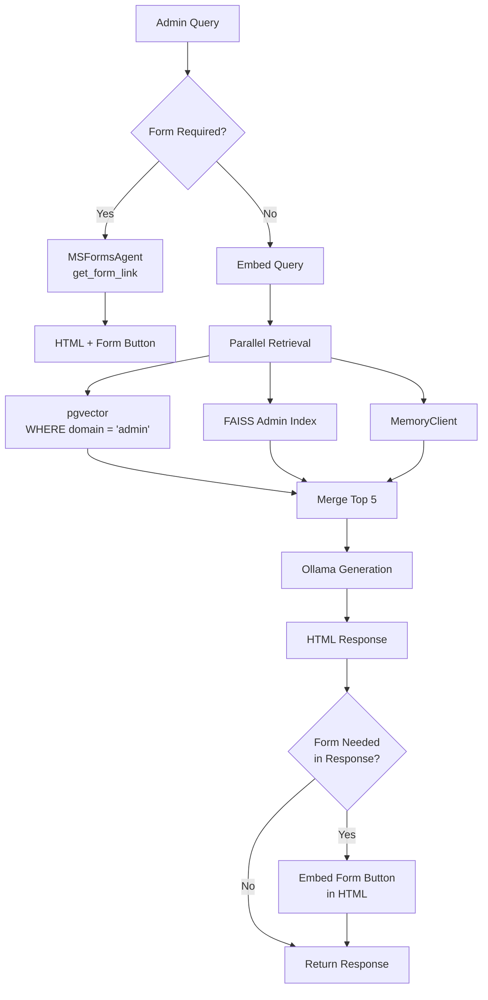
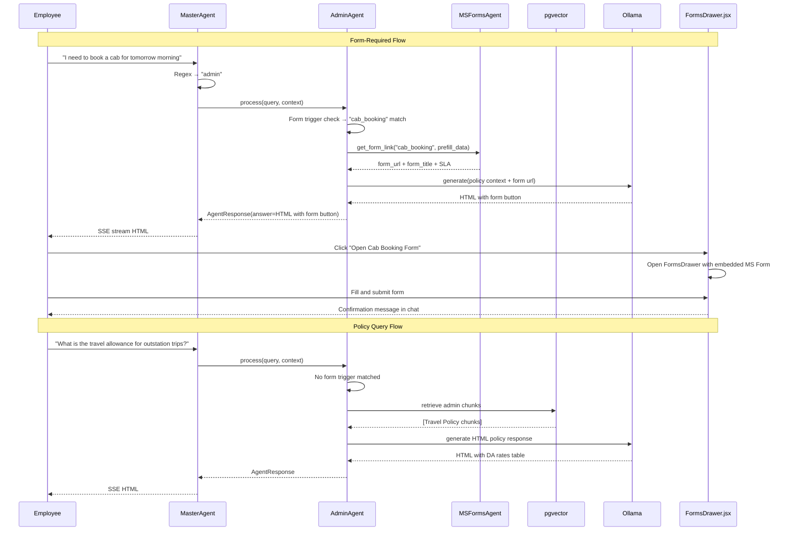

# Admin Agent Specification
# AA-Hackathon Enterprise AI Platform — Aligned Automation
# Document Version: 1.0 | Last Updated: 2026-06-07
# Source File: backend/agents/admin_agent.py

---

## 1. Overview

The AdminAgent handles all queries related to administrative operations at Aligned Automation.
This includes travel and cab booking requests, parking management, office facilities,
administrative policies, stationery and supplies, visitor management, and building access.

The AdminAgent is distinguished from other agents by its deep integration with the MS Forms
system. Many administrative requests require formal form submission, and the AdminAgent
surfaces the appropriate Microsoft Form directly within the chat interface via the
`FormsDrawer.jsx` component.

---

## 2. Agent Identity

| Property | Value |
|----------|-------|
| Registry Key | `admin` |
| Class | `AdminAgent` |
| Base Class | `BaseDeepAgent` |
| Source File | `backend/agents/admin_agent.py` |
| Personality File | `backend/agents/personalities.py` |
| Fallback Email | `admin@alignedautomation.com` |
| MS Forms Integration | `backend/agents/ms_forms_agent.py` |
| Owner | Admin Team |

---

## 3. Personality and Tone

The AdminAgent personality from `personalities.py`:

- **Efficient and process-driven**: Prioritizes getting the employee to the right process quickly
- **Organized**: Presents information in clear lists and structured formats
- **Proactive**: Anticipates follow-up questions by providing complete process information
- **Form-aware**: Knows when to surface a form vs. answer a question
- **Deadline-conscious**: Always includes SLA timelines for admin requests

Sample personality tone:
> "For travel bookings, here's the process and the form you'll need to submit..."
> "Cab requests need to be submitted at least 2 hours before travel time."
> "I'll pull up the right form for you. You can fill it out right here in the chat."

---

## 4. Domain Coverage

### 4.1 Travel and Transportation

- Business travel policy (eligibility, booking process, advance limits)
- Cab booking process (corporate cab, outstation, airport drops)
- Flight and hotel booking (empaneled vendors, approval workflow)
- Local conveyance claims and reimbursement
- Travel advance request process
- Outstation allowance (DA) policy
- Travel insurance coverage

### 4.2 Parking Management

- Visitor parking passes
- Employee parking allocation requests
- Parking policy (eligibility by grade / seniority)
- Parking sticker and access card process
- Bicycle parking and EV charging availability

### 4.3 Office Facilities

- Desk booking and seating allocation
- Conference room booking process
- Office maintenance requests (AC, lighting, furniture, plumbing)
- Housekeeping and cleanliness requests
- Office timings and holiday operating hours
- Building access card requests and replacement

### 4.4 Stationery and Supplies

- Stationery request submission
- Printing and photocopying services
- Asset request (ergonomic equipment, standing desk)
- IT peripheral requests via Admin (mouse, keyboard, headset)

### 4.5 Visitor Management

- Visitor pass application
- Guest WiFi access
- Reception and lobby procedures
- Client visit coordination checklist

### 4.6 Administrative Policies

- Office discipline policy
- Lost-and-found procedure
- Safety and emergency evacuation procedure
- Pantry and cafeteria rules
- Corporate dress code
- Personal courier and package reception policy

---

## 5. MS Forms Integration

The AdminAgent is the primary agent that triggers the MS Forms workflow. When an
administrative request requires form submission, the AdminAgent:

1. Identifies the correct form type from the query
2. Calls `MSFormsAgent.get_form_link(form_type)` to retrieve the form URL
3. Returns an HTML response with a form link button
4. The frontend `FormsDrawer.jsx` intercepts the response and opens the form in a drawer

### 5.1 Form Type Mapping

```python
ADMIN_FORM_MAP = {
    "cab_booking":          "Corporate Cab Booking Request",
    "travel_request":       "Business Travel Request Form",
    "parking_pass":         "Parking Pass Application",
    "stationery_request":   "Stationery / Supplies Request",
    "facilities_request":   "Office Facilities Maintenance Request",
    "visitor_pass":         "Visitor Pass Request",
    "desk_booking":         "Desk and Seating Allocation Request",
    "conference_room":      "Conference Room Booking",
    "travel_reimbursement": "Local Conveyance / Travel Reimbursement",
    "asset_request":        "IT Asset / Equipment Request",
}
```

### 5.2 MS Forms Agent API

```
POST /api/ms-forms/create
Request Body: {
    "form_type": "cab_booking",
    "user_id": "emp_456",
    "prefill_data": {
        "employee_name": "John Doe",
        "department": "Engineering",
        "employee_id": "AA-1234"
    }
}
Response: {
    "form_url": "https://forms.microsoft.com/...",
    "form_id": "ms_form_abc123",
    "form_title": "Corporate Cab Booking Request",
    "estimated_processing_time": "2 hours"
}
```

### 5.3 FormsDrawer Integration

When the AdminAgent response contains a form URL, `ChatWindow.jsx` detects the form
trigger event and opens `FormsDrawer.jsx` as a right-side panel. The employee can
complete the form without leaving the chat interface. Form submission triggers a
confirmation message in the chat thread.

---

## 6. Retrieval Pipeline



### 6.1 Form Detection Logic

The AdminAgent uses a pre-generation classifier to determine if a form should be surfaced:

```python
FORM_TRIGGER_PATTERNS = {
    "cab_booking":        r"(book|request|need|arrange).{0,20}(cab|taxi|transport|ride)",
    "travel_request":     r"(business travel|outstation|flight|hotel booking)",
    "parking_pass":       r"(parking|car park).{0,20}(pass|request|apply)",
    "stationery_request": r"(stationery|supplies|pen|paper|notebook|printer cartridge)",
    "facilities_request": r"(maintenance|repair|air.?conditioning|lights|broken|leaking)",
    "visitor_pass":       r"(visitor|guest|client).{0,20}(pass|coming|visit|access)",
    "conference_room":    r"(book|reserve|conference room|meeting room|boardroom)",
    "desk_booking":       r"(desk|seat|workspace).{0,20}(book|reserve|request|change)",
}
```

When a form trigger is matched before retrieval, the AdminAgent fast-paths directly to the
form URL generation, skipping the full retrieval pipeline for speed.

---

## 7. Response Format

Standard admin policy response:

```html
<div class="admin-response">
  <p>Here's the process for <strong>[admin request type]</strong>:</p>
  <div class="process-overview">
    <h4>How It Works</h4>
    <ol>
      <li>Submit the form below (takes ~2 minutes)</li>
      <li>Admin team reviews within [SLA timeframe]</li>
      <li>Confirmation sent to your email</li>
    </ol>
  </div>
  <div class="sla-info">
    <p><strong>Processing Time:</strong> [SLA]</p>
    <p><strong>Advance Notice Required:</strong> [notice period]</p>
  </div>
  <div class="form-cta">
    <button class="form-trigger-btn"
            data-form-type="[form_type]"
            data-form-url="[form_url]">
      Open [Form Name]
    </button>
  </div>
  <div class="contact-info">
    <p>Questions? Contact Admin:
    <a href="mailto:admin@alignedautomation.com">admin@alignedautomation.com</a></p>
  </div>
</div>
```

---

## 8. SLA Matrix for Admin Requests

| Request Type | Processing SLA | Advance Notice Required |
|-------------|---------------|------------------------|
| Cab Booking | 2 hours | 2 hours before travel |
| Business Travel | 24 hours | 72 hours before travel |
| Parking Pass | 2 business days | N/A |
| Stationery Request | 1 business day | N/A |
| Facilities Maintenance | 4 hours (urgent) / 2 days (routine) | N/A |
| Visitor Pass | 30 minutes | 1 hour before visit |
| Conference Room | 30 minutes | N/A (first come, first served) |
| Desk Allocation | 3 business days | N/A |
| Travel Reimbursement | 5 business days | Submit within 7 days of travel |

---

## 9. Admin Agent Flow Diagram



---

## 10. Escalation Triggers

| Trigger | Action | Priority |
|---------|--------|---------|
| Emergency travel (medical) | EscalationAgent + admin@email | Critical |
| Facility safety concern | EscalationAgent | High |
| Repeated form rejection | Admin team review | Medium |
| Policy exception request | Manager approval workflow | Medium |
| Vendor complaint | Admin + Management escalation | Medium |

---

## 11. Integration Points

| Target | Trigger | Method |
|--------|---------|--------|
| MSFormsAgent | Admin form detection | Direct agent call |
| EscalationAgent | Safety concerns | escalation_triggered=True |
| EmailAgent | "Email admin about my travel request" | MasterAgent re-dispatch |
| FormsDrawer.jsx | form_url in response | Frontend event detection |

---

## 12. KPIs and SLAs

| Metric | Target | Measurement |
|--------|--------|-------------|
| Response time | < 4 seconds P95 | SSE timing logs |
| Form surfacing accuracy | > 90% | Admin team audit |
| Correct form type selection | > 88% | Form completion tracking |
| Employee satisfaction | > 70% positive | In-chat rating |
| Form completion rate | > 75% (forms opened) | MS Forms analytics |
| Admin query routing accuracy | > 90% | Monthly review |

---

## 13. Known Limitations

| Limitation | Impact | Workaround |
|-----------|--------|-----------|
| No real-time cab availability | Cannot show live cab status | Process-based instructions |
| No booking confirmation integration | Cannot confirm booking in chat | Email confirmation from admin team |
| MS Forms limited prefill | Some fields require manual entry | Prefill what's possible from JWT context |
| Conference room availability unknown | Cannot show real-time room availability | Redirect to calendar invite system |

---

## 14. Future Enhancements

### 14.1 Real-time Cab Tracking (Q3 2026)
Integration with corporate cab vendor API to show live cab availability, estimated
pickup time, and driver details within the chat interface.

### 14.2 Room Booking via Microsoft Graph (Q4 2026)
Microsoft Graph Calendar API integration to check conference room availability
and book rooms directly from the chat without form submission.

### 14.3 Expense Claim Auto-Population (Q3 2026)
Auto-populate travel reimbursement forms from approved travel requests, reducing
double data entry for employees.

### 14.4 Approval Workflow Notifications (Q4 2026)
Push notifications within the chat platform when admin requests are approved,
rejected, or require additional information.

---

## 15. Document Sources

Admin domain documents in `document_chunks` with `domain='admin'`:

1. Business Travel and Expense Policy
2. Cab and Transport Booking Guidelines
3. Parking Allocation Policy
4. Office Facilities and Maintenance Guide
5. Visitor Management Procedure
6. Stationery and Supplies Request Process
7. Conference Room Booking Policy
8. Desk Allocation and Hot-Desking Guidelines
9. Emergency Evacuation Procedure
10. Administrative Policies and Code of Conduct (Admin section)
