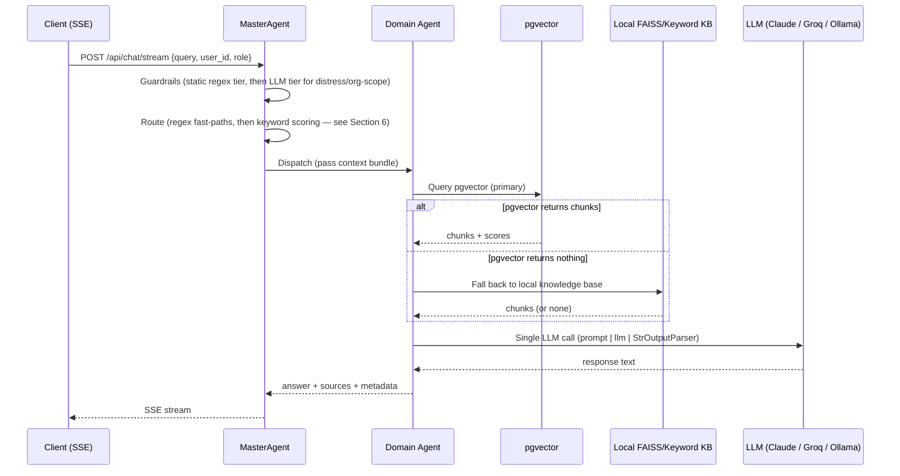
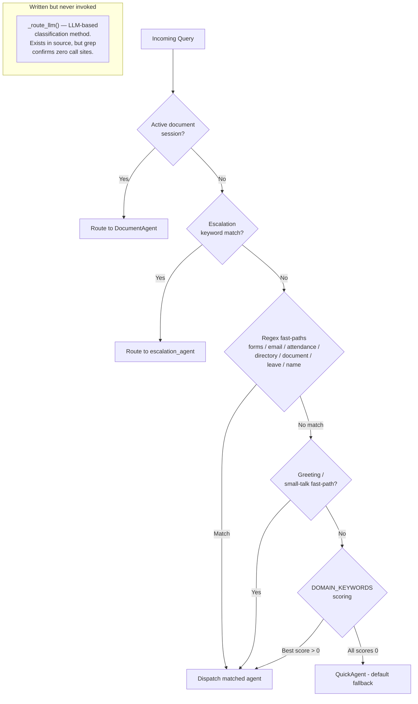

# Agent Framework Specification
# AURA (AA-Hackathon Enterprise Assistant) — Aligned Automation
# Document Version: 2.0 — Corrected against live codebase | Last Updated: 2026-07-02

> **Accuracy note:** This document was rewritten after a code audit found significant fabrications in the previous version — an invented "13-agent" roster, a working "3-tier" LLM-classification router that does not exist in code, wrong file paths (`backend/agents/...` instead of the real `apps/api-gateway/app/agents/...`), and a parallel 4-source retrieval design that the code does not implement. Every claim below is checked against `apps/api-gateway/app/agents/supervisor_agent.py`, `agents/working/base_deep_agent.py`, and the individual agent files. Where this document conflicts with anything else in `knowledge-specs/docs/`, treat `README.md` and `10-reference/folder-structure.md` as authoritative and update the other document.

---

## 1. Overview

AURA is built on a multi-agent architecture where a single orchestrator (`MasterAgent`, in
`apps/api-gateway/app/agents/supervisor_agent.py`) routes each incoming query to a handler. "Handler"
is a deliberately loose word here: unlike the clean, uniform picture in earlier drafts of this
document, the real agent roster is a mix of three genuinely different kinds of objects — retrieval
agents built on a shared base class, lightweight direct-LLM agents, and plain classes/functions that
do not use an LLM-retrieval pipeline at all. This document describes the roster, the base retrieval
pipeline, the lifecycle, and the routing logic as they actually exist in code today.

There is no LangGraph in this system. `langgraph` appears in `requirements.txt` but has **zero
imports anywhere** in `apps/api-gateway`. Routing is a straight-line Python function, not a graph.

---

## 2. Agent Taxonomy

### 2.1 Agent Types (as they actually exist in code)

| Type | Base | Examples | Description |
|------|------|---------|-------------|
| Deep Retrieval | `BaseDeepAgent` subclass | HRAgent, ITAgent, AdminAgent, FinanceAgent, PMOAgent, OrgDeepAgent | pgvector RAG, with a local FAISS/keyword fallback and a single LLM call |
| Lightweight LLM | Does **not** inherit `BaseDeepAgent` | FunnyAgent, QuickAgent | Direct LLM call, no retrieval pipeline. FunnyAgent's own source comment says it "mirrors `BaseDeepAgent`'s public surface" but it does not subclass it. QuickAgent is the default fallback when routing finds no domain match. |
| Plain class (no LLM-retrieval pipeline) | Ordinary Python class | DocumentAgent, AllocationAgent, MSFormsAgent | DocumentAgent is a stateful, in-memory, multi-turn session generator for HR letters. AllocationAgent is a thin wrapper over `allocation_service.py` plus an `ask_aura()` LLM Q&A method. MSFormsAgent is a pure REST client for the Microsoft Forms API — it does not call an LLM at all. |
| Plain function, adapter-wrapped | Function + small adapter class in `supervisor_agent.py` | employee_agent, attendance_agent, escalation_agent, the email-draft function in `email_agent.py`, license_agent | These are not classes in their own source files — they are functions. `supervisor_agent.py` wraps each in a minimal adapter class purely so the dispatch code has a uniform `.process(...)`-style call site. |
| Orchestrator | — | MasterAgent (`supervisor_agent.py`) | Routing, session state, dispatch |

**There is no `GeneralAgent` class.** The general/catch-all role in the real system is filled by
`QuickAgent`. There is also no separate "Integration" category distinct from what's listed above —
MSFormsAgent is simply a REST client agent with no LLM involvement, described plainly in its own row.

### 2.2 Agent Roster (actual, not a fixed "13")

```
MasterAgent (Orchestrator, supervisor_agent.py)
├── HRAgent            (BaseDeepAgent)              agents/working/hr_agent.py
├── ITAgent            (BaseDeepAgent)               agents/working/it_agent.py
├── AdminAgent         (BaseDeepAgent, + static      agents/working/admin_agent.py
│                        parking-rate context)
├── FinanceAgent       (BaseDeepAgent)                agents/working/finance_agent.py
├── PMOAgent           (BaseDeepAgent)                agents/working/pmo_agent.py
├── OrgDeepAgent       (BaseDeepAgent, no local        agents/org_agent.py
│                        data folders)
├── FunnyAgent         (lightweight, direct LLM)       agents/working/funny_agent.py
├── QuickAgent         (lightweight, direct LLM,        agents/working/quick_agent.py
│                        default/general fallback)
├── DocumentAgent      (plain class, stateful           agents/document_agent.py
│                        in-memory sessions)
├── AllocationAgent    (plain class + ask_aura())        agents/allocation_agent.py
├── MSFormsAgent       (plain class, REST client,         agents/ms_forms_agent.py
│                        no LLM)
├── employee_agent     (plain function, adapter-wrapped)   agents/employee/employee_agent.py
├── attendance_agent   (plain function, adapter-wrapped)    agents/employee/attendance_agent.py
├── escalation_agent   (plain function, adapter-wrapped)    agents/escalation_agent.py
├── email draft fn     (plain function, adapter-wrapped)     agents/email_agent.py
└── license_agent      (plain function, adapter-wrapped)      agents/license_agent.py
```

This is not a document that should be read as "here are the 13 agents" — the roster mixes classes and
functions of materially different shapes, and the count is not a governance constant. Treat the table
in Section 2.1 as the accurate mental model instead of a headline number.

---

## 3. BaseDeepAgent — Core Retrieval Architecture

Only the six agents in the "Deep Retrieval" row above inherit `BaseDeepAgent`
(`apps/api-gateway/app/agents/working/base_deep_agent.py`). This class encapsulates the shared
retrieval-augmented generation (RAG) pipeline.

### 3.1 Retrieval Is a Sequential/Conditional Fallback Chain — Not a Parallel `asyncio.gather`

Earlier drafts of this document described `retrieve_context()` firing pgvector, FAISS, conversation
memory, and Tavily web search simultaneously via `asyncio.gather` across "4 sources." That is not what
the code does. The real pipeline is:

1. **Embed the query and search pgvector** (via `apps/api-gateway/app/rag/retriever.py`) — this is the
   primary and normally sufficient source.
2. **Only if pgvector returns nothing**, fall back to the agent's own **local** FAISS-or-keyword
   knowledge base (`agents/working/knowledge_base.py`), built at runtime from local per-domain document
   folders (e.g. "HR Policies", "HR Document" folders for HRAgent). This local corpus is smaller than,
   and different from, the pgvector database — it is not a mirror of it.
3. **A single LLM call** via an LCEL chain (`prompt | llm | StrOutputParser`), with
   `GENERIC_GUARDRAIL`/`ORG_GUARDRAIL` text injected into the system prompt, self-verification
   instructions, and an inline citation request.
4. **Tavily web search** is an optional further supplement, used only when configured — not a
   simultaneous fourth retrieval source.

```python
# Illustrative shape of the real conditional flow — not literal source
async def answer(self, query: str) -> AgentResponse:
    chunks = await self._retrieve_pgvector(query)      # primary
    if not chunks:
        chunks = self._retrieve_local_knowledge_base(query)  # fallback only if pgvector is empty
    if self.tavily_enabled:
        chunks += self._retrieve_tavily(query)          # optional supplement
    return await self._generate(query, chunks)           # single LCEL chain call
```

There is no parallel fan-out, no conversation-memory retrieval source inside `BaseDeepAgent` itself,
and no adaptive-retry-with-rephrasing loop documented in the code.

### 3.2 pgvector Configuration

- Database: PostgreSQL at `hackathon.alignedautomation.com` (default), database `squadrons`
- Table: `document_chunks`
- Embedding column: `vector(768)`
- Distance operator: `<=>` (cosine distance), `ivfflat` index, `probes = 10`
- Embedding model: `nomic-embed-text-v1.5`, 768 dimensions (same model at query time and ingestion time)

### 3.3 Local FAISS/Keyword Fallback

`agents/working/knowledge_base.py` builds a **local, per-domain** fallback index from local document
folders at runtime — it is not a global mirror of the pgvector corpus, and it is only consulted when
pgvector returns zero results for a query. This is a smaller, agent-specific safety net, not a
parallel high-availability path.

### 3.4 LLM Configuration (Configurable — Not Ollama-Only)

`agents/working/config.py`'s `create_llm()` selects the active provider at startup by priority order:

1. **Claude** (Anthropic) — if `USE_Claude_API_Key` is set. Default model: `claude-sonnet-4-6`.
2. **Groq** — if `USE_Groq_API_Key` is set. Default model: `llama3-70b-8192`.
3. **Ollama** — the **default/fallback** when neither cloud flag is on. Model `gpt-oss` at
   `ml01.alignedautomation.com:11434`.

This is a genuinely multi-provider, configurable system. Any claim that "the platform only uses a
self-hosted LLM for data privacy" describes one possible configuration, not a hard constraint enforced
by the code — Claude or Groq can be, and often are, the active provider.

Every `BaseDeepAgent` makes exactly one LLM call per query (single-call design), regardless of which
provider is active.

---

## 4. Agent Lifecycle

A request follows this real path:



Only agents that inherit `BaseDeepAgent` execute the pgvector/fallback/LLM sequence above. Plain
classes and plain functions (Section 2.1) follow their own, much shorter, logic — e.g. MSFormsAgent
never touches an LLM at all; DocumentAgent walks an in-memory session state machine instead of calling
a retrieval pipeline.

---

## 5. Agent Registration

### 5.1 Registration in `supervisor_agent.py`

Agents are constructed once at startup, but — reflecting the real mixed roster — not all registry
entries are simple singleton instances of clean classes. Some are functions wrapped in small adapter
objects created purely for dispatch purposes:

```python
# Illustrative — reflects the real mix of classes, plain classes, and function adapters
_hr_agent = HRAgent()
_it_agent = ITAgent()
_admin_agent = AdminAgent()
_finance_agent = FinanceAgent()
_pmo_agent = PMOAgent()
_org_agent = OrgDeepAgent()
_funny_agent = FunnyAgent()
_quick_agent = QuickAgent()
_document_agent = DocumentAgent()
_allocation_agent = AllocationAgent()
_ms_forms_agent = MSFormsAgent()

# Plain functions from agents/employee/*.py, escalation_agent.py, email_agent.py,
# license_agent.py are not classes — they are wrapped in minimal adapter objects
# so dispatch code can call them uniformly:
_employee_adapter = _FunctionAgentAdapter(employee_agent)
_attendance_adapter = _FunctionAgentAdapter(attendance_agent)
_escalation_adapter = _FunctionAgentAdapter(escalation_agent)
_email_adapter = _FunctionAgentAdapter(draft_email)
_license_adapter = _FunctionAgentAdapter(license_agent)
```

There is no single tidy `_AGENT_REGISTRY = {"hr": HRAgent(), ...}` dict of uniform objects as earlier
drafts implied — the real dispatch code has to account for the fact that several of its "agents" are
functions, not instances of an agent class, and wraps them accordingly. QuickAgent is dispatched to
directly as the default when routing produces no domain match; there is no `"general": GeneralAgent()`
entry because no such class exists.

---

## 6. Routing — Real Behavior (Not a Clean 3-Tier Design)

Earlier documentation described a clean regex → LLM → keyword three-tier router. **That is not what
the code does.** The real `_route()` method in `supervisor_agent.py` evaluates, in order:

1. **Active document-generation session check** — if the user has an in-progress multi-turn document
   session, the query routes straight back to `DocumentAgent` regardless of content.
2. **Escalation keyword check.**
3. **Several regex fast-paths**, evaluated in sequence: Microsoft Forms intent, email-draft intent,
   attendance query, employee-directory query, document-request query — plus apply-leave and
   name-query regexes that are actually checked even earlier in the pipeline than this list suggests.
4. **A greeting / small-talk fast-path.**
5. **A keyword-scoring fallback** against a `DOMAIN_KEYWORDS` dictionary. If every domain scores zero,
   the query defaults to the general-purpose `QuickAgent`.

A `_route_llm()` method **does exist** in `supervisor_agent.py` and would perform LLM-based intent
classification if it were wired in — but grep confirms **it is never called from anywhere in the
codebase**. It is dead code today, not a dormant feature flag waiting to be flipped on; there is no
config switch that activates it.



In practice there are **two live routing tiers** — regex fast-paths, then keyword scoring — plus a
dormant, unreferenced LLM-classification method. There is no functioning LLM-based routing tier in the
current build. Any diagram or prose elsewhere describing "3-tier routing" as a working pipeline should
be treated as inaccurate.

---

## 7. Agent Communication

### 7.1 Context Bundle

The MasterAgent assembles context (JWT claims, role, department, recent conversation turns) and passes
it to whichever handler it dispatches to. The exact shape varies slightly by handler type since plain
functions and plain classes do not all share one dataclass contract the way `BaseDeepAgent` subclasses
do.

### 7.2 Redirects Between Agents

Redirects (e.g. an HR query about a document turning into a DocumentAgent session) happen through the
MasterAgent's own routing logic re-evaluating on the next turn or via an explicit dispatch call — not
through a formal agent-to-agent RPC layer. There is no LangGraph-style shared graph state; this remains
a flat dispatch model.

---

## 8. Guardrails (`apps/api-gateway/app/agents/guardrails.py`)

A single `check_input()` function evaluates, in order:

1. **Jailbreak regex** → static, immediate block, no LLM.
2. **Harmful-content regex** → static, immediate block, no LLM.
3. **Security-threat regex** → static, immediate block, no LLM.
4. **Distress signals** → LLM-generated empathetic response.
5. **Org-scope violations** (e.g. asking about another employee's salary/PII, legal advice, competitor
   intelligence, medical diagnosis) → LLM-generated contextual redirect.

This is **two tiers total**: a static regex tier (checks 1–3), then an LLM-contextual tier used only
for distress and org-scope handling (checks 4–5). It is not a three-way `allow/escalate/block`
classifier running on every message.

---

## 9. Escalation

Any handler can trigger escalation, which dispatches to the `escalation_agent` function (wrapped in an
adapter as described in Section 2.1/5.1). There is no separate "EscalationAgent class" in the codebase
— `escalation_agent.py` defines a function, not a class.

---

## 10. Future Evolution — LangGraph (Aspirational Only)

`langgraph` is listed in `apps/api-gateway/requirements.txt`. There is **no import of it anywhere in
the codebase** — zero implementation progress has been made. Any document describing a LangGraph
migration as "in progress" or "underway" is inaccurate. It is a genuinely future/aspirational item with
no committed timeline reflected in code; see `09-roadmap/target-state.md` for how this should be framed
going forward.

---

## 11. Appendix — Agent File Map (Real Paths)

| Component | File Path |
|-----------|-----------|
| MasterAgent | `apps/api-gateway/app/agents/supervisor_agent.py` |
| BaseDeepAgent | `apps/api-gateway/app/agents/working/base_deep_agent.py` |
| Personalities | `apps/api-gateway/app/agents/working/personalities.py` |
| LLM provider selection | `apps/api-gateway/app/agents/working/config.py` (`create_llm()`) |
| Local knowledge base fallback | `apps/api-gateway/app/agents/working/knowledge_base.py` |
| Guardrails | `apps/api-gateway/app/agents/guardrails.py` |
| RAG retriever (pgvector, query-time) | `apps/api-gateway/app/rag/retriever.py` |
| HRAgent | `apps/api-gateway/app/agents/working/hr_agent.py` |
| ITAgent | `apps/api-gateway/app/agents/working/it_agent.py` |
| AdminAgent (+ parking rate config) | `apps/api-gateway/app/agents/working/admin_agent.py`, `apps/api-gateway/app/agents/working/parking_config.py` |
| FinanceAgent | `apps/api-gateway/app/agents/working/finance_agent.py` |
| PMOAgent | `apps/api-gateway/app/agents/working/pmo_agent.py` |
| OrgDeepAgent | `apps/api-gateway/app/agents/org_agent.py` |
| FunnyAgent | `apps/api-gateway/app/agents/working/funny_agent.py` |
| QuickAgent | `apps/api-gateway/app/agents/working/quick_agent.py` |
| DocumentAgent | `apps/api-gateway/app/agents/document_agent.py` |
| AllocationAgent | `apps/api-gateway/app/agents/allocation_agent.py` |
| MSFormsAgent | `apps/api-gateway/app/agents/ms_forms_agent.py` |
| employee_agent (function) | `apps/api-gateway/app/agents/employee/employee_agent.py` |
| attendance_agent (function) | `apps/api-gateway/app/agents/employee/attendance_agent.py` |
| escalation_agent (function) | `apps/api-gateway/app/agents/escalation_agent.py` |
| email draft function | `apps/api-gateway/app/agents/email_agent.py` |
| license_agent (function) | `apps/api-gateway/app/agents/license_agent.py` |

There is no `backend/` directory in this repository. Every backend file lives under
`apps/api-gateway/app/`. See `10-reference/folder-structure.md` for the full annotated tree.
