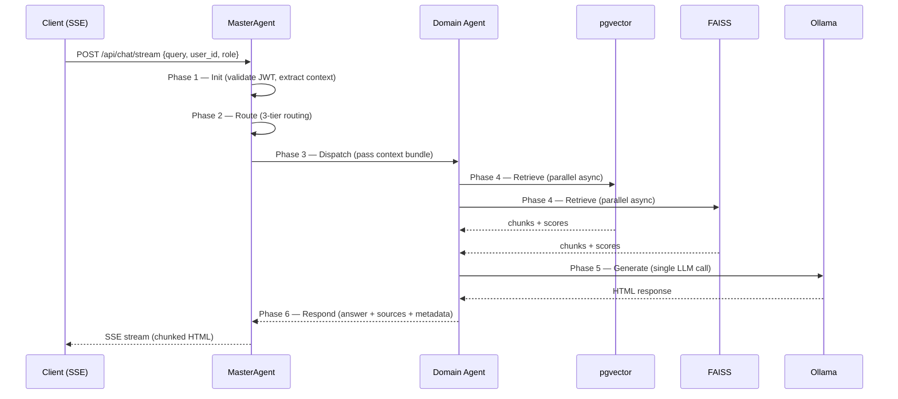
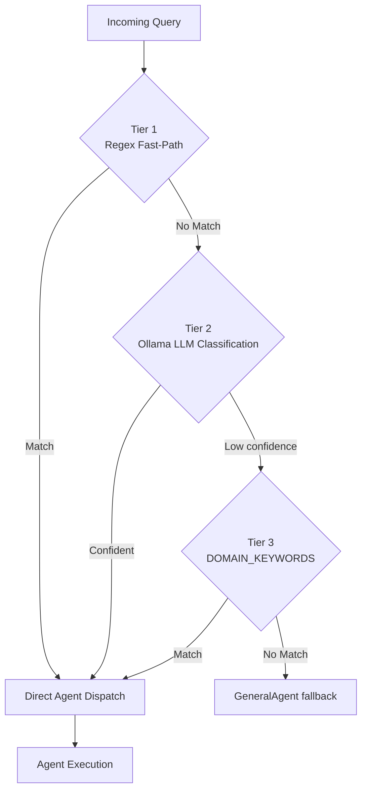
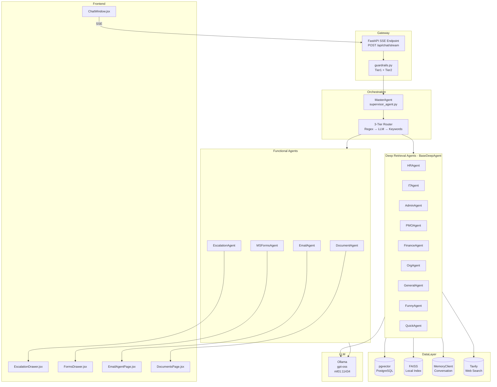

# Agent Framework Specification
# AA-Hackathon Enterprise AI Platform — Aligned Automation
# Document Version: 1.0 | Last Updated: 2026-06-07

---

## 1. Overview

The AA-Hackathon platform is built on a multi-agent AI architecture where specialized agents
collaborate to handle employee queries, document requests, escalations, and operational tasks.
This document defines the canonical agent framework that governs how all agents are designed,
registered, discovered, executed, and monitored across the platform.

Every agent in the system is either a subclass of `BaseDeepAgent` or a standalone functional
module integrated via the `MasterAgent` registry. The framework is asynchronous by design,
leveraging Python `asyncio` for concurrent retrieval and generation, and Server-Sent Events
(SSE) for streaming responses to the frontend.

---

## 2. Agent Taxonomy

### 2.1 Agent Types

| Type | Base Class | Examples | Description |
|------|-----------|---------|-------------|
| Deep Retrieval | BaseDeepAgent | HRAgent, ITAgent, AdminAgent, PMOAgent | Full retrieval pipeline with pgvector + FAISS |
| Orchestrator | MasterAgent | supervisor_agent.py | Routes queries to correct agent |
| Functional | Standalone | EscalationAgent, DocumentAgent | Domain-specific logic, minimal retrieval |
| Integration | Standalone | EmailAgent, MSFormsAgent | External system connectors |
| Data | Service | AnalyticsService, OnboardingController | Data aggregation, no LLM inference |

### 2.2 Agent Hierarchy

```
MasterAgent (Orchestrator)
├── HRAgent          (BaseDeepAgent)
├── ITAgent          (BaseDeepAgent)
├── AdminAgent       (BaseDeepAgent)
├── PMOAgent         (BaseDeepAgent)
├── FinanceAgent     (BaseDeepAgent)
├── OrgAgent         (BaseDeepAgent)
├── DocumentAgent    (Functional)
├── EscalationAgent  (Functional)
├── EmailAgent       (Integration)
├── MSFormsAgent     (Integration)
├── FunnyAgent       (BaseDeepAgent, lightweight)
├── QuickAgent       (BaseDeepAgent, fallback)
└── GeneralAgent     (BaseDeepAgent, catch-all)
```

---

## 3. BaseDeepAgent — Core Retrieval Architecture

All domain agents inherit from `base_deep_agent.py`. This class encapsulates the full
retrieval-augmented generation (RAG) pipeline.

### 3.1 Retrieval Sources (Parallel Async)

```python
async def retrieve_context(self, query: str) -> RetrievalResult:
    results = await asyncio.gather(
        self._retrieve_pgvector(query),      # PostgreSQL + pgvector cosine similarity
        self._retrieve_faiss(query),         # Local FAISS fallback
        self._retrieve_memory(query),        # MemoryClient conversation history
        self._retrieve_tavily(query),        # Tavily web search (if enabled)
        return_exceptions=True
    )
    return self._merge_and_rank(results)
```

All four sources run concurrently. Results are merged by relevance score. The adaptive retry
threshold is 0.10 — if the best retrieved chunk scores below this cosine similarity threshold,
the agent retries with a rephrased query before falling back to a generic response.

### 3.2 pgvector Configuration

- Database: PostgreSQL at `hackathon.alignedautomation.com`, database `squadrons`
- Table: `document_chunks`
- Embedding column: `embedding vector(384)`
- Distance operator: `<=>` (cosine distance)
- Query pattern:
  ```sql
  SELECT content, source, 1 - (embedding <=> $1::vector) AS score
  FROM document_chunks
  WHERE domain = $2
  ORDER BY score DESC
  LIMIT 5
  ```

### 3.3 FAISS Fallback

`knowledge_base.py` maintains a local FAISS index loaded at startup. It provides sub-10ms
retrieval for cached embeddings and is the fallback when pgvector is unreachable. The index
is rebuilt nightly from the same source documents.

### 3.4 Ollama LLM Configuration

Every BaseDeepAgent makes exactly one Ollama call per query (single-call design):

```python
OLLAMA_CONFIG = {
    "model": "gpt-oss",
    "base_url": "http://ml01.alignedautomation.com:11434",
    "temperature": 0.1,
    "num_predict": 800,
    "num_ctx": 2048,
}
```

The low temperature (0.1) produces deterministic, factual responses consistent with enterprise
policy content. The 2048-token context window is sufficient for most HR/IT policy queries
when combined with top-5 retrieved chunks.

---

## 4. Agent Lifecycle

Every agent request follows a strict 6-phase lifecycle:



### 4.1 Phase Descriptions

| Phase | Responsibility | Owner | Max Duration |
|-------|---------------|-------|-------------|
| Init | JWT decode, context assembly, guardrails Tier1 | MasterAgent | 50ms |
| Route | 3-tier routing decision | MasterAgent | 200ms |
| Dispatch | Agent selection and context injection | MasterAgent | 10ms |
| Retrieve | Parallel pgvector + FAISS + memory queries | Domain Agent | 500ms |
| Generate | Ollama LLM call with constructed prompt | Domain Agent | 3000ms |
| Respond | Response assembly, metadata tagging, SSE emit | MasterAgent | 100ms |

Total P95 SLA target: **4 seconds end-to-end**.

---

## 5. Agent Registration

### 5.1 _AGENT_REGISTRY

All agents are registered in `supervisor_agent.py` at module load time:

```python
_AGENT_REGISTRY = {
    "hr":         HRAgent(),
    "it":         ITAgent(),
    "admin":      AdminAgent(),
    "pmo":        PMOAgent(),
    "finance":    FinanceAgent(),
    "org":        OrgAgent(),
    "document":   DocumentAgent(),
    "escalation": EscalationAgent(),
    "email":      EmailAgent(),
    "msforms":    MSFormsAgent(),
    "funny":      FunnyAgent(),
    "quick":      QuickAgent(),
    "general":    GeneralAgent(),
}
```

Agents are instantiated once at startup (singleton pattern). Stateful agents (DocumentAgent,
EscalationAgent) maintain per-user session dictionaries internally.

### 5.2 Agent Registration Contract

Any new agent must satisfy:
1. Implement `async def process(self, query: str, context: AgentContext) -> AgentResponse`
2. Define `DOMAIN` class attribute (string, matches registry key)
3. Define `DESCRIPTION` class attribute (for LLM routing prompt)
4. Expose `personality` property returning system prompt string from `personalities.py`
5. Return `AgentResponse` dataclass with `answer` (HTML string), `sources` (list), `confidence` (float)

---

## 6. Agent Discovery — 3-Tier Routing

The MasterAgent routes each incoming query through three successive tiers:



### 6.1 Tier 1 — Regex Fast-Path

Deterministic patterns evaluated in O(1) time. Examples:
- `r"(leave|pto|vacation|sick day)"` → HRAgent
- `r"(vpn|password reset|access request|ticket)"` → ITAgent
- `r"(cab|travel|parking|facilities)"` → AdminAgent
- `r"(generate.*letter|request.*document|experience letter)"` → DocumentAgent
- `r"(email.*draft|write.*email|compose)"` → EmailAgent

### 6.2 Tier 2 — LLM Classification

When regex produces no match, the MasterAgent submits the query and agent descriptions to
Ollama with a zero-shot classification prompt. Returns agent key or `"unknown"`.

### 6.3 Tier 3 — DOMAIN_KEYWORDS

Static keyword dictionary as final fallback:

```python
DOMAIN_KEYWORDS = {
    "hr":      ["leave", "salary", "benefits", "policy", "holiday", "appraisal"],
    "it":      ["laptop", "software", "vpn", "access", "email", "azure", "security"],
    "admin":   ["cab", "travel", "parking", "stationery", "pantry", "facilities"],
    "pmo":     ["project", "sprint", "milestone", "allocation", "resource"],
    "finance": ["invoice", "reimbursement", "expense", "budget", "payment"],
    "org":     ["org chart", "team structure", "who is", "reporting to"],
    "funny":   ["joke", "fun", "funny", "entertain", "laugh"],
    "general": ["help", "what can you", "capabilities"],
}
```

---

## 7. Agent Communication

### 7.1 Context Bundle

The MasterAgent assembles and passes an `AgentContext` to every dispatched agent:

```python
@dataclass
class AgentContext:
    user_id: str
    email: str
    role: str                        # employee / hr_admin / it_admin / manager / coo
    department: str
    conversation_history: list[dict] # last 10 turns
    session_id: str
    request_timestamp: datetime
    jwt_claims: dict                 # full decoded JWT payload
```

### 7.2 Agent Response

```python
@dataclass
class AgentResponse:
    answer: str          # HTML string, never markdown
    sources: list[str]   # document names / URLs
    confidence: float    # 0.0 to 1.0
    agent_key: str       # which agent produced this
    latency_ms: int      # time taken
    escalation_triggered: bool
    follow_up_actions: list[str]
```

### 7.3 Inter-Agent Calls

Agents may delegate to sibling agents by calling `MasterAgent.dispatch()` directly:

```python
# DocumentAgent redirecting to EscalationAgent
if user_context_requires_escalation:
    return await master_agent.dispatch("escalation", query, context)
```

This is the only supported inter-agent communication pattern. Direct agent-to-agent calls
are prohibited to maintain audit traceability.

---

## 8. Agent Ownership Matrix

| Agent | Primary Owner | Secondary Owner | Escalation Contact |
|-------|-------------|----------------|-------------------|
| HRAgent | HR Operations | Platform Team | hr@alignedautomation.com |
| ITAgent | IT Support | Platform Team | it.support@alignedautomation.com |
| AdminAgent | Admin Team | Platform Team | admin@alignedautomation.com |
| PMOAgent | PMO / Delivery | Engineering Leads | management@alignedautomation.com |
| FinanceAgent | Finance Team | Admin | management@alignedautomation.com |
| DocumentAgent | HR Operations | Platform Team | hr@alignedautomation.com |
| EscalationAgent | All Teams | Platform Team | management@alignedautomation.com |
| EmailAgent | Platform Team | — | it.support@alignedautomation.com |
| AnalyticsService | COO / Platform | — | management@alignedautomation.com |
| OnboardingModule | HR Operations | IT Support | hr@alignedautomation.com |

---

## 9. Agent Security

### 9.1 JWT Context Propagation

Every agent request carries the decoded JWT as part of `AgentContext.jwt_claims`. Agents must
not re-decode or trust user-supplied identity claims. The JWT is decoded once by the MasterAgent
gateway and propagated downstream as a trusted object.

### 9.2 Role-Based Execution Guards

Sensitive agent operations check role before executing:

```python
def _check_role(self, context: AgentContext, required_roles: list[str]):
    if context.role not in required_roles:
        raise PermissionError(f"Role '{context.role}' not authorized for this operation")
```

Role hierarchy: `employee < manager < hr_admin / it_admin < coo < platform_admin`

### 9.3 Guardrails Pipeline

Before any agent executes, the query passes through `guardrails.py`:

- **Tier 1 — Static**: Regex patterns detecting jailbreak attempts, harmful instructions,
  data exfiltration, prompt injection, and security bypasses. Blocking is immediate with no
  LLM involvement.
- **Tier 2 — LLM**: Ollama-based analysis for distress signals (employee wellness), out-of-scope
  requests, and ambiguous policy violations. Returns `allow / escalate / block` classification.

Guardrails run synchronously before the routing phase.

---

## 10. Agent Escalation Triggers

Any domain agent may trigger an escalation by returning `escalation_triggered=True` in its
`AgentResponse`. The MasterAgent then automatically invokes the `EscalationAgent` in a
chained call.

Escalation trigger conditions:

| Trigger | Examples | Default Priority |
|---------|---------|-----------------|
| Welfare keywords | "overwhelmed", "unsafe", "harassment" | Critical |
| Policy breach detected | Legal / compliance keywords | High |
| Three retries exhausted | LLM confidence < 0.3 | Medium |
| User explicitly requests | "escalate this", "need HR" | Medium |
| Sensitive data patterns | PII detection in query | High |

---

## 11. Agent KPIs and SLAs

| Metric | Target | Measurement |
|--------|--------|-------------|
| End-to-end P95 latency | < 4 seconds | SSE first-byte to last-byte |
| Routing accuracy | > 92% | Human-labelled query sample |
| Retrieval relevance | > 0.10 cosine | pgvector score threshold |
| LLM fallback rate | < 8% | Proportion reaching GeneralAgent |
| Escalation false-positive | < 5% | HR team review |
| User feedback positive rate | > 75% | Thumbs up / total rated |
| Agent uptime | > 99.5% | Health check endpoint |

---

## 12. Agent Architecture Diagram



---

## 13. Testing Standards

### 13.1 Unit Tests

Each agent must have unit tests covering:
- Correct routing (mock MasterAgent, verify agent key)
- Retrieval fallback (mock pgvector failure, verify FAISS activation)
- Guardrail blocking (known jailbreak strings → assert blocked)
- Role enforcement (forbidden role → assert PermissionError)
- HTML output (assert response contains `<` and no raw markdown)

### 13.2 Integration Tests

End-to-end tests using `pytest-asyncio` against a test database (`squadrons_test`) and a
mocked Ollama endpoint returning canned responses. SSE streaming is tested via `httpx`
async client.

### 13.3 Performance Tests

Locust load tests targeting the `/api/chat/stream` endpoint with 50 concurrent users.
P95 latency must remain below 4 seconds. Agent timeout is set to 10 seconds; beyond that
the MasterAgent returns a graceful fallback response via QuickAgent.

---

## 14. Future Evolution — LangGraph Migration

The current framework uses direct Python async calls for agent orchestration. The planned
migration to LangGraph will introduce:

- **State graphs** replacing the linear lifecycle
- **Conditional edges** replacing the 3-tier routing if/else
- **Checkpointers** for durable conversation state across sessions
- **Tool nodes** wrapping each agent's retrieve/generate steps
- **Human-in-the-loop** nodes for escalation approval workflows

Migration is planned for Q3 2026. The `AgentContext` and `AgentResponse` dataclasses are
designed to be LangGraph-compatible with minimal refactoring.

---

## 15. Appendix — Agent File Map

| Component | File Path |
|-----------|-----------|
| MasterAgent | `backend/agents/supervisor_agent.py` |
| BaseDeepAgent | `backend/agents/base_deep_agent.py` |
| Personalities | `backend/agents/personalities.py` |
| Guardrails | `backend/agents/guardrails.py` |
| Knowledge Base | `backend/agents/knowledge_base.py` |
| HRAgent | `backend/agents/hr_agent.py` |
| ITAgent | `backend/agents/it_agent.py` |
| AdminAgent | `backend/agents/admin_agent.py` |
| DocumentAgent | `backend/agents/document_agent.py` |
| EscalationAgent | `backend/agents/escalation_agent.py` |
| EmailAgent | `backend/agents/email_agent.py` |
| MSFormsAgent | `backend/agents/ms_forms_agent.py` |
