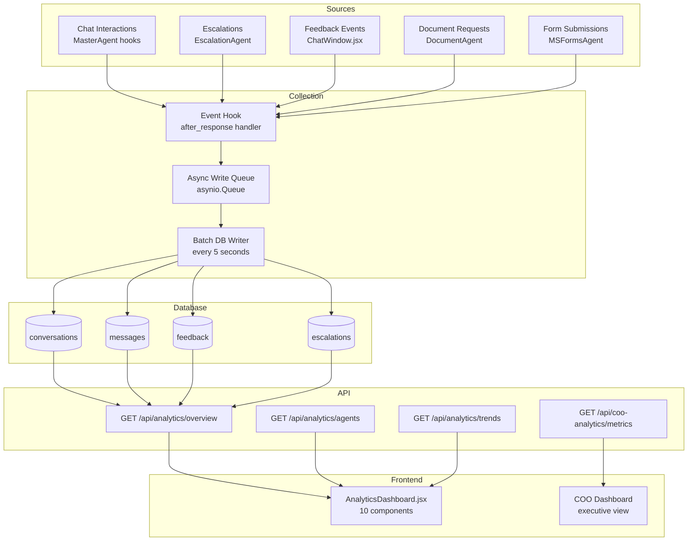

# Analytics Service Specification
# AA-Hackathon Enterprise AI Platform — Aligned Automation
# Document Version: 1.0 | Last Updated: 2026-06-07
# Source Files: backend/services/analytics_service.py,
#               backend/controllers/analytics.py,
#               backend/controllers/coo_analytics.py
# Frontend: frontend/src/pages/AnalyticsDashboard.jsx

---

## 1. Overview

The Analytics Service is NOT an AI agent. It is a data aggregation and reporting service
that collects interaction data from all platform components and presents it through two
distinct dashboard views: an internal platform analytics dashboard and a COO-level executive
dashboard.

The Analytics Service enables leadership to understand platform adoption, employee
engagement patterns, agent performance, and escalation trends. All data collection is
anonymized at the query level (query hashes, not raw text) to preserve employee privacy
while still enabling aggregate analysis.

---

## 2. Service Identity

| Property | Value |
|----------|-------|
| Service Name | AnalyticsService |
| Source File | `backend/services/analytics_service.py` |
| Controller | `backend/controllers/analytics.py` |
| COO Controller | `backend/controllers/coo_analytics.py` |
| Frontend | `frontend/src/pages/AnalyticsDashboard.jsx` |
| Database | PostgreSQL `squadrons` — multiple analytics tables |
| Access Control | Analytics Admin role / COO role |
| Not an AI agent | No Ollama calls, no RAG retrieval |

---

## 3. Data Collection Points

The Analytics Service passively collects data from four sources via event hooks in the
MasterAgent and domain agents:

### 3.1 Conversation Events

Every chat interaction is recorded:

```sql
CREATE TABLE conversations (
    id              SERIAL PRIMARY KEY,
    session_id      VARCHAR(100) NOT NULL,
    user_id         VARCHAR(50) NOT NULL,  -- anonymized employee ID
    department      VARCHAR(100),
    role            VARCHAR(50),
    query_hash      VARCHAR(64),           -- SHA-256 of query (never raw text)
    agent_selected  VARCHAR(30),
    routing_tier    VARCHAR(20),           -- regex / llm / keyword / general
    response_time_ms INT,
    confidence      FLOAT,
    escalation_triggered BOOLEAN DEFAULT FALSE,
    created_at      TIMESTAMP DEFAULT NOW()
);
```

### 3.2 Messages Table

```sql
CREATE TABLE messages (
    id              SERIAL PRIMARY KEY,
    session_id      VARCHAR(100) NOT NULL,
    user_id         VARCHAR(50) NOT NULL,
    role            VARCHAR(10),           -- user / assistant
    agent_key       VARCHAR(30),
    response_time_ms INT,
    token_count     INT,
    created_at      TIMESTAMP DEFAULT NOW()
);
```

### 3.3 Feedback Events

Employees can rate any agent response with thumbs up (+1), neutral (0), or thumbs down (-1):

```sql
CREATE TABLE feedback (
    id              SERIAL PRIMARY KEY,
    session_id      VARCHAR(100),
    message_id      INT REFERENCES messages(id),
    user_id         VARCHAR(50),
    rating          SMALLINT CHECK (rating IN (-1, 0, 1)),
    agent_key       VARCHAR(30),
    created_at      TIMESTAMP DEFAULT NOW()
);
```

### 3.4 Escalations Table

Escalation data (from EscalationAgent) is also analyzed for patterns:

```sql
-- Joins to escalations table defined in escalation-agent.md
-- Aggregated by: type, priority, department, resolution_time, sla_breached
```

---

## 4. Metrics Calculated

The AnalyticsService computes the following metrics on demand (no pre-aggregation caching
currently — all metrics are computed at query time):

### 4.1 Platform Overview Metrics

| Metric | Calculation |
|--------|-------------|
| Total conversations | COUNT(sessions) in period |
| Active users | COUNT(DISTINCT user_id) in period |
| Total messages | COUNT(messages) in period |
| Avg messages per session | total_messages / total_sessions |
| Avg response time | AVG(response_time_ms) across messages |
| P95 response time | PERCENTILE_CONT(0.95) of response_time_ms |
| Positive feedback rate | COUNT(rating=1) / COUNT(rated messages) |
| Escalation rate | COUNT(escalations) / COUNT(sessions) |

### 4.2 Agent Performance Metrics

| Metric | Calculation |
|--------|-------------|
| Queries per agent | GROUP BY agent_key COUNT |
| Agent response time (avg) | AVG(response_time_ms) GROUP BY agent_key |
| Agent satisfaction rate | AVG(feedback) GROUP BY agent_key |
| Agent routing accuracy | Proportion reaching intended agent (from audit data) |
| Routing tier distribution | COUNT GROUP BY routing_tier |
| Fallback rate | COUNT(agent='general') / total queries |

### 4.3 Escalation Analytics

| Metric | Calculation |
|--------|-------------|
| Escalations by type | COUNT GROUP BY escalation_type |
| Escalations by priority | COUNT GROUP BY priority |
| Avg resolution time | AVG(resolved_at - created_at) |
| SLA breach rate | COUNT(sla_breached=true) / total |
| Open escalations | COUNT(status='open') |
| Escalations by department | COUNT GROUP BY department |

### 4.4 Temporal Trends

| Metric | Calculation |
|--------|-------------|
| Daily active users | COUNT(DISTINCT user_id) GROUP BY DATE(created_at) |
| Peak usage hours | COUNT(messages) GROUP BY HOUR(created_at) |
| Weekly query volume | COUNT GROUP BY WEEK |
| Agent usage trend | COUNT GROUP BY agent_key, DATE |

---

## 5. API Endpoints

### 5.1 Platform Analytics

```
GET /api/analytics/overview
Authorization: Bearer <jwt> (analytics_admin role required)
Query params: from_date, to_date, department (optional filter)

Response 200:
{
    "period": {"from": "2026-06-01", "to": "2026-06-07"},
    "overview": {
        "total_conversations": 1247,
        "active_users": 342,
        "total_messages": 4891,
        "avg_messages_per_session": 3.9,
        "avg_response_time_ms": 2340,
        "p95_response_time_ms": 3850,
        "positive_feedback_rate": 0.78,
        "escalation_rate": 0.043
    },
    "agents": [...],
    "escalations": {...},
    "trends": {...}
}
```

```
GET /api/analytics/agents
GET /api/analytics/escalations
GET /api/analytics/feedback
GET /api/analytics/trends?granularity=day|hour|week
```

### 5.2 COO Dashboard

```
GET /api/coo-analytics/metrics
Authorization: Bearer <jwt> (coo role required)

Response 200:
{
    "executive_summary": {
        "platform_adoption_rate": 0.67,  // % of employees who used platform this week
        "employee_satisfaction_score": 4.2,  // out of 5
        "ai_resolution_rate": 0.83,  // queries resolved without escalation
        "cost_avoidance_estimate": 142,  // estimated HR/IT tickets avoided this week
        "top_query_domains": ["hr", "it", "document"],
        "critical_escalations_open": 2,
        "sla_breach_rate": 0.032
    },
    "department_breakdown": {...},
    "weekly_trend": {...},
    "agent_health": {...}
}
```

---

## 6. Dashboard Components — AnalyticsDashboard.jsx

The `AnalyticsDashboard.jsx` page renders 10 components:

| # | Component | Description | Data Source |
|---|-----------|-------------|------------|
| 1 | PlatformOverviewCard | 6 KPI tiles (users, sessions, msgs, response time, feedback, escalations) | GET /api/analytics/overview |
| 2 | AgentUsageChart | Bar chart: queries per agent | GET /api/analytics/agents |
| 3 | ResponseTimeChart | Line chart: avg response time trend | GET /api/analytics/trends |
| 4 | FeedbackDistributionChart | Donut: positive/neutral/negative % | GET /api/analytics/feedback |
| 5 | EscalationSummaryPanel | Table: open escalations by type/priority | GET /api/analytics/escalations |
| 6 | DailyActiveUsersChart | Area chart: DAU over selected period | GET /api/analytics/trends?granularity=day |
| 7 | PeakHoursHeatmap | Hour-of-day × day-of-week heatmap | GET /api/analytics/trends?granularity=hour |
| 8 | DepartmentBreakdownTable | Table: usage by department | GET /api/analytics/overview?group_by=department |
| 9 | RoutingTierPieChart | Pie: regex vs LLM vs keyword routing | GET /api/analytics/agents (routing_tier field) |
| 10 | AgentSatisfactionTable | Ranked table: agents by satisfaction score | GET /api/analytics/feedback (by agent) |

---

## 7. COO Dashboard

The COO dashboard is a separate page at `/coo-dashboard`, accessible only to users with
the `coo` role. It presents a business-level view optimized for executive consumption:

- No technical metrics (no routing tier, no token counts)
- Business outcomes: adoption rate, ticket avoidance, satisfaction score
- Risk signals: SLA breach rate, critical open escalations, negative feedback spikes
- Week-over-week trends with delta indicators (up/down arrows)
- Department health scores (composite of satisfaction + escalation rate + response time)
- Export to PDF (monthly report generation for board meetings)

---

## 8. Analytics Data Flow Diagram



---

## 9. Access Control

### 9.1 Analytics Admin Access

Users with `analytics_admin` role can access:
- All platform analytics endpoints
- All historical data without date restriction
- Export functionality
- Raw metrics (response times, routing tiers, confidence scores)

### 9.2 COO Access

Users with `coo` role can access:
- `/api/coo-analytics/*` endpoints only
- Business-level metrics (not technical details)
- Department-level breakdown (not individual user data)
- PDF export for board-level reporting

### 9.3 Data Privacy

- Raw query text is NEVER stored in any analytics table
- Only SHA-256 hashes of queries are stored (irreversible)
- User IDs are stored but require `analytics_admin` role to query individual-level data
- All aggregate APIs automatically anonymize results to groups of 5+ users
  (if a department has fewer than 5 users, it is grouped into "Other")

---

## 10. Analytics Event Hook Implementation

```python
# In supervisor_agent.py — post-response hook
async def _record_analytics(
    self,
    context: AgentContext,
    agent_key: str,
    routing_tier: str,
    response_time_ms: int,
    confidence: float,
    escalation_triggered: bool,
):
    event = AnalyticsEvent(
        session_id=context.session_id,
        user_id=context.user_id,
        department=context.department,
        role=context.role,
        query_hash=sha256(context.current_query.encode()).hexdigest(),
        agent_selected=agent_key,
        routing_tier=routing_tier,
        response_time_ms=response_time_ms,
        confidence=confidence,
        escalation_triggered=escalation_triggered,
    )
    await analytics_queue.put(event)  # non-blocking, fire-and-forget
```

The async queue ensures analytics collection never blocks the response stream.
The batch writer flushes the queue to PostgreSQL every 5 seconds.

---

## 11. Metrics Dashboard KPIs

Platform health is considered healthy when all of the following are true:

| KPI | Healthy Threshold | Warning | Critical |
|-----|------------------|---------|---------|
| P95 response time | < 4 seconds | 4-8 seconds | > 8 seconds |
| Positive feedback rate | > 75% | 60-75% | < 60% |
| Escalation rate | < 10% | 10-20% | > 20% |
| SLA breach rate | < 5% | 5-15% | > 15% |
| Platform adoption | > 50% employees | 25-50% | < 25% |
| Agent fallback rate | < 8% | 8-15% | > 15% |
| System uptime | > 99.5% | 98-99.5% | < 98% |

---

## 12. Known Limitations

| Limitation | Impact | Workaround |
|-----------|--------|-----------|
| No pre-aggregated views | Slow queries on large datasets | Add materialized views in Q3 |
| In-memory queue only | Analytics lost on crash | Add Redis queue as buffer |
| No real-time WebSocket | Dashboard needs manual refresh | Auto-refresh every 60 seconds |
| Single database for OLTP + OLAP | Analytics queries affect chat performance | Separate read replica in Q4 |
| No A/B testing infrastructure | Cannot measure prompt changes | Manual before/after comparison |

---

## 13. Future Enhancements

### 13.1 Materialized Views (Q3 2026)
Pre-aggregate daily and weekly metrics into materialized views refreshed every hour,
eliminating slow real-time aggregation queries.

### 13.2 Read Replica for Analytics (Q4 2026)
Separate PostgreSQL read replica for all analytics queries to prevent reporting workloads
from impacting chat response performance.

### 13.3 Sentiment Analysis Layer (Q3 2026)
Run a lightweight sentiment classifier on feedback events to detect topic-specific
satisfaction trends (e.g., "employees are unhappy with HR leave responses this week").

### 13.4 Predictive Escalation Model (Q4 2026)
ML model trained on historical escalation data to predict which conversations are likely
to escalate before the employee explicitly requests it, enabling proactive intervention.

### 13.5 PowerBI / Tableau Export (Q4 2026)
Add CSV and PowerBI-compatible API endpoints for the COO and HR leadership to integrate
AA-Hackathon analytics into their existing BI tooling.
