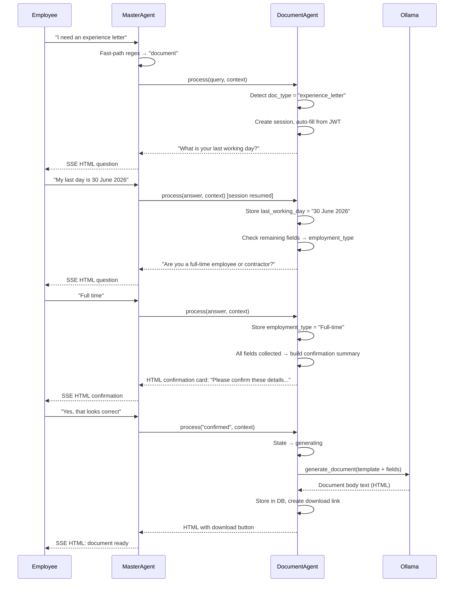
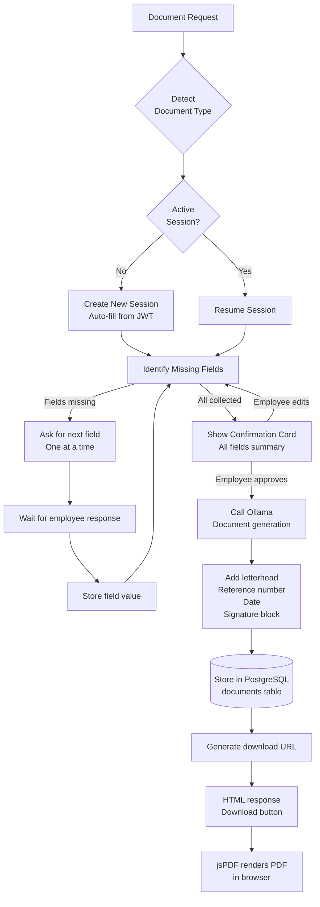

# Document Agent Specification
# AA-Hackathon Enterprise AI Platform — Aligned Automation
# Document Version: 1.0 | Last Updated: 2026-06-07
# Source File: backend/agents/document_agent.py
# Frontend: frontend/src/pages/DocumentsPage.jsx

---

## 1. Overview

The DocumentAgent is the HR document generation engine of the AA-Hackathon platform.
It conducts a structured multi-turn conversation with employees to collect all required
fields for a requested HR document, generates the document content using Ollama, and
produces a downloadable PDF via the frontend jsPDF library.

The DocumentAgent handles 11 distinct HR document types, each with its own required
field set and generation template. It is a functional agent with its own session
management — it maintains per-user conversation state until a document is successfully
generated or the session is abandoned.

---

## 2. Agent Identity

| Property | Value |
|----------|-------|
| Registry Key | `document` |
| Class | `DocumentAgent` |
| Base Class | `Standalone` (no BaseDeepAgent) |
| Source File | `backend/agents/document_agent.py` |
| Session Store | `active_sessions` dict (in-memory, per-user) |
| Frontend | `frontend/src/pages/DocumentsPage.jsx` |
| Generation API | `POST /api/documents/generate` |
| Download API | `GET /api/documents/download/{doc_id}` |
| Owner | HR Operations Team |

---

## 3. Supported Document Types

| # | Document Type | Key Fields | Typical Use Case |
|---|--------------|-----------|-----------------|
| 1 | Experience Letter | Employment dates, designation, department | Job applications |
| 2 | Offer Letter | Designation, CTC, joining date, reporting manager | New hires |
| 3 | Relieving Letter | Last working day, reason for leaving | New employer proof |
| 4 | No Objection Certificate (NOC) | Purpose, validity period | Visa, property, education |
| 5 | Bonafide Certificate | Current status, purpose | Education, bank |
| 6 | Promotion Letter | New designation, effective date, revised CTC | Internal promotion |
| 7 | Address Proof | Registered address, period of employment | Government, bank |
| 8 | Loan Proof | Employment status, monthly salary, tenure | Home/vehicle loans |
| 9 | Internship Certificate | Internship period, department, project | College records |
| 10 | Confirmation Letter | Confirmation date, designation | Probation completion |
| 11 | ID Card Request | Employee photo, designation, department | Replacement ID |

---

## 4. Session Management

The DocumentAgent maintains per-user sessions using an in-memory dictionary:

```python
active_sessions: dict[str, DocumentSession] = {}

@dataclass
class DocumentSession:
    user_id: str
    session_id: str
    doc_type: str
    collected_fields: dict[str, str]
    required_fields: list[str]
    remaining_fields: list[str]
    state: str          # collecting | confirming | generating | complete | abandoned
    created_at: datetime
    last_activity: datetime
    attempt_count: int
```

Sessions expire after 30 minutes of inactivity. On expiry, the employee is informed
and prompted to restart.

### 4.1 Session Lifecycle

```
[No session] → detect doc type → create session → collect fields (multi-turn)
→ confirm collected data → generate document → provide download link → complete
```

---

## 5. Required Fields per Document Type

```python
DOCUMENT_FIELDS = {
    "experience_letter": [
        "employee_name", "employee_id", "designation", "department",
        "date_of_joining", "last_working_day", "employment_type",
    ],
    "offer_letter": [
        "candidate_name", "designation", "department", "annual_ctc",
        "date_of_joining", "reporting_manager", "work_location",
        "offer_validity_date",
    ],
    "relieving_letter": [
        "employee_name", "employee_id", "designation", "department",
        "date_of_joining", "last_working_day", "reason_for_leaving",
    ],
    "noc": [
        "employee_name", "employee_id", "designation", "department",
        "noc_purpose", "noc_validity_period", "addressed_to",
    ],
    "bonafide_certificate": [
        "employee_name", "employee_id", "designation", "department",
        "date_of_joining", "purpose", "addressed_to",
    ],
    "promotion_letter": [
        "employee_name", "employee_id", "previous_designation",
        "new_designation", "effective_date", "revised_ctc",
        "department", "reporting_manager",
    ],
    "address_proof": [
        "employee_name", "employee_id", "designation", "department",
        "date_of_joining", "registered_address", "city", "pincode",
    ],
    "loan_proof": [
        "employee_name", "employee_id", "designation", "department",
        "date_of_joining", "monthly_gross_salary", "employment_type",
        "loan_institution_name",
    ],
    "internship_certificate": [
        "intern_name", "college_name", "department", "project_title",
        "internship_start_date", "internship_end_date", "supervisor_name",
    ],
    "confirmation_letter": [
        "employee_name", "employee_id", "designation", "department",
        "date_of_joining", "confirmation_date", "probation_period_months",
    ],
    "id_card_request": [
        "employee_name", "employee_id", "designation", "department",
        "reason_for_replacement", "has_photo",
    ],
}
```

### 5.1 Auto-Fill from JWT Context

Fields that can be auto-filled from the employee's JWT claims without prompting:

```python
JWT_AUTO_FILL = {
    "employee_name":  lambda ctx: ctx.jwt_claims.get("name"),
    "employee_id":    lambda ctx: ctx.jwt_claims.get("employee_id"),
    "designation":    lambda ctx: ctx.jwt_claims.get("designation"),
    "department":     lambda ctx: ctx.jwt_claims.get("department"),
    "date_of_joining": lambda ctx: ctx.jwt_claims.get("date_of_joining"),
}
```

This significantly reduces the number of fields the employee must manually enter.
For an Experience Letter, for example, only `last_working_day` and `employment_type`
typically need manual input.

---

## 6. Multi-Turn Conversation Flow



---

## 7. Document Generation with Ollama

Once all fields are collected and confirmed, the DocumentAgent calls Ollama to generate
the document body:

```python
DOCUMENT_GENERATION_PROMPT = """
You are an HR document writer for Aligned Automation.
Generate a formal {doc_type} using the following information.
Output only the document body in professional formal English.
Do not include letterhead or signature blocks — those are added separately.

Document Type: {doc_type}
Fields:
{fields_formatted}

Generate the document body now:
"""
```

The Ollama response is the document body text. The DocumentAgent then wraps it with:
- Aligned Automation letterhead template (company logo, address, phone)
- Date (today's date, auto-populated)
- Reference number (DOC-YYYY-NNNNNN)
- HR signature block (authorized signatory placeholder)

---

## 8. PDF Generation

PDF generation occurs in the frontend using jsPDF:

```javascript
// DocumentsPage.jsx — PDF generation
const generatePDF = (documentData) => {
    const doc = new jsPDF();

    // Letterhead
    doc.addImage(logoBase64, 'PNG', 10, 10, 60, 20);
    doc.setFontSize(10);
    doc.text('Aligned Automation | www.alignedautomation.com', 10, 35);
    doc.line(10, 38, 200, 38);

    // Document body
    doc.setFontSize(12);
    doc.text(documentData.reference_number, 10, 50);
    doc.text(documentData.date, 160, 50);

    // Body text (auto-wrapped)
    const bodyLines = doc.splitTextToSize(documentData.body, 180);
    doc.text(bodyLines, 10, 70);

    // Footer
    doc.text('Authorized Signatory', 10, 270);
    doc.text('HR Department, Aligned Automation', 10, 278);

    doc.save(`${documentData.doc_type}_${documentData.employee_id}.pdf`);
};
```

The backend also maintains a PDF record in the database for 30-day download availability.

---

## 9. API Endpoints

### 9.1 Generate Document

```
POST /api/documents/generate
Authorization: Bearer <jwt>
Content-Type: application/json

Request:
{
    "doc_type": "experience_letter",
    "session_id": "sess_abc123",
    "fields": {
        "employee_name": "Priya Sharma",
        "employee_id": "AA-2201",
        "designation": "Senior Software Engineer",
        "department": "Engineering",
        "date_of_joining": "2022-03-15",
        "last_working_day": "2026-06-30",
        "employment_type": "Full-time"
    }
}

Response 200:
{
    "doc_id": "DOC-2026-000312",
    "doc_type": "experience_letter",
    "generated_content": "To Whom It May Concern,\n\nThis is to certify that...",
    "html_preview": "<div class='document-preview'>...</div>",
    "download_url": "/api/documents/download/DOC-2026-000312",
    "expires_at": "2026-07-07T10:00:00Z"
}
```

### 9.2 Download Document

```
GET /api/documents/download/{doc_id}
Authorization: Bearer <jwt>

Response: application/pdf (binary stream)
Content-Disposition: attachment; filename="experience_letter_AA-2201.pdf"
```

---

## 10. Document Generation Flow Diagram



---

## 11. Confirmation Card Format

```html
<div class="document-confirmation">
  <h4>Please Confirm Your Details</h4>
  <p>I'll generate your <strong>Experience Letter</strong> with the following information:</p>
  <table class="field-summary">
    <tr><td>Employee Name</td><td>Priya Sharma</td></tr>
    <tr><td>Employee ID</td><td>AA-2201</td></tr>
    <tr><td>Designation</td><td>Senior Software Engineer</td></tr>
    <tr><td>Department</td><td>Engineering</td></tr>
    <tr><td>Date of Joining</td><td>15 March 2022</td></tr>
    <tr><td>Last Working Day</td><td>30 June 2026</td></tr>
    <tr><td>Employment Type</td><td>Full-time</td></tr>
  </table>
  <div class="confirm-actions">
    <button class="confirm-yes-btn">Yes, Generate Document</button>
    <button class="confirm-edit-btn">Edit Details</button>
    <button class="confirm-cancel-btn">Cancel</button>
  </div>
</div>
```

---

## 12. Fast-Path Detection by MasterAgent

```python
# In supervisor_agent.py FAST_PATH_RULES
(re.compile(
    r"(generate|create|request|need|want).{0,30}"
    r"(letter|certificate|noc|id card|offer letter|experience letter|"
    r"relieving|bonafide|promotion|internship|confirmation|address proof|loan proof)"
), "document"),
(re.compile(r"(letter|certificate)\s+(request|needed|required)"), "document"),
(re.compile(r"(i need|please give|please generate|can you generate).{0,20}(my|a|an).{0,20}(letter|certificate)"), "document"),
```

The MasterAgent routes document requests directly to DocumentAgent without LLM
classification, as the regex patterns are highly specific and have very low false-positive rate.

---

## 13. KPIs and SLAs

| Metric | Target | Measurement |
|--------|--------|-------------|
| Document type detection accuracy | > 95% | Audit of session logs |
| Multi-turn completion rate | > 80% | Sessions reaching "complete" state |
| Generation time (after confirm) | < 5 seconds | API timing logs |
| PDF render time (browser) | < 2 seconds | Frontend performance logging |
| Employee satisfaction | > 80% positive | Post-generation rating |
| Session abandonment rate | < 20% | Sessions with state="abandoned" |

---

## 14. Known Limitations

| Limitation | Impact | Workaround |
|-----------|--------|-----------|
| HR countersignature required | PDF has placeholder signature | HR team reviews and stamps |
| No digital signature | PDFs not legally signed | Manual approval by HR |
| In-memory session storage | Sessions lost on server restart | Notify employee, restart session |
| Single language (English) | Cannot generate in Hindi | Future roadmap |
| No letter number registry sync | Reference numbers not in HRMS | Manual cross-reference by HR |

---

## 15. Future Enhancements

### 15.1 Digital Signatures (Q3 2026)
Integration with DocuSign or Adobe Sign to apply HR manager's digital signature to
generated documents, making them legally valid without manual processing.

### 15.2 HRMS Integration for Auto-Fill (Q4 2026)
Pull all employee fields directly from the HRMS API, eliminating the multi-turn
collection conversation entirely for most document types.

### 15.3 Persistent Session Storage (Q3 2026)
Move `active_sessions` from in-memory dict to PostgreSQL or Redis for resilience across
server restarts and multiple worker processes.

### 15.4 Document History and Re-issue (Q4 2026)
Allow employees to view their past generated documents, re-download them, and request
re-issuance with updated dates or corrected information.

### 15.5 Manager Approval Workflow (Q4 2026)
For certain document types (Promotion Letter, Offer Letter), route the generated draft
to the reporting manager or HR manager for digital approval before the employee can
download the final signed copy.
