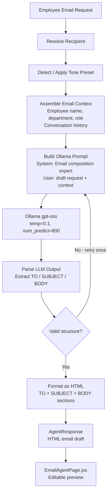
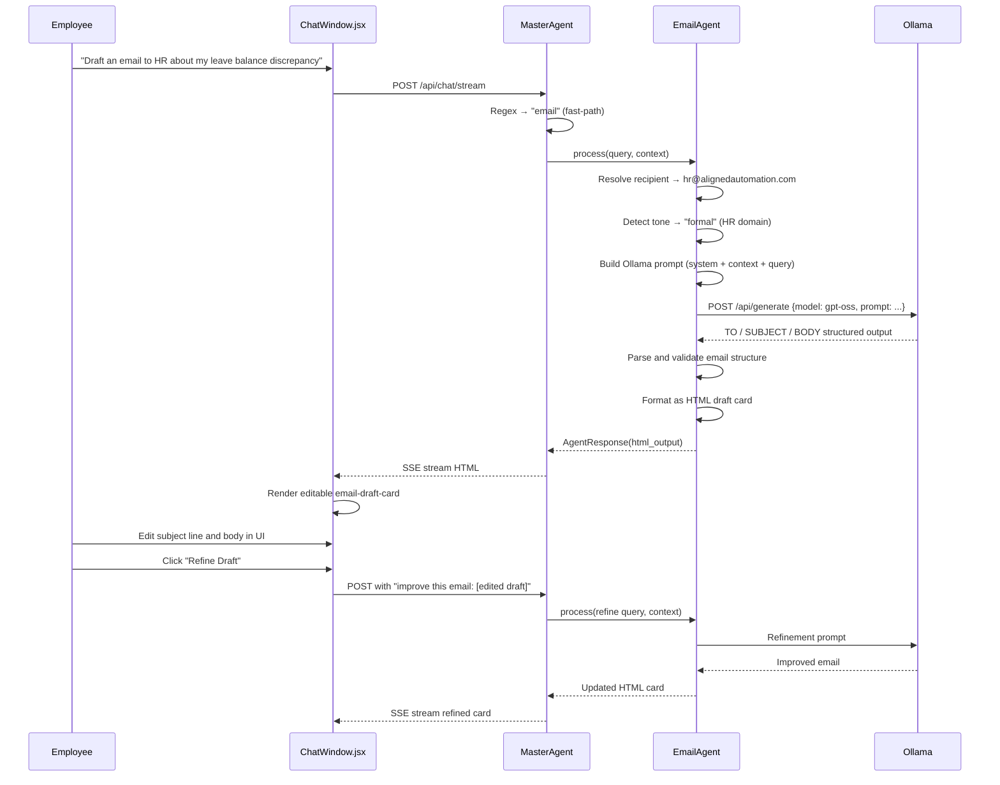

# Email Agent Specification
# AA-Hackathon Enterprise AI Platform — Aligned Automation
# Document Version: 1.0 | Last Updated: 2026-06-07
# Source File: apps/api-gateway/app/agents/email_agent.py
# Frontend: frontend/src/pages/EmailAgentPage.jsx

---

## 1. Overview

The EmailAgent is an AI-powered email drafting assistant on the AA-Hackathon platform.
It helps employees compose professional, context-appropriate emails for common workplace
scenarios: leave applications, IT support requests, travel approvals, HR queries,
management communications, and inter-team coordination.

The EmailAgent is an integration-type agent. It uses Ollama to refine and structure email
drafts but does NOT send emails. It produces polished draft content (TO, SUBJECT, BODY)
that the employee reviews and then sends from their own email client or triggers via the
platform's future mail-send integration.

---

## 2. Agent Identity

| Property | Value |
|----------|-------|
| Registry Key | `email` |
| Class | `EmailAgent` |
| Base Class | Plain function wrapped in an adapter class in `supervisor_agent.py` (no BaseDeepAgent) |
| Source File | `apps/api-gateway/app/agents/email_agent.py` |
| Frontend | `frontend/src/pages/EmailAgentPage.jsx` |
| API Endpoint | `POST /api/email-agent/from-chat` |
| Fallback | Redirect user to compose in Outlook |
| Owner | Platform Team |

---

## 3. Personality and Tone

The EmailAgent's system prompt focuses on professional communication excellence:

- **Tone-aware**: Matches formality to recipient (peer vs. manager vs. HR vs. client)
- **Concise**: Removes filler words and redundant phrases
- **Action-oriented**: Every email has a clear ask or call-to-action
- **Policy-compliant**: Uses approved terminology for HR/IT/Admin requests
- **Culturally appropriate**: Professional English appropriate for Indian enterprise context

The EmailAgent offers four tone presets that the employee can select:
- **Formal**: For HR, legal, senior leadership, external clients
- **Professional**: Default — for managers, cross-team communication
- **Friendly-Professional**: For peers, team leads, collaborative requests
- **Urgent**: For time-sensitive escalation emails

---

## 4. Default Recipients by Domain

When the employee describes the email purpose but does not specify a recipient, the
EmailAgent pre-populates the `TO` field with the domain default:

```python
DEFAULT_RECIPIENTS = {
    "hr":         "hr@alignedautomation.com",
    "it":         "it.support@alignedautomation.com",
    "admin":      "admin@alignedautomation.com",
    "management": "management@alignedautomation.com",
    "finance":    "management@alignedautomation.com",
    "pmo":        "management@alignedautomation.com",
}
```

### 4.1 Recipient Resolution Logic

```python
async def resolve_recipient(self, query: str, context: AgentContext) -> str:
    # 1. Check if email address explicitly mentioned in query
    explicit = re.search(r'[\w.-]+@[\w.-]+\.\w+', query)
    if explicit:
        return explicit.group()

    # 2. Detect domain from keywords
    for domain, keywords in DOMAIN_KEYWORDS.items():
        if any(kw in query.lower() for kw in keywords):
            return DEFAULT_RECIPIENTS.get(domain, "")

    # 3. Ask employee if recipient is unclear
    return ""  # empty → frontend shows TO field as editable placeholder
```

---

## 5. Email Generation Pipeline



### 5.1 Ollama Prompt Structure

```
System:
You are a professional email composition assistant for Aligned Automation employees.
Draft emails that are concise, professional, and action-oriented.
Always output in exactly this format:
TO: [recipient email]
SUBJECT: [subject line, max 60 characters]
BODY:
[email body with proper greeting and sign-off]

User:
Employee Name: {name}
Department: {department}
Email Purpose: {query}
Tone: {tone_preset}
Context from conversation: {conversation_summary}
Draft a professional email for this purpose.
```

### 5.2 LLM Output Parsing

The EmailAgent expects the Ollama response in a structured format and parses it with:

```python
def _parse_email_output(self, llm_output: str) -> EmailDraft:
    to_match = re.search(r'^TO:\s*(.+)$', llm_output, re.MULTILINE)
    subj_match = re.search(r'^SUBJECT:\s*(.+)$', llm_output, re.MULTILINE)
    body_match = re.search(r'^BODY:\s*\n([\s\S]+)$', llm_output, re.MULTILINE)

    return EmailDraft(
        to=to_match.group(1).strip() if to_match else "",
        subject=subj_match.group(1).strip() if subj_match else "",
        body=body_match.group(1).strip() if body_match else llm_output,
    )
```

If parsing fails (malformed output), the EmailAgent retries once with an explicit format
reminder added to the prompt. If the second attempt also fails, the raw LLM output is
returned with a note to the employee to format it manually.

---

## 6. Response Format

The EmailAgent returns an HTML draft card:

```html
<div class="email-draft-card">
  <div class="email-header">
    <h4>Email Draft Ready</h4>
    <div class="tone-badge">Tone: Professional</div>
  </div>

  <div class="email-field">
    <label>TO</label>
    <span class="email-to" contenteditable="true">
      hr@alignedautomation.com
    </span>
  </div>

  <div class="email-field">
    <label>CC</label>
    <span class="email-cc" contenteditable="true">(optional)</span>
  </div>

  <div class="email-field">
    <label>SUBJECT</label>
    <span class="email-subject" contenteditable="true">
      Leave Application — Annual Leave, 15-20 June 2026
    </span>
  </div>

  <div class="email-body-field">
    <label>BODY</label>
    <div class="email-body" contenteditable="true">
      Dear [Manager Name],<br><br>
      I am writing to formally apply for annual leave from 15th June to 20th June 2026
      (5 working days)...<br><br>
      Best regards,<br>
      [Employee Name]
    </div>
  </div>

  <div class="email-actions">
    <button class="copy-email-btn">Copy to Clipboard</button>
    <button class="refine-btn">Refine Draft</button>
    <button class="open-outlook-btn">Open in Outlook</button>
  </div>

  <p class="disclaimer">
    Review the draft before sending. This is a draft only — the platform does not
    send emails automatically.
  </p>
</div>
```

All fields in the draft are `contenteditable="true"` — the employee can edit directly
in the chat interface before copying or opening in Outlook.

---

## 7. Fast-Path Trigger from MasterAgent

The MasterAgent detects email composition requests via regex and routes directly to
EmailAgent without LLM classification:

```python
(re.compile(r"(draft|write|compose|create|help me write).{0,20}(email|mail|message to)"), "email"),
(re.compile(r"(email).{0,10}(draft|template|format)"), "email"),
(re.compile(r"i need to (email|write to|contact).{0,30}(hr|it|admin|manager|team)"), "email"),
```

---

## 8. API Endpoint

```
POST /api/email-agent/from-chat
Authorization: Bearer <jwt>
Content-Type: application/json

Request:
{
    "query": "Help me write an email to HR requesting a leave extension",
    "session_id": "sess_abc123",
    "tone": "formal",           // optional: formal/professional/friendly-professional/urgent
    "recipient_override": ""    // optional: specific email address
}

Response 200:
{
    "email_draft": {
        "to": "hr@alignedautomation.com",
        "cc": "",
        "subject": "Leave Extension Request — June 2026",
        "body": "Dear HR Team,\n\nI am writing to request..."
    },
    "html_output": "<div class='email-draft-card'>...</div>",
    "tone_used": "formal",
    "confidence": 0.91
}
```

---

## 9. EmailAgentPage.jsx

The dedicated email agent page at `/email-agent` provides a standalone interface for:

- Free-form email drafting (not tied to a chat query)
- Tone selector (radio buttons)
- Recipient suggestions (domain-based autocomplete)
- Draft history (last 5 drafts stored in localStorage)
- Side-by-side: original intent + refined draft

The page embeds the same `email-draft-card` component used in the chat interface, ensuring
UI consistency. It also exposes a "Refine" button that sends the current draft back to
the EmailAgent with the instruction "improve this email" for iterative polishing.

---

## 10. Email Agent Flow Diagram



---

## 11. Tone Guidelines

| Tone Preset | When to Use | Key Characteristics |
|-------------|------------|-------------------|
| Formal | HR complaints, legal queries, senior leadership, external | Dear [Full Name], passive voice, no contractions |
| Professional | Managers, cross-department, approvals | Dear [First Name], direct, clear ask |
| Friendly-Professional | Peers, team leads, collaborative | Hi [Name], conversational but structured |
| Urgent | SLA issues, blockers, critical requests | Short sentences, bullet points, clear deadline |

---

## 12. Common Email Templates Supported

The EmailAgent can draft all of the following (and more via free-form):

1. Leave application (annual, sick, emergency, maternity/paternity)
2. WFH request
3. IT access request
4. Cab/travel booking follow-up
5. Expense reimbursement follow-up
6. Manager update / project status email
7. Client communication (internal coordination)
8. Onboarding welcome email (for managers welcoming new joiners)
9. Reference request to HR
10. Appraisal discussion request

---

## 13. KPIs and SLAs

| Metric | Target | Measurement |
|--------|--------|-------------|
| Draft generation time | < 3 seconds P95 | API response time |
| Parsing success rate | > 98% | Parse failure logs |
| Employee editing rate | < 30% of drafts significantly edited | Analytics (optional) |
| User satisfaction | > 75% positive rating | In-chat thumbs |
| Tone accuracy | > 88% correct tone applied | User survey sample |

---

## 14. Known Limitations

| Limitation | Impact | Workaround |
|-----------|--------|-----------|
| Does not send email | Employee must copy and send | Copy button + "Open in Outlook" link |
| No Outlook drafts folder integration | Draft not saved to mailbox | Local clipboard or manual save |
| Recipient name not resolved | Uses team emails, not personal | Employee to fill in personal recipient |
| No attachment support | Cannot compose email with files | Employee attaches manually |

---

## 15. Future Enhancements

### 15.1 Microsoft Graph API Mail.Send Integration (Q3 2026)
The most impactful upcoming enhancement: integration with Microsoft Graph API using the
`Mail.Send` delegated permission scope. This will allow the platform to send emails on
behalf of the employee directly from the chat interface, with explicit send confirmation.

Required OAuth scopes:
- `Mail.Send` — Send emails on behalf of user
- `Mail.ReadWrite` — Save drafts to Outlook Drafts folder
- `User.Read` — Resolve employee profile for From header

### 15.2 CC/BCC Suggestions (Q3 2026)
Automatically suggest CC recipients based on the email topic (e.g., manager auto-CC'd
on leave applications, IT manager on access escalations).

### 15.3 Email Thread Context (Q4 2026)
Allow employees to paste an email thread into the chat to get a suggested reply,
maintaining context from the existing thread.

### 15.4 Template Library (Q4 2026)
HR and Admin teams can pre-define approved email templates for common scenarios, which
the EmailAgent uses as base templates rather than generating from scratch.
