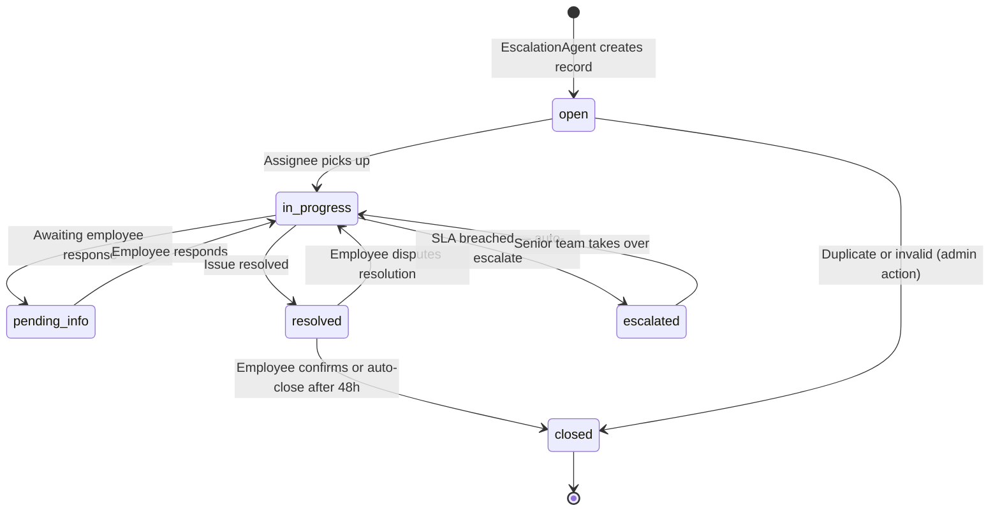
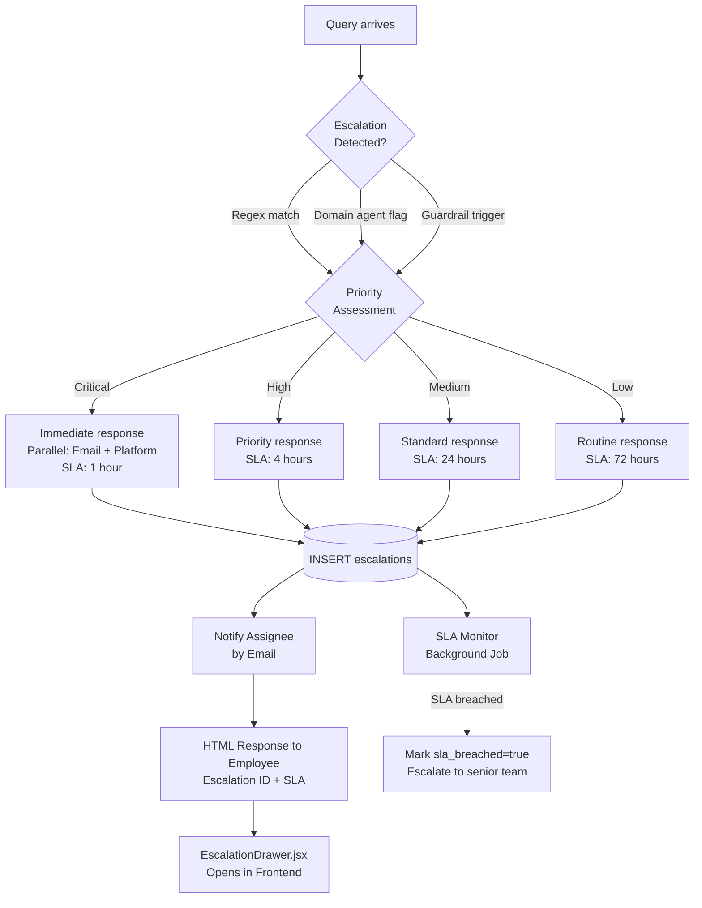

# Escalation Agent Specification
# AA-Hackathon Enterprise AI Platform — Aligned Automation
# Document Version: 1.0 | Last Updated: 2026-06-07
# Source File: apps/api-gateway/app/agents/escalation_agent.py

---

## 1. Overview

The EscalationAgent manages the lifecycle of escalated issues on the AA-Hackathon platform.
When employee queries require human intervention — due to policy complexity, welfare concerns,
formal complaints, security incidents, or unresolved support needs — the EscalationAgent
creates a formal escalation record, notifies the appropriate team, and communicates the
outcome to the employee.

The EscalationAgent is a functional agent (not inheriting BaseDeepAgent) because its
primary job is structured data creation and notification, not RAG-based Q&A. It uses
Ollama only for parsing and refining the escalation summary.

---

## 2. Agent Identity

| Property | Value |
|----------|-------|
| Registry Key | `escalation` |
| Class | `EscalationAgent` |
| Base Class | Plain function wrapped in an adapter class in `supervisor_agent.py` (no BaseDeepAgent) |
| Source File | `apps/api-gateway/app/agents/escalation_agent.py` |
| Database Table | `escalations` (PostgreSQL, db=squadrons) |
| Frontend | `EscalationDrawer.jsx` |
| Owner | All Teams / Platform Team |

---

## 3. Escalation Types

The EscalationAgent categorizes all escalations into seven types:

| Type | Code | Examples | Default Assignee |
|------|------|---------|-----------------|
| HR | `hr` | Leave disputes, POSH complaints, exit issues | hr@alignedautomation.com |
| IT | `it` | Security incidents, access blocked, data breach | it.support@alignedautomation.com |
| Admin | `admin` | Facilities safety, travel policy exceptions | admin@alignedautomation.com |
| Finance | `finance` | Expense claim disputes, payment delays | management@alignedautomation.com |
| Legal | `legal` | Contract queries, IP concerns, compliance | management@alignedautomation.com |
| Facility | `facility` | Building safety, emergency, physical access | admin@alignedautomation.com |
| Other | `other` | Cross-functional, unclassified urgent matters | management@alignedautomation.com |

---

## 4. Priority Levels

```python
PRIORITY_LEVELS = {
    "low":      {"sla_hours": 72, "notification": "email_only"},
    "medium":   {"sla_hours": 24, "notification": "email_and_platform"},
    "high":     {"sla_hours": 4,  "notification": "email_and_platform_and_sms"},
    "critical": {"sla_hours": 1,  "notification": "immediate_all_channels"},
}
```

Priority is automatically assigned by the EscalationAgent based on keyword signals in the
original query and the domain agent's `escalation_priority` field.

### 4.1 Priority Assignment Logic

```python
CRITICAL_PATTERNS = [
    r"(harassment|assault|abuse|violence|unsafe|threatening|stalking)",
    r"(data breach|security breach|hacked|compromised|exfiltration)",
    r"(suicidal|self.harm|mental health crisis|in danger)",
    r"(fire|flood|emergency|evacuation|medical emergency)",
]

HIGH_PATTERNS = [
    r"(discrimination|hostile work|toxic environment|bullying)",
    r"(phishing|malware|suspicious email|virus|ransomware)",
    r"(formal complaint|legal action|whistleblower|labor law)",
    r"(stolen|lost.{0,10}(laptop|device|phone))",
]

MEDIUM_PATTERNS = [
    r"(payroll error|salary mistake|wrong pay|missing reimbursement)",
    r"(this is urgent|need immediate|cannot wait|blocking me)",
    r"(account blocked|cannot login|access denied|locked out)",
]
# Anything else = low priority
```

---

## 5. Escalation Detection

The EscalationAgent is triggered in two live ways, plus a dormant code path:

1. **Automatic**: Domain agent returns `escalation_triggered=True` in AgentResponse
2. **User-initiated**: An escalation-keyword check runs early in `MasterAgent._route()`
   (before the regex fast-paths and keyword-score fallback) and matches phrases like
   "escalate", "raise a complaint", "speak to HR", etc.
3. **Dormant/unused**: The router also defines a `_route_llm()` LLM-classification method
   that could in principle return `action=escalate` for welfare signals, but it is dead
   code — it is never actually called by `_route()`.

Detection patterns for user-initiated escalation (checked early in `MasterAgent._route()`):

```python
ESCALATION_TRIGGERS = [
    r"(escalate|raise.{0,10}(ticket|complaint|issue))",
    r"(need.{0,10}human|speak to (hr|it|manager|someone))",
    r"(formal.{0,10}complaint|lodge.{0,10}complaint)",
    r"(not satisfied|unhappy with|disappointed|frustrated with the response)",
    r"(this is urgent|critical issue|need help now)",
    r"(posh|sexual harassment|hostile environment)",
]
```

---

## 6. Database Schema

```sql
CREATE TABLE escalations (
    id              SERIAL PRIMARY KEY,
    escalation_id   VARCHAR(20) UNIQUE NOT NULL,  -- ESC-2026-001234
    user_id         VARCHAR(50) NOT NULL,
    user_email      VARCHAR(255) NOT NULL,
    user_name       VARCHAR(255),
    department      VARCHAR(100),
    escalation_type VARCHAR(20) NOT NULL,          -- hr/it/admin/finance/legal/facility/other
    priority        VARCHAR(10) NOT NULL,           -- low/medium/high/critical
    status          VARCHAR(20) NOT NULL DEFAULT 'open',
    title           TEXT NOT NULL,
    description     TEXT NOT NULL,
    original_query  TEXT,
    assignee_email  VARCHAR(255),
    assignee_name   VARCHAR(255),
    session_id      VARCHAR(100),
    created_at      TIMESTAMP DEFAULT NOW(),
    updated_at      TIMESTAMP DEFAULT NOW(),
    resolved_at     TIMESTAMP,
    closed_at       TIMESTAMP,
    resolution_notes TEXT,
    sla_due_at      TIMESTAMP,
    sla_breached    BOOLEAN DEFAULT FALSE
);

CREATE INDEX idx_escalations_user_id ON escalations(user_id);
CREATE INDEX idx_escalations_status ON escalations(status);
CREATE INDEX idx_escalations_priority ON escalations(priority);
CREATE INDEX idx_escalations_type ON escalations(escalation_type);
CREATE INDEX idx_escalations_created_at ON escalations(created_at DESC);
```

### 6.1 Escalation ID Format

`ESC-YYYY-NNNNNN` where YYYY is the year and NNNNNN is a zero-padded auto-increment.

Example: `ESC-2026-000042`

---

## 7. Status Lifecycle



Status transitions are recorded with timestamp and actor. All status changes are pushed
to the employee via the chat interface (new SSE event from the backend).

---

## 8. API Endpoints

### 8.1 Create Escalation

```
POST /api/escalations
Authorization: Bearer <jwt>
Content-Type: application/json

Request:
{
    "escalation_type": "hr",
    "priority": "high",
    "title": "Payroll deduction discrepancy",
    "description": "My August payslip shows an incorrect deduction...",
    "original_query": "Why was extra money deducted from my salary?",
    "session_id": "sess_abc123"
}

Response 201:
{
    "escalation_id": "ESC-2026-000042",
    "status": "open",
    "assignee_email": "hr@alignedautomation.com",
    "sla_due_at": "2026-06-08T10:00:00Z",
    "message": "Your escalation has been raised. HR will respond within 4 hours."
}
```

### 8.2 Get User Escalations

```
GET /api/escalations?status=open&limit=10
Authorization: Bearer <jwt>

Response 200:
{
    "escalations": [...],
    "total": 3,
    "open": 1,
    "in_progress": 1,
    "resolved": 1
}
```

### 8.3 Update Escalation Status (Admin)

```
PATCH /api/escalations/{escalation_id}
Authorization: Bearer <jwt> (admin role required)

Request:
{
    "status": "resolved",
    "resolution_notes": "Payroll team corrected the deduction. Credit in next payroll."
}
```

### 8.4 Admin View

```
GET /api/escalations/admin?type=hr&priority=high&status=open
Authorization: Bearer <jwt> (hr_admin / it_admin / coo role required)

Returns all escalations for assigned domain, with SLA countdown.
```

---

## 9. EscalationDrawer.jsx — Frontend Component

The `EscalationDrawer.jsx` component is a right-side drawer panel that opens when:
- An escalation is created from the chat
- The user clicks "View My Escalations" from the nav
- An admin views the escalation queue

Features:
- Real-time status updates via SSE
- Priority badge (color-coded: red=critical, orange=high, yellow=medium, blue=low)
- SLA countdown timer
- Conversation thread with assignee
- File attachment support (for evidence)
- Resolution confirmation button

---

## 10. Escalation Flow Diagram



---

## 11. SLA Monitoring

A background scheduler (APScheduler) runs every 15 minutes to check for SLA breaches:

```python
async def check_sla_breaches():
    overdue = await db.query("""
        SELECT * FROM escalations
        WHERE status NOT IN ('resolved', 'closed')
        AND sla_due_at < NOW()
        AND sla_breached = FALSE
    """)
    for escalation in overdue:
        await mark_sla_breached(escalation.escalation_id)
        await notify_senior_team(escalation)
        await push_notification_to_employee(escalation)
```

SLA breach notifications go to:
- `management@alignedautomation.com` for all breaches
- The domain-specific team lead for their breaches
- The employee (in-chat notification)

---

## 12. Notification Templates

### Employee Acknowledgment (in-chat HTML)

```html
<div class="escalation-created">
  <h4>Escalation Raised</h4>
  <p>Your issue has been formally raised with our <strong>[HR / IT / Admin]</strong> team.</p>
  <table>
    <tr><td>Escalation ID</td><td><strong>ESC-2026-000042</strong></td></tr>
    <tr><td>Priority</td><td><span class="priority-high">High</span></td></tr>
    <tr><td>Expected Response</td><td>Within 4 hours</td></tr>
    <tr><td>Assigned To</td><td>HR Team</td></tr>
  </table>
  <p>You can track this escalation in the <strong>Escalations panel</strong> on the right.</p>
</div>
```

---

## 13. KPIs and SLAs

| Metric | Target | Measurement |
|--------|--------|-------------|
| Escalation creation time | < 2 seconds | API response time |
| Priority assignment accuracy | > 90% | Monthly HR/IT audit |
| SLA breach rate | < 5% | Database SLA tracking |
| False escalation rate | < 10% | Team review of closed-invalid |
| Resolution satisfaction | > 80% positive | Post-resolution survey |
| Critical escalation response | < 1 hour | assignee pickup time |

---

## 14. Future Enhancements

### 14.1 Email Threading (Q3 2026)
Integrate Microsoft Graph Mail API to create a proper email thread for each escalation,
allowing the employee and assignee to communicate via email while the chat interface
stays synchronized.

### 14.2 Escalation Analytics Dashboard (Q3 2026)
HR and IT managers get a real-time view of open escalations, breach risk, and resolution
velocity on the COO dashboard.

### 14.3 Automated Assignment Rules (Q4 2026)
Route escalations to specific HR Business Partners based on the employee's department,
rather than a team inbox.

### 14.4 JIRA/ServiceNow Sync (Q4 2026)
Bi-directional sync between the escalations table and JIRA (for IT) and ServiceNow
(for facilities) to avoid duplicate ticket management.
