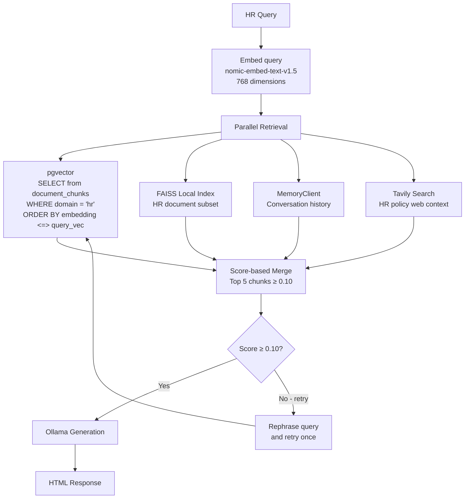
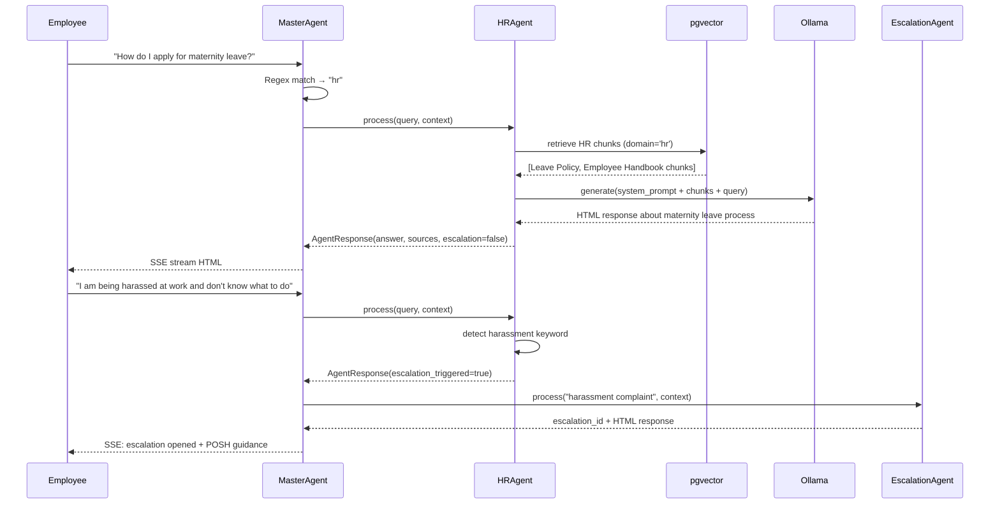

# HR Agent Specification
# AA-Hackathon Enterprise AI Platform — Aligned Automation
# Document Version: 1.0 | Last Updated: 2026-06-07
# Source File: apps/api-gateway/app/agents/working/hr_agent.py

---

## 1. Overview

The HRAgent is the primary employee-facing agent on the AA-Hackathon platform. It handles
all queries related to human resources: leave management, benefits, payroll information,
HR policies, employee support, and lifecycle events. The HRAgent is the catch-all domain
agent — when no other agent is more appropriate, queries default here.

The HRAgent is warm, empathetic, and policy-focused. It acknowledges that HR topics often
carry emotional weight and adjusts its tone accordingly. When a query involves distress,
harassment, or a formal complaint, it immediately routes to the EscalationAgent.

---

## 2. Agent Identity

| Property | Value |
|----------|-------|
| Registry Key | `hr` |
| Class | `HRAgent` |
| Base Class | `BaseDeepAgent` |
| Source File | `apps/api-gateway/app/agents/working/hr_agent.py` |
| Personality File | `apps/api-gateway/app/agents/working/personalities.py` |
| Fallback Email | `hr@alignedautomation.com` |
| Owner | HR Operations Team |

---

## 3. Personality and Tone

From `personalities.py`, the HRAgent system prompt defines the following character:

- **Warm and empathetic**: Acknowledges feelings before diving into information
- **Policy-focused**: Grounds all advice in documented HR policies
- **Non-judgmental**: Treats all leave types, personal situations with equal respect
- **Transparent about limitations**: Clearly states when it cannot access live payroll data
- **Action-oriented**: Every response ends with a concrete next step or reference

Sample opening lines from the personality:
> "I'm here to help with anything HR-related. Let me look that up for you."
> "That's a great question about your leave entitlement. Here's what our policy says..."
> "I completely understand this situation can be stressful. Let me guide you through the process."

The HRAgent never uses informal language, emojis, or speculation about company decisions.

---

## 4. Domain Coverage

### 4.1 Leave Management

- Leave balance inquiry (annual, sick, casual, comp off, maternity, paternity, bereavement)
- Leave application process and approval workflow
- Leave policy rules (minimum notice, carry-forward, encashment)
- Work-from-home policy and eligibility
- Holiday calendar and public holidays

### 4.2 Payroll and Compensation

- Payslip access guidance (where to download, portal instructions)
- CTC structure explanation (basic, HRA, allowances, deductions)
- Salary revision timing and appraisal cycle information
- Tax declarations and Form 16 process
- PF, ESIC, and gratuity information
- Note: The HRAgent does NOT have access to live payroll data. It provides policy
  information and directs employees to the HRMS portal for actual figures.

### 4.3 Benefits

- Health insurance enrollment and claims
- Life and accident insurance coverage details
- Corporate perks and wellness programs
- Employee referral program details
- Flexi-benefit plan options

### 4.4 HR Policies

- Code of conduct
- POSH (Prevention of Sexual Harassment) policy
- Disciplinary process
- Performance improvement plans (PIPs)
- Whistleblower policy
- Conflict of interest policy

### 4.5 Employee Lifecycle

- Onboarding process and checklist
- Probation period and confirmation
- Internal transfer and lateral movement process
- Promotion criteria and cycle
- Exit process, notice period, and full-and-final settlement
- Reference and background check process

### 4.6 Document Requests

When an employee asks for an HR document (experience letter, salary slip, NOC, etc.),
the HRAgent recognizes the intent and hands off to the DocumentAgent via the MasterAgent.
The HRAgent does not generate documents itself.

---

## 5. Retrieval Pipeline



### 5.1 pgvector Query

```sql
SELECT
    content,
    source_document,
    1 - (embedding <=> $1::vector) AS relevance_score
FROM document_chunks
WHERE domain = 'hr'
ORDER BY relevance_score DESC
LIMIT 5;
```

Documents in the HR domain include: Employee Handbook, Leave Policy, Benefits Guide,
POSH Policy, Code of Conduct, Appraisal Framework, Exit Policy, Compensation Structure.

### 5.2 Adaptive Retry

If the top retrieved chunk scores below 0.10 cosine similarity, the HRAgent rephrases
the query using a simple synonym expansion (e.g., "leave" → "time off, absence, vacation")
and retries the pgvector query once. If the retry still scores below threshold, the agent
proceeds with whatever context is available and appends a disclaimer.

---

## 6. Response Format

All HRAgent responses are HTML. Never markdown. Structure:

```html
<div class="hr-response">
  <p class="greeting">Here's what I found about [topic]:</p>
  <div class="policy-content">
    <!-- Policy explanation paragraphs -->
  </div>
  <div class="action-steps">
    <h4>Next Steps</h4>
    <ol>
      <li>Step 1...</li>
      <li>Step 2...</li>
    </ol>
  </div>
  <div class="contact-info">
    <p>For further assistance, contact HR at
    <a href="mailto:hr@alignedautomation.com">hr@alignedautomation.com</a></p>
  </div>
</div>
```

The response never exceeds 800 tokens (enforced by `num_predict=800` in Ollama config).
Long policies are summarized with a reference to the full document.

---

## 7. Escalation Triggers

The HRAgent monitors its own output and the query for escalation signals:

| Trigger Keyword Pattern | Escalation Type | Priority |
|------------------------|----------------|---------|
| harassment, discrimination, hostile | POSH / HR Complaint | Critical |
| overwhelmed, burnout, not coping | Welfare / Wellness | High |
| unsafe, threatened, bullying | Workplace Safety | Critical |
| formal complaint, raise grievance | HR Grievance | High |
| illegal, unethical, violation | Compliance | High |

When triggered, the HRAgent sets `escalation_triggered=True` in its `AgentResponse` and
the MasterAgent chains an EscalationAgent call automatically.

---

## 8. Integration Points

| Target | Trigger | Method |
|--------|---------|--------|
| DocumentAgent | "I need a letter / certificate" | MasterAgent re-dispatch |
| EscalationAgent | Welfare / complaint keywords | escalation_triggered flag |
| OnboardingModule | "new joiner, onboarding" | Redirect to onboarding UI link |
| EmailAgent | "email to HR about my leave" | MasterAgent re-dispatch |

---

## 9. HR Agent Flow Diagram



---

## 10. Known Limitations

| Limitation | Impact | Workaround |
|-----------|--------|-----------|
| No live payroll data access | Cannot give exact leave balances | Direct to HRMS portal |
| No HRMS integration | Cannot apply leave directly | Provide process instructions |
| Static policy documents | May lag behind policy updates | HR team to update document_chunks monthly |
| Single Ollama call | Complex multi-part queries may lose nuance | Follow-up questions supported |
| English only | Cannot respond in regional languages | Future enhancement roadmap |

---

## 11. KPIs and SLAs

| Metric | Target | Measurement Method |
|--------|--------|------------------|
| End-to-end response time | < 4 seconds P95 | SSE timing logs |
| Query routing accuracy | > 92% | Monthly HR team review |
| Escalation false-positive rate | < 5% | Escalation outcome tracking |
| Employee satisfaction rating | > 75% positive | In-chat feedback (-1/0/1) |
| Policy coverage rate | > 85% of queries answered | Unanswered query log |
| Fallback to email rate | < 10% | Logs tracking "contact hr@" responses |

---

## 12. Future Enhancements

### 12.1 HRMS Integration (Q3 2026)
Direct API integration with the company HRMS (e.g., Darwinbox, Zoho People) to allow:
- Real-time leave balance lookup
- In-chat leave application submission
- Payslip retrieval and display
- Attendance records access

### 12.2 Multi-language Support (Q4 2026)
Support for Hindi and regional Indian languages using multilingual embedding models
(e.g., LaBSE or Indic-BERT) for both retrieval and generation.

### 12.3 Proactive HR Notifications (Q4 2026)
HR-initiated broadcast messages through the platform (policy updates, open enrollment
reminders, compliance deadlines) delivered via the chat interface.

### 12.4 Sentiment Trend Analysis (Q3 2026)
Aggregate employee sentiment from HRAgent interactions (anonymized) to surface workplace
health trends to the HR leadership team via the COO dashboard.

---

## 13. Document Sources

The following documents populate the HR domain in `document_chunks`:

1. Employee Handbook (latest version)
2. Leave and Attendance Policy
3. Compensation and Benefits Guide
4. Health Insurance Policy Document
5. POSH Policy and Reporting Procedure
6. Code of Conduct
7. Performance Management Framework
8. Exit and Separation Policy
9. Probation and Confirmation Policy
10. Work From Home Guidelines

Documents are ingested via the admin document upload pipeline, chunked into 1000-character
segments with 200-character overlap (after a section-aware pre-split step) using
RecursiveCharacterTextSplitter, embedded using `nomic-embed-text-v1.5`, and stored in
`document_chunks` with `domain='hr'`.
