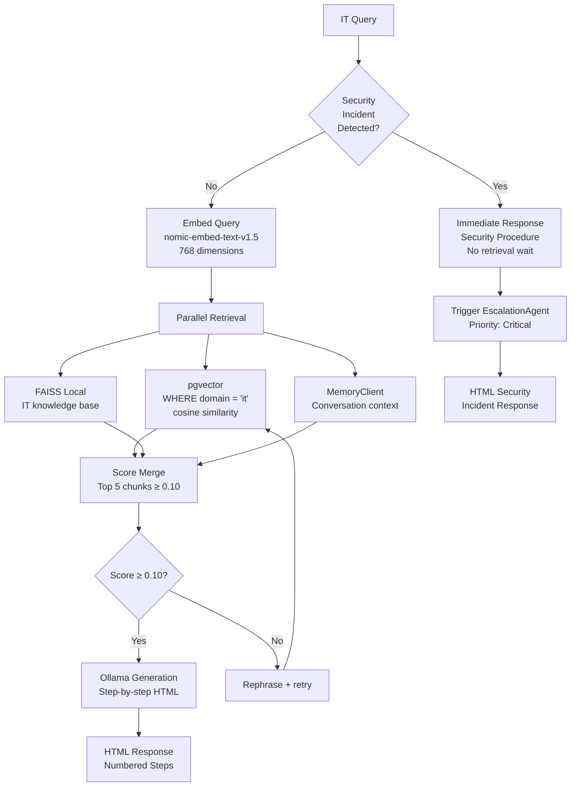
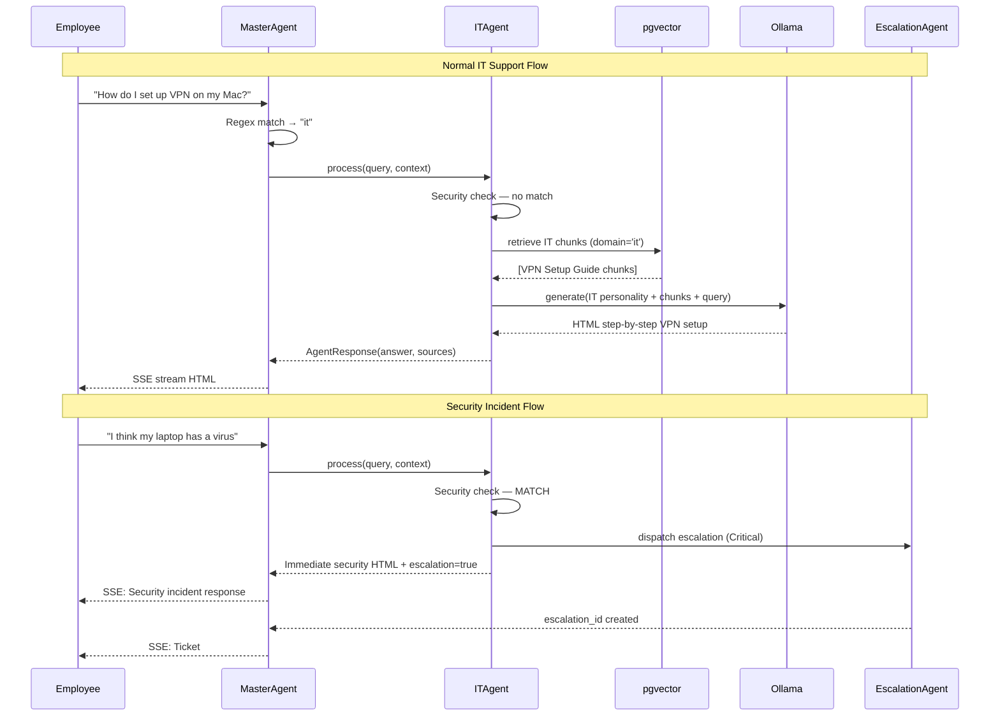

# IT Agent Specification
# AA-Hackathon Enterprise AI Platform — Aligned Automation
# Document Version: 1.0 | Last Updated: 2026-06-07
# Source File: apps/api-gateway/app/agents/working/it_agent.py

---

## 1. Overview

The ITAgent is the technical support agent on the AA-Hackathon platform. It handles all
queries related to IT infrastructure, access management, troubleshooting, security incidents,
software, hardware, and IT policies. The ITAgent is precise, methodical, and security-conscious.

The ITAgent provides step-by-step instructions for common IT tasks and escalates security
incidents immediately without waiting for LLM generation. It is designed to handle both
everyday IT support questions and urgent security scenarios with equal proficiency.

---

## 2. Agent Identity

| Property | Value |
|----------|-------|
| Registry Key | `it` |
| Class | `ITAgent` |
| Base Class | `BaseDeepAgent` |
| Source File | `apps/api-gateway/app/agents/working/it_agent.py` |
| Personality File | `apps/api-gateway/app/agents/working/personalities.py` |
| Fallback Email | `it.support@alignedautomation.com` |
| Owner | IT Support Team |

---

## 3. Personality and Tone

The ITAgent personality from `personalities.py` defines:

- **Technical and precise**: Uses correct technical terminology without being condescending
- **Step-by-step oriented**: Breaks every procedure into numbered, actionable steps
- **Security-conscious**: Proactively warns about security implications of actions
- **Verification-focused**: Always asks users to confirm results after each step
- **Empathetic to non-technical users**: Adjusts vocabulary based on the complexity of the query
- **Urgent when needed**: Security incidents receive terse, immediate, action-focused responses

Sample tone from personality:
> "Let me walk you through this step by step. First, let's verify the issue..."
> "IMPORTANT: This is a security concern. Please follow these steps immediately..."
> "Before we proceed, could you tell me what operating system you're using?"

The ITAgent never provides instructions that could compromise system security or bypass
corporate IT policies. Requests for privilege escalation are always escalated to the
IT support team.

---

## 4. Domain Coverage

### 4.1 Access Management

- New user account creation process (AD, Azure AD, M365)
- Access request submission and approval workflow
- Role-based access control (RBAC) explanation
- Application access requests (JIRA, Confluence, internal tools)
- VPN setup and configuration (Windows, Mac, Linux)
- Multi-factor authentication (MFA) setup and troubleshooting
- SSO (Single Sign-On) access issues
- Account lockout resolution

### 4.2 Password Management

- Password reset procedure (self-service and IT-assisted)
- Password policy requirements (complexity, expiry, history)
- Password manager usage and enrollment
- Emergency account recovery process

### 4.3 Hardware Support

- Laptop and workstation issue triage (boot failures, performance, display)
- Peripheral setup (monitors, docking stations, keyboards, mice)
- Printer configuration and troubleshooting
- Hardware request and procurement process
- Asset tracking and tagging process

### 4.4 Software and Applications

- Software installation request process
- Licensed application access and seat management
- Microsoft Office / M365 troubleshooting
- Communication tools (Teams, Slack, Zoom) setup
- Development tool setup guidance (VS Code, Git, Docker)
- Browser and plugin issues

### 4.5 Network and Connectivity

- Corporate WiFi connection and authentication
- VPN connection troubleshooting
- Remote desktop access setup
- Proxy configuration
- Network drive mapping

### 4.6 Security Incidents

- Phishing email identification and reporting
- Malware and suspicious activity response
- Data breach or exfiltration concerns
- Unauthorized access detection
- Suspicious device connection
- Lost or stolen device protocol

IT security incidents are treated as highest priority. The ITAgent bypasses normal
retrieval and immediately provides the incident response procedure, then triggers
EscalationAgent simultaneously.

---

## 5. Retrieval Pipeline



### 5.1 Security Incident Fast-Path

Before any retrieval begins, the ITAgent checks the query against a security incident
pattern set:

```python
SECURITY_PATTERNS = [
    r"phishing|suspicious email|fake email|spoofed",
    r"malware|virus|ransomware|infected",
    r"(my|the) (account|laptop|device) (is|was|been) (hacked|compromised|stolen)",
    r"data (leak|breach|exfiltration)",
    r"unauthorized (access|login|activity)",
    r"suspicious (activity|login|connection)",
    r"lost (laptop|device|phone)",
]
```

When matched, the ITAgent returns a static security response immediately while simultaneously
triggering the EscalationAgent in a background task. This ensures the employee gets immediate
guidance without waiting for LLM generation.

### 5.2 pgvector Query for IT Domain

```sql
SELECT
    content,
    source_document,
    1 - (embedding <=> $1::vector) AS relevance_score
FROM document_chunks
WHERE domain = 'it'
ORDER BY relevance_score DESC
LIMIT 5;
```

IT domain documents: IT Security Policy, VPN Setup Guide, Password Policy, Access Request
Procedure, Acceptable Use Policy, Incident Response Runbook, Software Installation Guide,
Hardware Request Process, Remote Work IT Checklist.

---

## 6. Response Format

IT responses always use numbered steps for procedural guidance:

```html
<div class="it-response">
  <p class="context">Here's how to resolve your <strong>[issue]</strong>:</p>
  <div class="steps">
    <h4>Steps to Follow</h4>
    <ol>
      <li><strong>Step 1:</strong> Navigate to [location]. Click [button].</li>
      <li><strong>Step 2:</strong> Enter your credentials when prompted.</li>
      <li><strong>Step 3:</strong> Verify the result by [check].</li>
    </ol>
  </div>
  <div class="security-note">
    <p><strong>Security Note:</strong> Never share your credentials with anyone,
    including IT support staff.</p>
  </div>
  <div class="contact-info">
    <p>Still having issues? Contact IT Support:
    <a href="mailto:it.support@alignedautomation.com">
    it.support@alignedautomation.com</a></p>
  </div>
</div>
```

Security incident responses use a distinct urgent format:

```html
<div class="it-security-alert">
  <h3 class="alert-title">SECURITY INCIDENT RESPONSE</h3>
  <p class="urgency">Take the following steps IMMEDIATELY:</p>
  <ol class="urgent-steps">
    <li>Disconnect from network (unplug ethernet / disable WiFi)</li>
    <li>Do NOT turn off the device (preserve evidence)</li>
    <li>Call IT Security: it.support@alignedautomation.com NOW</li>
    <li>Do not open any other applications until IT responds</li>
  </ol>
  <p class="ticket-note">A security incident ticket has been automatically raised
  with priority: CRITICAL</p>
</div>
```

---

## 7. Escalation Triggers

| Trigger | Action | Priority |
|---------|--------|---------|
| Security incident keywords | Immediate static response + EscalationAgent | Critical |
| Privilege escalation request | Block + EscalationAgent | High |
| Admin access request | IT team review required | High |
| Data access policy query (sensitive systems) | Legal / Compliance review | High |
| Three failed troubleshooting attempts | Human IT engineer handoff | Medium |
| Hardware theft/loss | Security + HR + IT escalation | Critical |

---

## 8. IT Agent Flow Diagram



---

## 9. Integration Points

| Target | Trigger | Method |
|--------|---------|--------|
| EscalationAgent | Security incidents, privilege requests | escalation_triggered=True |
| EmailAgent | "Draft an IT request email" | MasterAgent re-dispatch |
| MSFormsAgent | "Submit IT access request form" | MasterAgent re-dispatch |
| Admin portal | Hardware requests, software procurement | Deep link in response |

---

## 10. Known Limitations

| Limitation | Impact | Workaround |
|-----------|--------|-----------|
| No ServiceNow integration | Cannot create real IT tickets | Manual ticket creation instructions |
| No AD/Azure AD query | Cannot check actual account status | Direct to IT support |
| No network access | Cannot ping endpoints or check VPN | Provide manual diagnostic steps |
| Static IT documentation | May not reflect latest tool versions | IT team monthly doc refresh |
| No remote session capability | Cannot directly fix issues | Step-by-step self-service only |

---

## 11. KPIs and SLAs

| Metric | Target | Measurement |
|--------|--------|-------------|
| End-to-end response time | < 4 seconds P95 | SSE timing logs |
| Security incident response time | < 500ms (fast-path) | Security pattern match timing |
| Step-by-step accuracy | > 90% | IT team monthly audit |
| Escalation false-positive | < 5% | IT manager review |
| Self-service resolution rate | > 60% | Follow-up survey |
| User satisfaction rating | > 70% positive | In-chat thumbs rating |

---

## 12. Future Enhancements

### 12.1 ServiceNow Integration (Q3 2026)
REST API integration with ServiceNow to:
- Automatically create ITSM tickets from chat sessions
- Check ticket status in-chat
- Route to assigned technician in real-time

### 12.2 Azure AD Graph API Integration (Q4 2026)
Microsoft Graph API integration to:
- Check real-time account status
- Initiate password reset via chat
- View assigned licenses and app access

### 12.3 Automated Diagnostics (Q4 2026)
Browser-based diagnostics agent (using browser extension or local agent) to:
- Check network connectivity
- Validate VPN status
- Report system information to IT support

### 12.4 Vulnerability Knowledge Base (Q3 2026)
Integration with CVE feeds and security bulletins to provide real-time security advisories
relevant to software the organization uses.

---

## 13. Document Sources

IT domain documents stored in `document_chunks` with `domain='it'`:

1. IT Security Policy (current version)
2. Acceptable Use Policy
3. VPN Setup Guide (Windows + Mac + Linux)
4. Password Policy and Complexity Requirements
5. Access Request Procedure
6. Software Installation and Approval Process
7. Hardware Request and Procurement Guide
8. Incident Response Runbook (sanitized for employee use)
9. Remote Work IT Checklist
10. Microsoft 365 User Guide
11. Data Classification and Handling Policy
12. BYOD (Bring Your Own Device) Policy
