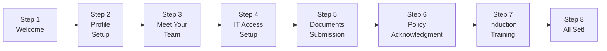
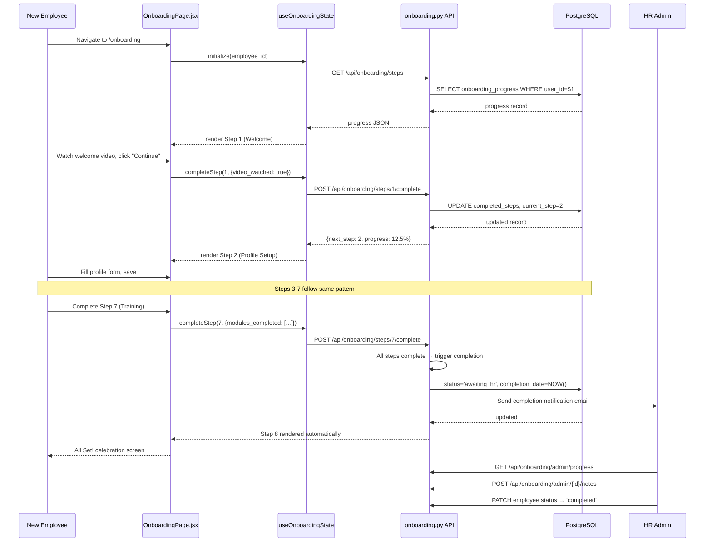

# Onboarding Module Specification
# AA-Hackathon Enterprise AI Platform — Aligned Automation
# Document Version: 1.0 | Last Updated: 2026-06-07
# Source Files: backend/controllers/onboarding.py
#               frontend/src/pages/OnboardingPage.jsx
#               frontend/src/hooks/useOnboardingState.js

---

## 1. Overview

The Onboarding Module is a structured, 8-step guided workflow that takes a new employee
from their first day at Aligned Automation through all setup, policy acknowledgment, and
team integration tasks. Unlike the chat-based agents, the Onboarding Module is a dedicated
page-based UI experience with a step navigator, checklist panels, and HR oversight tools.

The module is NOT an AI agent — it does not use Ollama or retrieval. It is a stateful
workflow controller backed by a PostgreSQL state table and a React frontend. The HRAgent
references the Onboarding Module and can deep-link to it when employees ask onboarding
questions.

---

## 2. Module Identity

| Property | Value |
|----------|-------|
| Module Name | OnboardingModule |
| Backend | `backend/controllers/onboarding.py` |
| Frontend Page | `frontend/src/pages/OnboardingPage.jsx` |
| State Hook | `frontend/src/hooks/useOnboardingState.js` |
| Database Table | `onboarding_progress` (PostgreSQL, db=squadrons) |
| Owner | HR Operations Team |
| Access | New employee (all steps), HR Admin (oversight + notes) |
| Route | `/onboarding` |

---

## 3. The 8-Step Onboarding Process



### Step Details

| Step | Name | Description | Completion Criteria |
|------|------|-------------|-------------------|
| 1 | Welcome | Welcome message, platform intro video, office map | Video watched OR 30s on step |
| 2 | Profile Setup | Fill profile: photo, bio, skills, LinkedIn, emergency contact | All required fields saved |
| 3 | Meet Your Team | View team org chart, read team intro, schedule 1:1 with manager | 1:1 meeting link clicked |
| 4 | IT Access Setup | Checklist: email, VPN, M365, JIRA, Slack | All checklist items marked |
| 5 | Documents Submission | Upload signed offer letter, ID proof, address proof, PAN, bank details | All docs uploaded |
| 6 | Policy Acknowledgment | Read and sign: Code of Conduct, POSH, IT Policy, Leave Policy | All 4 policies signed |
| 7 | Induction Training | Complete assigned training modules (3-5 modules) | All modules marked complete |
| 8 | All Set! | Completion celebration, HR intro email sent, buddy assigned | Auto-complete on reaching step |

---

## 4. Frontend Components

The `OnboardingPage.jsx` is composed of 9 sub-components:

### 4.1 WelcomeHeader

Displayed at the top of every step. Shows:
- Employee's first name (from JWT)
- Current step number and name
- Days since joining
- A contextual welcome message that changes per step

```jsx
<WelcomeHeader
    employeeName="Priya"
    currentStep={2}
    totalSteps={8}
    daysSinceJoining={1}
    stepName="Profile Setup"
/>
```

### 4.2 OnboardingSteps

The main content area for each step. Renders the step-specific content (video player for
step 1, form for step 2, org chart for step 3, checklists for step 4, etc.). Content is
defined in the `STEP_CONTENT` configuration object.

### 4.3 StepNavigator

Left-side vertical stepper showing all 8 steps with status indicators:
- Completed (green check)
- Current (blue ring)
- Upcoming (grey)
- Blocked (lock icon — step cannot be accessed until previous step is complete)

Steps are sequential — the employee cannot skip ahead. The StepNavigator enforces this
by only allowing clicks on completed or current steps.

### 4.4 ChecklistPanel

Used in steps 4 (IT Access) and 6 (Policy Acknowledgment). Each checklist item has:
- Description of the task
- Status (pending / in-progress / complete)
- Optional deep-link (e.g., "Set up VPN" links to IT docs)
- Completion timestamp

```jsx
<ChecklistPanel
    items={ITAccessChecklist}
    onItemComplete={(itemId) => markChecklistItem(itemId)}
/>
```

### 4.5 DocumentPanel

Used in step 5. Displays required documents with:
- Document name and description
- Upload button (accepts PDF, JPG, PNG up to 10MB)
- Upload status (pending / uploaded / verified by HR)
- HR verification badge when reviewed

### 4.6 TimelinePanel

Displayed on step 8 (All Set). Shows a timeline of all completed onboarding events
with timestamps, celebrating the employee's journey from offer acceptance to full setup.

### 4.7 TrainingGrid

Used in step 7. Displays assigned training modules as cards:
- Module title and description
- Duration estimate
- Status (not started / in-progress / completed)
- External LMS link (company's learning management system)
- Completion certificate download when done

### 4.8 HRNotes

Visible ONLY to HR Admin users. A sticky notes panel on the right side of the screen
where HR can:
- Add private notes about the employee's onboarding progress
- Flag items needing follow-up
- Record verbal confirmations (e.g., "Manager confirmed 1:1 was held")
- Log any issues or special circumstances

Notes are stored in `onboarding_hr_notes` table, never visible to the employee.

### 4.9 StatusBadge

A header badge showing the employee's current onboarding status:
- `In Progress` (blue) — actively working through steps
- `Awaiting HR` (orange) — employee done, HR review pending
- `Completed` (green) — all steps done, HR approved
- `Overdue` (red) — steps not completed within expected timeframe

---

## 5. State Management — useOnboardingState.js

The `useOnboardingState` custom React hook manages all frontend state:

```javascript
const useOnboardingState = (employeeId) => {
    const [progress, setProgress] = useState(null);
    const [currentStep, setCurrentStep] = useState(1);
    const [stepData, setStepData] = useState({});
    const [isLoading, setIsLoading] = useState(true);
    const [error, setError] = useState(null);

    // Fetch initial state from API
    useEffect(() => {
        fetchOnboardingProgress(employeeId);
    }, [employeeId]);

    // Computed properties
    const completedSteps = progress?.completed_steps || [];
    const overallProgress = (completedSteps.length / 8) * 100;
    const isStepAccessible = (step) => step <= currentStep;
    const isStepComplete = (step) => completedSteps.includes(step);

    // Actions
    const completeStep = async (stepNumber, stepData) => { ... };
    const saveStepProgress = async (stepNumber, partialData) => { ... };
    const markChecklistItem = async (stepNumber, itemId) => { ... };
    const uploadDocument = async (stepNumber, docType, file) => { ... };
    const signPolicy = async (stepNumber, policyId) => { ... };

    return {
        progress, currentStep, stepData, isLoading, error,
        completedSteps, overallProgress, isStepAccessible, isStepComplete,
        completeStep, saveStepProgress, markChecklistItem, uploadDocument, signPolicy,
    };
};
```

---

## 6. Database Schema

```sql
CREATE TABLE onboarding_progress (
    id                  SERIAL PRIMARY KEY,
    user_id             VARCHAR(50) UNIQUE NOT NULL,
    employee_name       VARCHAR(255),
    date_of_joining     DATE,
    current_step        SMALLINT DEFAULT 1,
    completed_steps     SMALLINT[] DEFAULT '{}',
    step_data           JSONB DEFAULT '{}',  -- stores form data, checklist states, etc.
    status              VARCHAR(20) DEFAULT 'in_progress',
    completion_date     TIMESTAMP,
    target_completion   DATE,  -- typically DOJ + 5 business days
    is_overdue          BOOLEAN DEFAULT FALSE,
    created_at          TIMESTAMP DEFAULT NOW(),
    updated_at          TIMESTAMP DEFAULT NOW()
);

CREATE TABLE onboarding_documents (
    id              SERIAL PRIMARY KEY,
    user_id         VARCHAR(50) NOT NULL,
    doc_type        VARCHAR(50) NOT NULL,
    file_name       VARCHAR(255),
    file_url        VARCHAR(500),
    upload_status   VARCHAR(20) DEFAULT 'uploaded',  -- uploaded / verified / rejected
    verified_by     VARCHAR(100),
    verified_at     TIMESTAMP,
    uploaded_at     TIMESTAMP DEFAULT NOW()
);

CREATE TABLE onboarding_hr_notes (
    id              SERIAL PRIMARY KEY,
    user_id         VARCHAR(50) NOT NULL,
    hr_user_id      VARCHAR(50) NOT NULL,
    note            TEXT NOT NULL,
    note_type       VARCHAR(20) DEFAULT 'general',  -- general / issue / follow_up
    created_at      TIMESTAMP DEFAULT NOW()
);

CREATE INDEX idx_onboarding_user_id ON onboarding_progress(user_id);
CREATE INDEX idx_onboarding_status ON onboarding_progress(status);
CREATE INDEX idx_onboarding_overdue ON onboarding_progress(is_overdue);
```

---

## 7. API Endpoints

### 7.1 Get Onboarding Progress

```
GET /api/onboarding/steps
Authorization: Bearer <jwt>

Response 200:
{
    "user_id": "emp_789",
    "current_step": 3,
    "completed_steps": [1, 2],
    "overall_progress": 25.0,
    "status": "in_progress",
    "target_completion": "2026-06-14",
    "is_overdue": false,
    "steps": [
        {
            "step_number": 1,
            "name": "Welcome",
            "status": "completed",
            "completed_at": "2026-06-07T09:15:00Z"
        },
        ...
    ]
}
```

### 7.2 Complete a Step

```
POST /api/onboarding/steps/{step_number}/complete
Authorization: Bearer <jwt>
Content-Type: application/json

Request:
{
    "step_data": {
        "video_watched": true,
        "acknowledgment": "I have read and understood the welcome information"
    }
}

Response 200:
{
    "step_number": 1,
    "status": "completed",
    "next_step": 2,
    "overall_progress": 12.5
}
```

### 7.3 Upload Onboarding Document

```
POST /api/onboarding/documents
Authorization: Bearer <jwt>
Content-Type: multipart/form-data

Form fields:
- doc_type: "pan_card" | "address_proof" | "offer_letter_signed" | "bank_details" | "id_proof"
- file: [binary]

Response 201:
{
    "doc_id": "ondoc_abc123",
    "doc_type": "pan_card",
    "upload_status": "uploaded",
    "message": "Document uploaded. HR will verify within 24 hours."
}
```

### 7.4 HR Admin — Get All Progress

```
GET /api/onboarding/admin/progress?status=in_progress&overdue=true
Authorization: Bearer <jwt> (hr_admin role required)

Returns list of all employees with onboarding progress summary.
```

### 7.5 HR Admin — Add Note

```
POST /api/onboarding/admin/{user_id}/notes
Authorization: Bearer <jwt> (hr_admin role required)

Request: { "note": "Called employee, confirmed Step 4 IT access issues resolved", "note_type": "follow_up" }
```

---

## 8. Onboarding Flow Diagram



---

## 9. Progress Tracking

### 9.1 Overdue Detection

A background job (APScheduler, runs daily at 09:00) checks for overdue onboarding:

```python
async def check_overdue_onboarding():
    overdue = await db.query("""
        SELECT user_id, employee_name, current_step, target_completion
        FROM onboarding_progress
        WHERE status = 'in_progress'
        AND target_completion < CURRENT_DATE
        AND is_overdue = FALSE
    """)
    for record in overdue:
        await db.execute(
            "UPDATE onboarding_progress SET is_overdue = TRUE WHERE user_id = $1",
            record.user_id
        )
        await notify_hr_overdue(record)
        await notify_employee_overdue(record)
```

### 9.2 Completion Notification to HR

When an employee completes all 8 steps:

```python
async def send_completion_notification(user_id: str, context: dict):
    await email_service.send(
        to="hr@alignedautomation.com",
        subject=f"Onboarding Complete — {context['employee_name']}",
        body=render_completion_email_template(context),
    )
    await platform_notification.push(
        user_id="hr_team",
        message=f"{context['employee_name']} has completed onboarding!",
        link=f"/onboarding/admin/{user_id}",
    )
```

### 9.3 Employee Progress Email

At the end of each business day, employees who have not yet completed onboarding receive
a progress summary email showing completed steps, remaining steps, and target date.

---

## 10. HR Notes Integration

The HRNotes component is a critical oversight tool for the HR team:

- Displayed as a collapsible right-side panel on the admin view
- Real-time updates (polling every 30 seconds)
- Color-coded by note type: grey (general), orange (follow_up), red (issue)
- HR notes can trigger status changes (e.g., "Blocked on IT access" note → auto-flag step 4)
- Export all notes to PDF for compliance records

---

## 11. Policy Acknowledgment (Step 6)

Step 6 requires the employee to digitally acknowledge four policies:

| Policy | Document | Acknowledgment Type |
|--------|----------|-------------------|
| Code of Conduct | CoC_2025.pdf | Checkbox + digital signature |
| POSH Policy | POSH_Policy_2025.pdf | Checkbox + digital signature |
| IT Acceptable Use Policy | IT_AUP_2025.pdf | Checkbox + digital signature |
| Leave Policy | Leave_Policy_2025.pdf | Checkbox (no signature required) |

Digital signatures are captured as:
- Employee name typed into a field (typed-signature format)
- Timestamp and IP address recorded
- Stored in `onboarding_progress.step_data` JSONB field

---

## 12. KPIs and SLAs

| Metric | Target | Measurement |
|--------|--------|-------------|
| Avg onboarding completion time | < 5 business days | completion_date - date_of_joining |
| Overdue rate | < 10% of new joiners | is_overdue count / total |
| Step abandonment rate | < 5% per step | steps with progress but not completed |
| HR review turnaround | < 24 hours for doc verification | verified_at - uploaded_at |
| Page load time | < 2 seconds | Frontend performance monitoring |
| Employee satisfaction with onboarding | > 80% positive | Post-onboarding survey |

---

## 13. Known Limitations

| Limitation | Impact | Workaround |
|-----------|--------|-----------|
| No HRMS integration | Manual profile cross-check | HR reviews uploaded docs |
| No LMS integration | Training completion self-reported | HR verifies with LMS admin |
| In-page document upload (no virus scan) | Security risk on uploads | Server-side file type validation |
| Sequential step enforcement | May frustrate employees with partial info | HR can unlock steps manually |
| No mobile-optimized view | Poor experience on phones | Responsive design in progress |

---

## 14. Future Enhancements

### 14.1 LMS API Integration (Q3 2026)
Pull training completion data directly from the company LMS (e.g., Cornerstone, Moodle)
via REST API instead of relying on self-reporting in Step 7.

### 14.2 HRMS Profile Sync (Q4 2026)
Pre-populate the profile setup step from HRMS data, reducing manual entry.
Changes in the onboarding form sync back to HRMS.

### 14.3 Buddy System (Q3 2026)
Auto-assign an onboarding buddy (senior employee in same department) at step 3.
The buddy receives a notification and a checklist of things to cover with the new joiner.

### 14.4 Digital Signature Integration (Q4 2026)
Replace typed-signature acknowledgment with DocuSign or Adobe Sign digital signatures
for legally binding policy acknowledgment records.

### 14.5 Onboarding Analytics for HR (Q3 2026)
Add onboarding-specific analytics to the HR admin view:
- Average time per step by department
- Most common drop-off steps
- Policy acknowledgment completion rates
- Document upload compliance rates
