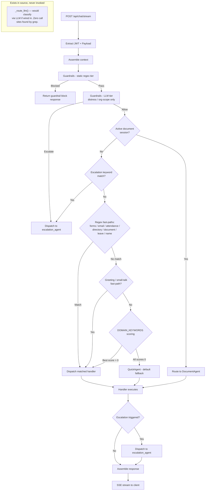

# Orchestrator Agent Specification — MasterAgent
# AURA (AA-Hackathon Enterprise Assistant) — Aligned Automation
# Document Version: 2.0 — Corrected against live codebase | Last Updated: 2026-07-02
# Source File: apps/api-gateway/app/agents/supervisor_agent.py

> **Accuracy note:** This document was rewritten after a code audit found fabrications in the previous
> version — a fictional "3-tier" router with a working LLM-classification step, a fixed 13-agent
> registry of uniform singleton objects, `backend/agents/...` file paths that don't exist in this
> repository, and an Ollama-only LLM claim. See `04-agents/agent-framework.md` and `README.md` for the
> platform-wide corrected facts this document is built on.

---

## 1. Overview

The MasterAgent is the single entry point for chat queries on AURA. It classifies incoming requests,
selects a handler, assembles context, dispatches, and streams the response back to the client via
Server-Sent Events (SSE).

The MasterAgent itself has no personality and generates no answer text — it is purely orchestration.
Answer generation is delegated to whichever handler it dispatches to. Not every handler is a
retrieval-and-LLM agent, though: some are plain classes (DocumentAgent, AllocationAgent, MSFormsAgent)
and some are plain functions wrapped in small adapter objects purely so the dispatch code can call them
uniformly (employee_agent, attendance_agent, escalation_agent, the email-draft function, license_agent).
See `04-agents/agent-framework.md` Section 2 for the full breakdown.

---

## 2. Module Location and Instantiation

```
File:     apps/api-gateway/app/agents/supervisor_agent.py
Class:    MasterAgent
Pattern:  Singleton (one instance per FastAPI worker process)
Init:     Instantiated at application startup
```

At startup, the MasterAgent constructs the `BaseDeepAgent` subclasses (HRAgent, ITAgent, AdminAgent,
FinanceAgent, PMOAgent, OrgDeepAgent), the lightweight agents (FunnyAgent, QuickAgent), the plain
classes (DocumentAgent, AllocationAgent, MSFormsAgent), and wraps the plain functions
(employee_agent, attendance_agent, escalation_agent, the email-draft function, license_agent) in
adapter objects. This is done once so embedding clients, local knowledge-base indices, and database
connection pools are initialized once and reused across requests. There is no `GeneralAgent` class —
the catch-all role is filled by `QuickAgent`.

---

## 3. Routing — Real Behavior (Not a Clean 3-Tier Design)

The previous version of this document described a clean regex → LLM → keyword three-tier router. That
does not match `_route()` in `supervisor_agent.py`. The real evaluation order is:

1. **Active document-generation session check** — if the user already has an in-progress multi-turn
   document session, the query routes straight back to `DocumentAgent`, bypassing everything below.
2. **Escalation keyword check.**
3. **Regex fast-paths**, evaluated in sequence: Microsoft Forms intent, email-draft intent, attendance
   query, employee-directory query, document-request query — plus apply-leave and name-query regexes
   that are actually checked even earlier in the pipeline.
4. **Greeting / small-talk fast-path.**
5. **Keyword-scoring fallback** against a `DOMAIN_KEYWORDS` dictionary. If every domain scores zero,
   the query defaults to `QuickAgent`.

A `_route_llm()` method exists in the same file and would do LLM-based intent classification — but
grep confirms it is **never called from anywhere**. It is dead code, not a feature behind a flag. There
is no functioning LLM classification step in the live routing path today.



There are **two live routing tiers** (regex fast-paths, then keyword scoring), not three, and no
working LLM-based classification step in the current build.

---

## 4. Guardrails (`apps/api-gateway/app/agents/guardrails.py`)

A single `check_input()` function evaluates, in order:

1. Jailbreak regex → static, immediate block.
2. Harmful-content regex → static, immediate block.
3. Security-threat regex → static, immediate block.
4. Distress signals → LLM-generated empathetic response.
5. Org-scope violations (another employee's salary/PII, legal advice, competitor intelligence, medical
   diagnosis) → LLM-generated contextual redirect.

This is two tiers: a static regex tier (1–3) and an LLM-contextual tier used only for distress and
org-scope handling (4–5) — not a three-way allow/escalate/block classifier on every message.

---

## 5. Dispatch and the Deep-Retrieval Pipeline

For the six `BaseDeepAgent` subclasses (HR, IT, Admin, Finance, PMO, OrgDeepAgent), dispatch triggers a
**sequential/conditional** pipeline, not a parallel fan-out:

1. Embed the query and search pgvector (primary source, via `apps/api-gateway/app/rag/retriever.py`).
2. **Only if pgvector returns nothing**, fall back to the agent's own local FAISS/keyword knowledge
   base (`agents/working/knowledge_base.py`), built from local per-domain document folders — a smaller,
   different corpus from pgvector, not a mirror of it.
3. A single LLM call via an LCEL chain (`prompt | llm | StrOutputParser`) with guardrail text injected
   into the system prompt, self-verification instructions, and an inline citation request.
4. Tavily web search as an optional further supplement, only when configured.

There is no `asyncio.gather` across pgvector + FAISS + conversation memory + Tavily run
simultaneously. For non-`BaseDeepAgent` handlers (DocumentAgent, AllocationAgent, MSFormsAgent, and the
function-based agents), this pipeline does not apply at all — each has its own, much simpler logic
(e.g. MSFormsAgent is a pure REST client with no LLM call whatsoever).

---

## 6. LLM Provider Selection (Not Ollama-Only)

`apps/api-gateway/app/agents/working/config.py`'s `create_llm()` selects the active provider at
startup, in priority order:

1. **Claude** (Anthropic), if `USE_Claude_API_Key` is set — default model `claude-sonnet-4-6`.
2. **Groq**, if `USE_Groq_API_Key` is set — default model `llama3-70b-8192`.
3. **Ollama** — the default/fallback when neither cloud flag is on. Model `gpt-oss` at
   `ml01.alignedautomation.com:11434`.

This is genuinely configurable, multi-provider infrastructure — describing the platform as
"self-hosted-LLM-only" describes one possible configuration, not an architectural constraint enforced
in code.

---

## 7. SSE Streaming Flow

The `/api/chat/stream` endpoint uses FastAPI's `StreamingResponse` with `text/event-stream` content
type. Illustrative event shape:

```
event: start
data: {"agent": "hr", "session_id": "abc123"}

event: chunk
data: {"content": "<p>Based on the HR policy...</p>"}

event: sources
data: {"sources": ["HR Leave Policy 2025.pdf", "Employee Handbook v3.pdf"]}

event: end
data: {"latency_ms": 2340}
```

The frontend `ChatWindow.jsx` consumes this stream and progressively renders content into the chat
bubble.

---

## 8. Error Handling

| Error Condition | Behavior | Fallback |
|----------------|---------|---------|
| Handler timeout | MasterAgent catches the timeout | QuickAgent with generic response |
| Handler raises exception | Logged with stack trace | QuickAgent with "something went wrong" |
| Retrieval fails (pgvector unreachable) | Falls through to local knowledge base | Generic answer if that also fails |
| LLM provider unreachable | Connection error caught | Static error message |
| JWT decode failure | 401 Unauthorized before routing | No handler dispatched |
| Guardrail block | Immediate return, no handler dispatched | Static block message |
| Unknown/unmatched intent | Falls through keyword scoring | QuickAgent |

`QuickAgent` is the last-resort fallback used both when routing finds no domain match and when a
handler fails unexpectedly.

---

## 9. Monitoring and Observability

There is no OpenTelemetry instrumentation or Prometheus/Grafana dashboard wired into the MasterAgent
today (see `09-roadmap/technical-debt.md`). Structured request logging exists at a basic level via
Python's standard logging; there is no distributed tracing across MasterAgent → handler → pgvector/LLM
calls.

---

## 10. Configuration Reference

| Parameter | Value / Location |
|-----------|-------------------|
| LLM provider priority | Claude > Groq > Ollama, selected by `USE_Claude_API_Key` / `USE_Groq_API_Key` / `Use_Ollama_LLM` in `agents/working/config.py` |
| Ollama base URL / model | `ml01.alignedautomation.com:11434` / `gpt-oss` |
| Claude model | `claude-sonnet-4-6` (default) |
| Groq model | `llama3-70b-8192` (default) |
| Embedding model | `nomic-embed-text-v1.5`, 768 dimensions |
| pgvector distance | cosine (`<=>`), `ivfflat` index, `probes = 10` |
| Chunking | 1000 characters / 200 overlap, section-aware pre-split + `RecursiveCharacterTextSplitter` |
| `_route_llm()` | Defined in `supervisor_agent.py`, **never called** — dead code |

See `04-agents/agent-framework.md` for the full agent roster and file map, and `README.md` for the
platform-wide technology stack table.
