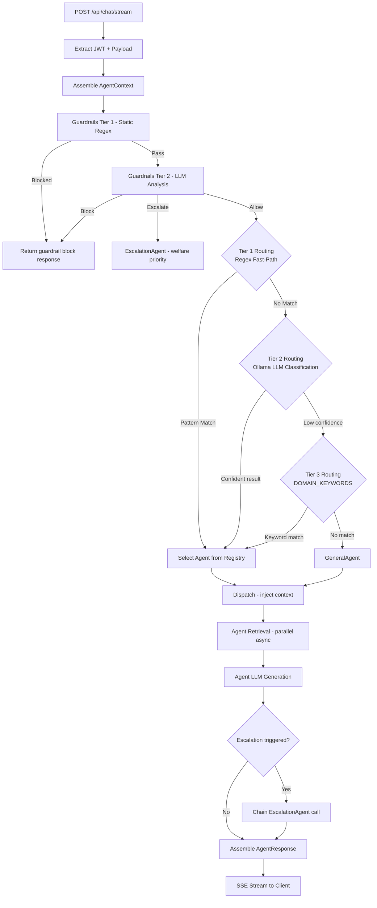
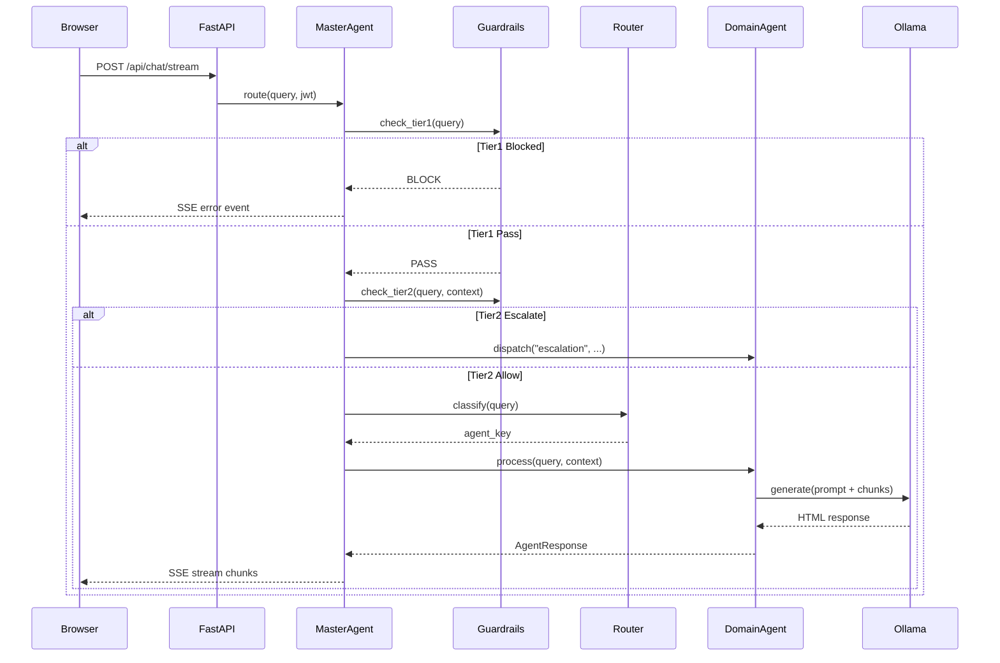

# Orchestrator Agent Specification — MasterAgent
# AA-Hackathon Enterprise AI Platform — Aligned Automation
# Document Version: 1.0 | Last Updated: 2026-06-07
# Source File: backend/agents/supervisor_agent.py

---

## 1. Overview

The MasterAgent is the single entry point for all user queries on the AA-Hackathon platform.
It acts as an intelligent orchestrator that classifies incoming requests, selects the most
appropriate specialized agent, assembles context, and streams the response back to the client
via Server-Sent Events (SSE).

The MasterAgent is not a user-facing agent — it has no personality and produces no answer text
of its own. It is purely an orchestration layer. All answer generation is delegated to the
thirteen registered domain agents.

---

## 2. Module Location and Instantiation

```
File:     backend/agents/supervisor_agent.py
Class:    MasterAgent
Pattern:  Singleton (one instance per FastAPI worker process)
Init:     Called at application startup via lifespan event
```

At startup, the MasterAgent instantiates all thirteen domain agents and stores them in the
`_AGENT_REGISTRY` dictionary. This ensures that embedding models, FAISS indices, and pgvector
connection pools are initialized once and reused across all requests.

---

## 3. Agent Registry

```python
_AGENT_REGISTRY: dict[str, BaseAgent] = {
    "hr":         HRAgent(),
    "it":         ITAgent(),
    "admin":      AdminAgent(),
    "pmo":        PMOAgent(),
    "finance":    FinanceAgent(),
    "org":        OrgAgent(),
    "document":   DocumentAgent(),
    "escalation": EscalationAgent(),
    "email":      EmailAgent(),
    "msforms":    MSFormsAgent(),
    "funny":      FunnyAgent(),
    "quick":      QuickAgent(),
    "general":    GeneralAgent(),
}
```

The registry is immutable after startup. Adding a new agent requires a server restart.
All keys are lowercase, single-word identifiers matching the `DOMAIN` class attribute of
each agent class.

---

## 4. Request Processing — Step by Step



---

## 5. Tier 1 — Regex Fast-Path Rules

Regex patterns are evaluated in order against the lowercased query string. First match wins.
All patterns are compiled at module load time for performance.

```python
FAST_PATH_RULES: list[tuple[re.Pattern, str]] = [
    # Document generation — highest specificity first
    (re.compile(r"(generate|create|request|need|want).{0,30}(letter|certificate|noc|id card|offer letter|experience letter|relieving|bonafide|promotion|internship|confirmation|address proof|loan proof)"), "document"),
    (re.compile(r"(letter|certificate)\s+(request|needed|required)"), "document"),

    # Email composition
    (re.compile(r"(draft|write|compose|create|help me write).{0,20}(email|mail|message to)"), "email"),
    (re.compile(r"(email).{0,10}(draft|template|format)"), "email"),

    # IT access and security
    (re.compile(r"(vpn|password reset|forgot password|access request|account locked|mfa|2fa|two.factor)"), "it"),
    (re.compile(r"(laptop|computer|hardware|software install|application access|azure ad|active directory)"), "it"),
    (re.compile(r"(security incident|phishing|malware|breach|suspicious email|hacked)"), "it"),

    # HR leave and benefits
    (re.compile(r"(apply.{0,10}leave|leave balance|pto|vacation days|sick leave|maternity|paternity|comp off)"), "hr"),
    (re.compile(r"(payslip|salary slip|ctc|compensation|benefits|medical insurance|pf|provident fund|gratuity)"), "hr"),
    (re.compile(r"(holiday list|public holiday|work from home policy|wfh policy|notice period|exit process)"), "hr"),

    # Admin / facilities
    (re.compile(r"(cab|taxi|transport|travel request|flight|hotel booking|business travel)"), "admin"),
    (re.compile(r"(parking|visitor pass|access card|pantry|cafeteria|stationery|office supplies)"), "admin"),
    (re.compile(r"(facilities|office maintenance|air conditioning|seating|desk allocation)"), "admin"),

    # PMO / project
    (re.compile(r"(project allocation|resource allocation|sprint|milestone|project status|timesheet)"), "pmo"),
    (re.compile(r"(allocation board|bench|billable|shadow resource|project assignment)"), "pmo"),

    # Finance / reimbursement
    (re.compile(r"(reimbursement|expense claim|invoice|purchase order|vendor payment|budget approval)"), "finance"),

    # Org chart / people
    (re.compile(r"(who is|org chart|team structure|reporting to|head of|department head|ceo|cto|coo)"), "org"),

    # Forms
    (re.compile(r"(fill.{0,10}form|submit.{0,10}form|ms forms|microsoft form|request form)"), "msforms"),

    # Escalation — explicit
    (re.compile(r"(escalate|raise.{0,10}ticket|need human|speak to hr|speak to it|this is urgent|formal complaint)"), "escalation"),

    # Entertainment
    (re.compile(r"^(tell me a joke|make me laugh|something funny|entertain me|joke)"), "funny"),
]
```

Regex matching runs in under 1ms for all patterns combined on modern hardware.

---

## 6. Tier 2 — LLM Routing Prompt

When no regex pattern matches, the MasterAgent constructs a classification prompt and submits
it to Ollama using the same `gpt-oss` model at temperature=0.1:

```python
ROUTING_PROMPT_TEMPLATE = """
You are an AI query router for an enterprise HR and IT platform.
Given an employee query, determine which agent should handle it.

Available agents:
- hr: Leave management, payroll, benefits, HR policies, employee support
- it: IT access, VPN, passwords, hardware, software, security incidents
- admin: Travel, cab booking, parking, facilities, office admin tasks
- pmo: Project allocation, resource planning, timesheets, sprint tracking
- finance: Expense claims, reimbursements, invoices, budget queries
- org: Org chart questions, team structure, who reports to whom
- document: Generating HR documents like letters, certificates, NOC
- email: Drafting professional emails
- msforms: Submitting Microsoft Forms requests
- escalation: Formal complaints, urgent issues, welfare concerns
- funny: Jokes and entertainment
- general: Any other query not fitting above categories

Employee query: "{query}"

Respond with ONLY the agent key (one word, lowercase). No explanation.
"""
```

The response is validated against the registry keys. If the response is not a valid key or
is empty, routing falls through to Tier 3.

Tier 2 adds approximately 150-300ms to routing latency. This is acceptable because it only
activates for queries that did not match any fast-path regex.

---

## 7. Tier 3 — DOMAIN_KEYWORDS Fallback

```python
DOMAIN_KEYWORDS: dict[str, list[str]] = {
    "hr": [
        "leave", "pto", "vacation", "salary", "payroll", "payslip",
        "benefits", "insurance", "policy", "holiday", "appraisal",
        "performance", "kra", "kpi", "exit", "notice", "resignation",
        "maternity", "paternity", "gratuity", "pf", "esic", "bonus"
    ],
    "it": [
        "laptop", "computer", "software", "vpn", "access", "password",
        "email", "azure", "security", "antivirus", "firewall", "network",
        "wifi", "printer", "monitor", "keyboard", "mfa", "sso",
        "active directory", "ticket", "helpdesk", "it support"
    ],
    "admin": [
        "cab", "taxi", "travel", "flight", "hotel", "parking",
        "visitor", "facilities", "stationery", "pantry", "cafeteria",
        "maintenance", "housekeeping", "access card", "id card"
    ],
    "pmo": [
        "project", "sprint", "milestone", "allocation", "resource",
        "timesheet", "delivery", "client", "engagement", "bench",
        "billable", "utilization", "deadline", "jira", "confluence"
    ],
    "finance": [
        "reimbursement", "expense", "invoice", "budget", "payment",
        "purchase", "vendor", "petty cash", "advance", "receipt"
    ],
    "org": [
        "org chart", "team", "structure", "hierarchy", "reports to",
        "head of", "department", "division", "practice", "bu"
    ],
    "funny": [
        "joke", "funny", "laugh", "humor", "entertain", "fun",
        "amusing", "hilarious", "bored"
    ],
    "general": [
        "help", "what can you do", "capabilities", "features", "how to use"
    ],
}
```

Keyword matching uses simple `in` substring check against the lowercased query. The first
domain with any keyword match is selected. `"general"` is always the last resort.

---

## 8. Context Assembly

Before dispatching to any agent, the MasterAgent assembles the `AgentContext`:

```python
async def _build_context(self, request: ChatRequest, jwt_payload: dict) -> AgentContext:
    history = await db.get_conversation_history(
        user_id=jwt_payload["sub"],
        session_id=request.session_id,
        limit=10  # last 10 turns only, to stay within context window
    )
    return AgentContext(
        user_id=jwt_payload["sub"],
        email=jwt_payload["email"],
        role=jwt_payload.get("role", "employee"),
        department=jwt_payload.get("department", ""),
        conversation_history=history,
        session_id=request.session_id,
        request_timestamp=datetime.utcnow(),
        jwt_claims=jwt_payload,
    )
```

The conversation history (last 10 turns) is included in every agent prompt to support
follow-up questions and multi-turn workflows such as document generation.

---

## 9. SSE Streaming Flow

The `/api/chat/stream` endpoint uses FastAPI's `StreamingResponse` with `text/event-stream`
content type. The streaming protocol is:

```
event: start
data: {"agent": "hr", "session_id": "abc123"}

event: chunk
data: {"content": "<p>Based on the HR policy...</p>"}

event: chunk
data: {"content": "<p>Your leave balance is...</p>"}

event: sources
data: {"sources": ["HR Leave Policy 2025.pdf", "Employee Handbook v3.pdf"]}

event: end
data: {"latency_ms": 2340, "confidence": 0.87}
```

The frontend `ChatWindow.jsx` consumes this SSE stream and progressively renders the HTML
content into the chat bubble. The `sources` event triggers the source citation panel.

---

## 10. Error Handling

| Error Condition | Behavior | Fallback |
|----------------|---------|---------|
| Agent timeout (> 10s) | MasterAgent catches asyncio.TimeoutError | QuickAgent with generic response |
| Agent raises exception | Log to console, capture stack trace | QuickAgent with "something went wrong" |
| All retrievals fail | Agent generates from LLM context only | No sources cited |
| Ollama unreachable | HTTPConnectionError caught | Static error message HTML |
| JWT decode failure | 401 Unauthorized before routing | No agent dispatched |
| Guardrail block | Immediate return, no agent dispatched | Static block message HTML |
| Unknown agent key | Registry KeyError caught | GeneralAgent |

The `QuickAgent` is a minimal BaseDeepAgent with a very short retrieval timeout and a
system prompt instructing it to give helpful generic guidance. It acts as the last-resort
fallback when all other mechanisms fail.

---

## 11. Performance Optimization

### 11.1 Registry Singleton

Instantiating all agents once at startup avoids repeated embedding model loading, FAISS
index reads, and database pool creation per request. Cold start is ~3 seconds; warm
requests execute within the SLA.

### 11.2 Fast-Path Priority

The regex fast-path handles approximately 70% of all queries without any LLM involvement.
This reduces average routing latency from ~250ms (LLM classification) to <1ms for the
majority of requests.

### 11.3 Parallel Retrieval

BaseDeepAgent runs all four retrieval sources concurrently using `asyncio.gather`. This
converts a sequential 2-second retrieval into a ~500ms parallel retrieval.

### 11.4 Context Window Discipline

Conversation history is capped at 10 turns. Retrieved chunks are trimmed to the top 5 by
cosine score. The system prompt is kept under 200 tokens. This ensures Ollama's 2048-token
context window is never exceeded.

---

## 12. MasterAgent Orchestration Flow Diagram



---

## 13. Monitoring and Observability

The MasterAgent logs the following structured fields for every request:

```json
{
    "timestamp": "2026-06-07T10:23:45Z",
    "request_id": "req_abc123",
    "user_id": "emp_456",
    "query_hash": "sha256:...",
    "routing_tier_used": "regex|llm|keyword|general",
    "agent_selected": "hr",
    "routing_latency_ms": 2,
    "agent_latency_ms": 2180,
    "total_latency_ms": 2245,
    "confidence": 0.87,
    "escalation_triggered": false,
    "guardrail_result": "pass"
}
```

These logs are consumed by the AnalyticsService for the COO dashboard and platform KPI
tracking. The `query_hash` (not the raw query) is stored to preserve employee privacy.

---

## 14. Configuration Reference

| Parameter | Value | Location |
|-----------|-------|---------|
| Ollama base URL | http://ml01.alignedautomation.com:11434 | supervisor_agent.py |
| Ollama model | gpt-oss | supervisor_agent.py |
| Ollama temperature | 0.1 | base_deep_agent.py |
| Ollama num_predict | 800 | base_deep_agent.py |
| Ollama num_ctx | 2048 | base_deep_agent.py |
| Agent timeout | 10 seconds | supervisor_agent.py |
| Retrieval threshold | 0.10 cosine | base_deep_agent.py |
| History limit | 10 turns | supervisor_agent.py |
| Retrieval top-k | 5 chunks | base_deep_agent.py |
