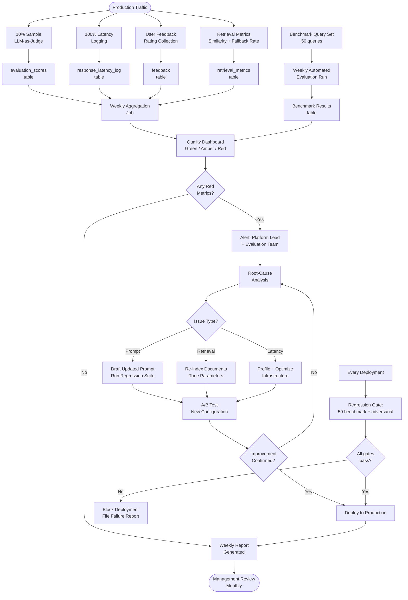

# Evaluation Framework — AA-Hackathon Enterprise AI Platform

**Aligned Automation | Platform Architecture Series**
**Version:** 1.0 | **Date:** 2026-06-07 | **Status:** Production

---

## 1. Overview

The Evaluation Framework defines how the AA-Hackathon Enterprise AI Platform measures, monitors, and improves the quality of AI-generated responses over time. It covers six quality dimensions, the feedback data model, domain-specific benchmark query sets, automated retrieval metrics, human evaluation processes, regression testing, A/B testing, and the remediation workflow.

Quality assurance is not a one-time activity. The framework establishes continuous evaluation loops that feed directly back into prompt updates, retrieval configuration changes, routing rule adjustments, and model selection decisions.

---

## 2. Quality Dimensions

### 2.1 Accuracy

**Definition:** The response correctly answers the user's question based on the retrieved source content.

**Measurement:**
- Automated: LLM-as-judge — a separate Ollama call rates the response on a 1–5 scale given the question, retrieved context, and generated answer.
- Human: weekly sample review (see Section 7) scores a random 5% of responses.

**Target:** > 85% of responses rated 4 or 5 out of 5.

**Formula:**
```
Accuracy = (responses rated >= 4) / (total responses reviewed) × 100
```

### 2.2 Relevance

**Definition:** The response directly addresses what the user was asking. A response that is factually correct but answers a different question fails relevance.

**Measurement:**
- Automated: cosine similarity between the query embedding and the response embedding.
- Human: binary rating (relevant / not relevant) during weekly review.

**Target:** > 90% of responses rated relevant.

### 2.3 Completeness

**Definition:** The response provides a full answer — not a partial answer that leaves the user needing a follow-up for basic information.

**Measurement:**
- Human: evaluators check if all sub-questions in a compound query are addressed.
- Automated (proxy): response length relative to query complexity. Very short responses to complex queries are flagged for human review.

**Target:** > 80% of complex queries fully addressed.

### 2.4 Groundedness

**Definition:** Every factual claim in the response is supported by retrieved source content. Hallucinated facts — not present in any retrieved chunk — fail groundedness.

**Measurement:**
- Automated: NLI (natural language inference) model checks each factual claim against the source chunks.
- Human: evaluators verify that sources cited in the response correspond to real retrieved documents.

**Target:** > 90% of responses fully grounded.

**This is the highest-priority metric.** Hallucination in enterprise HR/Finance/IT context causes direct operational harm.

### 2.5 Latency

**Definition:** Time from user submitting a query to the first token of the response appearing (TTFB) and to the full response completing.

**SLA targets:**

| Metric | Target | Alert Threshold |
|---|---|---|
| TTFB (time to first byte) | < 2 s | > 3 s |
| Full response p50 | < 3 s | > 4 s |
| Full response p95 | < 5 s | > 7 s |
| Full response p99 | < 8 s | > 12 s |

**Measurement:** Latency recorded at the FastAPI gateway for every request. Stored in `response_latency_log` table with agent type, routing tier used, and retrieval source breakdown.

### 2.6 Fallback Rate

**Definition:** The percentage of queries for which the system could not retrieve sufficient grounded context and had to either generate a low-confidence response or refuse to answer.

**Triggers:** Adaptive retry threshold not met (< 3 results above 0.10 similarity after retry).

**Target:** < 10% of all queries.

**Formula:**
```
Fallback Rate = (queries triggering adaptive retry with low_confidence=True) / (total queries) × 100
```

---

## 3. Feedback Data Model

User feedback is the primary signal for real-world quality assessment.

### 3.1 Feedback Table Schema

```sql
CREATE TABLE feedback (
    id          UUID PRIMARY KEY DEFAULT gen_random_uuid(),
    session_id  TEXT NOT NULL,
    message_id  UUID NOT NULL,
    user_id     TEXT NOT NULL,          -- JWT oid
    agent_type  TEXT,                   -- e.g., 'HRAgent'
    rating      SMALLINT NOT NULL,      -- 1 (positive), 0 (neutral), -1 (negative)
    comment     TEXT,                   -- optional user comment
    query_text  TEXT,                   -- stored for analysis (PII-screened)
    response_hash TEXT,                 -- SHA-256 of response (not stored plainly)
    retrieval_chunk_ids UUID[],         -- chunks used in this response
    similarity_scores FLOAT[],          -- corresponding scores
    routing_tier INT,                   -- 1, 2, or 3
    latency_ms  INT,                    -- total response latency
    created_at  TIMESTAMPTZ DEFAULT NOW()
);
```

### 3.2 Feedback Signal Interpretation

| Rating | Comment | Action |
|---|---|---|
| +1 | Any | Positive signal; no action needed |
| 0 | None | Neutral; included in weekly stats |
| -1 | None | Flag for review; check retrieval quality |
| -1 | Comment present | High priority; human review within 24h |
| -1 | Security/safety concern in comment | Immediate escalation to IT Security |

### 3.3 Feedback Aggregation

Weekly feedback report includes:
- Total feedback count per agent
- Positive rate per agent
- Negative rate per agent
- Top 5 negative-feedback queries (anonymized)
- Comment sentiment analysis summary

---

## 4. Benchmark Query Sets

Each domain maintains a curated set of 10 benchmark queries with expected answers. These are run weekly (automated) and before any prompt or retrieval change (regression gate).

### 4.1 HR Benchmark (10 queries)

1. "What is the casual leave entitlement for confirmed employees?"
2. "How many days notice period do I need to serve?"
3. "What is the maternity leave policy?"
4. "Can I carry forward unused earned leaves?"
5. "What is the process to apply for paternity leave?"
6. "What documents do I need for the PF withdrawal process?"
7. "What is the work-from-home policy?"
8. "How does the performance review cycle work?"
9. "What happens to my leave balance when I resign?"
10. "Who is the HR SPOC for payroll queries?"

### 4.2 IT Benchmark (10 queries)

1. "How do I set up VPN on my Mac?"
2. "I forgot my Active Directory password. How do I reset it?"
3. "How do I request a new software license?"
4. "My laptop is running very slow. What should I do?"
5. "How do I connect to the office WiFi?"
6. "What is the BYOD policy?"
7. "How do I access the company intranet remotely?"
8. "How do I report a phishing email?"
9. "What is the process for getting a new laptop?"
10. "How do I add a shared mailbox in Outlook?"

### 4.3 Finance Benchmark (10 queries)

1. "What is the travel reimbursement limit for domestic trips?"
2. "How do I submit an expense claim in Zoho?"
3. "When is Form 16 issued?"
4. "What is the TDS rate on my salary for this year?"
5. "How do I get a duplicate Form 16?"
6. "What is the advance salary policy?"
7. "What expenses are eligible for reimbursement?"
8. "How do I submit a vendor invoice for payment?"
9. "What is the petty cash limit per department?"
10. "How do I check the status of my submitted expense claim?"

### 4.4 Admin Benchmark (10 queries)

1. "How do I book a cab for client travel?"
2. "What is the process for booking a hotel for outstation travel?"
3. "How do I get a parking sticker for my vehicle?"
4. "What is the cafeteria timing?"
5. "How do I request stationery for my team?"
6. "What is the visitor entry process?"
7. "How do I raise a facility maintenance request?"
8. "What is the travel advance policy?"
9. "How do I book a meeting room?"
10. "What is the dress code policy?"

### 4.5 PMO Benchmark (10 queries)

1. "What is the project initiation checklist?"
2. "How do I raise a change request?"
3. "What is the sprint review process?"
4. "How do I escalate a project risk?"
5. "What is the resource onboarding process for new project members?"
6. "How do I log a project milestone in Jira?"
7. "What is the project closure process?"
8. "How do I request additional budget for a project?"
9. "What templates are available for project status reports?"
10. "What is the escalation matrix for delivery delays?"

---

## 5. Automated Evaluation Metrics

### 5.1 Retrieval Precision@K

For benchmark queries with known relevant documents:

```
Precision@10 = (relevant chunks in top 10 results) / 10
```

Run weekly. Target: > 0.70 average across all benchmark queries.

### 5.2 Similarity Score Distribution

Monitored metrics from the `response_latency_log` and retrieval logs:

| Metric | Target | Alert |
|---|---|---|
| Mean similarity score | > 0.35 | < 0.25 |
| % results below threshold | < 15% | > 25% |
| Adaptive retry trigger rate | < 15% | > 25% |
| Zero-result rate | < 5% | > 10% |

### 5.3 LLM-as-Judge Pipeline

```python
def evaluate_response(query: str, context: str, response: str) -> dict:
    judge_prompt = f"""
    You are an enterprise AI quality evaluator.
    
    User Query: {query}
    Retrieved Context: {context}
    AI Response: {response}
    
    Rate the response on each dimension (1=poor, 5=excellent):
    - accuracy: Is the answer factually correct based on the context?
    - relevance: Does it address what was asked?
    - completeness: Is the answer fully developed?
    - groundedness: Is every claim supported by the context?
    
    Respond with JSON only: {{"accuracy": N, "relevance": N, "completeness": N, "groundedness": N}}
    """
    result = ollama.generate(model="gpt-oss", prompt=judge_prompt, temperature=0.0)
    return json.loads(result)
```

LLM-as-judge runs on 10% of all production responses (sampled), plus 100% of benchmark queries. Results stored in `evaluation_scores` table.

---

## 6. Human Evaluation Process

### 6.1 Weekly Sample Review

Each week, the evaluation team reviews a random sample of 50 conversations:
- Selected proportionally across all 13 agent types.
- Includes all conversations with negative feedback ratings.
- Each conversation scored on all 6 quality dimensions.
- Evaluator comments captured for qualitative analysis.

**Process:**
1. Evaluation dashboard surfaces the weekly sample.
2. Two evaluators independently score each conversation.
3. Disagreements > 2 points are discussed and resolved.
4. Consensus scores written to `human_evaluation_scores` table.

### 6.2 Evaluator Calibration

Monthly calibration session:
- 5 anchor conversations (pre-scored by platform lead) reviewed by all evaluators.
- Scores compared against anchor. Evaluators with > 1-point average deviation retrained.
- Calibration ensures inter-rater reliability > 0.80 (Cohen's kappa).

---

## 7. Regression Testing

Regression tests run automatically in the CI/CD pipeline before any deployment that touches:
- `personalities.py` (any prompt change)
- `guardrails.py` (any guardrail change)
- `base_deep_agent.py` (retrieval logic change)
- `supervisor_agent.py` (routing change)
- Ollama model version update

**Regression gates:**
1. All 50 benchmark queries (5 domains × 10) must pass accuracy >= 4/5.
2. No new hallucinations detected by automated groundedness check.
3. Latency p95 for benchmark queries < 5 seconds.
4. Fallback rate for benchmark queries < 10%.
5. All 50+ adversarial prompts must still be rejected by Governor.

**Gate failure:** Deployment blocked. Failure report auto-generated and assigned to platform engineering.

---

## 8. A/B Testing Framework

### 8.1 Setup

A/B tests run when evaluating:
- New prompt variant against current prompt
- New retrieval configuration (different chunk size, top_k, threshold)
- New routing rule

**Traffic split:** 90% control, 10% treatment (by session_id hash modulo 10).

**Minimum sample:** 500 sessions per variant before declaring a winner.

### 8.2 Metrics Collected per Variant

- Positive feedback rate
- Negative feedback rate
- Mean similarity score
- Fallback rate
- Latency p50 and p95

### 8.3 Statistical Test

Mann-Whitney U test for non-normal distributions. Significance threshold: p < 0.05.

**Decision rule:**
- Treatment significantly better on >= 2 metrics and not significantly worse on any → promote to production.
- Treatment significantly worse on any metric → reject.
- No significant difference → retain control (conservative default).

---

## 9. Evaluation Cadence

| Activity | Frequency | Owner |
|---|---|---|
| Automated LLM-as-judge (10% sample) | Continuous | Platform (automated) |
| Similarity score monitoring | Daily | Platform (automated) |
| Benchmark query run | Weekly (Monday 6 AM) | Platform (automated) |
| Human sample review | Weekly | Evaluation Team |
| Feedback report | Weekly | Platform Lead |
| Evaluator calibration | Monthly | Evaluation Lead |
| Full evaluation report | Monthly | Platform Lead → Management |
| A/B test analysis | Per test (min 2 weeks) | Platform + Evaluation |
| Regression on every deployment | Per deployment | CI/CD pipeline |

---

## 10. Quality Thresholds and Remediation

### 10.1 Thresholds

| Metric | Green (OK) | Amber (Watch) | Red (Act) |
|---|---|---|---|
| Accuracy | > 85% | 75–85% | < 75% |
| Groundedness | > 90% | 80–90% | < 80% |
| Relevance | > 90% | 80–90% | < 80% |
| Latency p95 | < 5 s | 5–8 s | > 8 s |
| Fallback rate | < 10% | 10–20% | > 20% |
| Negative feedback rate | < 10% | 10–20% | > 20% |

### 10.2 Remediation Process

**Amber:** Log alert, add to next weekly review agenda, root-cause analysis within 5 business days.

**Red — Accuracy or Groundedness:**
1. Pause new deployments.
2. Root-cause analysis: prompt issue? Retrieval quality? Model degradation?
3. If prompt issue: draft updated prompt, run regression suite, A/B test.
4. If retrieval issue: review chunking parameters, re-index affected document set.
5. If model issue: assess model update or fallback to previous version.

**Red — Latency:**
1. Profile Ollama generation time, retrieval time, DB query time.
2. Check connection pool exhaustion.
3. Implement response caching for high-frequency benchmark queries.

**Red — Fallback Rate:**
1. Analyze query types triggering fallback.
2. Add missing documents to knowledge base.
3. Add fast-path routing rules for identified query patterns.
4. Reduce similarity threshold (with groundedness impact assessment).

---

## 11. Evaluation Pipeline Diagram



---

## 12. Evaluation Tables Reference

```sql
CREATE TABLE evaluation_scores (
    id UUID PRIMARY KEY DEFAULT gen_random_uuid(),
    session_id TEXT,
    message_id UUID,
    agent_type TEXT,
    accuracy FLOAT,
    relevance FLOAT,
    completeness FLOAT,
    groundedness FLOAT,
    evaluator TEXT,    -- 'llm_judge' or evaluator user_id
    created_at TIMESTAMPTZ DEFAULT NOW()
);

CREATE TABLE benchmark_results (
    id UUID PRIMARY KEY DEFAULT gen_random_uuid(),
    run_date DATE,
    domain TEXT,
    query_index INT,
    agent_type TEXT,
    accuracy FLOAT,
    groundedness FLOAT,
    latency_ms INT,
    fallback_triggered BOOLEAN,
    created_at TIMESTAMPTZ DEFAULT NOW()
);

CREATE TABLE response_latency_log (
    id UUID PRIMARY KEY DEFAULT gen_random_uuid(),
    session_id TEXT,
    agent_type TEXT,
    routing_tier INT,
    retrieval_latency_ms INT,
    generation_latency_ms INT,
    total_latency_ms INT,
    ttfb_ms INT,
    fallback_triggered BOOLEAN,
    similarity_mean FLOAT,
    created_at TIMESTAMPTZ DEFAULT NOW()
);
```
