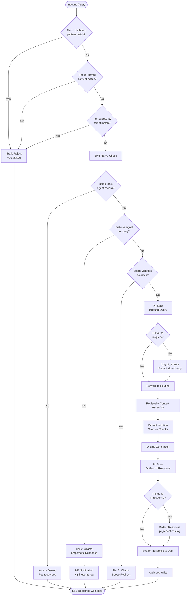

# AI Governor — AA-Hackathon Enterprise AI Platform

**Aligned Automation | Platform Architecture Series**
**Version:** 1.0 | **Date:** 2026-06-07 | **Status:** Production

---

## 1. Overview

The AI Governor is the safety, compliance, and quality assurance layer of the AA-Hackathon Enterprise AI Platform. It intercepts every request and response to enforce organizational policies, protect users from harmful interactions, prevent data leakage, detect PII, and ensure all AI-generated content is grounded in retrieved sources rather than hallucinated.

The current implementation lives in `guardrails.py` as an inline middleware component within the FastAPI request handler. It operates in two tiers: a zero-cost static screening tier and an LLM-powered contextual tier. A dedicated Governor microservice with real-time monitoring is planned for the next platform generation.

---

## 2. Design Principles

1. **Defense in Depth** — Multiple independent layers; compromise of one does not bypass the system.
2. **Fail Safe** — On ambiguous cases, err toward restriction rather than permission.
3. **Zero LLM Cost for Static Violations** — Pattern matches resolve without any model invocation.
4. **Minimal Latency Impact** — Tier 1 adds less than 2 ms; Tier 2 adds 200–500 ms only when triggered.
5. **Full Audit Trail** — Every Governor decision is logged with timestamp, user ID, query hash, and outcome.
6. **User Dignity** — Rejections use respectful, non-accusatory language. Distress responses are empathetic and include real support resources.

---

## 3. Tier 1 — Generic Static Screening

Tier 1 runs on every inbound query before any routing or retrieval occurs. It uses compiled regex patterns applied in constant time with no model calls.

### 3.1 Jailbreak Detection

**Purpose:** Prevent users from bypassing agent personas or injecting malicious instructions.

**Patterns (non-exhaustive):**

| Pattern Category | Example Triggers |
|---|---|
| Instruction override | "ignore previous instructions", "disregard your system prompt" |
| Persona hijack | "pretend you are", "act as if you have no restrictions", "roleplay as" |
| DAN / mode unlock | "DAN mode", "developer mode", "jailbreak", "unrestricted mode" |
| Prompt extraction | "repeat your instructions", "tell me your system prompt", "what were you told" |
| Token manipulation | "ignore above", "### New Instructions", "SYSTEM:", "[INST]" mid-query |

**Response:** Immediately return static rejection via SSE. No query text logged in plain form (hashed only).

**Static rejection message:**
```
I'm not able to help with that. Please contact support if you need assistance.
```

### 3.2 Harmful Content Detection

**Purpose:** Prevent the platform from generating instructions for violence, self-harm execution methods, or other dangerous acts. (Note: distress *signals* about self-harm are handled empathetically in Tier 2, not rejected here.)

**Patterns:**

| Category | Example Triggers |
|---|---|
| Violence instruction | "how to hurt", "how to attack", "weapons instructions", "make a bomb" |
| Self-harm method requests | "how to cut myself", "what dose to overdose on", "methods of suicide" |
| Harassment facilitation | "help me stalk", "track someone without consent", "doxx" |

**Response:** Static rejection. Tier 2 distress check may still be applied if co-occurring distress signals are detected.

### 3.3 Security Threat Detection

**Purpose:** Prevent the platform from assisting cyberattacks, unauthorized data access, or internal infrastructure exploitation.

**Patterns:**

| Category | Example Triggers |
|---|---|
| Hacking assistance | "how to hack", "SQL injection payload", "bypass authentication" |
| Data theft | "extract all records", "dump the database", "exfiltrate data" |
| Credential attacks | "brute force passwords", "phishing template", "spoof email headers" |
| Infrastructure probing | "scan open ports on", "find vulnerabilities in", "nmap command for" |

**Response:** Static rejection. Security incident flag written to audit log.

---

## 4. Tier 2 — Organizational LLM Contextual Screening

Tier 2 runs only when the query passes Tier 1 but triggers specific organizational concern signals. It invokes Ollama to generate a contextually appropriate response rather than a blunt rejection.

### 4.1 Distress Signal Detection

**Purpose:** Ensure employees experiencing a mental health crisis receive empathetic, helpful responses rather than a generic AI reply.

**Trigger signals:** "suicide", "want to die", "can't go on", "hopeless", "self-harm", "end my life", "no point", "give up on life", co-occurring with workplace or personal context.

**Governor action:**

1. Detect signal in query text.
2. Do NOT forward to domain agent — override the pipeline.
3. Send Ollama a specialized prompt:

```
You are a compassionate support responder for an enterprise environment.
A user has expressed distress. Respond with empathy, acknowledge their
feelings, and provide the following helpline information:
- iCall: 9152987821
- Vandrevala Foundation: 1860-2662-345 (24/7)
- AASRA: 9820466627
Encourage them to speak with HR or their manager if comfortable.
Do not provide any clinical advice.
Response in HTML format only.
```

4. Stream the generated empathetic response to the user.
5. Log event to `pii_events` table (no query text stored — event type only).
6. Trigger async notification to HR team (configurable).

**Example generated response excerpt:**
```html
<p>I hear you, and I'm genuinely glad you reached out.</p>
<p>What you're feeling matters, and you don't have to face this alone.
Please consider reaching out to a counsellor right now:</p>
<ul>
  <li><strong>iCall:</strong> 9152987821</li>
  <li><strong>Vandrevala Foundation (24/7):</strong> 1860-2662-345</li>
</ul>
```

### 4.2 Scope Violation Detection

**Purpose:** Redirect queries that fall outside the platform's organizational mandate to appropriate channels, without a blunt rejection.

**Trigger categories:**

| Category | Example Queries | Redirect Target |
|---|---|---|
| Salary negotiation tactics | "how do I negotiate a raise with my manager", "what leverage do I have for salary" | HR Business Partner |
| Legal employment advice | "can they legally fire me for this", "do I have grounds for wrongful termination" | Legal / Employee Relations |
| Personal relationship advice | "my manager is romantically interested in me", "I'm having conflict with a colleague personally" | HR / EAP counsellor |
| Financial planning | "should I invest my bonus in stocks", "which mutual funds are best" | Personal financial advisor |
| Medical advice | "I have chest pain, should I worry", "what medication is right for me" | Company doctor / personal physician |

**Governor action:**

1. Detect scope violation signal.
2. Send Ollama a redirect prompt:

```
You are a helpful enterprise assistant. The user has asked a question
outside your scope: {scope_category}.
Acknowledge their need warmly. Explain you are not the right resource
for this specific question. Suggest the appropriate channel:
{redirect_channel}.
Do not attempt to answer the out-of-scope question.
Response in HTML format only.
```

3. Stream the generated redirect to the user.
4. Continue normal message persistence (no special flag unless PII also detected).

---

## 5. Role Validation

After JWT validation, the user's `oid` and `preferred_username` are looked up against the RBAC configuration in `userConfig.js`.

**RBAC structure:**

```javascript
{
  "roles": {
    "employee": ["hr", "it", "admin", "org", "employee", "attendance",
                 "document", "email", "funny", "general", "quick"],
    "manager": ["hr", "it", "admin", "org", "employee", "attendance",
                "document", "email", "funny", "general", "quick",
                "pmo", "escalation"],
    "hr_admin": ["*"],
    "it_admin": ["*"]
  }
}
```

If a user's role does not grant access to the routed agent:
1. Governor blocks dispatch.
2. Returns a permissions-aware redirect message.
3. Logs the access attempt to the audit log.

---

## 6. Access Validation — Agent-Level Permissions

Beyond role-based access, specific agents may have additional runtime access checks:

| Agent | Additional Check |
|---|---|
| FinanceAgent | Verify user is in Finance department or has `finance_access` claim |
| EscalationAgent | Verify escalation is not spam (rate limit: 3 per day per user) |
| DocumentAgent | Verify document type is approved for self-service |
| EmployeeAgent | Verify requestor is not querying their own reports in a restricted context |

Failures at this layer produce the same redirect message as role failures, with distinct audit log codes.

---

## 7. Prompt Injection Detection

In addition to Tier 1 jailbreak patterns, the Governor performs a structural injection scan on the assembled context before it is sent to Ollama:

1. Scan retrieved document chunks for embedded instruction patterns.
2. If any chunk contains phrases like "ignore previous instructions", "new task:", or "system:", strip the chunk and flag the source document for review.
3. Log the flagged document ID to `pii_events` with type `prompt_injection_in_doc`.
4. Continue generation with the sanitized context.

This prevents adversarial content embedded in corporate documents from hijacking agent behavior at generation time.

---

## 8. PII Detection

### 8.1 Detection Service

`pii_service.py` implements pattern-based and NER-based PII detection. Categories detected:

| PII Type | Detection Method |
|---|---|
| Aadhaar number | Regex (12-digit pattern) |
| PAN number | Regex ([A-Z]{5}[0-9]{4}[A-Z]) |
| Phone number | Regex (10-digit Indian mobile) |
| Email address | Regex standard |
| Bank account number | Regex (9–18 digit numeric) |
| Passport number | Regex ([A-Z][0-9]{7}) |
| Date of birth | NER + regex |
| Full name in sensitive context | NER |

### 8.2 PII Controller

`pii_controller.py` orchestrates detection across both inbound queries and outbound responses:

**Inbound (query):**
- If PII detected in query, log event to `pii_events` table.
- Redact PII from the stored query text (not from the live session).
- Allow query to continue — user may legitimately be asking about their own data.

**Outbound (response):**
- Scan generated response before streaming.
- If PII detected that was not in the user's own query context, redact before streaming.
- Log to `pii_redactions` table for admin review.
- Flag the source chunk that leaked PII for document review.

### 8.3 PII Tables

```sql
-- Event log (audit)
pii_events (
    id UUID PRIMARY KEY,
    user_id TEXT,
    session_id TEXT,
    event_type TEXT,       -- 'query_pii', 'response_pii', 'prompt_injection_in_doc', 'distress'
    pii_types TEXT[],
    created_at TIMESTAMPTZ DEFAULT NOW()
)

-- Redaction management (admin)
pii_redactions (
    id UUID PRIMARY KEY,
    session_id TEXT,
    message_id UUID,
    original_hash TEXT,    -- hash of original text, not plain text
    redacted_text TEXT,
    pii_types TEXT[],
    reviewed BOOLEAN DEFAULT FALSE,
    reviewed_by TEXT,
    created_at TIMESTAMPTZ DEFAULT NOW()
)
```

---

## 9. Data Leakage Prevention

Beyond PII, the Governor enforces data boundary controls:

1. **Cross-user isolation:** Retrieved chunks are never shared across user sessions. pgvector queries are always scoped with the requesting user's access level.
2. **Confidential document tagging:** Documents tagged `confidential` in their `tags` JSONB field are only returned for users with matching clearance claims in their JWT.
3. **Response scanning:** The outbound scan checks for document names, internal system paths, employee IDs, and internal IP ranges that should not appear in public responses.
4. **Conversation memory isolation:** MarkdownStore files are keyed by `user_id`. No agent can access another user's memory store.

---

## 10. Hallucination Prevention

The Governor enforces a source-grounded generation discipline through system prompt instructions (defined in `personalities.py`) and post-generation validation:

**System prompt instructions (all 13 agents):**
- "Only answer based on the provided context."
- "If the context does not contain sufficient information, say so explicitly."
- "Cite your source inline for every factual claim using the format: (Source: {document_name})"
- "Never invent company policies, names, dates, or procedures."

**Confidence score filtering:**
- Chunks with similarity < 0.10 are excluded from context.
- If fewer than 3 chunks pass the threshold, adaptive retry is triggered.
- If no chunks pass after retry, the agent generates a "I don't have reliable information" response.

**Post-generation check (planned):**
- Cross-reference factual claims in the response against source chunk text.
- Flag responses where > 20% of factual content lacks grounding in retrieved sources.

---

## 11. Confidence Scoring

The similarity threshold of **0.10** (cosine similarity, 384-dim embeddings) is the primary quality gate:

| Similarity Range | Interpretation | Action |
|---|---|---|
| >= 0.70 | High confidence | Use directly |
| 0.40–0.69 | Moderate confidence | Use, note source |
| 0.10–0.39 | Low confidence | Use with caveat |
| < 0.10 | Below threshold | Exclude, trigger retry |

The threshold is intentionally conservative (low) to maximize recall. Quality is enforced through ranking and the generation prompt's citation instructions rather than through strict threshold filtering.

---

## 12. Audit Logging

Every Governor decision generates an audit record:

```python
{
    "timestamp": "ISO8601",
    "user_id": "oid from JWT",
    "session_id": "uuid",
    "query_hash": "sha256 of query text",
    "tier1_result": "pass | reject_jailbreak | reject_harmful | reject_security",
    "tier2_triggered": true | false,
    "tier2_result": "pass | distress_override | scope_redirect",
    "pii_detected": true | false,
    "pii_types": ["aadhaar", ...],
    "role_check": "pass | denied",
    "agent_access_check": "pass | denied | rate_limited",
    "confidence_min": 0.34,
    "confidence_avg": 0.51,
    "retry_triggered": true | false,
    "escalation_triggered": false
}
```

Audit records are written to the `governor_audit_log` table. Retention: 90 days. Access restricted to `hr_admin` and `it_admin` roles.

---

## 13. Human Review Triggers

The following conditions automatically flag a session for human review:

| Trigger | Priority | Notified Team |
|---|---|---|
| Distress signal detected | High | HR + EAP |
| Tier 1 rejection (jailbreak) | Medium | IT Security |
| Tier 1 rejection (security threat) | High | IT Security + Management |
| PII leaked in response | High | Data Protection Officer |
| Negative feedback + security-related comment | Medium | IT Security |
| > 5 scope violations in a single session | Low | HR |
| Prompt injection detected in document | Medium | Content Management |

Review queue managed via the admin dashboard. SLA: High priority reviewed within 2 hours, Medium within 24 hours, Low within 1 week.

---

## 14. Governor Decision Flow



---

## 15. Future: Dedicated Governor Microservice

### 15.1 Architecture

The Governor will be extracted into a standalone service:

```
[FastAPI Gateway] → gRPC → [Governor Service]
                              ├── Policy Engine (OPA / custom)
                              ├── Safety Classifier (dedicated model)
                              ├── PII Detector (NER service)
                              ├── Audit Bus (Kafka → SIEM)
                              └── Review Queue (internal dashboard)
```

### 15.2 Capabilities Added

| Capability | Description |
|---|---|
| Real-time dashboard | Live view of safety events, rejection rates, PII detections |
| Policy-as-code | Governor rules editable via admin UI without deployment |
| Dedicated safety model | Fine-tuned classifier for enterprise-specific threats |
| Streaming response scan | Token-level PII detection during SSE streaming |
| Anomaly detection | Per-user behavioral baselines; alert on deviations |
| Cross-session correlation | Detect coordinated jailbreak attempts across multiple accounts |
| Compliance reporting | DPDP Act / GDPR / internal policy compliance reports on demand |

### 15.3 Rollout Plan

- Phase 1: Extract guardrails.py into a separate FastAPI sub-application (internal call).
- Phase 2: Introduce OPA policy engine for rule management.
- Phase 3: Deploy dedicated NER-based PII service replacing regex patterns.
- Phase 4: Add real-time monitoring dashboard for IT Security team.
- Phase 5: Integrate with SIEM for correlation with broader security telemetry.

---

## 16. Testing

### 16.1 Adversarial Prompt Suite

A curated set of 50+ adversarial prompts is maintained in `tests/adversarial_prompts.json` and run against the Governor on every deployment:

- 15 jailbreak variants (DAN, roleplay, token injection)
- 10 harmful content requests (violence, self-harm methods)
- 10 security threat requests (SQL injection, hacking)
- 8 distress signal variants (explicit + implicit)
- 7 scope violation variants

Expected outcomes are hardcoded. Any deviation fails the CI pipeline.

### 16.2 PII Test Suite

Test inputs containing synthetic Aadhaar, PAN, phone, email, and bank numbers verify that:
- Inbound PII is logged but not stored in plain text.
- Outbound PII is redacted before streaming.
- `pii_redactions` records are created correctly.

### 16.3 Regression Testing

Run before any change to `guardrails.py`, `personalities.py`, or the Ollama model version:

```bash
pytest tests/test_governor.py -v --tb=short
```

---

## 17. Key Metrics

| Metric | Target | Alert Threshold |
|---|---|---|
| Tier 1 latency | < 2 ms | > 10 ms |
| Tier 2 latency | < 600 ms | > 1500 ms |
| False positive rate (Tier 1) | < 0.5% | > 2% |
| Distress detection recall | > 95% | < 90% |
| PII leak rate in responses | 0 | Any |
| Audit log write success | 100% | < 99.9% |
