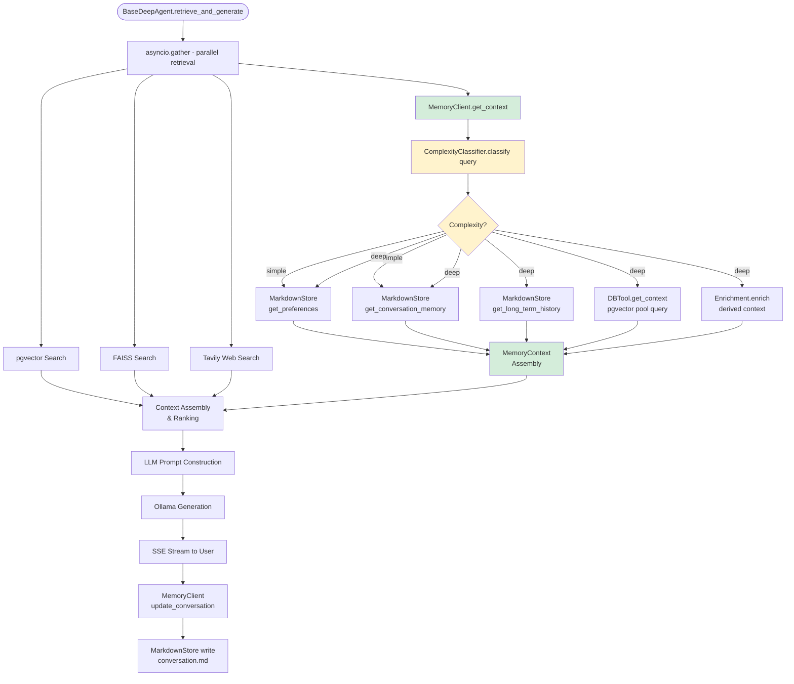

# Memory Management — AA-Hackathon Enterprise AI Platform

**Aligned Automation | Platform Architecture Series**
**Version:** 1.0 | **Date:** 2026-06-07 | **Status:** Production

---

## 1. Overview

The Memory Management system provides the AA-Hackathon Enterprise AI Platform with conversational continuity, user personalization, and structured data context across sessions. It is implemented as a set of cooperating Python modules — `MemoryClient` (`client.py`), `ComplexityClassifier` (`complexity.py`), `MarkdownStore` (`md_store.py`), `DBTool` (`db_tool.py`), and `Enrichment` (`enrichment.py`) — and integrates into `BaseDeepAgent` as one branch of the parallel retrieval fan-out.

Without memory, every query is stateless. With memory, the AI assistant knows that the user prefers concise answers, has been tracking a leave dispute for three days, and asked about Zoho expense codes last week — enabling responses that are contextually accurate and personalized to the individual employee.

---

## 2. Architecture Overview

```
BaseDeepAgent.retrieve_and_generate()
    │
    ├── pgvector search  (async)
    ├── FAISS search     (async)
    ├── Tavily search    (async)
    └── MemoryClient.get_context(user_id, query)  ◄── this document
              │
              ├── ComplexityClassifier.classify(query)
              │         │
              │    [simple]─── UserPreferences (MarkdownStore)
              │         │      ConversationMemory (MarkdownStore)
              │         │
              │    [deep]──── + LongTermHistory (MarkdownStore)
              │                + DBContext (DBTool)
              │                + EnrichedContext (Enrichment)
              │
              └── returns: MemoryContext object
```

---

## 3. MemoryClient (client.py)

`MemoryClient` is the single entry point for all memory operations. It is instantiated once per agent instance and holds references to all sub-components.

### 3.1 Primary Interface

```python
class MemoryClient:
    def get_context(self, user_id: str, query: str) -> MemoryContext:
        """
        Aggregates all relevant memory for the given user and query.
        Returns a MemoryContext object with up to 5 sections.
        """

    def update_conversation(self, user_id: str, query: str, response: str) -> None:
        """
        Called after successful generation to store the Q&A pair
        in conversation memory.
        """

    def update_preferences(self, user_id: str, preference_key: str, value: str) -> None:
        """
        Stores a user preference extracted from conversation or explicit request.
        """
```

### 3.2 Context Aggregation Flow

```python
def get_context(self, user_id: str, query: str) -> MemoryContext:
    complexity = self.classifier.classify(query)

    # Always fetch (fast, local file reads)
    prefs = self.store.get_preferences(user_id)
    conv = self.store.get_conversation_memory(user_id)

    if complexity == "deep":
        history = self.store.get_long_term_history(user_id)
        db_ctx = self.db_tool.get_context(user_id, query)
        enriched = self.enrichment.enrich(user_id, query, prefs, conv)
    else:
        history = enriched = db_ctx = None

    return MemoryContext(
        preferences=prefs,
        conversation=conv,
        history=history,
        db_context=db_ctx,
        enriched=enriched,
        complexity=complexity
    )
```

---

## 4. ComplexityClassifier (complexity.py)

Determines whether a query requires the full deep memory path or can be served adequately by lightweight memory.

### 4.1 Classification Logic

```python
class ComplexityClassifier:
    SIMPLE_KEYWORDS = [
        "what is", "how do i", "where is", "when is", "show me", "tell me",
        "who is", "link", "form", "policy", "contact"
    ]

    DEEP_INDICATORS = [
        "history", "last time", "previous", "earlier", "over the past",
        "track", "status of", "follow up", "you said", "we discussed",
        "my expenses", "my leaves", "my tickets", "my projects",
        "explain in detail", "compare", "analyze", "summarize my"
    ]

    def classify(self, query: str) -> str:
        q = query.lower()
        if any(ind in q for ind in self.DEEP_INDICATORS):
            return "deep"
        if len(query.split()) > 20:  # Long queries tend to need more context
            return "deep"
        return "simple"
```

### 4.2 Complexity Paths

| Query Example | Classification | Memory Sources |
|---|---|---|
| "What is the WFH policy?" | simple | Preferences + Conversation |
| "How do I reset my VPN password?" | simple | Preferences + Conversation |
| "Track status of my expense claim from last week" | deep | All 5 sources |
| "Summarize my leave history for this year" | deep | All 5 sources |
| "You told me yesterday about the parking policy" | deep | All 5 sources (needs history) |
| "Show me the cafeteria menu" | simple | Preferences + Conversation |

---

## 5. MarkdownStore (md_store.py)

File-based storage for user memory. Each user has a dedicated directory keyed by `user_id`. Files are plain Markdown for human-readability and easy debugging.

### 5.1 Directory Structure

```
memory/
└── {user_id}/
    ├── preferences.md        (user preferences, limits 1500 chars)
    ├── conversation.md       (recent conversation memory, limits 1200 chars)
    └── history.md            (long-term history, limits 1500 chars)
```

### 5.2 Preferences Store

**Purpose:** Captures stable user preferences that persist across sessions.

**Content examples:**
- Response verbosity preference ("I prefer concise answers")
- Domain-specific preferences ("Always show Zoho links directly")
- Language preference (if non-English)
- Role-specific context ("I am a team lead in PMO")
- Time zone preference for date calculations

**Limit:** 1500 characters. Oldest preference entries rotated out when limit is reached.

**Format:**
```markdown
## User Preferences
- Response style: concise
- Role: Team Lead, PMO
- Department: Project Management
- Manager: Rahul Sharma
- Preferred language: English
- Always include Zoho links: true
- Updated: 2026-05-28
```

### 5.3 Conversation Memory

**Purpose:** Short-term memory of the current and recent sessions. Enables multi-turn conversation coherence.

**Content:** Last 5–10 Q&A pairs, summarized if needed to fit the character limit.

**Limit:** 1200 characters.

**Format:**
```markdown
## Recent Conversation
- [2026-06-07 10:15] Q: What is my leave balance? A: You have 8 CL and 6 PL remaining.
- [2026-06-07 10:18] Q: Can I apply for 3 days leave starting Monday? A: Provided Zoho leave application link.
- [2026-06-07 10:22] Q: What documents do I need for a home loan NOC? A: [Explained requirements, linked DocumentAgent]
```

**Update trigger:** After every successful assistant response, `MemoryClient.update_conversation()` appends the Q&A pair and rotates if over limit.

### 5.4 Long-Term History

**Purpose:** Persistent record of significant interactions, decisions, and resolutions across a longer time horizon (weeks to months).

**Content:** Key milestones — escalation resolutions, policy queries answered, documents generated, expense claims tracked.

**Limit:** 1500 characters.

**Format:**
```markdown
## Long-Term History
- [2026-05-12] Escalated VPN issue, resolved by IT (ticket IT-2042)
- [2026-05-20] Applied for 5-day annual leave (approved)
- [2026-06-01] Requested experience letter (generated, emailed to user)
- [2026-06-05] Expense claim for April travel submitted via Finance
```

---

## 6. DBTool (db_tool.py)

`DBTool` retrieves structured context from the PostgreSQL database — data that is user-specific and transactional, not captured in flat Markdown files.

### 6.1 Responsibilities

- Query Zoho-mirrored tables for attendance, leave balances, and expense records.
- Fetch ticket/escalation status for active issues.
- Pull project assignments from PMO tables.
- Retrieve payroll period information relevant to finance queries.

### 6.2 Query Examples

```python
class DBTool:
    def get_context(self, user_id: str, query: str) -> str:
        """
        Examines query keywords and fetches relevant DB context.
        Returns formatted string for injection into LLM prompt.
        """
        results = []
        q = query.lower()

        if any(k in q for k in ["expense", "claim", "reimbursement"]):
            results.append(self._get_expense_context(user_id))

        if any(k in q for k in ["leave", "balance", "attendance"]):
            results.append(self._get_attendance_context(user_id))

        if any(k in q for k in ["ticket", "escalation", "issue"]):
            results.append(self._get_ticket_context(user_id))

        if any(k in q for k in ["project", "milestone", "sprint"]):
            results.append(self._get_project_context(user_id))

        return "\n".join(filter(None, results))
```

**Expense context example output:**
```
User's recent expense claims:
- April travel reimbursement: ₹4,200 — Status: Pending Approval (submitted 2026-06-01)
- March training expenses: ₹1,800 — Status: Approved (credited 2026-05-15)
```

**Attendance context example output:**
```
Attendance summary (June 2026):
- Present: 4 days | WFH: 1 day | Absent: 1 day (unapproved)
- Leave balance: CL 8, PL 6, SL 2
```

### 6.3 Database Connection

DBTool uses the shared `ThreadedConnectionPool` (min=1, max=8, RealDictCursor). Queries are parameterized with `user_id` to enforce per-user data isolation.

**Limit:** DB context output is clipped to 600 characters before injection into the LLM prompt.

---

## 7. Enrichment (enrichment.py)

`Enrichment` derives additional context from the combination of user preferences, conversation history, and the current query — going beyond what is stored to infer what would be most useful.

### 7.1 Enrichment Operations

| Enrichment Type | Description | Example |
|---|---|---|
| Department context | Infer user's team from preferences/history | "As a PMO Team Lead, project timeline queries are most relevant" |
| Recency signal | Identify if the user is following up on a recent topic | "This appears to be a follow-up on the VPN ticket from 2026-06-05" |
| Calendar context | Inject current date, financial year, leave year boundaries | "Current FY: April 2025 – March 2026, leave year resets April 1" |
| Personalization hint | Suggest response format based on stated preferences | "User prefers concise responses with direct Zoho links" |
| Role context injection | Add manager/team context for people queries | "User's manager is Rahul Sharma, team is PMO (8 members)" |

### 7.2 Output

**Limit:** Enriched context clipped to 800 characters.

```
Enriched Context:
- User role: Team Lead, PMO | Manager: Rahul Sharma
- This is a follow-up on the leave application from 2026-06-07
- Current financial year: FY2025-26 (ends March 31, 2026)
- User prefers concise responses with direct action links
```

---

## 8. Memory Integration in BaseDeepAgent

Memory retrieval runs concurrently with pgvector, FAISS, and Tavily searches:

```python
results = await asyncio.gather(
    self._retrieve_pgvector(query, user_id),
    self._retrieve_faiss(query),
    self._memory_client.get_context(user_id, query),   # ← memory
    self._retrieve_tavily(query),
    return_exceptions=True
)
```

If `get_context()` raises an exception (file read error, DB timeout), it returns an empty `MemoryContext` and logs the failure. Memory errors never block the main retrieval path.

### 8.1 Context Injection into LLM Prompt

After retrieval, the memory context is injected into the prompt ahead of retrieved document chunks:

```
[System Prompt — agent personality]

--- USER MEMORY CONTEXT ---
{preferences_section}
{conversation_section}
{history_section}        (only if deep complexity)
{db_context_section}     (only if deep complexity)
{enriched_section}       (only if deep complexity)
--- END USER MEMORY CONTEXT ---

--- RETRIEVED KNOWLEDGE ---
{document_chunks_with_sources}
--- END RETRIEVED KNOWLEDGE ---

User Query: {query}
```

Memory context is placed before retrieved knowledge so the LLM personalizes the response before applying document content.

---

## 9. Privacy and Isolation

| Principle | Implementation |
|---|---|
| Per-user isolation | Memory files keyed strictly by `user_id` (JWT `oid` claim) |
| No cross-user access | No API to read another user's memory store |
| PII in memory | Flagged and redacted per `pii_service.py` before storage |
| Memory deletion | User can request memory wipe; admin can force-wipe for offboarding |
| Retention | Conversation memory: 30 days. History: 12 months. Preferences: indefinite |
| File permissions | Memory directory accessible only by the application service account |

---

## 10. Memory Architecture Diagram



---

## 11. Character Limits Reference

| Memory Section | Character Limit | Rationale |
|---|---|---|
| Preferences | 1500 | Stable, rarely changes; richer context valuable |
| Conversation memory | 1200 | Recent turns only; aggressive rotation keeps it fresh |
| Long-term history | 1500 | Significant events; key milestones worth preserving |
| DB context | 600 | Transactional data; concise summaries sufficient |
| Enriched context | 800 | Derived signals; must not dominate the prompt |
| **Total memory budget** | **~5600** | Fits within Ollama 2048-token window after truncation |

Note: Character limits are enforced at write time by the MarkdownStore's rotation logic. Oldest entries are trimmed first. Summaries replace verbatim entries when approaching the limit.

---

## 12. Future Enhancements

### 12.1 Vector-Based Long-Term Memory

Replace the flat `history.md` file with a dedicated vector store for long-term episodic memory:

- Each significant event embedded with `all-MiniLM-L6-v2`.
- Retrieval: semantic search against long-term memory using the current query as the probe.
- Enables: "Do you remember when we discussed the parking policy two months ago?"

### 12.2 Collective Intelligence

Aggregate anonymized, consent-gated learnings across users to improve responses for the entire organization:

- Common question patterns → auto-update fast-path routing rules.
- Frequently requested documents → pre-cache in FAISS.
- Shared department context → injected for all users in that department.
- Privacy-preserving aggregation: no individual data surfaced.

### 12.3 Memory-Aware Personalization API

Expose a user-facing memory management interface:
- View what the AI remembers about you.
- Delete specific memory entries.
- Correct stored preferences.
- Opt out of long-term memory while keeping conversation memory.
