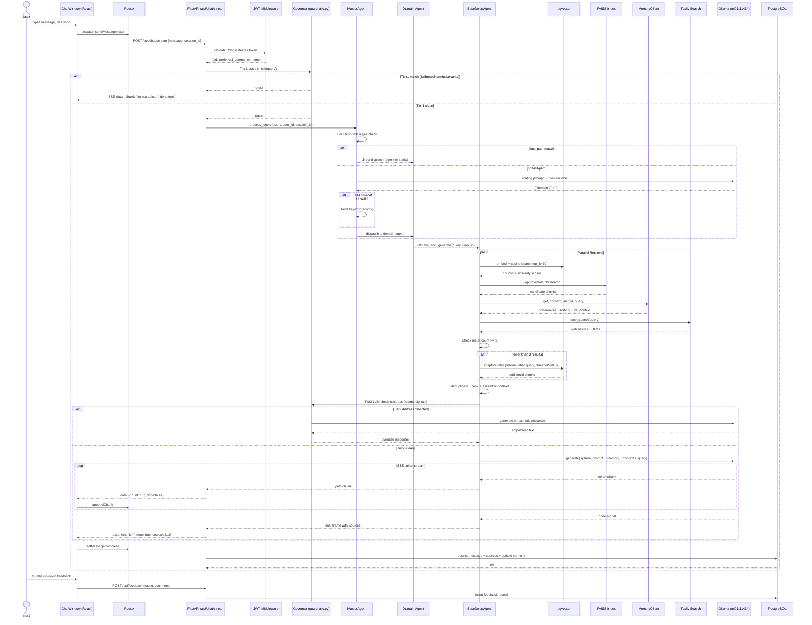

# Platform Orchestrator — AA-Hackathon Enterprise AI Platform

**Aligned Automation | Platform Architecture Series**
**Version:** 1.0 | **Date:** 2026-06-07 | **Status:** Production

---

## 1. Overview

The Platform Orchestrator is the central coordination layer that governs every interaction in the AA-Hackathon Enterprise AI Platform. It transforms a user's natural-language question into a grounded, source-cited, streamed response by routing across domain specialists, retrieval pipelines, memory stores, and the local Ollama LLM.

This document covers the full end-to-end request lifecycle — from the React frontend through the Python FastAPI backend, domain agent dispatch, parallel retrieval, LLM generation, SSE streaming, and message persistence — along with the governor layer, intent classification, skill routing, feedback loop, human escalation path, and the target LangGraph architecture.

---

## 2. High-Level Architecture

```
┌──────────────────────────────────────────────────────────────────────┐
│                        React Frontend                                │
│  ChatWindow → Redux Store → POST /api/chat/stream (SSE consumer)    │
└─────────────────────────────┬────────────────────────────────────────┘
                              │ HTTPS + JWT
┌─────────────────────────────▼────────────────────────────────────────┐
│                        FastAPI Gateway                               │
│  JWT validation (RS256/JWKS) → Governor Pre-Check → MasterAgent     │
└─────────────────────────────┬────────────────────────────────────────┘
                              │
┌─────────────────────────────▼────────────────────────────────────────┐
│                   MasterAgent (supervisor_agent.py)                 │
│  3-Tier Routing: Fast-Path | LLM Intent | Keyword Fallback          │
└──────┬──────────────────────┬───────────────────────────────────────┘
       │                      │
  Domain Agent          Domain Agent  (13 specialists)
       │                      │
┌──────▼──────────────────────▼───────────────────────────────────────┐
│              BaseDeepAgent (base_deep_agent.py)                     │
│  Parallel: pgvector + FAISS + MemoryClient + Tavily                 │
│  Adaptive retry → Context Assembly → Ollama generation → SSE out   │
└──────────────────────────────────────────────────────────────────────┘
```

---

## 3. Full Request Lifecycle

### 3.1 Frontend Initiation

The user types a message in **ChatWindow** (React component). On submit:

1. The message is dispatched to the **Redux store** via `sendMessage` action.
2. A `POST /api/chat/stream` request is initiated with:
   - Body: `{ "message": "<user text>", "session_id": "<uuid>", "agent_type": "auto" }`
   - Headers: `Authorization: Bearer <JWT>`, `Content-Type: application/json`
   - The frontend opens an **EventSource** consumer using the Fetch API (SSE mode).
3. The **retry configuration** in `apiConfig.js` governs failure handling:
   - Max attempts: 3
   - Delay between retries: 1 second
   - Request timeout: 30 seconds

### 3.2 JWT Validation

At the FastAPI gateway, every request passes through the JWT middleware:

1. Extract the `Authorization: Bearer` header.
2. Fetch the JWKS endpoint and cache public keys.
3. Decode and verify the token using **RS256** algorithm.
4. Extract claims: `oid` (user object ID), `preferred_username` (email), `name` (display name).
5. On failure: return HTTP 401 with no further processing.

The validated identity is passed to `userConfig.js` RBAC to determine agent-level permissions before routing proceeds.

### 3.3 Governor Pre-Check

Before the query reaches `MasterAgent`, the **Governor** (`guardrails.py`) performs Tier 1 static screening:

- Match against jailbreak, harmful content, and security threat patterns.
- If any match: immediately return a static rejection response via SSE and halt.
- If clean: forward to `MasterAgent.process_query()`.

See `guardrails.md` for full pattern documentation.

### 3.4 MasterAgent — Three-Tier Routing

`supervisor_agent.py` implements `MasterAgent.process_query(query, user_id, session_id)`.

**Tier 1 — Fast-Path (regex, <5 ms):**
Patterns are evaluated in priority order. Matches short-circuit to a specific agent or static response without any LLM call. Examples: "apply leave" → Zoho link, "escalate" → EscalationAgent, "hello/hi" → static welcome. Full pattern table documented in `routing-engine.md`.

**Tier 2 — LLM Intent Classification (200–500 ms):**
If no fast-path match, MasterAgent sends the query to Ollama with a structured routing prompt requesting a JSON domain label (hr/it/admin/pmo/finance/org/employee/attendance/document/email/escalation/funny/general). Timeout handling triggers fallback to Tier 3.

**Tier 3 — Keyword Scoring Fallback (<10 ms):**
`DOMAIN_KEYWORDS` dict scores the query against per-domain keyword lists. The highest-scoring domain wins. Ties resolved by priority order: hr > it > admin > pmo > finance > org.

### 3.5 Domain Agent Dispatch

Based on routing result, MasterAgent instantiates or retrieves the appropriate domain agent from the pool (13 total). Each agent holds its system prompt from `personalities.py`. The agent class inherits from **BaseDeepAgent**.

Agent types: `HRAgent`, `ITAgent`, `AdminAgent`, `PMOAgent`, `FinanceAgent`, `OrgAgent`, `EmployeeAgent`, `AttendanceAgent`, `DocumentAgent`, `EmailAgent`, `EscalationAgent`, `QuickAgent`, `FunnyAgent`.

### 3.6 Parallel Retrieval (BaseDeepAgent)

`base_deep_agent.py` launches four retrieval coroutines concurrently using `asyncio.gather`:

```
asyncio.gather(
    _retrieve_pgvector(query, user_id),
    _retrieve_faiss(query),
    _retrieve_memory(query, user_id),
    _retrieve_tavily(query)
)
```

**pgvector retrieval:**
- Embed query with `sentence-transformers/nomic-embed-text-v1.5` (768-dim).
- Execute cosine similarity search against `document_chunks` table.
- SQL orders by `embedding <=> query_vec::vector`, returns top 10 rows including `chunk_text`, `metadata`, `document_name`, `source_path`, `tags->>'source_url'`, and computed `1 - (embedding <=> query_vec::vector) AS similarity`.
- Filter results with similarity >= **0.10** threshold.

**FAISS retrieval:**
- In-memory FAISS index for fast approximate nearest-neighbor search.
- Returns top 10 candidate chunks as fallback/supplement.

**MemoryClient retrieval:**
- `client.py` calls `get_context(user_id, query)`.
- `ComplexityClassifier` determines simple vs. deep query path.
- Aggregates user preferences (MarkdownStore), conversation memory, long-term history, DB context (DBTool), and enriched context (Enrichment).
- Memory sections limited to 600–1500 chars each.

**Tavily web search:**
- Real-time web retrieval for queries not covered by internal corpus.
- Returns structured results with URL citations.
- Used as supplement when internal retrieval is insufficient.

### 3.7 Adaptive Retry

After initial retrieval, if the number of high-confidence results (similarity >= 0.10) is fewer than 3, BaseDeepAgent triggers adaptive retry:

1. Query reformulation: expand abbreviations, rephrase to broader form.
2. Re-run pgvector search with reformulated query.
3. Lower threshold to 0.07 for second attempt.
4. If still insufficient, accept all available results and proceed.
5. Mark response with low-confidence flag for downstream handling.

### 3.8 Context Assembly

Retrieved chunks from all four sources are merged and ranked:

1. Deduplicate overlapping chunks (hash comparison).
2. Sort by similarity score descending.
3. Clip total context to fit within Ollama `num_ctx=2048` tokens.
4. Prepend memory context (user preferences + conversation history).
5. Append source metadata for inline citation.

Final prompt structure:
```
[System Prompt — agent personality]
[Memory Context — user prefs + history]
[Retrieved Context — ranked chunks with sources]
[User Query]
```

### 3.9 Ollama LLM Generation

Request sent to Ollama at `ml01.alignedautomation.com:11434`:

- Model: `gpt-oss`
- Temperature: `0.1` (low for consistency)
- `num_predict`: 800 tokens max output
- `num_ctx`: 2048 tokens context window
- Streaming enabled: response tokens arrive incrementally

All agent system prompts instruct HTML-only output (no markdown). The agent persona shapes tone, structure, and domain boundaries.

Governor Tier 2 LLM check runs on the assembled context before generation if distress or scope signals are detected in the query.

### 3.10 SSE Streaming

The FastAPI endpoint streams Ollama's token output to the frontend:

- Route: `POST /api/chat/stream`
- Protocol: Server-Sent Events
- Frame format: `data: {"chunk": "<token>", "done": false}\n\n`
- Final frame: `data: {"chunk": "", "done": true, "sources": [...]}\n\n`

The React `EventSource` consumer appends each chunk to the Redux store, triggering incremental render in `ChatWindow`. The typing animation stops on the `done: true` event.

### 3.11 Message Persistence

After streaming completes:

1. Full assembled response saved to the session messages table.
2. Source documents recorded with chunk IDs and similarity scores.
3. Conversation memory updated via `MarkdownStore` with summary of this exchange.
4. `DBTool` writes structured query results if applicable.
5. Session record updated with last-active timestamp.

### 3.12 Source Display

The `sources` array in the final SSE frame is rendered by the frontend as a collapsible "Sources" panel below the response. Each source shows:
- `document_name`
- `source_path`
- `source_url` (linked if present)
- Similarity score badge

---

## 4. Governor Layer

### 4.1 Current Implementation

The Governor operates as an inline middleware within the FastAPI request handler, implemented in `guardrails.py`. It intercepts requests at two points: before routing (Tier 1) and before LLM generation (Tier 2).

**Current capabilities:**
- Tier 1 static pattern matching (zero LLM cost)
- Tier 2 LLM-based contextual evaluation
- PII detection and event logging
- Role-based access validation via JWT claims
- Confidence score filtering (threshold 0.10)
- Audit logging to `pii_events` table

### 4.2 Future Governor Microservice

Planned evolution: extract the Governor into a dedicated microservice with:
- Real-time monitoring dashboard
- Policy rule engine (editable without deployment)
- Multi-model safety classification
- Aggregated audit trail with alerting
- Human review queue with SLA tracking

---

## 5. Intent Classification Detail

The Tier 2 LLM routing prompt sent to Ollama follows this structure:

```
You are a routing classifier for an enterprise AI assistant.
Classify the following user query into exactly one domain label.

Valid labels: hr, it, admin, pmo, finance, org, employee,
              attendance, document, email, escalation, funny, general

Query: {user_query}

Respond with a JSON object: {"domain": "<label>"}
```

The response is parsed with a JSON extractor. If parsing fails or the model returns an invalid label, Tier 3 keyword scoring is applied immediately.

---

## 6. Skill Routing and Tool Invocation

Certain domain agents have access to external tools:

| Agent | Tool | Trigger |
|---|---|---|
| AttendanceAgent | Zoho Attendance API | "check in", "attendance report" |
| EmailAgent | SMTP / Exchange connector | "draft email", "send email to" |
| DocumentAgent | Form renderer | "experience letter", "loan proof" |
| EscalationAgent | Ticket creator | "escalate", "raise ticket" |
| EmployeeAgent | HR directory API | "who is", "employees in", "my team" |

Tool invocation is synchronous within the agent's `process` method. Results are injected into the context assembly stage before LLM generation.

---

## 7. Feedback Loop

After message persistence, the frontend presents a thumbs-up/thumbs-down widget. Ratings write to the `feedback` table with columns:
- `session_id`, `message_id`, `user_id`
- `rating` (1 = positive, -1 = negative, 0 = neutral)
- `comment` (optional text)

Negative feedback with a comment triggers an async workflow:
1. Flag the message for human review.
2. Log retrieval chunk IDs and similarity scores for evaluation team.
3. Feed into the weekly evaluation report (see `evaluation-framework.md`).

---

## 8. Human Escalation Path

Any agent can trigger human escalation under these conditions:
- User explicitly requests escalation ("talk to a human", "escalate")
- EscalationAgent is the routed agent
- Confidence falls below threshold after adaptive retry
- Guardrail Tier 2 detects distress signals

Escalation flow:
1. EscalationAgent collects structured form: name, department, issue summary, urgency.
2. Ticket created in the configured ticketing system.
3. User receives confirmation with ticket number via SSE response.
4. HR/IT on-call queue notified by email.
5. Full conversation context attached to the ticket.

---

## 9. Full Sequence Diagram



---

## 10. Future LangGraph Architecture

The current linear orchestration will migrate to a **LangGraph** stateful graph for richer multi-step reasoning and human-in-the-loop support.

### 10.1 State Model

```python
class OrchestratorState(TypedDict):
    query: str
    user_id: str
    session_id: str
    jwt_claims: dict
    governor_result: str          # "pass" | "reject" | "override"
    intent_label: str
    routed_agent: str
    retrieval_results: list[dict]
    retry_count: int
    assembled_context: str
    llm_response: str
    sources: list[dict]
    escalation_required: bool
    feedback: dict
```

### 10.2 LangGraph Node Definitions

| Node | Responsibility |
|---|---|
| `validate_jwt` | Extract and verify claims |
| `governor_tier1` | Static pattern screening |
| `classify_intent` | Three-tier routing decision |
| `dispatch_agent` | Resolve agent class |
| `parallel_retrieve` | Fan-out to all four retrieval sources |
| `adaptive_retry` | Reformulate + re-retrieve if needed |
| `assemble_context` | Merge, rank, deduplicate |
| `governor_tier2` | LLM contextual safety check |
| `generate_response` | Ollama streaming generation |
| `persist_message` | DB write + memory update |
| `handle_escalation` | Ticket creation + notification |
| `collect_feedback` | Rating ingestion |

### 10.3 Retry and Fallback Logic

```
retrieve → check_threshold
    → [sufficient] → assemble
    → [insufficient, retry_count < 2] → reformulate → retrieve
    → [insufficient, retry_count >= 2] → low_confidence_flag → assemble
    → [assemble fails] → QuickAgent fallback response
    → [Ollama timeout] → cached partial response + escalation offer
```

---

## 11. Database Connection Pool

All database operations use a **ThreadedConnectionPool**:
- Min connections: 1
- Max connections: 8
- Cursor factory: `RealDictCursor` (rows as dicts)
- Connection acquisition: blocking with timeout
- Release: guaranteed via `finally` block

Pool is shared across all agent instances within a FastAPI worker process. Connection health is validated on acquisition with a `SELECT 1` ping.

---

## 12. Performance SLAs

| Stage | Target Latency |
|---|---|
| JWT validation | < 10 ms |
| Governor Tier 1 | < 2 ms |
| Fast-path routing | < 5 ms |
| LLM routing | 200–500 ms |
| Keyword routing | < 10 ms |
| Parallel retrieval | < 800 ms |
| Adaptive retry | + 400 ms |
| Context assembly | < 50 ms |
| Ollama generation (TTFB) | < 2 s |
| Full response p95 | < 5 s |

---

## 13. Appendix — Key File Locations

| File | Role |
|---|---|
| `supervisor_agent.py` | MasterAgent, routing tiers |
| `base_deep_agent.py` | Retrieval + generation |
| `guardrails.py` | Governor implementation |
| `personalities.py` | 13 agent system prompts |
| `client.py` | MemoryClient |
| `complexity.py` | ComplexityClassifier |
| `md_store.py` | MarkdownStore |
| `db_tool.py` | DBTool |
| `enrichment.py` | Enrichment module |
| `pii_controller.py` | PII detection controller |
| `pii_service.py` | PII detection service |
| `apiConfig.js` | Frontend retry configuration |
| `userConfig.js` | RBAC agent permissions |
