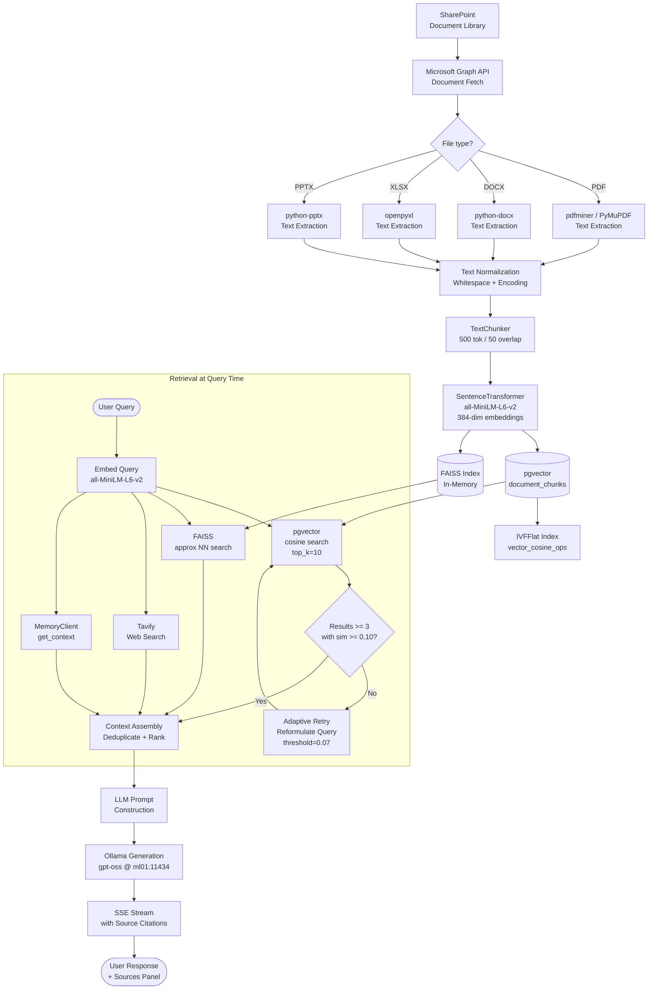

# RAG Architecture — AA-Hackathon Enterprise AI Platform

**Aligned Automation | Platform Architecture Series**
**Version:** 1.0 | **Date:** 2026-06-07 | **Status:** Production

---

## 1. Overview

The Retrieval-Augmented Generation (RAG) architecture is the knowledge backbone of the AA-Hackathon Enterprise AI Platform. It transforms raw corporate documents into searchable, semantically indexed knowledge chunks, and retrieves the most relevant passages at query time to ground Ollama's responses in actual organizational content.

The system comprises two major phases:

1. **Ingestion Pipeline** — converts documents from SharePoint through text extraction, chunking, embedding, and vector storage.
2. **Retrieval Pipeline** — at query time, embeds the user's question, searches the vector store, applies adaptive retry, and supplements with FAISS and Tavily results.

This document specifies both phases in full, along with quality metrics, source citation mechanics, and the future evolution toward hybrid retrieval and re-ranking.

---

## 2. Ingestion Pipeline

### 2.1 Source: SharePoint

Corporate knowledge documents are stored in SharePoint. The ingestion pipeline connects to SharePoint via the Microsoft Graph API and downloads new or modified documents based on a change detection mechanism (last-modified timestamp comparison).

**Document types supported:**
- PDF (`.pdf`) — HR policies, handbooks, compliance docs
- Word (`.docx`) — SOPs, process guides, templates
- Excel (`.xlsx`) — org charts, rate cards, resource matrices
- PowerPoint (`.pptx`) — training materials, presentations
- Plain text (`.txt`) — policy updates, announcements

### 2.2 Text Extraction

Each document type is processed by the `TextExtractor` module:

| Format | Extraction Method | Notes |
|---|---|---|
| PDF | `pdfminer.six` or `PyMuPDF` | Handles multi-column layouts; OCR fallback for scanned pages |
| DOCX | `python-docx` | Preserves heading hierarchy for metadata |
| XLSX | `openpyxl` | Extracts cell text with sheet and row context |
| PPTX | `python-pptx` | Extracts slide text + speaker notes |
| TXT | Direct read | UTF-8 with BOM handling |

**Extraction output:** Clean plain text string with normalized whitespace. Headers detected and preserved as metadata signals.

### 2.3 Text Chunking

`TextChunker` splits the extracted text into overlapping chunks:

**Parameters:**
- Chunk size: **500 tokens** (measured by `tiktoken` cl100k_base tokenizer for consistency)
- Overlap: **50 tokens** (10% of chunk size)
- Split strategy: sentence boundary-aware — never splits mid-sentence

**Chunking algorithm:**
```python
def chunk_text(text: str, chunk_size=500, overlap=50) -> list[str]:
    sentences = sent_tokenize(text)         # NLTK sentence tokenizer
    chunks = []
    current_chunk = []
    current_tokens = 0

    for sentence in sentences:
        sent_tokens = len(tokenizer.encode(sentence))
        if current_tokens + sent_tokens > chunk_size and current_chunk:
            chunks.append(" ".join(current_chunk))
            # Backtrack overlap tokens
            overlap_chunk = []
            overlap_tokens = 0
            for s in reversed(current_chunk):
                t = len(tokenizer.encode(s))
                if overlap_tokens + t <= overlap:
                    overlap_chunk.insert(0, s)
                    overlap_tokens += t
                else:
                    break
            current_chunk = overlap_chunk
            current_tokens = overlap_tokens
        current_chunk.append(sentence)
        current_tokens += sent_tokens

    if current_chunk:
        chunks.append(" ".join(current_chunk))
    return chunks
```

**Rationale for 500/50 parameters:**
- 500 tokens balances context density with embedding quality (shorter chunks lose context; longer chunks dilute relevance signals).
- 50-token overlap prevents key information from falling at a chunk boundary without retrieval.
- Fits multiple chunks within Ollama's 2048-token context window.

### 2.4 Embedding Generation

Each chunk is embedded using **HuggingFace `sentence-transformers/all-MiniLM-L6-v2`**:

- Output dimension: **384**
- Inference device: CPU (GPU available on ml01 for future optimization)
- Batch size: 32 chunks per inference call
- Model loaded at startup; kept in memory for ingestion service lifetime

```python
from sentence_transformers import SentenceTransformer

model = SentenceTransformer("sentence-transformers/all-MiniLM-L6-v2")

def embed_chunks(chunks: list[str]) -> list[list[float]]:
    return model.encode(chunks, batch_size=32, show_progress_bar=False).tolist()
```

**Model characteristics:**
- Training data: SNLI, MultiNLI, MS-MARCO, and others
- Optimized for semantic similarity — good for enterprise document retrieval
- Inference speed: ~200 ms per batch of 32 on CPU
- No data leaves the internal network; model runs fully on-premise

### 2.5 PostgreSQL / pgvector Storage

Embeddings and associated metadata are stored in two tables:

```sql
-- Document-level metadata
CREATE TABLE documents (
    id          UUID PRIMARY KEY DEFAULT gen_random_uuid(),
    document_name   TEXT NOT NULL,
    source_path     TEXT,
    file_hash       TEXT,           -- SHA-256 of file content for dedup
    tags            JSONB,          -- {"domain": "hr", "source_url": "...", "confidential": false}
    created_at      TIMESTAMPTZ DEFAULT NOW(),
    updated_at      TIMESTAMPTZ DEFAULT NOW()
);

-- Chunk-level storage with vector embeddings
CREATE TABLE document_chunks (
    id          UUID PRIMARY KEY DEFAULT gen_random_uuid(),
    document_id UUID REFERENCES documents(id) ON DELETE CASCADE,
    chunk_text  TEXT NOT NULL,
    metadata    JSONB,              -- {"chunk_index": 3, "page": 2, "heading": "Leave Policy"}
    embedding   vector(384),        -- pgvector column
    created_at  TIMESTAMPTZ DEFAULT NOW()
);

-- Index for approximate nearest-neighbor search
CREATE INDEX ON document_chunks
    USING ivfflat (embedding vector_cosine_ops)
    WITH (lists = 100);
```

**Deduplication:** File hash comparison prevents re-ingesting unchanged documents. On update, old chunks for the document are deleted and new chunks are inserted.

### 2.6 Ingestion Run Schedule

- **Full sync:** Weekly (Sunday 2 AM) — scans all SharePoint libraries.
- **Incremental sync:** Every 6 hours — fetches only documents modified since last run.
- **On-demand:** Admin-triggered via the ingestion management API.

---

## 3. Retrieval Pipeline

### 3.1 Query Embedding

At query time, the user's question is embedded with the same model used during ingestion (embedding space consistency is critical):

```python
query_embedding = model.encode(query).tolist()
```

This produces a 384-dimensional vector that is used as the probe for all retrieval methods.

### 3.2 pgvector Cosine Similarity Search

The primary retrieval source is the `document_chunks` table. The retrieval SQL:

```sql
SELECT
    dc.chunk_text,
    dc.metadata,
    d.document_name,
    d.source_path,
    d.tags->>'source_url'      AS source_url,
    d.tags->>'domain'          AS domain,
    1 - (dc.embedding <=> %s::vector)  AS similarity
FROM document_chunks dc
JOIN documents d ON dc.document_id = d.id
ORDER BY dc.embedding <=> %s::vector
LIMIT 10;
```

**Parameters:**
- `%s` bound to the serialized `query_embedding` (passed twice — once for distance, once for ORDER BY)
- `LIMIT 10` — top_k = 10
- The `<=>` operator computes **cosine distance**; `1 - distance` converts to similarity score.

**IVFFlat index** (`lists=100`) makes this query sub-100 ms for a corpus of up to ~1 million chunks.

**Threshold filtering:** Results with `similarity < 0.10` are discarded. Remaining results are passed to context assembly.

### 3.3 Adaptive Retry

If fewer than 3 results pass the 0.10 threshold:

**Attempt 1 — Query Reformulation:**
```python
reformulated = reformulate_query(original_query)
# Strategies: expand acronyms, add domain vocabulary, broaden scope
# Example: "apply CL" → "apply casual leave request"
```
Re-run the pgvector search with the reformulated query. Lower threshold to 0.07.

**Attempt 2 — Broader Search:**
If still fewer than 3 results, remove domain filter from the query (search across all documents regardless of domain tag). Threshold remains 0.07.

**Final fallback:** Accept all results above 0.05. Mark response with `low_confidence=True` flag. The agent's generation prompt includes: "Note: Retrieved context confidence is low. Be transparent about uncertainty."

### 3.4 FAISS Fallback

A FAISS `IndexFlatIP` (inner product, normalized vectors) is built at startup from the same document corpus:

- In-memory; loaded from a serialized `.faiss` file.
- Provides sub-millisecond approximate nearest-neighbor search.
- Serves as a complement to pgvector (catches cases where pgvector index returns poor results).
- Returns up to 10 candidates, which are then scored by the same similarity threshold.

FAISS index is refreshed after each ingestion run by rebuilding from the updated `document_chunks` embeddings.

### 3.5 Tavily Web Search

For queries where internal knowledge is insufficient (recent announcements, external regulatory changes, industry context), Tavily provides real-time web retrieval:

- API call with the user's query as the search string.
- Returns up to 5 results with title, URL, and snippet.
- Results are included in context with the `source_url` set to the web URL.
- The generation prompt instructs the agent to clearly distinguish internal vs. web sources.

Tavily is invoked in parallel with pgvector and FAISS. Its results are weighted lower than internal documents in context assembly.

---

## 4. Context Assembly and Ranking

After all retrieval sources return results, they are merged and ranked for injection into the LLM prompt.

### 4.1 Deduplication

Chunks are hashed by their `chunk_text`. If the same text appears from both pgvector and FAISS, only the pgvector result is retained (it carries the richer metadata). Tavily snippets are never deduplicated against internal chunks (they are different content types).

### 4.2 Ranking Order

1. Internal pgvector results, sorted by `similarity` descending.
2. Internal FAISS results not already included, sorted by similarity.
3. Tavily web results, sorted by Tavily relevance score.
4. Memory context (from MemoryClient) injected separately before retrieved content.

### 4.3 Context Window Management

The assembled context must fit within Ollama's `num_ctx=2048` tokens:

```
System prompt:          ~200 tokens
Memory context:         ~400 tokens
Retrieved chunks:       ~1200 tokens  (top chunks, truncated to fit)
User query + format:    ~248 tokens
Total:                  ~2048 tokens
```

If retrieved chunks exceed the budget, the lowest-ranked chunks are dropped first. Each chunk carries its token count (pre-computed at ingestion) for fast budget arithmetic.

---

## 5. Source Citation in Response

All 13 agent system prompts include citation instructions:

```
For every factual claim you make, cite the source inline in this format:
  (Source: {document_name}, {source_url})
If the source is a web result: (Source: Web — {title}, {url})
If no source is available for a claim, say "based on general knowledge."
Never fabricate document names or URLs.
```

The `sources` array in the final SSE frame contains all chunks used in context assembly, enabling the frontend to render a "Sources" panel.

---

## 6. Domain-Specific Retrieval

Documents in the `documents` table are tagged with a `domain` field in the `tags` JSONB column:

| Domain Tag | Example Documents |
|---|---|
| `hr` | Employee handbook, leave policy, performance review guide |
| `it` | VPN setup guide, password policy, BYOD policy |
| `admin` | Travel reimbursement SOP, parking guidelines |
| `pmo` | Project charter template, sprint planning guide |
| `finance` | Expense policy, TDS guide, Form 16 FAQ |
| `org` | Company values, leadership bios, org structure |

Each domain agent can optionally filter its pgvector query to `domain = 'hr'` (for example) using the `tags` JSONB field. This reduces noise from cross-domain results while still allowing general fallback queries without the filter.

```sql
WHERE (d.tags->>'domain' = %s OR %s IS NULL)
```

---

## 7. Metadata Schema

Each document and chunk carries structured metadata:

**Document-level (`documents.tags` JSONB):**
```json
{
  "domain": "hr",
  "source_url": "https://alignedautomation.sharepoint.com/sites/HR/Shared%20Documents/Leave_Policy.pdf",
  "confidential": false,
  "version": "v3.2",
  "last_updated": "2026-04-01",
  "author": "HR Team"
}
```

**Chunk-level (`document_chunks.metadata` JSONB):**
```json
{
  "chunk_index": 5,
  "page": 3,
  "heading": "Casual Leave Eligibility",
  "token_count": 487,
  "language": "en"
}
```

---

## 8. Quality Metrics

| Metric | Definition | Target |
|---|---|---|
| Retrieval Precision@10 | % of top-10 chunks relevant to query | > 70% |
| Mean similarity score | Average similarity of returned chunks | > 0.35 |
| Fallback rate | % queries triggering adaptive retry | < 15% |
| Zero-result rate | % queries with 0 results above threshold | < 5% |
| Tavily utilization | % queries using web results | < 20% |
| Chunk staleness | % chunks older than 90 days | < 10% |

---

## 9. Full Pipeline Diagram



---

## 10. Future Enhancements

### 10.1 Hybrid BM25 + Vector Search

Combine sparse BM25 keyword search with dense vector search:
- BM25 excels at exact term matching (policy numbers, form names, acronyms).
- Vector search excels at semantic similarity.
- Reciprocal Rank Fusion (RRF) combines the two ranked lists.
- Expected improvement: +10–15% precision@10 on exact-term queries.

### 10.2 Re-Ranking

After retrieval, apply a cross-encoder re-ranker (e.g., `cross-encoder/ms-marco-MiniLM-L-6-v2`) to score each (query, chunk) pair more precisely:
- Input: query + chunk text pair.
- Output: relevance score (0–1).
- Re-ranker runs only on top 20 candidates from initial retrieval.
- Latency impact: +100–200 ms, offset by higher precision.

### 10.3 Query Expansion

Before retrieval, use Ollama to generate 2–3 alternative phrasings of the user's query:
- Run retrieval for all phrasings in parallel.
- Union results, deduplicate, rank.
- Improves recall for ambiguous or domain-jargon queries.

### 10.4 Hierarchical Chunking

Add a second level of chunking: document-level summary chunks alongside passage-level chunks:
- Document summary: 100-token distillation of the whole document.
- Retrieved first to assess document relevance.
- Passage chunks retrieved only from relevant documents.
- Reduces noise from documents that partially match the query.
