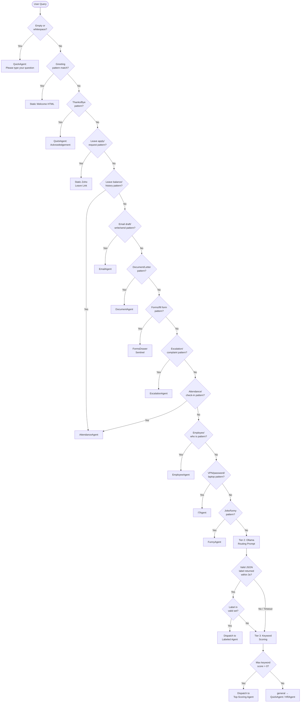

# Routing Engine — AA-Hackathon Enterprise AI Platform

**Aligned Automation | Platform Architecture Series**
**Version:** 1.0 | **Date:** 2026-06-07 | **Status:** Production

---

## 1. Overview

The Routing Engine is the decision layer inside `MasterAgent` (`supervisor_agent.py`) that maps each inbound user query to the correct domain agent or direct response. It operates in three sequential tiers, each more computationally expensive than the last, with earlier tiers short-circuiting when a confident match is found.

**Design goal:** Maximize routing accuracy while minimizing latency and LLM cost. The vast majority of common enterprise queries (leave, attendance, email, escalation) should be handled by fast-path regex in under 5 ms.

---

## 2. Three-Tier Architecture

```
Query
  │
  ▼
┌─────────────────────────────────────────────────────────┐
│ Tier 1: Fast-Path Regex (<5 ms, zero LLM cost)         │
│  • Pattern match against compiled regex dictionary      │
│  • 15+ pattern groups covering high-frequency intents   │
│  • Direct dispatch or static response on match          │
└────────────────────────┬────────────────────────────────┘
                         │ no match
                         ▼
┌─────────────────────────────────────────────────────────┐
│ Tier 2: LLM Intent Classification (200–500 ms)         │
│  • Ollama routing prompt → JSON domain label            │
│  • 13 valid output labels                               │
│  • Timeout fallback to Tier 3                           │
└────────────────────────┬────────────────────────────────┘
                         │ timeout / invalid JSON / unknown label
                         ▼
┌─────────────────────────────────────────────────────────┐
│ Tier 3: Keyword Scoring Fallback (<10 ms)              │
│  • DOMAIN_KEYWORDS dict scoring                         │
│  • Highest domain score wins                            │
│  • Tie-break by priority order                          │
└────────────────────────┬────────────────────────────────┘
                         ▼
                   Domain Agent / Static Response
```

---

## 3. Tier 1 — Fast-Path Regex Patterns

All patterns are compiled at startup. The pattern evaluation loop exits on first match (priority order matters).

### 3.1 Pattern Registry

**Group 1 — Leave Management**

| Pattern | Example Queries | Output |
|---|---|---|
| `apply.*leave`, `leave.*apply`, `take.*leave`, `request.*leave` | "I want to apply for leave", "Can I take leave tomorrow?" | Zoho Leave link: `https://people.zoho.com/…/apply-leave` |
| `leave.*balance`, `how many.*leave`, `leaves remaining` | "What is my leave balance?", "How many leaves do I have?" | AttendanceAgent (Zoho integration) |
| `leave.*cancel`, `cancel.*leave` | "Cancel my leave application for Friday" | Zoho Leave management link |
| `leave.*history`, `past.*leave`, `leave.*taken` | "Show me my leaves taken this month" | AttendanceAgent |
| `comp.*off`, `compensatory.*leave` | "Apply comp off for working Saturday" | Zoho Comp-off link |

**Group 2 — Email Drafting**

| Pattern | Example Queries | Output |
|---|---|---|
| `draft.*email`, `write.*email`, `compose.*email` | "Draft an email to my team about the outage" | EmailAgent |
| `send.*email`, `email.*to` | "Send an email to HR about my joining date" | EmailAgent |
| `email.*template`, `template.*email` | "Give me an email template for client escalation" | EmailAgent |

**Group 3 — Forms and Documents**

| Pattern | Example Queries | Output |
|---|---|---|
| `experience.*letter`, `experience letter` | "I need an experience letter" | DocumentAgent |
| `salary.*slip`, `payslip`, `pay.*slip` | "Download my salary slip for April" | DocumentAgent → Zoho Payroll link |
| `form.*16`, `form16`, `tds.*certificate` | "Get my Form 16 for this year" | DocumentAgent |
| `loan.*proof`, `loan.*letter`, `proof.*loan` | "I need a loan proof letter from HR" | DocumentAgent |
| `address.*proof`, `employment.*proof` | "Can I get an employment verification letter?" | DocumentAgent |
| `forms`, `fill.*form`, `submit.*form` | "Which form do I fill for medical reimbursement?" | FormsDrawer sentinel (opens form overlay) |

**Group 4 — Escalation**

| Pattern | Example Queries | Output |
|---|---|---|
| `escalat(e\|ion)`, `raise.*ticket`, `raise.*issue` | "I need to escalate this", "Raise a ticket for my laptop issue" | EscalationAgent |
| `speak.*human`, `talk.*person`, `talk.*hr`, `talk.*manager` | "I want to speak to a real person" | EscalationAgent |
| `complaint`, `grievance`, `raise.*complaint` | "I want to file a complaint" | EscalationAgent |

**Group 5 — Greeting / Small Talk Entry**

| Pattern | Example Queries | Output |
|---|---|---|
| `^(hi\|hello\|hey\|good morning\|good afternoon\|good evening\|howdy)` | "Hi", "Hello there", "Good morning!" | Static welcome message (HTML, no agent) |

Static welcome HTML:
```html
<p>Hello! I'm your Aligned Automation AI Assistant.</p>
<p>I can help you with:</p>
<ul>
  <li>HR queries — leaves, policies, payroll</li>
  <li>IT support — VPN, passwords, equipment</li>
  <li>Admin — travel, cab booking, facilities</li>
  <li>Finance — expenses, TDS, reimbursements</li>
  <li>Documents — letters, certificates, forms</li>
</ul>
<p>What can I help you with today?</p>
```

**Group 6 — Attendance**

| Pattern | Example Queries | Output |
|---|---|---|
| `attendance`, `check.*in`, `check.*out`, `mark.*attendance` | "Mark my attendance", "Did I check in today?" | AttendanceAgent |
| `late.*coming`, `early.*leaving`, `wfh.*request`, `work.*from.*home` | "Apply for WFH tomorrow", "Mark late coming" | AttendanceAgent → Zoho WFH link |
| `regularize.*attendance`, `attendance.*regularization` | "I need to regularize my attendance for last Monday" | AttendanceAgent |

**Group 7 — Employee / Directory**

| Pattern | Example Queries | Output |
|---|---|---|
| `who is`, `who.*manager`, `who.*head` | "Who is the head of IT?", "Who is my manager?" | EmployeeAgent |
| `employees in`, `team.*members`, `my team` | "Who are the employees in the Finance team?" | EmployeeAgent |
| `contact.*of`, `number.*of`, `email.*of` (person names heuristic) | "What is Priya's email?" | EmployeeAgent |
| `org.*chart`, `organization.*chart`, `reporting.*structure` | "Show me the org chart for PMO" | EmployeeAgent |

**Group 8 — IT Support**

| Pattern | Example Queries | Output |
|---|---|---|
| `vpn.*not.*working`, `vpn.*issue`, `cannot.*connect.*vpn` | "My VPN is not working" | ITAgent |
| `password.*reset`, `forgot.*password`, `reset.*password` | "I forgot my email password" | ITAgent |
| `laptop.*issue`, `computer.*slow`, `system.*crash` | "My laptop is very slow today" | ITAgent |

**Group 9 — Quick Conversational**

| Pattern | Example Queries | Output |
|---|---|---|
| `^(thanks?\|thank you\|ok\|okay\|got it\|understood\|noted)$` | "Thanks", "Got it", "OK" | QuickAgent (brief acknowledgement) |
| `^(bye\|goodbye\|see you\|take care)$` | "Bye", "See you" | QuickAgent (closing message) |

**Group 10 — Humour / Casual**

| Pattern | Example Queries | Output |
|---|---|---|
| `tell.*joke`, `make.*laugh`, `funny.*something`, `joke` | "Tell me a joke", "Say something funny" | FunnyAgent |

---

## 4. Tier 2 — LLM Intent Classification

### 4.1 Routing Prompt

When no Tier 1 pattern matches, MasterAgent sends the following prompt to Ollama at `ml01.alignedautomation.com:11434`:

```
You are a routing classifier for an enterprise AI assistant at Aligned Automation.
Your ONLY task is to classify the user's query into exactly one domain label.

Valid domain labels:
- hr         : HR policies, benefits, performance reviews, general HR queries
- it         : Technical support, software, hardware, VPN, passwords, security
- admin      : Travel, facilities, transport, cab booking, housekeeping, parking
- pmo        : Projects, milestones, sprints, timelines, resource allocation
- finance    : Expenses, reimbursements, TDS, Form 16, budgets, invoices
- org        : Company news, culture, leadership, strategy, announcements
- employee   : Employee directory, org chart, team structure, contact info
- attendance : Leave, check-in, WFH, attendance regularization, comp-off
- document   : Letters, certificates, forms, document generation
- email      : Drafting, composing, sending emails
- escalation : Complaints, grievances, human escalation requests
- funny      : Jokes, humour, casual entertainment
- general    : Anything that doesn't fit the above categories

User query: "{user_query}"

Respond with ONLY a JSON object, no explanation:
{"domain": "<label>"}
```

**Model parameters for routing call:**
- Temperature: 0.1 (deterministic classification)
- `num_predict`: 20 (JSON response is short)
- `num_ctx`: 512 (routing prompt is small)

### 4.2 Response Parsing

```python
import json
import re

def parse_routing_response(raw: str) -> str:
    try:
        match = re.search(r'\{.*?\}', raw, re.DOTALL)
        data = json.loads(match.group())
        label = data.get("domain", "")
        if label in VALID_LABELS:
            return label
    except Exception:
        pass
    return None  # triggers Tier 3
```

### 4.3 Timeout Handling

The Ollama routing call is wrapped with a timeout of **3 seconds**. If the call:
- Times out (aiohttp `asyncio.TimeoutError`)
- Returns malformed JSON
- Returns an invalid label
- Raises a connection error

...the system logs a `routing_llm_timeout` event and immediately proceeds to Tier 3. No retry is performed on the routing call itself (Tier 3 is the fallback, not a retry).

---

## 5. Tier 3 — Keyword Scoring

### 5.1 DOMAIN_KEYWORDS Dictionary

```python
DOMAIN_KEYWORDS = {
    "hr": [
        "leave", "policy", "payroll", "benefit", "appraisal", "performance",
        "increment", "probation", "resignation", "offer", "onboarding",
        "employee", "handbook", "code of conduct", "grievance", "pf",
        "esic", "gratuity", "bonus", "relieving", "noc", "training"
    ],
    "it": [
        "vpn", "password", "laptop", "software", "hardware", "install",
        "access", "login", "error", "crash", "slow", "network", "wifi",
        "email client", "outlook", "teams", "zoom", "ticket", "support",
        "antivirus", "backup", "server", "cloud", "azure", "active directory"
    ],
    "admin": [
        "travel", "parking", "cab", "transport", "accommodation", "hotel",
        "booking", "cafeteria", "food", "housekeeping", "stationery",
        "courier", "visitor", "badge", "access card", "pantry", "water"
    ],
    "pmo": [
        "project", "milestone", "sprint", "timeline", "delivery", "deadline",
        "resource", "allocation", "jira", "backlog", "status", "report",
        "risk", "dependency", "stakeholder", "kickoff", "retrospective",
        "velocity", "burndown", "scope", "requirement", "release"
    ],
    "finance": [
        "expense", "tds", "form16", "reimbursement", "invoice", "budget",
        "claim", "petty cash", "advance", "salary", "ctc", "tax", "gst",
        "purchase order", "vendor payment", "account", "deduction", "payslip"
    ],
    "org": [
        "company", "culture", "announcement", "leadership", "vision",
        "mission", "strategy", "values", "ceo", "management", "town hall",
        "update", "newsletter", "achievement", "award", "recognition",
        "holiday", "festival", "event", "team building"
    ],
    "employee": [
        "who is", "contact", "directory", "org chart", "team", "department",
        "manager", "head", "reporting", "structure", "colleague", "peer",
        "profile", "designation", "location", "phone number", "email id"
    ],
    "attendance": [
        "attendance", "check in", "check out", "wfh", "work from home",
        "regularize", "comp off", "late", "half day", "leave balance",
        "holiday list", "national holiday", "punch", "biometric", "swipe"
    ],
    "document": [
        "experience letter", "employment letter", "salary certificate",
        "loan letter", "noc letter", "address proof", "verification letter",
        "certificate", "form 16", "payslip download", "document request"
    ],
    "email": [
        "draft email", "write email", "compose", "send mail", "email template",
        "formal email", "professional email", "mail to team"
    ],
    "escalation": [
        "escalate", "escalation", "complaint", "grievance", "issue not resolved",
        "speak to human", "talk to manager", "raise ticket", "raise issue",
        "not satisfied", "urgent"
    ],
    "funny": [
        "joke", "funny", "laugh", "humour", "humor", "entertain", "riddle",
        "pun", "comic", "lighten up", "cheer me up"
    ],
    "general": []  # fallback, always score 0
}
```

### 5.2 Scoring Algorithm

```python
def keyword_score(query: str) -> str:
    query_lower = query.lower()
    scores = {}
    for domain, keywords in DOMAIN_KEYWORDS.items():
        score = sum(1 for kw in keywords if kw in query_lower)
        scores[domain] = score

    max_score = max(scores.values())
    if max_score == 0:
        return "general"

    # Priority order for tie-breaking
    priority = ["hr", "it", "admin", "pmo", "finance", "org",
                "employee", "attendance", "document", "email",
                "escalation", "funny", "general"]

    for domain in priority:
        if scores[domain] == max_score:
            return domain
```

---

## 6. Fast-Path to Agent Dispatch Mapping

| Fast-Path Group | Routed Agent / Response |
|---|---|
| Leave apply/request | Static Zoho link + AttendanceAgent context |
| Leave balance | AttendanceAgent |
| Leave cancel | Static Zoho link |
| Leave history | AttendanceAgent |
| Comp-off | Static Zoho comp-off link |
| Draft/write/send email | EmailAgent |
| Experience letter | DocumentAgent |
| Salary slip / payslip | DocumentAgent → Zoho Payroll link |
| Form 16 / TDS | DocumentAgent |
| Loan proof | DocumentAgent |
| Employment verification | DocumentAgent |
| Forms / fill form | FormsDrawer sentinel (special frontend action) |
| Escalate / raise ticket | EscalationAgent |
| Speak to human | EscalationAgent |
| Complaint / grievance | EscalationAgent |
| Greeting | Static welcome HTML |
| Attendance / check-in | AttendanceAgent |
| WFH request | AttendanceAgent → Zoho WFH link |
| Regularize attendance | AttendanceAgent |
| Who is / team members | EmployeeAgent |
| VPN / password / laptop | ITAgent |
| Thanks / bye | QuickAgent |
| Joke / funny | FunnyAgent |

---

## 7. FormsDrawer Sentinel

The `FormsDrawer` output is a special sentinel string rather than an agent:

```python
FORMS_DRAWER_SENTINEL = "__OPEN_FORMS_DRAWER__"
```

When the frontend receives this sentinel in the SSE stream, it triggers the forms drawer UI overlay rather than rendering a chat message. This enables direct form interactions (medical reimbursement, travel request, etc.) without a conversational detour.

---

## 8. Multi-Domain Ambiguity Resolution

Some queries score equally across multiple domains. Resolution strategy:

**Example:** "I need help with the project expense reimbursement"
- `pmo` score: 2 (project, resource)
- `finance` score: 2 (expense, reimbursement)
- Tie: `finance` wins by priority order (finance > pmo)

**Example:** "My attendance is wrong and I need to raise a ticket"
- `attendance` score: 2 (attendance, regularize)
- `escalation` score: 2 (raise ticket, issue)
- Tie: `attendance` wins by priority order

**Cross-domain queries** (clearly spanning two domains):
- The winning agent is dispatched, but its system prompt instructs it to acknowledge the multi-domain nature and offer to connect to the secondary agent.
- Example: HR + Finance query → HRAgent handles, offers to loop in FinanceAgent.

---

## 9. Edge Cases

### 9.1 Empty Query

- Input: empty string or whitespace only
- Fast-path: no match
- LLM: not invoked
- Fallback: QuickAgent with "Please type your question and I'll be happy to help."

### 9.2 Very Long Query (> 500 characters)

- Truncated to 500 characters for routing purposes only (full query sent to agent).
- LLM routing uses the truncated version.
- Keyword scoring uses the full text.

### 9.3 Non-English Input

- Fast-path: regex patterns may partially match transliterated text.
- LLM routing: Ollama handles Hindi/regional language classification reasonably well.
- Keyword scoring: limited effectiveness.
- Fallback: `general` → QuickAgent with a note that the platform is optimized for English queries.

### 9.4 Code or SQL in Query

- Tier 1 security check catches SQL injection patterns first.
- If it passes Tier 1 (e.g., code snippet for IT help): LLM routing classifies as `it`.
- ITAgent handles code-related technical queries.

### 9.5 Agent Override in Request

If the frontend sends `"agent_type": "<specific_agent>"` in the POST body (used by the quick-access panel), all three routing tiers are bypassed and the specified agent is dispatched directly. RBAC validation still applies.

---

## 10. Routing Decision Tree



---

## 11. Performance Benchmarks

| Tier | Mechanism | Typical Latency | P99 Latency |
|---|---|---|---|
| Tier 1 Fast-Path | Compiled regex | < 1 ms | < 5 ms |
| Tier 2 LLM | Ollama inference | 200 ms | 500 ms |
| Tier 3 Keyword | Dict lookup + scoring | < 2 ms | < 10 ms |

**Routing hit rate targets:**
- Tier 1: >= 60% of all queries (high-frequency enterprise intents)
- Tier 2: ~35% of queries
- Tier 3: ~5% of queries (LLM timeout / ambiguous queries)

---

## 12. Routing Observability

Every routing decision is logged:

```python
{
    "event": "routing_decision",
    "session_id": "uuid",
    "user_id": "oid",
    "query_length": 45,
    "tier_used": 1,           # 1, 2, or 3
    "fast_path_group": "leave_apply",   # if Tier 1
    "llm_label": null,                  # if Tier 2
    "keyword_scores": {},               # if Tier 3
    "routed_agent": "AttendanceAgent",
    "routing_latency_ms": 2.1
}
```

This data feeds the evaluation framework (see `evaluation-framework.md`) to track routing accuracy and identify patterns that need new fast-path rules.
