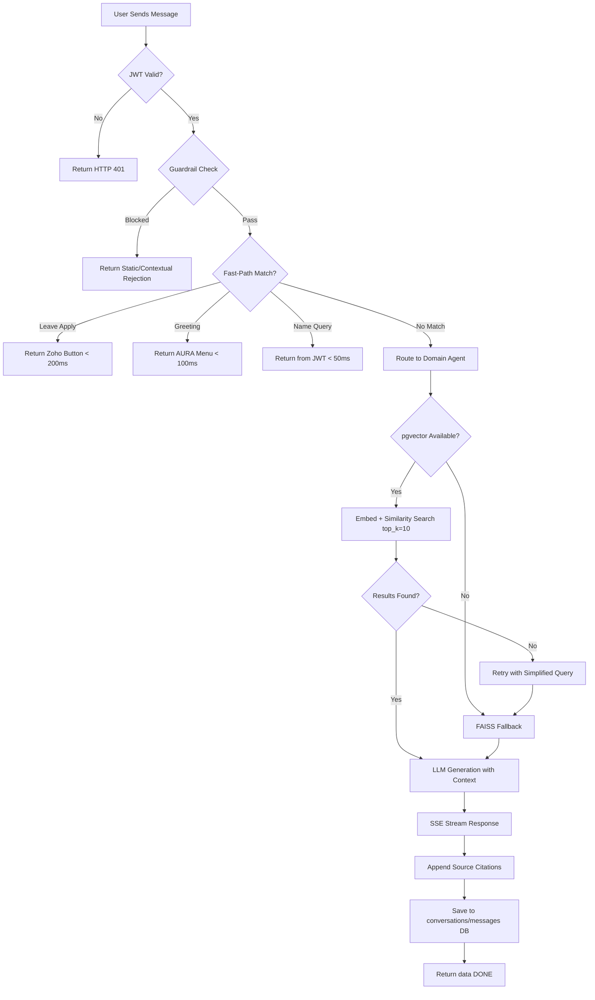

# Acceptance Criteria Specification
## AURA — AI-Powered Enterprise Assistant Platform
### Aligned Automation Internal Operations

**Document Version:** 1.0  
**Date:** 2026-06-07  
**Status:** Active

---

## Definition of Done (Platform-Wide)

Every feature on AURA must satisfy the following platform-wide Definition of Done (DoD) before it is considered complete:

1. **Functional:** All acceptance criteria in this document and the linked user story pass in the staging environment
2. **Tested:** Unit tests written and passing; integration test covering the primary happy path; edge cases documented
3. **Secured:** JWT validation applied; RBAC enforced for privileged operations; no SQL injection vulnerabilities (bandit passes); no PII in logs
4. **Documented:** Feature catalog entry updated; API endpoint documented in OpenAPI (`/docs`)
5. **Observable:** Errors logged at ERROR level with traceback; routing decisions logged at INFO level; health endpoint updated if new dependency added
6. **Reviewed:** Code reviewed by at least one other engineer; no critical ESLint or flake8 violations
7. **Deployed:** Feature merged to main; deployed to staging without container restart failures; health check passes post-deploy

---

## Acceptance Criteria Flow

---

## Feature Acceptance Criteria

---

### AC-CHAT-001 — Chat SSE Streaming

**Test Scenarios:**

| Scenario | Input | Expected Result |
|----------|-------|-----------------|
| Normal streaming | "What is the leave policy?" | SSE data chunks arrive progressively; DONE event terminates stream |
| First token timing | Any LLM-backed query | First `data:` chunk arrives within 1 second of request |
| HTML rendering | Response with `<strong>`, `<ul>`, `<li>` | HTML rendered correctly in MessageBubble; no raw tags shown |
| Stream completion | Any query | `data: [DONE]` event received; thinking spinner stops |
| Source citation | Query with pgvector match | `
Sources
<ul><li><a href="...">PolicyName</a></li></ul>` appended |
| Client disconnect | Close browser mid-stream | Server-side generator exits cleanly; no exception in server logs |
| SSE headers | Any streaming request | `Content-Type: text/event-stream`, `Cache-Control: no-cache`, `X-Accel-Buffering: no` present |

**Pass Definition:** All 7 scenarios pass in automated integration test with running Ollama and pgvector.

---

### AC-CHAT-002 — Fast-Path Responses

| Scenario | Input | Expected Max Latency | Expected Behavior |
|----------|-------|---------------------|-------------------|
| Leave apply | "I want to apply for leave" | 200ms | Zoho People button shown; no LLM call |
| Leave apply variant | "How to apply leave?" | 200ms | Same Zoho button response |
| Greeting | "hi" | 100ms | AURA introduction menu |
| Greeting | "good morning" | 100ms | AURA introduction menu |
| Name query | "What is my name?" (user_name=Prashant) | 50ms | "Your name is Prashant." |
| Non-fast-path | "What is my leave balance?" | N/A (routed to HR) | Routed to HRAgent; not fast-path |

**Verification:** Automated timing test records `time.perf_counter()` before request and at first SSE chunk. All fast-paths must beat their latency target in 10/10 runs.

---

### AC-AUTH-001 — Azure AD SSO Authentication

| Scenario | Condition | Expected Result |
|----------|-----------|-----------------|
| Unauthenticated request | No Authorization header | HTTP 401, `{"detail": "Not authenticated"}` |
| Expired token | Token exp < current time | HTTP 401, `{"detail": "Token expired"}` |
| Tampered signature | Modified JWT payload | HTTP 401, `{"detail": "Invalid token"}` |
| Wrong audience | aud != Azure client ID | HTTP 401 |
| Valid token | Correct JWT from Azure AD | HTTP 200; `user["email"]`, `user["user_id"]`, `user["name"]` populated |
| Token validation timing | Valid token | Validation completes in <200ms (JWKS cached) |
| Session storage | Post-login | Token in sessionStorage, not localStorage |

**Verification:** Unit test with test JWTs (valid, expired, tampered). Integration test with MSAL in test tenant.

---

### AC-AUTH-002 — RBAC Enforcement

| Role | Endpoint | Expected Result |
|------|----------|-----------------|
| `user` | `GET /api/admin/escalations` | HTTP 403 |
| `user` | `GET /api/coo-analytics/metrics` | HTTP 403 |
| `admin` | `GET /api/admin/escalations` | HTTP 200 |
| `coo` (executive) | `GET /api/coo-analytics/metrics` | HTTP 200 |
| `hr` | `GET /api/conversations/{other_user_id}` | HTTP 403 (not owner) |
| Any authenticated | `GET /api/conversations` (own) | HTTP 200 |

**Verification:** Integration test with tokens for each role calling each protected endpoint. All RBAC failures logged in audit_logs.

---

### AC-HR-001 — HR Agent Policy Retrieval

| Scenario | Query | Expected Behavior |
|----------|-------|-------------------|
| Leave policy | "How many annual leaves do I have?" | Policy details from pgvector; cites document name |
| WFH policy | "What is the WFH policy?" | WFH terms from pgvector; exact days/approval process |
| Empty pgvector result | Obscure policy query | Retry with simplified query; FAISS fallback if still empty |
| Source citation | Any policy query with pgvector match | `file_name` appears in sources section |
| Fallback contact | Unanswerable query | "Please contact HR at hr@alignedautomation.com" |
| Inter-employee salary | "What is Jane's salary?" | Tier-2 guardrail block; polite redirect |

**Verification:** Integration test with test pgvector chunks. Automated assertion that `source_url` appears when pgvector returns results.

---

### AC-DOC-001 — Document Generation (All 11 Types)

| Document Type | Trigger Query | Expected Behavior |
|--------------|---------------|-------------------|
| experience_letter | "I need an experience letter" | Multi-turn collection starts; 8 fields collected; letter generated |
| loan_proof | "I need a loan proof letter" | Multi-turn collection starts; 9 fields collected |
| employment_verification | "I need employment verification" | 7 fields collected; letter generated |
| offer_letter | "I need an offer letter" | 9 fields collected; letter generated |
| relieving_letter | "I need a relieving letter" | 8 fields collected; letter generated |
| address_proof | "I need address proof" | 6 fields collected; letter generated |
| bonafide | "I need a bonafide certificate" | 8 fields collected; certificate generated |
| internship_certificate | "I need an internship certificate" | 8 fields collected; certificate generated |
| promotion_letter | "I need a promotion letter" | Fields collected; letter generated |
| noc | "I need a NOC" | Fields collected; NOC generated |
| confirmation_letter | "I need a confirmation letter" | Fields collected; letter generated |

**Additional Criteria:**
- Multi-turn session persists across messages keyed by `user_email`
- Off-topic message during collection cancels session; notification shown; new query handled
- Session cleared after successful generation
- Generated document formatted as professional corporate letter (letterhead, body, signature)
- Document stored in DB and accessible in DocumentsPage

**Verification:** Automated integration test for each document type. Verify session state creation, field collection, generation, and clearance.

---

### AC-EMAIL-001 — Email Drafting

| Scenario | Condition | Expected Result |
|----------|-----------|-----------------|
| Intent detection | "Draft an email about VPN issues" | `__EMAIL_DRAFT_INTENT__` sentinel returned |
| Email format | Draft generated | To, Subject, Body fields populated and separated |
| TO field | IT escalation email | To=`it@alignedautomation.com` or relevant default |
| Quality | Draft quality | Subject professional; body complete and grammatically correct |
| Draft display | Frontend receives email | EmailAgentPage shows formatted draft with editable fields |
| Send action | User clicks Send | Outlook mailto link opens with pre-filled To/Subject/Body |
| LLM failure | Ollama unavailable | Clear error message; manual compose option suggested |

**Verification:** Integration test calling `/api/email-agent/from-chat` with sample queries. Verify response contains `to`, `refined_subject`, `refined_body`.

---

### AC-ESC-001 — Escalation Management

| Scenario | Condition | Expected Result |
|----------|-----------|-----------------|
| Create escalation | Valid payload, authenticated | HTTP 201; escalation record with ID returned |
| Required fields | Missing subject or reason | HTTP 422 validation error |
| List user escalations | GET /api/escalations | Returns only authenticated user's escalations |
| Pagination | Page=1, limit=5 | Returns max 5 escalations with total count |
| Status filter | status=OPEN | Returns only OPEN escalations |
| Admin view | Admin GET /api/admin/escalations | All users' escalations returned |
| Non-admin admin view | User GET /api/admin/escalations | HTTP 403 |
| Status update | PATCH /api/escalations/{id}/status | Status updated; resolution notes saved with timestamp |
| Conversation link | Escalation created from chat | conversation_id and message_id stored correctly |

**Verification:** Integration test covering all CRUD operations. RBAC test for admin endpoint.

---

### AC-ONB-001 — Onboarding Portal

| Scenario | Condition | Expected Result |
|----------|-----------|-----------------|
| Portal access | New employee first login | Onboarding module accessible |
| Step display | GET /api/onboarding/profile | Employee profile displayed in step 1 |
| All 8 steps | Navigate all steps | All steps accessible with titles, descriptions, HR notes |
| Progress persistence | Close browser, reopen | Progress maintained from previous session |
| HR notes | Any step | HR notes visible per step |
| Completion | All 8 steps completed | Completion event recorded; HR notification triggered |
| Skip step | Mark as skipped | Step marked skipped; HR notified; return possible |

**Verification:** End-to-end test with a test employee profile in Zoho People. Verify all 8 steps load and completion event fires.

---

### AC-ANA-001 — Analytics Dashboard

| Scenario | Condition | Expected Result |
|----------|-----------|-----------------|
| Dashboard load | Admin authenticated | Dashboard loads with real data (no mock data) in <3 seconds |
| Chart count | Dashboard render | 10 chart components visible and populated |
| Date filter | Select 7-day range | All 10 charts update to reflect 7-day data |
| Non-admin access | User role navigates to analytics | HTTP 403 or redirect to chat |
| Feedback chart | Feedback data exists | Positive/negative ratio trend shown correctly |
| Escalation chart | Escalations exist | Volume chart shows correct counts by status |
| Empty date range | Future date range | Charts show "No data" state gracefully |

**Verification:** Integration test with seeded analytics data. Verify chart renders with correct data points.

---

### AC-ANA-002 — COO Analytics Dashboard

| Scenario | Condition | Expected Result |
|----------|-----------|-----------------|
| Executive access | COO role | HTTP 200 from `/api/coo-analytics/metrics` |
| Non-executive access | Manager role | HTTP 403 |
| Metrics completeness | Response body | `total_users`, `mau`, `dau`, `total_conversations`, `agent_adoption`, `satisfaction_score` all present |
| Response latency | Normal DB load | Response in <2 seconds |
| Agent adoption | Conversations across domains | Breakdown shows % per domain (HR, IT, Admin, etc.) |

**Verification:** Integration test calling endpoint with executive and non-executive tokens.

---

### AC-SP-001 — SharePoint Ingestion

| Scenario | Condition | Expected Result |
|----------|-----------|-----------------|
| New document ingested | New SharePoint doc | Document chunked, embedded, stored in document_chunks |
| Chunk size | 1000-character document | Document split into chunks of ≤1000 characters with 200-character overlap |
| Changed document | Modification timestamp newer | Document re-ingested; old chunks replaced |
| Deleted document | Document removed from SharePoint | Chunks soft-deleted in document_chunks table |
| Source URL | Chunk in pgvector | `source_url` populated with SharePoint document URL |
| Embedding dimension | Chunk embedded | Embedding stored as `vector(768)` |
| Connection pool | Concurrent ingestion | Min=1, max=8 connections; no pool exhaustion |

**Verification:** Ingestion job integration test with mock SharePoint API and real pgvector. Verify chunk table before and after for each scenario.

---

## Performance Acceptance Criteria

| Metric | Target | Measurement Method | Pass Condition |
|--------|--------|-------------------|----------------|
| Chat p50 latency | ≤3 seconds | k6 load test, 50 VUs | p50 ≤3s in 5-minute sustained run |
| Chat p95 latency | ≤5 seconds | k6 load test, 50 VUs | p95 ≤5s in 5-minute sustained run |
| Streaming first token | ≤1 second | Timing from request to first SSE chunk | 95% of requests <1s |
| Fast-path latency | ≤200ms | Timer on apply-leave and greeting fast-paths | 100% of requests <200ms |
| COO analytics latency | ≤2 seconds | Integration test response timing | All runs <2s |
| Health endpoint | ≤5 seconds | HTTP GET /api/health timing | Always <5s |
| Embedding inference | ≤200ms per query | Unit test of `embed_query()` | p95 <200ms after model warm |
| DB connection acquisition | ≤50ms | Pool acquire timing in integration test | p95 <50ms |

**Load Test Configuration:**
- Tool: k6 or Locust
- Virtual users: 50 concurrent
- Ramp: 0 → 50 VUs over 60 seconds
- Sustained duration: 5 minutes at 50 VUs
- Query mix: 40% HR policy, 25% employee lookup, 20% IT, 15% other

---

## Security Acceptance Criteria

| Criterion | Test Method | Pass Condition |
|-----------|------------|----------------|
| No SQL injection | bandit scan + manual test | Zero SQL injection warnings; parameterized queries in all DB access |
| JWT required on all protected routes | Test each route without token | HTTP 401 returned for all 20+ protected endpoints |
| PII not logged in plaintext | Log analysis after 100 queries | No email addresses, salaries, or personal data in server logs |
| Guardrail blocks jailbreaks | Test suite of 50 adversarial prompts | 100% of jailbreak patterns blocked |
| RBAC enforced server-side | Test privileged endpoints with user-level tokens | HTTP 403 for all unauthorized role attempts |
| CORS production restriction | Browser CORS test from external origin | Cross-origin requests from non-AURA domain rejected |
| Audit log completeness | Trigger each auditable event | audit_logs row created for each event type |

---

## Data Integrity Acceptance Criteria

| Criterion | Test Method | Pass Condition |
|-----------|------------|----------------|
| Conversation isolation | User A reads user B's conversation ID | HTTP 403 returned |
| Soft-delete behavior | DELETE conversation, then GET | Conversation returns HTTP 404 (not 200 with is_deleted=true) |
| Feedback value constraint | Submit feedback value=2 | HTTP 422 validation error |
| Escalation conversation link | Create escalation from chat | `conversation_id` and `message_id` in escalation record match |
| pgvector chunk metadata | Query retrieval result | `file_name`, `source_url`, `similarity` all present in every result |
| Attendance date resolution | Query attendance for month | Records match correct month (not off-by-one due to timezone) |

---

## Monitoring and Alerting Acceptance Criteria

| Alert | Trigger Condition | Action |
|-------|------------------|--------|
| Uptime alert | 3 consecutive `/api/health` failures | On-call notification |
| Latency alert | p95 chat latency >5s for 5 minutes | On-call notification; check Ollama |
| Error rate alert | API 5xx rate >1% for 5 minutes | On-call notification |
| Retry rate alert | Retry rate >10% of requests | Warning alert; check Ollama stability |
| Pool utilization alert | DB pool utilization >80% for 1 minute | Warning alert; check slow queries |
| Feedback quality alert | Negative feedback ratio >30% for 7 days | Engineering team notification for agent review |
| Guardrail spike alert | Guardrail block rate spikes >10% in 1 hour | Security investigation |

**Verification:** Configure test alerts in monitoring tool. Inject failure conditions in staging and verify alert fires within 5 minutes.
