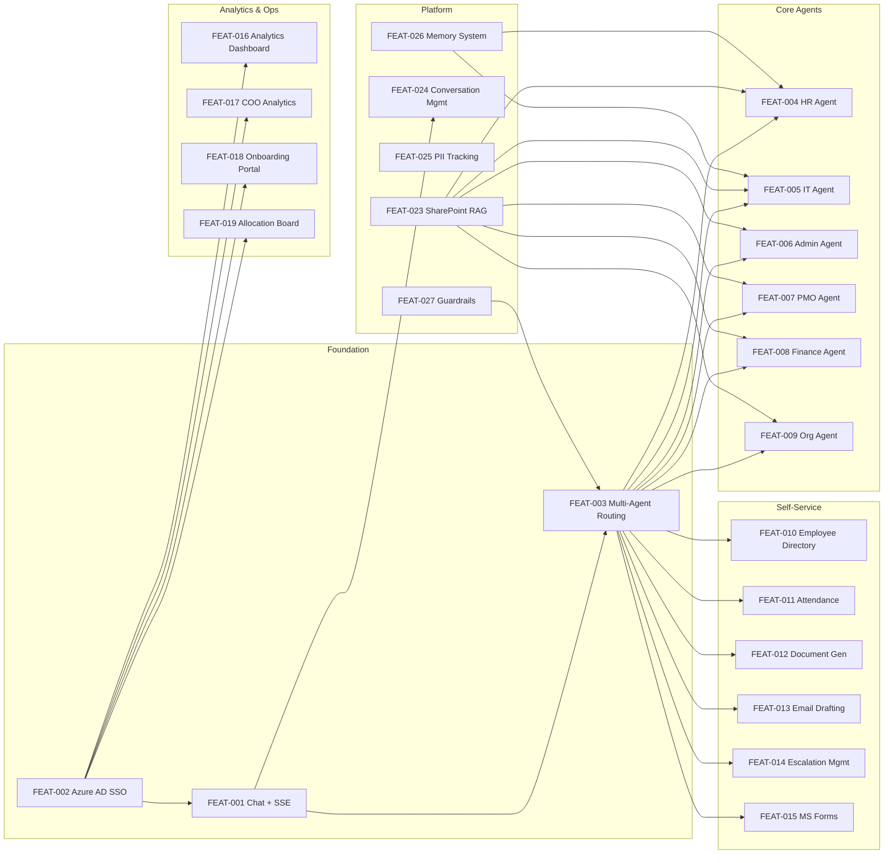

# Feature Catalog
## AURA — AI-Powered Enterprise Assistant Platform
### Aligned Automation Internal Operations

**Document Version:** 1.0  
**Date:** 2026-06-07  
**Status:** Active

---

## Overview

This catalog documents all 27 implemented features of the AURA platform. Each entry includes a Feature ID, name, implementation status, description, component file references, API endpoints, dependencies, and version introduced.

**Status Definitions:**
- `implemented` — Fully functional and deployed
- `beta` — Functional but with known limitations
- `planned` — Specified but not yet implemented

---

## Feature Dependency Map

---

## Feature Entries

### FEAT-001 — Conversational AI Chat
**Status:** implemented  
**Version:** 1.0  
**Description:** The core chat interface with SSE token streaming. Users type questions in the ChatWindow; responses stream back token-by-token using Server-Sent Events. HTML-formatted responses are rendered with syntax highlighting for code blocks, numbered lists, bullet points, and source citation links. The UI shows animated thinking phrases while waiting for the first token.

**Backend Components:**
- `apps/api-gateway/app/api/controllers/chat_controller.py` — `/api/chat` (JSON) and `/api/chat/stream` (SSE) endpoints
- `apps/api-gateway/app/api/services/chat_service.py` — orchestrates message processing and persistence
- `apps/api-gateway/app/agents/supervisor_agent.py` — `MasterAgent.stream_query()` async generator

**Frontend Components:**
- `apps/web-ui/src/components/ChatWindow.jsx` — chat UI with SSE consumer, streaming render, thinking phrases
- `apps/web-ui/src/components/MessageBubble.jsx` — message rendering with HTML support

**API Endpoints:**
- `POST /api/chat` — synchronous JSON response
- `POST /api/chat/stream` — SSE streaming response

**Dependencies:** Azure AD JWT (FEAT-002), MasterAgent routing (FEAT-003), Ollama LLM at ml01

---

### FEAT-002 — Azure AD SSO
**Status:** implemented  
**Version:** 1.0  
**Description:** Authentication via Microsoft MSAL.js in SPA mode. Users log in with their Aligned Automation Microsoft account. The ID token provides `name`, `email`, and `oid` (user ID). Graph API is called optionally for department and jobTitle enrichment. Token is stored in sessionStorage and sent as Bearer JWT on every API call.

**Backend Components:**
- `apps/api-gateway/app/api/auth/auth_handler.py` — `get_current_user()` FastAPI dependency; JWT validation
- `apps/api-gateway/app/api/auth/jwt_validator.py` — RS256 signature verification via Azure JWKS

**Frontend Components:**
- `apps/web-ui/src/components/LoginPage.jsx` — MSAL login trigger and redirect handler
- `apps/web-ui/src/config/authConfig.js` — MSAL config (clientId, tenantId, scopes, redirect URI)

**API Endpoints:**
- All `/api/*` endpoints require `Authorization: Bearer <JWT>` header

**Dependencies:** Azure Active Directory tenant, MSAL.js, Microsoft Graph API

---

### FEAT-003 — Multi-Agent Routing
**Status:** implemented  
**Version:** 1.0  
**Description:** The `MasterAgent` (supervisor_agent.py) implements a 3-tier routing pipeline. Tier 1: Deterministic fast-paths (leave apply regex, forms regex, email regex, attendance regex, employee regex, document regex, greetings). Tier 2: Domain keyword scoring against 12 keyword lists. Tier 3: LLM routing via Ollama with 5-second timeout for ambiguous queries. Routes to 13 domain agents: hr, it, admin, pmo, finance, org, employee, attendance, document, email, forms, escalation, funny/general.

**Backend Components:**
- `apps/api-gateway/app/agents/supervisor_agent.py` — `MasterAgent._route()`, `_route_keywords()`, `_route_llm()`

**Frontend Components:** None (purely backend)

**API Endpoints:** Called internally by `chat_controller.py`

**Dependencies:** All domain agents (FEAT-004 through FEAT-015), Ollama LLM (for LLM routing fallback), Guardrails (FEAT-027)

---

### FEAT-004 — HR Agent
**Status:** implemented  
**Version:** 1.0  
**Description:** Domain agent for HR queries — leave policies, payroll, benefits, POSH, GHI, PF/EPF, WFH policy, appraisals, onboarding/offboarding. Extends `BaseDeepAgent` which implements the full RAG pipeline: pgvector retrieval → adaptive retry → FAISS supplement → LLM generation with personality prompt. Fallback contact: `hr@alignedautomation.com`.

**Backend Components:**
- `apps/api-gateway/app/agents/working/hr_agent.py` — `HRAgent(BaseDeepAgent)`, data folders: HR Policies, HR Document
- `apps/api-gateway/app/agents/working/base_deep_agent.py` — `BaseDeepAgent` base class with RAG pipeline
- `apps/api-gateway/app/agents/working/personalities.py` — `HR_PERSONALITY` system prompt
- `apps/api-gateway/app/agents/working/knowledge_base.py` — local FAISS KB

**Frontend Components:** Used via ChatWindow (FEAT-001)

**API Endpoints:** Called internally by MasterAgent

**Dependencies:** pgvector RAG (FEAT-023), Ollama LLM, Memory System (FEAT-026), FAISS local KB

---

### FEAT-005 — IT Agent
**Status:** implemented  
**Version:** 1.0  
**Description:** Domain agent for IT support queries — VPN, MFA, password reset, software, network, OneDrive, Outlook, antivirus, hardware requests, Polycom. Extends `BaseDeepAgent` with IT-specific personality and data folders.

**Backend Components:**
- `apps/api-gateway/app/agents/working/it_agent.py` — `ITAgent(BaseDeepAgent)`
- `apps/api-gateway/app/agents/working/base_deep_agent.py` — RAG pipeline

**Frontend Components:** Used via ChatWindow (FEAT-001)

**API Endpoints:** Called internally by MasterAgent

**Dependencies:** pgvector RAG (FEAT-023), Ollama LLM, FAISS local KB

---

### FEAT-006 — Admin Agent
**Status:** implemented  
**Version:** 1.0  
**Description:** Domain agent for administrative queries — travel bookings, cab/ORIX/Cabman, parking, Fountainhead facilities, meeting room booking, office supplies, vendor invoicing. Extends `BaseDeepAgent` with Admin personality.

**Backend Components:**
- `apps/api-gateway/app/agents/working/admin_agent.py` — `AdminAgent(BaseDeepAgent)`

**Frontend Components:** Used via ChatWindow (FEAT-001)

**API Endpoints:** Called internally by MasterAgent

**Dependencies:** pgvector RAG (FEAT-023), Ollama LLM

---

### FEAT-007 — PMO Agent
**Status:** implemented  
**Version:** 1.0  
**Description:** Domain agent for project management queries — project status, milestones, risk management, resource allocation, change requests for clients (ABI, NCR, Spencer, Dell, Eli Lilly). Tightly coupled with the Allocation Board feature (FEAT-019).

**Backend Components:**
- `apps/api-gateway/app/agents/working/pmo_agent.py` — `PMOAgent(BaseDeepAgent)`

**Frontend Components:**
- `apps/web-ui/src/components/AllocationBoard.jsx` — visual PMO allocation view

**API Endpoints:** Called internally by MasterAgent; board data via `/api/allocation/*`

**Dependencies:** pgvector RAG (FEAT-023), Ollama LLM, allocation_controller.py

---

### FEAT-008 — Finance Agent
**Status:** implemented  
**Version:** 1.0  
**Description:** Domain agent for finance queries — ZOHO expense submission, TDS declarations, income tax, Form 16, expense reimbursement, Kotak salary account setup. Extends `BaseDeepAgent`.

**Backend Components:**
- `apps/api-gateway/app/agents/working/finance_agent.py` — `FinanceAgent(BaseDeepAgent)`

**Frontend Components:** Used via ChatWindow (FEAT-001)

**API Endpoints:** Called internally by MasterAgent

**Dependencies:** pgvector RAG (FEAT-023), Ollama LLM

---

### FEAT-009 — Org Agent
**Status:** implemented  
**Version:** 1.0  
**Description:** Domain agent for company information — mission, vision, values, culture, leadership, organizational structure, announcements. Uses `OrgDeepAgent` (not `BaseDeepAgent` directly) to handle org-specific context enrichment.

**Backend Components:**
- `apps/api-gateway/app/agents/org_agent.py` — `OrgDeepAgent`

**Frontend Components:** Used via ChatWindow (FEAT-001)

**API Endpoints:** Called internally by MasterAgent

**Dependencies:** pgvector RAG (FEAT-023), Ollama LLM

---

### FEAT-010 — Employee Directory
**Status:** implemented  
**Version:** 1.0  
**Description:** Searches the Zoho People database view (`people.vb_employees`) for employee profiles. Supports: name lookup, department listing, headcount queries, skill search, reporting manager lookup, self-profile ("my designation", "who am I"). Results include full profile: employee ID, name, email, designation, department, mobile, work phone, manager, DOJ, location, role, grade, level, skills, experience.

**Backend Components:**
- `apps/api-gateway/app/agents/employee/employee_agent.py` — `employee_agent()` function
- `apps/api-gateway/app/agents/employee/config.py` — column names, view name
- `apps/api-gateway/app/api/controllers/profile_controller.py` — `GET /api/profile`

**Frontend Components:** Used via ChatWindow (FEAT-001)

**API Endpoints:**
- `GET /api/profile` — authenticated user's own profile

**Dependencies:** Zoho People PostgreSQL DB (`ZOHO_DB_HOST`), RBAC (FEAT-002)

---

### FEAT-011 — Attendance Tracking
**Status:** implemented  
**Version:** 1.0  
**Description:** Provides employee attendance records for current and prior month. Employee name is resolved from Zoho People by authenticated user's email before querying the AURA attendance table. Managers can query their reportees' attendance. AttendanceAgent handles natural language attendance queries in chat.

**Backend Components:**
- `apps/api-gateway/app/agents/employee/attendance_agent.py` — `attendance_agent()` function; natural language attendance queries
- `apps/api-gateway/app/api/controllers/attendance_controller.py` — REST endpoints
- `apps/api-gateway/app/api/services/attendance_service.py` — business logic, Zoho People name resolution

**Frontend Components:** Used via ChatWindow (FEAT-001); REST API consumed directly for structured views

**API Endpoints:**
- `GET /api/attendance/me` — authenticated user's attendance
- `GET /api/attendance/reportee?name={name}&month={YYYY-MM}` — manager view of reportee attendance

**Dependencies:** Zoho People DB, AURA attendance table, RBAC (FEAT-002)

---

### FEAT-012 — Document Generation
**Status:** implemented  
**Version:** 1.0  
**Description:** Generates 11 professional HR/corporate document types via multi-turn conversation. DocumentAgent identifies the requested document type, collects required fields one at a time, then calls Ollama LLM to generate the document. Session state held in-memory keyed by `user_email`. Documents can be viewed in DocumentsPage and downloaded.

**Document Types:** loan_proof, experience_letter, employment_verification, offer_letter, relieving_letter, address_proof, bonafide, internship_certificate, promotion_letter, noc, confirmation_letter

**Backend Components:**
- `apps/api-gateway/app/agents/document_agent.py` — `DocumentAgent`, `DOCUMENT_TYPES` catalog, `has_active_session()`, `cancel_session()`
- `apps/api-gateway/app/api/controllers/documents_controller.py` — REST document management
- `apps/api-gateway/app/api/services/` (implied document service)

**Frontend Components:**
- `apps/web-ui/src/components/DocumentsPage.jsx` — document listing and download UI

**API Endpoints:**
- `GET /api/documents` — list user's generated documents
- `GET /api/documents/{id}` — retrieve generated document content

**Dependencies:** Ollama LLM (for generation), MasterAgent document session management, RBAC (FEAT-002)

---

### FEAT-013 — Email Drafting
**Status:** implemented  
**Version:** 1.0  
**Description:** Detects email drafting intent (regex patterns: "draft email", "write email", "compose email") and returns a sentinel `__EMAIL_DRAFT_INTENT__`. The frontend opens the EmailAgentPage which displays the drafted email (To, Subject, Body) and provides a "Send" button that opens the Outlook mailto link. The Email Agent (`email_agent.py`) uses Ollama to refine subject and body.

**Backend Components:**
- `apps/api-gateway/app/agents/email_agent.py` — `draft_email_from_chat()` function
- `apps/api-gateway/app/api/controllers/email_controller.py` — REST endpoint

**Frontend Components:**
- `apps/web-ui/src/components/EmailAgentPage.jsx` — email draft display and send UI

**API Endpoints:**
- `POST /api/email-agent/from-chat` — draft email from conversation context

**Dependencies:** Ollama LLM, MasterAgent email fast-path, RBAC (FEAT-002)

---

### FEAT-014 — Escalation Management
**Status:** implemented  
**Version:** 1.0  
**Description:** Full escalation lifecycle: create, track, admin view, and status update. Escalations are linked to conversations and messages for full context. The EscalationDrawer in the UI provides a structured form. Admin view (`/api/admin/escalations`) provides cross-user visibility. Status transitions: OPEN → IN_PROGRESS → RESOLVED → CLOSED.

**Backend Components:**
- `apps/api-gateway/app/agents/escalation_agent.py` — natural language escalation query handler
- `apps/api-gateway/app/api/controllers/escalations_controller.py` — `esc_router` and `admin_router`
- `apps/api-gateway/app/api/services/escalations_service.py` — business logic
- `apps/api-gateway/app/api/models/escalation_model.py` — Pydantic models

**Frontend Components:**
- `apps/web-ui/src/components/EscalationDrawer.jsx` — escalation form and drawer panel

**API Endpoints:**
- `POST /api/escalations` — create escalation
- `GET /api/escalations` — list user's escalations (paginated)
- `GET /api/escalations/{id}` — get escalation detail
- `PATCH /api/escalations/{id}/status` — update status (admin)
- `GET /api/admin/escalations` — admin view (all users)

**Dependencies:** RBAC (FEAT-002), conversations/messages (FEAT-024), escalations DB table

---

### FEAT-015 — Microsoft Forms Creation
**Status:** implemented  
**Version:** 1.0  
**Description:** Creates Microsoft Forms / surveys / questionnaires on behalf of the authenticated user using Microsoft Graph API. Intent detected by regex in MasterAgent, which returns the sentinel `__MS_FORMS_INTENT__`. The FormsDrawer collects form title, description, and questions (up to 10 questions with type: text/multiple choice/rating). Calls `POST /api/forms/create` which uses delegated Graph API permissions.

**Backend Components:**
- `apps/api-gateway/app/agents/ms_forms_agent.py` — forms creation logic
- `apps/api-gateway/app/api/controllers/forms_controller.py` — REST endpoint

**Frontend Components:**
- `apps/web-ui/src/components/FormsDrawer.jsx` — form builder UI with question types

**API Endpoints:**
- `POST /api/forms/create` — create Microsoft Form via Graph API

**Dependencies:** Microsoft Graph API (`Tasks.Read` or `Forms.ReadWrite.All`), Azure AD SSO (FEAT-002), MSAL token

---

### FEAT-016 — Analytics Dashboard
**Status:** implemented  
**Version:** 1.0  
**Description:** Admin analytics dashboard with 10 Recharts visualization components. Charts: total conversations (line), messages per day (bar), active users (area), agent usage distribution (pie), query domain breakdown (bar), feedback score trend (line), escalation volume (bar), document generation by type (horizontal bar), peak usage hours (radar), conversation length distribution (scatter).

**Backend Components:**
- `apps/api-gateway/app/api/controllers/` (analytics endpoints, likely coo_analytics_controller.py and feedback_controller.py for aggregate data)

**Frontend Components:**
- `apps/web-ui/src/modules/analytics/` — analytics module (components, pages, services, hooks, constants)

**API Endpoints:**
- `GET /api/coo-analytics/metrics` — aggregate metrics
- `GET /api/feedback/admin` — feedback analytics
- Various conversation/message aggregate endpoints

**Dependencies:** RBAC (admin role), PostgreSQL aggregation, Recharts library

---

### FEAT-017 — COO Analytics
**Status:** implemented  
**Version:** 1.0  
**Description:** Executive-level dashboard showing platform adoption and ROI metrics restricted to COO/executive roles. Metrics: total registered users, monthly active users (MAU), daily active users (DAU), total conversations, agent adoption breakdown by domain, satisfaction score (positive feedback ratio), escalation resolution rate, knowledge base coverage.

**Backend Components:**
- `apps/api-gateway/app/api/controllers/coo_analytics_controller.py` — `GET /api/coo-analytics/metrics`
- `apps/api-gateway/app/api/services/coo_analytics_service.py` — metric aggregation queries

**Frontend Components:**
- `apps/web-ui/src/modules/coo-analytics/` — COO module (index.js, pages, services)

**API Endpoints:**
- `GET /api/coo-analytics/metrics` — executive metrics JSON

**Dependencies:** RBAC (executive/COO role), PostgreSQL, Recharts, analytics module (FEAT-016)

---

### FEAT-018 — Onboarding Portal
**Status:** implemented  
**Version:** 1.0  
**Description:** Guided 8-step onboarding experience for new employees. Steps cover: (1) profile review in Zoho People, (2) IT access setup (laptop, email, VPN), (3) Practo health enrollment, (4) HROne registration, (5) leave policy reading, (6) first day checklist, (7) team introduction, (8) compliance training. Progress tracked per employee via database. HR notes visible per step.

**Backend Components:**
- `apps/api-gateway/app/api/onboarding.py` — onboarding API router at `/api/onboarding`

**Frontend Components:**
- `apps/web-ui/src/modules/onboarding-guidance/` — onboarding module (components, pages, services, hooks, utils)

**API Endpoints:**
- `GET /api/onboarding/profile?email={email}` — get employee profile for onboarding
- Additional onboarding progress endpoints

**Dependencies:** Zoho People DB, RBAC (FEAT-002), HR Agent (FEAT-004) for policy step

---

### FEAT-019 — Allocation Board
**Status:** implemented  
**Version:** 1.0  
**Description:** Visual PMO allocation board showing project assignments, resource allocation percentages, team structure (executive, business_lead, functional_lead, team_lead, employee tiers), and project timeline view. Role-aware: executives see full allocation data; others see their own scope.

**Backend Components:**
- `apps/api-gateway/app/api/controllers/allocation_controller.py` — allocation endpoints
- `apps/api-gateway/app/api/services/allocation_service.py` — business logic and DB queries

**Frontend Components:**
- `apps/web-ui/src/components/AllocationBoard.jsx` — allocation board UI

**API Endpoints:**
- `GET /api/allocation/projects` — project list with allocation data
- `GET /api/allocation/resources` — resource allocation by person

**Dependencies:** RBAC (ALLOCATION_ROLES: executive, business_lead, functional_lead, team_lead, employee), AURA DB allocation tables

---

### FEAT-020 — Personal Notes
**Status:** implemented  
**Version:** 1.0  
**Description:** User-private scratchpad panel in the right sidebar. Notes are persisted per user and accessible across sessions. Supports basic text formatting. Notes are user-owned and not accessible to admins.

**Frontend Components:**
- `apps/web-ui/src/components/PersonalNotes.jsx` — notes panel UI

**API Endpoints:** (Notes stored client-side or via user-specific notes endpoint)

**Dependencies:** RBAC (FEAT-002) for user isolation

---

### FEAT-021 — Quick Links
**Status:** implemented  
**Version:** 1.0  
**Description:** Configurable quick-access panel in the right sidebar with shortcuts to frequently used portals: Zoho People, HROne, SharePoint, Outlook Web, OneDrive, Practo. Links are configured in `quickLinksConfig.js` and rendered in the RightPanel component.

**Frontend Components:**
- `apps/web-ui/src/config/quickLinksConfig.js` — link definitions (name, URL, icon)
- `apps/web-ui/src/components/RightPanel.jsx` — renders quick links panel

**Dependencies:** None (static configuration)

---

### FEAT-022 — User Feedback
**Status:** implemented  
**Version:** 1.0  
**Description:** Per-message thumbs up/down feedback stored in the `feedback` table. Values: 1 (positive), -1 (negative), 0 (neutral/retracted). Users can change their feedback. Feedback is linked to conversation_id, message_id, and user_id. Aggregate feedback data feeds analytics dashboards (FEAT-016, FEAT-017).

**Backend Components:**
- `apps/api-gateway/app/api/controllers/feedback_controller.py` — `msg_router`, `conv_router`, `fb_router`, `admin_router`
- `apps/api-gateway/app/api/services/feedback_service.py` — feedback CRUD logic

**Frontend Components:**
- `apps/web-ui/src/components/MessageBubble.jsx` — thumbs up/down UI per message

**API Endpoints:**
- `POST /api/messages/{id}/feedback` — submit feedback on message
- `GET /api/conversations/{id}/feedback` — get feedback for conversation
- `GET /api/admin/feedback` — admin feedback aggregate view

**Dependencies:** messages table, users table, analytics (FEAT-016)

---

### FEAT-023 — SharePoint RAG
**Status:** implemented  
**Version:** 1.0  
**Description:** The RAG (Retrieval-Augmented Generation) knowledge base built from SharePoint Online documents. Ingestion job downloads documents, chunks them (500 tokens, 50 overlap), embeds with `all-MiniLM-L6-v2` (384-dim), and stores in `document_chunks` pgvector table. At query time, `retriever.py` embeds the query and performs cosine similarity search (`<=>` operator) returning `top_k=10` most relevant chunks.

**Backend Components:**
- `apps/api-gateway/app/rag/retriever.py` — `retrieve_chunks()` runtime query function; connection pool min=1/max=8
- `apps/api-gateway/jobs/sharepoint_ingestion/` — ingestion job (document download, chunking, embedding, pgvector upsert)

**Frontend Components:** None (purely backend)

**Dependencies:** SharePoint Online (`SHAREPOINT_SITE_URL`), PostgreSQL + pgvector, HuggingFace `all-MiniLM-L6-v2`, psycopg2

---

### FEAT-024 — Conversation Management
**Status:** implemented  
**Version:** 1.0  
**Description:** Full CRUD for conversations. Users can create new conversations, list their conversation history, rename conversations, soft-delete conversations, and search conversations by title/content. Each conversation stores: user_id, title, created_at, updated_at, is_deleted. Messages are linked to conversations.

**Backend Components:**
- `apps/api-gateway/app/api/controllers/conversations_controller.py` — conversation CRUD endpoints
- `apps/api-gateway/app/api/services/conversations_service.py` — business logic

**Frontend Components:**
- `apps/web-ui/src/components/Sidebar.jsx` — conversation list, rename, delete, search

**API Endpoints:**
- `GET /api/conversations` — list user's conversations
- `POST /api/conversations` — create conversation
- `PATCH /api/conversations/{id}` — rename conversation
- `DELETE /api/conversations/{id}` — soft-delete conversation
- `GET /api/conversations/{id}/messages` — list messages in conversation

**Dependencies:** RBAC (FEAT-002), messages table, feedback table

---

### FEAT-025 — PII Tracking
**Status:** implemented  
**Version:** 1.0  
**Description:** PII event tracking system that logs when personally identifiable information is detected in queries or responses. Admin dashboard shows PII event history by type, user, and time. PII rules can be managed via admin API. Events stored in `pii_events` table, redaction metadata in `pii_redactions` table.

**Backend Components:**
- `apps/api-gateway/app/api/controllers/pii_controller.py` — PII admin endpoints
- `apps/api-gateway/app/api/services/pii_service.py` — PII detection and event logging

**Frontend Components:** Integrated into admin analytics view

**API Endpoints:**
- `GET /api/pii/events` — admin view of PII events
- `POST /api/pii/rules` — admin: add PII detection rule
- `GET /api/pii/analytics` — PII event aggregate statistics

**Dependencies:** RBAC (admin role), pii_events table, pii_redactions table, audit_logs table

---

### FEAT-026 — Memory System
**Status:** beta  
**Version:** 1.0  
**Description:** Per-user memory system providing context to agents beyond the current conversation. Three memory tiers: (1) `user_preferences` — user-specific preferences and settings (600 char limit), (2) `conversation_memory` — recent conversation summary (1200 char), (3) `user_history` and `collective_intelligence` (deep queries only, 1200+800 chars). Memory classification (`complexity.py`) decides depth: simple or deep. Markdown store (`md_store.py`) handles file-based persistence.

**Backend Components:**
- `apps/api-gateway/app/memory/client.py` — `MemoryClient.get_context()` main interface
- `apps/api-gateway/app/memory/complexity.py` — query depth classifier (simple vs deep)
- `apps/api-gateway/app/memory/md_store.py` — markdown file persistence per user
- `apps/api-gateway/app/memory/db_tool.py` — DB context fetch for deep queries
- `apps/api-gateway/app/memory/enrichment.py` — memory enrichment pipeline

**Frontend Components:** None (purely backend)

**Dependencies:** BaseDeepAgent (FEAT-004+), DB tool, filesystem for md_store

---

### FEAT-027 — Guardrails
**Status:** implemented  
**Version:** 1.0  
**Description:** 2-tier safety system applied to every user query before routing. Tier 1 (Generic): regex-based detection of jailbreak patterns, harmful content (bomb-making, harm instructions), and security threats (hack, phish, steal credentials) — static rejection without LLM. Distress signals (suicidal ideation, self-harm) trigger LLM empathetic response. Tier 2 (Organizational): inter-employee salary queries, legal advice requests, speculation about company financials — LLM contextual redirect. `GENERIC_GUARDRAIL` and `ORG_GUARDRAIL` constants injected into every agent system prompt.

**Backend Components:**
- `apps/api-gateway/app/agents/guardrails.py` — `check_input()`, `GENERIC_GUARDRAIL`, `ORG_GUARDRAIL`, `DISTRESS_PROMPT`, `ORG_SCOPE_PROMPT`

**Frontend Components:** None (purely backend)

**Dependencies:** Ollama LLM (for contextual responses to distress/org-scope categories), audit_logs table

---

## Future Feature Backlog

| Feature ID | Name | Target Version | Description |
|-----------|------|---------------|-------------|
| FEAT-028 | Mobile-Responsive UI | v1.1 | Full mobile layout optimization |
| FEAT-029 | Voice Input | v1.1 | Web Speech API integration (scaffolded in ChatWindow.jsx) |
| FEAT-030 | Proactive Notifications | v1.2 | Push alerts for policy updates, appraisals, IT maintenance |
| FEAT-031 | Redis Session Store | v1.1 | Migrate DocumentAgent sessions from in-memory to Redis for multi-instance |
| FEAT-032 | Conversation Export | v1.1 | Export conversation history as PDF or Markdown |
| FEAT-033 | Agent Builder UI | v1.2 | No-code configuration UI for new domain agents |
| FEAT-034 | Tavily Web Search Integration | v1.1 | Web search fallback for unanswered queries (tool scaffolded in agents/working/tools/tavily_search.py) |
| FEAT-035 | Multi-Tenant Support | v2.0 | White-label deployment for Aligned Automation clients |
| FEAT-036 | Outlook Add-in | v1.2 | AURA embedded in Outlook compose context panel |
| FEAT-037 | GDPR Data Export | v1.1 | User data export (DSAR compliance) |
