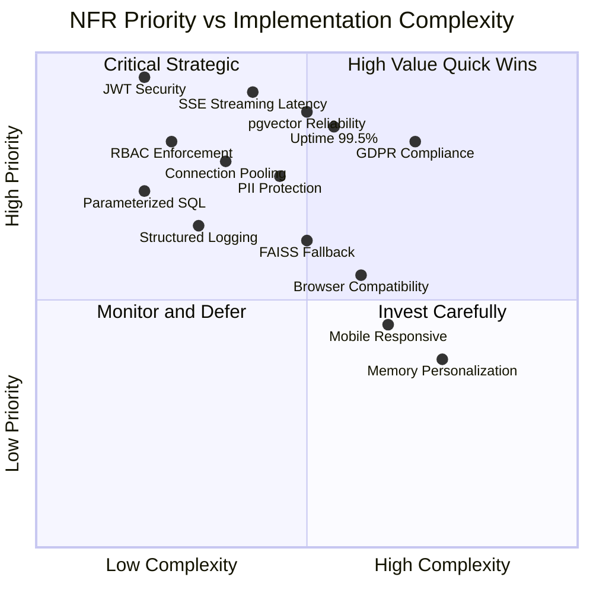

# Non-Functional Requirements Specification
## AURA — AI-Powered Enterprise Assistant Platform
### Aligned Automation Internal Operations

**Document Version:** 1.0  
**Date:** 2026-06-07  
**Status:** Active

---

## Overview

This document specifies all non-functional requirements (NFRs) for the AURA platform. NFRs define the quality attributes, constraints, and operational characteristics that the system must satisfy irrespective of specific functional behaviors. Each NFR includes a priority, measurable acceptance criteria, testing approach, and monitoring threshold.

---

## NFR Priority Matrix

---

## 1. Performance

### NFR-PERF-001 — Chat Response Latency
**Priority:** P0  
**Requirement:** The `POST /api/chat` (non-streaming) endpoint must return the complete AI response within:
- p50 (median): ≤ 3 seconds
- p95: ≤ 5 seconds
- p99: ≤ 10 seconds

These targets apply under normal operating conditions (Ollama available, pgvector reachable, ≤50 concurrent users).

**Acceptance Criteria:**
- Load test of 50 concurrent users shows p95 <5s
- Slow queries (>5s) are logged with full timing breakdown
- Alert fires when p95 exceeds 5s for 5 consecutive minutes

**Testing Approach:** Locust or k6 load test with 50 virtual users, HR and IT query mix, 5-minute sustained run.  
**Monitoring Threshold:** Alarm at p95 >5s; page at p95 >10s.

---

### NFR-PERF-002 — Streaming First-Token Latency
**Priority:** P0  
**Requirement:** The `POST /api/chat/stream` SSE endpoint must deliver the first `data:` chunk to the client within 1 second of request receipt. This is the primary perceived latency for the streaming experience.

**Acceptance Criteria:**
- First SSE chunk arrives in <1 second for fast-path responses (greetings, leave redirect)
- First chunk arrives in <1 second for LLM-backed responses (routing + first token from Ollama)
- Measured at API boundary (not including client render time)

**Testing Approach:** Automated test records time from request send to first `data:` event received.  
**Monitoring Threshold:** Alert when >5% of streaming requests exceed 2s to first chunk.

---

### NFR-PERF-003 — Fast-Path Response Latency
**Priority:** P0  
**Requirement:** Responses that do not require LLM invocation (greetings, leave application redirect, name query, guardrail blocks) must respond in <500ms including network overhead.

**Acceptance Criteria:**
- Greeting responses: <100ms
- Leave application redirect: <200ms
- Name fast-path: <50ms
- Guardrail static blocks: <100ms

**Testing Approach:** Unit tests with timing assertions. Integration test against running server.  
**Monitoring Threshold:** Alert if any fast-path response exceeds 500ms in production.

---

### NFR-PERF-004 — API Timeout and Retry Policy
**Priority:** P0  
**Requirement:** All outbound HTTP calls from the API (to Ollama, SharePoint, Graph API, Zoho People) use a 30-second timeout. Failed calls retry up to 3 times with a 1-second delay between attempts. Total maximum wait = 30s + 3×(30s+1s) = ~123s absolute maximum. In practice, most calls succeed on first attempt.

**Acceptance Criteria:**
- Timeout of 30s applied to all `requests.post()` and `requests.get()` calls
- Three retry attempts with 1s inter-attempt delay
- Failed retry chain returns graceful error message to user
- Retry count and failure logged at WARNING level

**Testing Approach:** Mock Ollama endpoint with controllable latency. Inject failures to trigger retry chain.  
**Monitoring Threshold:** Alert when >10% of requests trigger any retry. Page when retry exhaustion >1% of requests.

---

### NFR-PERF-005 — Database Connection Pool Performance
**Priority:** P1  
**Requirement:** The PostgreSQL connection pool (psycopg2 `ThreadedConnectionPool`) is configured with `minconn=1, maxconn=8`. Under normal load, connection acquisition must complete in <50ms. Connection pool exhaustion must be handled gracefully.

**Acceptance Criteria:**
- Pool initialized at application start (no cold-start penalty on first request)
- Connection acquisition p95 <50ms
- Pool exhaustion returns HTTP 503 with `Retry-After` header rather than blocking indefinitely
- Connections returned to pool after each request (via context manager or explicit `putconn`)

**Testing Approach:** Concurrent test with 8+ simultaneous requests to observe pool behavior.  
**Monitoring Threshold:** Alert when pool utilization >80% for >1 minute.

---

### NFR-PERF-006 — Embedding Inference Latency
**Priority:** P1  
**Requirement:** The `nomic-embed-text-v1.5` embedding model (768-dim) must be loaded once per process via `@lru_cache` and subsequent embedding calls must complete in <200ms for a single query string.

**Acceptance Criteria:**
- Model loaded on first retrieval call, cached for all subsequent calls
- Single query embedding generation <200ms
- Batch embedding (during ingestion) <2s per 10 chunks

**Testing Approach:** Timing test calling `_get_embedder().embed_query()` 100 times after cache warm-up.  
**Monitoring Threshold:** Alert if embedding latency exceeds 500ms.

---

## 2. Scalability

### NFR-SCALE-001 — Horizontal API Scaling
**Priority:** P1  
**Requirement:** The FastAPI application is stateless at the API layer (all state in PostgreSQL and pgvector). Multiple API instances can run behind a load balancer without shared in-process state. Exception: DocumentAgent session state is in-memory and must be migrated to Redis or PostgreSQL for multi-instance deployments.

**Acceptance Criteria:**
- API starts and handles requests with no local state dependency (except DocumentAgent sessions)
- Multiple instances can serve the same user's requests interchangeably
- DocumentAgent limitation documented and tracked for v1.1 migration

**Testing Approach:** Run 2 API instances behind nginx. Route requests across both and verify consistent behavior.

---

### NFR-SCALE-002 — Concurrent User Support
**Priority:** P1  
**Requirement:** The platform must support at least 50 concurrent active users without degradation beyond the latency targets in NFR-PERF-001.

**Acceptance Criteria:**
- 50 concurrent VUs in load test complete within p95 <5s
- Error rate <0.1% at 50 VUs
- Connection pool holds under 50 concurrent DB operations

**Testing Approach:** Locust load test: 50 VUs, ramp from 1 to 50 over 60s, sustain for 300s.

---

### NFR-SCALE-003 — pgvector Index Performance
**Priority:** P1  
**Requirement:** The pgvector HNSW or IVFFlat index on `document_chunks.embedding` must support similarity search over 100,000+ chunks with query latency <300ms.

**Acceptance Criteria:**
- Index exists on `document_chunks.embedding` column
- Query latency <300ms for `top_k=10` over 100K vectors
- Index rebuilt on bulk ingestion via `VACUUM ANALYZE`

**Testing Approach:** Insert 100K test chunks, run 1000 similarity queries, measure p95.

---

## 3. Reliability

### NFR-REL-001 — System Uptime
**Priority:** P0  
**Requirement:** The AURA API must maintain ≥99.5% monthly uptime excluding planned maintenance windows. Planned maintenance must be communicated at least 24 hours in advance via Slack/email.

**Acceptance Criteria:**
- Monthly uptime measured via health endpoint `/api/health` polling every 60 seconds
- Downtime = consecutive failures for >3 minutes
- Planned maintenance documented and communicated

**Testing Approach:** External uptime monitor (UptimeRobot or equivalent) polling `/api/health`.  
**Monitoring Threshold:** Alert after 3 consecutive health check failures. Page after 10 consecutive failures (>10 minutes down).

---

### NFR-REL-002 — Health Endpoint
**Priority:** P0  
**Requirement:** `GET /api/health` returns a JSON response with system component status within 5 seconds. Response must include: API status, database connectivity, pgvector connectivity, and Ollama reachability. Returns HTTP 200 when all healthy, HTTP 503 when any critical component is unhealthy.

**Acceptance Criteria:**
- Response format: `{"status": "healthy|degraded|unhealthy", "db": "ok|error", "ollama": "ok|error", "pgvector": "ok|error"}`
- HTTP 200 when all components healthy
- HTTP 503 when database or pgvector unavailable
- HTTP 200 with `"status": "degraded"` when only Ollama unreachable (FAISS fallback active)
- Health check itself completes in <5s

**Testing Approach:** Integration test with mocked component failures.  
**Monitoring Threshold:** Alert on HTTP 503 from health endpoint.

---

### NFR-REL-003 — Graceful Degradation
**Priority:** P1  
**Requirement:** When Ollama (ml01) is unreachable, agents must fall back to FAISS local knowledge base for RAG retrieval and return a reduced-quality but still informative response. When pgvector is unreachable, agents fall back to FAISS. When Zoho People DB is unreachable, employee and attendance features return a clear error message.

**Acceptance Criteria:**
- Ollama unreachable: MasterAgent logs warning, FAISS fallback activated
- pgvector unreachable: FAISS fallback activated, response quality reduced but functional
- Zoho DB unreachable: Employee/attendance endpoints return HTTP 503 with descriptive message
- No unhandled exceptions bubble to the user as stack traces

**Testing Approach:** Kill Ollama and Zoho DB connections in test environment. Verify fallback behavior.

---

### NFR-REL-004 — Exception Handling
**Priority:** P0  
**Requirement:** No unhandled exceptions in the API layer reach the user as raw stack traces. All `Exception` paths in controllers catch and log the exception, then return a structured HTTP error response with a human-readable `detail` field.

**Acceptance Criteria:**
- All controller functions have try/except with logging
- HTTP 500 responses include `{"detail": "<human-readable message>"}` not stack traces
- Exceptions logged at ERROR level with full traceback in server logs
- MasterAgent `process_query` top-level catch prevents chat failures

**Testing Approach:** Inject exceptions at each controller and verify JSON error response.

---

## 4. Security

### NFR-SEC-001 — JWT Validation
**Priority:** P0  
**Requirement:** Every protected API endpoint validates the Bearer JWT using RS256 signature verification against the Azure AD JWKS endpoint. Claims validated: `exp` (expiry), `aud` (audience matches Azure app client ID), `iss` (issuer matches Azure AD tenant). Token validation must complete within 200ms.

**Acceptance Criteria:**
- Missing token returns HTTP 401
- Expired token returns HTTP 401
- Tampered signature returns HTTP 401
- Wrong audience returns HTTP 401
- Valid token returns HTTP 200 and populates user context
- JWKS keys cached with appropriate TTL

**Testing Approach:** Unit test with valid, expired, tampered, and wrong-audience tokens.

---

### NFR-SEC-002 — RBAC Enforcement
**Priority:** P0  
**Requirement:** Role-based access control is enforced server-side on every protected endpoint. Frontend RBAC (userConfig.js) is a UX enhancement only. Backend must independently validate role claims from the JWT for privileged operations (admin panel, COO dashboard, escalation admin view).

**Acceptance Criteria:**
- COO analytics endpoint returns HTTP 403 for non-executive roles
- Admin escalation view returns HTTP 403 for regular users
- RBAC checks occur after JWT validation, before business logic
- Role check failures logged in audit_logs

**Testing Approach:** Integration test calling privileged endpoints with tokens for each role.

---

### NFR-SEC-003 — SQL Parameterized Queries
**Priority:** P0  
**Requirement:** All SQL queries in the platform use parameterized queries or ORM-level parameter binding. String interpolation into SQL is forbidden. This prevents SQL injection attacks.

**Acceptance Criteria:**
- Code review: no `f"SELECT ... {user_input}"` patterns in Python files
- Static analysis tool (bandit) passes without SQL injection warnings
- All psycopg2 calls use `%s` placeholder style
- All SQLAlchemy queries use bound parameters

**Testing Approach:** Bandit security scan (`bandit -r app/`). Manual code review of all DB access points.

---

### NFR-SEC-004 — PII Protection
**Priority:** P1  
**Requirement:** Personally identifiable information (salary, personal contact, health data) must not be logged in plaintext. The PII tracking system (`pii_controller.py`, `pii_service.py`) logs redaction events in `pii_events` table. Another employee's salary is blocked by Tier-2 guardrails.

**Acceptance Criteria:**
- Server logs do not contain salary or personal contact data
- PII events logged in `pii_events` table with event type, user, and timestamp
- Guardrail blocks inter-employee salary queries
- Admin PII dashboard shows redaction event history

**Testing Approach:** Log analysis for PII patterns. Integration test triggering PII guardrail and verifying pii_events insertion.

---

### NFR-SEC-005 — CORS Configuration
**Priority:** P1  
**Requirement:** CORS is configured in FastAPI via `CORSMiddleware`. In production, `allow_origins` must be restricted to the AURA frontend domain. The current development setting of `allow_origins=["*"]` must be changed before production deployment.

**Acceptance Criteria:**
- Production CORS: `allow_origins` set to AURA frontend origin only
- CORS headers present on all API responses
- Preflight OPTIONS requests return correct CORS headers

**Testing Approach:** Browser CORS test from non-AURA origin in production.

---

### NFR-SEC-006 — Guardrail Security
**Priority:** P0  
**Requirement:** The 2-tier guardrail system (`agents/guardrails.py`) must block jailbreak attempts, harmful content, and security threat queries without invoking the LLM. These categories use static regex patterns and return static rejection responses.

**Acceptance Criteria:**
- Jailbreak patterns (DAN, "ignore instructions", "reveal prompt") blocked
- Harmful content (bomb-making, harm instructions) blocked
- Security threat (hack, phish, steal credentials) blocked
- Static blocks never pass query to LLM
- Block events logged in audit_logs

**Testing Approach:** Test suite with 50+ adversarial prompts across all guardrail categories.

---

## 5. Privacy

### NFR-PRIV-001 — GDPR Considerations
**Priority:** P1  
**Requirement:** The platform stores conversation data, messages, and user activity in PostgreSQL. Users must be able to request deletion of their data. Soft-delete is implemented for conversations; a hard-delete mechanism must be implementable for GDPR data subject access requests.

**Acceptance Criteria:**
- Conversation delete (`DELETE /api/conversations/{id}`) performs soft-delete (is_deleted=true)
- Hard-delete mechanism exists for GDPR requests (admin-only endpoint)
- User data export endpoint planned for v1.1
- Data retention policy documented (see NFR-DATA-001)

**Testing Approach:** Soft-delete integration test. Hard-delete procedure documented and testable.

---

### NFR-PRIV-002 — PII Redaction Tracking
**Priority:** P1  
**Requirement:** When PII is detected in a query or response, a redaction event is logged to `pii_events` with: event type, user ID, query hash (not plaintext), timestamp, and action taken. PII is not stored in plaintext in audit logs.

**Acceptance Criteria:**
- pii_events row created for each detected PII event
- Event contains user_id, event_type, action, and timestamp
- Query stored as hash or not stored (not plaintext)
- Admin PII dashboard aggregates events by type and time

**Testing Approach:** Trigger PII guardrail and verify pii_events row created.

---

### NFR-PRIV-003 — Conversation Isolation
**Priority:** P0  
**Requirement:** Users can only read their own conversations and messages. Admin role can view all conversations for support purposes. No cross-user data leakage.

**Acceptance Criteria:**
- `GET /api/conversations` returns only authenticated user's conversations
- `GET /api/conversations/{id}` returns HTTP 403 if conversation belongs to another user (non-admin)
- Admin access to all conversations logged in audit_logs

**Testing Approach:** Integration test: user A cannot read user B's conversation ID.

---

## 6. Maintainability

### NFR-MAINT-001 — Structured Logging
**Priority:** P1  
**Requirement:** The platform uses Python's `logging` module with structured JSON format (via `logging_config.py`). Log levels: DEBUG (development), INFO (production standard), WARNING (retries, fallbacks), ERROR (exceptions). Logs include: timestamp, level, module, request_id (where available), user_id (hashed), and message.

**Acceptance Criteria:**
- All modules use `logger = logging.getLogger(__name__)`
- Log format is JSON-parseable in production
- Sensitive fields (email, salary) not logged
- Log rotation configured for production

**Testing Approach:** Run application and verify log output is valid JSON. Check no PII in logs.

---

### NFR-MAINT-002 — Code Standards
**Priority:** P1  
**Requirement:** Python code follows PEP 8. React code follows ESLint configured rules. All new agents extend `BaseDeepAgent`. All new controllers use `Depends(get_current_user)`. No hardcoded credentials or connection strings in code.

**Acceptance Criteria:**
- `flake8` passes with <5 warnings on Python codebase
- ESLint passes with zero errors on frontend
- No secrets in `.py`, `.js`, or `.jsx` files (use env vars)
- All credentials in `.env` file (gitignored)

**Testing Approach:** CI pipeline runs flake8 and ESLint on every PR.

---

### NFR-MAINT-003 — Environment Configuration
**Priority:** P0  
**Requirement:** All environment-specific values (database credentials, API keys, Ollama URL, Azure AD client IDs) are stored in `.env` files loaded via `python-dotenv` and `import.meta.env` (Vite). No values hardcoded in source files.

**Acceptance Criteria:**
- `.env.example` documents all required variables
- Application fails with descriptive error if required env var is missing
- Sensitive `.env` files are in `.gitignore`

**Testing Approach:** Start application with missing env vars and verify descriptive startup error.

---

## 7. Observability

### NFR-OBS-001 — Audit Logging
**Priority:** P1  
**Requirement:** Security-relevant events are logged to the `audit_logs` PostgreSQL table: JWT validation failures, RBAC blocks, guardrail triggers, admin escalation actions, PII events. Audit logs include: event_type, user_id, IP address (where available), timestamp, and event_detail JSON.

**Acceptance Criteria:**
- Guardrail block events insert row in audit_logs
- RBAC failure events insert row in audit_logs
- Admin actions (escalation status update) logged
- Audit log table never truncated or soft-deleted (append-only)

**Testing Approach:** Trigger each auditable event and verify audit_logs row created.

---

### NFR-OBS-002 — Request Tracing
**Priority:** P2  
**Requirement:** Each API request generates a unique `request_id` (UUID) included in response headers (`X-Request-ID`) and in all log lines for that request. Enables correlation between client errors and server logs.

**Acceptance Criteria:**
- `X-Request-ID` header present on all API responses
- Request ID included in all log lines for the request
- Client-provided `X-Request-ID` header honored if present

**Testing Approach:** Make API call and correlate request ID in response header with server log lines.

---

### NFR-OBS-003 — Agent Decision Logging
**Priority:** P1  
**Requirement:** MasterAgent logs routing decisions at INFO level including: domain selected, routing method used (fast-path/keyword/LLM), and response time. This data is used to improve routing accuracy and identify slow agents.

**Acceptance Criteria:**
- Routing decision log includes: domain, method, latency_ms
- Agent errors logged at ERROR level with exception details
- FAISS fallback activation logged at WARNING level

**Testing Approach:** Run queries through each routing path and verify expected log entries.

---

## 8. Compatibility

### NFR-COMPAT-001 — Browser Compatibility
**Priority:** P1  
**Requirement:** The AURA web UI must function correctly on:
- Google Chrome 120+
- Microsoft Edge 120+
- Mozilla Firefox 120+
- Safari 17+ (macOS/iOS — best effort)

SSE streaming requires `EventSource` API support (all modern browsers). Voice input (Web Speech API) is Chrome/Edge only and gracefully degrades.

**Acceptance Criteria:**
- Core chat functionality works on Chrome, Edge, Firefox
- Voice input disabled gracefully on unsupported browsers
- No layout breakage on 1280×720 minimum viewport
- React 18 compatibility confirmed

**Testing Approach:** Manual cross-browser test on all supported browsers. Playwright automation for smoke test.

---

### NFR-COMPAT-002 — API Version Compatibility
**Priority:** P1  
**Requirement:** API endpoints maintain backward compatibility within a major version. Breaking changes require a new major version prefix (`/api/v2/`). The OpenAPI schema at `/docs` must reflect the current API accurately.

**Acceptance Criteria:**
- `/docs` Swagger UI loads and all endpoints documented
- No endpoint removed without 30-day deprecation notice
- Response schemas stable across minor versions

**Testing Approach:** Contract test comparing OpenAPI schema before and after changes.

---

### NFR-COMPAT-003 — Python and Dependency Versions
**Priority:** P1  
**Requirement:** Backend requires Python 3.11+. Key dependencies: FastAPI, psycopg2, pgvector, langchain-ollama, langchain-huggingface, sentence-transformers. Frontend requires Node.js 18+ and React 18.

**Acceptance Criteria:**
- `requirements.txt` pins all major dependencies with version constraints
- `package.json` pins React 18.x
- Application starts cleanly on Python 3.11 and 3.12

**Testing Approach:** CI matrix test on Python 3.11 and 3.12.

---

## 9. Data Requirements

### NFR-DATA-001 — Data Retention Policy
**Priority:** P1  
**Requirement:** Retention periods by data type:
- Conversations: 90 days (soft-deleted; hard-delete on GDPR request)
- Messages: 90 days (linked to conversations)
- Feedback: Indefinite (aggregate analytics value)
- Audit logs: 365 days (compliance requirement)
- PII events: 180 days
- Document chunks: Indefinite (refreshed on re-ingestion)
- Escalations: 2 years (legal/compliance)

**Acceptance Criteria:**
- Automated cleanup job exists for expired conversations and messages
- Audit logs preserved for minimum 365 days
- Escalation records preserved for 2 years
- Retention policy document approved by legal

**Testing Approach:** Verify cleanup job deletes records older than retention period in test database.

---

### NFR-DATA-002 — Database Backup
**Priority:** P1  
**Requirement:** The AURA PostgreSQL database (`aura` DB) must be backed up daily with a 30-day retention period. pgvector index must be included in backup. Point-in-time recovery must be possible within the backup window.

**Acceptance Criteria:**
- Daily backup job runs and completes successfully
- Backup verified by periodic restore test (monthly)
- Backup storage encrypted at rest
- Recovery time objective (RTO) <4 hours

**Testing Approach:** Monthly restore drill to test environment.

---

### NFR-DATA-003 — pgvector Index Maintenance
**Priority:** P1  
**Requirement:** The pgvector index on `document_chunks.embedding` requires periodic `VACUUM ANALYZE` after bulk ingestion runs. Index configuration: HNSW with `m=16, ef_construction=64` or IVFFlat with `lists=100` (to be finalized based on corpus size).

**Acceptance Criteria:**
- `VACUUM ANALYZE document_chunks` runs after each ingestion job
- Index query plan uses vector index (not sequential scan)
- Index rebuild time <30 minutes for 100K chunks

**Testing Approach:** `EXPLAIN ANALYZE` query to verify index usage. Time index rebuild.

---

## 10. Testing Approach per NFR Category

| NFR Category | Testing Tools | Frequency |
|-------------|--------------|-----------|
| Performance (latency) | k6 / Locust load test | Pre-release, weekly in CI |
| Security (JWT, RBAC, SQL injection) | Unit tests + bandit + manual pentest | Per PR + quarterly pentest |
| Reliability (uptime, health) | UptimeRobot + integration tests | Continuous monitoring |
| Privacy (PII, GDPR) | Integration tests + log analysis | Per release |
| Compatibility (browsers) | Playwright + manual | Pre-release |
| Observability (logs, audit) | Log assertion tests | Per PR |
| Data (retention, backup) | Scheduled job tests + restore drill | Monthly |

---

## 11. Monitoring Thresholds Summary

| Metric | Warning | Critical | Action |
|--------|---------|----------|--------|
| p95 chat latency | >5s | >10s | Alert on-call, check Ollama |
| Streaming first token | >2s | >5s | Alert on-call |
| API error rate | >1% | >5% | Alert on-call, check logs |
| Health endpoint | 3 consecutive fails | 10 consecutive fails | Page on-call |
| DB pool utilization | >80% | >95% | Scale pool or optimize queries |
| Retry rate | >10% of requests | >30% of requests | Alert on Ollama stability |
| Uptime (monthly) | <99.5% | <99% | Post-mortem required |
| Guardrail block rate | Sudden spike | Sustained spike >10% | Security investigation |
| Feedback negative ratio | >30% | >50% | Review recent agent changes |
