# Product Requirements Document
## AURA — AI-Powered Enterprise Assistant Platform
### Aligned Automation Internal Operations

**Document Version:** 1.0  
**Date:** 2026-06-07  
**Owner:** Platform Engineering  
**Status:** Active

---

## 1. Vision Statement

AURA (Aligned Unified Resource Assistant) is Aligned Automation's enterprise-grade AI assistant platform that eliminates friction between employees and the information, processes, and documents they need to do their jobs. Rather than navigating multiple portals, submitting tickets, or waiting for HR and IT to respond to routine queries, every employee — from a new joiner on Day 1 to the COO reviewing platform adoption — gets instant, accurate, contextually aware answers through a single conversational interface.

AURA transforms internal operations by making institutional knowledge available on demand through SharePoint RAG retrieval, automating document generation, routing escalations intelligently, and giving leadership real-time visibility into how the workforce is using AI to self-serve.

---

## 2. Product Strategy

AURA operates on three strategic pillars:

**1. Self-Service at Scale** — The majority of HR, IT, Admin, Finance, and PMO queries have deterministic answers buried in policy documents, SharePoint, or operational databases. AURA surfaces those answers in under 3 seconds, reducing Level-1 support load by an estimated 60%.

**2. Intelligent Escalation** — When queries fall outside policy or require human judgment, AURA structures the escalation with all required context and routes it to the right team, ensuring no query disappears into email threads.

**3. Leadership Intelligence** — COO and admin dashboards provide adoption metrics, query pattern analytics, feedback trends, and escalation heat maps that allow leadership to identify knowledge gaps and measure ROI.

---

## 3. User Personas

### Persona 1: Arjun Mehta — Junior Software Engineer (18 months tenure)
**Pain Points:** Confused by leave types, does not know which portal to use for attendance correction, has never applied for an experience letter and does not know the process, struggles to find IT policies when onboarding to a new project.  
**Goals:** Get instant answers without bothering colleagues or waiting for HR email replies. Complete onboarding checklist without escalation.  
**AURA Usage:** Asks leave balance queries, uses Document Agent for experience letters, checks attendance via chat, uses onboarding portal on Day 1.  
**Success Metric:** Zero HR emails for routine policy questions after first 30 days.

### Persona 2: Priya Sharma — Senior Engineering Manager (6 years tenure)
**Pain Points:** Needs team attendance and project allocation data spread across Zoho People and PMO tools. Spends 2+ hours per week chasing status updates. Wants visibility into direct reports' leave and escalation patterns.  
**Goals:** Team performance visibility from a single interface. Fast access to allocation board for resource planning.  
**AURA Usage:** Views reportee attendance, queries PMO agent for project status, reviews allocation board, monitors team escalations.  
**Success Metric:** Manager reporting queries resolved without IT tickets for data access.

### Persona 3: Kavitha Nair — HR Business Partner
**Pain Points:** Handles 40+ routine queries per week about leave balances, policies, and document requests — all via email. Spends significant time generating standard documents (experience letters, confirmation letters). No visibility into what employees are asking most.  
**Goals:** Deflect routine queries to AURA. Retain focus on strategic HR work. Monitor query analytics to identify policy gaps.  
**AURA Usage:** Monitors analytics dashboard for HR query trends. Reviews generated documents. Uses COO dashboard for department-level escalation view.  
**Success Metric:** 50% reduction in routine HR email volume within 90 days.

### Persona 4: Rohan Kulkarni — IT Support Analyst
**Pain Points:** Overwhelmed with basic IT tickets for VPN setup, MFA enrollment, password resets, and software access requests that could be self-served. Escalation tracking done via spreadsheets.  
**Goals:** Deflect L1 tickets. Have structured escalation data with full context when human intervention is needed.  
**AURA Usage:** Monitors IT escalations via admin escalation view. Reviews PII events dashboard. Tracks unresolved IT escalations by SLA.  
**Success Metric:** 40% reduction in L1 IT ticket volume. Escalations carry full context without analyst follow-up.

### Persona 5: Anand Srivastava — COO
**Pain Points:** No consolidated view of how AI investment is translating to operational efficiency. Platform adoption is tracked manually. No real-time feedback on AI response quality.  
**Goals:** Measure AURA ROI. Monitor adoption across departments. Identify highest-impact use cases. Track escalation resolution rates.  
**AURA Usage:** COO Analytics dashboard (/api/coo-analytics/metrics). Feedback trend charts. Agent usage distribution. Active user counts.  
**Success Metric:** Monthly active user rate >80% of workforce. Positive feedback ratio >70%. Mean escalation resolution time <48 hours.

---

## 4. Product Goals (Quantified)

| Goal | Target | Measurement |
|------|--------|-------------|
| HR query deflection | 60% of routine queries self-served | Analytics dashboard — HR agent query count vs escalation count |
| IT L1 deflection | 40% reduction in IT tickets | Escalation volume vs IT agent conversation count |
| Document generation | 11 document types, <60s generation time | Document controller p95 latency |
| Chat response latency | p50 <3s, p95 <5s | API metrics |
| Streaming first-token | <1 second | SSE timing logs |
| System uptime | >99.5% monthly | Health endpoint monitoring |
| Onboarding completion | 8-step portal, tracked completion | Onboarding DB events |
| Employee self-service | 25+ features accessible via single UI | Feature catalog coverage |
| COO visibility | Real-time analytics with 10 chart types | COO dashboard |
| Feedback quality | Positive feedback ratio >70% | feedback table (-1/0/1) |

---

## 5. Key Features (All Implemented)

1. Conversational AI chat with SSE token streaming
2. Azure AD SSO with MSAL and JWT validation
3. Multi-agent routing via MasterAgent (13 domain agents)
4. HR Agent — policy lookup via SharePoint RAG
5. IT Agent — troubleshooting and policy retrieval
6. Admin Agent — travel, facilities, vendor queries
7. PMO Agent — project status, milestones, allocation
8. Finance Agent — ZOHO expenses, TDS, Form 16
9. Org Agent — company info, values, announcements
10. Employee Directory — name search, profile lookup, headcount
11. Attendance Tracking — check-in/out, working hours, manager view
12. Document Generation — 11 HR document types, multi-turn collection
13. Email Drafting — professional email composition via EmailAgent
14. Escalation Management — create, track, admin view, SLA
15. Microsoft Forms Creation — survey/questionnaire builder via Graph API
16. Analytics Dashboard — 10 Recharts charts for admin view
17. COO Dashboard — executive metrics and adoption analytics
18. Onboarding Portal — 8-step guided new employee experience
19. PMO Allocation Board — resource allocation visualization
20. Personal Notes — user-private scratchpad
21. Quick Links — configurable organizational shortcuts
22. User Feedback — per-message thumbs up/down (-1/0/1)
23. SharePoint RAG — pgvector knowledge base with all-MiniLM-L6-v2 embeddings
24. Conversation Management — create, rename, delete, search conversations
25. PII Tracking — redaction event logging, PII admin dashboard
26. Memory System — user preferences, conversation history, collective intelligence
27. Guardrails — 2-tier safety (generic + organizational scope enforcement)

---

## 6. Feature Prioritization Table

| Feature | Priority | Rationale |
|---------|----------|-----------|
| Conversational AI Chat + SSE | P0 | Core platform capability |
| Azure AD SSO + JWT | P0 | Security baseline — no anonymous access |
| Multi-Agent Routing | P0 | Enables all domain agents |
| HR Agent + SharePoint RAG | P0 | Highest query volume domain |
| IT Agent | P0 | Second highest query volume |
| Escalation Management | P0 | Critical safety net when AI cannot resolve |
| Document Generation (11 types) | P0 | High-value, high-frequency HR use case |
| Onboarding Portal (8 steps) | P0 | Day-1 employee experience |
| Attendance Tracking | P1 | Employee self-service, manager reporting |
| Employee Directory | P1 | Core self-service capability |
| Email Drafting | P1 | High daily-use scenario |
| Microsoft Forms Creation | P1 | HR and admin survey workflows |
| Analytics Dashboard | P1 | Admin visibility |
| COO Dashboard | P1 | Executive ROI measurement |
| Allocation Board | P1 | PMO planning |
| Admin Agent | P1 | Travel and facilities queries |
| PMO Agent | P1 | Project status queries |
| Finance Agent | P1 | Tax and expense queries |
| Org Agent | P1 | Company information |
| Conversation Management | P1 | UX continuity |
| User Feedback | P1 | Quality signal for model improvement |
| PII Tracking | P1 | Compliance and audit |
| Personal Notes | P2 | Nice-to-have user productivity |
| Quick Links | P2 | UX convenience |
| Memory System | P2 | Personalization enhancement |
| Funny Agent | P2 | Employee engagement |

---

## 7. Non-Goals (Explicit)

- **AURA does not process financial transactions.** It provides information about Zoho expense processes but does not submit or approve expenses.
- **AURA does not approve leave requests.** It informs employees about leave policies and redirects to Zoho People for applications.
- **AURA does not store HR master data.** Employee records live in Zoho People (PostgreSQL view `people.vb_employees`); AURA only reads them.
- **AURA does not replace the HRMS.** It is a query and generation layer on top of existing systems.
- **AURA does not perform payroll calculations.** It answers questions about payroll policy and redirects to HROne or payroll team.
- **AURA does not send emails directly.** EmailAgent drafts emails and opens the Outlook compose window; it does not connect to an SMTP server.
- **AURA does not manage Microsoft Planner tasks** beyond read-only calendar enrichment via Graph API.
- **AURA does not provide legal advice.** Legal queries are blocked by Tier-2 guardrails and redirected to legal team.

---

## 8. Functional Requirements Summary (FR-001 through FR-030)

| ID | Title | Priority |
|----|-------|----------|
| FR-001 | Authenticated Chat via SSE Streaming | P0 |
| FR-002 | Azure AD SSO Login | P0 |
| FR-003 | JWT Validation on All Protected Endpoints | P0 |
| FR-004 | RBAC Enforcement by Role | P0 |
| FR-005 | Multi-Agent Query Routing | P0 |
| FR-006 | HR Policy Retrieval via pgvector RAG | P0 |
| FR-007 | Leave Application Fast-Path Redirect | P0 |
| FR-008 | Document Generation — 11 Types | P0 |
| FR-009 | Multi-Turn Document Field Collection | P0 |
| FR-010 | Escalation Creation and Tracking | P0 |
| FR-011 | Escalation Admin View with Status Update | P0 |
| FR-012 | Onboarding Portal 8-Step Guided Flow | P0 |
| FR-013 | Employee Directory Search | P1 |
| FR-014 | Attendance Self-Service and Manager View | P1 |
| FR-015 | Email Drafting via EmailAgent | P1 |
| FR-016 | Microsoft Forms Creation via Graph API | P1 |
| FR-017 | Analytics Dashboard (10 Chart Types) | P1 |
| FR-018 | COO Analytics Dashboard | P1 |
| FR-019 | Conversation CRUD (Create/Rename/Delete) | P1 |
| FR-020 | Per-Message Feedback (Thumbs Up/Down) | P1 |
| FR-021 | SharePoint Document Ingestion Job | P1 |
| FR-022 | PII Event Tracking and Admin View | P1 |
| FR-023 | PMO Allocation Board | P1 |
| FR-024 | Guardrails — 2-Tier Safety Checks | P0 |
| FR-025 | Memory System — User Context Persistence | P2 |
| FR-026 | Personal Notes — User Scratchpad | P2 |
| FR-027 | Quick Links Configuration | P2 |
| FR-028 | Health Endpoint | P0 |
| FR-029 | Message Regeneration | P1 |
| FR-030 | Source Citation with SharePoint URLs | P1 |

---

## 9. Non-Functional Requirements Summary

- **Performance:** Chat p50 <3s, p95 <5s; streaming first-token <1s; fast-path responses <500ms; API timeout 30s
- **Scalability:** Connection pool min=1/max=8; horizontal API scaling via stateless FastAPI
- **Reliability:** Uptime >99.5%; FAISS local fallback when pgvector unavailable; health endpoint /api/health
- **Security:** JWT RS256 validation; RBAC on every protected route; SQL parameterized queries; no PII in logs
- **Privacy:** PII redaction tracking; soft-delete for conversations; GDPR-aware data retention
- **Compatibility:** Chrome 120+, Edge 120+, Firefox 120+; React 18; Python 3.11+

---

## 10. System Dependencies

| Dependency | Role | Endpoint |
|-----------|------|----------|
| Azure Active Directory | Authentication and identity | `login.microsoftonline.com` |
| Microsoft Graph API | User profile, Forms creation, Calendar | `graph.microsoft.com/v1.0` |
| SharePoint Online | Source of truth for policy documents | Configured via `SHAREPOINT_SITE_URL` |
| Zoho People | Employee master data (PostgreSQL view) | `people.vb_employees` via `ZOHO_DB_HOST` |
| Ollama at ml01 | LLM inference for all agents | `http://ml01.alignedautomation.com:11434` |
| PostgreSQL + pgvector | Vector store for RAG + operational DB | `SQL_HOST` env var |
| HuggingFace all-MiniLM-L6-v2 | Embedding model for chunking | Local model, 384-dim |

---

## 11. KPIs and Success Metrics

| KPI | Target | Measurement Frequency |
|----|--------|----------------------|
| Monthly Active Users | >80% of workforce | Monthly |
| Daily Chat Sessions | Trending up MoM | Weekly |
| HR Query Deflection Rate | >60% | Monthly |
| IT Ticket Reduction | >40% | Monthly |
| Positive Feedback Ratio | >70% | Weekly |
| Mean Escalation Resolution | <48 hours | Weekly |
| Document Generation Volume | Track by type | Monthly |
| p95 Chat Latency | <5 seconds | Daily |
| Onboarding Completion Rate | >90% of new hires | Per cohort |
| Knowledge Base Coverage | >95% of common queries answered | Quarterly |

---

## 12. Release Strategy

**Phase 1 (Current — v1.0):** Full platform launch with all 13 agents, analytics, onboarding, escalation, document generation, and SSO. Internal rollout to Aligned Automation employees.

**Phase 2 (v1.1 — Q3 2026):** SharePoint ingestion scheduling automation, enhanced memory personalization, Tavily web search fallback for unanswered queries, mobile-responsive UI improvements.

**Phase 3 (v1.2 — Q4 2026):** Multi-tenant support for client deployments, custom agent configuration UI, expanded document type catalog, integration with ticketing system.

---

## 13. Architecture Overview

```mermaid
graph TB
    subgraph "Frontend (React 18)"
        UI[ChatWindow.jsx]
        LOGIN[LoginPage.jsx]
        DOCS[DocumentsPage.jsx]
        ESC[EscalationDrawer.jsx]
        FORMS[FormsDrawer.jsx]
        EMAIL[EmailAgentPage.jsx]
        ALLOC[AllocationBoard.jsx]
        ANA[Analytics Module]
        COO[COO Dashboard]
        ONB[Onboarding Module]
    end

    subgraph "Azure AD"
        MSAL[MSAL.js SPA]
        JWT[JWT ID Token]
    end

    subgraph "API Gateway (FastAPI)"
        AUTH[auth_handler.py]
        CHAT[chat_controller.py]
        CONV[conversations_controller.py]
        ESC_API[escalations_controller.py]
        DOC_API[documents_controller.py]
        ATT[attendance_controller.py]
        COO_API[coo_analytics_controller.py]
        HEALTH[health_controller.py]
    end

    subgraph "Agent Layer"
        MASTER[MasterAgent / supervisor_agent.py]
        HR[HRAgent]
        IT[ITAgent]
        ADMIN[AdminAgent]
        PMO[PMOAgent]
        FIN[FinanceAgent]
        ORG[OrgDeepAgent]
        EMP[EmployeeAgent]
        ATT_A[AttendanceAgent]
        DOC_A[DocumentAgent]
        EMAIL_A[EmailAgent]
        ESC_A[EscalationAgent]
        FORMS_A[MSFormsAgent]
        QUICK[QuickAgent]
        FUNNY[FunnyAgent]
    end

    subgraph "Data Layer"
        PG[(PostgreSQL + pgvector)]
        ZOHO[(Zoho People DB)]
        SP[SharePoint Online]
        OLLAMA[Ollama LLM - ml01]
    end

    LOGIN --> MSAL --> JWT
    UI --> AUTH --> CHAT
    CHAT --> MASTER
    MASTER --> HR & IT & ADMIN & PMO & FIN & ORG
    MASTER --> EMP & ATT_A & DOC_A & EMAIL_A & ESC_A
    MASTER --> FORMS_A & QUICK & FUNNY
    HR & IT & ADMIN & PMO & FIN --> OLLAMA
    HR & IT & ADMIN --> PG
    EMP & ATT_A --> ZOHO
    DOC_A --> OLLAMA
    PG --> pgvector[(pgvector index)]
    SP --> PG
```

---

## 14. Future Roadmap

| Item | Target Quarter | Description |
|------|---------------|-------------|
| Mobile App | Q3 2026 | React Native companion for on-the-go queries |
| Voice Input | Q3 2026 | Web Speech API already scaffolded in ChatWindow.jsx |
| Multi-Tenant | Q4 2026 | White-label deployment for AA clients |
| Agent Builder UI | Q4 2026 | No-code agent configuration for new domains |
| Proactive Notifications | Q1 2027 | Push alerts for policy updates, upcoming appraisals |
| Outlook Add-in | Q1 2027 | AURA in email context panel |
| Advanced Analytics | Q2 2027 | Predictive query trends, anomaly detection |

---

## 15. Open Decisions

| Decision | Options | Owner | Target |
|----------|---------|-------|--------|
| Embedding model migration | all-MiniLM-L6-v2 vs nomic-embed-text-v1.5 (already in retriever env var) | Platform Engineering | Q3 2026 |
| LLM upgrade path | gpt-oss (current Ollama model) vs cloud LLM fallback | CTO | Q3 2026 |
| PII redaction strategy | Current: tracking only; Future: active redaction before storage | Legal + Engineering | Q4 2026 |
| Conversation retention policy | 90 days soft-delete, no current hard-delete schedule | Legal + Ops | Q3 2026 |
| Agent confidence scoring | No current threshold; future: low-confidence triggers escalation prompt | AI Platform | Q4 2026 |
