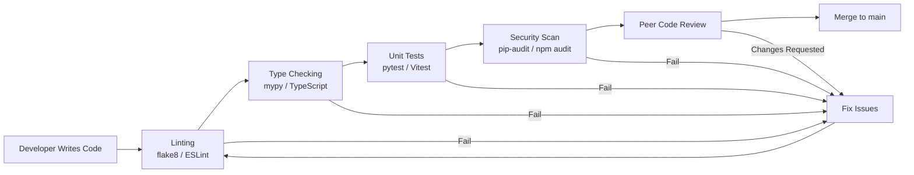

# Coding Standards — AA-Hackathon Enterprise AI Platform

**Organization:** Aligned Automation  
**Project:** AA-Hackathon Enterprise AI Platform  
**Version:** 1.0  
**Last Updated:** 2026-06-07  
**Owner:** Platform Engineering  

---

## 1. Purpose

This document defines coding standards for all code written for the AA-Hackathon Enterprise AI Platform. These standards ensure consistency, maintainability, security, and readability across the codebase. All pull requests are reviewed against these standards.

---

## 2. Code Quality Gate



---

## 3. Python Standards

### 3.1 Language Version and Style

- Python 3.11 exclusively. No compatibility shims for older versions.
- Follow PEP 8 with the following project-specific rules:
  - Line length: 100 characters maximum
  - Use `black` formatter (configured in `pyproject.toml`)
  - Use `flake8` linter with `flake8-bugbear`
  - Use `mypy` for static type checking (strict mode for new modules)

### 3.2 Type Hints — Required

Type hints are required on all function signatures and class attributes. No untyped functions will be merged.

```python
# CORRECT
async def get_conversation(
    conversation_id: str,
    user_id: str,
    db_pool: ThreadedConnectionPool,
) -> dict[str, Any]:
    ...

# WRONG — no type hints
async def get_conversation(conversation_id, user_id, db_pool):
    ...
```

Return types must be explicit. Use `Optional[T]` (or `T | None`) for nullable returns. Use `list[dict[str, Any]]` for list of dicts from database.

### 3.3 Async/Await for All I/O

All database calls, HTTP calls, and file I/O must be async. Never use synchronous blocking calls inside `async def` functions.

```python
# CORRECT — async database call
async def fetch_messages(conversation_id: str) -> list[dict]:
    async with db_pool.getconn() as conn:
        cursor = conn.cursor(cursor_factory=RealDictCursor)
        await asyncio.to_thread(
            cursor.execute,
            "SELECT * FROM messages WHERE conversation_id = %s AND is_deleted = false",
            (conversation_id,)
        )
        return cursor.fetchall()

# WRONG — blocking call in async context
async def fetch_messages(conversation_id: str) -> list[dict]:
    conn = db_pool.getconn()          # blocks event loop
    cursor = conn.cursor()
    cursor.execute("SELECT ...")       # blocks event loop
    return cursor.fetchall()
```

### 3.4 Exception Handling

- Never use bare `except:` — always catch specific exceptions
- Always log exceptions with full traceback at ERROR level
- Re-raise or convert to application-level exceptions for API layer
- Use `finally` blocks to ensure resource cleanup (DB connections returned to pool)

```python
# CORRECT
try:
    result = await some_db_operation()
except psycopg2.OperationalError as e:
    logger.error("Database connection failed", exc_info=True, extra={"operation": "fetch_messages"})
    raise DatabaseError("Failed to fetch messages") from e
except psycopg2.ProgrammingError as e:
    logger.error("Database query error", exc_info=True)
    raise DatabaseError("Query execution failed") from e
finally:
    db_pool.putconn(conn)

# WRONG — bare except hides errors
try:
    result = await some_db_operation()
except:
    pass
```

### 3.5 String Formatting

Use f-strings exclusively for string interpolation. No `%` formatting or `.format()`.

```python
# CORRECT
logger.info(f"Processing document: {document_name}, size: {file_size} bytes")

# WRONG
logger.info("Processing document: %s, size: %d bytes" % (document_name, file_size))
logger.info("Processing document: {}, size: {} bytes".format(document_name, file_size))
```

Exception: SQL queries always use `%s` parameterized placeholders with psycopg2, never f-strings.

### 3.6 Naming Conventions

| Type | Convention | Example |
|------|-----------|---------|
| Module/file | snake_case | `document_service.py` |
| Function | snake_case | `get_document_chunks()` |
| Variable | snake_case | `chunk_count = 0` |
| Class | PascalCase | `DocumentService` |
| Constant | UPPER_SNAKE_CASE | `MAX_CHUNK_SIZE = 500` |
| Private | leading underscore | `_validate_token()` |
| Type alias | PascalCase | `DocumentChunk = dict[str, Any]` |

### 3.7 No Bare Globals

Avoid module-level mutable globals. Use dependency injection patterns via FastAPI `Depends()`. Configuration values loaded from environment via `config.py` are acceptable as module-level constants.

---

## 4. FastAPI Standards

### 4.1 Pydantic Models for All Requests and Responses

Every API endpoint must define explicit Pydantic request and response models. No `dict` inputs/outputs on route functions.

```python
# CORRECT
class ConversationCreateRequest(BaseModel):
    title: Optional[str] = None
    context: Optional[str] = None

class ConversationResponse(BaseModel):
    id: str
    title: Optional[str]
    created_at: datetime
    is_deleted: bool

@router.post("/conversations", response_model=ConversationResponse)
async def create_conversation(
    body: ConversationCreateRequest,
    current_user: dict = Depends(get_current_user),
) -> ConversationResponse:
    ...
```

### 4.2 Dependency Injection for Auth

All protected endpoints must use `Depends(get_current_user)`. The `get_current_user` dependency validates the Azure AD JWT token and returns the user claims dict.

```python
# CORRECT — auth is injected
@router.get("/conversations/{id}")
async def get_conversation(
    id: str,
    current_user: dict = Depends(get_current_user),
):
    user_id = current_user["oid"]
    ...

# WRONG — manual token extraction in route
@router.get("/conversations/{id}")
async def get_conversation(id: str, request: Request):
    token = request.headers.get("Authorization")
    # manual validation here — don't do this
```

### 4.3 Router Organization

Routes are grouped by domain in separate router files:

```
apps/api-gateway/app/
├── controllers/
│   ├── conversation_controller.py   → /api/conversations
│   ├── document_controller.py       → /api/documents
│   ├── feedback_controller.py       → /api/feedback
│   ├── escalation_controller.py     → /api/escalations
│   ├── analytics_controller.py      → /api/analytics
│   └── health_controller.py         → /api/health
├── services/
│   ├── conversation_service.py
│   ├── document_service.py
│   └── ...
├── agents/
│   └── ...
├── rag/
│   ├── retriever.py
│   ├── embedder.py
│   └── generator.py
└── memory/
    └── ...
```

Each controller uses `APIRouter(prefix="/api/resource", tags=["resource"])`.

### 4.4 Background Tasks

Long-running operations (document ingestion, bulk processing) must use FastAPI `BackgroundTasks` or be dispatched to a separate job process. Route handlers must respond within 30 seconds.

---

## 5. JavaScript and React Standards

### 5.1 Functional Components Only

No class components. All React components are functional components using hooks.

```jsx
// CORRECT
const ConversationList = ({ userId }) => {
  const conversations = useSelector(selectConversations);
  const dispatch = useDispatch();

  useEffect(() => {
    dispatch(fetchConversations(userId));
  }, [userId, dispatch]);

  return <div className="conversation-list">...</div>;
};

// WRONG — class component
class ConversationList extends React.Component {
  render() { ... }
}
```

### 5.2 Hooks Pattern

Custom hooks encapsulate reusable stateful logic. Hooks are prefixed with `use`.

```jsx
// Custom hook — CORRECT
const useConversation = (conversationId) => {
  const [messages, setMessages] = useState([]);
  const [loading, setLoading] = useState(false);

  useEffect(() => {
    if (!conversationId) return;
    setLoading(true);
    fetchMessages(conversationId)
      .then(setMessages)
      .finally(() => setLoading(false));
  }, [conversationId]);

  return { messages, loading };
};
```

### 5.3 Arrow Functions

Use arrow functions for components and callbacks. No `function` keyword declarations for components.

```jsx
// CORRECT
const handleSubmit = (event) => {
  event.preventDefault();
  dispatch(sendMessage({ content: inputValue }));
};

// WRONG
function handleSubmit(event) { ... }
```

### 5.4 Destructuring

Always destructure props and state. No `props.something` access.

```jsx
// CORRECT
const MessageBubble = ({ content, role, sources, timestamp }) => {
  const { theme, fontSize } = useSelector(selectUIConfig);
  ...
};

// WRONG
const MessageBubble = (props) => {
  const theme = props.theme;
  ...
};
```

### 5.5 Optional Chaining

Use optional chaining (`?.`) and nullish coalescing (`??`) for safe property access.

```jsx
// CORRECT
const userName = user?.profile?.displayName ?? "Anonymous";
const sourceUrl = message?.sources?.[0]?.source_url ?? "#";

// WRONG
const userName = user && user.profile && user.profile.displayName || "Anonymous";
```

### 5.6 JavaScript Naming

| Type | Convention | Example |
|------|-----------|---------|
| Component file | PascalCase | `ConversationPanel.jsx` |
| Component | PascalCase | `ConversationPanel` |
| Variable/function | camelCase | `fetchMessages()` |
| Constant | UPPER_SNAKE_CASE | `MAX_RETRY_ATTEMPTS = 3` |
| CSS class | kebab-case | `conversation-panel` |
| Redux slice | camelCase | `conversationSlice` |
| Hook | camelCase with `use` prefix | `useConversation` |

---

## 6. Module Organization

### 6.1 Backend Module Structure

```
apps/api-gateway/app/
├── controllers/      → FastAPI route handlers (thin layer, no business logic)
├── services/         → Business logic, database operations
├── agents/           → LangChain agent definitions and tools
├── rag/              → RAG pipeline: embedder, retriever, generator
├── memory/           → Conversation memory and context management
├── middleware/        → Auth middleware, logging middleware
├── models/           → Pydantic request/response models
├── utils/            → Shared utilities
└── config.py         → Environment configuration
```

### 6.2 Frontend Module Structure

```
apps/web-ui/src/
├── components/       → Shared, reusable UI components
│   ├── ChatInterface/
│   ├── MessageBubble/
│   └── ...
├── modules/          → Feature modules (self-contained)
│   ├── analytics/
│   ├── onboarding-guidance/
│   └── coo-analytics/
├── config/           → All configuration constants
│   ├── apiConfig.js
│   ├── authConfig.js
│   ├── chatConfig.js
│   ├── userConfig.js
│   └── quickLinksConfig.js
├── services/         → API client, auth service
│   └── api.js        → HTTPClient class
├── store/            → Redux store, slices, selectors
└── utils/            → Pure utility functions
```

### 6.3 Import Order

Python imports ordered as:
1. Standard library (`import os`, `import asyncio`)
2. Third-party (`from fastapi import ...`, `from langchain import ...`)
3. Local application (`from app.services import ...`, `from app.models import ...`)

Separated by blank lines. Alphabetical within each group.

JavaScript/TypeScript imports:
1. React and React-related
2. Third-party libraries
3. Internal modules (absolute paths)
4. Relative imports
5. CSS/style imports

---

## 7. Security Coding Standards

### 7.1 Parameterized Queries — Always

SQL injection prevention is non-negotiable. Every database query uses parameterized placeholders.

```python
# CORRECT — parameterized
cursor.execute(
    "SELECT * FROM conversations WHERE user_id = %s AND is_deleted = false",
    (user_id,)
)

# WRONG — string interpolation is SQL injection
cursor.execute(f"SELECT * FROM conversations WHERE user_id = '{user_id}'")
```

### 7.2 No Secrets in Code

```python
# CORRECT — from environment
import os
OLLAMA_BASE_URL = os.environ.get("OLLAMA_BASE_URL", "http://localhost:11434")

# WRONG — hardcoded
OLLAMA_BASE_URL = "http://ml01.alignedautomation.com:11434"
```

### 7.3 HTML Output Sanitization

When rendering AI-generated content in the browser, sanitize before inserting as innerHTML. Use `DOMPurify`.

```jsx
// CORRECT
import DOMPurify from 'dompurify';
const sanitized = DOMPurify.sanitize(aiResponseHtml);
<div dangerouslySetInnerHTML={{ __html: sanitized }} />

// WRONG — XSS risk
<div dangerouslySetInnerHTML={{ __html: aiResponseHtml }} />
```

---

## 8. Comment Standards

Comments explain WHY, not WHAT. The code should be self-documenting for the "what".

```python
# CORRECT — explains why
# Retry with simplified query when pgvector returns fewer than 3 chunks,
# as complex queries often over-filter on rare domain terminology.
if len(chunks) < MIN_CHUNKS_THRESHOLD:
    chunks = await self._retry_simplified_query(query_embedding)

# WRONG — explains what (obvious from code)
# Execute database query to get chunks
chunks = await db.get_chunks(query_embedding)
```

Docstrings on all public functions and classes. Use Google docstring format.

---

## 9. Git Commit Format

```
<type>(<scope>): <short description>

[optional body explaining why]

[optional footer: ticket reference]
```

Types: `feat`, `fix`, `docs`, `style`, `refactor`, `test`, `chore`, `perf`

Examples:
```
feat(rag): add adaptive retry when pgvector returns fewer than 3 chunks

fix(auth): handle expired JWT tokens with clear 401 response

refactor(embedder): extract batch processing into separate method for reuse

chore(deps): upgrade sentence-transformers to 2.7.0 for performance fix
```

Commits are atomic — one logical change per commit. Do not mix feature changes with formatting fixes.

---

## 10. Async Patterns

### 10.1 Database Connection Pattern

```python
async def perform_db_operation(db_pool: ThreadedConnectionPool) -> Any:
    conn = None
    try:
        conn = db_pool.getconn()
        cursor = conn.cursor(cursor_factory=RealDictCursor)
        # perform operations
        conn.commit()
        return result
    except psycopg2.Error as e:
        if conn:
            conn.rollback()
        logger.error("Database error", exc_info=True)
        raise DatabaseError("Operation failed") from e
    finally:
        if conn:
            db_pool.putconn(conn)
```

### 10.2 HTTP Client Pattern

```python
async with httpx.AsyncClient(timeout=30.0) as client:
    response = await client.post(
        f"{OLLAMA_BASE_URL}/api/generate",
        json={"model": model, "prompt": prompt},
    )
    response.raise_for_status()
    return response.json()
```

### 10.3 Streaming Pattern (SSE)

```python
async def stream_response(generator) -> AsyncGenerator[str, None]:
    async for chunk in generator:
        yield f"data: {json.dumps({'content': chunk})}\n\n"
    yield "data: [DONE]\n\n"
```
