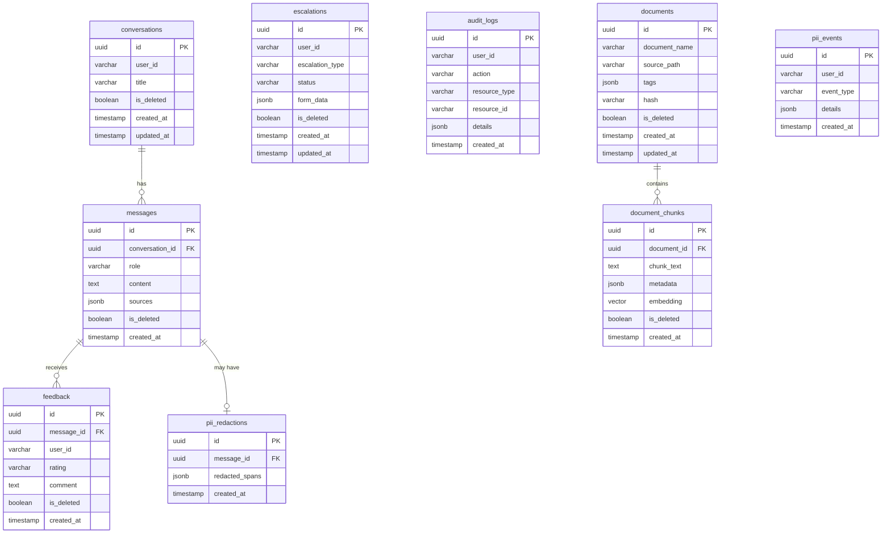

# Database Standards — AA-Hackathon Enterprise AI Platform

**Organization:** Aligned Automation  
**Project:** AA-Hackathon Enterprise AI Platform  
**Version:** 1.0  
**Last Updated:** 2026-06-07  
**Owner:** Platform Engineering  

---

## 1. Purpose

This document defines database design and access standards for the AA-Hackathon Enterprise AI Platform. All database schema changes, query patterns, and connection management must conform to these standards. The primary database is PostgreSQL 16 with the pgvector extension running on the squadrons database at `hackathon.alignedautomation.com`.

---

## 2. Database Overview



---

## 3. Connection Configuration

### 3.1 Connection Pool

The API uses `psycopg2.pool.ThreadedConnectionPool` for database access. The pool is initialized at application startup and shared across all requests.

```python
from psycopg2.pool import ThreadedConnectionPool

db_pool = ThreadedConnectionPool(
    minconn=1,
    maxconn=8,
    host=SQL_HOST,           # hackathon.alignedautomation.com
    port=SQL_PORT,           # 5432
    dbname=SQL_DATABASE,     # squadrons
    user=SQL_USER,
    password=SQL_PASSWORD,
    connect_timeout=10,
    options="-c statement_timeout=30000",  # 30-second query timeout
)
```

### 3.2 Connection Usage Pattern

Connections must always be returned to the pool, even on exception. Use try/finally.

```python
def get_db_connection():
    conn = None
    try:
        conn = db_pool.getconn()
        yield conn
    finally:
        if conn:
            db_pool.putconn(conn)
```

### 3.3 RealDictCursor

All queries use `RealDictCursor` so results are returned as dictionaries (column name → value) rather than tuples. This makes query results directly serializable to JSON.

```python
cursor = conn.cursor(cursor_factory=RealDictCursor)
cursor.execute("SELECT id, title, created_at FROM conversations WHERE id = %s", (conversation_id,))
row = cursor.fetchone()
# row is {'id': '...', 'title': '...', 'created_at': datetime(...)}
```

---

## 4. Schema Design Standards

### 4.1 Primary Keys

All tables use UUID primary keys generated by PostgreSQL. Never use sequential integer IDs — UUIDs prevent ID enumeration attacks and are safe for distributed systems.

```sql
id UUID PRIMARY KEY DEFAULT gen_random_uuid()
```

### 4.2 Required Columns on Every Table

Every table in the database must have these columns:

| Column | Type | Default | Purpose |
|--------|------|---------|---------|
| `id` | UUID | `gen_random_uuid()` | Primary key |
| `created_at` | TIMESTAMPTZ | `NOW()` | Creation timestamp |
| `is_deleted` | BOOLEAN | `FALSE` | Soft-delete flag |

Tables that support updates also include:

| Column | Type | Default | Purpose |
|--------|------|---------|---------|
| `updated_at` | TIMESTAMPTZ | `NOW()` | Last modification timestamp |

### 4.3 Naming Conventions

| Object | Convention | Example |
|--------|-----------|---------|
| Table | plural snake_case | `document_chunks` |
| Column | snake_case | `chunk_index` |
| Foreign key | `{referenced_table_singular}_id` | `document_id`, `conversation_id` |
| Index | `idx_{table}_{columns}` | `idx_messages_conversation_id` |
| Unique constraint | `uq_{table}_{columns}` | `uq_documents_hash` |
| Check constraint | `ck_{table}_{rule}` | `ck_messages_role` |

### 4.4 Data Types

| Use Case | Type | Notes |
|----------|------|-------|
| Identifiers | UUID | Always `gen_random_uuid()` as default |
| Short strings | VARCHAR(n) | Use explicit length limit |
| Long text | TEXT | No length limit |
| Timestamps | TIMESTAMPTZ | Always with timezone, stored as UTC |
| Boolean flags | BOOLEAN | `NOT NULL DEFAULT FALSE` |
| Flexible/optional data | JSONB | Schema documented in metadata-model.md |
| Embeddings | vector(384) | pgvector type, requires extension |
| Enums | VARCHAR with CHECK | Not PostgreSQL ENUM type (hard to alter) |

---

## 5. Soft Delete Pattern

Records are never physically deleted through application logic. The soft-delete pattern maintains data integrity and supports audit trails.

### 5.1 Soft Delete Operation

```sql
-- Soft delete a conversation
UPDATE conversations
SET is_deleted = true, updated_at = NOW()
WHERE id = %s AND user_id = %s;

-- Soft delete a document and all its chunks atomically
BEGIN;
UPDATE documents SET is_deleted = true, updated_at = NOW() WHERE id = %s;
UPDATE document_chunks SET is_deleted = true WHERE document_id = %s;
COMMIT;
```

### 5.2 All SELECT Queries Filter Soft-Deleted Records

Every SELECT query that returns data to application users must include `WHERE is_deleted = false`. Admin and audit queries may omit this filter.

```sql
-- CORRECT — filters soft-deleted records
SELECT id, title, created_at
FROM conversations
WHERE user_id = %s AND is_deleted = false
ORDER BY updated_at DESC
LIMIT %s OFFSET %s;

-- WRONG — returns soft-deleted records to users
SELECT id, title, created_at
FROM conversations
WHERE user_id = %s
ORDER BY updated_at DESC;
```

### 5.3 Filtered Index for Performance

A partial index on `is_deleted = false` optimizes the most common query pattern:

```sql
CREATE INDEX idx_conversations_user_active
ON conversations (user_id, updated_at DESC)
WHERE is_deleted = false;
```

---

## 6. JSONB Usage

JSONB columns store flexible, document-like data that varies by record type. All JSONB fields must be documented.

| Table | Column | Schema |
|-------|--------|--------|
| `messages` | `sources` | `[{document_name, source_url, similarity, chunk_text_preview}]` |
| `escalations` | `form_data` | Flexible: `{leave_type, dates, reason}` or `{issue_type, description}` |
| `document_chunks` | `metadata` | `{chunk_index, page_number, section_title, word_count}` |
| `documents` | `tags` | `{source_url, domain, category, content_type, sharepoint_item_id}` |
| `audit_logs` | `details` | `{action_context, affected_fields, ip_address}` |
| `pii_redactions` | `redacted_spans` | `[{start, end, entity_type, original_text_hash}]` |

### 6.1 JSONB Queries

```sql
-- Filter by JSONB field
SELECT * FROM documents
WHERE tags->>'domain' = 'HR' AND is_deleted = false;

-- Index JSONB field for performance
CREATE INDEX idx_documents_domain ON documents ((tags->>'domain'));

-- Update a specific JSONB key
UPDATE documents
SET tags = jsonb_set(tags, '{category}', '"Policy"', true)
WHERE id = %s;
```

---

## 7. Parameterized Queries — Non-Negotiable

SQL injection prevention is the highest-priority security requirement. Every query uses `%s` placeholders with psycopg2. String interpolation or f-strings in SQL are strictly prohibited.

```python
# CORRECT — parameterized
cursor.execute(
    """
    SELECT id, content, sources, created_at
    FROM messages
    WHERE conversation_id = %s
      AND is_deleted = false
    ORDER BY created_at ASC
    LIMIT %s OFFSET %s
    """,
    (conversation_id, limit, offset)
)

# WRONG — SQL injection vulnerability
cursor.execute(
    f"SELECT * FROM messages WHERE conversation_id = '{conversation_id}'"
)
```

For `IN` clauses with variable length lists:

```python
# CORRECT — dynamic IN clause
placeholders = ','.join(['%s'] * len(id_list))
cursor.execute(
    f"SELECT * FROM documents WHERE id IN ({placeholders}) AND is_deleted = false",
    id_list
)
```

---

## 8. Migration Strategy

### 8.1 Current State

Database migrations are manual SQL scripts. There is no ORM migration tool in use yet. This is tracked as technical debt with a target resolution of Q3 2026 (Alembic adoption).

### 8.2 Migration Script Convention

```
deployments/migrations/
├── 001_initial_schema.sql
├── 002_add_pgvector_extension.sql
├── 003_create_document_tables.sql
├── 004_add_pii_tables.sql
└── 005_add_indexes.sql
```

Each migration script:
1. Is numbered sequentially with zero-padded 3-digit prefix
2. Is idempotent where possible (`CREATE TABLE IF NOT EXISTS`, `CREATE INDEX IF NOT EXISTS`)
3. Includes a rollback script in a corresponding `rollback/` directory
4. Is tested on a dev database before applying to production

### 8.3 Applying Migrations

```bash
psql -h hackathon.alignedautomation.com -U admin -d squadrons -f 005_add_indexes.sql
```

Migrations are applied in numbered order. There is no automated tracking of applied migrations (future: Alembic `alembic_version` table).

---

## 9. Read-Only Zoho Integration

The Zoho People database is available as a separate read-only connection for employee profile lookups. It uses a separate connection pool (`ZOHO_DB_*` environment variables). Never write to the Zoho database. It is used to enrich user profiles with department, designation, and manager information.

```python
zoho_pool = ThreadedConnectionPool(
    minconn=1,
    maxconn=3,
    host=ZOHO_DB_HOST,
    dbname=ZOHO_DB_NAME,
    user=ZOHO_DB_USER,
    password=ZOHO_DB_PASSWORD,
    options="-c default_transaction_read_only=on",
)
```

---

## 10. Backup Strategy

- **Daily backup**: `pg_dump -Fc squadrons > backup_$(date +%Y%m%d).dump`
- **Backup location**: Secure storage, not on the database server
- **Retention**: 7-day rolling daily backups, 4-week monthly backups
- **Restoration test**: Monthly restoration test to verify backup integrity
- **Point-in-time recovery**: PostgreSQL WAL archiving enabled for PITR within retention window

---

## 11. Query Performance Standards

- All foreign key columns are indexed
- Columns in WHERE clauses with high selectivity are indexed
- `EXPLAIN ANALYZE` run on all new queries handling > 1000 rows
- Queries exceeding 5 seconds investigated and optimized before merging
- Connection pool max of 8 connections — queries must complete quickly
- No full-table scans on large tables (documents, document_chunks, messages) — verified with EXPLAIN

```sql
-- Run EXPLAIN ANALYZE to check query plan
EXPLAIN ANALYZE
SELECT dc.chunk_text, dc.metadata, dc.embedding <=> %s::vector AS distance
FROM document_chunks dc
JOIN documents d ON d.id = dc.document_id
WHERE d.is_deleted = false AND dc.is_deleted = false
ORDER BY distance
LIMIT 10;
```
