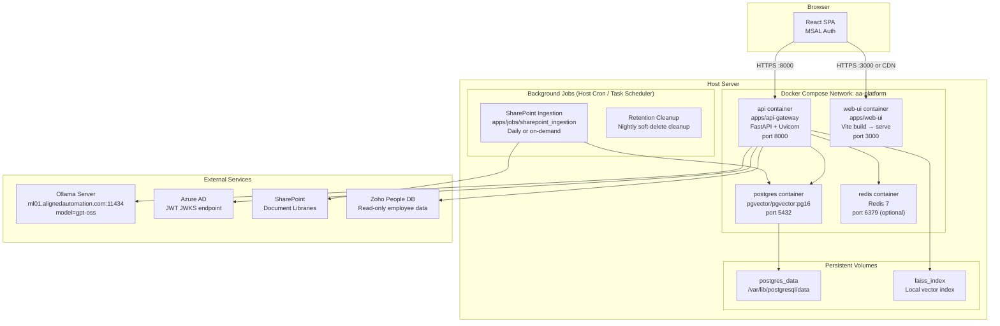

# Deployment Standards — AA-Hackathon Enterprise AI Platform

**Organization:** Aligned Automation  
**Project:** AA-Hackathon Enterprise AI Platform  
**Version:** 1.0  
**Last Updated:** 2026-06-07  
**Owner:** Platform Engineering  

---

## 1. Purpose

This document defines deployment standards for the AA-Hackathon Enterprise AI Platform. It covers Docker containerization, Docker Compose orchestration, environment configuration, health checks, background job scheduling, and rollback procedures.

---

## 2. Deployment Architecture



---

## 3. Container Definitions

### 3.1 API Container

**Build Context:** `apps/api-gateway/`  
**Base Image:** `python:3.11-slim`  
**Exposed Port:** 8000  
**Health Check:** `GET /api/health`

```dockerfile
# apps/api-gateway/Dockerfile
FROM python:3.11-slim

WORKDIR /app

# Install system dependencies for psycopg2 and sentence-transformers
RUN apt-get update && apt-get install -y \
    gcc \
    libpq-dev \
    curl \
    && rm -rf /var/lib/apt/lists/*

# Copy and install Python dependencies first (layer caching)
COPY requirements.txt .
RUN pip install --no-cache-dir -r requirements.txt

# Copy application code
COPY app/ ./app/

# Non-root user for security
RUN useradd -m -u 1000 appuser
USER appuser

EXPOSE 8000

HEALTHCHECK --interval=30s --timeout=10s --start-period=30s --retries=3 \
    CMD curl -f http://localhost:8000/api/health || exit 1

CMD ["uvicorn", "app.main:app", "--host", "0.0.0.0", "--port", "8000", "--workers", "1"]
```

**Notes:**
- Single worker (`--workers 1`) as async FastAPI handles concurrency within a single process
- Multi-worker requires shared state migration (Redis for session/cache)
- Sentence-transformers model downloaded on first run (or pre-baked into image for faster startup)

### 3.2 Web-UI Container

**Build Context:** `apps/web-ui/`  
**Base Image:** `node:20-alpine` (build) → `node:20-alpine` (serve)  
**Exposed Port:** 3000  
**Build Strategy:** Multi-stage build

```dockerfile
# apps/web-ui/Dockerfile
# Stage 1: Build
FROM node:20-alpine AS builder

WORKDIR /app

COPY package*.json ./
RUN npm ci --only=production=false

COPY . .

ARG VITE_API_URL
ARG VITE_TENANT_ID
ARG VITE_CLIENT_ID
ARG VITE_REDIRECT_URI

ENV VITE_API_URL=$VITE_API_URL
ENV VITE_TENANT_ID=$VITE_TENANT_ID
ENV VITE_CLIENT_ID=$VITE_CLIENT_ID
ENV VITE_REDIRECT_URI=$VITE_REDIRECT_URI

RUN npm run build

# Stage 2: Serve
FROM node:20-alpine AS runner

RUN npm install -g serve

WORKDIR /app

COPY --from=builder /app/dist ./dist

EXPOSE 3000

CMD ["serve", "-s", "dist", "-l", "3000"]
```

**Build Arguments:**

| Arg | Description |
|-----|-------------|
| `VITE_API_URL` | Backend API base URL |
| `VITE_TENANT_ID` | Azure AD tenant ID |
| `VITE_CLIENT_ID` | MSAL client ID |
| `VITE_REDIRECT_URI` | OAuth redirect URI |

### 3.3 PostgreSQL Container

**Image:** `pgvector/pgvector:pg16`  
**Exposed Port:** 5432  
**Volume:** `postgres_data:/var/lib/postgresql/data`

```yaml
# In docker-compose.yml
postgres:
  image: pgvector/pgvector:pg16
  environment:
    POSTGRES_DB: squadrons
    POSTGRES_USER: ${SQL_USER}
    POSTGRES_PASSWORD: ${SQL_PASSWORD}
  ports:
    - "5432:5432"
  volumes:
    - postgres_data:/var/lib/postgresql/data
    - ./deployments/migrations:/docker-entrypoint-initdb.d  # auto-run on first start
  healthcheck:
    test: ["CMD-SHELL", "pg_isready -U ${SQL_USER} -d squadrons"]
    interval: 10s
    timeout: 5s
    retries: 5
```

### 3.4 Redis Container (Optional)

**Image:** `redis:7-alpine`  
**Exposed Port:** 6379  
**Use Case:** Rate limiting, session cache, background job queue (future)

```yaml
redis:
  image: redis:7-alpine
  ports:
    - "6379:6379"
  command: redis-server --requirepass ${REDIS_PASSWORD}
  healthcheck:
    test: ["CMD", "redis-cli", "ping"]
    interval: 10s
    timeout: 5s
    retries: 3
```

---

## 4. Docker Compose Configuration

**Location:** `deployments/docker/docker-compose.yml`

```yaml
version: "3.9"

services:
  api:
    build:
      context: ../../apps/api-gateway
      dockerfile: Dockerfile
    ports:
      - "8000:8000"
    env_file:
      - ../../.env
    environment:
      SQL_HOST: postgres
      SQL_PORT: 5432
    depends_on:
      postgres:
        condition: service_healthy
    volumes:
      - faiss_index:/app/faiss_data
    restart: unless-stopped
    networks:
      - aa-platform

  web-ui:
    build:
      context: ../../apps/web-ui
      dockerfile: Dockerfile
      args:
        VITE_API_URL: ${VITE_API_URL}
        VITE_TENANT_ID: ${AZURE_TENANT_ID}
        VITE_CLIENT_ID: ${AZURE_CLIENT_ID}
        VITE_REDIRECT_URI: ${VITE_REDIRECT_URI}
    ports:
      - "3000:3000"
    depends_on:
      - api
    restart: unless-stopped
    networks:
      - aa-platform

  postgres:
    image: pgvector/pgvector:pg16
    environment:
      POSTGRES_DB: squadrons
      POSTGRES_USER: ${SQL_USER}
      POSTGRES_PASSWORD: ${SQL_PASSWORD}
    ports:
      - "5432:5432"
    volumes:
      - postgres_data:/var/lib/postgresql/data
      - ../../deployments/migrations:/docker-entrypoint-initdb.d
    healthcheck:
      test: ["CMD-SHELL", "pg_isready -U ${SQL_USER} -d squadrons"]
      interval: 10s
      timeout: 5s
      retries: 5
    restart: unless-stopped
    networks:
      - aa-platform

  redis:
    image: redis:7-alpine
    ports:
      - "6379:6379"
    restart: unless-stopped
    networks:
      - aa-platform

volumes:
  postgres_data:
  faiss_index:

networks:
  aa-platform:
    driver: bridge
```

---

## 5. Environment Variables

All environment variables for the deployment. Set in `.env` file (never committed to git) or injected via CI/CD secrets.

| Variable | Service | Required | Example |
|----------|---------|----------|---------|
| `SQL_HOST` | API | Yes | `hackathon.alignedautomation.com` |
| `SQL_PORT` | API | Yes | `5432` |
| `SQL_DATABASE` | API | Yes | `squadrons` |
| `SQL_USER` | API, PG | Yes | `admin` |
| `SQL_PASSWORD` | API, PG | Yes | _(secret)_ |
| `OLLAMA_BASE_URL` | API | Yes | `http://ml01.alignedautomation.com:11434` |
| `OLLAMA_MODEL` | API | Yes | `gpt-oss` |
| `AZURE_TENANT_ID` | API, Web | Yes | _(GUID)_ |
| `AZURE_CLIENT_ID` | API, Web | Yes | _(GUID)_ |
| `SHAREPOINT_CLIENT_ID` | Jobs | Yes | _(GUID)_ |
| `SHAREPOINT_CLIENT_SECRET` | Jobs | Yes | _(secret)_ |
| `SHAREPOINT_TENANT_ID` | Jobs | Yes | _(GUID)_ |
| `SHAREPOINT_SITE_URL` | Jobs | Yes | `https://org.sharepoint.com/sites/...` |
| `EMBEDDING_MODEL` | API, Jobs | Yes | `all-MiniLM-L6-v2` |
| `EMBEDDING_DIM` | API, Jobs | Yes | `384` |
| `VITE_API_URL` | Web (build) | Yes | `https://api.alignedautomation.com` |
| `VITE_REDIRECT_URI` | Web (build) | Yes | `https://app.alignedautomation.com` |
| `REDIS_PASSWORD` | Redis | No | _(secret if Redis used)_ |
| `ZOHO_DB_HOST` | API | No | _(host)_ |
| `ZOHO_DB_NAME` | API | No | _(db name)_ |
| `ZOHO_DB_USER` | API | No | _(user)_ |
| `ZOHO_DB_PASSWORD` | API | No | _(secret)_ |
| `SCRAPE_PAGES_ENABLED` | Jobs | No | `false` |
| `SCRAPE_LISTS_ENABLED` | Jobs | No | `false` |

---

## 6. Health Check Specification

`GET /api/health` is called by load balancers and container health checks.

```json
{
  "status": "healthy",
  "components": {
    "database": { "status": "healthy", "latency_ms": 3 },
    "pgvector": { "status": "healthy", "extension_version": "0.7.0" },
    "ollama": { "status": "healthy", "model": "gpt-oss", "latency_ms": 45 }
  },
  "version": "1.0.0",
  "timestamp": "2026-06-07T10:30:00Z"
}
```

Health check thresholds:
- Database latency > 1000ms → degraded
- Ollama not responding → degraded
- pgvector extension missing → degraded (FAISS fallback active)

---

## 7. Background Jobs

### 7.1 SharePoint Ingestion Job

**Location:** `apps/jobs/sharepoint_ingestion/`  
**Language:** Python 3.11  
**Schedule:** Daily at 02:00 AM (configurable)

Linux cron:
```cron
0 2 * * * /usr/bin/python3 /app/jobs/sharepoint_ingestion/main.py >> /var/log/sp_ingestion.log 2>&1
```

Windows Task Scheduler:
```xml
<Task>
  <Triggers>
    <CalendarTrigger>
      <StartBoundary>2026-01-01T02:00:00</StartBoundary>
      <ScheduleByDay><DaysInterval>1</DaysInterval></ScheduleByDay>
    </CalendarTrigger>
  </Triggers>
  <Actions>
    <Exec>
      <Command>python</Command>
      <Arguments>apps\jobs\sharepoint_ingestion\main.py</Arguments>
    </Exec>
  </Actions>
</Task>
```

### 7.2 Retention Cleanup Job

**Location:** `apps/jobs/retention_cleanup/`  
**Schedule:** Nightly at 03:00 AM

Deletes records that have been soft-deleted for longer than the retention period defined in the retention policy.

---

## 8. Deployment Procedure

### 8.1 First-Time Setup

```bash
# 1. Clone repository
git clone <repo-url>
cd aa-hackathon

# 2. Create .env file from template
cp .env.template .env
# Edit .env with real values

# 3. Build and start all containers
cd deployments/docker
docker compose up -d --build

# 4. Verify health
curl http://localhost:8000/api/health

# 5. Run initial SharePoint ingestion
python apps/jobs/sharepoint_ingestion/main.py
```

### 8.2 Update Deployment

```bash
# Pull latest code
git pull origin main

# Rebuild and restart (zero-downtime if load balanced)
cd deployments/docker
docker compose pull
docker compose up -d --build

# Verify
docker compose ps
curl http://localhost:8000/api/health
```

### 8.3 Rollback Procedure

```bash
# Identify previous image tag
docker images | grep aa-platform

# Roll back API to previous image
docker compose stop api
docker tag aa-platform-api:previous aa-platform-api:latest
docker compose up -d api

# Verify rollback
curl http://localhost:8000/api/health
```

---

## 9. Logging

- All containers log to stdout in structured JSON format
- Docker daemon captures stdout logs
- Log files accessible via `docker compose logs -f api`
- Log rotation: `--log-opt max-size=100m --log-opt max-file=3`
- Future: forward to centralized log aggregation (Azure Monitor / ELK)

---

## 10. Future: Kubernetes/AKS

The Docker Compose configuration is designed to be straightforward to migrate to Kubernetes:

- Each Docker Compose service → Kubernetes Deployment
- Volumes → PersistentVolumeClaims
- Environment variables → ConfigMaps and Secrets
- Health checks → readinessProbe and livenessProbe
- Docker Compose network → Kubernetes Service objects

Migration target: Q4 2026, pending production load assessment.
