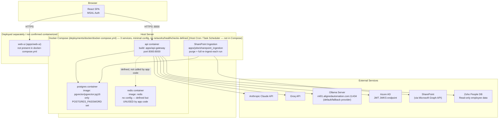

# Deployment Standards — AA-Hackathon Enterprise AI Platform

**Organization:** Aligned Automation  
**Project:** AA-Hackathon Enterprise AI Platform  
**Version:** 1.0  
**Last Updated:** 2026-06-07  
**Owner:** Platform Engineering  

---

## 1. Purpose

This document defines deployment standards for the AA-Hackathon Enterprise AI Platform. It covers Docker containerization, Docker Compose orchestration, environment configuration, health checks, background job scheduling, and rollback procedures.

---

## 2. Deployment Architecture

**The real `deployments/docker/docker-compose.yml` defines exactly three services: `api`, `postgres`, and `redis`.** It is a minimal file — no health checks, no named volumes, no resource limits, no Nginx reverse proxy, and no Kubernetes/AKS manifests exist anywhere in this repository. The `web-ui` frontend is **not** part of this Compose file; it is not containerized alongside the backend in the current deployment. Everything below that goes beyond that minimal 3-service reality (multi-stage web-ui Dockerfile, health checks, named volumes, resource limits, Kubernetes) is either aspirational/recommended hardening or explicitly marked as future-only — treat Section 4 ("Docker Compose Configuration — Current Reality") as authoritative for what is actually deployed today.



---

## 3. Container Definitions

**Reality check:** the real `deployments/docker/docker-compose.yml` defines exactly three services (`api`, `postgres`, `redis`) with minimal configuration — no `healthcheck:` blocks, no named volumes, no `restart:` policy, no explicit `networks:` section, and no `web-ui` service at all. The richer per-service definitions below (multi-stage Dockerfiles, HEALTHCHECK directives, non-root users, named volumes) describe **recommended/aspirational hardening**, not what is currently in the compose file. Where a Dockerfile itself exists for a service (e.g. `apps/api-gateway/Dockerfile`), its exact contents were not independently re-verified in the audit that produced this correction — treat the snippets below as illustrative targets for production hardening, and treat Section 4 as the authoritative statement of what `docker-compose.yml` actually contains today.

### 3.1 API Container (real service in compose)

**Build Context:** `apps/api-gateway/` (via `build: ../../apps/api-gateway` in the real compose file)  
**Exposed Port:** `8000:8000`  
**Compose config today:** build context and port mapping only — no environment block, no health check, no restart policy, no volumes defined in `docker-compose.yml` itself.

A hardened Dockerfile *could* look like the example below, but this is a recommended target, not a confirmed current file:

```dockerfile
# apps/api-gateway/Dockerfile — illustrative hardening target, not independently re-verified
FROM python:3.11-slim
WORKDIR /app
COPY requirements.txt .
RUN pip install --no-cache-dir -r requirements.txt
COPY app/ ./app/
EXPOSE 8000
CMD ["uvicorn", "app.main:app", "--host", "0.0.0.0", "--port", "8000"]
```

**Notes:**
- Redis is defined elsewhere in the compose file but is **not used for sessions or caching by this container** — no `redis` client library is in `requirements.txt` and no application code connects to it.

### 3.2 Web-UI — Not Present in `docker-compose.yml`

There is **no `web-ui` service in the real Docker Compose file**. The frontend (`apps/web-ui/`) is not currently containerized alongside the backend in this repository's deployment configuration. Any Dockerfile, build-stage, or serving strategy for the frontend described in prior drafts of this document should be treated as a future/target deployment approach, not a confirmed current one, until a `web-ui` service actually appears in `deployments/docker/docker-compose.yml`.

### 3.3 PostgreSQL Container (real service in compose)

**Image:** `pgvector/pgvector:pg16`  
**Compose config today:**

```yaml
postgres:
  image: pgvector/pgvector:pg16
  environment:
    POSTGRES_PASSWORD: ${SQL_PASSWORD}
```

That is the **entire** real service definition — no `POSTGRES_DB` / `POSTGRES_USER` overrides, no port mapping, no named volume, and no health check are present in the actual compose file. Without an explicit named volume, data persistence across container recreation is not guaranteed by this file as written — this is a real gap worth flagging to the platform team, not something to silently "correct" in documentation by inventing a volume that doesn't exist.

### 3.4 Redis Container (real service in compose, but unused by application code)

**Image:** `redis`  
**Compose config today:**

```yaml
redis:
  image: redis
```

No environment variables, no password, no port mapping, no health check — nothing beyond the bare image reference. **No application code in this repository imports a Redis client or connects to this service.** Do not describe Redis as an active session store, cache, or rate limiter; it is present-but-unused infrastructure today.
```

---

## 4. Docker Compose Configuration — Current Reality

**Location:** `deployments/docker/docker-compose.yml`

This is the actual, complete file — three services, no health checks, no named volumes, no custom networks, no `web-ui` service:

```yaml
services:
  api:
    build: ../../apps/api-gateway
    ports:
      - "8000:8000"

  postgres:
    image: pgvector/pgvector:pg16
    environment:
      POSTGRES_PASSWORD: ${SQL_PASSWORD}

  redis:
    image: redis
```

Implications worth calling out explicitly rather than glossing over:

- **No named volume for `postgres`** — as written, this file does not guarantee Postgres data survives container recreation. If the platform relies on data persisting, that persistence is coming from somewhere other than this Compose file (e.g. a host bind mount configured outside this repo, or the target Postgres instance is not actually running via this Compose file in the relevant environment).
- **No `web-ui` service** — the frontend is not deployed via this Compose file.
- **No health checks, no `depends_on`, no `restart` policy, no custom network** — startup ordering and restart-on-failure behavior are not managed by Compose here.
- **`redis` has zero configuration** — no password, no port mapping, no persistence — consistent with it being unused by any application code.

### 4.1 Future / Recommended Hardening (not yet implemented)

The example below shows one plausible direction for hardening this file — explicit health checks, named volumes, restart policies, and (if the frontend is later containerized) a `web-ui` service. **None of this exists in the repository today**; it is included only as a documented target for future work, not as a description of the current deployment.

```yaml
# FUTURE / ASPIRATIONAL — not present in the real docker-compose.yml today
services:
  api:
    build: ../../apps/api-gateway
    ports:
      - "8000:8000"
    depends_on:
      postgres:
        condition: service_healthy
    restart: unless-stopped

  postgres:
    image: pgvector/pgvector:pg16
    environment:
      POSTGRES_PASSWORD: ${SQL_PASSWORD}
    volumes:
      - postgres_data:/var/lib/postgresql/data
    healthcheck:
      test: ["CMD-SHELL", "pg_isready -U postgres"]
      interval: 10s
      timeout: 5s
      retries: 5
    restart: unless-stopped

  redis:
    image: redis
    restart: unless-stopped

volumes:
  postgres_data:
```

---

## 5. Environment Variables

All environment variables for the deployment. Set in `.env` file (never committed to git) or injected via CI/CD secrets.

| Variable | Service | Required | Example |
|----------|---------|----------|---------|
| `SQL_HOST` / `DB_HOST` | API | Yes | `hackathon.alignedautomation.com` |
| `SQL_PORT` | API | Yes | `5432` |
| `SQL_DATABASE` / `DB_NAME` | API | Yes | `squadrons` |
| `SQL_USER` / `DB_USER` | API, PG | Yes | `admin` |
| `SQL_PASSWORD` / `DB_PASSWORD` | API, PG | Yes | _(secret)_ — the real compose file only sets `POSTGRES_PASSWORD` on the `postgres` service |
| `USE_Claude_API_Key` / `USE_Groq_API_Key` / `Use_Ollama_LLM` | API | Yes | Selects active LLM provider (Claude > Groq > Ollama priority) |
| `CLAUDE_API_KEY` / `CLAUDE_MODEL` | API | If Claude selected | `claude-sonnet-4-6` |
| `GROQ_API_KEY` / `GROQ_MODEL` | API | If Groq selected | `llama3-70b-8192` |
| `OLLAMA_BASE_URL` | API | If Ollama selected (default/fallback) | `http://ml01.alignedautomation.com:11434` |
| `OLLAMA_MODEL` | API | If Ollama selected | `gpt-oss` |
| `AZURE_TENANT_ID` / `AZURE_CLIENT_ID` | API | Yes | _(GUID)_ — JWT validation |
| `VITE_AZURE_CLIENT_ID` / `VITE_AZURE_TENANT_ID` | Web (build-time, not part of Compose) | Yes | MSAL frontend config |
| `SHAREPOINT_CLIENT_ID` | Jobs | Yes | _(GUID)_ |
| `SHAREPOINT_CLIENT_SECRET` | Jobs | Yes | _(secret)_ |
| `SHAREPOINT_TENANT_ID` | Jobs | Yes | _(GUID)_ |
| `SHAREPOINT_SITE_URL` | Jobs | Yes | `https://org.sharepoint.com/sites/...` |
| `EMBEDDING_MODEL` | API, Jobs | Yes | `nomic-ai/nomic-embed-text-v1.5` |
| `EMBEDDING_DIM` | API, Jobs | Yes | `768` |
| `ZOHO_DB_HOST` / `ZOHO_DB_NAME` / `ZOHO_DB_USER` / `ZOHO_DB_PASSWORD` | API | No | Read-only Zoho People replica |
| `SCRAPE_PAGES_ENABLED` | Jobs | No | `false` (default — Phase 2 web scraper disabled) |
| `SCRAPE_LISTS_ENABLED` | Jobs | No | `false` (default — Phase 2 web scraper disabled) |

Note: the real `docker-compose.yml` does not define a `REDIS_PASSWORD` or any other Redis-specific env var — the `redis` service takes no configuration at all, consistent with it being unused by application code.

---

## 6. Health Check Specification

**Note:** this describes a health endpoint the application itself may expose (`GET /api/health`), which is separate from Docker Compose orchestration health checks — the real `docker-compose.yml` has no `healthcheck:` block on any service, so nothing in Compose currently consumes this endpoint automatically. Treat the exact JSON shape below as illustrative, not independently re-verified against the current `health_controller.py`:

```json
{
  "status": "healthy",
  "components": {
    "database": { "status": "healthy", "latency_ms": 3 },
    "pgvector": { "status": "healthy" },
    "active_llm_provider": { "status": "healthy", "provider": "claude | groq | ollama", "latency_ms": 45 }
  },
  "version": "1.0.0",
  "timestamp": "2026-07-02T10:30:00Z"
}
```

Suggested health check semantics:
- Database latency > 1000ms → degraded
- Active LLM provider not responding → degraded
- pgvector search returning zero results → not itself unhealthy (per-domain FAISS fallback is expected to be consulted at query time in that case, see [`vector-standards.md`](vector-standards.md))

---

## 7. Background Jobs

### 7.1 SharePoint Ingestion Job

**Location:** `apps/jobs/sharepoint_ingestion/`  
**Language:** Python 3.11  
**Schedule:** Daily at 02:00 AM (configurable)

Linux cron:
```cron
0 2 * * * /usr/bin/python3 /app/jobs/sharepoint_ingestion/main.py >> /var/log/sp_ingestion.log 2>&1
```

Windows Task Scheduler:
```xml
<Task>
  <Triggers>
    <CalendarTrigger>
      <StartBoundary>2026-01-01T02:00:00</StartBoundary>
      <ScheduleByDay><DaysInterval>1</DaysInterval></ScheduleByDay>
    </CalendarTrigger>
  </Triggers>
  <Actions>
    <Exec>
      <Command>python</Command>
      <Arguments>apps\jobs\sharepoint_ingestion\main.py</Arguments>
    </Exec>
  </Actions>
</Task>
```

### 7.2 Retention Cleanup Job (not independently confirmed)

Earlier drafts of this document referenced a dedicated `apps/jobs/retention_cleanup/` job. The confirmed contents of `apps/jobs/` are `sharepoint_ingestion/`, `Data_Files/` (spreadsheet exports loaded into the database), and `run_all_ingestion.py` (runs ingestion jobs in sequence) — a separate retention-cleanup job was not independently verified to exist. Treat any retention-cleanup automation as a policy intent (see the retention policy document) rather than a confirmed running job until its location is verified in the codebase.

---

## 8. Deployment Procedure

### 8.1 First-Time Setup

```bash
# 1. Clone repository
git clone <repo-url>
cd aa-hackathon

# 2. Create .env file from template
cp .env.template .env
# Edit .env with real values

# 3. Build and start all containers
cd deployments/docker
docker compose up -d --build

# 4. Verify health
curl http://localhost:8000/api/health

# 5. Run initial SharePoint ingestion
python apps/jobs/sharepoint_ingestion/main.py
```

### 8.2 Update Deployment

```bash
# Pull latest code
git pull origin main

# Rebuild and restart (zero-downtime if load balanced)
cd deployments/docker
docker compose pull
docker compose up -d --build

# Verify
docker compose ps
curl http://localhost:8000/api/health
```

### 8.3 Rollback Procedure

```bash
# Identify previous image tag
docker images | grep aa-platform

# Roll back API to previous image
docker compose stop api
docker tag aa-platform-api:previous aa-platform-api:latest
docker compose up -d api

# Verify rollback
curl http://localhost:8000/api/health
```

---

## 9. Logging

- All containers log to stdout in structured JSON format
- Docker daemon captures stdout logs
- Log files accessible via `docker compose logs -f api`
- Log rotation: `--log-opt max-size=100m --log-opt max-file=3`
- Future: forward to centralized log aggregation (Azure Monitor / ELK)

---

## 10. Future: Kubernetes/AKS (aspirational — nothing below exists today)

**No Kubernetes or AKS manifests exist anywhere in this repository today.** The current deployment is the minimal 3-service Docker Compose file described in Section 4. This section is a forward-looking migration sketch only:

- Each Docker Compose service → Kubernetes Deployment
- A named volume (once added — see Section 3.3's gap note on Postgres persistence) → PersistentVolumeClaim
- Environment variables → ConfigMaps and Secrets
- A health check (once added — none exist in Compose today) → readinessProbe and livenessProbe
- Default Docker network → Kubernetes Service objects

Migration target: Q4 2026, pending production load assessment. Nginx as a reverse proxy is not present in the current stack either, in Compose or elsewhere in this repository; any reverse-proxy layer would likewise be introduced as part of a future hardening effort, not a description of the system as it runs today.
